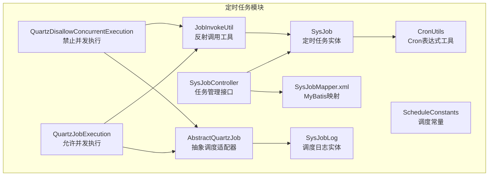
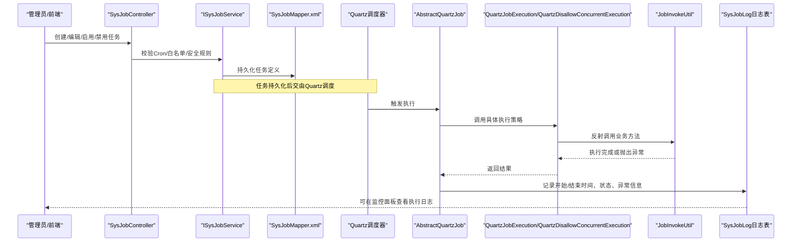
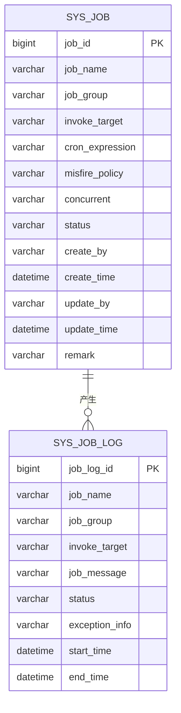
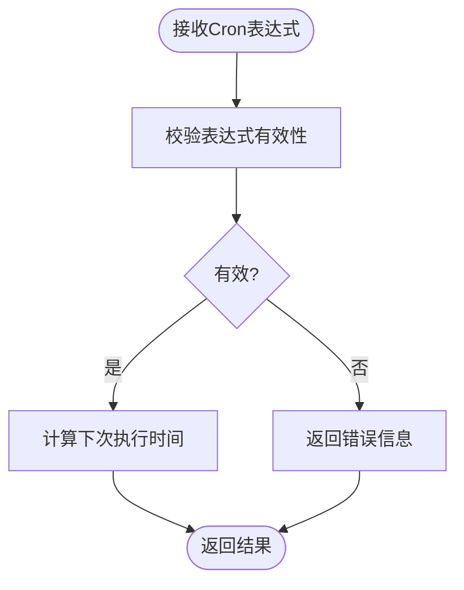
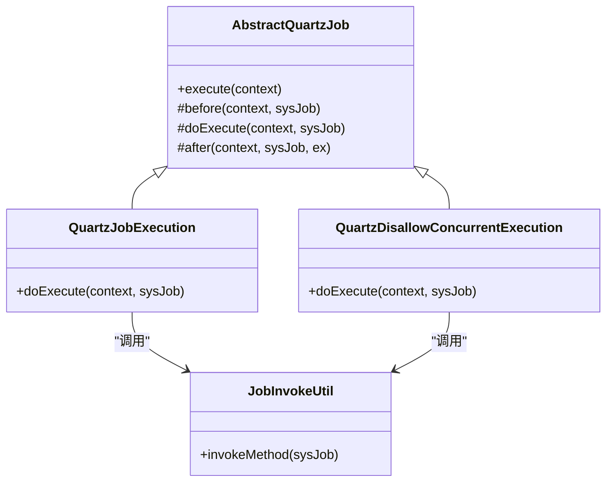
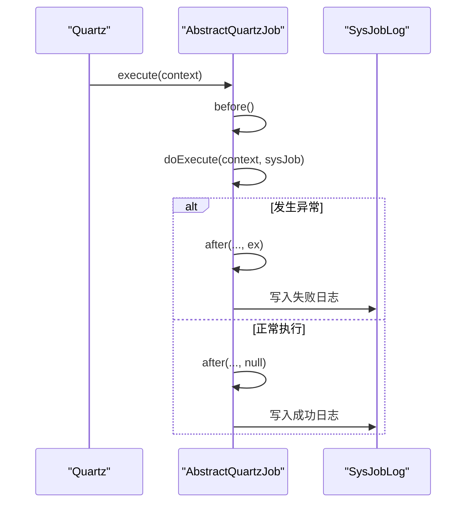
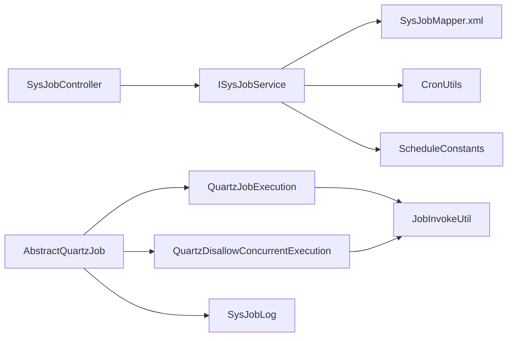

# 定时任务表设计

<cite>
**本文引用的文件**
- [SysJob.java](file://XingChen-Vue/xingchen-quartz/src/main/java/com/xingchen/quartz/domain/SysJob.java)
- [SysJobLog.java](file://XingChen-Vue/xingchen-quartz/src/main/java/com/xingchen/quartz/domain/SysJobLog.java)
- [AbstractQuartzJob.java](file://XingChen-Vue/xingchen-quartz/src/main/java/com/xingchen/quartz/util/AbstractQuartzJob.java)
- [QuartzJobExecution.java](file://XingChen-Vue/xingchen-quartz/src/main/java/com/xingchen/quartz/util/QuartzJobExecution.java)
- [QuartzDisallowConcurrentExecution.java](file://XingChen-Vue/xingchen-quartz/src/main/java/com/xingchen/quartz/util/QuartzDisallowConcurrentExecution.java)
- [JobInvokeUtil.java](file://XingChen-Vue/xingchen-quartz/src/main/java/com/xingchen/quartz/util/JobInvokeUtil.java)
- [CronUtils.java](file://XingChen-Vue/xingchen-quartz/src/main/java/com/xingchen/quartz/util/CronUtils.java)
- [ScheduleConstants.java](file://XingChen-Vue/xingchen-common/src/main/java/com/xingchen/common/constant/ScheduleConstants.java)
- [SysJobController.java](file://XingChen-Vue/xingchen-quartz/src/main/java/com/xingchen/quartz/controller/SysJobController.java)
- [SysJobMapper.xml](file://XingChen-Vue/xingchen-quartz/src/main/resources/mapper/quartz/SysJobMapper.xml)
</cite>

## 目录
1. [引言](#引言)
2. [项目结构](#项目结构)
3. [核心组件](#核心组件)
4. [架构总览](#架构总览)
5. [详细组件分析](#详细组件分析)
6. [依赖分析](#依赖分析)
7. [性能考虑](#性能考虑)
8. [故障排查指南](#故障排查指南)
9. [结论](#结论)
10. [附录](#附录)

## 引言
本文件围绕健康管理系统中的定时任务表设计进行深入解析，重点覆盖 sys_job 定时任务表的结构设计与调度机制实现。内容涵盖任务名称、任务组别、调度表达式（cron）、任务类全限定名、并发执行控制、任务状态、参数数据等字段的设计考量；并详细说明任务调度的核心机制：Cron 表达式的解析与执行、任务实例的并发控制策略、异常处理与日志记录、与 Quartz 调度框架的集成方式，以及典型业务场景下的配置与执行示例。

## 项目结构
定时任务模块位于 xingchen-quartz 子工程中，采用分层与职责分离的设计：
- 领域模型：SysJob、SysJobLog
- 调度适配：AbstractQuartzJob、QuartzJobExecution、QuartzDisallowConcurrentExecution
- 执行工具：JobInvokeUtil
- 工具类：CronUtils
- 控制器：SysJobController
- 数据访问：SysJobMapper.xml
- 常量：ScheduleConstants

图表来源
- [SysJob.java:1-172](file://XingChen-Vue/xingchen-quartz/src/main/java/com/xingchen/quartz/domain/SysJob.java#L1-L172)
- [SysJobLog.java:1-159](file://XingChen-Vue/xingchen-quartz/src/main/java/com/xingchen/quartz/domain/SysJobLog.java#L1-L159)
- [AbstractQuartzJob.java:1-107](file://XingChen-Vue/xingchen-quartz/src/main/java/com/xingchen/quartz/util/AbstractQuartzJob.java#L1-L107)
- [QuartzJobExecution.java:1-20](file://XingChen-Vue/xingchen-quartz/src/main/java/com/xingchen/quartz/util/QuartzJobExecution.java#L1-L20)
- [QuartzDisallowConcurrentExecution.java:1-22](file://XingChen-Vue/xingchen-quartz/src/main/java/com/xingchen/quartz/util/QuartzDisallowConcurrentExecution.java#L1-L22)
- [JobInvokeUtil.java:1-183](file://XingChen-Vue/xingchen-quartz/src/main/java/com/xingchen/quartz/util/JobInvokeUtil.java#L1-L183)
- [CronUtils.java:1-64](file://XingChen-Vue/xingchen-quartz/src/main/java/com/xingchen/quartz/util/CronUtils.java#L1-L64)
- [SysJobController.java:1-186](file://XingChen-Vue/xingchen-quartz/src/main/java/com/xingchen/quartz/controller/SysJobController.java#L1-L186)
- [SysJobMapper.xml:1-111](file://XingChen-Vue/xingchen-quartz/src/main/resources/mapper/quartz/SysJobMapper.xml#L1-L111)
- [ScheduleConstants.java:1-51](file://XingChen-Vue/xingchen-common/src/main/java/com/xingchen/common/constant/ScheduleConstants.java#L1-L51)

章节来源
- [SysJobController.java:1-186](file://XingChen-Vue/xingchen-quartz/src/main/java/com/xingchen/quartz/controller/SysJobController.java#L1-L186)
- [SysJobMapper.xml:1-111](file://XingChen-Vue/xingchen-quartz/src/main/resources/mapper/quartz/SysJobMapper.xml#L1-L111)

## 核心组件
- SysJob：系统定时任务实体，包含任务标识、名称、组别、调用目标字符串、Cron 表达式、错失触发策略、并发控制、状态等字段，并提供计算下一次执行时间的能力。
- SysJobLog：任务调度日志实体，记录任务执行的开始/结束时间、状态、日志信息、异常详情等。
- AbstractQuartzJob：Quartz 调度适配器，封装任务执行生命周期（前置、执行、收尾），并在收尾阶段写入调度日志。
- QuartzJobExecution / QuartzDisallowConcurrentExecution：两种执行策略的具体实现，前者允许并发，后者通过注解禁止并发。
- JobInvokeUtil：基于调用目标字符串反射执行业务方法，支持多种参数类型解析。
- CronUtils：Cron 表达式校验、错误信息获取、下一次执行时间计算。
- ScheduleConstants：调度相关常量定义（错失触发策略、状态枚举等）。
- SysJobController：对外提供定时任务的增删改查、状态切换、立即执行等接口。
- SysJobMapper.xml：MyBatis 映射，负责 sys_job 的查询、插入、更新、删除。

章节来源
- [SysJob.java:1-172](file://XingChen-Vue/xingchen-quartz/src/main/java/com/xingchen/quartz/domain/SysJob.java#L1-L172)
- [SysJobLog.java:1-159](file://XingChen-Vue/xingchen-quartz/src/main/java/com/xingchen/quartz/domain/SysJobLog.java#L1-L159)
- [AbstractQuartzJob.java:1-107](file://XingChen-Vue/xingchen-quartz/src/main/java/com/xingchen/quartz/util/AbstractQuartzJob.java#L1-L107)
- [QuartzJobExecution.java:1-20](file://XingChen-Vue/xingchen-quartz/src/main/java/com/xingchen/quartz/util/QuartzJobExecution.java#L1-L20)
- [QuartzDisallowConcurrentExecution.java:1-22](file://XingChen-Vue/xingchen-quartz/src/main/java/com/xingchen/quartz/util/QuartzDisallowConcurrentExecution.java#L1-L22)
- [JobInvokeUtil.java:1-183](file://XingChen-Vue/xingchen-quartz/src/main/java/com/xingchen/quartz/util/JobInvokeUtil.java#L1-L183)
- [CronUtils.java:1-64](file://XingChen-Vue/xingchen-quartz/src/main/java/com/xingchen/quartz/util/CronUtils.java#L1-L64)
- [ScheduleConstants.java:1-51](file://XingChen-Vue/xingchen-common/src/main/java/com/xingchen/common/constant/ScheduleConstants.java#L1-L51)
- [SysJobController.java:1-186](file://XingChen-Vue/xingchen-quartz/src/main/java/com/xingchen/quartz/controller/SysJobController.java#L1-L186)
- [SysJobMapper.xml:1-111](file://XingChen-Vue/xingchen-quartz/src/main/resources/mapper/quartz/SysJobMapper.xml#L1-L111)

## 架构总览
定时任务从“任务定义”到“执行与日志”的整体流程如下：

图表来源
- [SysJobController.java:1-186](file://XingChen-Vue/xingchen-quartz/src/main/java/com/xingchen/quartz/controller/SysJobController.java#L1-L186)
- [AbstractQuartzJob.java:1-107](file://XingChen-Vue/xingchen-quartz/src/main/java/com/xingchen/quartz/util/AbstractQuartzJob.java#L1-L107)
- [QuartzJobExecution.java:1-20](file://XingChen-Vue/xingchen-quartz/src/main/java/com/xingchen/quartz/util/QuartzJobExecution.java#L1-L20)
- [QuartzDisallowConcurrentExecution.java:1-22](file://XingChen-Vue/xingchen-quartz/src/main/java/com/xingchen/quartz/util/QuartzDisallowConcurrentExecution.java#L1-L22)
- [JobInvokeUtil.java:1-183](file://XingChen-Vue/xingchen-quartz/src/main/java/com/xingchen/quartz/util/JobInvokeUtil.java#L1-L183)
- [SysJobMapper.xml:1-111](file://XingChen-Vue/xingchen-quartz/src/main/resources/mapper/quartz/SysJobMapper.xml#L1-L111)

## 详细组件分析

### 数据模型与字段设计
- 任务标识与元数据
  - jobId：主键
  - jobName：任务名称，用于展示与检索
  - jobGroup：任务组别，便于分类与批量管理
  - remark：备注
  - createBy/updateBy/createTime/updateTime：审计字段
- 调度与执行
  - invokeTarget：调用目标字符串，支持“Bean名称.方法(参数...)”或“全限定类名.方法(参数...)”，参数类型自动识别
  - cronExpression：Cron 表达式，用于精确控制执行节奏
  - misfirePolicy：错失触发策略（默认、忽略错失、触发一次、不触发）
  - concurrent：并发控制（0允许、1禁止）
  - status：任务状态（0正常、1暂停）
- 日志与追踪
  - SysJobLog 包含任务名称/组别/调用目标、开始/结束时间、状态、异常信息、执行耗时等

图表来源
- [SysJob.java:1-172](file://XingChen-Vue/xingchen-quartz/src/main/java/com/xingchen/quartz/domain/SysJob.java#L1-L172)
- [SysJobLog.java:1-159](file://XingChen-Vue/xingchen-quartz/src/main/java/com/xingchen/quartz/domain/SysJobLog.java#L1-L159)
- [SysJobMapper.xml:1-111](file://XingChen-Vue/xingchen-quartz/src/main/resources/mapper/quartz/SysJobMapper.xml#L1-L111)

章节来源
- [SysJob.java:1-172](file://XingChen-Vue/xingchen-quartz/src/main/java/com/xingchen/quartz/domain/SysJob.java#L1-L172)
- [SysJobLog.java:1-159](file://XingChen-Vue/xingchen-quartz/src/main/java/com/xingchen/quartz/domain/SysJobLog.java#L1-L159)
- [SysJobMapper.xml:1-111](file://XingChen-Vue/xingchen-quartz/src/main/resources/mapper/quartz/SysJobMapper.xml#L1-L111)

### Cron 表达式解析与执行
- 表达式校验：通过 CronUtils 对输入表达式进行有效性检查与错误信息提取
- 下次执行时间：根据当前时间推导下一次有效执行时间，用于展示与排程
- 错失触发策略：SysJob 中的 misfirePolicy 字段对应 ScheduleConstants 中的策略常量，影响调度器在错过触发时机时的行为

图表来源
- [CronUtils.java:1-64](file://XingChen-Vue/xingchen-quartz/src/main/java/com/xingchen/quartz/util/CronUtils.java#L1-L64)
- [SysJob.java:113-121](file://XingChen-Vue/xingchen-quartz/src/main/java/com/xingchen/quartz/domain/SysJob.java#L113-L121)
- [ScheduleConstants.java:15-25](file://XingChen-Vue/xingchen-common/src/main/java/com/xingchen/common/constant/ScheduleConstants.java#L15-L25)

章节来源
- [CronUtils.java:1-64](file://XingChen-Vue/xingchen-quartz/src/main/java/com/xingchen/quartz/util/CronUtils.java#L1-L64)
- [SysJob.java:113-121](file://XingChen-Vue/xingchen-quartz/src/main/java/com/xingchen/quartz/domain/SysJob.java#L113-L121)
- [ScheduleConstants.java:15-25](file://XingChen-Vue/xingchen-common/src/main/java/com/xingchen/common/constant/ScheduleConstants.java#L15-L25)

### 并发控制策略
- 允许并发：QuartzJobExecution 继承自 AbstractQuartzJob，直接调用 JobInvokeUtil 执行业务方法
- 禁止并发：QuartzDisallowConcurrentExecution 使用 @DisallowConcurrentExecution 注解，确保同一任务实例不会被并发执行
- concurrent 字段：SysJob 中 concurrent 控制是否允许并发，结合 Quartz 注解共同生效

图表来源
- [AbstractQuartzJob.java:1-107](file://XingChen-Vue/xingchen-quartz/src/main/java/com/xingchen/quartz/util/AbstractQuartzJob.java#L1-L107)
- [QuartzJobExecution.java:1-20](file://XingChen-Vue/xingchen-quartz/src/main/java/com/xingchen/quartz/util/QuartzJobExecution.java#L1-L20)
- [QuartzDisallowConcurrentExecution.java:1-22](file://XingChen-Vue/xingchen-quartz/src/main/java/com/xingchen/quartz/util/QuartzDisallowConcurrentExecution.java#L1-L22)
- [JobInvokeUtil.java:1-183](file://XingChen-Vue/xingchen-quartz/src/main/java/com/xingchen/quartz/util/JobInvokeUtil.java#L1-L183)

章节来源
- [QuartzJobExecution.java:1-20](file://XingChen-Vue/xingchen-quartz/src/main/java/com/xingchen/quartz/util/QuartzJobExecution.java#L1-L20)
- [QuartzDisallowConcurrentExecution.java:1-22](file://XingChen-Vue/xingchen-quartz/src/main/java/com/xingchen/quartz/util/QuartzDisallowConcurrentExecution.java#L1-L22)
- [AbstractQuartzJob.java:1-107](file://XingChen-Vue/xingchen-quartz/src/main/java/com/xingchen/quartz/util/AbstractQuartzJob.java#L1-L107)
- [JobInvokeUtil.java:1-183](file://XingChen-Vue/xingchen-quartz/src/main/java/com/xingchen/quartz/util/JobInvokeUtil.java#L1-L183)

### 任务执行与日志记录
- 生命周期钩子：before 在执行前记录开始时间；after 在执行后统一收集状态、异常、耗时，并写入 SysJobLog
- 异常处理：捕获执行过程中的异常，截取异常信息并标记为失败状态
- 日志字段：包含任务名称/组别/调用目标、开始/结束时间、状态、异常详情、执行耗时

图表来源
- [AbstractQuartzJob.java:1-107](file://XingChen-Vue/xingchen-quartz/src/main/java/com/xingchen/quartz/util/AbstractQuartzJob.java#L1-L107)
- [SysJobLog.java:1-159](file://XingChen-Vue/xingchen-quartz/src/main/java/com/xingchen/quartz/domain/SysJobLog.java#L1-L159)

章节来源
- [AbstractQuartzJob.java:1-107](file://XingChen-Vue/xingchen-quartz/src/main/java/com/xingchen/quartz/util/AbstractQuartzJob.java#L1-L107)
- [SysJobLog.java:1-159](file://XingChen-Vue/xingchen-quartz/src/main/java/com/xingchen/quartz/domain/SysJobLog.java#L1-L159)

### 接口与安全控制
- SysJobController 提供任务的增删改查、状态切换、立即执行等能力
- 安全校验：对 Cron 表达式、调用目标字符串进行合法性校验，禁止危险协议与违规关键字，支持白名单机制
- 权限控制：使用注解保护接口，确保仅授权用户可操作定时任务

章节来源
- [SysJobController.java:1-186](file://XingChen-Vue/xingchen-quartz/src/main/java/com/xingchen/quartz/controller/SysJobController.java#L1-L186)

### 数据持久化与查询
- SysJobMapper.xml 提供完整的 CRUD 语句，支持按任务名、组别、状态、调用目标等条件查询
- 插入/更新时自动填充审计字段与时间戳

章节来源
- [SysJobMapper.xml:1-111](file://XingChen-Vue/xingchen-quartz/src/main/resources/mapper/quartz/SysJobMapper.xml#L1-L111)

## 依赖分析
- 组件耦合
  - AbstractQuartzJob 作为适配层，向上依赖 SysJob，向下依赖具体执行实现与日志服务
  - QuartzJobExecution/QuartzDisallowConcurrentExecution 依赖 JobInvokeUtil 进行反射调用
  - SysJobController 依赖 ISysJobService 与 CronUtils/ScheduleUtils 进行业务编排与校验
- 外部依赖
  - Quartz：提供调度器、并发控制注解、Cron 表达式解析
  - Spring：通过 SpringUtils 获取 Bean，完成依赖注入与调用
  - MyBatis：SysJobMapper.xml 实现数据持久化

图表来源
- [SysJobController.java:1-186](file://XingChen-Vue/xingchen-quartz/src/main/java/com/xingchen/quartz/controller/SysJobController.java#L1-L186)
- [AbstractQuartzJob.java:1-107](file://XingChen-Vue/xingchen-quartz/src/main/java/com/xingchen/quartz/util/AbstractQuartzJob.java#L1-L107)
- [QuartzJobExecution.java:1-20](file://XingChen-Vue/xingchen-quartz/src/main/java/com/xingchen/quartz/util/QuartzJobExecution.java#L1-L20)
- [QuartzDisallowConcurrentExecution.java:1-22](file://XingChen-Vue/xingchen-quartz/src/main/java/com/xingchen/quartz/util/QuartzDisallowConcurrentExecution.java#L1-L22)
- [JobInvokeUtil.java:1-183](file://XingChen-Vue/xingchen-quartz/src/main/java/com/xingchen/quartz/util/JobInvokeUtil.java#L1-L183)
- [SysJobMapper.xml:1-111](file://XingChen-Vue/xingchen-quartz/src/main/resources/mapper/quartz/SysJobMapper.xml#L1-L111)
- [ScheduleConstants.java:1-51](file://XingChen-Vue/xingchen-common/src/main/java/com/xingchen/common/constant/ScheduleConstants.java#L1-L51)

章节来源
- [SysJobController.java:1-186](file://XingChen-Vue/xingchen-quartz/src/main/java/com/xingchen/quartz/controller/SysJobController.java#L1-L186)
- [AbstractQuartzJob.java:1-107](file://XingChen-Vue/xingchen-quartz/src/main/java/com/xingchen/quartz/util/AbstractQuartzJob.java#L1-L107)
- [QuartzJobExecution.java:1-20](file://XingChen-Vue/xingchen-quartz/src/main/java/com/xingchen/quartz/util/QuartzJobExecution.java#L1-L20)
- [QuartzDisallowConcurrentExecution.java:1-22](file://XingChen-Vue/xingchen-quartz/src/main/java/com/xingchen/quartz/util/QuartzDisallowConcurrentExecution.java#L1-L22)
- [JobInvokeUtil.java:1-183](file://XingChen-Vue/xingchen-quartz/src/main/java/com/xingchen/quartz/util/JobInvokeUtil.java#L1-L183)
- [SysJobMapper.xml:1-111](file://XingChen-Vue/xingchen-quartz/src/main/resources/mapper/quartz/SysJobMapper.xml#L1-L111)
- [ScheduleConstants.java:1-51](file://XingChen-Vue/xingchen-common/src/main/java/com/xingchen/common/constant/ScheduleConstants.java#L1-L51)

## 性能考虑
- 并发控制：对于高耗时或资源敏感任务，建议设置 concurrent=1，避免并发竞争导致的资源争用与数据不一致
- Cron 策略：合理选择 misfirePolicy，避免大量错失触发造成堆积
- 反射调用：JobInvokeUtil 通过反射调用业务方法，建议在 invokeTarget 中尽量使用 Spring Bean 名称，减少类加载开销
- 日志写入：每次执行均写入日志，建议对高频任务开启异步日志或限流策略，降低 IO 压力

## 故障排查指南
- Cron 表达式无效
  - 现象：创建/编辑任务时报错，提示表达式不正确
  - 处理：使用 CronUtils 校验表达式，修正语法后重试
- 调用目标字符串违规
  - 现象：报错提示目标字符串包含不允许的协议或关键字
  - 处理：检查 invokeTarget，移除危险协议与关键字，确保在白名单内
- 任务未执行或重复执行
  - 现象：任务状态异常、日志缺失或并发冲突
  - 处理：核对 concurrent 与 Quartz 注解配置；检查 misfirePolicy；查看 SysJobLog 状态与异常信息
- 立即执行失败
  - 现象：调用“立即执行”接口返回失败
  - 处理：确认任务是否存在且未过期；检查业务方法是否可被反射调用

章节来源
- [SysJobController.java:83-147](file://XingChen-Vue/xingchen-quartz/src/main/java/com/xingchen/quartz/controller/SysJobController.java#L83-L147)
- [CronUtils.java:21-43](file://XingChen-Vue/xingchen-quartz/src/main/java/com/xingchen/quartz/util/CronUtils.java#L21-L43)
- [AbstractQuartzJob.java:46-50](file://XingChen-Vue/xingchen-quartz/src/main/java/com/xingchen/quartz/util/AbstractQuartzJob.java#L46-L50)

## 结论
sys_job 定时任务表与 Quartz 调度框架紧密结合，通过 SysJob 定义任务、CronUtils 校验表达式、AbstractQuartzJob 统一日志与生命周期管理、JobInvokeUtil 实现灵活的反射调用，形成了稳定、可扩展的定时任务体系。配合 SysJobLog 的完整记录与 SysJobController 的安全校验，能够满足健康数据统计、积分结算、系统清理等业务场景的多样化需求。

## 附录

### 典型业务场景与配置要点
- 健康数据统计
  - Cron：按日/周/月固定时间触发
  - concurrent：建议 1，避免重复统计
  - invokeTarget：指向统计服务的统计方法
- 积分结算
  - Cron：按自然日或周期性触发
  - concurrent：建议 1，保证幂等与一致性
  - invokeTarget：指向结算服务的结算方法
- 系统清理
  - Cron：按小时/天触发
  - concurrent：建议 1，避免清理过程中读写冲突
  - invokeTarget：指向清理服务的方法

### 字段设计考量摘要
- 任务名称与组别：便于检索与分组管理
- 调用目标字符串：支持 Bean 名称与全限定类名，参数类型自动识别
- Cron 表达式：精确控制执行节奏，结合 misfirePolicy 优化错失处理
- 并发控制：通过 concurrent 与 Quartz 注解双重保障
- 状态与审计：status 与标准审计字段便于运维与合规