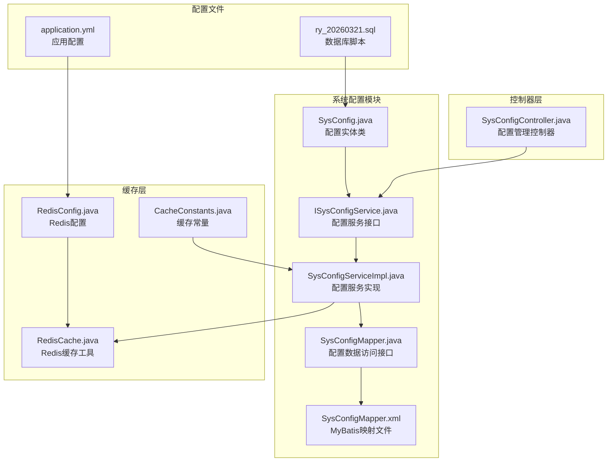
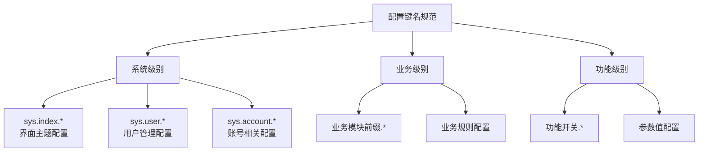
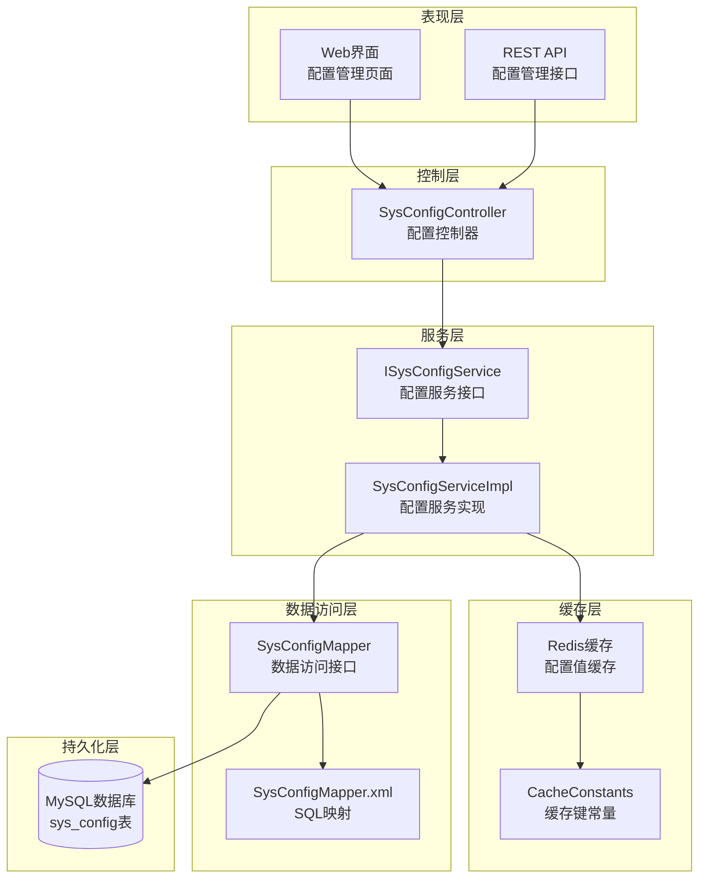
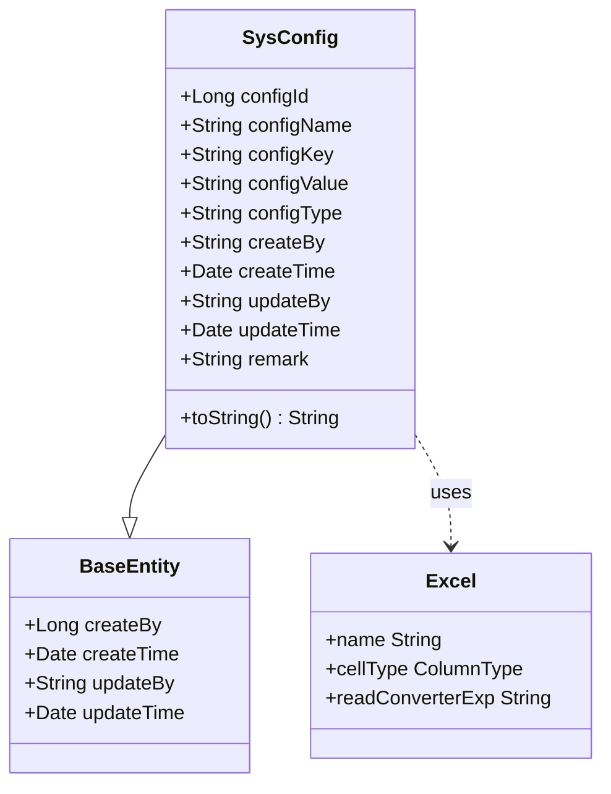
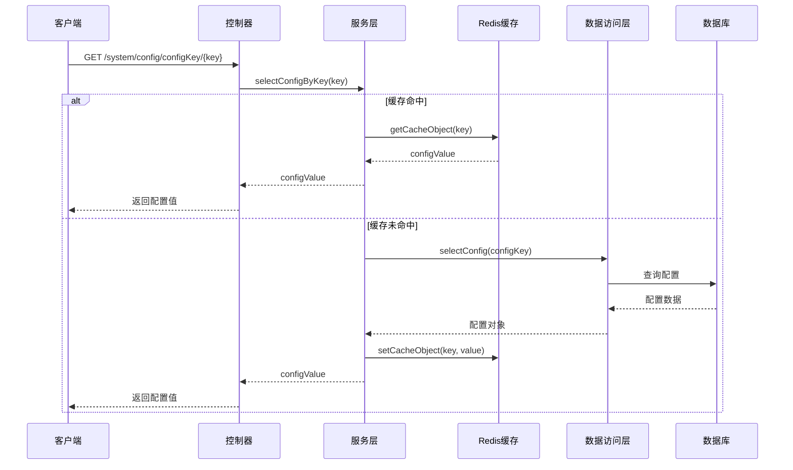
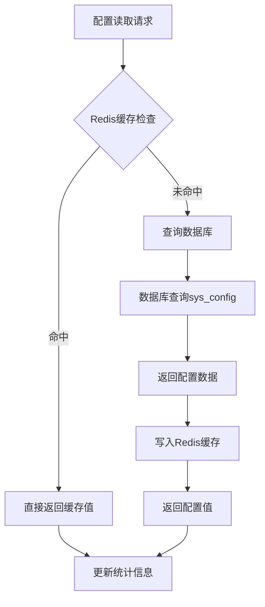
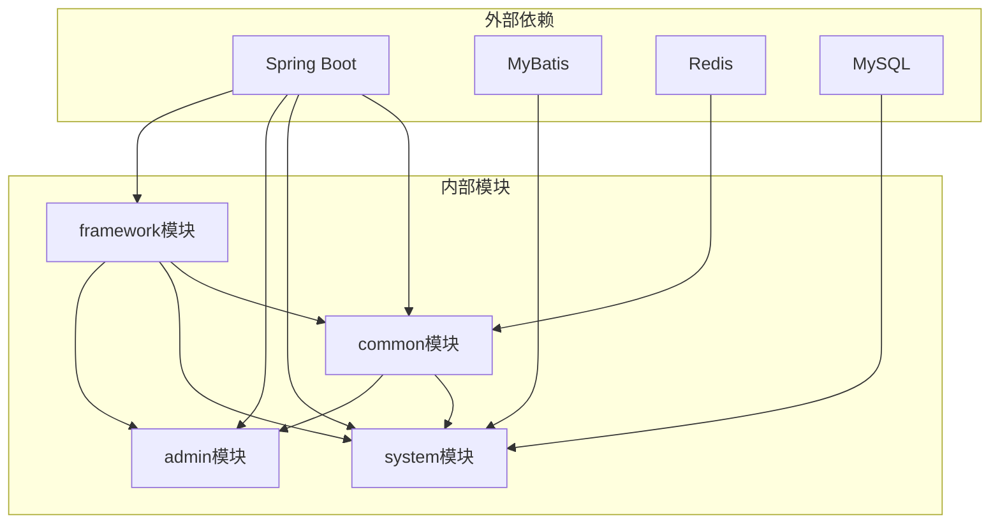
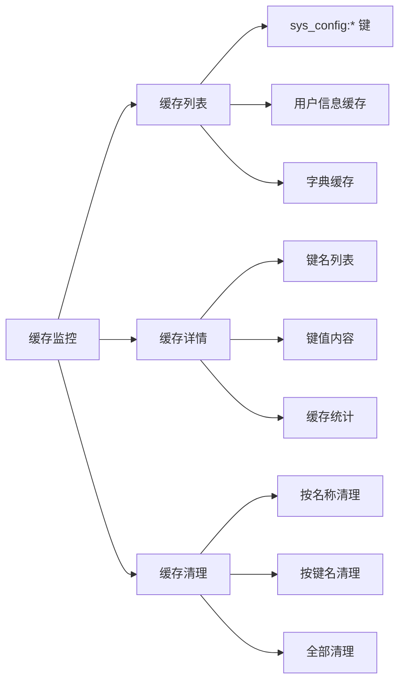

# 系统配置表设计

<cite>
**本文档引用的文件**
- [SysConfig.java](file://XingChen-Vue/xingchen-system/src/main/java/com/xingchen/system/domain/SysConfig.java)
- [ISysConfigService.java](file://XingChen-Vue/xingchen-system/src/main/java/com/xingchen/system/service/ISysConfigService.java)
- [SysConfigServiceImpl.java](file://XingChen-Vue/xingchen-system/src/main/java/com/xingchen/system/service/impl/SysConfigServiceImpl.java)
- [SysConfigMapper.java](file://XingChen-Vue/xingchen-system/src/main/java/com/xingchen/system/mapper/SysConfigMapper.java)
- [SysConfigMapper.xml](file://XingChen-Vue/xingchen-system/src/main/resources/mapper/system/SysConfigMapper.xml)
- [SysConfigController.java](file://XingChen-Vue/xingchen-admin/src/main/java/com/xingchen/web/controller/system/SysConfigController.java)
- [CacheConstants.java](file://XingChen-Vue/xingchen-common/src/main/java/com/xingchen/common/constant/CacheConstants.java)
- [RedisCache.java](file://XingChen-Vue/xingchen-common/src/main/java/com/xingchen/common/core/redis/RedisCache.java)
- [UserConstants.java](file://XingChen-Vue/xingchen-common/src/main/java/com/xingchen/common/constant/UserConstants.java)
- [CacheController.java](file://XingChen-Vue/xingchen-admin/src/main/java/com/xingchen/web/controller/monitor/CacheController.java)
- [RedisConfig.java](file://XingChen-Vue/xingchen-framework/src/main/java/com/xingchen/framework/config/RedisConfig.java)
- [application.yml](file://XingChen-Vue/xingchen-admin/src/main/resources/application.yml)
- [ry_20260321.sql](file://XingChen-Vue/sql/ry_20260321.sql)
</cite>

## 目录
1. [简介](#简介)
2. [项目结构](#项目结构)
3. [核心组件](#核心组件)
4. [架构概览](#架构概览)
5. [详细组件分析](#详细组件分析)
6. [依赖关系分析](#依赖关系分析)
7. [性能考虑](#性能考虑)
8. [故障排除指南](#故障排除指南)
9. [结论](#结论)
10. [附录](#附录)

## 简介

sys_config系统参数配置表是健康管理系统的核心配置管理组件，负责存储和管理系统的各种运行时配置参数。该表设计遵循了现代企业级应用的最佳实践，提供了完整的配置生命周期管理，包括配置项的创建、查询、更新、删除以及动态缓存管理。

系统配置表的设计重点在于：
- **动态配置更新机制**：支持运行时配置的热更新，无需重启服务
- **缓存策略优化**：采用Redis缓存提升配置读取性能
- **分类管理**：通过配置键名的命名规范实现逻辑分类
- **安全控制**：内置参数保护机制，防止关键配置被误删
- **扩展性设计**：支持新配置项的灵活添加和业务规则配置

## 项目结构

系统配置相关的核心文件分布如下：

**图表来源**
- [SysConfig.java:1-99](file://XingChen-Vue/xingchen-system/src/main/java/com/xingchen/system/domain/SysConfig.java#L1-L99)
- [ISysConfigService.java:1-89](file://XingChen-Vue/xingchen-system/src/main/java/com/xingchen/system/service/ISysConfigService.java#L1-L89)
- [SysConfigServiceImpl.java:1-230](file://XingChen-Vue/xingchen-system/src/main/java/com/xingchen/system/service/impl/SysConfigServiceImpl.java#L1-L230)
- [SysConfigMapper.java:1-76](file://XingChen-Vue/xingchen-system/src/main/java/com/xingchen/system/mapper/SysConfigMapper.java#L1-L76)
- [SysConfigMapper.xml:1-117](file://XingChen-Vue/xingchen-system/src/main/resources/mapper/system/SysConfigMapper.xml#L1-L117)

**章节来源**
- [SysConfig.java:1-99](file://XingChen-Vue/xingchen-system/src/main/java/com/xingchen/system/domain/SysConfig.java#L1-L99)
- [SysConfigServiceImpl.java:1-230](file://XingChen-Vue/xingchen-system/src/main/java/com/xingchen/system/service/impl/SysConfigServiceImpl.java#L1-L230)

## 核心组件

### 数据模型设计

sys_config表采用标准的关系型数据库设计，包含以下核心字段：

| 字段名 | 类型 | 约束 | 描述 | 设计原则 |
|--------|------|------|------|----------|
| config_id | int | 主键, 自增 | 参数主键 | 唯一标识每个配置项 |
| config_name | varchar(100) | 非空 | 参数名称 | 人类可读的配置描述 |
| config_key | varchar(100) | 非空, 唯一 | 参数键名 | 系统识别的配置标识符 |
| config_value | varchar(500) | 非空 | 参数键值 | 实际的配置值内容 |
| config_type | char(1) | 默认'N'| 系统内置标识 | Y=内置,N=用户自定义 |
| create_by | varchar(64) | | 创建者 | 操作审计追踪 |
| create_time | datetime | | 创建时间 | 时间戳记录 |
| update_by | varchar(64) | | 更新者 | 操作审计追踪 |
| update_time | datetime | | 更新时间 | 时间戳记录 |
| remark | varchar(500) | | 备注说明 | 配置用途说明 |

### 配置键名设计规范

系统采用层次化的配置键名命名规范，确保配置项的逻辑分类和易于管理：

**图表来源**
- [ry_20260321.sql:548-556](file://XingChen-Vue/sql/ry_20260321.sql#L548-L556)

**章节来源**
- [ry_20260321.sql:534-546](file://XingChen-Vue/sql/ry_20260321.sql#L534-L546)

## 架构概览

系统配置架构采用分层设计，实现了配置数据的持久化存储、内存缓存和业务逻辑分离：

**图表来源**
- [SysConfigController.java:30-134](file://XingChen-Vue/xingchen-admin/src/main/java/com/xingchen/web/controller/system/SysConfigController.java#L30-L134)
- [SysConfigServiceImpl.java:23-230](file://XingChen-Vue/xingchen-system/src/main/java/com/xingchen/system/service/impl/SysConfigServiceImpl.java#L23-L230)
- [CacheConstants.java:8-44](file://XingChen-Vue/xingchen-common/src/main/java/com/xingchen/common/constant/CacheConstants.java#L8-L44)

## 详细组件分析

### 配置实体类设计

SysConfig实体类采用JPA注解和Apache Commons Lang库，提供了完整的配置数据封装：

**图表来源**
- [SysConfig.java:16-99](file://XingChen-Vue/xingchen-system/src/main/java/com/xingchen/system/domain/SysConfig.java#L16-L99)

### 配置服务层实现

配置服务层实现了完整的配置生命周期管理，包括缓存管理和事务控制：

**图表来源**
- [SysConfigServiceImpl.java:62-78](file://XingChen-Vue/xingchen-system/src/main/java/com/xingchen/system/service/impl/SysConfigServiceImpl.java#L62-L78)
- [SysConfigController.java:72-76](file://XingChen-Vue/xingchen-admin/src/main/java/com/xingchen/web/controller/system/SysConfigController.java#L72-L76)

### 缓存策略设计

系统采用Redis作为配置缓存，实现了高性能的配置读取：

**图表来源**
- [SysConfigServiceImpl.java:62-78](file://XingChen-Vue/xingchen-system/src/main/java/com/xingchen/system/service/impl/SysConfigServiceImpl.java#L62-L78)
- [CacheConstants.java:22-23](file://XingChen-Vue/xingchen-common/src/main/java/com/xingchen/common/constant/CacheConstants.java#L22-L23)

**章节来源**
- [SysConfigServiceImpl.java:171-199](file://XingChen-Vue/xingchen-system/src/main/java/com/xingchen/system/service/impl/SysConfigServiceImpl.java#L171-L199)

### 配置控制器设计

配置控制器提供了完整的REST API接口，支持所有标准的CRUD操作：

| HTTP方法 | 端点 | 权限 | 功能描述 |
|----------|------|------|----------|
| GET | /system/config/list | system:config:list | 获取配置列表 |
| GET | /system/config/{configId} | system:config:query | 根据ID获取配置详情 |
| GET | /system/config/configKey/{configKey} | system:config:query | 根据键名获取配置值 |
| POST | /system/config | system:config:add | 新增配置 |
| PUT | /system/config | system:config:edit | 修改配置 |
| DELETE | /system/config/{configIds} | system:config:remove | 删除配置 |
| DELETE | /system/config/refreshCache | system:config:remove | 刷新配置缓存 |

**章节来源**
- [SysConfigController.java:37-133](file://XingChen-Vue/xingchen-admin/src/main/java/com/xingchen/web/controller/system/SysConfigController.java#L37-L133)

## 依赖关系分析

系统配置模块的依赖关系体现了清晰的分层架构：

**图表来源**
- [RedisConfig.java:18-35](file://XingChen-Vue/xingchen-framework/src/main/java/com/xingchen/framework/config/RedisConfig.java#L18-L35)
- [application.yml:72-94](file://XingChen-Vue/xingchen-admin/src/main/resources/application.yml#L72-L94)

**章节来源**
- [RedisConfig.java:1-35](file://XingChen-Vue/xingchen-framework/src/main/java/com/xingchen/framework/config/RedisConfig.java#L1-L35)
- [application.yml:1-148](file://XingChen-Vue/xingchen-admin/src/main/resources/application.yml#L1-L148)

## 性能考虑

### 缓存性能优化

系统配置缓存采用了多级优化策略：

1. **延迟加载机制**：应用启动时仅加载必要的配置，其他配置按需加载
2. **批量预加载**：系统启动时自动加载所有配置到Redis缓存
3. **智能过期策略**：配置变更时自动失效相关缓存键
4. **内存优化**：使用StringRedisSerializer优化Redis存储空间

### 数据库性能优化

1. **索引设计**：config_key字段建立唯一索引，确保查询性能
2. **查询优化**：MyBatis映射文件使用动态SQL，避免不必要的字段传输
3. **连接池配置**：合理配置数据库连接池参数，提升并发性能

### 缓存监控

系统提供了完整的缓存监控功能，包括：

**图表来源**
- [CacheController.java:37-46](file://XingChen-Vue/xingchen-admin/src/main/java/com/xingchen/web/controller/monitor/CacheController.java#L37-L46)

**章节来源**
- [CacheController.java:1-122](file://XingChen-Vue/xingchen-admin/src/main/java/com/xingchen/web/controller/monitor/CacheController.java#L1-L122)

## 故障排除指南

### 常见问题及解决方案

#### 配置读取失败
**问题现象**：系统无法读取配置值，返回空值
**可能原因**：
1. Redis服务异常
2. 配置键不存在
3. 缓存同步问题

**解决步骤**：
1. 检查Redis连接状态
2. 验证配置键是否存在
3. 执行缓存刷新操作

#### 配置更新不生效
**问题现象**：修改配置后系统仍使用旧值
**可能原因**：
1. 缓存未及时更新
2. 多实例缓存不同步
3. 配置键名冲突

**解决步骤**：
1. 调用刷新缓存接口
2. 检查多实例配置一致性
3. 验证配置键名唯一性

#### 内置参数保护
**问题现象**：尝试删除内置配置参数时报错
**解决步骤**：
1. 检查config_type字段是否为'Y'
2. 内置参数不允许删除，需要修改值而非删除
3. 如需调整内置参数，联系系统管理员

**章节来源**
- [SysConfigServiceImpl.java:154-166](file://XingChen-Vue/xingchen-system/src/main/java/com/xingchen/system/service/impl/SysConfigServiceImpl.java#L154-L166)
- [UserConstants.java:39-40](file://XingChen-Vue/xingchen-common/src/main/java/com/xingchen/common/constant/UserConstants.java#L39-L40)

## 结论

sys_config系统配置表设计体现了现代企业级应用的优秀实践，具有以下特点：

### 设计优势
1. **高可用性**：采用Redis缓存和数据库双层存储，确保配置访问的可靠性
2. **高性能**：缓存命中率高，查询响应速度快
3. **安全性**：内置参数保护机制，防止关键配置被误删
4. **可扩展性**：支持新配置项的灵活添加，满足业务发展需求
5. **可观测性**：完整的缓存监控和配置审计功能

### 应用价值
- **运维效率提升**：支持运行时配置热更新，无需重启服务
- **业务灵活性增强**：通过配置项快速调整系统行为
- **成本控制优化**：减少因配置变更导致的系统维护成本
- **用户体验改善**：通过配置优化系统性能和稳定性

该设计为健康管理系统提供了坚实的配置管理基础，支持系统的持续演进和业务扩展。

## 附录

### 配置项分类参考

系统预置的配置项主要分为以下几类：

1. **界面主题配置** (`sys.index.*`)
   - 皮肤样式配置
   - 主题颜色设置
   - 布局样式配置

2. **用户管理配置** (`sys.user.*`)
   - 用户注册策略
   - 密码安全策略
   - 用户权限配置

3. **账号安全配置** (`sys.account.*`)
   - 验证码开关
   - 登录限制配置
   - 密码策略配置

4. **系统功能配置** (`sys.login.*`)
   - 登录功能配置
   - 黑名单管理
   - 访问控制策略

### 最佳实践建议

1. **配置命名规范**
   - 使用清晰的层次化命名
   - 避免使用特殊字符
   - 保持配置键名的一致性

2. **配置版本管理**
   - 变更配置时添加备注说明
   - 定期备份重要配置
   - 建立配置变更审批流程

3. **性能监控**
   - 定期检查缓存命中率
   - 监控Redis内存使用情况
   - 关注配置查询性能指标