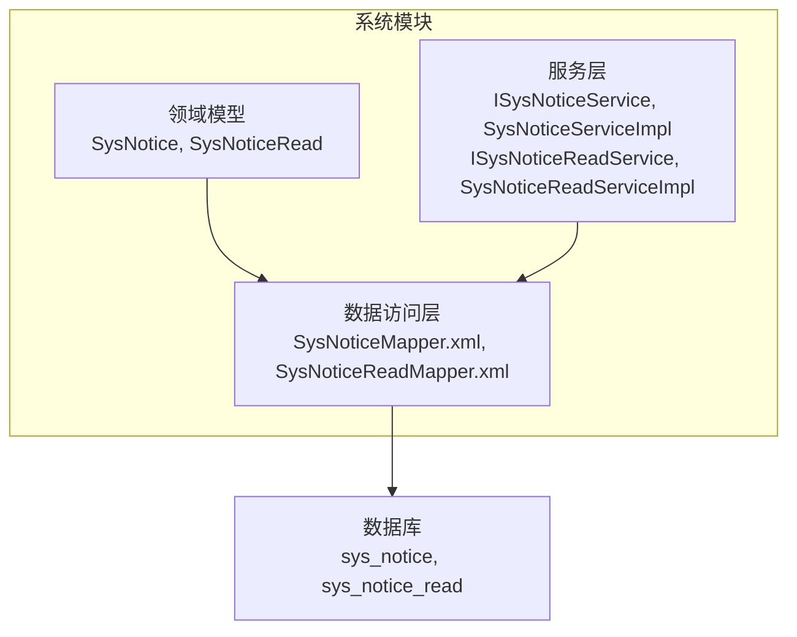
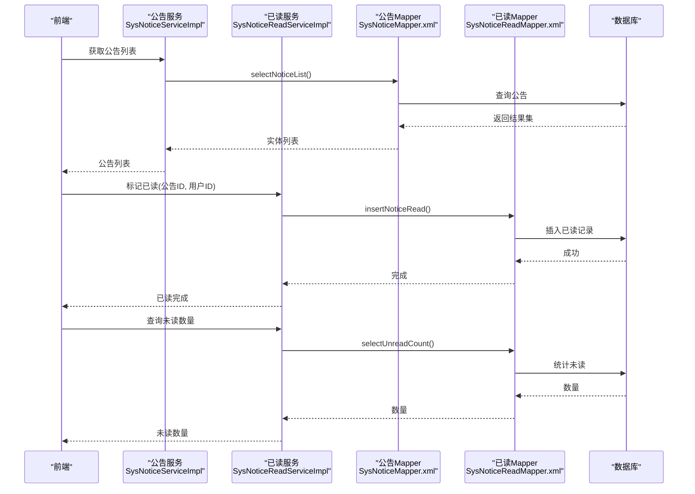
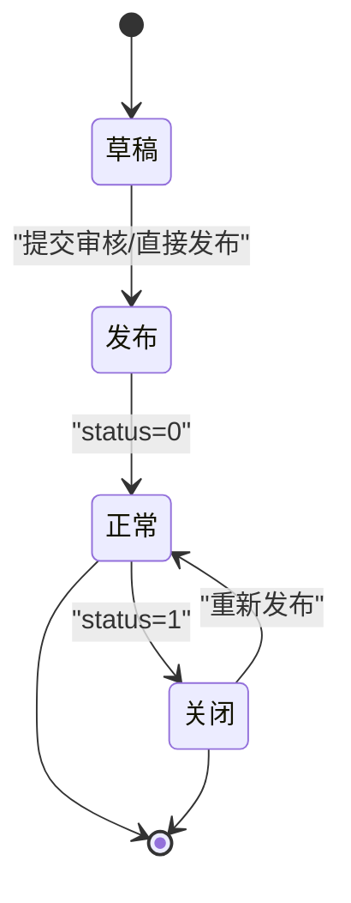
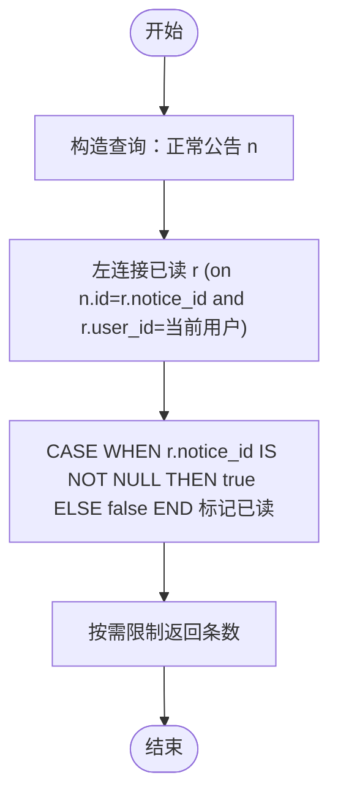
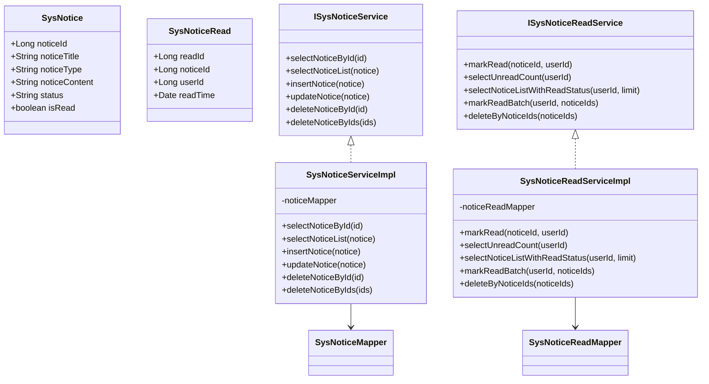

# 通知公告表设计

<cite>
**本文引用的文件**
- [ry_20260321.sql](file://XingChen-Vue/sql/ry_20260321.sql)
- [SysNotice.java](file://XingChen-Vue/xingchen-system/src/main/java/com/xingchen/system/domain/SysNotice.java)
- [SysNoticeRead.java](file://XingChen-Vue/xingchen-system/src/main/java/com/xingchen/system/domain/SysNoticeRead.java)
- [SysNoticeMapper.java](file://XingChen-Vue/xingchen-system/src/main/java/com/xingchen/system/mapper/SysNoticeMapper.java)
- [SysNoticeMapper.xml](file://XingChen-Vue/xingchen-system/src/main/resources/mapper/system/SysNoticeMapper.xml)
- [SysNoticeServiceImpl.java](file://XingChen-Vue/xingchen-system/src/main/java/com/xingchen/system/service/impl/SysNoticeServiceImpl.java)
- [ISysNoticeService.java](file://XingChen-Vue/xingchen-system/src/main/java/com/xingchen/system/service/ISysNoticeService.java)
- [ISysNoticeReadService.java](file://XingChen-Vue/xingchen-system/src/main/java/com/xingchen/system/service/ISysNoticeReadService.java)
- [SysNoticeReadServiceImpl.java](file://XingChen-Vue/xingchen-system/src/main/java/com/xingchen/system/service/impl/SysNoticeReadServiceImpl.java)
- [SysNoticeReadMapper.xml](file://XingChen-Vue/xingchen-system/src/main/resources/mapper/system/SysNoticeReadMapper.xml)
</cite>

## 目录
1. [简介](#简介)
2. [项目结构](#项目结构)
3. [核心组件](#核心组件)
4. [架构总览](#架构总览)
5. [详细组件分析](#详细组件分析)
6. [依赖关系分析](#依赖关系分析)
7. [性能考虑](#性能考虑)
8. [故障排查指南](#故障排查指南)
9. [结论](#结论)
10. [附录](#附录)

## 简介
本文件围绕健康管理系统中的“通知公告”模块进行系统化设计文档梳理，重点覆盖数据库表结构、领域模型、持久层映射、服务层接口与实现、以及阅读状态追踪与统计分析的技术实现。文档同时给出公告生命周期管理、可见范围控制、典型业务场景的数据操作思路，并通过图示帮助读者快速理解各组件之间的交互关系。

## 项目结构
通知公告模块位于后端工程的 system 子模块中，采用经典的分层架构：
- 领域模型层：SysNotice、SysNoticeRead
- 数据访问层：SysNoticeMapper、SysNoticeReadMapper（MyBatis XML）
- 服务层：ISysNoticeService、SysNoticeServiceImpl、ISysNoticeReadService、SysNoticeReadServiceImpl
- 数据库脚本：sys_notice、sys_notice_read 表定义与初始化数据

图表来源
- [SysNotice.java:16-118](file://XingChen-Vue/xingchen-system/src/main/java/com/xingchen/system/domain/SysNotice.java#L16-L118)
- [SysNoticeRead.java:12-77](file://XingChen-Vue/xingchen-system/src/main/java/com/xingchen/system/domain/SysNoticeRead.java#L12-L77)
- [SysNoticeMapper.xml:1-90](file://XingChen-Vue/xingchen-system/src/main/resources/mapper/system/SysNoticeMapper.xml#L1-L90)
- [SysNoticeReadMapper.xml:1-67](file://XingChen-Vue/xingchen-system/src/main/resources/mapper/system/SysNoticeReadMapper.xml#L1-L67)

章节来源
- [SysNotice.java:16-118](file://XingChen-Vue/xingchen-system/src/main/java/com/xingchen/system/domain/SysNotice.java#L16-L118)
- [SysNoticeRead.java:12-77](file://XingChen-Vue/xingchen-system/src/main/java/com/xingchen/system/domain/SysNoticeRead.java#L12-L77)
- [SysNoticeMapper.java:11-60](file://XingChen-Vue/xingchen-system/src/main/java/com/xingchen/system/mapper/SysNoticeMapper.java#L11-L60)
- [SysNoticeMapper.xml:1-90](file://XingChen-Vue/xingchen-system/src/main/resources/mapper/system/SysNoticeMapper.xml#L1-L90)
- [SysNoticeServiceImpl.java:15-93](file://XingChen-Vue/xingchen-system/src/main/java/com/xingchen/system/service/impl/SysNoticeServiceImpl.java#L15-L93)
- [ISysNoticeService.java:11-60](file://XingChen-Vue/xingchen-system/src/main/java/com/xingchen/system/service/ISysNoticeService.java#L11-L60)
- [ISysNoticeReadService.java:11-52](file://XingChen-Vue/xingchen-system/src/main/java/com/xingchen/system/service/ISysNoticeReadService.java#L11-L52)
- [SysNoticeReadServiceImpl.java:16-73](file://XingChen-Vue/xingchen-system/src/main/java/com/xingchen/system/service/impl/SysNoticeReadServiceImpl.java#L16-L73)
- [SysNoticeReadMapper.xml:1-67](file://XingChen-Vue/xingchen-system/src/main/resources/mapper/system/SysNoticeReadMapper.xml#L1-L67)

## 核心组件
- 数据库表
  - sys_notice：公告主表，包含公告ID、标题、类型、内容、状态、创建/更新信息等
  - sys_notice_read：公告已读记录表，记录用户对公告的阅读行为
- 领域模型
  - SysNotice：封装公告字段与校验规则，包含 isRead 标记
  - SysNoticeRead：封装已读记录字段
- 数据访问层
  - SysNoticeMapper / SysNoticeMapper.xml：公告 CRUD 与条件查询
  - SysNoticeReadMapper.xml：已读记录新增、查询未读数量、查询带已读状态的公告列表、批量标记已读、删除公告时清理已读记录
- 服务层
  - ISysNoticeService / SysNoticeServiceImpl：公告 CRUD 服务
  - ISysNoticeReadService / SysNoticeReadServiceImpl：已读状态管理与统计

章节来源
- [ry_20260321.sql:624-661](file://XingChen-Vue/sql/ry_20260321.sql#L624-L661)
- [SysNotice.java:16-118](file://XingChen-Vue/xingchen-system/src/main/java/com/xingchen/system/domain/SysNotice.java#L16-L118)
- [SysNoticeRead.java:12-77](file://XingChen-Vue/xingchen-system/src/main/java/com/xingchen/system/domain/SysNoticeRead.java#L12-L77)
- [SysNoticeMapper.java:11-60](file://XingChen-Vue/xingchen-system/src/main/java/com/xingchen/system/mapper/SysNoticeMapper.java#L11-L60)
- [SysNoticeMapper.xml:1-90](file://XingChen-Vue/xingchen-system/src/main/resources/mapper/system/SysNoticeMapper.xml#L1-L90)
- [SysNoticeServiceImpl.java:15-93](file://XingChen-Vue/xingchen-system/src/main/java/com/xingchen/system/service/impl/SysNoticeServiceImpl.java#L15-L93)
- [ISysNoticeService.java:11-60](file://XingChen-Vue/xingchen-system/src/main/java/com/xingchen/system/service/ISysNoticeService.java#L11-L60)
- [ISysNoticeReadService.java:11-52](file://XingChen-Vue/xingchen-system/src/main/java/com/xingchen/system/service/ISysNoticeReadService.java#L11-L52)
- [SysNoticeReadServiceImpl.java:16-73](file://XingChen-Vue/xingchen-system/src/main/java/com/xingchen/system/service/impl/SysNoticeReadServiceImpl.java#L16-L73)
- [SysNoticeReadMapper.xml:1-67](file://XingChen-Vue/xingchen-system/src/main/resources/mapper/system/SysNoticeReadMapper.xml#L1-L67)

## 架构总览
通知公告模块遵循典型的分层架构，前端通过控制器或接口访问服务层，服务层调用数据访问层，数据访问层通过 MyBatis 访问数据库。阅读状态追踪通过独立的已读记录表实现，避免在公告主表中冗余存储用户维度的状态。

图表来源
- [SysNoticeServiceImpl.java:15-93](file://XingChen-Vue/xingchen-system/src/main/java/com/xingchen/system/service/impl/SysNoticeServiceImpl.java#L15-L93)
- [SysNoticeReadServiceImpl.java:16-73](file://XingChen-Vue/xingchen-system/src/main/java/com/xingchen/system/service/impl/SysNoticeReadServiceImpl.java#L16-L73)
- [SysNoticeMapper.xml:30-44](file://XingChen-Vue/xingchen-system/src/main/resources/mapper/system/SysNoticeMapper.xml#L30-L44)
- [SysNoticeReadMapper.xml:14-24](file://XingChen-Vue/xingchen-system/src/main/resources/mapper/system/SysNoticeReadMapper.xml#L14-L24)

## 详细组件分析

### 数据库表设计与字段语义
- sys_notice（公告主表）
  - notice_id：公告唯一标识，主键
  - notice_title：公告标题，非空，长度限制
  - notice_type：公告类型（字典：通知/公告）
  - notice_content：公告内容，采用长文本类型
  - status：公告状态（字典：正常/关闭）
  - create_by/update_by/create_time/update_time/remark：标准审计字段
- sys_notice_read（公告已读记录表）
  - read_id：主键
  - notice_id：公告ID
  - user_id：用户ID
  - read_time：阅读时间
  - 约束：同一用户对同一公告仅记录一次（唯一索引）

章节来源
- [ry_20260321.sql:624-661](file://XingChen-Vue/sql/ry_20260321.sql#L624-L661)

### 领域模型与校验
- SysNotice
  - 字段映射：noticeId、noticeTitle、noticeType、noticeContent、status、isRead
  - 校验注解：标题非空、长度限制、XSS 过滤
  - JSON 序列化：isRead 字段以 isRead 输出
- SysNoticeRead
  - 字段映射：readId、noticeId、userId、readTime

章节来源
- [SysNotice.java:16-118](file://XingChen-Vue/xingchen-system/src/main/java/com/xingchen/system/domain/SysNotice.java#L16-L118)
- [SysNoticeRead.java:12-77](file://XingChen-Vue/xingchen-system/src/main/java/com/xingchen/system/domain/SysNoticeRead.java#L12-L77)

### 数据访问层（MyBatis）
- 公告 Mapper
  - 条件查询：按标题模糊、类型精确、创建人模糊
  - 新增/更新：动态 SQL，按非空字段写入
  - 删除：单个与批量
- 已读 Mapper
  - 新增已读记录（幂等：忽略重复）
  - 查询未读数量：基于“正常公告 - 已读记录”的差集
  - 查询带已读状态的公告列表：左连接已读表并标记 isRead
  - 批量标记已读：一次性插入多条记录
  - 删除公告时清理已读记录

章节来源
- [SysNoticeMapper.xml:20-88](file://XingChen-Vue/xingchen-system/src/main/resources/mapper/system/SysNoticeMapper.xml#L20-L88)
- [SysNoticeReadMapper.xml:14-64](file://XingChen-Vue/xingchen-system/src/main/resources/mapper/system/SysNoticeReadMapper.xml#L14-L64)

### 服务层接口与实现
- ISysNoticeService：定义公告 CRUD 与批量删除
- SysNoticeServiceImpl：委托 Mapper 执行数据库操作
- ISysNoticeReadService：定义已读标记、未读统计、带状态列表、批量标记、清理
- SysNoticeReadServiceImpl：实现上述方法

章节来源
- [ISysNoticeService.java:11-60](file://XingChen-Vue/xingchen-system/src/main/java/com/xingchen/system/service/ISysNoticeService.java#L11-L60)
- [SysNoticeServiceImpl.java:15-93](file://XingChen-Vue/xingchen-system/src/main/java/com/xingchen/system/service/impl/SysNoticeServiceImpl.java#L15-L93)
- [ISysNoticeReadService.java:11-52](file://XingChen-Vue/xingchen-system/src/main/java/com/xingchen/system/service/ISysNoticeReadService.java#L11-L52)
- [SysNoticeReadServiceImpl.java:16-73](file://XingChen-Vue/xingchen-system/src/main/java/com/xingchen/system/service/impl/SysNoticeReadServiceImpl.java#L16-L73)

### 公告生命周期管理
- 状态流转
  - 草稿：由业务流程控制，不在当前表结构中体现
  - 发布：status=正常
  - 关闭：status=关闭
- 定时发布与取消发布
  - 当前表结构未包含定时字段；可通过外部调度系统（如 Quartz）在到达时间点调用服务层更新公告状态
- 取消发布
  - 将 status 更新为关闭，即可达到取消发布的效果

图表来源
- [ry_20260321.sql:624-639](file://XingChen-Vue/sql/ry_20260321.sql#L624-L639)
- [SysNoticeReadMapper.xml:21-24](file://XingChen-Vue/xingchen-system/src/main/resources/mapper/system/SysNoticeReadMapper.xml#L21-L24)

### 可见范围与权限关联
- 当前表结构未直接存储“可见范围”字段（如部门可见、全员可见）
- 实现建议
  - 在业务层通过用户所属部门、角色等上下文过滤公告列表
  - 或扩展表结构增加可见范围字段与关联表，再在查询时加入过滤条件
- 与现有权限体系的结合
  - 系统具备完整的用户、角色、菜单、字典等权限基础，可在服务层根据当前用户上下文进行数据权限控制

章节来源
- [ry_20260321.sql:624-661](file://XingChen-Vue/sql/ry_20260321.sql#L624-L661)

### 阅读状态追踪与统计分析
- 已读记录表
  - 通过 sys_notice_read 记录用户阅读行为
  - 幂等插入：避免重复记录
- 未读统计
  - 基于“正常公告 - 已读记录”的差集计算未读数量
- 带已读状态的公告列表
  - 左连接已读表，使用 CASE WHEN 标记 isRead
- 批量标记与清理
  - 支持批量标记已读
  - 删除公告时清理对应已读记录

图表来源
- [SysNoticeReadMapper.xml:31-47](file://XingChen-Vue/xingchen-system/src/main/resources/mapper/system/SysNoticeReadMapper.xml#L31-L47)

章节来源
- [SysNoticeReadMapper.xml:14-64](file://XingChen-Vue/xingchen-system/src/main/resources/mapper/system/SysNoticeReadMapper.xml#L14-L64)

### 典型业务场景与数据操作思路
- 健康提醒公告
  - 新增：填充 notice_title、notice_type=公告、notice_content、status=正常
  - 展示：服务层查询列表并标记 isRead，前端渲染
- 系统维护通知
  - 新增：notice_type=通知，内容说明维护时间与影响范围
  - 发布：status=正常
  - 取消：status=关闭
- 政策变更公告
  - 新增：notice_type=公告，内容含变更条款
  - 统计：通过未读数量与已读列表进行传播效果评估

章节来源
- [ry_20260321.sql:642-646](file://XingChen-Vue/sql/ry_20260321.sql#L642-L646)
- [SysNoticeMapper.xml:46-77](file://XingChen-Vue/xingchen-system/src/main/resources/mapper/system/SysNoticeMapper.xml#L46-L77)
- [SysNoticeReadMapper.xml:21-24](file://XingChen-Vue/xingchen-system/src/main/resources/mapper/system/SysNoticeReadMapper.xml#L21-L24)

## 依赖关系分析
- 组件耦合
  - 服务层依赖 Mapper 接口，保持低耦合
  - Mapper 依赖 MyBatis XML 映射，职责清晰
- 外部依赖
  - MyBatis ORM
  - 字典表 sys_dict_type/sys_dict_data 提供公告类型与状态枚举
- 潜在循环依赖
  - 当前结构未发现循环依赖

图表来源
- [SysNotice.java:16-118](file://XingChen-Vue/xingchen-system/src/main/java/com/xingchen/system/domain/SysNotice.java#L16-L118)
- [SysNoticeRead.java:12-77](file://XingChen-Vue/xingchen-system/src/main/java/com/xingchen/system/domain/SysNoticeRead.java#L12-L77)
- [ISysNoticeService.java:11-60](file://XingChen-Vue/xingchen-system/src/main/java/com/xingchen/system/service/ISysNoticeService.java#L11-L60)
- [SysNoticeServiceImpl.java:15-93](file://XingChen-Vue/xingchen-system/src/main/java/com/xingchen/system/service/impl/SysNoticeServiceImpl.java#L15-L93)
- [ISysNoticeReadService.java:11-52](file://XingChen-Vue/xingchen-system/src/main/java/com/xingchen/system/service/ISysNoticeReadService.java#L11-L52)
- [SysNoticeReadServiceImpl.java:16-73](file://XingChen-Vue/xingchen-system/src/main/java/com/xingchen/system/service/impl/SysNoticeReadServiceImpl.java#L16-L73)

章节来源
- [SysNotice.java:16-118](file://XingChen-Vue/xingchen-system/src/main/java/com/xingchen/system/domain/SysNotice.java#L16-L118)
- [SysNoticeRead.java:12-77](file://XingChen-Vue/xingchen-system/src/main/java/com/xingchen/system/domain/SysNoticeRead.java#L12-L77)
- [ISysNoticeService.java:11-60](file://XingChen-Vue/xingchen-system/src/main/java/com/xingchen/system/service/ISysNoticeService.java#L11-L60)
- [SysNoticeServiceImpl.java:15-93](file://XingChen-Vue/xingchen-system/src/main/java/com/xingchen/system/service/impl/SysNoticeServiceImpl.java#L15-L93)
- [ISysNoticeReadService.java:11-52](file://XingChen-Vue/xingchen-system/src/main/java/com/xingchen/system/service/ISysNoticeReadService.java#L11-L52)
- [SysNoticeReadServiceImpl.java:16-73](file://XingChen-Vue/xingchen-system/src/main/java/com/xingchen/system/service/impl/SysNoticeReadServiceImpl.java#L16-L73)

## 性能考虑
- 查询优化
  - 公告列表按 notice_id 倒序，便于最新公告优先展示
  - 已读状态查询使用 LEFT JOIN + CASE WHEN，避免多次往返
- 写入优化
  - 批量标记已读使用一次性 INSERT VALUES 多行，减少网络往返
  - 幂等插入（IGNORE）避免重复写入
- 统计优化
  - 未读数量通过 EXISTS 子查询实现，避免大表 JOIN
- 索引建议
  - sys_notice(status, create_time)、sys_notice_read(user_id, notice_id) 可提升常见查询性能

## 故障排查指南
- 标题校验失败
  - 现象：保存公告时报标题为空或超长
  - 排查：检查 SysNotice 的校验注解与前端输入长度
- 已读重复记录
  - 现象：重复点击“标记已读”导致异常
  - 排查：确认已读 Mapper 使用幂等插入（IGNORE）
- 未读统计不准确
  - 现象：未读数量与预期不符
  - 排查：确认公告状态为“正常”，且用户确实未阅读
- 删除公告后仍显示已读
  - 现象：删除公告后，已读记录未清理
  - 排查：确认服务层在删除公告时调用了清理已读记录的方法

章节来源
- [SysNotice.java:54-60](file://XingChen-Vue/xingchen-system/src/main/java/com/xingchen/system/domain/SysNotice.java#L54-L60)
- [SysNoticeReadMapper.xml:14-18](file://XingChen-Vue/xingchen-system/src/main/resources/mapper/system/SysNoticeReadMapper.xml#L14-L18)
- [SysNoticeReadMapper.xml:21-24](file://XingChen-Vue/xingchen-system/src/main/resources/mapper/system/SysNoticeReadMapper.xml#L21-L24)
- [SysNoticeReadServiceImpl.java:68-72](file://XingChen-Vue/xingchen-system/src/main/java/com/xingchen/system/service/impl/SysNoticeReadServiceImpl.java#L68-L72)

## 结论
本设计以简洁的两张表为核心，通过服务层与已读记录表实现完整的公告生命周期管理与阅读状态追踪。当前结构未包含定时发布与可见范围字段，但通过外部调度与业务层权限控制可灵活扩展。建议在后续版本中引入定时字段与可见范围字段，以进一步增强公告系统的自动化与精细化能力。

## 附录
- 字典参考
  - 公告类型：通知/公告
  - 公告状态：正常/关闭
- 初始化数据
  - 包含若干示例公告，便于快速验证功能

章节来源
- [ry_20260321.sql:470-528](file://XingChen-Vue/sql/ry_20260321.sql#L470-L528)
- [ry_20260321.sql:642-646](file://XingChen-Vue/sql/ry_20260321.sql#L642-L646)