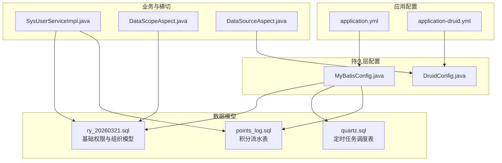
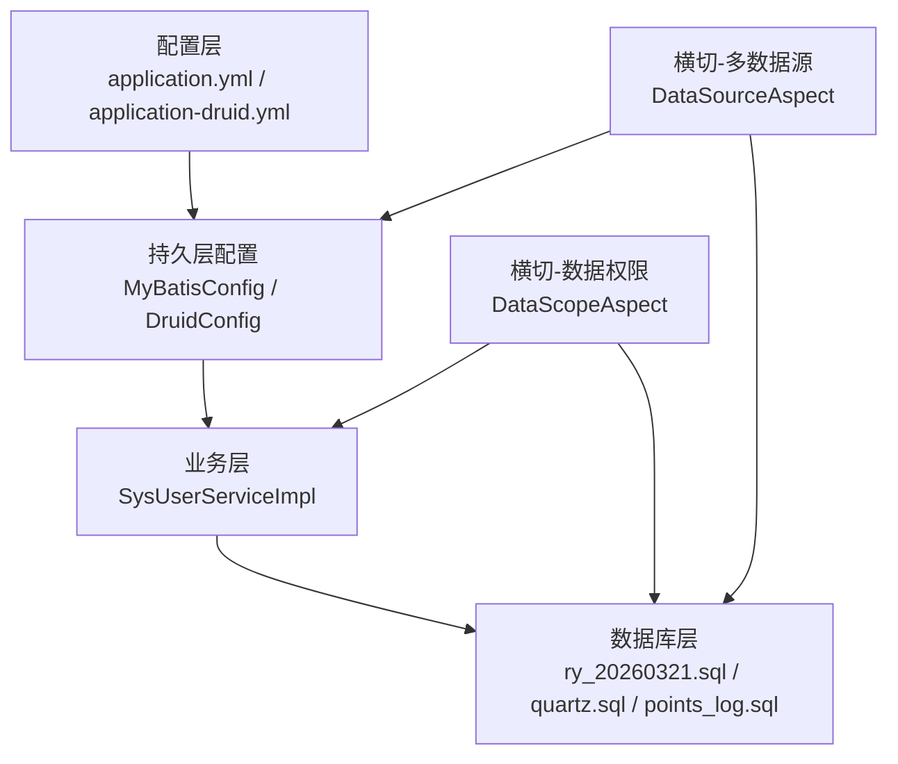
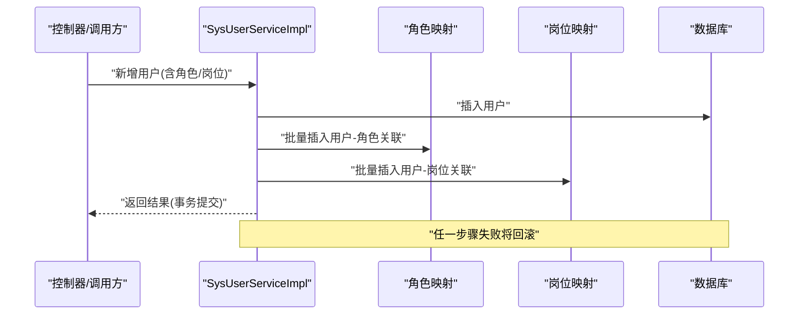
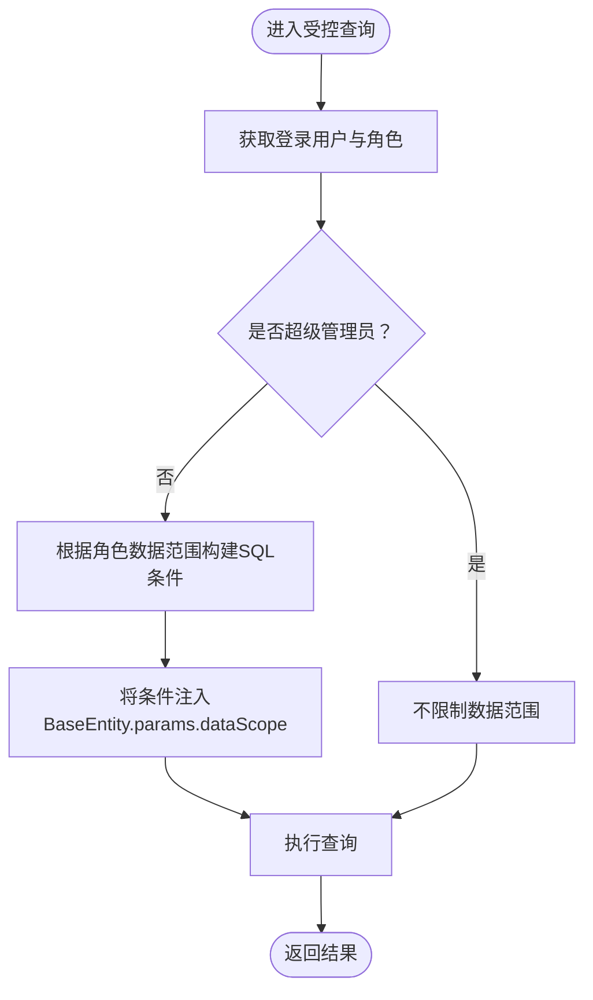
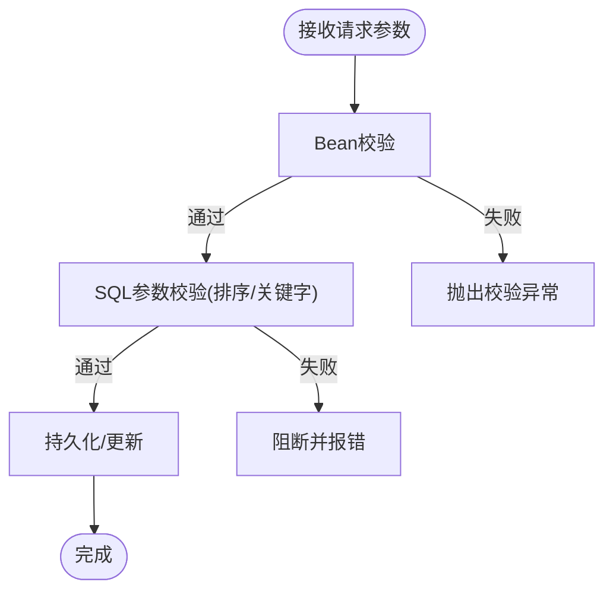
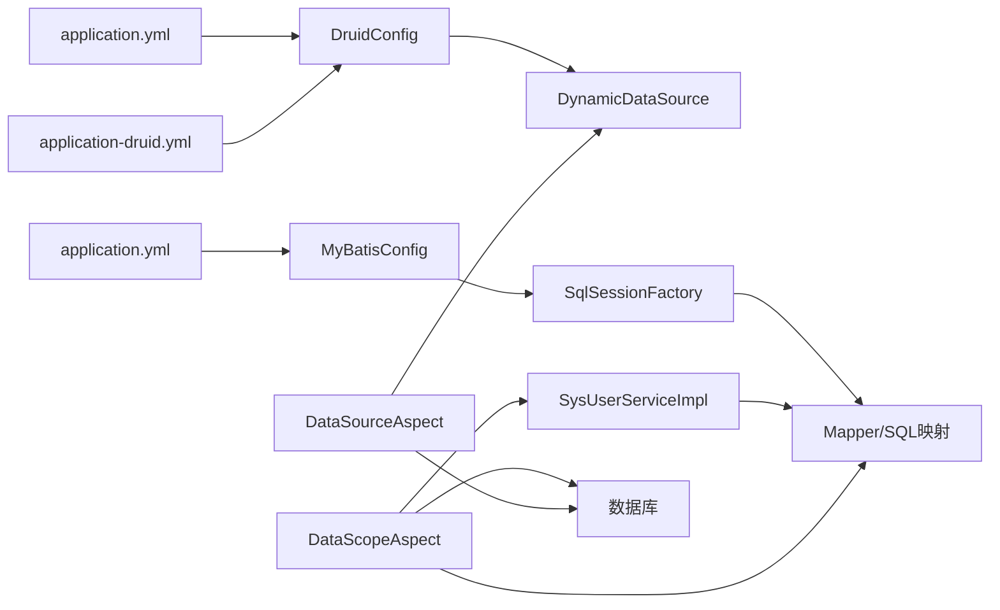

# 数据完整性与一致性

<cite>
**本文引用的文件**   
- [application.yml](file://XingChen-Vue/xingchen-admin/src/main/resources/application.yml)
- [application-druid.yml](file://XingChen-Vue/xingchen-admin/src/main/resources/application-druid.yml)
- [ry_20260321.sql](file://XingChen-Vue/sql/ry_20260321.sql)
- [quartz.sql](file://XingChen-Vue/sql/quartz.sql)
- [points_log.sql](file://XingChen-Vue/sql/points_log.sql)
- [DataScopeAspect.java](file://XingChen-Vue/xingchen-framework/src/main/java/com/xingchen/framework/aspectj/DataScopeAspect.java)
- [DataSourceAspect.java](file://XingChen-Vue/xingchen-framework/src/main/java/com/xingchen/framework/aspectj/DataSourceAspect.java)
- [MyBatisConfig.java](file://XingChen-Vue/xingchen-framework/src/main/java/com/xingchen/framework/config/MyBatisConfig.java)
- [DruidConfig.java](file://XingChen-Vue/xingchen-framework/src/main/java/com/xingchen/framework/config/DruidConfig.java)
- [SysUserServiceImpl.java](file://XingChen-Vue/xingchen-system/src/main/java/com/xingchen/system/service/impl/SysUserServiceImpl.java)
- [BeanUtils.java](file://XingChen-Vue/xingchen-common/src/main/java/com/xingchen/common/utils/bean/BeanUtils.java)
- [BeanValidators.java](file://XingChen-Vue/xingchen-common/src/main/java/com/xingchen/common/utils/bean/BeanValidators.java)
- [SqlUtil.java](file://XingChen-Vue/xingchen-common/src/main/java/com/xingchen/common/utils/sql/SqlUtil.java)
- [DateUtils.java](file://XingChen-Vue/xingchen-common/src/main/java/com/xingchen/common/utils/DateUtils.java)
</cite>

## 目录
1. [简介](#简介)
2. [项目结构](#项目结构)
3. [核心组件](#核心组件)
4. [架构总览](#架构总览)
5. [详细组件分析](#详细组件分析)
6. [依赖关系分析](#依赖关系分析)
7. [性能考量](#性能考量)
8. [故障排查指南](#故障排查指南)
9. [结论](#结论)
10. [附录](#附录)

## 简介
本文件围绕“数据完整性与一致性”主题，系统梳理该健康管理系统在数据库层面的完整性保障（实体完整性、参照完整性、域完整性、用户定义完整性）、业务层面的一致性保证（事务处理、并发控制、数据校验规则），并给出数据迁移策略、备份恢复方案与数据质量监控机制，同时提供常见不一致问题的诊断与解决思路。

## 项目结构
系统采用前后端分离架构，后端基于Spring Boot + MyBatis，使用Druid连接池与多数据源动态路由；数据库层面包含基础组织与权限模型、定时任务调度表以及业务积分流水表，并配套完善的SQL建模与约束设计。

图表来源
- [application.yml:1-148](file://XingChen-Vue/xingchen-admin/src/main/resources/application.yml#L1-L148)
- [application-druid.yml:1-61](file://XingChen-Vue/xingchen-admin/src/main/resources/application-druid.yml#L1-L61)
- [MyBatisConfig.java:1-132](file://XingChen-Vue/xingchen-framework/src/main/java/com/xingchen/framework/config/MyBatisConfig.java#L1-L132)
- [DruidConfig.java:1-127](file://XingChen-Vue/xingchen-framework/src/main/java/com/xingchen/framework/config/DruidConfig.java#L1-L127)
- [ry_20260321.sql:1-722](file://XingChen-Vue/sql/ry_20260321.sql#L1-L722)
- [quartz.sql:1-174](file://XingChen-Vue/sql/quartz.sql#L1-L174)
- [points_log.sql:1-18](file://XingChen-Vue/sql/points_log.sql#L1-L18)
- [SysUserServiceImpl.java:1-566](file://XingChen-Vue/xingchen-system/src/main/java/com/xingchen/system/service/impl/SysUserServiceImpl.java#L1-L566)
- [DataScopeAspect.java:1-161](file://XingChen-Vue/xingchen-framework/src/main/java/com/xingchen/framework/aspectj/DataScopeAspect.java#L1-L161)
- [DataSourceAspect.java:1-73](file://XingChen-Vue/xingchen-framework/src/main/java/com/xingchen/framework/aspectj/DataSourceAspect.java#L1-L73)

章节来源
- [application.yml:1-148](file://XingChen-Vue/xingchen-admin/src/main/resources/application.yml#L1-L148)
- [application-druid.yml:1-61](file://XingChen-Vue/xingchen-admin/src/main/resources/application-druid.yml#L1-L61)
- [MyBatisConfig.java:1-132](file://XingChen-Vue/xingchen-framework/src/main/java/com/xingchen/framework/config/MyBatisConfig.java#L1-L132)
- [DruidConfig.java:1-127](file://XingChen-Vue/xingchen-framework/src/main/java/com/xingchen/framework/config/DruidConfig.java#L1-L127)
- [ry_20260321.sql:1-722](file://XingChen-Vue/sql/ry_20260321.sql#L1-L722)
- [quartz.sql:1-174](file://XingChen-Vue/sql/quartz.sql#L1-L174)
- [points_log.sql:1-18](file://XingChen-Vue/sql/points_log.sql#L1-L18)

## 核心组件
- 数据库层完整性
  - 实体完整性：主键约束（如 sys_user.user_id、sys_dept.dept_id、sys_points_log.id 等）
  - 参照完整性：外键约束（如 sys_user_role.role_id、sys_user_post.user_id 等）
  - 域完整性：非空、默认值、枚举/字符集、索引优化（如 sys_oper_log、sys_logininfor 的索引）
  - 用户定义完整性：业务唯一性校验（用户名、手机号、邮箱唯一）、字典类型唯一（sys_dict_type.dict_type）
- 业务层一致性
  - 事务处理：用户新增/修改/删除、导入等关键流程使用 @Transactional 保证原子性
  - 并发控制：多数据源动态路由、Druid连接池参数、Quartz悲观锁表
  - 数据校验：Bean 校验、SQL 关键词过滤、排序参数校验
- 配置与运行
  - MyBatis 扫描包与 Mapper 加载
  - Druid 多数据源与监控视图
  - 定时任务调度与日志

章节来源
- [ry_20260321.sql:1-722](file://XingChen-Vue/sql/ry_20260321.sql#L1-L722)
- [quartz.sql:1-174](file://XingChen-Vue/sql/quartz.sql#L1-L174)
- [points_log.sql:1-18](file://XingChen-Vue/sql/points_log.sql#L1-L18)
- [SysUserServiceImpl.java:260-320](file://XingChen-Vue/xingchen-system/src/main/java/com/xingchen/system/service/impl/SysUserServiceImpl.java#L260-L320)
- [BeanValidators.java:1-25](file://XingChen-Vue/xingchen-common/src/main/java/com/xingchen/common/utils/bean/BeanValidators.java#L1-L25)
- [SqlUtil.java:1-72](file://XingChen-Vue/xingchen-common/src/main/java/com/xingchen/common/utils/sql/SqlUtil.java#L1-L72)
- [MyBatisConfig.java:116-132](file://XingChen-Vue/xingchen-framework/src/main/java/com/xingchen/framework/config/MyBatisConfig.java#L116-L132)
- [DruidConfig.java:35-80](file://XingChen-Vue/xingchen-framework/src/main/java/com/xingchen/framework/config/DruidConfig.java#L35-L80)

## 架构总览
系统通过配置层（application.yml、application-druid.yml）定义运行参数，持久层（MyBatisConfig、DruidConfig）完成数据源与映射装配，业务层（SysUserServiceImpl）承载事务与数据校验，横切层（DataScopeAspect、DataSourceAspect）实现数据权限与多数据源路由，最终落于数据库层的完整性约束与索引设计。

图表来源
- [application.yml:1-148](file://XingChen-Vue/xingchen-admin/src/main/resources/application.yml#L1-L148)
- [application-druid.yml:1-61](file://XingChen-Vue/xingchen-admin/src/main/resources/application-druid.yml#L1-L61)
- [MyBatisConfig.java:116-132](file://XingChen-Vue/xingchen-framework/src/main/java/com/xingchen/framework/config/MyBatisConfig.java#L116-L132)
- [DruidConfig.java:35-80](file://XingChen-Vue/xingchen-framework/src/main/java/com/xingchen/framework/config/DruidConfig.java#L35-L80)
- [SysUserServiceImpl.java:1-566](file://XingChen-Vue/xingchen-system/src/main/java/com/xingchen/system/service/impl/SysUserServiceImpl.java#L1-L566)
- [DataScopeAspect.java:1-161](file://XingChen-Vue/xingchen-framework/src/main/java/com/xingchen/framework/aspectj/DataScopeAspect.java#L1-L161)
- [DataSourceAspect.java:1-73](file://XingChen-Vue/xingchen-framework/src/main/java/com/xingchen/framework/aspectj/DataSourceAspect.java#L1-L73)
- [ry_20260321.sql:1-722](file://XingChen-Vue/sql/ry_20260321.sql#L1-L722)
- [quartz.sql:1-174](file://XingChen-Vue/sql/quartz.sql#L1-L174)
- [points_log.sql:1-18](file://XingChen-Vue/sql/points_log.sql#L1-L18)

## 详细组件分析

### 数据库完整性设计
- 实体完整性
  - 主键覆盖：用户、部门、角色、菜单、岗位、字典、参数、定时任务、公告、代码生成等均设置主键，确保每条记录唯一标识。
- 参照完整性
  - 外键关系：用户-角色（sys_user_role）、用户-岗位（sys_user_post）、角色-菜单（sys_role_menu）、角色-部门（sys_role_dept）、公告-已读（sys_notice_read）等，形成清晰的关联关系。
  - Quartz 调度表：QRTZ_TRIGGERS 与 QRTZ_JOB_DETAILS 之间存在外键约束，保证触发器与作业的关联一致性。
- 域完整性
  - 非空字段：如 sys_user.user_name、sys_post.post_code、sys_role.role_key 等关键字段设置非空。
  - 默认值与状态：如 status、del_flag、create_by/update_by 等统一默认值，便于审计与清理。
  - 索引优化：对高频查询字段建立索引（如 sys_oper_log、sys_logininfor 的时间与状态索引）。
- 用户定义完整性
  - 唯一性：sys_dict_type.dict_type 唯一；公告已读记录 uk_user_notice 唯一组合（用户+公告）。
  - 业务唯一：用户名、手机号、邮箱在用户表中唯一校验（服务层实现）。

章节来源
- [ry_20260321.sql:1-722](file://XingChen-Vue/sql/ry_20260321.sql#L1-L722)
- [quartz.sql:1-174](file://XingChen-Vue/sql/quartz.sql#L1-L174)
- [points_log.sql:1-18](file://XingChen-Vue/sql/points_log.sql#L1-L18)

### 业务事务与一致性
- 事务边界
  - 用户新增/修改/删除：使用 @Transactional 保证用户与其角色、岗位关联表的一致性。
  - 批量删除：逐条校验权限与数据范围后再删除，确保不越权与不破坏关联。
  - 导入流程：校验 Bean、部门数据范围、初始密码加密、按是否更新策略区分插入或更新。
- 并发控制
  - 多数据源：通过注解与动态路由在读写分离场景下选择合适数据源。
  - 连接池：Druid 提供连接池参数与慢SQL监控，减少并发下的资源争用。
  - 定时任务：Quartz 使用悲观锁表（QRTZ_LOCKS）与状态表（QRTZ_SCHEDULER_STATE）保障集群一致性。

图表来源
- [SysUserServiceImpl.java:260-320](file://XingChen-Vue/xingchen-system/src/main/java/com/xingchen/system/service/impl/SysUserServiceImpl.java#L260-L320)

章节来源
- [SysUserServiceImpl.java:1-566](file://XingChen-Vue/xingchen-system/src/main/java/com/xingchen/system/service/impl/SysUserServiceImpl.java#L1-L566)
- [quartz.sql:146-150](file://XingChen-Vue/sql/quartz.sql#L146-L150)

### 数据权限与隔离
- 数据范围过滤
  - 通过 AOP 切面根据用户角色的数据范围（全部、自定义、本部门、本部门及子部门、仅本人）动态拼接 SQL 条件，限制查询范围。
  - 支持传入权限字符与别名，避免 SQL 注入风险。
- 多数据源路由
  - 基于注解在方法级别切换数据源（主/从），结合 Druid 动态数据源容器实现读写分离与负载均衡。

图表来源
- [DataScopeAspect.java:42-146](file://XingChen-Vue/xingchen-framework/src/main/java/com/xingchen/framework/aspectj/DataScopeAspect.java#L42-L146)

章节来源
- [DataScopeAspect.java:1-161](file://XingChen-Vue/xingchen-framework/src/main/java/com/xingchen/framework/aspectj/DataScopeAspect.java#L1-L161)
- [DataSourceAspect.java:1-73](file://XingChen-Vue/xingchen-framework/src/main/java/com/xingchen/framework/aspectj/DataSourceAspect.java#L1-L73)

### 数据校验与安全
- Bean 校验
  - 使用 BeanValidators.validateWithException 对入参对象进行 JSR-303 校验，异常直接抛出，避免非法数据入库。
- SQL 安全
  - SqlUtil.escapeOrderBySql 与 isValidOrderBySql 限制排序参数合法性与长度。
  - filterKeyword 过滤敏感关键字，防止注入与恶意输入。
- 通用工具
  - BeanUtils 提供反射复制与 Getter/Setter 方法检索能力，辅助数据转换。
  - DateUtils 提供日期格式化与时间差计算，支撑业务时间维度逻辑。

图表来源
- [BeanValidators.java:15-23](file://XingChen-Vue/xingchen-common/src/main/java/com/xingchen/common/utils/bean/BeanValidators.java#L15-L23)
- [SqlUtil.java:31-70](file://XingChen-Vue/xingchen-common/src/main/java/com/xingchen/common/utils/sql/SqlUtil.java#L31-L70)

章节来源
- [BeanValidators.java:1-25](file://XingChen-Vue/xingchen-common/src/main/java/com/xingchen/common/utils/bean/BeanValidators.java#L1-L25)
- [SqlUtil.java:1-72](file://XingChen-Vue/xingchen-common/src/main/java/com/xingchen/common/utils/sql/SqlUtil.java#L1-L72)
- [BeanUtils.java:1-111](file://XingChen-Vue/xingchen-common/src/main/java/com/xingchen/common/utils/bean/BeanUtils.java#L1-L111)
- [DateUtils.java:1-193](file://XingChen-Vue/xingchen-common/src/main/java/com/xingchen/common/utils/DateUtils.java#L1-L193)

### 积分流水与业务一致性
- 设计要点
  - 主键自增 id，确保流水唯一性。
  - user_id、source_type、operate_type 等字段明确业务含义，便于审计与统计。
  - reference_id 关联业务单据，便于追踪。
  - create_time 记录波动发生时间，配合索引提升查询效率。
- 一致性建议
  - 写入积分流水与余额变更应处于同一事务，或采用幂等设计与补偿机制。
  - 对高频写入场景考虑异步队列与批量写入，降低热点压力。

章节来源
- [points_log.sql:1-18](file://XingChen-Vue/sql/points_log.sql#L1-L18)

## 依赖关系分析
- 配置到持久层
  - application.yml 与 application-druid.yml 驱动 DruidConfig 与 MyBatisConfig，分别完成数据源与映射装配。
- 业务到数据层
  - SysUserServiceImpl 依赖 Mapper 与 Service，涉及用户、角色、岗位、部门等多表联动。
- 横切到配置与数据层
  - DataScopeAspect 与 DataSourceAspect 分别作用于 SQL 条件注入与数据源切换，影响查询与写入路径。

图表来源
- [application.yml:1-148](file://XingChen-Vue/xingchen-admin/src/main/resources/application.yml#L1-L148)
- [application-druid.yml:1-61](file://XingChen-Vue/xingchen-admin/src/main/resources/application-druid.yml#L1-L61)
- [DruidConfig.java:35-80](file://XingChen-Vue/xingchen-framework/src/main/java/com/xingchen/framework/config/DruidConfig.java#L35-L80)
- [MyBatisConfig.java:116-132](file://XingChen-Vue/xingchen-framework/src/main/java/com/xingchen/framework/config/MyBatisConfig.java#L116-L132)
- [SysUserServiceImpl.java:1-566](file://XingChen-Vue/xingchen-system/src/main/java/com/xingchen/system/service/impl/SysUserServiceImpl.java#L1-L566)
- [DataScopeAspect.java:1-161](file://XingChen-Vue/xingchen-framework/src/main/java/com/xingchen/framework/aspectj/DataScopeAspect.java#L1-L161)
- [DataSourceAspect.java:1-73](file://XingChen-Vue/xingchen-framework/src/main/java/com/xingchen/framework/aspectj/DataSourceAspect.java#L1-L73)

章节来源
- [application.yml:1-148](file://XingChen-Vue/xingchen-admin/src/main/resources/application.yml#L1-L148)
- [application-druid.yml:1-61](file://XingChen-Vue/xingchen-admin/src/main/resources/application-druid.yml#L1-L61)
- [MyBatisConfig.java:1-132](file://XingChen-Vue/xingchen-framework/src/main/java/com/xingchen/framework/config/MyBatisConfig.java#L1-L132)
- [DruidConfig.java:1-127](file://XingChen-Vue/xingchen-framework/src/main/java/com/xingchen/framework/config/DruidConfig.java#L1-L127)
- [SysUserServiceImpl.java:1-566](file://XingChen-Vue/xingchen-system/src/main/java/com/xingchen/system/service/impl/SysUserServiceImpl.java#L1-L566)
- [DataScopeAspect.java:1-161](file://XingChen-Vue/xingchen-framework/src/main/java/com/xingchen/framework/aspectj/DataScopeAspect.java#L1-L161)
- [DataSourceAspect.java:1-73](file://XingChen-Vue/xingchen-framework/src/main/java/com/xingchen/framework/aspectj/DataSourceAspect.java#L1-L73)

## 性能考量
- 索引与查询
  - 建议为高频过滤字段（如 sys_user.user_name、sys_user.dept_id、sys_points_log.user_id）建立索引，减少全表扫描。
  - 对时间字段（sys_oper_log.oper_time、sys_logininfor.login_time）建立复合索引，优化范围查询。
- 连接池与并发
  - 合理设置 Druid 连接池参数（初始连接、最大活跃、最大等待、空闲检测周期），避免高并发下的连接瓶颈。
  - 对只读查询启用从库，读写分离降低主库压力。
- 事务与锁
  - 将短事务保持在最小范围，避免长事务占用行锁。
  - 对批量写入采用批处理与批量提交，减少往返与锁竞争。
- 定时任务
  - 使用 Quartz 的悲观锁表与状态表，避免集群重复执行；合理设置 misfire 策略与并发策略。

[本节为通用指导，无需列出具体文件来源]

## 故障排查指南
- 常见不一致问题
  - 用户名/手机号/邮箱重复：检查服务层唯一性校验与数据库唯一约束，确认导入流程是否正确处理已存在记录。
  - 数据越权：检查 DataScopeAspect 的数据范围条件是否正确注入，确认角色数据范围配置。
  - 事务未生效：核对 @Transactional 注解是否位于可代理的方法上，确认异常是否被吞没导致未回滚。
  - SQL 注入风险：确认 SqlUtil.escapeOrderBySql 与 filterKeyword 是否被调用，避免直接拼接不受控参数。
- 诊断步骤
  - 启用 Druid 监控视图，查看慢SQL与连接池状态。
  - 查看操作日志与登录日志表，定位异常时间段与操作人。
  - 对积分流水与余额进行对账，确保业务一致性。
- 快速修复
  - 修正数据范围配置或重新授权角色数据范围。
  - 修复事务边界，确保异常抛出并回滚。
  - 优化索引与查询条件，减少锁等待。

章节来源
- [SysUserServiceImpl.java:172-218](file://XingChen-Vue/xingchen-system/src/main/java/com/xingchen/system/service/impl/SysUserServiceImpl.java#L172-L218)
- [DataScopeAspect.java:67-146](file://XingChen-Vue/xingchen-framework/src/main/java/com/xingchen/framework/aspectj/DataScopeAspect.java#L67-L146)
- [SqlUtil.java:31-70](file://XingChen-Vue/xingchen-common/src/main/java/com/xingchen/common/utils/sql/SqlUtil.java#L31-L70)
- [ry_20260321.sql:419-442](file://XingChen-Vue/sql/ry_20260321.sql#L419-L442)
- [ry_20260321.sql:561-575](file://XingChen-Vue/sql/ry_20260321.sql#L561-L575)

## 结论
本系统在数据库层面通过主键、外键、唯一性与索引等手段实现了强健的完整性保障；在业务层面通过事务、数据权限与多数据源路由确保了跨模块的一致性；在安全与合规方面，提供了 SQL 关键词过滤与 Bean 校验等防护措施。结合合理的索引、连接池与定时任务配置，可在高并发场景下维持稳定与一致的数据状态。

[本节为总结性内容，无需列出具体文件来源]

## 附录

### 数据迁移策略
- 前期准备
  - 备份现有生产库，评估迁移窗口与停机时间。
  - 对比源表与目标表结构，确认主键、外键、索引与默认值。
- 迁移步骤
  - 结构迁移：先迁移表结构与约束，再迁移数据。
  - 数据迁移：使用批量 INSERT 或分批导入，校验唯一性与外键引用。
  - 校验与回放：对比关键指标（总数、关键字段分布），必要时回放日志。
- 回滚预案
  - 准备逆向 SQL 与快照恢复方案，确保异常时快速回退。

[本节为通用指导，无需列出具体文件来源]

### 备份恢复方案
- 备份策略
  - 全量备份：每周一次，保留至少 4 份。
  - 增量备份：每日一次，保留 7 天。
  - 二进制日志：开启并定期轮转，支持点式恢复。
- 恢复演练
  - 定期进行恢复演练，验证备份可用性与恢复时间目标。
- DR 与灾备
  - 异地容灾：通过主从复制或云服务实现跨地域容灾。

[本节为通用指导，无需列出具体文件来源]

### 数据质量监控机制
- 指标体系
  - 唯一性：用户名/手机号/邮箱唯一率、字典类型唯一率。
  - 一致性：用户-角色/岗位关联完整性、公告已读去重一致性。
  - 完整性：必填字段填充率、时间字段准确性。
- 监控手段
  - 定时任务扫描关键表，生成质量报告。
  - 异常告警：对违反约束或异常波动进行告警。
  - 审计日志：保留操作日志与登录日志，支持追溯。

[本节为通用指导，无需列出具体文件来源]