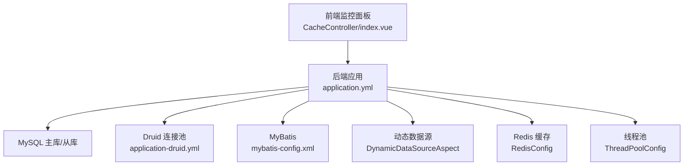
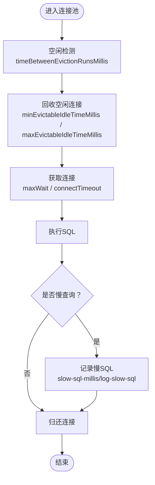
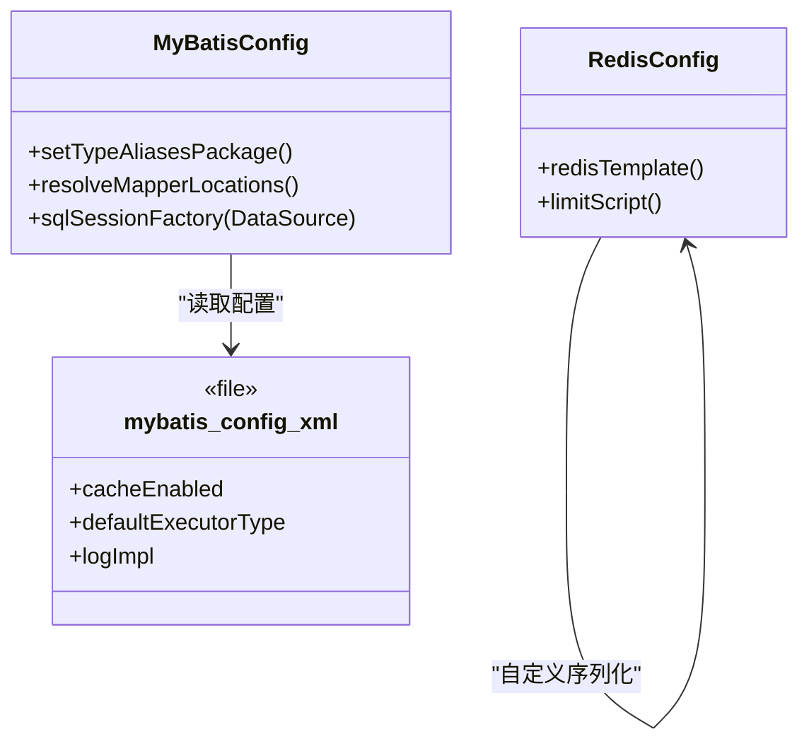
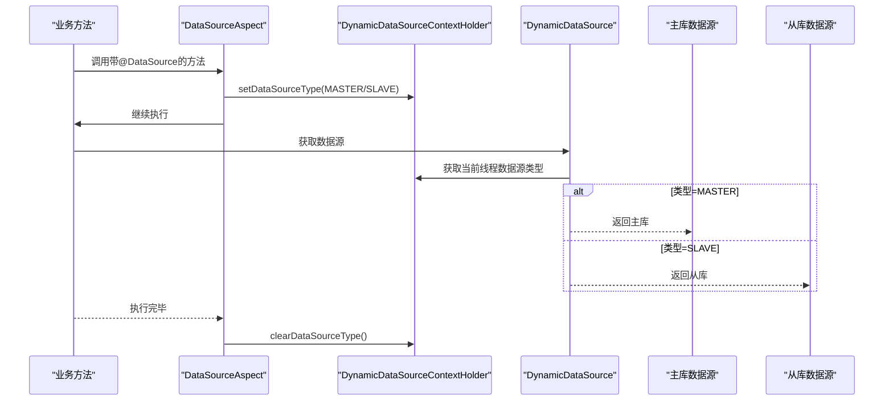
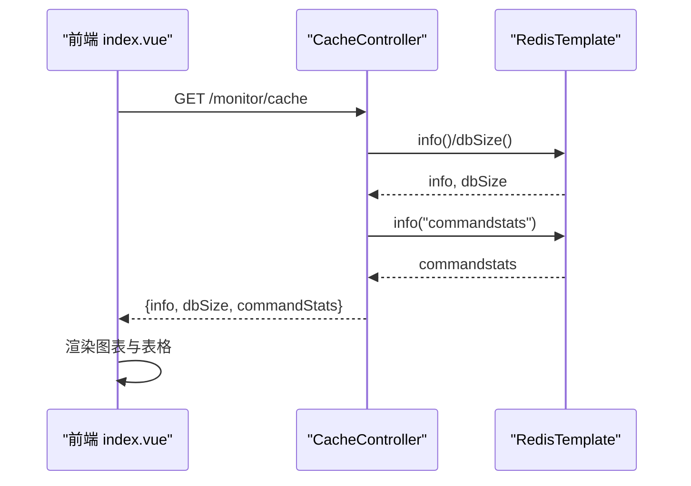
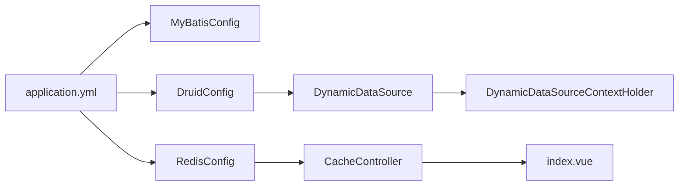

# 数据库性能优化

<cite>
**本文引用的文件**
- [application.yml](file://XingChen-Vue/xingchen-admin/src/main/resources/application.yml)
- [application-druid.yml](file://XingChen-Vue/xingchen-admin/src/main/resources/application-druid.yml)
- [mybatis-config.xml](file://XingChen-Vue/xingchen-admin/src/main/resources/mybatis/mybatis-config.xml)
- [DruidConfig.java](file://XingChen-Vue/xingchen-framework/src/main/java/com/xingchen/framework/config/DruidConfig.java)
- [DruidProperties.java](file://XingChen-Vue/xingchen-framework/src/main/java/com/xingchen/framework/config/properties/DruidProperties.java)
- [MyBatisConfig.java](file://XingChen-Vue/xingchen-framework/src/main/java/com/xingchen/framework/config/MyBatisConfig.java)
- [RedisConfig.java](file://XingChen-Vue/xingchen-framework/src/main/java/com/xingchen/framework/config/RedisConfig.java)
- [ThreadPoolConfig.java](file://XingChen-Vue/xingchen-framework/src/main/java/com/xingchen/framework/config/ThreadPoolConfig.java)
- [DataSourceAspect.java](file://XingChen-Vue/xingchen-framework/src/main/java/com/xingchen/framework/aspectj/DataSourceAspect.java)
- [DynamicDataSource.java](file://XingChen-Vue/xingchen-framework/src/main/java/com/xingchen/framework/datasource/DynamicDataSource.java)
- [DynamicDataSourceContextHolder.java](file://XingChen-Vue/xingchen-framework/src/main/java/com/xingchen/framework/datasource/DynamicDataSourceContextHolder.java)
- [DataSourceType.java](file://XingChen-Vue/xingchen-common/src/main/java/com/xingchen/common/enums/DataSourceType.java)
- [CacheController.java](file://XingChen-Vue/xingchen-admin/src/main/java/com/xingchen/web/controller/monitor/CacheController.java)
- [index.vue（缓存监控）](file://XingChen-Vue3/src/views/monitor/cache/index.vue)
- [ry_20260321.sql](file://XingChen-Vue/sql/ry_20260321.sql)
</cite>

## 目录
1. [简介](#简介)
2. [项目结构](#项目结构)
3. [核心组件](#核心组件)
4. [架构总览](#架构总览)
5. [详细组件分析](#详细组件分析)
6. [依赖关系分析](#依赖关系分析)
7. [性能考量](#性能考量)
8. [故障排查指南](#故障排查指南)
9. [结论](#结论)
10. [附录](#附录)

## 简介
本指南围绕健康管理系统中的数据库性能优化实践展开，结合现有代码与配置，系统讲解数据库性能瓶颈识别、查询与索引优化策略、连接池与缓存配置、读写分离与动态数据源、慢查询分析与监控、参数调优与高并发保障方案。文档兼顾工程落地与可操作性，帮助读者在真实环境中快速定位问题并实施优化。

## 项目结构
项目采用前后端分离架构，后端基于Spring Boot + MyBatis + Druid + Redis + 定时任务，前端提供监控面板用于观察数据库与缓存运行状态。数据库层通过Druid连接池与MyBatis集成，配合动态数据源实现读写分离；缓存层通过Redis提供高性能读取与限流脚本支持。

图表来源
- [application.yml:49-148](file://XingChen-Vue/xingchen-admin/src/main/resources/application.yml#L49-L148)
- [application-druid.yml:1-61](file://XingChen-Vue/xingchen-admin/src/main/resources/application-druid.yml#L1-L61)
- [mybatis-config.xml:1-20](file://XingChen-Vue/xingchen-admin/src/main/resources/mybatis/mybatis-config.xml#L1-L20)
- [DruidConfig.java:31-68](file://XingChen-Vue/xingchen-framework/src/main/java/com/xingchen/framework/config/DruidConfig.java#L31-L68)
- [MyBatisConfig.java:116-132](file://XingChen-Vue/xingchen-framework/src/main/java/com/xingchen/framework/config/MyBatisConfig.java#L116-L132)
- [RedisConfig.java:17-71](file://XingChen-Vue/xingchen-framework/src/main/java/com/xingchen/framework/config/RedisConfig.java#L17-L71)
- [ThreadPoolConfig.java:1-63](file://XingChen-Vue/xingchen-framework/src/main/java/com/xingchen/framework/config/ThreadPoolConfig.java#L1-L63)
- [CacheController.java:38-93](file://XingChen-Vue/xingchen-admin/src/main/java/com/xingchen/web/controller/monitor/CacheController.java#L38-L93)
- [index.vue（缓存监控）:19-95](file://XingChen-Vue3/src/views/monitor/cache/index.vue#L19-L95)

章节来源
- [application.yml:1-148](file://XingChen-Vue/xingchen-admin/src/main/resources/application.yml#L1-L148)
- [application-druid.yml:1-61](file://XingChen-Vue/xingchen-admin/src/main/resources/application-druid.yml#L1-L61)
- [mybatis-config.xml:1-20](file://XingChen-Vue/xingchen-admin/src/main/resources/mybatis/mybatis-config.xml#L1-L20)
- [DruidConfig.java:31-68](file://XingChen-Vue/xingchen-framework/src/main/java/com/xingchen/framework/config/DruidConfig.java#L31-L68)
- [MyBatisConfig.java:116-132](file://XingChen-Vue/xingchen-framework/src/main/java/com/xingchen/framework/config/MyBatisConfig.java#L116-L132)
- [RedisConfig.java:17-71](file://XingChen-Vue/xingchen-framework/src/main/java/com/xingchen/framework/config/RedisConfig.java#L17-L71)
- [ThreadPoolConfig.java:1-63](file://XingChen-Vue/xingchen-framework/src/main/java/com/xingchen/framework/config/ThreadPoolConfig.java#L1-L63)
- [CacheController.java:38-93](file://XingChen-Vue/xingchen-admin/src/main/java/com/xingchen/web/controller/monitor/CacheController.java#L38-L93)
- [index.vue（缓存监控）:19-95](file://XingChen-Vue3/src/views/monitor/cache/index.vue#L19-L95)

## 核心组件
- 连接池与监控：Druid连接池通过配置文件与属性类统一管理初始化大小、最大活跃数、等待超时、连接/套接字超时、空闲回收周期、校验查询与开关等关键参数，并开启Web Stat View与慢SQL记录。
- ORM与缓存：MyBatis全局设置开启缓存、默认执行器类型、日志实现；Redis通过自定义序列化与限流脚本提升缓存命中与QPS控制能力。
- 动态数据源：基于ThreadLocal的上下文持有器与AbstractRoutingDataSource实现读写分离，AOP切面根据注解自动切换主/从库。
- 线程池：为异步任务与定时任务提供可配置的核心线程、最大线程、队列容量与拒绝策略，避免线程风暴影响数据库压力。
- 监控与可视化：后端提供缓存监控接口，前端展示Redis运行信息、命令统计与内存使用情况，辅助定位热点与异常。

章节来源
- [DruidProperties.java:14-89](file://XingChen-Vue/xingchen-framework/src/main/java/com/xingchen/framework/config/properties/DruidProperties.java#L14-L89)
- [application-druid.yml:19-61](file://XingChen-Vue/xingchen-admin/src/main/resources/application-druid.yml#L19-L61)
- [mybatis-config.xml:7-18](file://XingChen-Vue/xingchen-admin/src/main/resources/mybatis/mybatis-config.xml#L7-L18)
- [RedisConfig.java:22-71](file://XingChen-Vue/xingchen-framework/src/main/java/com/xingchen/framework/config/RedisConfig.java#L22-L71)
- [DynamicDataSource.java:12-26](file://XingChen-Vue/xingchen-framework/src/main/java/com/xingchen/framework/datasource/DynamicDataSource.java#L12-L26)
- [DynamicDataSourceContextHolder.java:11-45](file://XingChen-Vue/xingchen-framework/src/main/java/com/xingchen/framework/datasource/DynamicDataSourceContextHolder.java#L11-L45)
- [DataSourceAspect.java:26-72](file://XingChen-Vue/xingchen-framework/src/main/java/com/xingchen/framework/aspectj/DataSourceAspect.java#L26-L72)
- [ThreadPoolConfig.java:18-63](file://XingChen-Vue/xingchen-framework/src/main/java/com/xingchen/framework/config/ThreadPoolConfig.java#L18-L63)
- [CacheController.java:38-93](file://XingChen-Vue/xingchen-admin/src/main/java/com/xingchen/web/controller/monitor/CacheController.java#L38-L93)
- [index.vue（缓存监控）:19-95](file://XingChen-Vue3/src/views/monitor/cache/index.vue#L19-L95)

## 架构总览
下图展示了数据库性能优化涉及的关键组件及其交互关系：连接池、ORM、动态数据源、缓存与监控。

```mermaid
graph TB
subgraph "应用层"
A["Spring Boot 应用<br/>application.yml"]
B["MyBatis 配置<br/>mybatis-config.xml"]
C["线程池配置<br/>ThreadPoolConfig"]
end
subgraph "数据访问层"
D["Druid 连接池<br/>application-druid.yml + DruidProperties"]
E["动态数据源<br/>DynamicDataSource + DataSourceAspect"]
F["MyBatis SqlSessionFactory<br/>MyBatisConfig"]
end
subgraph "缓存层"
G["Redis 配置<br/>RedisConfig"]
H["缓存监控接口<br/>CacheController"]
I["前端缓存视图<br/>index.vue"]
end
A --> D
A --> F
F --> D
E --> D
A --> G
H --> G
I --> H
A --> C
```

图表来源
- [application.yml:49-148](file://XingChen-Vue/xingchen-admin/src/main/resources/application.yml#L49-L148)
- [application-druid.yml:1-61](file://XingChen-Vue/xingchen-admin/src/main/resources/application-druid.yml#L1-L61)
- [DruidProperties.java:54-89](file://XingChen-Vue/xingchen-framework/src/main/java/com/xingchen/framework/config/properties/DruidProperties.java#L54-L89)
- [MyBatisConfig.java:116-132](file://XingChen-Vue/xingchen-framework/src/main/java/com/xingchen/framework/config/MyBatisConfig.java#L116-L132)
- [DynamicDataSource.java:12-26](file://XingChen-Vue/xingchen-framework/src/main/java/com/xingchen/framework/datasource/DynamicDataSource.java#L12-L26)
- [DataSourceAspect.java:37-56](file://XingChen-Vue/xingchen-framework/src/main/java/com/xingchen/framework/aspectj/DataSourceAspect.java#L37-L56)
- [RedisConfig.java:22-71](file://XingChen-Vue/xingchen-framework/src/main/java/com/xingchen/framework/config/RedisConfig.java#L22-L71)
- [CacheController.java:50-93](file://XingChen-Vue/xingchen-admin/src/main/java/com/xingchen/web/controller/monitor/CacheController.java#L50-L93)
- [index.vue（缓存监控）:67-95](file://XingChen-Vue3/src/views/monitor/cache/index.vue#L67-L95)

## 详细组件分析

### 连接池与慢查询监控
- 关键参数
  - 初始化连接数、最小/最大空闲连接、最大活跃连接
  - 获取连接最大等待时间、连接超时、网络超时
  - 空闲连接回收周期、最小/最大空闲存活时间
  - 连接有效性校验查询与开关（建议开启空闲检测）
  - Web Stat View与慢SQL记录（阈值与合并SQL）
- 实施要点
  - 将“申请连接时校验”关闭，避免降低吞吐
  - 合理设置等待与超时，防止线程长时间阻塞
  - 开启慢SQL记录，结合控制台定位热点SQL
  - 通过Druid控制台查看连接池状态、SQL执行统计与慢查询明细

图表来源
- [application-druid.yml:19-61](file://XingChen-Vue/xingchen-admin/src/main/resources/application-druid.yml#L19-L61)
- [DruidProperties.java:54-89](file://XingChen-Vue/xingchen-framework/src/main/java/com/xingchen/framework/config/properties/DruidProperties.java#L54-L89)

章节来源
- [application-druid.yml:19-61](file://XingChen-Vue/xingchen-admin/src/main/resources/application-druid.yml#L19-L61)
- [DruidProperties.java:14-89](file://XingChen-Vue/xingchen-framework/src/main/java/com/xingchen/framework/config/properties/DruidProperties.java#L14-L89)

### ORM与缓存策略
- MyBatis
  - 全局缓存开启、默认执行器类型、日志实现
  - Mapper扫描与全局配置文件加载
- Redis
  - 自定义JSON序列化器、Key/Value与Hash序列化策略
  - 限流脚本封装，基于Lua原子计数与过期控制
- 实施要点
  - 对热点查询结果进行缓存，减少数据库压力
  - 使用合适的序列化策略，避免跨语言兼容问题
  - 通过限流脚本保护后端服务，防止突发流量击穿缓存

图表来源
- [MyBatisConfig.java:116-132](file://XingChen-Vue/xingchen-framework/src/main/java/com/xingchen/framework/config/MyBatisConfig.java#L116-L132)
- [mybatis-config.xml:7-18](file://XingChen-Vue/xingchen-admin/src/main/resources/mybatis/mybatis-config.xml#L7-L18)
- [RedisConfig.java:22-71](file://XingChen-Vue/xingchen-framework/src/main/java/com/xingchen/framework/config/RedisConfig.java#L22-L71)

章节来源
- [mybatis-config.xml:1-20](file://XingChen-Vue/xingchen-admin/src/main/resources/mybatis/mybatis-config.xml#L1-L20)
- [MyBatisConfig.java:116-132](file://XingChen-Vue/xingchen-framework/src/main/java/com/xingchen/framework/config/MyBatisConfig.java#L116-L132)
- [RedisConfig.java:17-71](file://XingChen-Vue/xingchen-framework/src/main/java/com/xingchen/framework/config/RedisConfig.java#L17-L71)

### 读写分离与动态数据源
- 设计思路
  - 主库写入、从库读取，通过注解或业务逻辑切换数据源
  - 使用ThreadLocal保存当前线程绑定的数据源类型
  - AOP切点拦截标注了数据源注解的方法或类
- 关键类
  - DynamicDataSource：继承AbstractRoutingDataSource，按当前上下文返回目标数据源
  - DynamicDataSourceContextHolder：线程本地存储与清理
  - DataSourceAspect：环绕通知，设置/清理数据源类型
  - DataSourceType：枚举定义MASTER/SLAVE

图表来源
- [DataSourceAspect.java:37-56](file://XingChen-Vue/xingchen-framework/src/main/java/com/xingchen/framework/aspectj/DataSourceAspect.java#L37-L56)
- [DynamicDataSourceContextHolder.java:24-44](file://XingChen-Vue/xingchen-framework/src/main/java/com/xingchen/framework/datasource/DynamicDataSourceContextHolder.java#L24-L44)
- [DynamicDataSource.java:21-26](file://XingChen-Vue/xingchen-framework/src/main/java/com/xingchen/framework/datasource/DynamicDataSource.java#L21-L26)
- [DataSourceType.java:8-19](file://XingChen-Vue/xingchen-common/src/main/java/com/xingchen/common/enums/DataSourceType.java#L8-L19)

章节来源
- [DataSourceAspect.java:18-72](file://XingChen-Vue/xingchen-framework/src/main/java/com/xingchen/framework/aspectj/DataSourceAspect.java#L18-L72)
- [DynamicDataSource.java:1-26](file://XingChen-Vue/xingchen-framework/src/main/java/com/xingchen/framework/datasource/DynamicDataSource.java#L1-L26)
- [DynamicDataSourceContextHolder.java:1-45](file://XingChen-Vue/xingchen-framework/src/main/java/com/xingchen/framework/datasource/DynamicDataSourceContextHolder.java#L1-L45)
- [DataSourceType.java:1-19](file://XingChen-Vue/xingchen-common/src/main/java/com/xingchen/common/enums/DataSourceType.java#L1-L19)

### 缓存监控与可视化
- 后端接口
  - 获取Redis实例信息、命令统计、Key数量
  - 提供缓存键前缀匹配与值读取
- 前端视图
  - 展示Redis运行时长、内存使用、CPU、AOF/RDB状态
  - 命令统计饼图与内存使用趋势图
- 实施要点
  - 通过接口聚合Redis信息，前端做可视化展示
  - 结合命令统计识别热点命令，指导缓存策略优化

图表来源
- [CacheController.java:50-93](file://XingChen-Vue/xingchen-admin/src/main/java/com/xingchen/web/controller/monitor/CacheController.java#L50-L93)
- [index.vue（缓存监控）:67-95](file://XingChen-Vue3/src/views/monitor/cache/index.vue#L67-L95)

章节来源
- [CacheController.java:38-93](file://XingChen-Vue/xingchen-admin/src/main/java/com/xingchen/web/controller/monitor/CacheController.java#L38-L93)
- [index.vue（缓存监控）:19-95](file://XingChen-Vue3/src/views/monitor/cache/index.vue#L19-L95)

### 线程池与高并发保障
- 配置要点
  - 核心线程、最大线程、队列容量、空闲存活时间
  - 拒绝策略：调用方执行，避免丢弃任务
- 实施要点
  - 异步任务与定时任务分离，避免相互影响
  - 与数据库连接池协同，避免线程饥饿与连接池耗尽

章节来源
- [ThreadPoolConfig.java:18-63](file://XingChen-Vue/xingchen-framework/src/main/java/com/xingchen/framework/config/ThreadPoolConfig.java#L18-L63)

## 依赖关系分析
- 组件耦合
  - MyBatisConfig依赖application.yml中的MyBatis配置与Druid数据源
  - DynamicDataSource依赖Druid主/从数据源Bean与上下文持有器
  - CacheController依赖RedisTemplate，前端通过接口消费
- 外部依赖
  - MySQL驱动与连接池（Druid）
  - Redis客户端与序列化器
  - Tomcat线程池（application.yml）

图表来源
- [application.yml:49-148](file://XingChen-Vue/xingchen-admin/src/main/resources/application.yml#L49-L148)
- [MyBatisConfig.java:116-132](file://XingChen-Vue/xingchen-framework/src/main/java/com/xingchen/framework/config/MyBatisConfig.java#L116-L132)
- [DruidConfig.java:31-68](file://XingChen-Vue/xingchen-framework/src/main/java/com/xingchen/framework/config/DruidConfig.java#L31-L68)
- [DynamicDataSource.java:12-26](file://XingChen-Vue/xingchen-framework/src/main/java/com/xingchen/framework/datasource/DynamicDataSource.java#L12-L26)
- [DynamicDataSourceContextHolder.java:11-45](file://XingChen-Vue/xingchen-framework/src/main/java/com/xingchen/framework/datasource/DynamicDataSourceContextHolder.java#L11-L45)
- [RedisConfig.java:22-71](file://XingChen-Vue/xingchen-framework/src/main/java/com/xingchen/framework/config/RedisConfig.java#L22-L71)
- [CacheController.java:50-93](file://XingChen-Vue/xingchen-admin/src/main/java/com/xingchen/web/controller/monitor/CacheController.java#L50-L93)
- [index.vue（缓存监控）:67-95](file://XingChen-Vue3/src/views/monitor/cache/index.vue#L67-L95)

章节来源
- [application.yml:1-148](file://XingChen-Vue/xingchen-admin/src/main/resources/application.yml#L1-L148)
- [DruidConfig.java:31-68](file://XingChen-Vue/xingchen-framework/src/main/java/com/xingchen/framework/config/DruidConfig.java#L31-L68)
- [MyBatisConfig.java:116-132](file://XingChen-Vue/xingchen-framework/src/main/java/com/xingchen/framework/config/MyBatisConfig.java#L116-L132)
- [RedisConfig.java:17-71](file://XingChen-Vue/xingchen-framework/src/main/java/com/xingchen/framework/config/RedisConfig.java#L17-L71)
- [CacheController.java:38-93](file://XingChen-Vue/xingchen-admin/src/main/java/com/xingchen/web/controller/monitor/CacheController.java#L38-L93)
- [index.vue（缓存监控）:19-95](file://XingChen-Vue3/src/views/monitor/cache/index.vue#L19-L95)

## 性能考量
- 查询优化
  - 使用EXPLAIN分析慢查询，关注索引使用、全表扫描与临时表
  - 避免SELECT *，仅取必要字段；合理分页，避免深度分页
  - 减少函数与隐式转换，避免索引失效
- 索引优化
  - 为高频过滤、排序与连接字段建立合适索引
  - 定期评估冗余索引，删除未使用或低效索引
  - 对大表进行分区或分表，降低单表扫描范围
- 存储过程优化
  - 将复杂逻辑迁移至数据库端可减少往返开销
  - 注意事务边界与锁粒度，避免长事务与死锁
- 连接池与线程池
  - 连接池参数与业务QPS匹配，避免过度扩容导致GC压力
  - 线程池与数据库最大连接数协调，防止资源争用
- 缓存策略
  - 读多写少场景优先缓存；写后失效或延时双删
  - 使用热点数据预热与冷热分离，提升命中率
- 监控与告警
  - 基于Druid慢SQL与Redis命令统计，建立阈值告警
  - 关注连接池等待时间、活跃连接数与数据库响应时间

## 故障排查指南
- 慢查询定位
  - 打开Druid慢SQL记录，核对慢查询阈值与合并统计
  - 结合数据库慢日志与执行计划，定位索引缺失或条件不当
- 连接池问题
  - 观察连接池等待队列长度与最大等待时间，调整maxActive与maxWait
  - 检查连接泄漏：确保finally中归还连接，避免AOP切换后未清理
- 读写分离异常
  - 确认注解使用正确，事务内数据源切换一致性
  - 从库延迟导致读到旧数据，必要时强制走主库或增加同步机制
- 缓存穿透/击穿/雪崩
  - 穿透：对空结果短时缓存
  - 击穿：热点Key加互斥锁或永不过期+异步刷新
  - 雪崩：Key过期时间随机化，限流与熔断
- 监控与可视化
  - 通过缓存监控接口与前端视图，检查Redis运行状态与命令分布
  - 关注Key数量与内存使用趋势，及时扩容或清理

章节来源
- [application-druid.yml:52-61](file://XingChen-Vue/xingchen-admin/src/main/resources/application-druid.yml#L52-L61)
- [CacheController.java:50-93](file://XingChen-Vue/xingchen-admin/src/main/java/com/xingchen/web/controller/monitor/CacheController.java#L50-L93)
- [index.vue（缓存监控）:19-95](file://XingChen-Vue3/src/views/monitor/cache/index.vue#L19-L95)

## 结论
本指南基于现有代码与配置，给出了数据库性能优化的系统化方案：以连接池与慢查询监控为基础，结合ORM缓存与读写分离，辅以线程池与监控可视化，形成从配置、实现到观测的闭环。实际落地中应结合业务特征与压测结果，持续迭代参数与策略，确保在高并发场景下的稳定性与性能。

## 附录
- 数据库建表参考（含索引与注释）
  - 用户、角色、菜单、操作日志、登录日志等表结构与索引，便于理解查询模式与优化方向
- 建议的优化清单
  - 为高频查询字段补充索引
  - 分析慢SQL并优化执行计划
  - 启用并监控慢查询日志
  - 缓存热点数据，设置合理的TTL与淘汰策略
  - 读写分离场景下，确保事务内数据源一致
  - 定期评估连接池与线程池参数，避免资源浪费或不足

章节来源
- [ry_20260321.sql:419-442](file://XingChen-Vue/sql/ry_20260321.sql#L419-L442)
- [ry_20260321.sql:561-575](file://XingChen-Vue/sql/ry_20260321.sql#L561-L575)