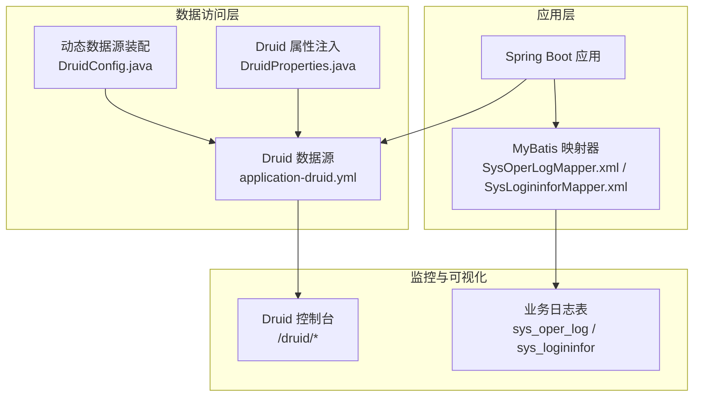
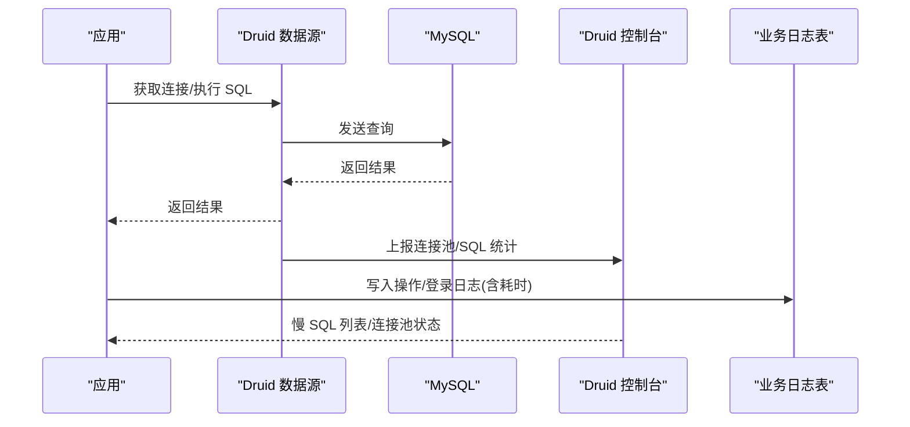
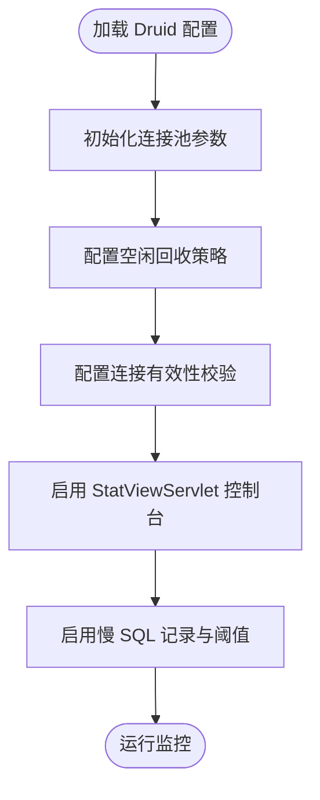
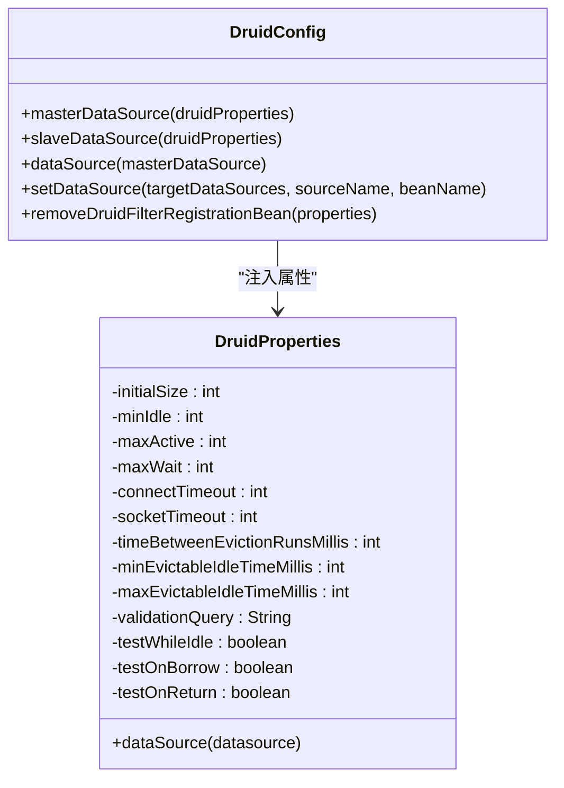
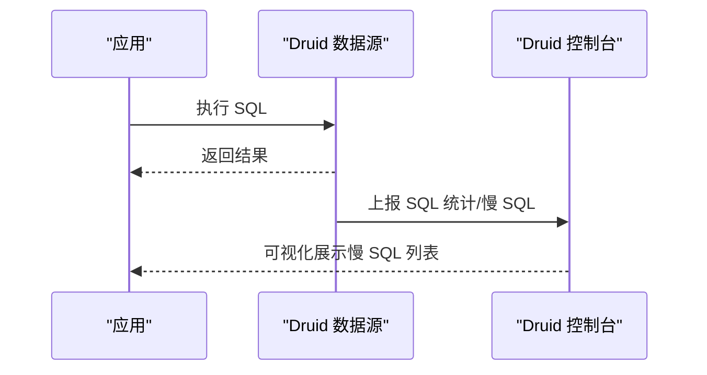
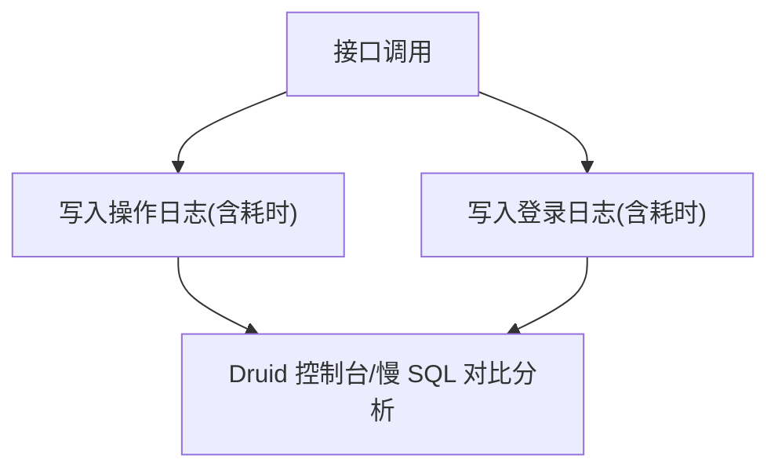
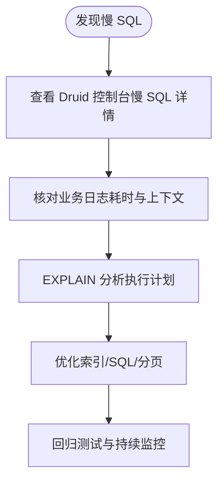
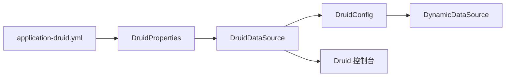

# 数据库性能监控

<cite>
**本文引用的文件**
- [application-druid.yml](file://XingChen-Vue/xingchen-admin/src/main/resources/application-druid.yml)
- [application.yml](file://XingChen-Vue/xingchen-admin/src/main/resources/application.yml)
- [DruidConfig.java](file://XingChen-Vue/xingchen-framework/src/main/java/com/xingchen/framework/config/DruidConfig.java)
- [DruidProperties.java](file://XingChen-Vue/xingchen-framework/src/main/java/com/xingchen/framework/config/properties/DruidProperties.java)
- [SysOperLogMapper.xml](file://XingChen-Vue/xingchen-system/src/main/resources/mapper/system/SysOperLogMapper.xml)
- [SysLogininforMapper.xml](file://XingChen-Vue/xingchen-system/src/main/resources/mapper/system/SysLogininforMapper.xml)
</cite>

## 目录
1. [简介](#简介)
2. [项目结构](#项目结构)
3. [核心组件](#核心组件)
4. [架构总览](#架构总览)
5. [详细组件分析](#详细组件分析)
6. [依赖分析](#依赖分析)
7. [性能考量](#性能考量)
8. [故障排查指南](#故障排查指南)
9. [结论](#结论)
10. [附录](#附录)

## 简介
本指南围绕健康管理系统中的数据库性能监控体系展开，重点覆盖以下方面：
- 连接池与连接数监控：基于 Druid 的连接池配置与控制台监控
- 查询性能监控：慢查询日志、SQL 执行统计与慢 SQL 记录
- 锁等待监控：通过 SQL 审计墙与慢查询定位潜在锁问题
- 缓冲池监控：MyBatis 与 Druid 统计联动观测执行计划与耗时
- 性能告警与可视化：结合 Druid 控制台与业务日志进行趋势分析
- 监控面板使用与问题诊断：Druid 监控面板指标解读与常见问题识别

## 项目结构
本项目采用 Spring Boot + MyBatis 架构，数据库连接通过 Druid 连接池统一管理；监控能力由 Druid 提供，业务侧通过操作日志与登录日志记录关键指标，辅助性能分析。

**图表来源**
- [application-druid.yml:1-61](file://XingChen-Vue/xingchen-admin/src/main/resources/application-druid.yml#L1-L61)
- [DruidConfig.java:32-80](file://XingChen-Vue/xingchen-framework/src/main/java/com/xingchen/framework/config/DruidConfig.java#L32-L80)
- [DruidProperties.java:54-88](file://XingChen-Vue/xingchen-framework/src/main/java/com/xingchen/framework/config/properties/DruidProperties.java#L54-L88)
- [SysOperLogMapper.xml:32-35](file://XingChen-Vue/xingchen-system/src/main/resources/mapper/system/SysOperLogMapper.xml#L32-L35)
- [SysLogininforMapper.xml:19-22](file://XingChen-Vue/xingchen-system/src/main/resources/mapper/system/SysLogininforMapper.xml#L19-L22)

**章节来源**
- [application-druid.yml:1-61](file://XingChen-Vue/xingchen-admin/src/main/resources/application-druid.yml#L1-L61)
- [application.yml:48-148](file://XingChen-Vue/xingchen-admin/src/main/resources/application.yml#L48-L148)

## 核心组件
- Druid 数据源与连接池配置：提供连接数、超时、空闲回收等参数，支持慢 SQL 记录与控制台监控。
- 动态数据源装配：根据主从配置自动装配，支持从库启用与切换。
- 业务日志映射：操作日志与登录日志映射器记录耗时与请求上下文，便于性能回溯。
- 监控控制台：Druid StatViewServlet 提供实时连接池状态、SQL 统计与慢 SQL 列表。

**章节来源**
- [DruidConfig.java:32-80](file://XingChen-Vue/xingchen-framework/src/main/java/com/xingchen/framework/config/DruidConfig.java#L32-L80)
- [DruidProperties.java:14-88](file://XingChen-Vue/xingchen-framework/src/main/java/com/xingchen/framework/config/properties/DruidProperties.java#L14-L88)
- [SysOperLogMapper.xml:32-35](file://XingChen-Vue/xingchen-system/src/main/resources/mapper/system/SysOperLogMapper.xml#L32-L35)
- [SysLogininforMapper.xml:19-22](file://XingChen-Vue/xingchen-system/src/main/resources/mapper/system/SysLogininforMapper.xml#L19-L22)

## 架构总览
下图展示数据库性能监控的关键交互：应用通过 Druid 连接池访问数据库，Druid 输出统计与慢 SQL；业务日志记录关键指标；Druid 控制台用于集中监控与可视化。

**图表来源**
- [application-druid.yml:44-58](file://XingChen-Vue/xingchen-admin/src/main/resources/application-druid.yml#L44-L58)
- [SysOperLogMapper.xml:32-35](file://XingChen-Vue/xingchen-system/src/main/resources/mapper/system/SysOperLogMapper.xml#L32-L35)
- [SysLogininforMapper.xml:19-22](file://XingChen-Vue/xingchen-system/src/main/resources/mapper/system/SysLogininforMapper.xml#L19-L22)

## 详细组件分析

### Druid 数据源与连接池配置
- 连接池参数：初始连接数、最小/最大空闲连接、最大活跃连接、获取连接最大等待时间、连接超时与网络超时等。
- 空闲连接回收：空闲检测周期、最小/最大空闲存活时间。
- 校验策略：空闲时校验、借出/归还时不校验，以平衡性能与安全。
- 控制台与慢 SQL：开启 StatViewServlet 与慢 SQL 记录，设置慢 SQL 阈值。

**图表来源**
- [application-druid.yml:19-41](file://XingChen-Vue/xingchen-admin/src/main/resources/application-druid.yml#L19-L41)
- [application-druid.yml:44-58](file://XingChen-Vue/xingchen-admin/src/main/resources/application-druid.yml#L44-L58)

**章节来源**
- [application-druid.yml:19-41](file://XingChen-Vue/xingchen-admin/src/main/resources/application-druid.yml#L19-L41)
- [application-druid.yml:44-58](file://XingChen-Vue/xingchen-admin/src/main/resources/application-druid.yml#L44-L58)

### 动态数据源装配与从库支持
- 主从数据源装配：根据配置自动装配主库与可选从库，支持按需启用。
- 广告清理：移除 Druid 控制台底部广告，改善运维体验。

**图表来源**
- [DruidConfig.java:32-80](file://XingChen-Vue/xingchen-framework/src/main/java/com/xingchen/framework/config/DruidConfig.java#L32-L80)
- [DruidProperties.java:14-88](file://XingChen-Vue/xingchen-framework/src/main/java/com/xingchen/framework/config/properties/DruidProperties.java#L14-L88)

**章节来源**
- [DruidConfig.java:32-80](file://XingChen-Vue/xingchen-framework/src/main/java/com/xingchen/framework/config/DruidConfig.java#L32-L80)
- [DruidConfig.java:84-125](file://XingChen-Vue/xingchen-framework/src/main/java/com/xingchen/framework/config/DruidConfig.java#L84-L125)
- [DruidProperties.java:14-88](file://XingChen-Vue/xingchen-framework/src/main/java/com/xingchen/framework/config/properties/DruidProperties.java#L14-L88)

### 慢查询日志与 SQL 执行统计
- 慢 SQL 记录：开启后将慢于阈值的 SQL 记录到日志，便于后续分析。
- SQL 合并：合并同类 SQL，减少重复统计噪声。
- 控制台查看：在 /druid 页面查看慢 SQL 列表与执行统计。

**图表来源**
- [application-druid.yml:55-58](file://XingChen-Vue/xingchen-admin/src/main/resources/application-druid.yml#L55-L58)

**章节来源**
- [application-druid.yml:55-58](file://XingChen-Vue/xingchen-admin/src/main/resources/application-druid.yml#L55-L58)

### 业务日志与性能回溯
- 操作日志：记录接口调用、耗时、状态等，便于定位慢接口与异常。
- 登录日志：记录登录行为与时间，辅助排查登录阶段的性能瓶颈。

**图表来源**
- [SysOperLogMapper.xml:32-35](file://XingChen-Vue/xingchen-system/src/main/resources/mapper/system/SysOperLogMapper.xml#L32-L35)
- [SysLogininforMapper.xml:19-22](file://XingChen-Vue/xingchen-system/src/main/resources/mapper/system/SysLogininforMapper.xml#L19-L22)

**章节来源**
- [SysOperLogMapper.xml:32-35](file://XingChen-Vue/xingchen-system/src/main/resources/mapper/system/SysOperLogMapper.xml#L32-L35)
- [SysLogininforMapper.xml:19-22](file://XingChen-Vue/xingchen-system/src/main/resources/mapper/system/SysLogininforMapper.xml#L19-L22)

### 缓冲池与执行计划分析
- 缓冲池监控：通过 Druid 控制台观察连接池命中率、活跃连接数、等待队列长度等，间接反映缓冲池压力。
- 执行计划：结合慢 SQL 与业务日志，定位热点表与慢查询，配合数据库 EXPLAIN 分析执行计划优化点。

**图表来源**
- [application-druid.yml:44-58](file://XingChen-Vue/xingchen-admin/src/main/resources/application-druid.yml#L44-L58)
- [SysOperLogMapper.xml:32-35](file://XingChen-Vue/xingchen-system/src/main/resources/mapper/system/SysOperLogMapper.xml#L32-L35)

**章节来源**
- [application-druid.yml:44-58](file://XingChen-Vue/xingchen-admin/src/main/resources/application-druid.yml#L44-L58)
- [SysOperLogMapper.xml:32-35](file://XingChen-Vue/xingchen-system/src/main/resources/mapper/system/SysOperLogMapper.xml#L32-L35)

## 依赖分析
- Druid 配置与属性注入：DruidConfig 通过 @ConfigurationProperties 注入 application-druid.yml 中的 druid 参数，并装配动态数据源。
- 运行时依赖：DruidProperties 将配置值设置到 DruidDataSource 实例，影响连接池行为。
- 监控依赖：StatViewServlet 与慢 SQL 过滤器由 application-druid.yml 启用，DruidConfig 提供控制台广告清理。

**图表来源**
- [application-druid.yml:1-61](file://XingChen-Vue/xingchen-admin/src/main/resources/application-druid.yml#L1-L61)
- [DruidProperties.java:54-88](file://XingChen-Vue/xingchen-framework/src/main/java/com/xingchen/framework/config/properties/DruidProperties.java#L54-L88)
- [DruidConfig.java:32-80](file://XingChen-Vue/xingchen-framework/src/main/java/com/xingchen/framework/config/DruidConfig.java#L32-L80)

**章节来源**
- [application-druid.yml:1-61](file://XingChen-Vue/xingchen-admin/src/main/resources/application-druid.yml#L1-L61)
- [DruidProperties.java:54-88](file://XingChen-Vue/xingchen-framework/src/main/java/com/xingchen/framework/config/properties/DruidProperties.java#L54-L88)
- [DruidConfig.java:32-80](file://XingChen-Vue/xingchen-framework/src/main/java/com/xingchen/framework/config/DruidConfig.java#L32-L80)

## 性能考量
- 连接池参数调优：根据并发与数据库承载能力调整初始/最大连接数、等待时间与空闲回收周期。
- 慢 SQL 阈值：结合业务场景设定合理阈值，避免误报或漏报。
- 日志与统计：开启慢 SQL 记录与 SQL 合并，减少噪声，提升分析效率。
- 业务日志耗时：在关键接口记录耗时，与数据库慢 SQL 对齐，快速定位瓶颈。

[本节为通用指导，无需列出具体文件来源]

## 故障排查指南
- 连接池耗尽：关注 Druid 控制台“活动连接数”与“等待计数”，结合业务日志定位长事务与慢查询。
- 慢 SQL 高发：在 /druid 页面查看慢 SQL 列表，结合业务日志与 EXPLAIN 分析热点表与索引缺失。
- 从库不可用：检查 slave.enabled 与连接参数，确认从库可达性与权限。
- 控制台访问受限：确认 StatViewServlet 白名单与登录凭据配置。

**章节来源**
- [application-druid.yml:44-51](file://XingChen-Vue/xingchen-admin/src/main/resources/application-druid.yml#L44-L51)
- [application-druid.yml:55-58](file://XingChen-Vue/xingchen-admin/src/main/resources/application-druid.yml#L55-L58)
- [DruidConfig.java:84-125](file://XingChen-Vue/xingchen-framework/src/main/java/com/xingchen/framework/config/DruidConfig.java#L84-L125)

## 结论
通过 Druid 连接池与控制台、业务日志与慢 SQL 记录的协同，本项目构建了覆盖连接数、查询性能、锁等待与缓冲池的数据库性能监控体系。建议持续关注连接池指标与慢 SQL 趋势，结合业务日志与数据库执行计划进行优化，形成闭环的性能治理流程。

[本节为总结性内容，无需列出具体文件来源]

## 附录

### 监控面板使用与指标解读
- 登录路径：访问 /druid，使用配置中的用户名与密码登录。
- 关键指标：
  - 连接池状态：活动连接数、空闲连接数、等待计数、创建/销毁计数。
  - SQL 统计：SQL 执行次数、平均耗时、慢 SQL 数量与列表。
  - 慢 SQL 阈值：根据业务场景调整，确保及时发现异常。
- 常见问题识别：
  - 活动连接数长期接近上限：考虑扩容或优化 SQL。
  - 等待计数持续升高：检查慢 SQL 与锁等待。
  - 慢 SQL 数量突增：排查热点接口与新上线功能。

**章节来源**
- [application-druid.yml:44-58](file://XingChen-Vue/xingchen-admin/src/main/resources/application-druid.yml#L44-L58)

### 监控配置示例（路径）
- Druid 连接池与控制台配置：[application-druid.yml:1-61](file://XingChen-Vue/xingchen-admin/src/main/resources/application-druid.yml#L1-L61)
- 动态数据源装配：[DruidConfig.java:32-80](file://XingChen-Vue/xingchen-framework/src/main/java/com/xingchen/framework/config/DruidConfig.java#L32-L80)
- Druid 属性注入：[DruidProperties.java:14-88](file://XingChen-Vue/xingchen-framework/src/main/java/com/xingchen/framework/config/properties/DruidProperties.java#L14-L88)
- 操作日志写入：[SysOperLogMapper.xml:32-35](file://XingChen-Vue/xingchen-system/src/main/resources/mapper/system/SysOperLogMapper.xml#L32-L35)
- 登录日志写入：[SysLogininforMapper.xml:19-22](file://XingChen-Vue/xingchen-system/src/main/resources/mapper/system/SysLogininforMapper.xml#L19-L22)