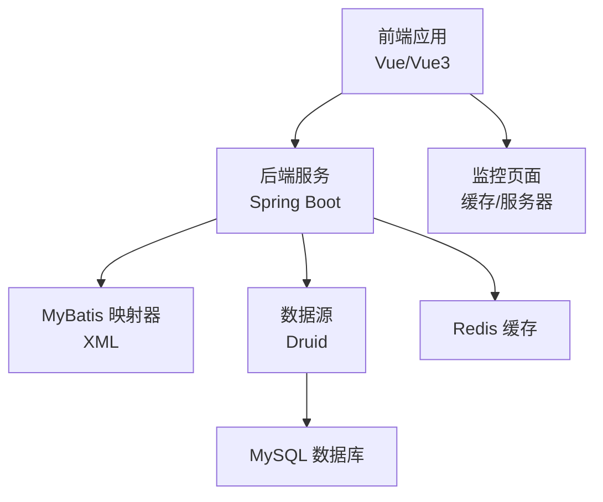
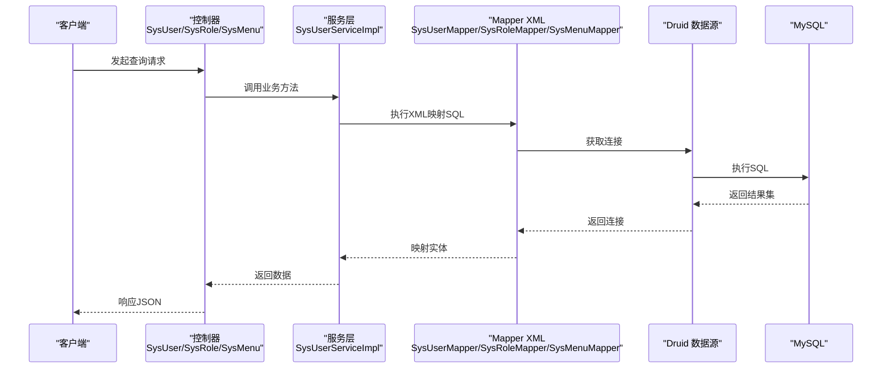
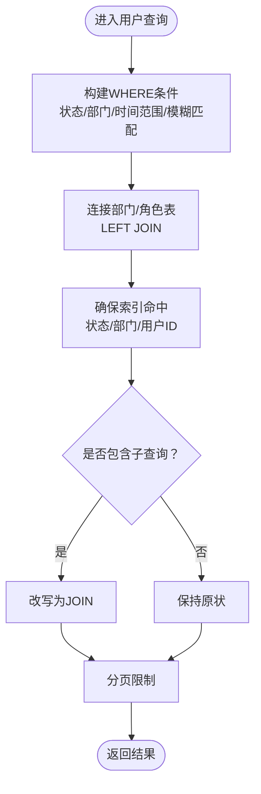
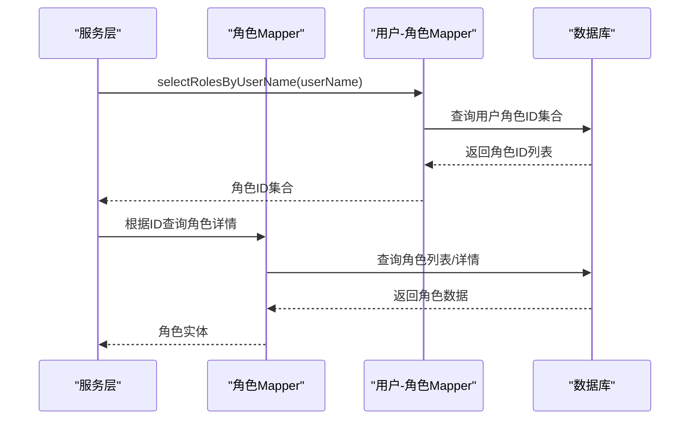
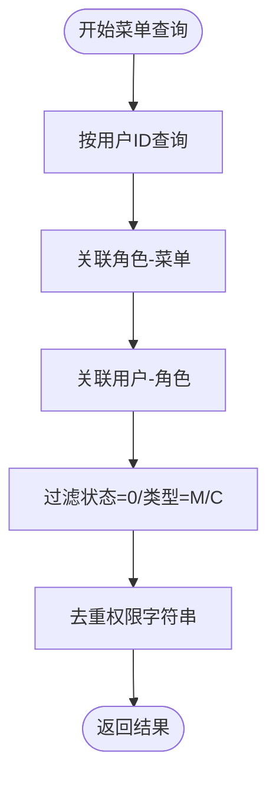
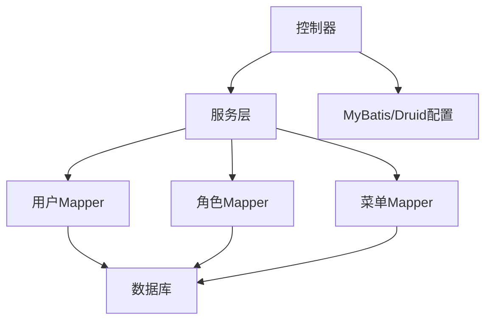

# 查询优化策略

<cite>
**本文引用的文件**
- [SysUserMapper.xml](file://XingChen-Vue/xingchen-system/src/main/resources/mapper/system/SysUserMapper.xml)
- [SysRoleMapper.xml](file://XingChen-Vue/xingchen-system/src/main/resources/mapper/system/SysRoleMapper.xml)
- [SysMenuMapper.xml](file://XingChen-Vue/xingchen-system/src/main/resources/mapper/system/SysMenuMapper.xml)
- [SysUserRoleMapper.xml](file://XingChen-Vue/xingchen-system/src/main/resources/mapper/system/SysUserRoleMapper.xml)
- [SysRoleMenuMapper.xml](file://XingChen-Vue/xingchen-system/src/main/resources/mapper/system/SysRoleMenuMapper.xml)
- [SysPointsLogMapper.xml](file://XingChen-Vue/xingchen-system/src/main/resources/mapper/system/SysPointsLogMapper.xml)
- [SysNoticeMapper.xml](file://XingChen-Vue/xingchen-system/src/main/resources/mapper/system/SysNoticeMapper.xml)
- [mapper.xml.vm](file://XingChen-Vue/xingchen-generator/src/main/resources/vm/xml/mapper.xml.vm)
- [mybatis-config.xml](file://XingChen-Vue/xingchen-admin/src/main/resources/mybatis/mybatis-config.xml)
- [application.yml](file://XingChen-Vue/xingchen-admin/src/main/resources/application.yml)
- [application-druid.yml](file://XingChen-Vue/xingchen-admin/src/main/resources/application-druid.yml)
- [DruidProperties.java](file://XingChen-Vue/xingchen-framework/src/main/java/com/xingchen/framework/config/properties/DruidProperties.java)
- [SysUserController.java](file://XingChen-Vue/xingchen-admin/src/main/java/com/xingchen/web/controller/system/SysUserController.java)
- [SysRoleController.java](file://XingChen-Vue/xingchen-admin/src/main/java/com/xingchen/web/controller/system/SysRoleController.java)
- [SysMenuController.java](file://XingChen-Vue/xingchen-admin/src/main/java/com/xingchen/web/controller/system/SysMenuController.java)
- [SysUserServiceImpl.java](file://XingChen-Vue/xingchen-system/src/main/java/com/xingchen/system/service/impl/SysUserServiceImpl.java)
- [SqlUtil.java](file://XingChen-Vue/xingchen-common/src/main/java/com/xingchen/common/utils/sql/SqlUtil.java)
- [index.vue](file://XingChen-Vue3/src/views/monitor/cache/index.vue)
- [index.vue](file://XingChen-Vue3/src/views/monitor/server/index.vue)
</cite>

## 目录
1. [简介](#简介)
2. [项目结构](#项目结构)
3. [核心组件](#核心组件)
4. [架构总览](#架构总览)
5. [详细组件分析](#详细组件分析)
6. [依赖分析](#依赖分析)
7. [性能考量](#性能考量)
8. [故障排查指南](#故障排查指南)
9. [结论](#结论)
10. [附录](#附录)

## 简介
本指南聚焦于数据库查询优化策略，结合系统中用户、角色、菜单等核心业务场景，系统讲解SQL优化技巧（SELECT、JOIN、子查询、聚合）、索引策略、查询计划分析与执行性能评估方法，并提供慢查询识别工具使用、监控指标与常见问题的解决方案。文档以实际Mapper XML与配置文件为依据，辅以流程图与时序图，帮助读者快速定位与解决性能瓶颈。

## 项目结构
系统采用前后端分离架构，后端基于Spring Boot + MyBatis，数据库连接池使用Druid，监控集成Druid控制台与Redis缓存监控，前端提供缓存与服务器监控页面。

**图表来源**
- [application.yml:104-112](file://XingChen-Vue/xingchen-admin/src/main/resources/application.yml#L104-L112)
- [application-druid.yml:1-61](file://XingChen-Vue/xingchen-admin/src/main/resources/application-druid.yml#L1-L61)
- [mybatis-config.xml:1-21](file://XingChen-Vue/xingchen-admin/src/main/resources/mybatis/mybatis-config.xml#L1-L21)

**章节来源**
- [application.yml:104-112](file://XingChen-Vue/xingchen-admin/src/main/resources/application.yml#L104-L112)
- [application-druid.yml:1-61](file://XingChen-Vue/xingchen-admin/src/main/resources/application-druid.yml#L1-L61)
- [mybatis-config.xml:1-21](file://XingChen-Vue/xingchen-admin/src/main/resources/mybatis/mybatis-config.xml#L1-L21)

## 核心组件
- 用户查询：用户列表、按角色分配/未分配查询、唯一性校验、按用户名/手机/邮箱查询。
- 角色查询：角色列表、按用户查询权限角色、按用户ID查询角色ID集合、唯一性校验。
- 菜单查询：菜单树、按用户查询菜单、按角色查询菜单ID集合、权限字符串查询。
- 关联表：用户-角色、角色-菜单多对多关联。
- 辅助：生成器模板自动拼装查询条件；安全工具类限制排序参数长度与非法关键字。

**章节来源**
- [SysUserMapper.xml:60-144](file://XingChen-Vue/xingchen-system/src/main/resources/mapper/system/SysUserMapper.xml#L60-L144)
- [SysRoleMapper.xml:33-94](file://XingChen-Vue/xingchen-system/src/main/resources/mapper/system/SysRoleMapper.xml#L33-L94)
- [SysMenuMapper.xml:36-120](file://XingChen-Vue/xingchen-system/src/main/resources/mapper/system/SysMenuMapper.xml#L36-L120)
- [SysUserRoleMapper.xml:12-36](file://XingChen-Vue/xingchen-system/src/main/resources/mapper/system/SysUserRoleMapper.xml#L12-L36)
- [SysRoleMenuMapper.xml:12-32](file://XingChen-Vue/xingchen-system/src/main/resources/mapper/system/SysRoleMenuMapper.xml#L12-L32)
- [mapper.xml.vm:25-51](file://XingChen-Vue/xingchen-generator/src/main/resources/vm/xml/mapper.xml.vm#L25-L51)
- [SqlUtil.java:11-46](file://XingChen-Vue/xingchen-common/src/main/java/com/xingchen/common/utils/sql/SqlUtil.java#L11-L46)

## 架构总览
后端通过MyBatis将XML映射器编译为SQL，经Druid连接池执行，结果映射到实体对象。前端通过接口调用后端，监控页面展示缓存与服务器状态。

**图表来源**
- [SysUserController.java](file://XingChen-Vue/xingchen-admin/src/main/java/com/xingchen/web/controller/system/SysUserController.java)
- [SysRoleController.java](file://XingChen-Vue/xingchen-admin/src/main/java/com/xingchen/web/controller/system/SysRoleController.java)
- [SysMenuController.java](file://XingChen-Vue/xingchen-admin/src/main/java/com/xingchen/web/controller/system/SysMenuController.java)
- [SysUserServiceImpl.java:75-130](file://XingChen-Vue/xingchen-system/src/main/java/com/xingchen/system/service/impl/SysUserServiceImpl.java#L75-L130)
- [SysUserMapper.xml:60-87](file://XingChen-Vue/xingchen-system/src/main/resources/mapper/system/SysUserMapper.xml#L60-L87)
- [SysRoleMapper.xml:33-57](file://XingChen-Vue/xingchen-system/src/main/resources/mapper/system/SysRoleMapper.xml#L33-L57)
- [SysMenuMapper.xml:36-75](file://XingChen-Vue/xingchen-system/src/main/resources/mapper/system/SysMenuMapper.xml#L36-L75)

## 详细组件分析

### 用户查询优化
- 优化要点
  - 精准投影：优先只选择必要列，避免SELECT *。
  - 条件过滤：利用WHERE子句与参数绑定，避免全表扫描。
  - JOIN顺序：先小表驱动，减少中间结果集。
  - 子查询：尽量改写为JOIN，必要时确保子查询有索引支撑。
  - 分页：结合PageHelper，避免一次性返回大量数据。
- 实战建议
  - 用户列表查询：对用户状态、部门、创建时间等常用过滤字段建立索引。
  - 唯一性校验：使用LIMIT 1，避免扫描整表。
  - 角色关联：在用户-角色中间表上建立(user_id, role_id)联合索引。
- 优化前后对比思路
  - 优化前：全表扫描 + 多次子查询。
  - 优化后：精准列投影 + 索引覆盖 + JOIN替代子查询 + 分页。

**图表来源**
- [SysUserMapper.xml:60-87](file://XingChen-Vue/xingchen-system/src/main/resources/mapper/system/SysUserMapper.xml#L60-L87)
- [SysUserMapper.xml:89-122](file://XingChen-Vue/xingchen-system/src/main/resources/mapper/system/SysUserMapper.xml#L89-L122)
- [SysUserRoleMapper.xml:12-36](file://XingChen-Vue/xingchen-system/src/main/resources/mapper/system/SysUserRoleMapper.xml#L12-L36)

**章节来源**
- [SysUserMapper.xml:60-144](file://XingChen-Vue/xingchen-system/src/main/resources/mapper/system/SysUserMapper.xml#L60-L144)
- [SysUserRoleMapper.xml:12-36](file://XingChen-Vue/xingchen-system/src/main/resources/mapper/system/SysUserRoleMapper.xml#L12-L36)

### 角色查询优化
- 优化要点
  - 角色列表：对角色状态、创建时间、角色名/键进行过滤时，确保索引。
  - 按用户查询角色：通过用户-角色中间表快速定位。
  - 唯一性校验：使用LIMIT 1，避免全表扫描。
- 实战建议
  - 在sys_user_role(role_id)上建立索引，提升按角色查询用户列表效率。
  - 对角色名/键建立唯一索引，加速校验。

**图表来源**
- [SysUserServiceImpl.java:138-147](file://XingChen-Vue/xingchen-system/src/main/java/com/xingchen/system/service/impl/SysUserServiceImpl.java#L138-L147)
- [SysRoleMapper.xml:68-74](file://XingChen-Vue/xingchen-system/src/main/resources/mapper/system/SysRoleMapper.xml#L68-L74)
- [SysUserRoleMapper.xml:12-18](file://XingChen-Vue/xingchen-system/src/main/resources/mapper/system/SysUserRoleMapper.xml#L12-L18)

**章节来源**
- [SysRoleMapper.xml:33-94](file://XingChen-Vue/xingchen-system/src/main/resources/mapper/system/SysRoleMapper.xml#L33-L94)
- [SysUserRoleMapper.xml:12-18](file://XingChen-Vue/xingchen-system/src/main/resources/mapper/system/SysUserRoleMapper.xml#L12-L18)

### 菜单查询优化
- 优化要点
  - 菜单树：过滤菜单类型与状态，避免无关节点。
  - 按用户查询：通过用户-角色-菜单三层关联，确保每层都有索引。
  - 权限字符串：去重DISTINCT，必要时建立索引。
- 实战建议
  - 在sys_role_menu(menu_id)与(sys_role_id)上建立索引。
  - 对菜单状态、类型建立复合索引，加速筛选。

**图表来源**
- [SysMenuMapper.xml:58-86](file://XingChen-Vue/xingchen-system/src/main/resources/mapper/system/SysMenuMapper.xml#L58-L86)
- [SysMenuMapper.xml:106-113](file://XingChen-Vue/xingchen-system/src/main/resources/mapper/system/SysMenuMapper.xml#L106-L113)
- [SysRoleMenuMapper.xml:12-14](file://XingChen-Vue/xingchen-system/src/main/resources/mapper/system/SysRoleMenuMapper.xml#L12-L14)

**章节来源**
- [SysMenuMapper.xml:36-120](file://XingChen-Vue/xingchen-system/src/main/resources/mapper/system/SysMenuMapper.xml#L36-L120)
- [SysRoleMenuMapper.xml:12-14](file://XingChen-Vue/xingchen-system/src/main/resources/mapper/system/SysRoleMenuMapper.xml#L12-L14)

### 子查询与聚合查询优化
- 子查询优化
  - 将IN子查询改写为JOIN，减少重复扫描。
  - 对子查询结果建立临时索引或物化视图（如支持）。
- 聚合查询优化
  - 使用GROUP BY时明确筛选条件，避免全表分组。
  - 使用LIMIT限制输出，避免大结果集。
- 生成器模板
  - 代码生成器根据字段与查询类型自动生成WHERE片段，需注意避免过度模糊匹配导致索引失效。

**章节来源**
- [SysUserMapper.xml:82-84](file://XingChen-Vue/xingchen-system/src/main/resources/mapper/system/SysUserMapper.xml#L82-L84)
- [SysUserMapper.xml:112-122](file://XingChen-Vue/xingchen-system/src/main/resources/mapper/system/SysUserMapper.xml#L112-L122)
- [mapper.xml.vm:25-51](file://XingChen-Vue/xingchen-generator/src/main/resources/vm/xml/mapper.xml.vm#L25-L51)

### 索引使用策略
- 建议索引
  - sys_user(user_id, status, del_flag, user_name, phonenumber, email)
  - sys_dept(dept_id, ancestors)
  - sys_role(role_id, role_name, role_key, status)
  - sys_menu(menu_id, parent_id, status, menu_type)
  - sys_user_role(user_id, role_id)
  - sys_role_menu(role_id, menu_id)
- 索引维护
  - 定期分析表统计与索引使用率，清理冗余索引。
  - 对高并发写入表，平衡写入与读取的索引策略。

**章节来源**
- [SysUserMapper.xml:50-58](file://XingChen-Vue/xingchen-system/src/main/resources/mapper/system/SysUserMapper.xml#L50-L58)
- [SysRoleMapper.xml:24-31](file://XingChen-Vue/xingchen-system/src/main/resources/mapper/system/SysRoleMapper.xml#L24-L31)
- [SysMenuMapper.xml:31-34](file://XingChen-Vue/xingchen-system/src/main/resources/mapper/system/SysMenuMapper.xml#L31-L34)
- [SysUserRoleMapper.xml:7-10](file://XingChen-Vue/xingchen-system/src/main/resources/mapper/system/SysUserRoleMapper.xml#L7-L10)
- [SysRoleMenuMapper.xml:7-10](file://XingChen-Vue/xingchen-system/src/main/resources/mapper/system/SysRoleMenuMapper.xml#L7-L10)

### 查询计划分析与执行性能评估
- 使用EXPLAIN分析
  - 关注type、key、rows、filtered等字段，避免ALL与ref_or_null。
  - 优先使用覆盖索引，减少回表。
- 性能评估指标
  - 平均响应时间、P95/P99延迟、QPS、连接池利用率。
  - 慢查询日志阈值设置与统计。

**章节来源**
- [application-druid.yml:55-58](file://XingChen-Vue/xingchen-admin/src/main/resources/application-druid.yml#L55-L58)
- [DruidProperties.java:54-74](file://XingChen-Vue/xingchen-framework/src/main/java/com/xingchen/framework/config/properties/DruidProperties.java#L54-L74)

### 慢查询识别与监控
- 慢查询工具
  - Druid控制台：开启stat过滤器，设置慢SQL阈值，查看慢SQL统计。
  - Redis监控：缓存命中率、Key数量、内存使用、命令统计。
- 监控页面
  - 缓存监控页面展示运行时信息、命令统计与内存趋势。
  - 服务器监控页面展示CPU、内存、磁盘与JVM使用情况。

```mermaid
graph LR
DStat["Druid Stat 过滤器"] --> SlowSQL["慢SQL记录"]
SlowSQL --> Console["Druid 控制台"]
Console --> Analyze["慢查询分析"]
RC["Redis"] --> CacheMon["缓存监控页面"]
Host["主机/容器"] --> ServerMon["服务器监控页面"]
```

**图表来源**
- [application-druid.yml:42-61](file://XingChen-Vue/xingchen-admin/src/main/resources/application-druid.yml#L42-L61)
- [index.vue:19-56](file://XingChen-Vue3/src/views/monitor/cache/index.vue#L19-L56)
- [index.vue:65-86](file://XingChen-Vue3/src/views/monitor/server/index.vue#L65-L86)

**章节来源**
- [application-druid.yml:42-61](file://XingChen-Vue/xingchen-admin/src/main/resources/application-druid.yml#L42-L61)
- [index.vue:19-95](file://XingChen-Vue3/src/views/monitor/cache/index.vue#L19-L95)
- [index.vue:65-86](file://XingChen-Vue3/src/views/monitor/server/index.vue#L65-L86)

### 查询安全与输入校验
- SQL注入防护
  - 使用参数化查询与预编译语句，避免拼接SQL。
  - 限制ORDER BY参数长度与内容，防止注入与性能问题。
- 生成器模板
  - 自动拼接WHERE条件，需确保字段与查询类型合法。

**章节来源**
- [SqlUtil.java:11-46](file://XingChen-Vue/xingchen-common/src/main/java/com/xingchen/common/utils/sql/SqlUtil.java#L11-L46)
- [mapper.xml.vm:25-51](file://XingChen-Vue/xingchen-generator/src/main/resources/vm/xml/mapper.xml.vm#L25-L51)

## 依赖分析
- 组件耦合
  - 服务层依赖Mapper XML，Mapper XML依赖数据库表结构。
  - 控制器依赖服务层，服务层通过注解实现数据范围过滤。
- 外部依赖
  - Druid连接池与MySQL驱动。
  - MyBatis配置与PageHelper分页插件。

**图表来源**
- [SysUserController.java](file://XingChen-Vue/xingchen-admin/src/main/java/com/xingchen/web/controller/system/SysUserController.java)
- [SysUserServiceImpl.java:40-67](file://XingChen-Vue/xingchen-system/src/main/java/com/xingchen/system/service/impl/SysUserServiceImpl.java#L40-L67)
- [application.yml:104-112](file://XingChen-Vue/xingchen-admin/src/main/resources/application.yml#L104-L112)
- [application-druid.yml:1-61](file://XingChen-Vue/xingchen-admin/src/main/resources/application-druid.yml#L1-L61)

**章节来源**
- [SysUserServiceImpl.java:40-67](file://XingChen-Vue/xingchen-system/src/main/java/com/xingchen/system/service/impl/SysUserServiceImpl.java#L40-L67)
- [application.yml:104-112](file://XingChen-Vue/xingchen-admin/src/main/resources/application.yml#L104-L112)
- [application-druid.yml:1-61](file://XingChen-Vue/xingchen-admin/src/main/resources/application-druid.yml#L1-L61)

## 性能考量
- 连接池配置
  - 合理设置初始连接、最小空闲、最大活跃与等待超时，避免连接争用。
- 查询层面
  - 减少N+1查询，使用JOIN与批量查询。
  - 对高频查询建立合适的索引，定期维护。
- 缓存策略
  - 对热点数据使用Redis缓存，降低数据库压力。
- 监控与告警
  - 基于Druid与监控页面建立性能基线，异常及时告警。

[本节为通用指导，无需特定文件引用]

## 故障排查指南
- 常见问题
  - 查询缓慢：检查EXPLAIN执行计划，确认索引使用情况。
  - 内存占用高：关注慢SQL与大结果集，优化分页与投影。
  - 连接池耗尽：调整最大活跃连接与等待超时。
- 工具与步骤
  - 开启Druid慢SQL记录，定位慢查询。
  - 查看缓存命中率与Key分布，判断缓存策略有效性。
  - 结合服务器监控页面观察CPU与内存峰值。

**章节来源**
- [application-druid.yml:55-58](file://XingChen-Vue/xingchen-admin/src/main/resources/application-druid.yml#L55-L58)
- [index.vue:19-56](file://XingChen-Vue3/src/views/monitor/cache/index.vue#L19-L56)
- [index.vue:65-86](file://XingChen-Vue3/src/views/monitor/server/index.vue#L65-L86)

## 结论
通过索引优化、查询改写、连接池与监控体系的协同，可显著提升用户、角色、菜单等核心业务场景的查询性能。建议以生成器模板为基础，结合安全校验与分页策略，持续优化SQL执行计划，并建立完善的慢查询与性能监控机制。

[本节为总结性内容，无需特定文件引用]

## 附录
- 参考文件清单
  - 用户查询：SysUserMapper.xml、SysUserRoleMapper.xml、SysUserServiceImpl.java
  - 角色查询：SysRoleMapper.xml、SysUserRoleMapper.xml
  - 菜单查询：SysMenuMapper.xml、SysRoleMenuMapper.xml
  - 配置与监控：application.yml、application-druid.yml、mybatis-config.xml、DruidProperties.java
  - 安全与生成器：SqlUtil.java、mapper.xml.vm
  - 监控页面：缓存监控、服务器监控

**章节来源**
- [SysUserMapper.xml:60-144](file://XingChen-Vue/xingchen-system/src/main/resources/mapper/system/SysUserMapper.xml#L60-L144)
- [SysRoleMapper.xml:33-94](file://XingChen-Vue/xingchen-system/src/main/resources/mapper/system/SysRoleMapper.xml#L33-L94)
- [SysMenuMapper.xml:36-120](file://XingChen-Vue/xingchen-system/src/main/resources/mapper/system/SysMenuMapper.xml#L36-L120)
- [SysUserRoleMapper.xml:12-36](file://XingChen-Vue/xingchen-system/src/main/resources/mapper/system/SysUserRoleMapper.xml#L12-L36)
- [SysRoleMenuMapper.xml:12-32](file://XingChen-Vue/xingchen-system/src/main/resources/mapper/system/SysRoleMenuMapper.xml#L12-L32)
- [application.yml:104-112](file://XingChen-Vue/xingchen-admin/src/main/resources/application.yml#L104-L112)
- [application-druid.yml:1-61](file://XingChen-Vue/xingchen-admin/src/main/resources/application-druid.yml#L1-L61)
- [mybatis-config.xml:1-21](file://XingChen-Vue/xingchen-admin/src/main/resources/mybatis/mybatis-config.xml#L1-L21)
- [DruidProperties.java:54-74](file://XingChen-Vue/xingchen-framework/src/main/java/com/xingchen/framework/config/properties/DruidProperties.java#L54-L74)
- [SqlUtil.java:11-46](file://XingChen-Vue/xingchen-common/src/main/java/com/xingchen/common/utils/sql/SqlUtil.java#L11-L46)
- [mapper.xml.vm:25-51](file://XingChen-Vue/xingchen-generator/src/main/resources/vm/xml/mapper.xml.vm#L25-L51)
- [index.vue:19-95](file://XingChen-Vue3/src/views/monitor/cache/index.vue#L19-L95)
- [index.vue:65-86](file://XingChen-Vue3/src/views/monitor/server/index.vue#L65-L86)