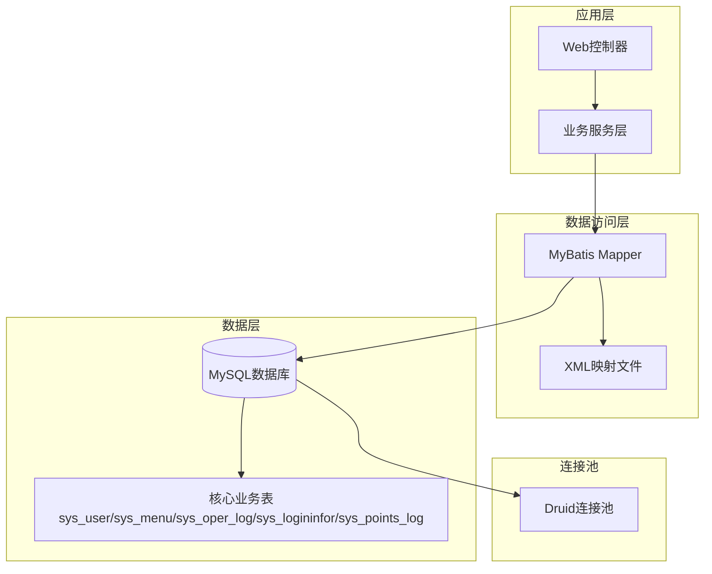
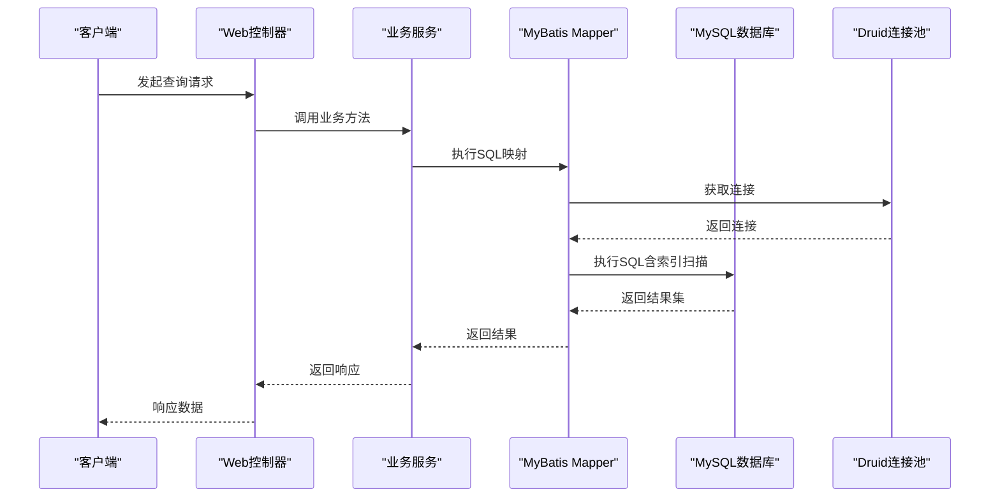
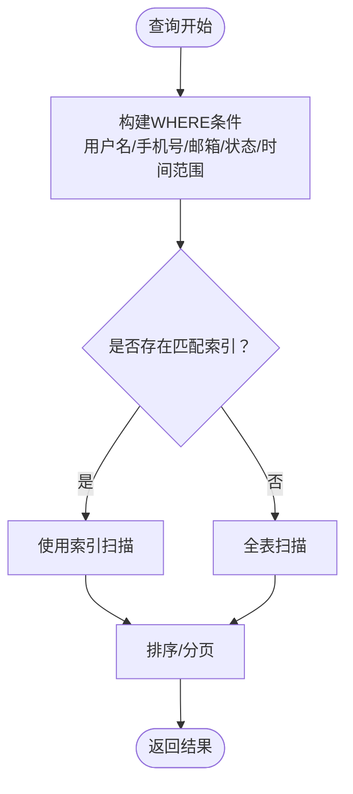
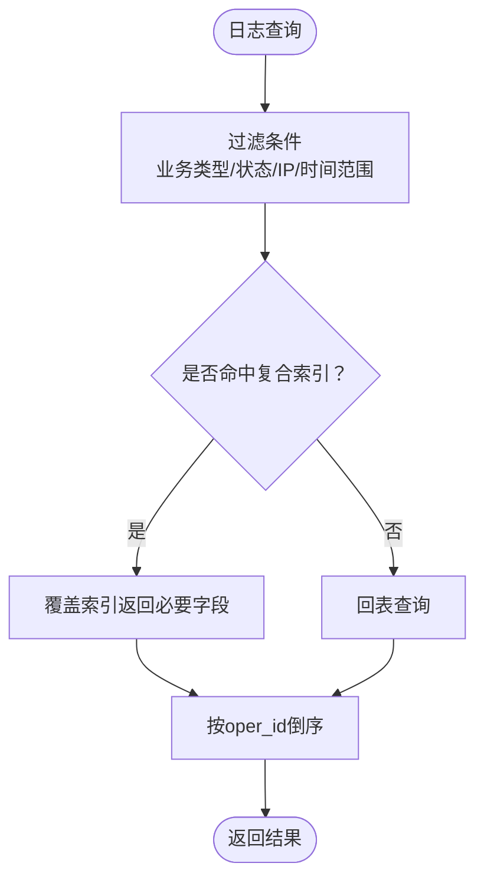
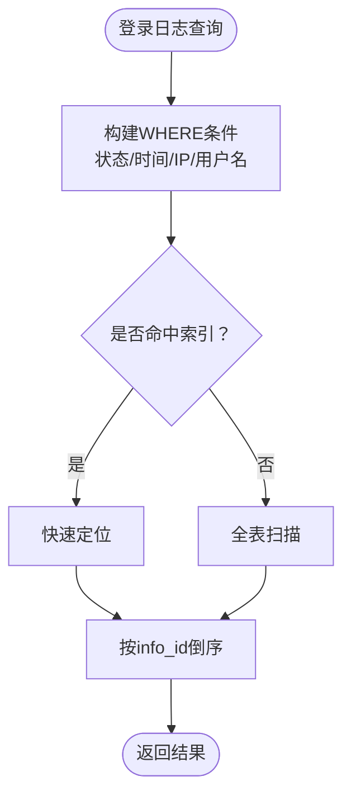
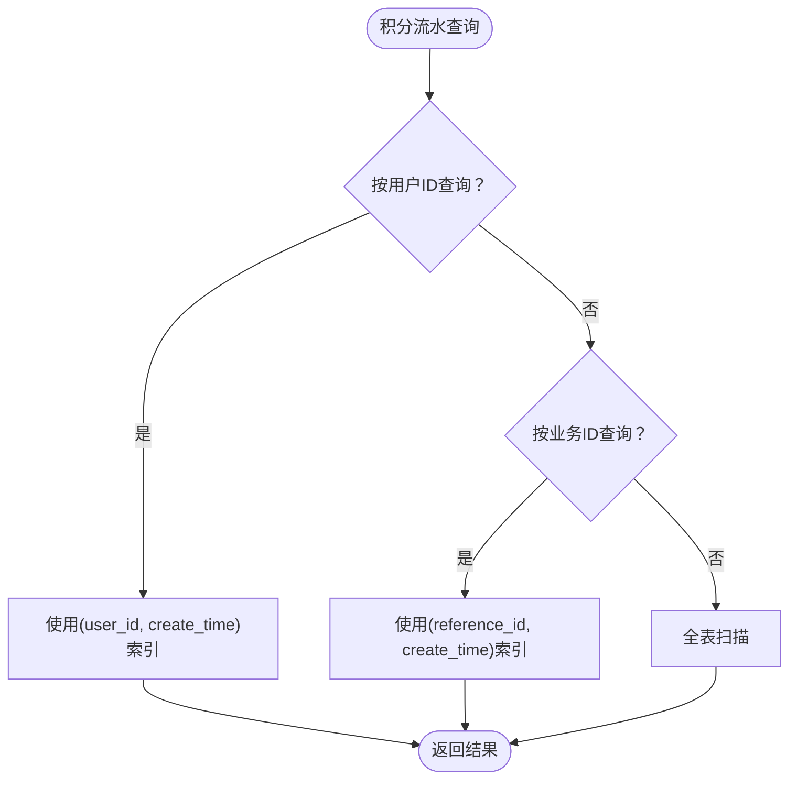
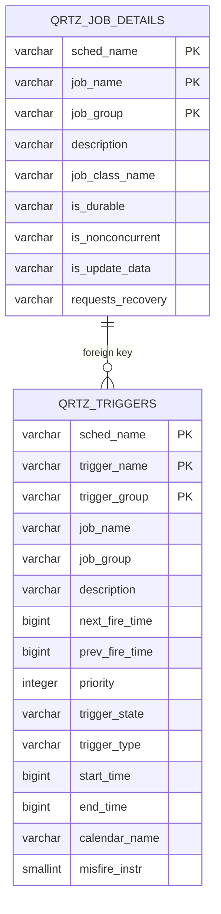
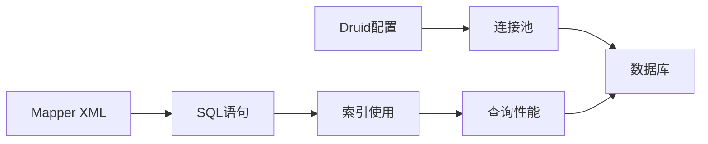

# 索引设计与优化

<cite>
**本文档引用的文件**
- [ry_20260321.sql](file://XingChen-Vue/sql/ry_20260321.sql)
- [points_log.sql](file://XingChen-Vue/sql/points_log.sql)
- [quartz.sql](file://XingChen-Vue/sql/quartz.sql)
- [SysUserMapper.xml](file://XingChen-Vue/xingchen-system/src/main/resources/mapper/system/SysUserMapper.xml)
- [SysOperLogMapper.xml](file://XingChen-Vue/xingchen-system/src/main/resources/mapper/system/SysOperLogMapper.xml)
- [SysLogininforMapper.xml](file://XingChen-Vue/xingchen-system/src/main/resources/mapper/system/SysLogininforMapper.xml)
- [SysPointsLogMapper.xml](file://XingChen-Vue/xingchen-system/src/main/resources/mapper/system/SysPointsLogMapper.xml)
- [application-druid.yml](file://XingChen-Vue/xingchen-admin/src/main/resources/application-druid.yml)
- [DruidConfig.java](file://XingChen-Vue/xingchen-framework/src/main/java/com/xingchen/framework/config/DruidConfig.java)
- [DruidProperties.java](file://XingChen-Vue/xingchen-framework/src/main/java/com/xingchen/framework/config/properties/DruidProperties.java)
</cite>

## 目录
1. [简介](#简介)
2. [项目结构](#项目结构)
3. [核心组件](#核心组件)
4. [架构概览](#架构概览)
5. [详细组件分析](#详细组件分析)
6. [依赖关系分析](#依赖关系分析)
7. [性能考量](#性能考量)
8. [故障排查指南](#故障排查指南)
9. [结论](#结论)
10. [附录](#附录)

## 简介
本指南围绕健康管理系统中的数据库索引设计与优化展开，结合系统实际表结构（如sys_user、sys_menu、sys_oper_log、sys_logininfor、sys_points_log等），系统阐述主键索引、唯一索引、复合索引、全文索引的设计原则与应用场景，并提供索引创建策略、维护方法与性能评估技术。同时给出基于现有SQL脚本与MyBatis映射文件的索引优化案例，包含索引创建语句示例与性能对比分析思路，帮助读者在实际项目中构建高效稳定的数据库索引体系。

## 项目结构
系统采用前后端分离架构，后端基于Spring Boot + MyBatis，数据库层通过Druid连接池进行统一管理。数据库初始化脚本位于XingChen-Vue/sql目录，包含系统核心业务表与定时任务相关表；MyBatis映射文件位于xingchen-system模块的mapper目录，承载查询逻辑与索引使用场景。

图表来源
- [SysUserMapper.xml:60-87](file://XingChen-Vue/xingchen-system/src/main/resources/mapper/system/SysUserMapper.xml#L60-L87)
- [SysOperLogMapper.xml:37-69](file://XingChen-Vue/xingchen-system/src/main/resources/mapper/system/SysOperLogMapper.xml#L37-L69)
- [SysLogininforMapper.xml:24-44](file://XingChen-Vue/xingchen-system/src/main/resources/mapper/system/SysLogininforMapper.xml#L24-L44)
- [ry_20260321.sql:41-64](file://XingChen-Vue/sql/ry_20260321.sql#L41-L64)
- [application-druid.yml:1-61](file://XingChen-Vue/xingchen-admin/src/main/resources/application-druid.yml#L1-L61)

章节来源
- [ry_20260321.sql:1-722](file://XingChen-Vue/sql/ry_20260321.sql#L1-L722)
- [SysUserMapper.xml:1-227](file://XingChen-Vue/xingchen-system/src/main/resources/mapper/system/SysUserMapper.xml#L1-L227)
- [SysOperLogMapper.xml:1-87](file://XingChen-Vue/xingchen-system/src/main/resources/mapper/system/SysOperLogMapper.xml#L1-L87)
- [SysLogininforMapper.xml:1-57](file://XingChen-Vue/xingchen-system/src/main/resources/mapper/system/SysLogininforMapper.xml#L1-L57)
- [application-druid.yml:1-61](file://XingChen-Vue/xingchen-admin/src/main/resources/application-druid.yml#L1-L61)

## 核心组件
- 系统用户表（sys_user）：包含用户基本信息、状态与时间戳字段，主键为user_id，支持按用户名、手机号、邮箱等字段查询。
- 菜单权限表（sys_menu）：包含菜单层级、类型与状态字段，主键为menu_id。
- 操作日志表（sys_oper_log）：记录业务操作详情，包含业务类型、状态、操作时间等字段，具备多处时间与状态过滤。
- 登录日志表（sys_logininfor）：记录登录行为，包含状态与登录时间字段，支持按状态与时间范围查询。
- 积分流水表（sys_points_log）：记录积分变动明细，包含用户ID与业务关联ID字段，具备用户维度与业务维度的查询需求。
- Quartz调度表（QRTZ_*）：定时任务相关表，包含作业详情、触发器、日历等，支撑系统定时任务执行。

章节来源
- [ry_20260321.sql:41-64](file://XingChen-Vue/sql/ry_20260321.sql#L41-L64)
- [ry_20260321.sql:133-156](file://XingChen-Vue/sql/ry_20260321.sql#L133-L156)
- [ry_20260321.sql:419-442](file://XingChen-Vue/sql/ry_20260321.sql#L419-L442)
- [ry_20260321.sql:561-575](file://XingChen-Vue/sql/ry_20260321.sql#L561-L575)
- [points_log.sql:4-18](file://XingChen-Vue/sql/points_log.sql#L4-L18)
- [quartz.sql:16-52](file://XingChen-Vue/sql/quartz.sql#L16-L52)

## 架构概览
系统通过Druid连接池统一管理数据库连接，MyBatis负责SQL映射与执行，业务层根据查询条件动态拼接WHERE子句，索引设计需与查询模式紧密匹配，以提升查询性能并降低锁竞争。

图表来源
- [SysUserMapper.xml:60-87](file://XingChen-Vue/xingchen-system/src/main/resources/mapper/system/SysUserMapper.xml#L60-L87)
- [SysOperLogMapper.xml:37-69](file://XingChen-Vue/xingchen-system/src/main/resources/mapper/system/SysOperLogMapper.xml#L37-L69)
- [SysLogininforMapper.xml:24-44](file://XingChen-Vue/xingchen-system/src/main/resources/mapper/system/SysLogininforMapper.xml#L24-L44)
- [application-druid.yml:1-61](file://XingChen-Vue/xingchen-admin/src/main/resources/application-druid.yml#L1-L61)

## 详细组件分析

### 系统用户表（sys_user）索引设计
- 当前索引
  - 主键索引：user_id（自增主键）
  - 唯一索引：无（建议为用户名、邮箱、手机号添加唯一索引）
- 查询模式
  - 按用户名、手机号、邮箱精确查询或模糊查询
  - 按状态过滤
  - 按部门层级递归查询（使用find_in_set）
  - 时间范围查询
- 设计建议
  - 唯一索引：user_name、email、phonenumber（确保业务唯一性）
  - 复合索引：(status, create_time) 用于状态筛选与分页
  - 复合索引：(dept_id, status) 用于部门维度的数据范围过滤
- 性能评估
  - 使用EXPLAIN分析查询计划，确认索引命中
  - 关注慢查询日志，识别未命中索引的查询

图表来源
- [SysUserMapper.xml:60-87](file://XingChen-Vue/xingchen-system/src/main/resources/mapper/system/SysUserMapper.xml#L60-L87)

章节来源
- [ry_20260321.sql:41-64](file://XingChen-Vue/sql/ry_20260321.sql#L41-L64)
- [SysUserMapper.xml:60-87](file://XingChen-Vue/xingchen-system/src/main/resources/mapper/system/SysUserMapper.xml#L60-L87)

### 操作日志表（sys_oper_log）索引设计
- 当前索引
  - 主键索引：oper_id
  - 复合索引：business_type、status、oper_time
- 查询模式
  - 按业务类型、状态、操作人、IP、时间范围过滤
  - 按oper_id查询详情
- 设计建议
  - 复合索引：(business_type, status, oper_time) 已满足常见查询
  - 若存在高频按oper_name或oper_ip的过滤，可考虑增加相应复合索引
- 性能评估
  - 对于大量写入的日志表，注意写入性能与索引维护成本的平衡

图表来源
- [ry_20260321.sql:419-442](file://XingChen-Vue/sql/ry_20260321.sql#L419-L442)
- [SysOperLogMapper.xml:37-69](file://XingChen-Vue/xingchen-system/src/main/resources/mapper/system/SysOperLogMapper.xml#L37-L69)

章节来源
- [ry_20260321.sql:419-442](file://XingChen-Vue/sql/ry_20260321.sql#L419-L442)
- [SysOperLogMapper.xml:37-69](file://XingChen-Vue/xingchen-system/src/main/resources/mapper/system/SysOperLogMapper.xml#L37-L69)

### 登录日志表（sys_logininfor）索引设计
- 当前索引
  - 主键索引：info_id
  - 复合索引：status、login_time
- 查询模式
  - 按状态、登录时间范围过滤
  - 按IP、用户名模糊查询
- 设计建议
  - 复合索引：(status, login_time) 已满足常见查询
  - 若存在高频按user_name的过滤，可考虑增加(user_name, login_time)复合索引
- 性能评估
  - 登录日志通常写多读少，需关注写入吞吐与索引碎片化

图表来源
- [ry_20260321.sql:561-575](file://XingChen-Vue/sql/ry_20260321.sql#L561-L575)
- [SysLogininforMapper.xml:24-44](file://XingChen-Vue/xingchen-system/src/main/resources/mapper/system/SysLogininforMapper.xml#L24-L44)

章节来源
- [ry_20260321.sql:561-575](file://XingChen-Vue/sql/ry_20260321.sql#L561-L575)
- [SysLogininforMapper.xml:24-44](file://XingChen-Vue/xingchen-system/src/main/resources/mapper/system/SysLogininforMapper.xml#L24-L44)

### 积分流水表（sys_points_log）索引设计
- 当前索引
  - 主键索引：id
  - 复合索引：user_id、reference_id
- 查询模式
  - 按用户ID查询流水
  - 按业务关联ID查询
- 设计建议
  - 复合索引：(user_id, create_time) 用于用户维度的分页查询
  - 复合索引：(reference_id, create_time) 用于业务维度的分页查询
- 性能评估
  - 流水表写入频繁，需评估索引对写入性能的影响

图表来源
- [points_log.sql:4-18](file://XingChen-Vue/sql/points_log.sql#L4-L18)
- [SysPointsLogMapper.xml:1-20](file://XingChen-Vue/xingchen-system/src/main/resources/mapper/system/SysPointsLogMapper.xml#L1-L20)

章节来源
- [points_log.sql:4-18](file://XingChen-Vue/sql/points_log.sql#L4-L18)
- [SysPointsLogMapper.xml:1-20](file://XingChen-Vue/xingchen-system/src/main/resources/mapper/system/SysPointsLogMapper.xml#L1-L20)

### Quartz调度表（QRTZ_*）索引设计
- 当前索引
  - 主键索引：各表主键
  - 外键约束：job_details与triggers之间的关联
- 查询模式
  - 任务状态查询、触发器状态查询、日历信息查询
- 设计建议
  - 对高频查询字段（如trigger_state、next_fire_time）建立合适索引
  - 注意外键索引与约束带来的维护成本
- 性能评估
  - 定时任务调度对系统稳定性影响较大，需确保索引不影响调度性能

图表来源
- [quartz.sql:16-52](file://XingChen-Vue/sql/quartz.sql#L16-L52)

章节来源
- [quartz.sql:1-174](file://XingChen-Vue/sql/quartz.sql#L1-L174)

## 依赖关系分析
- 数据访问层依赖MyBatis映射文件，映射文件中的SQL条件直接影响索引使用效果
- Druid连接池配置影响数据库连接性能与慢SQL监控能力
- 索引设计需与查询模式匹配，避免冗余索引导致写入性能下降

图表来源
- [SysUserMapper.xml:60-87](file://XingChen-Vue/xingchen-system/src/main/resources/mapper/system/SysUserMapper.xml#L60-L87)
- [application-druid.yml:1-61](file://XingChen-Vue/xingchen-admin/src/main/resources/application-druid.yml#L1-L61)

章节来源
- [SysUserMapper.xml:1-227](file://XingChen-Vue/xingchen-system/src/main/resources/mapper/system/SysUserMapper.xml#L1-L227)
- [application-druid.yml:1-61](file://XingChen-Vue/xingchen-admin/src/main/resources/application-druid.yml#L1-L61)

## 性能考量
- 连接池参数
  - 初始连接数、最小空闲、最大活跃、最大等待时间等参数直接影响数据库并发能力与响应时间
  - 慢SQL记录与阈值配置有助于发现潜在的索引问题
- 查询优化
  - 使用EXPLAIN分析SQL执行计划，确认索引命中情况
  - 避免SELECT *，采用覆盖索引减少回表
  - 合理使用LIMIT与ORDER BY，避免全表扫描
- 写入优化
  - 对高频写入表（如日志表）适当减少索引数量，平衡写入与查询性能
  - 定期维护索引，避免碎片化导致性能下降

## 故障排查指南
- 慢查询定位
  - 启用Druid慢SQL日志，设置合理阈值，定期分析慢查询
  - 结合EXPLAIN查看执行计划，识别未命中索引的查询
- 索引失效排查
  - LIKE以通配符开头可能导致索引失效，建议调整查询条件或使用全文索引
  - 函数或表达式作用于列会导致索引失效，尽量避免在WHERE中对列使用函数
- 连接池问题
  - 检查连接池参数配置，避免连接不足或过度占用
  - 关注连接泄漏与超时问题，及时调整超时与最大等待时间

章节来源
- [application-druid.yml:52-61](file://XingChen-Vue/xingchen-admin/src/main/resources/application-druid.yml#L52-L61)
- [DruidConfig.java:1-68](file://XingChen-Vue/xingchen-framework/src/main/java/com/xingchen/framework/config/DruidConfig.java#L1-L68)
- [DruidProperties.java:1-74](file://XingChen-Vue/xingchen-framework/src/main/java/com/xingchen/framework/config/properties/DruidProperties.java#L1-L74)

## 结论
索引设计应以业务查询模式为核心，结合表结构与数据分布特征，选择合适的索引类型与组合。通过合理的主键、唯一、复合与覆盖索引设计，配合连接池与慢SQL监控，可以显著提升系统查询性能与稳定性。针对不同业务表（如用户、日志、积分流水等）应制定差异化的索引策略，在保证查询效率的同时兼顾写入性能与维护成本。

## 附录
- 索引设计最佳实践
  - 选择性分析：高选择性的列更适合建立索引
  - 覆盖索引：将查询所需字段纳入索引，减少回表
  - 索引失效避免：避免在WHERE中对列使用函数、LIKE以通配符开头、类型转换等
  - 维护策略：定期分析表统计信息、重建索引、监控碎片化
- 性能对比分析思路
  - 建立基准测试环境，对比启用/禁用特定索引前后的查询耗时与吞吐量
  - 分析慢查询日志，识别热点查询并针对性优化
  - 结合业务峰值流量，评估索引对并发与锁竞争的影响