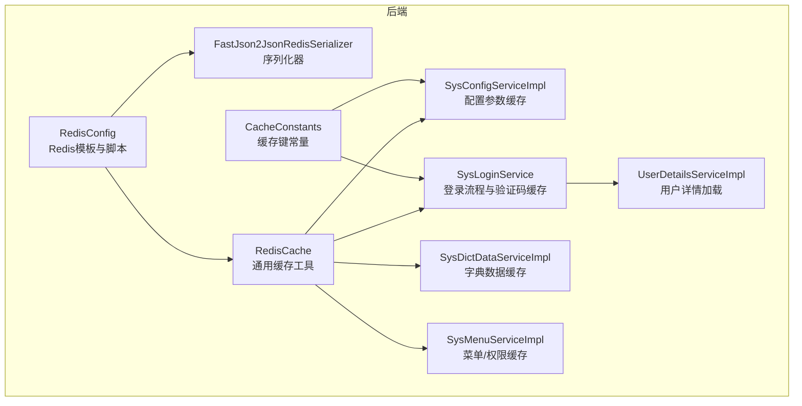
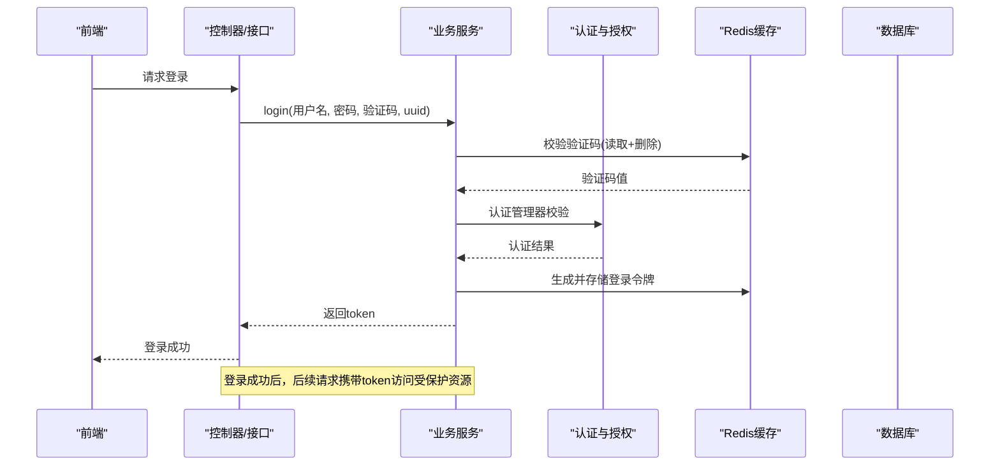
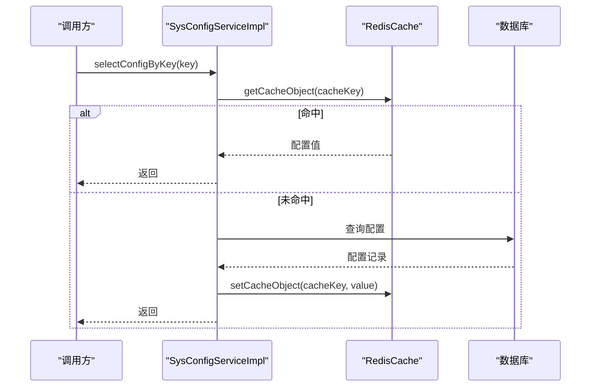
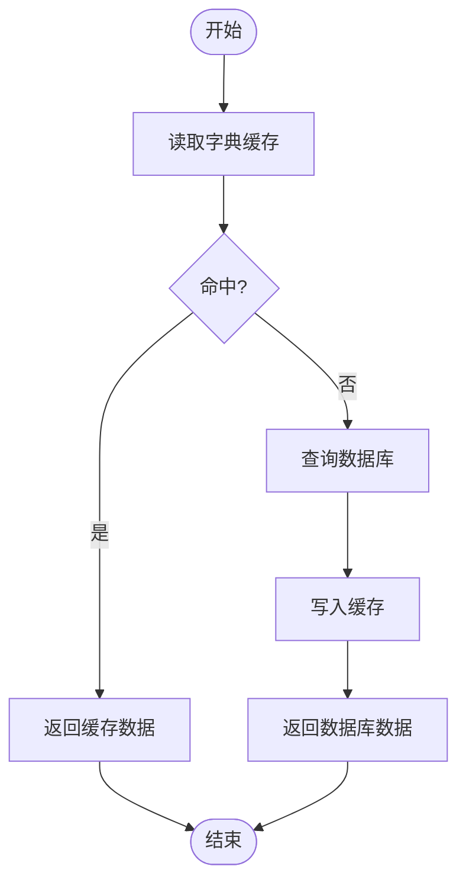
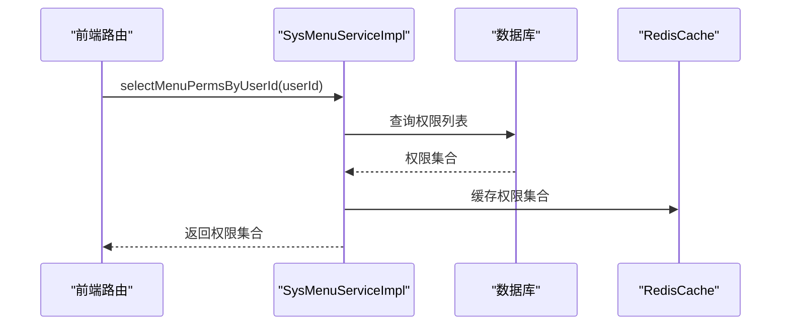
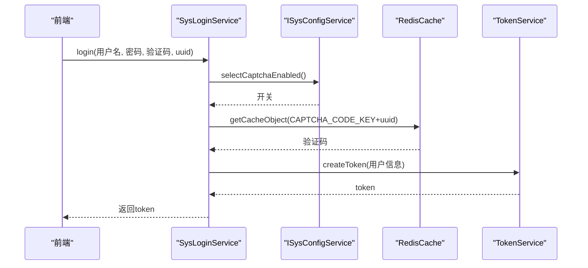
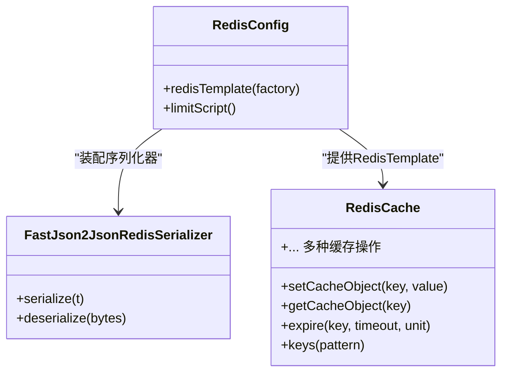
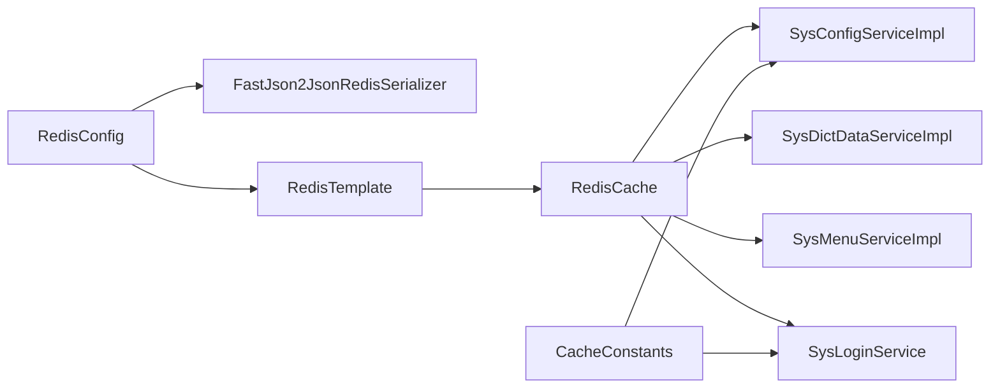

# 缓存策略设计

<cite>
**本文引用的文件**
- [RedisConfig.java](file://XingChen-Vue/xingchen-framework/src/main/java/com/xingchen/framework/config/RedisConfig.java)
- [FastJson2JsonRedisSerializer.java](file://XingChen-Vue/xingchen-framework/src/main/java/com/xingchen/framework/config/FastJson2JsonRedisSerializer.java)
- [RedisCache.java](file://XingChen-Vue/xingchen-common/src/main/java/com/xingchen/common/core/redis/RedisCache.java)
- [CacheConstants.java](file://XingChen-Vue/xingchen-common/src/main/java/com/xingchen/common/constant/CacheConstants.java)
- [SysConfigServiceImpl.java](file://XingChen-Vue/xingchen-system/src/main/java/com/xingchen/system/service/impl/SysConfigServiceImpl.java)
- [DictUtils.java](file://XingChen-Vue/xingchen-common/src/main/java/com/xingchen/common/utils/DictUtils.java)
- [SysDictDataServiceImpl.java](file://XingChen-Vue/xingchen-system/src/main/java/com/xingchen/system/service/impl/SysDictDataServiceImpl.java)
- [SysMenuServiceImpl.java](file://XingChen-Vue/xingchen-system/src/main/java/com/xingchen/system/service/impl/SysMenuServiceImpl.java)
- [SysLoginService.java](file://XingChen-Vue/xingchen-framework/src/main/java/com/xingchen/framework/web/service/SysLoginService.java)
- [UserDetailsServiceImpl.java](file://XingChen-Vue/xingchen-framework/src/main/java/com/xingchen/framework/web/service/UserDetailsServiceImpl.java)
</cite>

## 目录
1. [引言](#引言)
2. [项目结构](#项目结构)
3. [核心组件](#核心组件)
4. [架构总览](#架构总览)
5. [详细组件分析](#详细组件分析)
6. [依赖关系分析](#依赖关系分析)
7. [性能考量](#性能考量)
8. [故障排查指南](#故障排查指南)
9. [结论](#结论)
10. [附录](#附录)

## 引言
本指南围绕健康管理系统中的Redis缓存策略进行系统性设计与落地说明，覆盖用户登录态、权限数据、配置参数、字典数据等关键业务场景。内容涵盖缓存命中率优化、缓存穿透防护、缓存雪崩预防、缓存一致性保障、键设计原则、过期策略与序列化优化，并结合实际代码路径给出可操作的配置示例与性能提升建议。

## 项目结构
系统采用前后端分离架构，后端基于Spring Boot + Spring Security + Spring Cache + Spring Data Redis构建，Redis作为统一缓存层，支撑高频读取的业务数据。

图表来源
- [RedisConfig.java:22-41](file://XingChen-Vue/xingchen-framework/src/main/java/com/xingchen/framework/config/RedisConfig.java#L22-L41)
- [FastJson2JsonRedisSerializer.java:17-51](file://XingChen-Vue/xingchen-framework/src/main/java/com/xingchen/framework/config/FastJson2JsonRedisSerializer.java#L17-L51)
- [RedisCache.java:23-268](file://XingChen-Vue/xingchen-common/src/main/java/com/xingchen/common/core/redis/RedisCache.java#L23-L268)
- [CacheConstants.java:8-44](file://XingChen-Vue/xingchen-common/src/main/java/com/xingchen/common/constant/CacheConstants.java#L8-L44)
- [SysConfigServiceImpl.java:24-229](file://XingChen-Vue/xingchen-system/src/main/java/com/xingchen/system/service/impl/SysConfigServiceImpl.java#L24-L229)
- [SysDictDataServiceImpl.java:16-111](file://XingChen-Vue/xingchen-system/src/main/java/com/xingchen/system/service/impl/SysDictDataServiceImpl.java#L16-L111)
- [SysMenuServiceImpl.java:37-619](file://XingChen-Vue/xingchen-system/src/main/java/com/xingchen/system/service/impl/SysMenuServiceImpl.java#L37-L619)
- [SysLoginService.java:36-177](file://XingChen-Vue/xingchen-framework/src/main/java/com/xingchen/framework/web/service/SysLoginService.java#L36-L177)
- [UserDetailsServiceImpl.java:23-66](file://XingChen-Vue/xingchen-framework/src/main/java/com/xingchen/framework/web/service/UserDetailsServiceImpl.java#L23-L66)

章节来源
- [RedisConfig.java:22-41](file://XingChen-Vue/xingchen-framework/src/main/java/com/xingchen/framework/config/RedisConfig.java#L22-L41)
- [RedisCache.java:23-268](file://XingChen-Vue/xingchen-common/src/main/java/com/xingchen/common/core/redis/RedisCache.java#L23-L268)
- [CacheConstants.java:8-44](file://XingChen-Vue/xingchen-common/src/main/java/com/xingchen/common/constant/CacheConstants.java#L8-L44)

## 核心组件
- Redis配置与序列化
  - Redis模板与脚本：统一配置Key/Value序列化策略，提供限流脚本支持。
  - 序列化器：基于Fastjson2，启用白名单过滤，兼顾安全性与性能。
- 通用缓存工具
  - 提供对象、List、Set、Hash等多类型缓存操作，支持过期时间设置与批量键匹配。
- 缓存键常量
  - 统一定义登录令牌、验证码、配置参数、字典、防重提交、限流、密码错误计数等键前缀。
- 业务缓存实现
  - 配置参数缓存：应用启动时预热，按需读取并回源数据库。
  - 字典数据缓存：字典变更时主动刷新缓存，避免脏读。
  - 菜单/权限缓存：结合用户详情加载，减少重复查询。
  - 登录流程缓存：验证码校验与登录前置校验，降低数据库压力。

章节来源
- [RedisConfig.java:22-71](file://XingChen-Vue/xingchen-framework/src/main/java/com/xingchen/framework/config/RedisConfig.java#L22-L71)
- [FastJson2JsonRedisSerializer.java:17-51](file://XingChen-Vue/xingchen-framework/src/main/java/com/xingchen/framework/config/FastJson2JsonRedisSerializer.java#L17-L51)
- [RedisCache.java:23-268](file://XingChen-Vue/xingchen-common/src/main/java/com/xingchen/common/core/redis/RedisCache.java#L23-L268)
- [CacheConstants.java:8-44](file://XingChen-Vue/xingchen-common/src/main/java/com/xingchen/common/constant/CacheConstants.java#L8-L44)
- [SysConfigServiceImpl.java:35-199](file://XingChen-Vue/xingchen-system/src/main/java/com/xingchen/system/service/impl/SysConfigServiceImpl.java#L35-L199)
- [SysDictDataServiceImpl.java:72-110](file://XingChen-Vue/xingchen-system/src/main/java/com/xingchen/system/service/impl/SysDictDataServiceImpl.java#L72-L110)
- [SysMenuServiceImpl.java:96-130](file://XingChen-Vue/xingchen-system/src/main/java/com/xingchen/system/service/impl/SysMenuServiceImpl.java#L96-L130)
- [SysLoginService.java:110-129](file://XingChen-Vue/xingchen-framework/src/main/java/com/xingchen/framework/web/service/SysLoginService.java#L110-L129)
- [UserDetailsServiceImpl.java:37-65](file://XingChen-Vue/xingchen-framework/src/main/java/com/xingchen/framework/web/service/UserDetailsServiceImpl.java#L37-L65)

## 架构总览
系统通过RedisConfig装配RedisTemplate，使用String序列化Key，对象序列化采用Fastjson2以提升序列化效率与兼容性。业务层通过RedisCache封装常用操作，配合CacheConstants统一键命名，实现配置参数、字典、登录验证码等高频读取数据的缓存。

图表来源
- [SysLoginService.java:63-100](file://XingChen-Vue/xingchen-framework/src/main/java/com/xingchen/framework/web/service/SysLoginService.java#L63-L100)
- [SysLoginService.java:110-129](file://XingChen-Vue/xingchen-framework/src/main/java/com/xingchen/framework/web/service/SysLoginService.java#L110-L129)
- [UserDetailsServiceImpl.java:37-65](file://XingChen-Vue/xingchen-framework/src/main/java/com/xingchen/framework/web/service/UserDetailsServiceImpl.java#L37-L65)
- [RedisCache.java:34-50](file://XingChen-Vue/xingchen-common/src/main/java/com/xingchen/common/core/redis/RedisCache.java#L34-L50)

## 详细组件分析

### 配置参数缓存策略（sys_config）
- 缓存目标：系统运行期的配置项（如验证码开关、登录黑名单等），避免每次请求都查库。
- 实现要点：
  - 应用启动时批量加载至Redis，键前缀使用统一常量。
  - 按键读取时先查缓存，未命中再回源数据库并写回缓存。
  - 变更配置时同步更新缓存，必要时清理或重置缓存。
- 过期策略：按业务需要设置合理TTL，或采用“懒更新”策略，热点键永不过期。
- 一致性：写操作完成后立即更新缓存，确保新值可见。

图表来源
- [SysConfigServiceImpl.java:62-78](file://XingChen-Vue/xingchen-system/src/main/java/com/xingchen/system/service/impl/SysConfigServiceImpl.java#L62-L78)
- [SysConfigServiceImpl.java:172-179](file://XingChen-Vue/xingchen-system/src/main/java/com/xingchen/system/service/impl/SysConfigServiceImpl.java#L172-L179)
- [CacheConstants.java:22-23](file://XingChen-Vue/xingchen-common/src/main/java/com/xingchen/common/constant/CacheConstants.java#L22-L23)

章节来源
- [SysConfigServiceImpl.java:35-199](file://XingChen-Vue/xingchen-system/src/main/java/com/xingchen/system/service/impl/SysConfigServiceImpl.java#L35-L199)
- [CacheConstants.java:22-23](file://XingChen-Vue/xingchen-common/src/main/java/com/xingchen/common/constant/CacheConstants.java#L22-L23)

### 字典数据缓存策略（sys_dict）
- 缓存目标：字典类型到字典项列表的映射，用于页面渲染与数据转换。
- 实现要点：
  - 字典变更（新增/修改/删除）后，主动刷新对应类型的缓存。
  - 读取时优先从缓存取，未命中再回源数据库并写回缓存。
- 过期策略：字典属于低频变更数据，可设置较长TTL或永不过期。
- 一致性：变更操作完成后立即更新缓存，避免脏读。

图表来源
- [DictUtils.java:42-50](file://XingChen-Vue/xingchen-common/src/main/java/com/xingchen/common/utils/DictUtils.java#L42-L50)
- [SysDictDataServiceImpl.java:83-110](file://XingChen-Vue/xingchen-system/src/main/java/com/xingchen/system/service/impl/SysDictDataServiceImpl.java#L83-L110)

章节来源
- [DictUtils.java:31-50](file://XingChen-Vue/xingchen-common/src/main/java/com/xingchen/common/utils/DictUtils.java#L31-L50)
- [SysDictDataServiceImpl.java:72-110](file://XingChen-Vue/xingchen-system/src/main/java/com/xingchen/system/service/impl/SysDictDataServiceImpl.java#L72-L110)

### 菜单与权限缓存策略（sys_menu）
- 缓存目标：用户菜单树、权限集合，减少重复查询与组装成本。
- 实现要点：
  - 管理员直接查询全量菜单；普通用户按userId过滤。
  - 将权限集合（如perms）缓存，供鉴权模块快速判断。
- 过期策略：菜单/权限属于中低频变更，可设置较短TTL或按需失效。
- 一致性：权限变更后主动清理相关用户缓存。

图表来源
- [SysMenuServiceImpl.java:96-130](file://XingChen-Vue/xingchen-system/src/main/java/com/xingchen/system/service/impl/SysMenuServiceImpl.java#L96-L130)

章节来源
- [SysMenuServiceImpl.java:96-130](file://XingChen-Vue/xingchen-system/src/main/java/com/xingchen/system/service/impl/SysMenuServiceImpl.java#L96-L130)

### 登录与验证码缓存策略
- 缓存目标：验证码、登录令牌、登录前置校验结果、密码错误计数等。
- 实现要点：
  - 验证码：按uuid生成键，校验后即删，防止复用。
  - 登录令牌：登录成功后写入Redis，设置合理TTL。
  - 登录前置校验：对用户名/密码长度、黑名单IP等进行快速判定。
- 过期策略：验证码即时过期；令牌按会话有效期设置；黑名单/限流键设置短期TTL。
- 一致性：登录成功后记录登录信息，异步落库。

图表来源
- [SysLoginService.java:63-100](file://XingChen-Vue/xingchen-framework/src/main/java/com/xingchen/framework/web/service/SysLoginService.java#L63-L100)
- [SysLoginService.java:110-129](file://XingChen-Vue/xingchen-framework/src/main/java/com/xingchen/framework/web/service/SysLoginService.java#L110-L129)
- [CacheConstants.java:16-18](file://XingChen-Vue/xingchen-common/src/main/java/com/xingchen/common/constant/CacheConstants.java#L16-L18)

章节来源
- [SysLoginService.java:63-177](file://XingChen-Vue/xingchen-framework/src/main/java/com/xingchen/framework/web/service/SysLoginService.java#L63-L177)
- [CacheConstants.java:16-18](file://XingChen-Vue/xingchen-common/src/main/java/com/xingchen/common/constant/CacheConstants.java#L16-L18)

### 通用缓存工具与序列化
- RedisCache：提供对象、List、Set、Hash等多形态缓存操作，支持过期时间设置与批量键匹配。
- 序列化器：采用Fastjson2，开启自动类型白名单过滤，兼顾性能与安全。
- Redis配置：Key使用String序列化，Value使用自定义JSON序列化器，Hash同样应用一致的序列化策略。

图表来源
- [RedisConfig.java:22-71](file://XingChen-Vue/xingchen-framework/src/main/java/com/xingchen/framework/config/RedisConfig.java#L22-L71)
- [FastJson2JsonRedisSerializer.java:17-51](file://XingChen-Vue/xingchen-framework/src/main/java/com/xingchen/framework/config/FastJson2JsonRedisSerializer.java#L17-L51)
- [RedisCache.java:23-268](file://XingChen-Vue/xingchen-common/src/main/java/com/xingchen/common/core/redis/RedisCache.java#L23-L268)

章节来源
- [RedisConfig.java:22-71](file://XingChen-Vue/xingchen-framework/src/main/java/com/xingchen/framework/config/RedisConfig.java#L22-L71)
- [FastJson2JsonRedisSerializer.java:17-51](file://XingChen-Vue/xingchen-framework/src/main/java/com/xingchen/framework/config/FastJson2JsonRedisSerializer.java#L17-L51)
- [RedisCache.java:23-268](file://XingChen-Vue/xingchen-common/src/main/java/com/xingchen/common/core/redis/RedisCache.java#L23-L268)

## 依赖关系分析
- 组件耦合
  - RedisConfig与FastJson2JsonRedisSerializer强耦合，共同决定序列化策略。
  - RedisCache作为通用工具被各业务服务广泛依赖。
  - CacheConstants集中管理键前缀，降低散落风险。
- 外部依赖
  - Spring Data Redis提供底层连接与命令执行能力。
  - Spring Security负责认证与授权上下文，与缓存配合实现会话与权限缓存。

图表来源
- [RedisConfig.java:22-41](file://XingChen-Vue/xingchen-framework/src/main/java/com/xingchen/framework/config/RedisConfig.java#L22-L41)
- [RedisCache.java:23-268](file://XingChen-Vue/xingchen-common/src/main/java/com/xingchen/common/core/redis/RedisCache.java#L23-L268)
- [CacheConstants.java:8-44](file://XingChen-Vue/xingchen-common/src/main/java/com/xingchen/common/constant/CacheConstants.java#L8-L44)
- [SysConfigServiceImpl.java:24-30](file://XingChen-Vue/xingchen-system/src/main/java/com/xingchen/system/service/impl/SysConfigServiceImpl.java#L24-L30)
- [SysDictDataServiceImpl.java:16-20](file://XingChen-Vue/xingchen-system/src/main/java/com/xingchen/system/service/impl/SysDictDataServiceImpl.java#L16-L20)
- [SysMenuServiceImpl.java:37-53](file://XingChen-Vue/xingchen-system/src/main/java/com/xingchen/system/service/impl/SysMenuServiceImpl.java#L37-L53)
- [SysLoginService.java:36-46](file://XingChen-Vue/xingchen-framework/src/main/java/com/xingchen/framework/web/service/SysLoginService.java#L36-L46)

章节来源
- [RedisConfig.java:22-41](file://XingChen-Vue/xingchen-framework/src/main/java/com/xingchen/framework/config/RedisConfig.java#L22-L41)
- [RedisCache.java:23-268](file://XingChen-Vue/xingchen-common/src/main/java/com/xingchen/common/core/redis/RedisCache.java#L23-L268)
- [CacheConstants.java:8-44](file://XingChen-Vue/xingchen-common/src/main/java/com/xingchen/common/constant/CacheConstants.java#L8-L44)
- [SysConfigServiceImpl.java:24-30](file://XingChen-Vue/xingchen-system/src/main/java/com/xingchen/system/service/impl/SysConfigServiceImpl.java#L24-L30)
- [SysDictDataServiceImpl.java:16-20](file://XingChen-Vue/xingchen-system/src/main/java/com/xingchen/system/service/impl/SysDictDataServiceImpl.java#L16-L20)
- [SysMenuServiceImpl.java:37-53](file://XingChen-Vue/xingchen-system/src/main/java/com/xingchen/system/service/impl/SysMenuServiceImpl.java#L37-L53)
- [SysLoginService.java:36-46](file://XingChen-Vue/xingchen-framework/src/main/java/com/xingchen/framework/web/service/SysLoginService.java#L36-L46)

## 性能考量
- 命中率优化
  - 热点键永不过期或长TTL，冷数据短TTL，结合业务访问特征动态调整。
  - 对于配置参数与字典这类低写高读数据，可采用“懒更新”策略，写后延时失效，避免频繁重建。
- 缓存穿透防护
  - 对于空值结果，写入短TTL占位，避免同一时间大量击穿数据库。
- 缓存雪崩预防
  - 为热点键增加随机抖动TTL，避免同时过期。
  - 采用互斥锁（如Redis SET NX EX）控制热点重建并发。
- 序列化与网络开销
  - 使用Fastjson2序列化器，开启白名单过滤，减少反序列化风险。
  - Key统一使用String序列化，避免跨语言/跨服务的兼容问题。
- 并发与一致性
  - 对于高并发写场景，采用Lua脚本或事务保证原子性（如限流脚本）。
  - 业务侧在写操作完成后立即更新缓存，确保最终一致性。

## 故障排查指南
- 验证码相关
  - 现象：验证码过期或校验失败。
  - 排查：确认验证码键是否存在、是否被提前删除、是否与uuid匹配。
  - 参考路径：[SysLoginService.java:110-129](file://XingChen-Vue/xingchen-framework/src/main/java/com/xingchen/framework/web/service/SysLoginService.java#L110-L129)，[CacheConstants.java:16-18](file://XingChen-Vue/xingchen-common/src/main/java/com/xingchen/common/constant/CacheConstants.java#L16-L18)
- 配置参数读取异常
  - 现象：配置项为空或旧值。
  - 排查：检查缓存键是否正确、是否被清理、是否在启动时完成预热。
  - 参考路径：[SysConfigServiceImpl.java:62-78](file://XingChen-Vue/xingchen-system/src/main/java/com/xingchen/system/service/impl/SysConfigServiceImpl.java#L62-L78)，[SysConfigServiceImpl.java:172-179](file://XingChen-Vue/xingchen-system/src/main/java/com/xingchen/system/service/impl/SysConfigServiceImpl.java#L172-L179)
- 字典数据不一致
  - 现象：页面显示的字典标签与数据库不一致。
  - 排查：确认字典变更后是否调用了缓存刷新逻辑。
  - 参考路径：[SysDictDataServiceImpl.java:83-110](file://XingChen-Vue/xingchen-system/src/main/java/com/xingchen/system/service/impl/SysDictDataServiceImpl.java#L83-L110)，[DictUtils.java:31-50](file://XingChen-Vue/xingchen-common/src/main/java/com/xingchen/common/utils/DictUtils.java#L31-L50)
- 登录失败与权限不足
  - 现象：登录失败或权限校验异常。
  - 排查：检查用户是否存在、状态是否正常、权限集合是否正确缓存。
  - 参考路径：[UserDetailsServiceImpl.java:37-65](file://XingChen-Vue/xingchen-framework/src/main/java/com/xingchen/framework/web/service/UserDetailsServiceImpl.java#L37-L65)，[SysMenuServiceImpl.java:96-130](file://XingChen-Vue/xingchen-system/src/main/java/com/xingchen/system/service/impl/SysMenuServiceImpl.java#L96-L130)

章节来源
- [SysLoginService.java:110-129](file://XingChen-Vue/xingchen-framework/src/main/java/com/xingchen/framework/web/service/SysLoginService.java#L110-L129)
- [SysConfigServiceImpl.java:62-78](file://XingChen-Vue/xingchen-system/src/main/java/com/xingchen/system/service/impl/SysConfigServiceImpl.java#L62-L78)
- [SysDictDataServiceImpl.java:83-110](file://XingChen-Vue/xingchen-system/src/main/java/com/xingchen/system/service/impl/SysDictDataServiceImpl.java#L83-L110)
- [UserDetailsServiceImpl.java:37-65](file://XingChen-Vue/xingchen-framework/src/main/java/com/xingchen/framework/web/service/UserDetailsServiceImpl.java#L37-L65)
- [SysMenuServiceImpl.java:96-130](file://XingChen-Vue/xingchen-system/src/main/java/com/xingchen/system/service/impl/SysMenuServiceImpl.java#L96-L130)

## 结论
通过统一的Redis配置、序列化策略与缓存工具，系统在配置参数、字典、菜单/权限、登录验证码等高频读取场景实现了稳定高效的缓存体系。结合合理的过期策略、穿透与雪崩防护以及严格的缓存一致性保障，可在保证用户体验的同时显著降低数据库压力。建议持续监控缓存命中率与延迟指标，按业务变化动态调整TTL与淘汰策略。

## 附录
- 缓存键设计原则
  - 前缀明确：使用CacheConstants统一前缀，避免冲突。
  - 唯一性：结合业务维度（如用户ID、字典类型、uuid）构造唯一键。
  - 可读性：键名应体现业务含义，便于运维与排障。
- 过期策略配置示例（参考路径）
  - 配置参数：启动预热，按需设置TTL或永不过期。
    - [SysConfigServiceImpl.java:172-179](file://XingChen-Vue/xingchen-system/src/main/java/com/xingchen/system/service/impl/SysConfigServiceImpl.java#L172-L179)
  - 字典数据：变更后刷新，设置中等TTL。
    - [SysDictDataServiceImpl.java:83-110](file://XingChen-Vue/xingchen-system/src/main/java/com/xingchen/system/service/impl/SysDictDataServiceImpl.java#L83-L110)
  - 登录验证码：即时过期，校验后删除。
    - [SysLoginService.java:110-129](file://XingChen-Vue/xingchen-framework/src/main/java/com/xingchen/framework/web/service/SysLoginService.java#L110-L129)
- 序列化优化方法
  - 使用Fastjson2序列化器，开启白名单过滤，避免反序列化风险。
    - [FastJson2JsonRedisSerializer.java:17-51](file://XingChen-Vue/xingchen-framework/src/main/java/com/xingchen/framework/config/FastJson2JsonRedisSerializer.java#L17-L51)
  - Key统一String序列化，Value采用JSON序列化，保持跨语言兼容。
    - [RedisConfig.java:22-41](file://XingChen-Vue/xingchen-framework/src/main/java/com/xingchen/framework/config/RedisConfig.java#L22-L41)