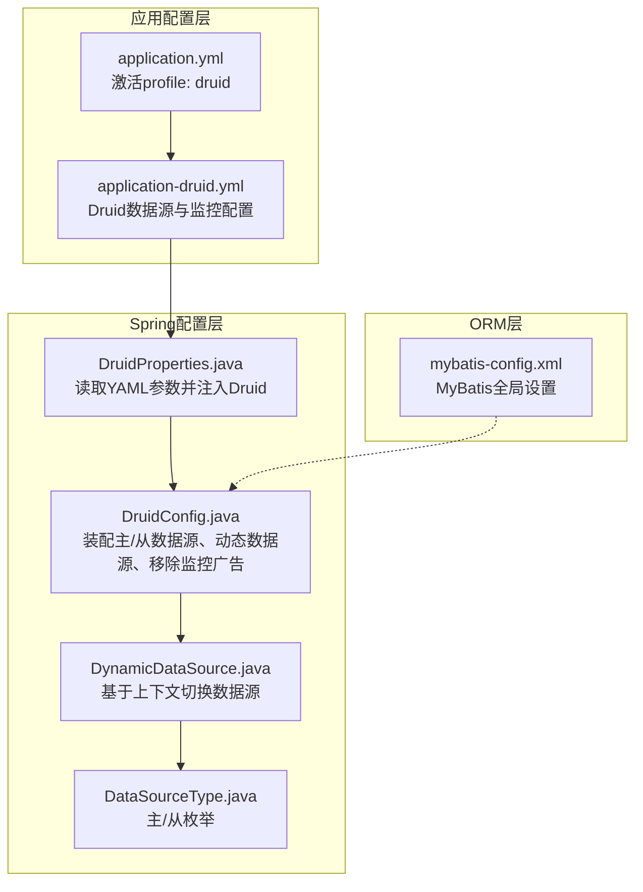
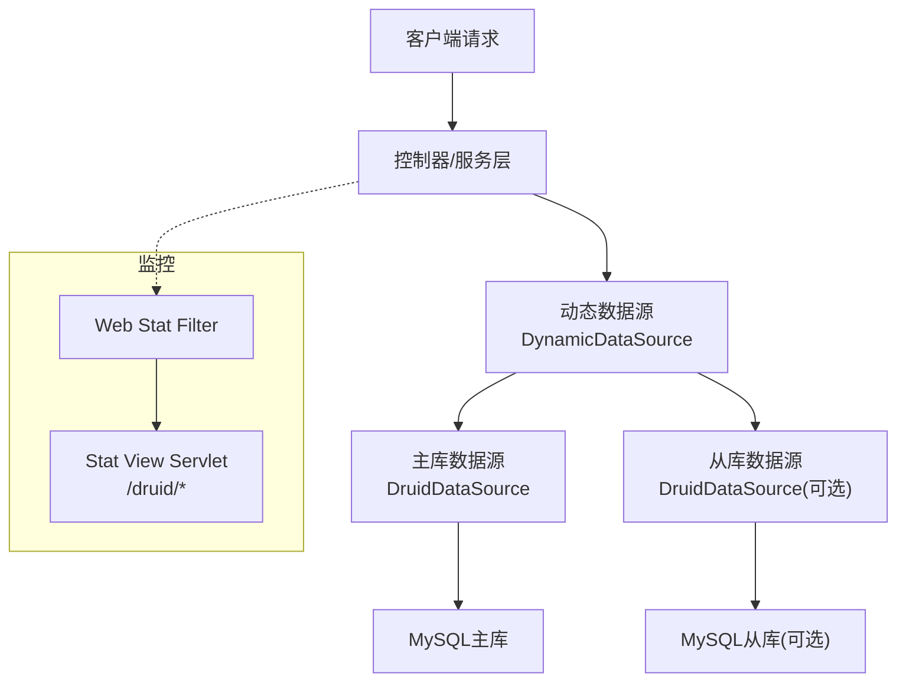
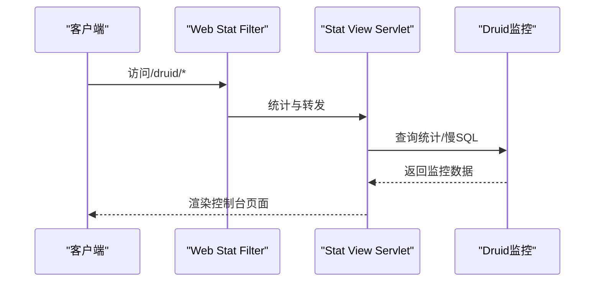
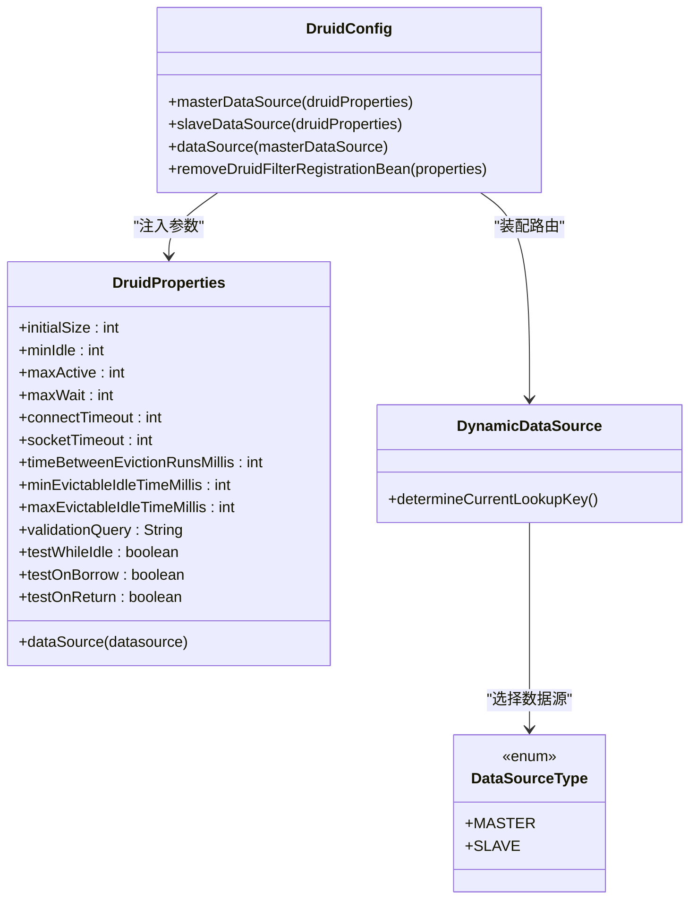
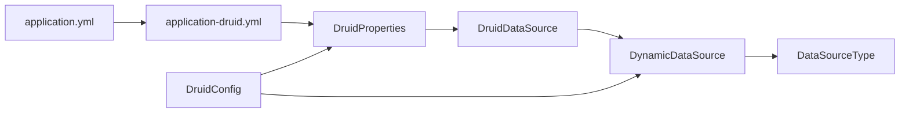

# 连接池配置优化

<cite>
**本文引用的文件**
- [application-druid.yml](file://XingChen-Vue/xingchen-admin/src/main/resources/application-druid.yml)
- [application.yml](file://XingChen-Vue/xingchen-admin/src/main/resources/application.yml)
- [DruidConfig.java](file://XingChen-Vue/xingchen-framework/src/main/java/com/xingchen/framework/config/DruidConfig.java)
- [DruidProperties.java](file://XingChen-Vue/xingchen-framework/src/main/java/com/xingchen/framework/config/properties/DruidProperties.java)
- [DynamicDataSource.java](file://XingChen-Vue/xingchen-framework/src/main/java/com/xingchen/framework/datasource/DynamicDataSource.java)
- [DataSourceType.java](file://XingChen-Vue/xingchen-common/src/main/java/com/xingchen/common/enums/DataSourceType.java)
- [mybatis-config.xml](file://XingChen-Vue/xingchen-admin/src/main/resources/mybatis/mybatis-config.xml)
</cite>

## 目录
1. [简介](#简介)
2. [项目结构](#项目结构)
3. [核心组件](#核心组件)
4. [架构总览](#架构总览)
5. [详细组件分析](#详细组件分析)
6. [依赖关系分析](#依赖关系分析)
7. [性能考量](#性能考量)
8. [故障排查指南](#故障排查指南)
9. [结论](#结论)
10. [附录](#附录)

## 简介
本指南围绕健康管理系统中的数据库连接池配置展开，重点基于项目内已实现的Druid连接池配置与动态数据源方案，系统讲解以下内容：
- Druid连接池关键参数的含义与调优策略：最大连接数、最小空闲连接、连接/网络超时、空闲连接回收周期、连接有效性检测等
- SQL监控与慢SQL记录配置，以及控制台访问与白名单设置
- 连接池性能监控指标、连接泄漏检测与健康检查方法
- 不同业务场景下的最佳实践：高并发、长事务、故障恢复
- 结合项目现有配置，量化参数调优对系统性能的影响与优化效果

## 项目结构
项目采用Spring Boot + MyBatis + Druid + 动态数据源的组合。Druid配置通过YAML集中管理，Java配置类负责装配与动态数据源路由。

**图表来源**
- [application.yml:54-55](file://XingChen-Vue/xingchen-admin/src/main/resources/application.yml#L54-L55)
- [application-druid.yml:1-61](file://XingChen-Vue/xingchen-admin/src/main/resources/application-druid.yml#L1-L61)
- [DruidConfig.java:32-60](file://XingChen-Vue/xingchen-framework/src/main/java/com/xingchen/framework/config/DruidConfig.java#L32-L60)
- [DruidProperties.java:12-88](file://XingChen-Vue/xingchen-framework/src/main/java/com/xingchen/framework/config/properties/DruidProperties.java#L12-L88)
- [DynamicDataSource.java:12-26](file://XingChen-Vue/xingchen-framework/src/main/java/com/xingchen/framework/datasource/DynamicDataSource.java#L12-L26)
- [DataSourceType.java:8-19](file://XingChen-Vue/xingchen-common/src/main/java/com/xingchen/common/enums/DataSourceType.java#L8-L19)
- [mybatis-config.xml:5-20](file://XingChen-Vue/xingchen-admin/src/main/resources/mybatis/mybatis-config.xml#L5-L20)

**章节来源**
- [application.yml:54-55](file://XingChen-Vue/xingchen-admin/src/main/resources/application.yml#L54-L55)
- [application-druid.yml:1-61](file://XingChen-Vue/xingchen-admin/src/main/resources/application-druid.yml#L1-L61)
- [DruidConfig.java:32-60](file://XingChen-Vue/xingchen-framework/src/main/java/com/xingchen/framework/config/DruidConfig.java#L32-L60)
- [DruidProperties.java:12-88](file://XingChen-Vue/xingchen-framework/src/main/java/com/xingchen/framework/config/properties/DruidProperties.java#L12-L88)
- [DynamicDataSource.java:12-26](file://XingChen-Vue/xingchen-framework/src/main/java/com/xingchen/framework/datasource/DynamicDataSource.java#L12-L26)
- [DataSourceType.java:8-19](file://XingChen-Vue/xingchen-common/src/main/java/com/xingchen/common/enums/DataSourceType.java#L8-L19)
- [mybatis-config.xml:5-20](file://XingChen-Vue/xingchen-admin/src/main/resources/mybatis/mybatis-config.xml#L5-L20)

## 核心组件
- Druid连接池参数来源与注入
  - 参数来源于YAML配置文件，通过属性类读取并注入到Druid数据源实例
  - 关键参数包括：初始连接数、最小空闲、最大活跃、最大等待时间、连接超时、socket超时、空闲检测周期、空闲/最大存活时间、有效性检测SQL及开关
- 动态数据源
  - 基于上下文路由选择主库或从库数据源，支持按需启用从库
- 监控与控制台
  - Web Stat Filter、Stat View Servlet开启后可访问/druid路径，支持白名单与登录认证
  - SQL统计、慢SQL记录、SQL合并、SQL防火墙等

**章节来源**
- [application-druid.yml:6-61](file://XingChen-Vue/xingchen-admin/src/main/resources/application-druid.yml#L6-L61)
- [DruidProperties.java:14-88](file://XingChen-Vue/xingchen-framework/src/main/java/com/xingchen/framework/config/properties/DruidProperties.java#L14-L88)
- [DruidConfig.java:35-60](file://XingChen-Vue/xingchen-framework/src/main/java/com/xingchen/framework/config/DruidConfig.java#L35-L60)
- [DynamicDataSource.java:12-26](file://XingChen-Vue/xingchen-framework/src/main/java/com/xingchen/framework/datasource/DynamicDataSource.java#L12-L26)
- [DataSourceType.java:8-19](file://XingChen-Vue/xingchen-common/src/main/java/com/xingchen/common/enums/DataSourceType.java#L8-L19)

## 架构总览
Druid连接池在系统中的位置与交互如下：

**图表来源**
- [DruidConfig.java:52-60](file://XingChen-Vue/xingchen-framework/src/main/java/com/xingchen/framework/config/DruidConfig.java#L52-L60)
- [application-druid.yml:42-61](file://XingChen-Vue/xingchen-admin/src/main/resources/application-druid.yml#L42-L61)

## 详细组件分析

### Druid连接池参数与调优策略
- 初始连接数(initialSize)
  - 作用：应用启动时创建的连接数
  - 调优建议：根据启动阶段并发峰值适当提高，避免启动初期频繁创建连接导致抖动
- 最小空闲连接(minIdle)
  - 作用：保持的最小空闲连接数，有助于快速响应突发请求
  - 调优建议：不低于平均并发连接需求；过高会占用数据库连接资源
- 最大活跃连接(maxActive)
  - 作用：连接池最大并发能力
  - 调优建议：结合数据库最大连接数上限与业务峰值，留出安全余量
- 最大等待时间(maxWait)
  - 作用：获取连接的最大等待时间
  - 调优建议：过短易导致“连接饥饿”，过长增加请求延迟；应结合业务超时策略权衡
- 连接超时(connectTimeout)与网络超时(socketTimeout)
  - 作用：建立连接的超时与数据库操作的网络超时
  - 调优建议：网络较差时适度提高；避免过长导致请求堆积
- 空闲连接回收周期(timeBetweenEvictionRunsMillis)
  - 作用：定期检测空闲连接并回收的频率
  - 调优建议：适中频率兼顾回收效率与开销
- 最小/最大空闲存活时间(minEvictableIdleTimeMillis/maxEvictableIdleTimeMillis)
  - 作用：空闲连接的最小/最大存活时间
  - 调优建议：避免连接过早失效或过久占用资源
- 连接有效性检测(validationQuery/testWhileIdle/testOnBorrow/testOnReturn)
  - 作用：在空闲、借用、归还时检测连接有效性
  - 调优建议：建议开启空闲检测，谨慎开启借用/归还检测以平衡性能与安全

以上参数在项目中均有对应YAML键与属性类注入逻辑，便于统一管理与热切换。

**章节来源**
- [application-druid.yml:19-41](file://XingChen-Vue/xingchen-admin/src/main/resources/application-druid.yml#L19-L41)
- [DruidProperties.java:54-88](file://XingChen-Vue/xingchen-framework/src/main/java/com/xingchen/framework/config/properties/DruidProperties.java#L54-L88)

### SQL监控与慢SQL记录
- Web Stat Filter
  - 作用：拦截请求统计SQL执行情况
  - 项目配置：已启用
- Stat View Servlet
  - 作用：提供/druid监控控制台，支持白名单与登录认证
  - 项目配置：已启用，URL模式为/druid/*，默认允许所有访问（可通过allow配置白名单）
- 慢SQL记录
  - 作用：记录超过阈值的慢SQL，便于定位性能瓶颈
  - 项目配置：已启用，阈值为1000ms，SQL合并开启
- SQL防火墙
  - 作用：限制危险SQL行为，如多语句执行
  - 项目配置：多语句允许已开启（按需调整）

**图表来源**
- [application-druid.yml:42-61](file://XingChen-Vue/xingchen-admin/src/main/resources/application-druid.yml#L42-L61)
- [DruidConfig.java:85-125](file://XingChen-Vue/xingchen-framework/src/main/java/com/xingchen/framework/config/DruidConfig.java#L85-L125)

**章节来源**
- [application-druid.yml:42-61](file://XingChen-Vue/xingchen-admin/src/main/resources/application-druid.yml#L42-L61)
- [DruidConfig.java:85-125](file://XingChen-Vue/xingchen-framework/src/main/java/com/xingchen/framework/config/DruidConfig.java#L85-L125)

### 动态数据源与从库配置
- 主/从数据源装配
  - 主库：始终启用
  - 从库：通过slave.enabled控制是否装配
- 动态路由
  - 通过上下文决定当前使用的数据源（主/从）
- 适用场景
  - 读写分离：写走主库，读走从库（需配合路由策略）

**图表来源**
- [DruidConfig.java:35-60](file://XingChen-Vue/xingchen-framework/src/main/java/com/xingchen/framework/config/DruidConfig.java#L35-L60)
- [DruidProperties.java:14-88](file://XingChen-Vue/xingchen-framework/src/main/java/com/xingchen/framework/config/properties/DruidProperties.java#L14-L88)
- [DynamicDataSource.java:12-26](file://XingChen-Vue/xingchen-framework/src/main/java/com/xingchen/framework/datasource/DynamicDataSource.java#L12-L26)
- [DataSourceType.java:8-19](file://XingChen-Vue/xingchen-common/src/main/java/com/xingchen/common/enums/DataSourceType.java#L8-L19)

**章节来源**
- [DruidConfig.java:35-60](file://XingChen-Vue/xingchen-framework/src/main/java/com/xingchen/framework/config/DruidConfig.java#L35-L60)
- [DruidProperties.java:14-88](file://XingChen-Vue/xingchen-framework/src/main/java/com/xingchen/framework/config/properties/DruidProperties.java#L14-L88)
- [DynamicDataSource.java:12-26](file://XingChen-Vue/xingchen-framework/src/main/java/com/xingchen/framework/datasource/DynamicDataSource.java#L12-L26)
- [DataSourceType.java:8-19](file://XingChen-Vue/xingchen-common/src/main/java/com/xingchen/common/enums/DataSourceType.java#L8-L19)

### 连接池健康检查与泄漏检测
- 连接有效性检测
  - 通过validationQuery与testWhileIdle等参数确保连接可用性
- 空闲连接回收
  - 通过空闲检测周期与最小/最大空闲存活时间，避免连接老化或长期占用
- 监控告警
  - 通过Stat View Servlet观察活跃连接、等待队列长度、慢SQL数量等指标
- 泄漏检测
  - 建议：开启testWhileIdle，合理设置maxWait与连接超时，结合慢SQL日志定位长时间占用连接的SQL

**章节来源**
- [application-druid.yml:37-41](file://XingChen-Vue/xingchen-admin/src/main/resources/application-druid.yml#L37-L41)
- [DruidProperties.java:77-86](file://XingChen-Vue/xingchen-framework/src/main/java/com/xingchen/framework/config/properties/DruidProperties.java#L77-L86)

### 不同业务场景的最佳实践
- 高并发场景
  - 提升maxActive与minIdle，缩短maxWait，开启testWhileIdle但谨慎开启testOnBorrow/testOnReturn
  - 合理设置connectTimeout/socketTimeout，避免网络波动引发的连接失败
- 长事务处理
  - 适当提高maxEvictableIdleTimeMillis，避免连接被回收
  - 严格控制事务时长，避免连接长时间占用
- 读写分离
  - 启用slave.enabled并正确路由读请求至从库，写请求固定主库
- 故障恢复
  - 当数据库不可用时，优先释放无效连接，利用空闲回收机制恢复可用连接
  - 通过Stat View Servlet观察异常指标，及时扩容或降载

**章节来源**
- [application-druid.yml:12-18](file://XingChen-Vue/xingchen-admin/src/main/resources/application-druid.yml#L12-L18)
- [DruidConfig.java:43-50](file://XingChen-Vue/xingchen-framework/src/main/java/com/xingchen/framework/config/DruidConfig.java#L43-L50)

## 依赖关系分析
- 配置依赖
  - application.yml通过profiles.active激活druid配置文件
  - application-druid.yml提供Druid数据源与监控参数
- 代码依赖
  - DruidProperties读取YAML参数并注入DruidDataSource
  - DruidConfig装配主/从数据源与动态数据源，并移除监控页面广告
  - DynamicDataSource基于上下文路由数据源
- ORM依赖
  - mybatis-config.xml提供MyBatis全局设置，与连接池协同工作

**图表来源**
- [application.yml:54-55](file://XingChen-Vue/xingchen-admin/src/main/resources/application.yml#L54-L55)
- [application-druid.yml:6-61](file://XingChen-Vue/xingchen-admin/src/main/resources/application-druid.yml#L6-L61)
- [DruidProperties.java:14-88](file://XingChen-Vue/xingchen-framework/src/main/java/com/xingchen/framework/config/properties/DruidProperties.java#L14-L88)
- [DruidConfig.java:35-60](file://XingChen-Vue/xingchen-framework/src/main/java/com/xingchen/framework/config/DruidConfig.java#L35-L60)
- [DynamicDataSource.java:12-26](file://XingChen-Vue/xingchen-framework/src/main/java/com/xingchen/framework/datasource/DynamicDataSource.java#L12-L26)
- [DataSourceType.java:8-19](file://XingChen-Vue/xingchen-common/src/main/java/com/xingchen/common/enums/DataSourceType.java#L8-L19)

**章节来源**
- [application.yml:54-55](file://XingChen-Vue/xingchen-admin/src/main/resources/application.yml#L54-L55)
- [application-druid.yml:6-61](file://XingChen-Vue/xingchen-admin/src/main/resources/application-druid.yml#L6-L61)
- [DruidProperties.java:14-88](file://XingChen-Vue/xingchen-framework/src/main/java/com/xingchen/framework/config/properties/DruidProperties.java#L14-L88)
- [DruidConfig.java:35-60](file://XingChen-Vue/xingchen-framework/src/main/java/com/xingchen/framework/config/DruidConfig.java#L35-L60)
- [DynamicDataSource.java:12-26](file://XingChen-Vue/xingchen-framework/src/main/java/com/xingchen/framework/datasource/DynamicDataSource.java#L12-L26)
- [DataSourceType.java:8-19](file://XingChen-Vue/xingchen-common/src/main/java/com/xingchen/common/enums/DataSourceType.java#L8-L19)

## 性能考量
- 连接池参数与数据库承载能力匹配
  - maxActive不应超过数据库最大连接数上限，避免连接风暴
- 等待队列与超时
  - 合理设置maxWait与业务超时，避免请求堆积与级联失败
- 监控指标
  - 关注活跃连接、等待队列长度、慢SQL数量、连接回收频率等
- ORM与连接池协同
  - mybatis-config.xml中日志与执行器设置与连接池性能密切相关，建议保持默认或按需微调

**章节来源**
- [mybatis-config.xml:7-17](file://XingChen-Vue/xingchen-admin/src/main/resources/mybatis/mybatis-config.xml#L7-L17)

## 故障排查指南
- 监控入口
  - 访问/druid/*，确认白名单与登录信息正确
- 常见问题定位
  - 连接不足：查看活跃连接与等待队列长度，适当提升maxActive/minIdle
  - 连接泄漏：关注长时间占用连接的慢SQL，优化SQL与事务边界
  - 连接回收频繁：检查空闲检测周期与存活时间配置
- 配置生效验证
  - 通过Stat View Servlet观察参数是否按预期生效
  - 动态数据源：确认从库enabled状态与路由逻辑

**章节来源**
- [application-druid.yml:42-61](file://XingChen-Vue/xingchen-admin/src/main/resources/application-druid.yml#L42-L61)
- [DruidConfig.java:85-125](file://XingChen-Vue/xingchen-framework/src/main/java/com/xingchen/framework/config/DruidConfig.java#L85-L125)

## 结论
本项目基于Druid连接池提供了完善的参数化配置与监控能力，并通过动态数据源实现了主/从库的灵活切换。结合本文给出的参数调优策略与不同业务场景的最佳实践，可在保证系统稳定性的同时显著提升数据库访问性能。建议在生产环境中持续监控关键指标，按需迭代参数，形成“配置—监控—优化”的闭环。

## 附录
- 参数一览与建议范围
  - initialSize：建议为minIdle的1/2~2倍
  - minIdle：建议覆盖平均并发
  - maxActive：建议不超过数据库最大连接数的70%
  - maxWait：建议与业务超时一致或略长
  - connectTimeout/socketTimeout：根据网络状况调整
  - timeBetweenEvictionRunsMillis：建议1~3分钟
  - minEvictableIdleTimeMillis/maxEvictableIdleTimeMillis：建议与业务事务时长匹配
  - validationQuery：建议使用轻量查询
  - testWhileIdle：建议开启
  - testOnBorrow/testOnReturn：按需开启，谨慎使用
- 项目配置参考路径
  - [application-druid.yml:6-61](file://XingChen-Vue/xingchen-admin/src/main/resources/application-druid.yml#L6-L61)
  - [DruidProperties.java:14-88](file://XingChen-Vue/xingchen-framework/src/main/java/com/xingchen/framework/config/properties/DruidProperties.java#L14-L88)
  - [DruidConfig.java:35-60](file://XingChen-Vue/xingchen-framework/src/main/java/com/xingchen/framework/config/DruidConfig.java#L35-L60)
  - [DynamicDataSource.java:12-26](file://XingChen-Vue/xingchen-framework/src/main/java/com/xingchen/framework/datasource/DynamicDataSource.java#L12-L26)
  - [DataSourceType.java:8-19](file://XingChen-Vue/xingchen-common/src/main/java/com/xingchen/common/enums/DataSourceType.java#L8-L19)
  - [mybatis-config.xml:5-20](file://XingChen-Vue/xingchen-admin/src/main/resources/mybatis/mybatis-config.xml#L5-L20)