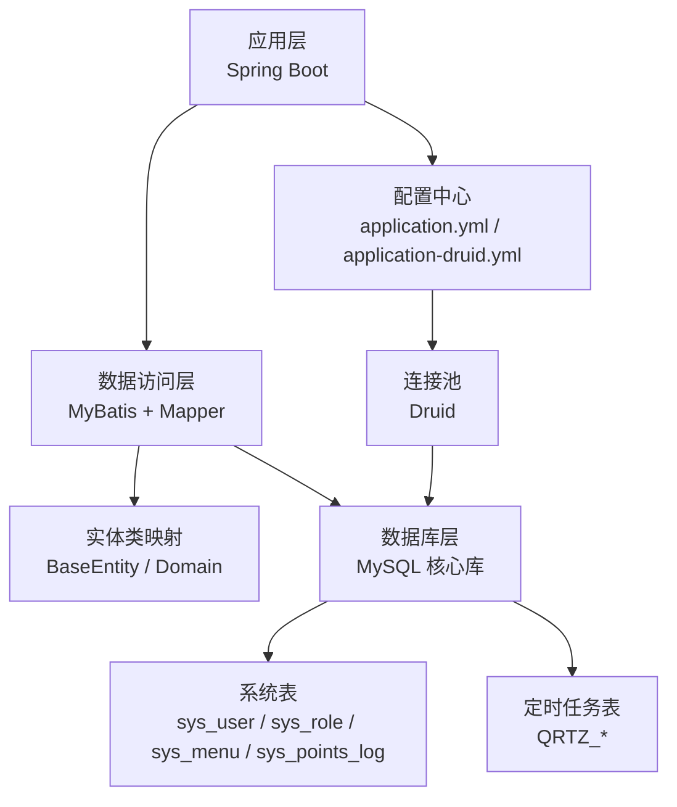
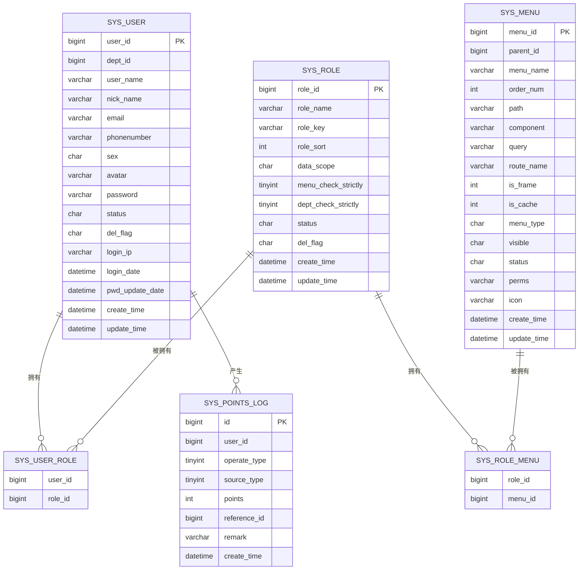
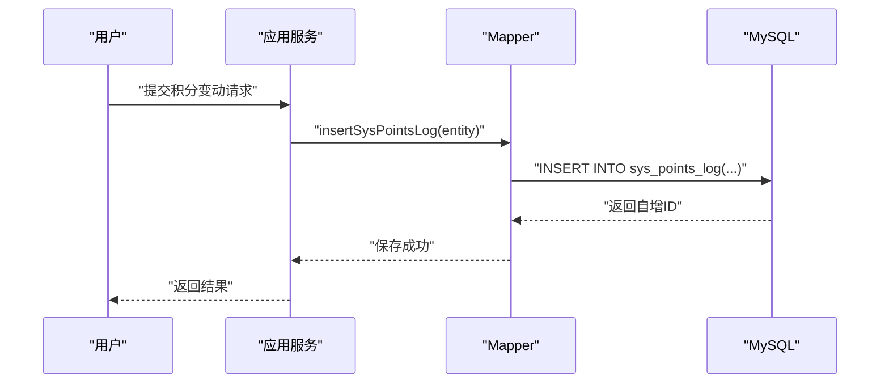
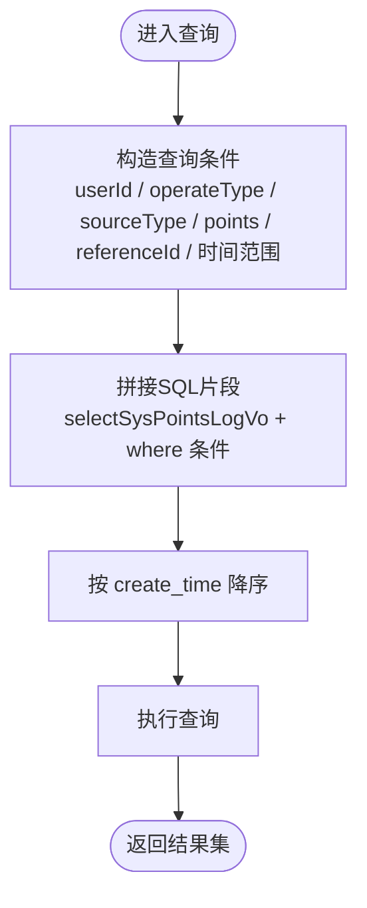
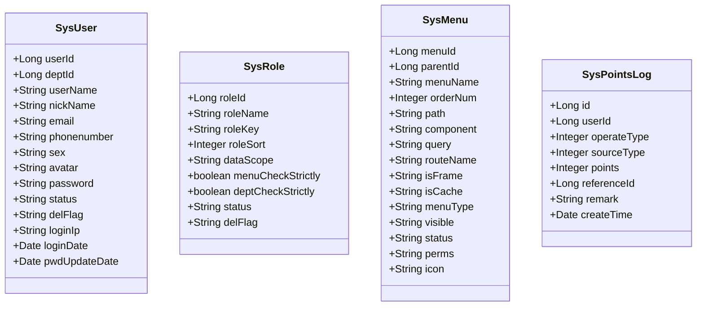
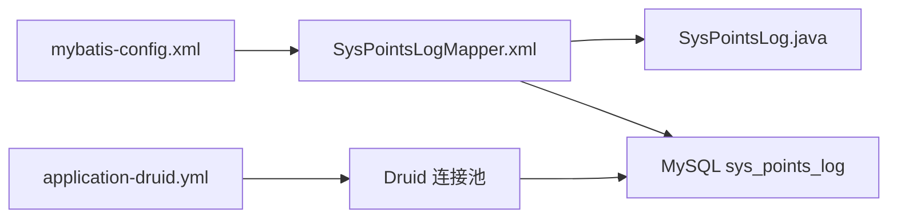

# 数据库设计

<cite>
**本文引用的文件**
- [points_log.sql](file://XingChen-Vue/sql/points_log.sql)
- [ry_20260321.sql](file://XingChen-Vue/sql/ry_20260321.sql)
- [quartz.sql](file://XingChen-Vue/sql/quartz.sql)
- [SysPointsLog.java](file://XingChen-Vue/xingchen-system/src/main/java/com/xingchen/system/domain/SysPointsLog.java)
- [SysUser.java](file://XingChen-Vue/xingchen-common/src/main/java/com/xingchen/common/core/domain/entity/SysUser.java)
- [SysRole.java](file://XingChen-Vue/xingchen-common/src/main/java/com/xingchen/common/core/domain/entity/SysRole.java)
- [SysMenu.java](file://XingChen-Vue/xingchen-common/src/main/java/com/xingchen/common/core/domain/entity/SysMenu.java)
- [application-druid.yml](file://XingChen-Vue/xingchen-admin/src/main/resources/application-druid.yml)
- [application.yml](file://XingChen-Vue/xingchen-admin/src/main/resources/application.yml)
- [mybatis-config.xml](file://XingChen-Vue/xingchen-admin/src/main/resources/mybatis/mybatis-config.xml)
- [SysPointsLogMapper.xml](file://XingChen-Vue/xingchen-system/src/main/resources/mapper/system/SysPointsLogMapper.xml)
</cite>

## 目录
1. [简介](#简介)
2. [项目结构](#项目结构)
3. [核心组件](#核心组件)
4. [架构总览](#架构总览)
5. [详细组件分析](#详细组件分析)
6. [依赖分析](#依赖分析)
7. [性能考量](#性能考量)
8. [故障排查指南](#故障排查指南)
9. [结论](#结论)
10. [附录](#附录)

## 简介
本文件面向“健康管理系统”的数据库设计，系统基于MySQL构建，采用MyBatis进行ORM映射，并通过Druid连接池与Spring Boot集成。本文档聚焦于核心数据模型（用户、角色、权限、积分流水等）、表结构与字段定义、索引与约束策略、表间关联关系、数据完整性保障、性能优化建议、初始化脚本与迁移方案、备份恢复策略，以及分库分表、读写分离与缓存同步的扩展性设计思路。

## 项目结构
- 数据库初始化脚本位于 XingChen-Vue/sql，包含系统基础表、定时任务表与积分流水表。
- Java实体类位于 xingchen-common 与 xingchen-system 模块，对应 sys_user、sys_role、sys_menu、sys_points_log 等核心表。
- MyBatis 映射文件位于 xingchen-system/resources/mapper/system，负责SQL与实体的映射。
- 数据源与连接池配置位于 xingchen-admin/resources，采用Druid连接池，支持主从库与慢SQL监控。

```mermaid
graph TB
subgraph "应用层"
APP["Spring Boot 应用"]
CONF["配置文件<br/>application.yml / application-druid.yml"]
MAPPER["MyBatis 映射<br/>SysPointsLogMapper.xml"]
end
subgraph "数据访问层"
DAO["DAO/Service 层"]
ENTITY["实体类<br/>SysUser / SysRole / SysMenu / SysPointsLog"]
end
subgraph "数据库层"
MYSQL["MySQL 核心库"]
INIT["初始化脚本<br/>ry_20260321.sql / points_log.sql / quartz.sql"]
QUARTZ["定时任务表<br/>QRTZ_*"]
SYS["系统表<br/>sys_user / sys_role / sys_menu / sys_points_log"]
end
APP --> CONF
APP --> MAPPER
MAPPER --> DAO
DAO --> ENTITY
DAO --> MYSQL
MYSQL --> INIT
MYSQL --> SYS
MYSQL --> QUARTZ
```

**图表来源**
- [application.yml:49-148](file://XingChen-Vue/xingchen-admin/src/main/resources/application.yml#L49-L148)
- [application-druid.yml:1-61](file://XingChen-Vue/xingchen-admin/src/main/resources/application-druid.yml#L1-L61)
- [mybatis-config.xml:1-21](file://XingChen-Vue/xingchen-admin/src/main/resources/mybatis/mybatis-config.xml#L1-L21)
- [SysPointsLogMapper.xml:1-92](file://XingChen-Vue/xingchen-system/src/main/resources/mapper/system/SysPointsLogMapper.xml#L1-L92)
- [ry_20260321.sql:1-722](file://XingChen-Vue/sql/ry_20260321.sql#L1-L722)
- [points_log.sql:1-18](file://XingChen-Vue/sql/points_log.sql#L1-L18)
- [quartz.sql:1-174](file://XingChen-Vue/sql/quartz.sql#L1-L174)

**章节来源**
- [application.yml:49-148](file://XingChen-Vue/xingchen-admin/src/main/resources/application.yml#L49-L148)
- [application-druid.yml:1-61](file://XingChen-Vue/xingchen-admin/src/main/resources/application-druid.yml#L1-L61)
- [mybatis-config.xml:1-21](file://XingChen-Vue/xingchen-admin/src/main/resources/mybatis/mybatis-config.xml#L1-L21)
- [SysPointsLogMapper.xml:1-92](file://XingChen-Vue/xingchen-system/src/main/resources/mapper/system/SysPointsLogMapper.xml#L1-L92)
- [ry_20260321.sql:1-722](file://XingChen-Vue/sql/ry_20260321.sql#L1-L722)
- [points_log.sql:1-18](file://XingChen-Vue/sql/points_log.sql#L1-L18)
- [quartz.sql:1-174](file://XingChen-Vue/sql/quartz.sql#L1-L174)

## 核心组件
- 用户表（sys_user）
  - 关键字段：用户ID、部门ID、账号、昵称、邮箱、手机号、性别、头像、密码、状态、删除标志、登录IP/时间、密码更新时间、创建/更新信息。
  - 约束与索引：主键（user_id），业务上常按部门ID、账号、状态等维度查询。
- 角色表（sys_role）
  - 关键字段：角色ID、角色名称、角色权限字符串、显示顺序、数据范围、菜单/部门勾选严格性、状态、删除标志、创建/更新信息。
  - 约束与索引：主键（role_id），权限控制与数据范围控制的关键表。
- 菜单权限表（sys_menu）
  - 关键字段：菜单ID、菜单名称、父菜单ID、显示顺序、路由地址、组件路径、权限标识、类型（目录/菜单/按钮）、状态、图标、创建/更新信息。
  - 约束与索引：主键（menu_id），支持树形结构与权限标识。
- 积分流水表（sys_points_log）
  - 关键字段：流水ID、用户ID、操作类型（收入/支出）、来源类型（打卡/奖励/兑换/退还）、波动分值、业务关联ID、备注、发生时间。
  - 索引策略：对 user_id 与 reference_id 建立索引，满足按用户与业务单据查询。
- Quartz 定时任务表（QRTZ_*）
  - 关键表：QRTZ_JOB_DETAILS、QRTZ_TRIGGERS、QRTZ_CRON_TRIGGERS、QRTZ_SIMPLE_TRIGGERS、QRTZ_FIRED_TRIGGERS 等。
  - 约束与关系：通过外键关联，支持复杂调度与并发控制。

**章节来源**
- [ry_20260321.sql:42-64](file://XingChen-Vue/sql/ry_20260321.sql#L42-L64)
- [ry_20260321.sql:105-121](file://XingChen-Vue/sql/ry_20260321.sql#L105-L121)
- [ry_20260321.sql:134-156](file://XingChen-Vue/sql/ry_20260321.sql#L134-L156)
- [points_log.sql:5-17](file://XingChen-Vue/sql/points_log.sql#L5-L17)
- [quartz.sql:16-52](file://XingChen-Vue/sql/quartz.sql#L16-L52)

## 架构总览
系统采用“应用层-数据访问层-数据库层”三层架构，结合Druid连接池与MyBatis ORM，实现高性能与可维护性的统一。

**图表来源**
- [application.yml:49-148](file://XingChen-Vue/xingchen-admin/src/main/resources/application.yml#L49-L148)
- [application-druid.yml:1-61](file://XingChen-Vue/xingchen-admin/src/main/resources/application-druid.yml#L1-L61)
- [mybatis-config.xml:1-21](file://XingChen-Vue/xingchen-admin/src/main/resources/mybatis/mybatis-config.xml#L1-L21)
- [SysPointsLogMapper.xml:1-92](file://XingChen-Vue/xingchen-system/src/main/resources/mapper/system/SysPointsLogMapper.xml#L1-L92)
- [ry_20260321.sql:1-722](file://XingChen-Vue/sql/ry_20260321.sql#L1-L722)
- [quartz.sql:1-174](file://XingChen-Vue/sql/quartz.sql#L1-L174)

## 详细组件分析

### ER 关系图

**图表来源**
- [ry_20260321.sql:42-64](file://XingChen-Vue/sql/ry_20260321.sql#L42-L64)
- [ry_20260321.sql:105-121](file://XingChen-Vue/sql/ry_20260321.sql#L105-L121)
- [ry_20260321.sql:134-156](file://XingChen-Vue/sql/ry_20260321.sql#L134-L156)
- [ry_20260321.sql:268-272](file://XingChen-Vue/sql/ry_20260321.sql#L268-L272)
- [ry_20260321.sql:285-289](file://XingChen-Vue/sql/ry_20260321.sql#L285-L289)
- [points_log.sql:5-17](file://XingChen-Vue/sql/points_log.sql#L5-L17)

**章节来源**
- [ry_20260321.sql:42-64](file://XingChen-Vue/sql/ry_20260321.sql#L42-L64)
- [ry_20260321.sql:105-121](file://XingChen-Vue/sql/ry_20260321.sql#L105-L121)
- [ry_20260321.sql:134-156](file://XingChen-Vue/sql/ry_20260321.sql#L134-L156)
- [ry_20260321.sql:268-272](file://XingChen-Vue/sql/ry_20260321.sql#L268-L272)
- [ry_20260321.sql:285-289](file://XingChen-Vue/sql/ry_20260321.sql#L285-L289)
- [points_log.sql:5-17](file://XingChen-Vue/sql/points_log.sql#L5-L17)

### 表间关联流程（积分流水与用户）

**图表来源**
- [SysPointsLogMapper.xml:45-65](file://XingChen-Vue/xingchen-system/src/main/resources/mapper/system/SysPointsLogMapper.xml#L45-L65)
- [points_log.sql:5-17](file://XingChen-Vue/sql/points_log.sql#L5-L17)

**章节来源**
- [SysPointsLogMapper.xml:45-65](file://XingChen-Vue/xingchen-system/src/main/resources/mapper/system/SysPointsLogMapper.xml#L45-L65)
- [points_log.sql:5-17](file://XingChen-Vue/sql/points_log.sql#L5-L17)

### 复杂逻辑流程（积分流水查询）

**图表来源**
- [SysPointsLogMapper.xml:18-38](file://XingChen-Vue/xingchen-system/src/main/resources/mapper/system/SysPointsLogMapper.xml#L18-L38)

**章节来源**
- [SysPointsLogMapper.xml:18-38](file://XingChen-Vue/xingchen-system/src/main/resources/mapper/system/SysPointsLogMapper.xml#L18-L38)

### 类关系图（实体与表映射）

**图表来源**
- [SysUser.java:22-337](file://XingChen-Vue/xingchen-common/src/main/java/com/xingchen/common/core/domain/entity/SysUser.java#L22-L337)
- [SysRole.java:18-242](file://XingChen-Vue/xingchen-common/src/main/java/com/xingchen/common/core/domain/entity/SysRole.java#L18-L242)
- [SysMenu.java:17-275](file://XingChen-Vue/xingchen-common/src/main/java/com/xingchen/common/core/domain/entity/SysMenu.java#L17-L275)
- [SysPointsLog.java:11-105](file://XingChen-Vue/xingchen-system/src/main/java/com/xingchen/system/domain/SysPointsLog.java#L11-L105)

**章节来源**
- [SysUser.java:22-337](file://XingChen-Vue/xingchen-common/src/main/java/com/xingchen/common/core/domain/entity/SysUser.java#L22-L337)
- [SysRole.java:18-242](file://XingChen-Vue/xingchen-common/src/main/java/com/xingchen/common/core/domain/entity/SysRole.java#L18-L242)
- [SysMenu.java:17-275](file://XingChen-Vue/xingchen-common/src/main/java/com/xingchen/common/core/domain/entity/SysMenu.java#L17-L275)
- [SysPointsLog.java:11-105](file://XingChen-Vue/xingchen-system/src/main/java/com/xingchen/system/domain/SysPointsLog.java#L11-L105)

## 依赖分析
- MyBatis 配置启用全局缓存与日志实现，便于调试与性能观测。
- Druid 连接池配置主库与从库（默认关闭），支持慢SQL记录与控制台监控。
- Mapper 与实体类一一对应，遵循驼峰映射约定，减少手工映射工作量。

**图表来源**
- [mybatis-config.xml:1-21](file://XingChen-Vue/xingchen-admin/src/main/resources/mybatis/mybatis-config.xml#L1-L21)
- [SysPointsLogMapper.xml:1-92](file://XingChen-Vue/xingchen-system/src/main/resources/mapper/system/SysPointsLogMapper.xml#L1-L92)
- [SysPointsLog.java:11-105](file://XingChen-Vue/xingchen-system/src/main/java/com/xingchen/system/domain/SysPointsLog.java#L11-L105)
- [application-druid.yml:1-61](file://XingChen-Vue/xingchen-admin/src/main/resources/application-druid.yml#L1-L61)

**章节来源**
- [mybatis-config.xml:1-21](file://XingChen-Vue/xingchen-admin/src/main/resources/mybatis/mybatis-config.xml#L1-L21)
- [SysPointsLogMapper.xml:1-92](file://XingChen-Vue/xingchen-system/src/main/resources/mapper/system/SysPointsLogMapper.xml#L1-L92)
- [SysPointsLog.java:11-105](file://XingChen-Vue/xingchen-system/src/main/java/com/xingchen/system/domain/SysPointsLog.java#L11-L105)
- [application-druid.yml:1-61](file://XingChen-Vue/xingchen-admin/src/main/resources/application-druid.yml#L1-L61)

## 性能考量
- 索引策略
  - sys_points_log：对 user_id 与 reference_id 建立索引，满足按用户与业务单据查询；对 create_time 建立索引，支持按时间范围查询。
  - sys_user/sys_role/sys_menu：按常用过滤字段（如 status、dept_id、role_key、parent_id）建立索引，提升权限与组织查询效率。
- 查询优化
  - 使用分页插件（PageHelper）限制结果集规模，避免一次性加载过多数据。
  - 对时间范围查询使用日期函数（如 date_format）时，建议在索引列上保持一致性，避免索引失效。
- 连接池与并发
  - Druid 提供连接池参数调优（初始连接、最小空闲、最大活跃、获取超时、检测间隔等），结合慢SQL监控定位瓶颈。
  - Quartz 表结构支持并发与恢复策略，确保定时任务高可用。
- 缓存与一致性
  - Redis 作为缓存中间件，建议对热点数据（如用户权限、菜单树）做缓存；写操作需保证先写DB再删缓存，避免脏读。
- 分库分表与读写分离
  - 当前配置未启用从库（slave.enabled=false）。若业务增长，可开启从库并按用户ID哈希或时间维度进行分片；读写分离需配合动态数据源切换（DynamicDataSource）。

**章节来源**
- [points_log.sql:15-16](file://XingChen-Vue/sql/points_log.sql#L15-L16)
- [ry_20260321.sql:420-442](file://XingChen-Vue/sql/ry_20260321.sql#L420-L442)
- [application-druid.yml:19-61](file://XingChen-Vue/xingchen-admin/src/main/resources/application-druid.yml#L19-L61)
- [application.yml:114-118](file://XingChen-Vue/xingchen-admin/src/main/resources/application.yml#L114-L118)

## 故障排查指南
- 连接池问题
  - 现象：连接池耗尽、获取连接超时。
  - 排查：检查 maxActive、minIdle、maxWait、validationQuery 等参数；开启慢SQL日志定位异常SQL。
- 权限与数据范围
  - 现象：用户无法看到预期数据。
  - 排查：核对 sys_user_role 与 sys_role_menu 关联关系，确认角色数据范围（data_scope）与菜单/部门勾选严格性配置。
- 积分流水异常
  - 现象：积分变动记录缺失或重复。
  - 排查：检查 sys_points_log 的 user_id、operate_type、source_type、reference_id 组合是否唯一；核对业务单据ID一致性。
- Quartz 调度异常
  - 现象：任务未执行或重复执行。
  - 排查：检查 QRTZ_TRIGGERS 状态、misfire_instr 策略、并发控制（is_nonconcurrent）与悲观锁（LOCKS）。

**章节来源**
- [application-druid.yml:42-61](file://XingChen-Vue/xingchen-admin/src/main/resources/application-druid.yml#L42-L61)
- [ry_20260321.sql:268-289](file://XingChen-Vue/sql/ry_20260321.sql#L268-L289)
- [quartz.sql:33-52](file://XingChen-Vue/sql/quartz.sql#L33-L52)

## 结论
本数据库设计围绕用户、角色、权限与积分流水四大核心域展开，表结构清晰、索引与约束合理，配合Druid连接池与MyBatis ORM，具备良好的可维护性与扩展性。建议在业务增长期逐步引入读写分离、分库分表与缓存同步策略，并持续通过慢SQL监控与索引优化提升性能。

## 附录

### 数据库初始化脚本与迁移方案
- 初始化脚本
  - 系统基础表：ry_20260321.sql（含用户、角色、菜单、岗位、字典、参数、公告、定时任务等）。
  - 积分流水表：points_log.sql。
  - Quartz 调度表：quartz.sql。
- 迁移方案
  - 增量迁移：以脚本为基准，按模块逐步上线；每次变更记录到版本化脚本，保留回滚点。
  - 数据校验：迁移后执行一致性检查（如用户-角色基数、菜单树完整性、积分流水计数）。
  - 灾备演练：定期进行备份恢复演练，验证备份数据可用性。

**章节来源**
- [ry_20260321.sql:1-722](file://XingChen-Vue/sql/ry_20260321.sql#L1-L722)
- [points_log.sql:1-18](file://XingChen-Vue/sql/points_log.sql#L1-L18)
- [quartz.sql:1-174](file://XingChen-Vue/sql/quartz.sql#L1-L174)

### 备份恢复策略
- 备份
  - 全量备份：每周一次，保留至少4份。
  - 增量备份：按日执行，结合binlog归档。
- 恢复
  - 快速恢复：优先使用最近全量+增量恢复；必要时回滚到上一稳定版本。
  - 验证：恢复后进行数据完整性与业务功能验证。

### 分库分表、读写分离与缓存同步
- 分库分表
  - 方向：按用户ID哈希或业务时间维度拆分；热点表（如积分流水）可按月分表。
  - 工具：MyCat/ShardingSphere（建议在应用层通过动态数据源实现）。
- 读写分离
  - 配置：启用 slave 数据源（当前配置为关闭），按查询/写入路由至不同实例。
  - 一致性：写入后强制刷新缓存，读取走从库。
- 缓存同步
  - 写策略：先写DB，再删除缓存（或更新缓存）。
  - 读策略：命中缓存直接返回，未命中回源DB并写入缓存。

### SQL 查询示例与性能调优建议
- 查询示例（路径）
  - 按用户与时间范围查询积分流水：[SysPointsLogMapper.xml:22-38](file://XingChen-Vue/xingchen-system/src/main/resources/mapper/system/SysPointsLogMapper.xml#L22-L38)
  - 插入积分流水：[SysPointsLogMapper.xml:45-65](file://XingChen-Vue/xingchen-system/src/main/resources/mapper/system/SysPointsLogMapper.xml#L45-L65)
- 性能调优建议
  - 为高频过滤字段建立复合索引（如 user_id + create_time）。
  - 避免在索引列使用函数导致索引失效；尽量在应用层做格式化。
  - 使用分页查询限制单次返回数据量，结合覆盖索引优化。

**章节来源**
- [SysPointsLogMapper.xml:22-38](file://XingChen-Vue/xingchen-system/src/main/resources/mapper/system/SysPointsLogMapper.xml#L22-L38)
- [SysPointsLogMapper.xml:45-65](file://XingChen-Vue/xingchen-system/src/main/resources/mapper/system/SysPointsLogMapper.xml#L45-L65)
- [points_log.sql:15-16](file://XingChen-Vue/sql/points_log.sql#L15-L16)