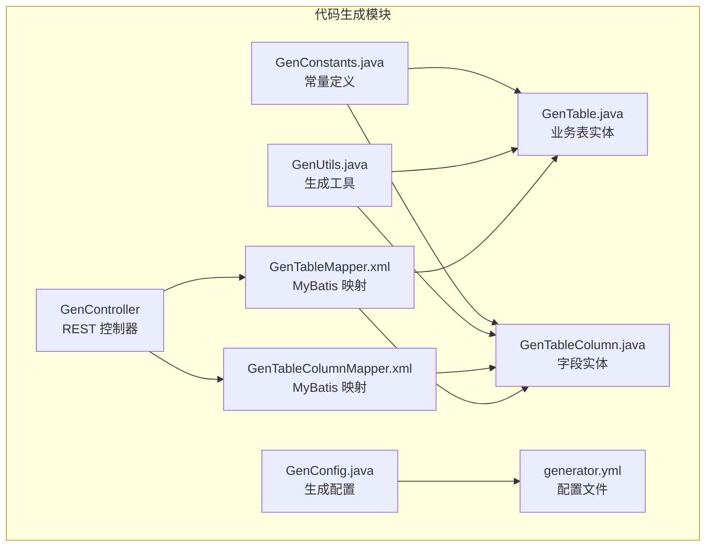
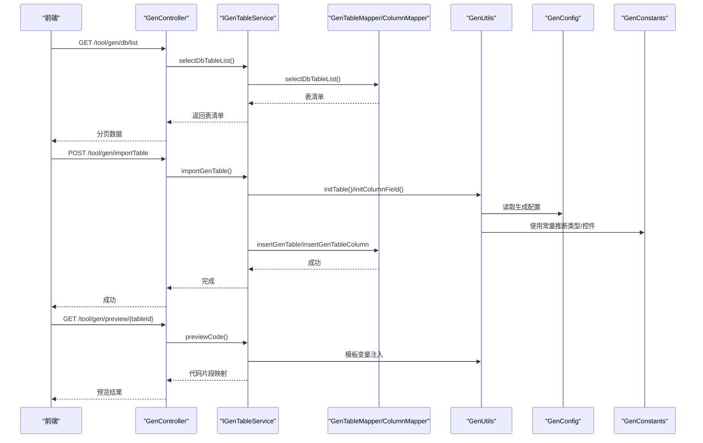
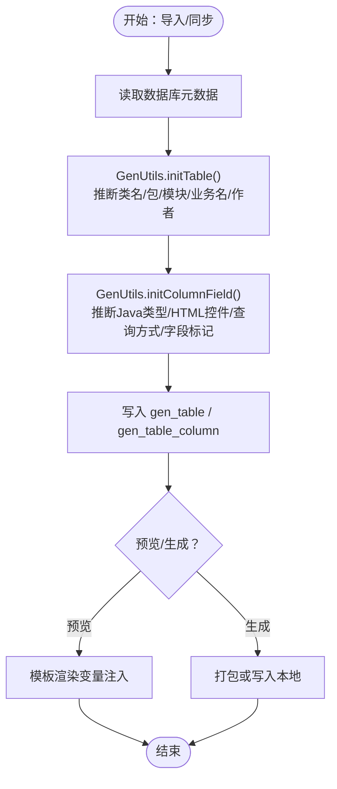
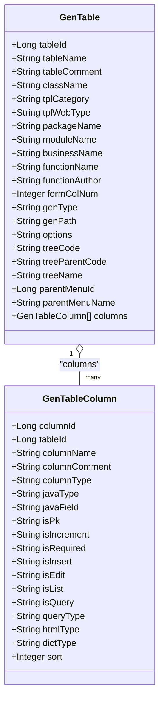
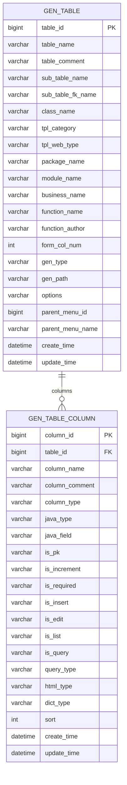

# 代码生成表结构

<cite>
**本文引用的文件**
- [GenTable.java](file://XingChen-Vue/xingchen-generator/src/main/java/com/xingchen/generator/domain/GenTable.java)
- [GenTableColumn.java](file://XingChen-Vue/xingchen-generator/src/main/java/com/xingchen/generator/domain/GenTableColumn.java)
- [GenTableMapper.xml](file://XingChen-Vue/xingchen-generator/src/main/resources/mapper/generator/GenTableMapper.xml)
- [GenTableColumnMapper.xml](file://XingChen-Vue/xingchen-generator/src/main/resources/mapper/generator/GenTableColumnMapper.xml)
- [generator.yml](file://XingChen-Vue/xingchen-generator/src/main/resources/generator.yml)
- [GenUtils.java](file://XingChen-Vue/xingchen-generator/src/main/java/com/xingchen/generator/util/GenUtils.java)
- [GenConfig.java](file://XingChen-Vue/xingchen-generator/src/main/java/com/xingchen/generator/config/GenConfig.java)
- [GenConstants.java](file://XingChen-Vue/xingchen-common/src/main/java/com/xingchen/common/constant/GenConstants.java)
- [GenController.java](file://XingChen-Vue/xingchen-generator/src/main/java/com/xingchen/generator/controller/GenController.java)
</cite>

## 目录
1. [引言](#引言)
2. [项目结构](#项目结构)
3. [核心组件](#核心组件)
4. [架构总览](#架构总览)
5. [详细组件分析](#详细组件分析)
6. [依赖分析](#依赖分析)
7. [性能考虑](#性能考虑)
8. [故障排查指南](#故障排查指南)
9. [结论](#结论)
10. [附录](#附录)

## 引言
本文件聚焦于“代码生成”模块的表结构与模板机制，系统性梳理业务表 gen_table 与其字段表 gen_table_column 的字段定义、数据类型、约束条件与业务含义；阐明模板选择与映射关系、生成配置的灵活控制；解释自动化流程、模板变量处理机制以及生成结果的定制化支持，并提供表关系图、字段说明表与典型场景下的数据配置示例。

## 项目结构
代码生成模块位于 XingChen-Vue/xingchen-generator 中，采用典型的分层结构：领域模型(domain)、持久层(mapper/xml)、工具(util)、配置(config)、控制器(controller)。模板资源位于 resources/vm 下（按语言/框架分类），通过 Velocity 渲染生成代码。

图表来源
- [GenController.java:1-264](file://XingChen-Vue/xingchen-generator/src/main/java/com/xingchen/generator/controller/GenController.java#L1-264)
- [GenTableMapper.xml:1-214](file://XingChen-Vue/xingchen-generator/src/main/resources/mapper/generator/GenTableMapper.xml#L1-214)
- [GenTableColumnMapper.xml:1-127](file://XingChen-Vue/xingchen-generator/src/main/resources/mapper/generator/GenTableColumnMapper.xml#L1-127)
- [GenTable.java:1-398](file://XingChen-Vue/xingchen-generator/src/main/java/com/xingchen/generator/domain/GenTable.java#L1-398)
- [GenTableColumn.java:1-374](file://XingChen-Vue/xingchen-generator/src/main/java/com/xingchen/generator/domain/GenTableColumn.java#L1-374)
- [GenUtils.java:1-258](file://XingChen-Vue/xingchen-generator/src/main/java/com/xingchen/generator/util/GenUtils.java#L1-258)
- [GenConfig.java:1-88](file://XingChen-Vue/xingchen-generator/src/main/java/com/xingchen/generator/config/GenConfig.java#L1-88)
- [generator.yml:1-12](file://XingChen-Vue/xingchen-generator/src/main/resources/generator.yml#L1-12)
- [GenConstants.java:1-118](file://XingChen-Vue/xingchen-common/src/main/java/com/xingchen/common/constant/GenConstants.java#L1-118)

章节来源
- [GenController.java:1-264](file://XingChen-Vue/xingchen-generator/src/main/java/com/xingchen/generator/controller/GenController.java#L1-264)
- [GenTableMapper.xml:1-214](file://XingChen-Vue/xingchen-generator/src/main/resources/mapper/generator/GenTableMapper.xml#L1-214)
- [GenTableColumnMapper.xml:1-127](file://XingChen-Vue/xingchen-generator/src/main/resources/mapper/generator/GenTableColumnMapper.xml#L1-127)
- [GenTable.java:1-398](file://XingChen-Vue/xingchen-generator/src/main/java/com/xingchen/generator/domain/GenTable.java#L1-398)
- [GenTableColumn.java:1-374](file://XingChen-Vue/xingchen-generator/src/main/java/com/xingchen/generator/domain/GenTableColumn.java#L1-374)
- [GenUtils.java:1-258](file://XingChen-Vue/xingchen-generator/src/main/java/com/xingchen/generator/util/GenUtils.java#L1-258)
- [GenConfig.java:1-88](file://XingChen-Vue/xingchen-generator/src/main/java/com/xingchen/generator/config/GenConfig.java#L1-88)
- [generator.yml:1-12](file://XingChen-Vue/xingchen-generator/src/main/resources/generator.yml#L1-12)
- [GenConstants.java:1-118](file://XingChen-Vue/xingchen-common/src/main/java/com/xingchen/common/constant/GenConstants.java#L1-118)

## 核心组件
- 业务表实体 GenTable：承载表级元信息、模板类别、前端类型、生成包模块业务名、作者、表单布局、生成方式与路径、主键列、子表、列集合、树形字段、上级菜单字段等。
- 字段实体 GenTableColumn：承载列级元信息，包括归属表、列名/注释、列类型、Java 类型/字段、主键/自增/必填标识、增删改查字段标记、查询方式、HTML 控件类型、字典类型、排序等。
- MyBatis 映射：GenTableMapper.xml 与 GenTableColumnMapper.xml 定义了表与列的映射、查询、插入、更新、删除语句及分页条件。
- 生成工具 GenUtils：负责表/列初始化、命名转换、类型推断、HTML 控件与查询方式推断、业务名/模块名提取等。
- 生成配置 GenConfig：从 generator.yml 读取作者、包名、自动去前缀、表前缀、是否允许覆盖等全局配置。
- 常量 GenConstants：统一模板类别、数据库类型、HTML 控件、Java 类型、查询方式、字段白黑名单等常量。

章节来源
- [GenTable.java:16-398](file://XingChen-Vue/xingchen-generator/src/main/java/com/xingchen/generator/domain/GenTable.java#L16-L398)
- [GenTableColumn.java:12-374](file://XingChen-Vue/xingchen-generator/src/main/java/com/xingchen/generator/domain/GenTableColumn.java#L12-L374)
- [GenTableMapper.xml:7-137](file://XingChen-Vue/xingchen-generator/src/main/resources/mapper/generator/GenTableMapper.xml#L7-L137)
- [GenTableColumnMapper.xml:7-125](file://XingChen-Vue/xingchen-generator/src/main/resources/mapper/generator/GenTableColumnMapper.xml#L7-L125)
- [GenUtils.java:16-258](file://XingChen-Vue/xingchen-generator/src/main/java/com/xingchen/generator/util/GenUtils.java#L16-L258)
- [GenConfig.java:16-88](file://XingChen-Vue/xingchen-generator/src/main/java/com/xingchen/generator/config/GenConfig.java#L16-L88)
- [generator.yml:1-12](file://XingChen-Vue/xingchen-generator/src/main/resources/generator.yml#L1-L12)
- [GenConstants.java:8-118](file://XingChen-Vue/xingchen-common/src/main/java/com/xingchen/common/constant/GenConstants.java#L8-L118)

## 架构总览
代码生成的端到端流程如下：前端调用控制器接口，控制器委派服务层完成导入/同步/预览/下载/批量生成等操作；服务层通过 MyBatis 访问 gen_table 与 gen_table_column；工具层根据配置与规则推断 Java 类型、HTML 控件、查询方式等；最终通过模板引擎渲染输出 zip 或写入本地路径。

图表来源
- [GenController.java:58-264](file://XingChen-Vue/xingchen-generator/src/main/java/com/xingchen/generator/controller/GenController.java#L58-L264)
- [GenTableMapper.xml:80-137](file://XingChen-Vue/xingchen-generator/src/main/resources/mapper/generator/GenTableMapper.xml#L80-L137)
- [GenTableColumnMapper.xml:42-90](file://XingChen-Vue/xingchen-generator/src/main/resources/mapper/generator/GenTableColumnMapper.xml#L42-L90)
- [GenUtils.java:21-131](file://XingChen-Vue/xingchen-generator/src/main/java/com/xingchen/generator/util/GenUtils.java#L21-L131)
- [GenConfig.java:16-88](file://XingChen-Vue/xingchen-generator/src/main/java/com/xingchen/generator/config/GenConfig.java#L16-L88)
- [GenConstants.java:8-118](file://XingChen-Vue/xingchen-common/src/main/java/com/xingchen/common/constant/GenConstants.java#L8-L118)

## 详细组件分析

### 业务表 gen_table 字段定义与业务含义
- 字段概览（来源于映射与实体）
  - table_id：主键
  - table_name：物理表名
  - table_comment：表注释（用于功能名推导）
  - sub_table_name/sub_table_fk_name：主子表关联信息
  - class_name：实体类名（首字母大写）
  - tpl_category：模板类别（crud/tree/sub）
  - tpl_web_type：前端类型（element-ui/element-plus/element-plus-typescript）
  - package_name/module_name/business_name：生成包路径、模块名、业务名
  - function_name/function_author：功能名、作者
  - form_col_num：表单布局列数
  - gen_type/gen_path：生成方式（zip/自定义路径）、生成路径
  - options：其它生成选项（JSON/字符串）
  - 树形字段：treeCode/treeParentCode/treeName
  - 上级菜单字段：parentMenuId/parentMenuName
  - 公共审计字段：createBy/createTime/updateBy/updateTime/remark

- 约束与校验
  - 非空校验：表名、表注释、实体类名、包名、模块名、业务名、功能名、作者等
  - 模板类别与树形字段存在性：isTree/isSub/isCrud 由 tplCategory 判断
  - 生成路径与覆盖策略：受 GenConfig.allowOverwrite 控制

- 业务含义
  - 作为“表级配置”的载体，决定生成的类层次、页面布局、菜单挂载、树形/主子表特性等
  - 与 gen_table_column 一对多关联，形成完整的“表+字段”元数据

章节来源
- [GenTable.java:20-102](file://XingChen-Vue/xingchen-generator/src/main/java/com/xingchen/generator/domain/GenTable.java#L20-L102)
- [GenTableMapper.xml:7-31](file://XingChen-Vue/xingchen-generator/src/main/resources/mapper/generator/GenTableMapper.xml#L7-L31)
- [GenConstants.java:10-32](file://XingChen-Vue/xingchen-common/src/main/java/com/xingchen/common/constant/GenConstants.java#L10-L32)

### 字段表 gen_table_column 字段定义与业务含义
- 字段概览（来源于映射与实体）
  - column_id：主键
  - table_id：归属表
  - column_name/column_comment：列名与注释
  - column_type：数据库列类型（含精度/长度）
  - java_type/java_field：Java 类型与字段名
  - is_pk/is_increment/is_required：主键、自增、必填
  - is_insert/is_edit/is_list/is_query：增删改查字段标记
  - query_type：查询方式（EQ/LIKE/...）
  - html_type：页面控件类型（input/select/radio/...）
  - dict_type：字典类型
  - sort：排序

- 业务含义
  - 描述每个列的 Java 映射、页面控件、查询策略与字典绑定
  - 通过 isSuperColumn/isUsableColumn 等方法控制 Domain 属性生成与页面使用

章节来源
- [GenTableColumn.java:16-70](file://XingChen-Vue/xingchen-generator/src/main/java/com/xingchen/generator/domain/GenTableColumn.java#L16-L70)
- [GenTableColumnMapper.xml:7-30](file://XingChen-Vue/xingchen-generator/src/main/resources/mapper/generator/GenTableColumnMapper.xml#L7-L30)
- [GenTableColumn.java:326-349](file://XingChen-Vue/xingchen-generator/src/main/java/com/xingchen/generator/domain/GenTableColumn.java#L326-L349)

### 模板机制与映射关系
- 模板类别
  - crud：单表增删改查
  - tree：树表（需提供树编码/父编码/名称字段）
  - sub：主子表（需提供父子表关联信息）

- 前端类型
  - element-ui、element-plus、element-plus-typescript

- 映射关系
  - GenTable 与 GenTableColumn 通过 table_id 关联
  - MyBatis 通过 resultMap 将表与列聚合返回
  - 控制器提供预览/下载/批量生成等入口

章节来源
- [GenConstants.java:10-17](file://XingChen-Vue/xingchen-common/src/main/java/com/xingchen/common/constant/GenConstants.java#L10-L17)
- [GenTableMapper.xml:30-31](file://XingChen-Vue/xingchen-generator/src/main/resources/mapper/generator/GenTableMapper.xml#L30-L31)
- [GenController.java:191-249](file://XingChen-Vue/xingchen-generator/src/main/java/com/xingchen/generator/controller/GenController.java#L191-L249)

### 生成配置的灵活控制
- 全局配置项（generator.yml → GenConfig）
  - author：默认作者
  - packageName：默认包路径
  - autoRemovePre：是否自动去除表前缀
  - tablePrefix：表前缀列表（逗号分隔）
  - allowOverwrite：是否允许覆盖本地文件（自定义路径）

- 表级配置项（GenTable）
  - tplCategory/tplWebType：模板与前端类型
  - packageName/moduleName/businessName：可覆盖全局包与模块
  - functionName/functionAuthor：可覆盖全局作者
  - formColNum：表单布局列数
  - genType/genPath：生成方式与路径
  - tree*/parentMenu*：树形/菜单挂载字段

- 列级配置项（GenTableColumn）
  - javaType/htmlType/queryType/dictType/isInsert/isEdit/isList/isQuery/isRequired
  - sort：影响页面字段顺序

章节来源
- [generator.yml:1-12](file://XingChen-Vue/xingchen-generator/src/main/resources/generator.yml#L1-L12)
- [GenConfig.java:16-88](file://XingChen-Vue/xingchen-generator/src/main/java/com/xingchen/generator/config/GenConfig.java#L16-L88)
- [GenTable.java:41-102](file://XingChen-Vue/xingchen-generator/src/main/java/com/xingchen/generator/domain/GenTable.java#L41-L102)
- [GenTableColumn.java:38-69](file://XingChen-Vue/xingchen-generator/src/main/java/com/xingchen/generator/domain/GenTableColumn.java#L38-L69)

### 自动化流程与模板变量处理
- 导入数据库表
  - 读取 information_schema 获取表/列元数据
  - 调用 GenUtils.initTable/initColumnField 推断 Java 类型、HTML 控件、查询方式、字段标记
  - 写入 gen_table 与 gen_table_column

- 预览/生成
  - 预览：返回各模板文件的渲染结果映射
  - 下载：打包为 zip
  - 自定义路径：直接写入本地（受 allowOverwrite 限制）

- 模板变量
  - 基于 GenTable/GenTableColumn 与 GenConstants 常量进行变量注入
  - 支持根据列名后缀自动推断控件类型与查询方式

图表来源
- [GenUtils.java:21-131](file://XingChen-Vue/xingchen-generator/src/main/java/com/xingchen/generator/util/GenUtils.java#L21-L131)
- [GenTableMapper.xml:80-137](file://XingChen-Vue/xingchen-generator/src/main/resources/mapper/generator/GenTableMapper.xml#L80-L137)
- [GenTableColumnMapper.xml:42-90](file://XingChen-Vue/xingchen-generator/src/main/resources/mapper/generator/GenTableColumnMapper.xml#L42-L90)
- [GenController.java:115-249](file://XingChen-Vue/xingchen-generator/src/main/java/com/xingchen/generator/controller/GenController.java#L115-L249)

## 依赖分析
- 类关系
  - GenTable 与 GenTableColumn 通过集合/外键关联
  - GenUtils 依赖 GenConfig 与 GenConstants
  - GenController 依赖 IGenTableService 与 IGenTableColumnService（接口未在本文件中展开）

图表来源
- [GenTable.java:16-398](file://XingChen-Vue/xingchen-generator/src/main/java/com/xingchen/generator/domain/GenTable.java#L16-L398)
- [GenTableColumn.java:12-374](file://XingChen-Vue/xingchen-generator/src/main/java/com/xingchen/generator/domain/GenTableColumn.java#L12-L374)

章节来源
- [GenTable.java:76-84](file://XingChen-Vue/xingchen-generator/src/main/java/com/xingchen/generator/domain/GenTable.java#L76-L84)
- [GenTableColumn.java:16-20](file://XingChen-Vue/xingchen-generator/src/main/java/com/xingchen/generator/domain/GenTableColumn.java#L16-L20)

## 性能考虑
- 数据库查询
  - selectDbTableList/selectGenTableList 支持按表名/注释与时间范围过滤，注意索引与分页
  - join 查询返回聚合结果，建议对 table_id、column_sort 建立索引
- 生成性能
  - 批量生成优先使用下载方式（zip）减少 IO
  - 自定义路径生成受 allowOverwrite 限制，避免频繁覆盖
- 模板渲染
  - 控制模板复杂度，避免在模板中执行重型逻辑

## 故障排查指南
- 生成失败（自定义路径）
  - 现象：提示不允许覆盖本地
  - 处理：开启 generator.yml 中的 allowOverwrite 或使用下载方式
- 表/列导入异常
  - 现象：导入后字段缺失或类型错误
  - 处理：检查列类型映射规则与 GenUtils 推断逻辑；确认 isRequired/isInsert/isEdit/isList/isQuery 标记是否符合预期
- 预览为空
  - 现象：预览接口返回空映射
  - 处理：确认模板资源是否存在、GenTable/GenTableColumn 是否已正确写入
- 权限不足
  - 现象：接口返回无权限
  - 处理：确认用户角色与权限注解

章节来源
- [GenController.java:218-224](file://XingChen-Vue/xingchen-generator/src/main/java/com/xingchen/generator/controller/GenController.java#L218-L224)
- [GenUtils.java:35-131](file://XingChen-Vue/xingchen-generator/src/main/java/com/xingchen/generator/util/GenUtils.java#L35-L131)
- [GenTableMapper.xml:80-137](file://XingChen-Vue/xingchen-generator/src/main/resources/mapper/generator/GenTableMapper.xml#L80-L137)
- [GenTableColumnMapper.xml:42-90](file://XingChen-Vue/xingchen-generator/src/main/resources/mapper/generator/GenTableColumnMapper.xml#L42-L90)

## 结论
代码生成模块以 gen_table 与 gen_table_column 为核心，结合 GenUtils 的类型与控件推断、GenConfig 的全局配置与 GenConstants 的常量约定，实现了从数据库表到前后端代码的自动化生成。通过模板类别与前端类型的灵活组合，满足不同业务形态的快速开发需求；通过生成配置与字段标记，实现高度定制化的输出。

## 附录

### 表关系图

图表来源
- [GenTableMapper.xml:7-31](file://XingChen-Vue/xingchen-generator/src/main/resources/mapper/generator/GenTableMapper.xml#L7-L31)
- [GenTableColumnMapper.xml:7-30](file://XingChen-Vue/xingchen-generator/src/main/resources/mapper/generator/GenTableColumnMapper.xml#L7-L30)

### 字段说明表
- 业务表 gen_table
  - table_id：主键
  - table_name：物理表名
  - table_comment：表注释（用于功能名推导）
  - class_name：实体类名（首字母大写）
  - tpl_category：模板类别（crud/tree/sub）
  - tpl_web_type：前端类型（element-ui/element-plus/element-plus-typescript）
  - package_name/module_name/business_name：生成包/模块/业务名
  - function_name/function_author：功能名/作者
  - form_col_num：表单布局列数
  - gen_type/gen_path：生成方式（zip/自定义路径）与路径
  - options：其它生成选项
  - treeCode/treeParentCode/treeName：树形字段
  - parentMenuId/parentMenuName：上级菜单字段
  - 审计字段：createBy/createTime/updateBy/updateTime/remark

- 字段表 gen_table_column
  - column_id：主键
  - table_id：归属表
  - column_name/column_comment：列名/注释
  - column_type：数据库列类型
  - java_type/java_field：Java 类型/字段名
  - is_pk/is_increment/is_required：主键/自增/必填
  - is_insert/is_edit/is_list/is_query：增删改查字段标记
  - query_type：查询方式
  - html_type：页面控件类型
  - dict_type：字典类型
  - sort：排序

章节来源
- [GenTable.java:20-102](file://XingChen-Vue/xingchen-generator/src/main/java/com/xingchen/generator/domain/GenTable.java#L20-L102)
- [GenTableColumn.java:16-70](file://XingChen-Vue/xingchen-generator/src/main/java/com/xingchen/generator/domain/GenTableColumn.java#L16-L70)

### 典型生成场景与数据配置示例
- 单表 CRUD（用户表）
  - 选择模板：crud
  - 前端类型：element-plus
  - 生成包：com.xingchen.system
  - 业务名：user
  - 字段标记：isInsert/isEdit/isList/isQuery 根据需要调整
  - 生成方式：zip 下载

- 树表（部门组织）
  - 选择模板：tree
  - 配置树字段：treeCode/treeParentCode/treeName
  - 前端类型：element-plus
  - 生成方式：zip 下载

- 主子表（订单与明细）
  - 选择模板：sub
  - 配置父子表：subTableName/subTableFkName
  - 生成方式：zip 下载

- 自定义路径生成
  - 生成方式：自定义路径
  - 注意：需开启 allowOverwrite

章节来源
- [GenConstants.java:10-17](file://XingChen-Vue/xingchen-common/src/main/java/com/xingchen/common/constant/GenConstants.java#L10-L17)
- [GenTable.java:41-102](file://XingChen-Vue/xingchen-generator/src/main/java/com/xingchen/generator/domain/GenTable.java#L41-L102)
- [GenController.java:215-224](file://XingChen-Vue/xingchen-generator/src/main/java/com/xingchen/generator/controller/GenController.java#L215-L224)
- [generator.yml:11-12](file://XingChen-Vue/xingchen-generator/src/main/resources/generator.yml#L11-L12)