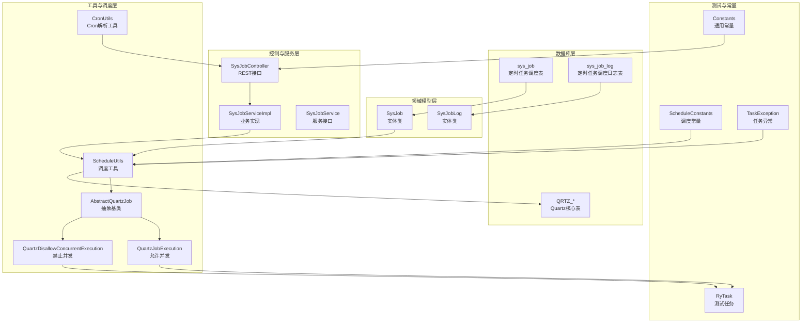
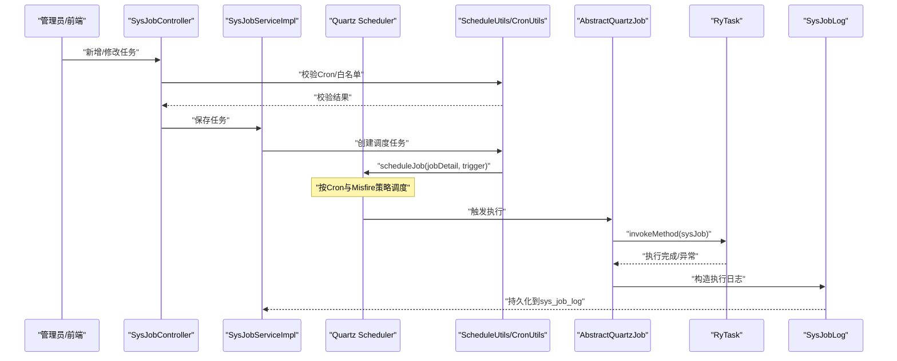
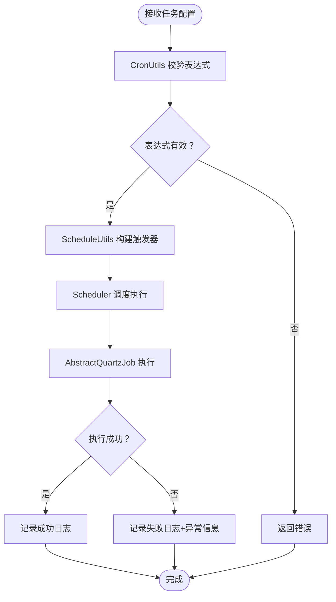
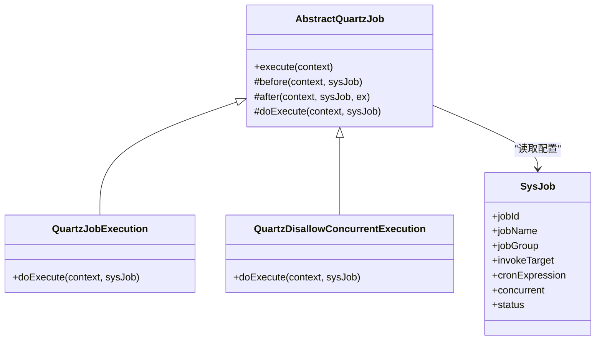
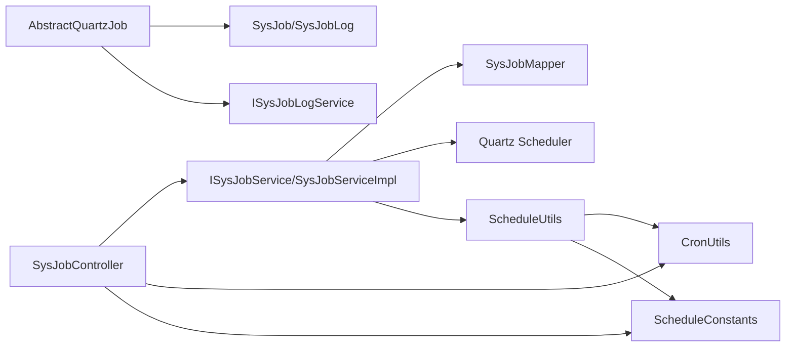
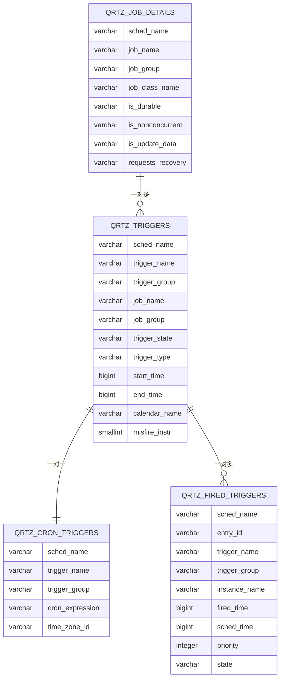

# 定时任务表结构

<cite>
**本文引用的文件**
- [定时任务调度表 sys_job](file://XingChen-Vue/sql/ry_20260321.sql)
- [定时任务调度日志表 sys_job_log](file://XingChen-Vue/sql/ry_20260321.sql)
- [Quartz 核心表结构定义 quartz.sql](file://XingChen-Vue/sql/quartz.sql)
- [定时任务实体类 SysJob](file://XingChen-Vue/xingchen-quartz/src/main/java/com/xingchen/quartz/domain/SysJob.java)
- [定时任务日志实体类 SysJobLog](file://XingChen-Vue/xingchen-quartz/src/main/java/com/xingchen/quartz/domain/SysJobLog.java)
- [Cron 表达式工具类 CronUtils](file://XingChen-Vue/xingchen-quartz/src/main/java/com/xingchen/quartz/util/CronUtils.java)
- [定时任务抽象基类 AbstractQuartzJob](file://XingChen-Vue/xingchen-quartz/src/main/java/com/xingchen/quartz/util/AbstractQuartzJob.java)
- [允许并发执行的定时任务 QuartzJobExecution](file://XingChen-Vue/xingchen-quartz/src/main/java/com/xingchen/quartz/util/QuartzJobExecution.java)
- [禁止并发执行的定时任务 QuartzDisallowConcurrentExecution](file://XingChen-Vue/xingchen-quartz/src/main/java/com/xingchen/quartz/util/QuartzDisallowConcurrentExecution.java)
- [定时任务工具类 ScheduleUtils](file://XingChen-Vue/xingchen-quartz/src/main/java/com/xingchen/quartz/util/ScheduleUtils.java)
- [定时任务控制器 SysJobController](file://XingChen-Vue/xingchen-quartz/src/main/java/com/xingchen/quartz/controller/SysJobController.java)
- [定时任务服务接口 ISysJobService](file://XingChen-Vue/xingchen-quartz/src/main/java/com/xingchen/quartz/service/ISysJobService.java)
- [定时任务服务实现类 SysJobServiceImpl](file://XingChen-Vue/xingchen-quartz/src/main/java/com/xingchen/quartz/service/impl/SysJobServiceImpl.java)
- [定时任务测试类 RyTask](file://XingChen-Vue/xingchen-quartz/src/main/java/com/xingchen/quartz/task/RyTask.java)
- [任务调度通用常量 ScheduleConstants](file://XingChen-Vue/xingchen-common/src/main/java/com/xingchen/common/constant/ScheduleConstants.java)
- [通用常量 Constants](file://XingChen-Vue/xingchen-common/src/main/java/com/xingchen/common/constant/Constants.java)
- [定时任务异常 TaskException](file://XingChen-Vue/xingchen-common/src/main/java/com/xingchen/common/exception/job/TaskException.java)
</cite>

## 目录
1. [引言](#引言)
2. [项目结构](#项目结构)
3. [核心组件](#核心组件)
4. [架构总览](#架构总览)
5. [详细组件分析](#详细组件分析)
6. [依赖关系分析](#依赖关系分析)
7. [性能考虑](#性能考虑)
8. [故障排查指南](#故障排查指南)
9. [结论](#结论)
10. [附录](#附录)

## 引言
本文档围绕健康管理系统中的定时任务表结构展开，系统性梳理定时任务调度表 sys_job、定时任务调度日志表 sys_job_log 的字段定义、数据类型、约束条件与业务含义；深入解析任务调度的核心机制、Cron 表达式的解析与执行、任务执行状态的跟踪管理；解释任务并发控制策略、错误处理机制和执行日志的完整性保证，并提供定时任务表关系图、字段说明表以及典型任务调度场景下的数据操作示例。

## 项目结构
定时任务相关代码与数据主要分布在以下模块：
- 数据库层：sys_job、sys_job_log 两张核心表，以及 Quartz 内置的调度表（QRTZ_*）
- 领域模型层：SysJob、SysJobLog 实体类
- 工具与调度层：CronUtils、AbstractQuartzJob、QuartzJobExecution、QuartzDisallowConcurrentExecution、ScheduleUtils
- 控制与服务层：SysJobController、ISysJobService、SysJobServiceImpl
- 常量与异常：ScheduleConstants、Constants、TaskException
- 测试任务：RyTask

图表来源
- [定时任务调度表 sys_job](file://XingChen-Vue/sql/ry_20260321.sql)
- [定时任务调度日志表 sys_job_log](file://XingChen-Vue/sql/ry_20260321.sql)
- [Quartz 核心表结构定义 quartz.sql](file://XingChen-Vue/sql/quartz.sql)
- [定时任务实体类 SysJob](file://XingChen-Vue/xingchen-quartz/src/main/java/com/xingchen/quartz/domain/SysJob.java)
- [定时任务日志实体类 SysJobLog](file://XingChen-Vue/xingchen-quartz/src/main/java/com/xingchen/quartz/domain/SysJobLog.java)
- [Cron 表达式工具类 CronUtils](file://XingChen-Vue/xingchen-quartz/src/main/java/com/xingchen/quartz/util/CronUtils.java)
- [定时任务抽象基类 AbstractQuartzJob](file://XingChen-Vue/xingchen-quartz/src/main/java/com/xingchen/quartz/util/AbstractQuartzJob.java)
- [允许并发执行的定时任务 QuartzJobExecution](file://XingChen-Vue/xingchen-quartz/src/main/java/com/xingchen/quartz/util/QuartzJobExecution.java)
- [禁止并发执行的定时任务 QuartzDisallowConcurrentExecution](file://XingChen-Vue/xingchen-quartz/src/main/java/com/xingchen/quartz/util/QuartzDisallowConcurrentExecution.java)
- [定时任务工具类 ScheduleUtils](file://XingChen-Vue/xingchen-quartz/src/main/java/com/xingchen/quartz/util/ScheduleUtils.java)
- [定时任务控制器 SysJobController](file://XingChen-Vue/xingchen-quartz/src/main/java/com/xingchen/quartz/controller/SysJobController.java)
- [定时任务服务接口 ISysJobService](file://XingChen-Vue/xingchen-quartz/src/main/java/com/xingchen/quartz/service/ISysJobService.java)
- [定时任务服务实现类 SysJobServiceImpl](file://XingChen-Vue/xingchen-quartz/src/main/java/com/xingchen/quartz/service/impl/SysJobServiceImpl.java)
- [定时任务测试类 RyTask](file://XingChen-Vue/xingchen-quartz/src/main/java/com/xingchen/quartz/task/RyTask.java)
- [任务调度通用常量 ScheduleConstants](file://XingChen-Vue/xingchen-common/src/main/java/com/xingchen/common/constant/ScheduleConstants.java)
- [通用常量 Constants](file://XingChen-Vue/xingchen-common/src/main/java/com/xingchen/common/constant/Constants.java)
- [定时任务异常 TaskException](file://XingChen-Vue/xingchen-common/src/main/java/com/xingchen/common/exception/job/TaskException.java)

章节来源
- [定时任务调度表 sys_job](file://XingChen-Vue/sql/ry_20260321.sql)
- [定时任务调度日志表 sys_job_log](file://XingChen-Vue/sql/ry_20260321.sql)
- [Quartz 核心表结构定义 quartz.sql](file://XingChen-Vue/sql/quartz.sql)
- [定时任务实体类 SysJob](file://XingChen-Vue/xingchen-quartz/src/main/java/com/xingchen/quartz/domain/SysJob.java)
- [定时任务日志实体类 SysJobLog](file://XingChen-Vue/xingchen-quartz/src/main/java/com/xingchen/quartz/domain/SysJobLog.java)
- [Cron 表达式工具类 CronUtils](file://XingChen-Vue/xingchen-quartz/src/main/java/com/xingchen/quartz/util/CronUtils.java)
- [定时任务抽象基类 AbstractQuartzJob](file://XingChen-Vue/xingchen-quartz/src/main/java/com/xingchen/quartz/util/AbstractQuartzJob.java)
- [允许并发执行的定时任务 QuartzJobExecution](file://XingChen-Vue/xingchen-quartz/src/main/java/com/xingchen/quartz/util/QuartzJobExecution.java)
- [禁止并发执行的定时任务 QuartzDisallowConcurrentExecution](file://XingChen-Vue/xingchen-quartz/src/main/java/com/xingchen/quartz/util/QuartzDisallowConcurrentExecution.java)
- [定时任务工具类 ScheduleUtils](file://XingChen-Vue/xingchen-quartz/src/main/java/com/xingchen/quartz/util/ScheduleUtils.java)
- [定时任务控制器 SysJobController](file://XingChen-Vue/xingchen-quartz/src/main/java/com/xingchen/quartz/controller/SysJobController.java)
- [定时任务服务接口 ISysJobService](file://XingChen-Vue/xingchen-quartz/src/main/java/com/xingchen/quartz/service/ISysJobService.java)
- [定时任务服务实现类 SysJobServiceImpl](file://XingChen-Vue/xingchen-quartz/src/main/java/com/xingchen/quartz/service/impl/SysJobServiceImpl.java)
- [定时任务测试类 RyTask](file://XingChen-Vue/xingchen-quartz/src/main/java/com/xingchen/quartz/task/RyTask.java)
- [任务调度通用常量 ScheduleConstants](file://XingChen-Vue/xingchen-common/src/main/java/com/xingchen/common/constant/ScheduleConstants.java)
- [通用常量 Constants](file://XingChen-Vue/xingchen-common/src/main/java/com/xingchen/common/constant/Constants.java)
- [定时任务异常 TaskException](file://XingChen-Vue/xingchen-common/src/main/java/com/xingchen/common/exception/job/TaskException.java)

## 核心组件
- sys_job：系统定时任务调度表，存储任务元数据、Cron 表达式、并发策略、状态等
- sys_job_log：任务执行日志表，记录每次任务执行的开始/结束时间、状态、异常信息等
- Quartz 核心表：QRTZ_*，Quartz 调度引擎内部表，负责任务触发、状态、并发控制等
- SysJob/SysJobLog：对应数据库表的 Java 实体类，提供字段映射与业务方法
- CronUtils：Cron 表达式校验、解析、计算下次执行时间
- AbstractQuartzJob/QuartzJobExecution/QuartzDisallowConcurrentExecution：Quartz 任务执行抽象与并发控制
- ScheduleUtils：任务创建、更新、暂停/恢复、Misfire 策略处理
- SysJobController/ISysJobService/SysJobServiceImpl：对外接口、业务逻辑与调度器交互
- Constants/ScheduleConstants/TaskException：常量、调度状态与异常定义

章节来源
- [定时任务调度表 sys_job](file://XingChen-Vue/sql/ry_20260321.sql)
- [定时任务调度日志表 sys_job_log](file://XingChen-Vue/sql/ry_20260321.sql)
- [Quartz 核心表结构定义 quartz.sql](file://XingChen-Vue/sql/quartz.sql)
- [定时任务实体类 SysJob](file://XingChen-Vue/xingchen-quartz/src/main/java/com/xingchen/quartz/domain/SysJob.java)
- [定时任务日志实体类 SysJobLog](file://XingChen-Vue/xingchen-quartz/src/main/java/com/xingchen/quartz/domain/SysJobLog.java)
- [Cron 表达式工具类 CronUtils](file://XingChen-Vue/xingchen-quartz/src/main/java/com/xingchen/quartz/util/CronUtils.java)
- [定时任务抽象基类 AbstractQuartzJob](file://XingChen-Vue/xingchen-quartz/src/main/java/com/xingchen/quartz/util/AbstractQuartzJob.java)
- [允许并发执行的定时任务 QuartzJobExecution](file://XingChen-Vue/xingchen-quartz/src/main/java/com/xingchen/quartz/util/QuartzJobExecution.java)
- [禁止并发执行的定时任务 QuartzDisallowConcurrentExecution](file://XingChen-Vue/xingchen-quartz/src/main/java/com/xingchen/quartz/util/QuartzDisallowConcurrentExecution.java)
- [定时任务工具类 ScheduleUtils](file://XingChen-Vue/xingchen-quartz/src/main/java/com/xingchen/quartz/util/ScheduleUtils.java)
- [定时任务控制器 SysJobController](file://XingChen-Vue/xingchen-quartz/src/main/java/com/xingchen/quartz/controller/SysJobController.java)
- [定时任务服务接口 ISysJobService](file://XingChen-Vue/xingchen-quartz/src/main/java/com/xingchen/quartz/service/ISysJobService.java)
- [定时任务服务实现类 SysJobServiceImpl](file://XingChen-Vue/xingchen-quartz/src/main/java/com/xingchen/quartz/service/impl/SysJobServiceImpl.java)
- [定时任务测试类 RyTask](file://XingChen-Vue/xingchen-quartz/src/main/java/com/xingchen/quartz/task/RyTask.java)
- [任务调度通用常量 ScheduleConstants](file://XingChen-Vue/xingchen-common/src/main/java/com/xingchen/common/constant/ScheduleConstants.java)
- [通用常量 Constants](file://XingChen-Vue/xingchen-common/src/main/java/com/xingchen/common/constant/Constants.java)
- [定时任务异常 TaskException](file://XingChen-Vue/xingchen-common/src/main/java/com/xingchen/common/exception/job/TaskException.java)

## 架构总览
定时任务从“配置—调度—执行—记录”完整闭环：
- 配置阶段：通过 SysJobController 接收任务配置，经 CronUtils 校验 Cron 表达式与白名单，写入 sys_job
- 调度阶段：SysJobServiceImpl 初始化时加载 sys_job，ScheduleUtils 将任务映射到 Quartz，按 Cron 表达式与 Misfire 策略创建触发器
- 执行阶段：AbstractQuartzJob 抽象基类封装 before/after 生命周期，具体执行由 QuartzJobExecution 或 QuartzDisallowConcurrentExecution 调用目标方法
- 记录阶段：after 中构造 SysJobLog，填充开始/结束时间、状态、异常信息并持久化到 sys_job_log

图表来源
- [定时任务控制器 SysJobController](file://XingChen-Vue/xingchen-quartz/src/main/java/com/xingchen/quartz/controller/SysJobController.java)
- [定时任务服务实现类 SysJobServiceImpl](file://XingChen-Vue/xingchen-quartz/src/main/java/com/xingchen/quartz/service/impl/SysJobServiceImpl.java)
- [定时任务工具类 ScheduleUtils](file://XingChen-Vue/xingchen-quartz/src/main/java/com/xingchen/quartz/util/ScheduleUtils.java)
- [Cron 表达式工具类 CronUtils](file://XingChen-Vue/xingchen-quartz/src/main/java/com/xingchen/quartz/util/CronUtils.java)
- [定时任务抽象基类 AbstractQuartzJob](file://XingChen-Vue/xingchen-quartz/src/main/java/com/xingchen/quartz/util/AbstractQuartzJob.java)
- [允许并发执行的定时任务 QuartzJobExecution](file://XingChen-Vue/xingchen-quartz/src/main/java/com/xingchen/quartz/util/QuartzJobExecution.java)
- [禁止并发执行的定时任务 QuartzDisallowConcurrentExecution](file://XingChen-Vue/xingchen-quartz/src/main/java/com/xingchen/quartz/util/QuartzDisallowConcurrentExecution.java)
- [定时任务测试类 RyTask](file://XingChen-Vue/xingchen-quartz/src/main/java/com/xingchen/quartz/task/RyTask.java)
- [定时任务调度日志表 sys_job_log](file://XingChen-Vue/sql/ry_20260321.sql)

## 详细组件分析

### 表结构与字段说明

#### sys_job（定时任务调度表）
- 作用：存储定时任务的元数据，包括任务名称、组、调用目标、Cron 表达式、并发策略、状态等
- 关键字段与约束
  - job_id：自增主键，唯一标识任务
  - job_name + job_group：联合主键，确保同组内任务名唯一
  - invoke_target：调用目标字符串，格式为“Bean 名称.方法名(参数列表)”或“全限定类名.静态方法”
  - cron_expression：Cron 表达式，支持标准 5/6 位表达式
  - misfire_policy：错失执行策略（默认/忽略/立即/放弃）
  - concurrent：并发控制（0 允许，1 禁止）
  - status：任务状态（0 正常，1 暂停）
  - create_time/update_time：记录创建与更新时间
- 业务含义
  - 任务的生命周期管理：新增后默认暂停，需显式启用；支持暂停/恢复
  - 调度精度：通过 cron_expression 精确控制执行时机
  - 安全边界：通过白名单与关键字过滤，限制危险调用

章节来源
- [定时任务调度表 sys_job](file://XingChen-Vue/sql/ry_20260321.sql)

#### sys_job_log（定时任务调度日志表）
- 作用：记录每次任务执行的详细情况，便于审计与排障
- 关键字段与约束
  - job_log_id：自增主键
  - job_name/job_group/invoke_target：与任务元数据关联
  - job_message：执行摘要信息（包含耗时）
  - status：执行状态（0 正常，1 失败）
  - exception_info：异常信息截断后的文本
  - start_time/end_time：执行起止时间
  - create_time：日志创建时间
- 业务含义
  - 完整性：无论成功或失败均记录，失败时记录异常信息
  - 可追溯：通过 job_name/job_group/invoke_target 快速定位任务与调用目标
  - 成本度量：通过 start_time/end_time 计算执行耗时

章节来源
- [定时任务调度日志表 sys_job_log](file://XingChen-Vue/sql/ry_20260321.sql)

#### Quartz 核心表（QRTZ_*）
- 作用：Quartz 调度引擎内部表，支撑任务触发、并发控制、Misfire 策略、集群状态等
- 关键表
  - QRTZ_JOB_DETAILS：任务详情（类名、是否持久化、并发标记等）
  - QRTZ_TRIGGERS：触发器（类型、状态、开始/结束时间、优先级、Misfire 策略等）
  - QRTZ_CRON_TRIGGERS：Cron 表达式与时区
  - QRTZ_FIRED_TRIGGERS：已触发记录（执行状态、实例名、是否并发等）
  - QRTZ_SCHEDULER_STATE/QRTZ_LOCKS：调度器状态与悲观锁
- 业务含义
  - 与 sys_job 对应：sys_job 作为应用层配置，Quartz 表作为调度层实现
  - 并发控制：通过 QRTZ_JOB_DETAILS 的并发标记与 Quartz 注解共同生效
  - 错失处理：通过 QRTZ_TRIGGERS 的 misfire_instr 与 ScheduleUtils 的策略映射

章节来源
- [Quartz 核心表结构定义 quartz.sql](file://XingChen-Vue/sql/quartz.sql)

### Cron 表达式解析与执行
- 解析流程
  - SysJobController 在新增/修改时调用 CronUtils.validate 校验表达式
  - ScheduleUtils.createScheduleJob 使用 CronScheduleBuilder 构建触发器
  - AbstractQuartzJob.before 记录开始时间，after 统计耗时并写入日志
- 执行时机
  - 由 Quartz Scheduler 按 Cron 表达式与 Misfire 策略触发
  - 通过 JobDataMap 将 SysJob 注入到 Job 执行上下文

图表来源
- [定时任务控制器 SysJobController](file://XingChen-Vue/xingchen-quartz/src/main/java/com/xingchen/quartz/controller/SysJobController.java)
- [Cron 表达式工具类 CronUtils](file://XingChen-Vue/xingchen-quartz/src/main/java/com/xingchen/quartz/util/CronUtils.java)
- [定时任务工具类 ScheduleUtils](file://XingChen-Vue/xingchen-quartz/src/main/java/com/xingchen/quartz/util/ScheduleUtils.java)
- [定时任务抽象基类 AbstractQuartzJob](file://XingChen-Vue/xingchen-quartz/src/main/java/com/xingchen/quartz/util/AbstractQuartzJob.java)
- [定时任务调度日志表 sys_job_log](file://XingChen-Vue/sql/ry_20260321.sql)

章节来源
- [定时任务控制器 SysJobController](file://XingChen-Vue/xingchen-quartz/src/main/java/com/xingchen/quartz/controller/SysJobController.java)
- [Cron 表达式工具类 CronUtils](file://XingChen-Vue/xingchen-quartz/src/main/java/com/xingchen/quartz/util/CronUtils.java)
- [定时任务工具类 ScheduleUtils](file://XingChen-Vue/xingchen-quartz/src/main/java/com/xingchen/quartz/util/ScheduleUtils.java)
- [定时任务抽象基类 AbstractQuartzJob](file://XingChen-Vue/xingchen-quartz/src/main/java/com/xingchen/quartz/util/AbstractQuartzJob.java)
- [定时任务调度日志表 sys_job_log](file://XingChen-Vue/sql/ry_20260321.sql)

### 并发控制策略
- 禁止并发（QuartzDisallowConcurrentExecution）
  - 使用 @DisallowConcurrentExecution 注解，避免同一任务实例并发执行
  - 适用于资源敏感或幂等性要求高的任务
- 允许并发（QuartzJobExecution）
  - 默认策略，适合无状态、可并行的任务
- Quartz 层面
  - QRTZ_JOB_DETAILS 的 is_nonconcurrent 字段与注解共同决定并发行为
  - QRTZ_FIRED_TRIGGERS 记录执行状态与并发标记

图表来源
- [定时任务抽象基类 AbstractQuartzJob](file://XingChen-Vue/xingchen-quartz/src/main/java/com/xingchen/quartz/util/AbstractQuartzJob.java)
- [允许并发执行的定时任务 QuartzJobExecution](file://XingChen-Vue/xingchen-quartz/src/main/java/com/xingchen/quartz/util/QuartzJobExecution.java)
- [禁止并发执行的定时任务 QuartzDisallowConcurrentExecution](file://XingChen-Vue/xingchen-quartz/src/main/java/com/xingchen/quartz/util/QuartzDisallowConcurrentExecution.java)
- [定时任务实体类 SysJob](file://XingChen-Vue/xingchen-quartz/src/main/java/com/xingchen/quartz/domain/SysJob.java)

章节来源
- [定时任务抽象基类 AbstractQuartzJob](file://XingChen-Vue/xingchen-quartz/src/main/java/com/xingchen/quartz/util/AbstractQuartzJob.java)
- [允许并发执行的定时任务 QuartzJobExecution](file://XingChen-Vue/xingchen-quartz/src/main/java/com/xingchen/quartz/util/QuartzJobExecution.java)
- [禁止并发执行的定时任务 QuartzDisallowConcurrentExecution](file://XingChen-Vue/xingchen-quartz/src/main/java/com/xingchen/quartz/util/QuartzDisallowConcurrentExecution.java)
- [定时任务实体类 SysJob](file://XingChen-Vue/xingchen-quartz/src/main/java/com/xingchen/quartz/domain/SysJob.java)

### 错误处理与日志完整性
- 异常捕获
  - AbstractQuartzJob.after 在异常分支设置 status=FAIL，并截断异常信息写入 exception_info
- 白名单与安全
  - ScheduleUtils.whiteList 限制调用包名范围，Constants.JOB_WHITELIST_STR 与 JOB_ERROR_STR 过滤危险调用
- 日志完整性
  - 无论成功与否均记录 start_time/end_time、job_message、status
  - 失败时记录 exception_info，便于快速定位

章节来源
- [定时任务抽象基类 AbstractQuartzJob](file://XingChen-Vue/xingchen-quartz/src/main/java/com/xingchen/quartz/util/AbstractQuartzJob.java)
- [定时任务工具类 ScheduleUtils](file://XingChen-Vue/xingchen-quartz/src/main/java/com/xingchen/quartz/util/ScheduleUtils.java)
- [通用常量 Constants](file://XingChen-Vue/xingchen-common/src/main/java/com/xingchen/common/constant/Constants.java)
- [定时任务调度日志表 sys_job_log](file://XingChen-Vue/sql/ry_20260321.sql)

### 典型任务调度场景与数据操作示例
- 新增任务
  - 调用 /monitor/job（POST），传入 SysJob（含 cron_expression、invoke_target、concurrent、status 等）
  - SysJobController 校验 Cron 与白名单，SysJobServiceImpl 插入 sys_job 并通过 ScheduleUtils 创建调度
- 修改任务
  - 调用 /monitor/job（PUT），SysJobServiceImpl 更新 sys_job 并重新创建调度
- 暂停/恢复任务
  - 调用 /monitor/job/changeStatus（PUT），SysJobServiceImpl 更新状态并调用 scheduler.pause/resume
- 立即执行一次
  - 调用 /monitor/job/run（PUT），SysJobServiceImpl 通过 scheduler.triggerJob 触发当前任务
- 删除任务
  - 调用 /monitor/job/{jobIds}（DELETE），SysJobServiceImpl 删除 sys_job 并删除对应 Quartz 任务

章节来源
- [定时任务控制器 SysJobController](file://XingChen-Vue/xingchen-quartz/src/main/java/com/xingchen/quartz/controller/SysJobController.java)
- [定时任务服务实现类 SysJobServiceImpl](file://XingChen-Vue/xingchen-quartz/src/main/java/com/xingchen/quartz/service/impl/SysJobServiceImpl.java)
- [定时任务服务接口 ISysJobService](file://XingChen-Vue/xingchen-quartz/src/main/java/com/xingchen/quartz/service/ISysJobService.java)

## 依赖关系分析
- 应用层依赖
  - SysJobController 依赖 ISysJobService、CronUtils、ScheduleUtils
  - SysJobServiceImpl 依赖 SysJobMapper、Scheduler、ScheduleUtils
- 调度层依赖
  - ScheduleUtils 依赖 Quartz API、CronUtils、ScheduleConstants
  - AbstractQuartzJob 依赖 SysJob、SysJobLog、ISysJobLogService
- 安全与常量
  - Constants 提供白名单与安全关键字
  - ScheduleConstants 提供 Misfire 策略与状态枚举

图表来源
- [定时任务控制器 SysJobController](file://XingChen-Vue/xingchen-quartz/src/main/java/com/xingchen/quartz/controller/SysJobController.java)
- [定时任务服务接口 ISysJobService](file://XingChen-Vue/xingchen-quartz/src/main/java/com/xingchen/quartz/service/ISysJobService.java)
- [定时任务服务实现类 SysJobServiceImpl](file://XingChen-Vue/xingchen-quartz/src/main/java/com/xingchen/quartz/service/impl/SysJobServiceImpl.java)
- [定时任务工具类 ScheduleUtils](file://XingChen-Vue/xingchen-quartz/src/main/java/com/xingchen/quartz/util/ScheduleUtils.java)
- [Cron 表达式工具类 CronUtils](file://XingChen-Vue/xingchen-quartz/src/main/java/com/xingchen/quartz/util/CronUtils.java)
- [任务调度通用常量 ScheduleConstants](file://XingChen-Vue/xingchen-common/src/main/java/com/xingchen/common/constant/ScheduleConstants.java)
- [定时任务抽象基类 AbstractQuartzJob](file://XingChen-Vue/xingchen-quartz/src/main/java/com/xingchen/quartz/util/AbstractQuartzJob.java)

章节来源
- [定时任务控制器 SysJobController](file://XingChen-Vue/xingchen-quartz/src/main/java/com/xingchen/quartz/controller/SysJobController.java)
- [定时任务服务接口 ISysJobService](file://XingChen-Vue/xingchen-quartz/src/main/java/com/xingchen/quartz/service/ISysJobService.java)
- [定时任务服务实现类 SysJobServiceImpl](file://XingChen-Vue/xingchen-quartz/src/main/java/com/xingchen/quartz/service/impl/SysJobServiceImpl.java)
- [定时任务工具类 ScheduleUtils](file://XingChen-Vue/xingchen-quartz/src/main/java/com/xingchen/quartz/util/ScheduleUtils.java)
- [Cron 表达式工具类 CronUtils](file://XingChen-Vue/xingchen-quartz/src/main/java/com/xingchen/quartz/util/CronUtils.java)
- [任务调度通用常量 ScheduleConstants](file://XingChen-Vue/xingchen-common/src/main/java/com/xingchen/common/constant/ScheduleConstants.java)
- [定时任务抽象基类 AbstractQuartzJob](file://XingChen-Vue/xingchen-quartz/src/main/java/com/xingchen/quartz/util/AbstractQuartzJob.java)

## 性能考虑
- Cron 表达式复杂度
  - 复杂表达式会增加计算开销，建议使用标准表达式并避免过于频繁的触发
- 并发控制
  - 禁止并发可避免资源争用，但会降低吞吐；允许并发需确保任务无副作用
- Misfire 策略
  - 合理选择策略可减少堆积：忽略立即执行适合高吞吐场景，放弃执行适合严格时序场景
- 日志写入
  - 每次执行都会写入 sys_job_log，建议对高频任务进行采样或异步化

## 故障排查指南
- Cron 表达式无效
  - 现象：新增/修改任务时报错
  - 处理：使用 CronUtils.getInvalidMessage 获取具体错误描述
- 调用目标不在白名单
  - 现象：新增/修改任务失败
  - 处理：确认 invoke_target 包名在 Constants.JOB_WHITELIST_STR 中，且不包含 JOB_ERROR_STR 关键字
- 任务未执行或过期
  - 现象：任务未按预期执行
  - 处理：检查 CronUtils.getNextExecution 是否返回未来时间；确认 sys_job.status 为正常
- 并发冲突
  - 现象：任务阻塞或报错
  - 处理：调整 concurrent 策略；检查 QuartzDisallowConcurrentExecution 是否生效
- 日志缺失
  - 现象：sys_job_log 无记录
  - 处理：确认 AbstractQuartzJob.after 是否执行；检查 ISysJobLogService.addJobLog 是否被调用

章节来源
- [Cron 表达式工具类 CronUtils](file://XingChen-Vue/xingchen-quartz/src/main/java/com/xingchen/quartz/util/CronUtils.java)
- [定时任务工具类 ScheduleUtils](file://XingChen-Vue/xingchen-quartz/src/main/java/com/xingchen/quartz/util/ScheduleUtils.java)
- [通用常量 Constants](file://XingChen-Vue/xingchen-common/src/main/java/com/xingchen/common/constant/Constants.java)
- [定时任务抽象基类 AbstractQuartzJob](file://XingChen-Vue/xingchen-quartz/src/main/java/com/xingchen/quartz/util/AbstractQuartzJob.java)
- [定时任务异常 TaskException](file://XingChen-Vue/xingchen-common/src/main/java/com/xingchen/common/exception/job/TaskException.java)

## 结论
本系统通过 sys_job/sys_job_log 与 Quartz 的协同，实现了高可靠、可审计、可扩展的定时任务体系。通过严格的 Cron 校验、白名单与安全过滤、并发控制与 Misfire 策略，以及完整的执行日志记录，满足生产环境对稳定性与可观测性的要求。建议在实际部署中结合业务特性合理配置 Cron、并发策略与日志级别，持续优化任务执行性能与资源占用。

## 附录

### sys_job 字段说明表
- 字段名：job_id
  - 类型：bigint
  - 约束：NOT NULL, AUTO_INCREMENT, 主键
  - 说明：任务唯一标识
- 字段名：job_name
  - 类型：varchar(64)
  - 约束：NOT NULL, 默认 ''
  - 说明：任务名称
- 字段名：job_group
  - 类型：varchar(64)
  - 约束：NOT NULL, 默认 'DEFAULT'
  - 说明：任务组名
- 字段名：invoke_target
  - 类型：varchar(500)
  - 约束：NOT NULL
  - 说明：调用目标字符串（Bean 方法或全限定类静态方法）
- 字段名：cron_expression
  - 类型：varchar(255)
  - 约束：NOT NULL, 默认 ''
  - 说明：Cron 表达式
- 字段名：misfire_policy
  - 类型：varchar(20)
  - 约束：NOT NULL, 默认 '3'
  - 说明：错失执行策略（1立即/2执行一次/3放弃）
- 字段名：concurrent
  - 类型：char(1)
  - 约束：NOT NULL, 默认 '1'
  - 说明：并发控制（0允许/1禁止）
- 字段名：status
  - 类型：char(1)
  - 约束：NOT NULL, 默认 '0'
  - 说明：任务状态（0正常/1暂停）
- 字段名：create_by/update_by
  - 类型：varchar(64)
  - 约束：默认 ''
  - 说明：创建/更新人
- 字段名：create_time/update_time
  - 类型：datetime
  - 约束：默认 NULL
  - 说明：创建/更新时间
- 字段名：remark
  - 类型：varchar(500)
  - 约束：默认 ''
  - 说明：备注信息

章节来源
- [定时任务调度表 sys_job](file://XingChen-Vue/sql/ry_20260321.sql)

### sys_job_log 字段说明表
- 字段名：job_log_id
  - 类型：bigint
  - 约束：NOT NULL, AUTO_INCREMENT, 主键
  - 说明：日志唯一标识
- 字段名：job_name
  - 类型：varchar(64)
  - 约束：NOT NULL
  - 说明：任务名称
- 字段名：job_group
  - 类型：varchar(64)
  - 约束：NOT NULL
  - 说明：任务组名
- 字段名：invoke_target
  - 类型：varchar(500)
  - 约束：NOT NULL
  - 说明：调用目标字符串
- 字段名：job_message
  - 类型：varchar(500)
  - 约束：默认 NULL
  - 说明：日志信息（含耗时）
- 字段名：status
  - 类型：char(1)
  - 约束：NOT NULL, 默认 '0'
  - 说明：执行状态（0正常/1失败）
- 字段名：exception_info
  - 类型：varchar(2000)
  - 约束：默认 ''
  - 说明：异常信息（截断）
- 字段名：start_time
  - 类型：datetime
  - 约束：默认 NULL
  - 说明：执行开始时间
- 字段名：end_time
  - 类型：datetime
  - 约束：默认 NULL
  - 说明：执行结束时间
- 字段名：create_time
  - 类型：datetime
  - 约束：默认 NULL
  - 说明：日志创建时间

章节来源
- [定时任务调度日志表 sys_job_log](file://XingChen-Vue/sql/ry_20260321.sql)

### Quartz 表关系图

图表来源
- [Quartz 核心表结构定义 quartz.sql](file://XingChen-Vue/sql/quartz.sql)