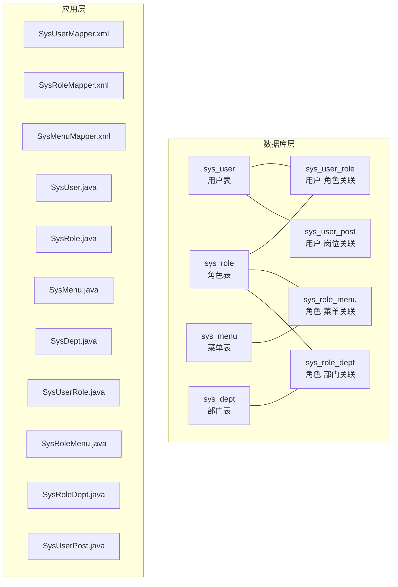
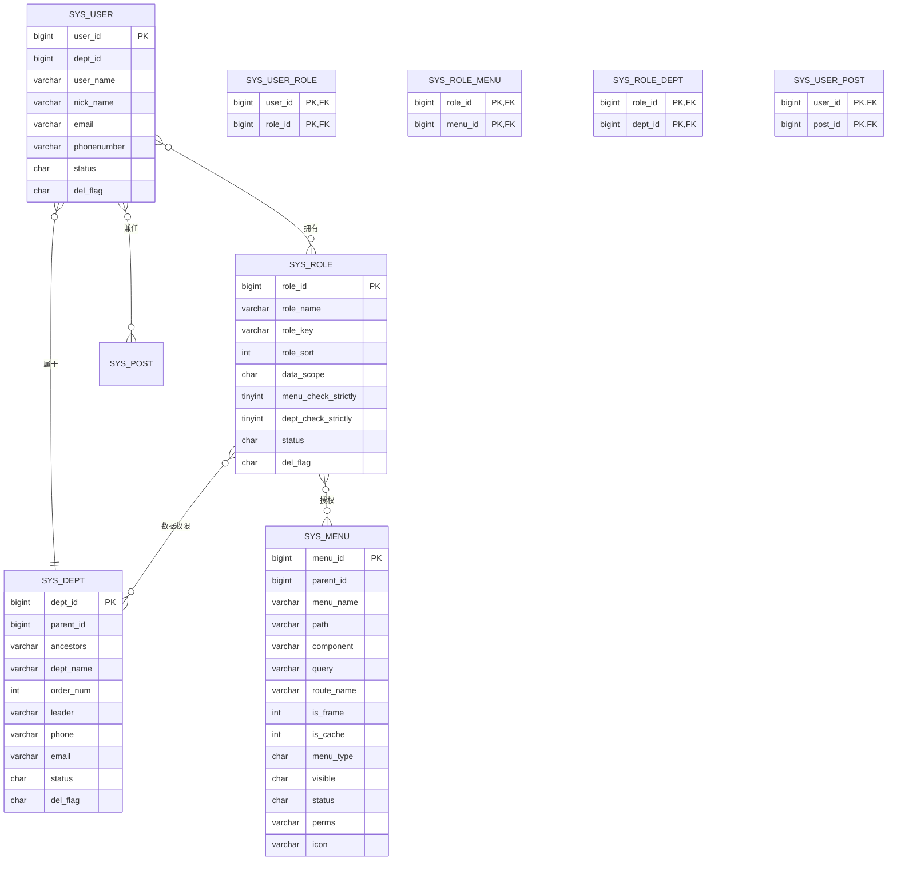
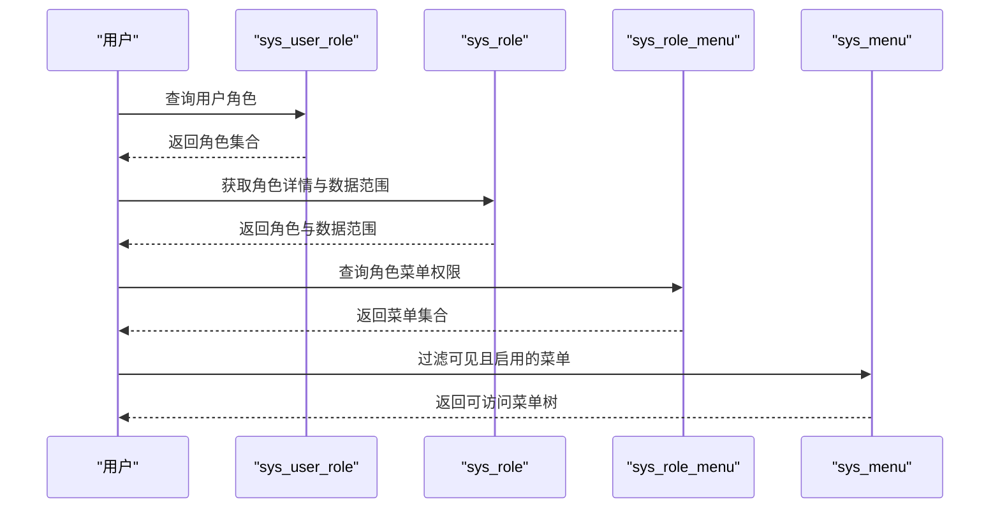
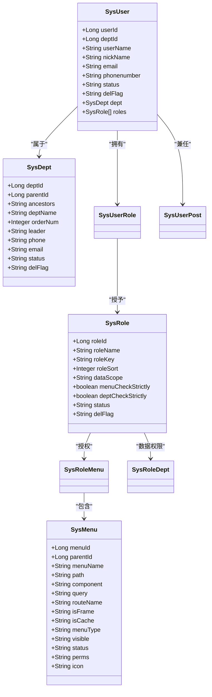

# 核心表结构设计

<cite>
**本文档引用的文件**
- [ry_20260321.sql](file://XingChen-Vue/sql/ry_20260321.sql)
- [SysUserMapper.xml](file://XingChen-Vue/xingchen-system/src/main/resources/mapper/system/SysUserMapper.xml)
- [SysRoleMapper.xml](file://XingChen-Vue/xingchen-system/src/main/resources/mapper/system/SysRoleMapper.xml)
- [SysMenuMapper.xml](file://XingChen-Vue/xingchen-system/src/main/resources/mapper/system/SysMenuMapper.xml)
- [SysUser.java](file://XingChen-Vue/xingchen-common/src/main/java/com/xingchen/common/core/domain/entity/SysUser.java)
- [SysRole.java](file://XingChen-Vue/xingchen-common/src/main/java/com/xingchen/common/core/domain/entity/SysRole.java)
- [SysMenu.java](file://XingChen-Vue/xingchen-common/src/main/java/com/xingchen/common/core/domain/entity/SysMenu.java)
- [SysDept.java](file://XingChen-Vue/xingchen-common/src/main/java/com/xingchen/common/core/domain/entity/SysDept.java)
- [SysUserRole.java](file://XingChen-Vue/xingchen-system/src/main/java/com/xingchen/system/domain/SysUserRole.java)
- [SysRoleMenu.java](file://XingChen-Vue/xingchen-system/src/main/java/com/xingchen/system/domain/SysRoleMenu.java)
- [SysRoleDept.java](file://XingChen-Vue/xingchen-system/src/main/java/com/xingchen/system/domain/SysRoleDept.java)
- [SysUserPost.java](file://XingChen-Vue/xingchen-system/src/main/java/com/xingchen/system/domain/SysUserPost.java)
</cite>

## 目录
1. [简介](#简介)
2. [项目结构](#项目结构)
3. [核心组件](#核心组件)
4. [架构总览](#架构总览)
5. [详细组件分析](#详细组件分析)
6. [依赖分析](#依赖分析)
7. [性能考虑](#性能考虑)
8. [故障排查指南](#故障排查指南)
9. [结论](#结论)
10. [附录](#附录)

## 简介
本文件聚焦于健康管理系统的核心业务表结构设计，围绕用户、角色、菜单、部门等核心实体及其关联表进行深入解析。内容涵盖字段定义、数据类型、约束条件、业务含义、主键/外键设计、索引策略以及字段注释，并结合RBAC权限模型阐述用户-角色、角色-菜单等关联表的设计理念。同时提供表结构图、字段说明表与典型业务场景下的数据流向示例，帮助开发者与运维人员快速理解并高效使用该权限体系。

## 项目结构
本项目的权限与组织结构相关表主要位于数据库初始化脚本中，对应的Java实体类与MyBatis映射文件分别位于通用模块与系统模块中，形成“数据库脚本 + 实体类 + ORM映射”的完整设计闭环。

**图表来源**
- [ry_20260321.sql:41-64](file://XingChen-Vue/sql/ry_20260321.sql#L41-L64)
- [ry_20260321.sql:104-121](file://XingChen-Vue/sql/ry_20260321.sql#L104-L121)
- [ry_20260321.sql:133-156](file://XingChen-Vue/sql/ry_20260321.sql#L133-L156)
- [ry_20260321.sql:5-21](file://XingChen-Vue/sql/ry_20260321.sql#L5-L21)
- [ry_20260321.sql:267-289](file://XingChen-Vue/sql/ry_20260321.sql#L267-L289)
- [ry_20260321.sql:284-289](file://XingChen-Vue/sql/ry_20260321.sql#L284-L289)
- [ry_20260321.sql:383-388](file://XingChen-Vue/sql/ry_20260321.sql#L383-L388)
- [ry_20260321.sql:401-407](file://XingChen-Vue/sql/ry_20260321.sql#L401-L407)

**章节来源**
- [ry_20260321.sql:1-722](file://XingChen-Vue/sql/ry_20260321.sql#L1-L722)

## 核心组件
本节对四大核心业务表（用户、角色、菜单、部门）及其关联表进行字段定义、约束与业务含义的系统性梳理，并给出索引策略与常见查询模式。

- 用户表（sys_user）
  - 主键：user_id（自增）
  - 关键字段：dept_id（外键至sys_dept）、user_name（唯一性校验）、password、status、del_flag（逻辑删除）
  - 业务含义：承载系统用户身份、认证与基本信息，支持部门归属与角色授权
  - 约束与注释：字段均带有明确注释，如“账号状态”“删除标志”等
  - 索引策略：ORM层通过MyBatis映射文件体现常用查询条件（用户名、手机号、邮箱唯一性检查）

- 角色表（sys_role）
  - 主键：role_id（自增）
  - 关键字段：role_name、role_key（权限字符串）、data_scope（数据范围）、menu_check_strictly、dept_check_strictly、status、del_flag
  - 业务含义：定义角色权限边界与数据可见范围，支持菜单/部门树联动显示策略
  - 约束与注释：role_key用于权限标识，data_scope支持多种数据权限模式
  - 索引策略：ORM层通过MyBatis映射文件体现按角色名、权限字符串、状态等条件的查询

- 菜单表（sys_menu）
  - 主键：menu_id（自增）
  - 关键字段：parent_id（自关联）、menu_type（目录/菜单/按钮）、perms（权限标识）、status、visible、order_num
  - 业务含义：支撑前端菜单树与按钮级权限控制，支持路由、组件、缓存等配置
  - 约束与注释：menu_type区分层级与功能点，perms用于后端鉴权
  - 索引策略：ORM层通过MyBatis映射文件体现按菜单名、状态、可见性等条件的查询

- 部门表（sys_dept）
  - 主键：dept_id（自增）
  - 关键字段：parent_id（自关联）、ancestors（祖级列表）、dept_name、order_num、leader、phone、email、status、del_flag
  - 业务含义：组织架构树形结构，支持多层级与祖先链路查询
  - 约束与注释：ancestors用于树形遍历与范围查询
  - 索引策略：ORM层通过MyBatis映射文件体现按部门名、状态、祖先链等条件的查询

- 关联表
  - 用户-角色（sys_user_role）：复合主键(user_id, role_id)，支持用户多角色
  - 角色-菜单（sys_role_menu）：复合主键(role_id, menu_id)，支持角色多菜单
  - 角色-部门（sys_role_dept）：复合主键(role_id, dept_id)，支持角色多部门数据权限
  - 用户-岗位（sys_user_post）：复合主键(user_id, post_id)，支持用户多岗位

**章节来源**
- [ry_20260321.sql:41-64](file://XingChen-Vue/sql/ry_20260321.sql#L41-L64)
- [ry_20260321.sql:104-121](file://XingChen-Vue/sql/ry_20260321.sql#L104-L121)
- [ry_20260321.sql:133-156](file://XingChen-Vue/sql/ry_20260321.sql#L133-L156)
- [ry_20260321.sql:5-21](file://XingChen-Vue/sql/ry_20260321.sql#L5-L21)
- [ry_20260321.sql:267-289](file://XingChen-Vue/sql/ry_20260321.sql#L267-L289)
- [ry_20260321.sql:284-289](file://XingChen-Vue/sql/ry_20260321.sql#L284-L289)
- [ry_20260321.sql:383-388](file://XingChen-Vue/sql/ry_20260321.sql#L383-L388)
- [ry_20260321.sql:401-407](file://XingChen-Vue/sql/ry_20260321.sql#L401-L407)

## 架构总览
RBAC权限模型通过“用户-角色-菜单”三层映射实现细粒度权限控制，配合“角色-部门”实现数据权限隔离。下图展示核心表之间的关系与典型查询路径。

**图表来源**
- [ry_20260321.sql:41-64](file://XingChen-Vue/sql/ry_20260321.sql#L41-L64)
- [ry_20260321.sql:5-21](file://XingChen-Vue/sql/ry_20260321.sql#L5-L21)
- [ry_20260321.sql:104-121](file://XingChen-Vue/sql/ry_20260321.sql#L104-L121)
- [ry_20260321.sql:133-156](file://XingChen-Vue/sql/ry_20260321.sql#L133-L156)
- [ry_20260321.sql:267-289](file://XingChen-Vue/sql/ry_20260321.sql#L267-L289)
- [ry_20260321.sql:284-289](file://XingChen-Vue/sql/ry_20260321.sql#L284-L289)
- [ry_20260321.sql:383-388](file://XingChen-Vue/sql/ry_20260321.sql#L383-L388)
- [ry_20260321.sql:401-407](file://XingChen-Vue/sql/ry_20260321.sql#L401-L407)

## 详细组件分析

### 用户表（sys_user）字段与约束
- 字段定义与注释
  - user_id：主键，自增
  - dept_id：外键，指向sys_dept.dept_id
  - user_name：唯一性校验（通过ORM层唯一性查询体现）
  - password：密码字段
  - status：账号状态（0正常 1停用）
  - del_flag：逻辑删除标志（0存在 2删除）
  - 其他：登录信息、创建/更新时间等
- 约束与业务含义
  - 逻辑删除：通过del_flag字段实现软删除，避免物理删除造成关联数据断裂
  - 唯一性：用户名、手机号、邮箱均具备唯一性校验（ORM层体现）
  - 部门归属：用户属于某个部门，支持部门树形查询与数据权限
- 索引策略
  - ORM层通过用户名、手机号、邮箱的唯一性查询体现索引需求
  - 建议在user_name、phonenumber、email上建立唯一索引以保障唯一性与查询性能

**章节来源**
- [ry_20260321.sql:41-64](file://XingChen-Vue/sql/ry_20260321.sql#L41-L64)
- [SysUserMapper.xml:134-144](file://XingChen-Vue/xingchen-system/src/main/resources/mapper/system/SysUserMapper.xml#L134-L144)

### 角色表（sys_role）字段与约束
- 字段定义与注释
  - role_id：主键，自增
  - role_name、role_key：角色名称与权限字符串
  - data_scope：数据范围（1-5种模式）
  - menu_check_strictly、dept_check_strictly：菜单/部门树选择联动策略
  - status、del_flag：状态与逻辑删除
- 约束与业务含义
  - data_scope：决定角色可访问的数据范围（全部、自定义、本部门、本部门及以下、仅本人）
  - menu_check_strictly/dept_check_strictly：影响前端树选择时父子节点联动显示
- 索引策略
  - ORM层通过角色名、权限字符串、状态等条件查询体现索引需求
  - 建议在role_name、role_key上建立唯一或唯一组合索引

**章节来源**
- [ry_20260321.sql:104-121](file://XingChen-Vue/sql/ry_20260321.sql#L104-L121)
- [SysRoleMapper.xml:86-94](file://XingChen-Vue/xingchen-system/src/main/resources/mapper/system/SysRoleMapper.xml#L86-L94)

### 菜单表（sys_menu）字段与约束
- 字段定义与注释
  - menu_id：主键，自增
  - parent_id：自关联父菜单ID
  - menu_type：M目录、C菜单、F按钮
  - perms：权限标识，用于后端鉴权
  - status、visible：状态与可见性
  - order_num：显示顺序
- 约束与业务含义
  - menu_type区分菜单层级与功能点，perms用于精确到按钮级的权限控制
  - visible/status用于前端展示与可用性控制
- 索引策略
  - ORM层通过菜单名、状态、可见性等条件查询体现索引需求
  - 建议在menu_type、parent_id、status上建立复合索引以优化树查询

**章节来源**
- [ry_20260321.sql:133-156](file://XingChen-Vue/sql/ry_20260321.sql#L133-L156)
- [SysMenuMapper.xml:36-50](file://XingChen-Vue/xingchen-system/src/main/resources/mapper/system/SysMenuMapper.xml#L36-L50)

### 部门表（sys_dept）字段与约束
- 字段定义与注释
  - dept_id：主键，自增
  - parent_id：自关联父部门ID
  - ancestors：祖级列表，支持树形遍历
  - dept_name、order_num、leader、phone、email、status、del_flag
- 约束与业务含义
  - ancestors：支持“本部门及以下”等数据权限范围计算
  - 支持多层级组织架构与父子关系维护
- 索引策略
  - ORM层通过find_in_set与ancestors查询体现索引需求
  - 建议在ancestors、parent_id上建立索引以优化树查询

**章节来源**
- [ry_20260321.sql:5-21](file://XingChen-Vue/sql/ry_20260321.sql#L5-L21)
- [SysUserMapper.xml:82-84](file://XingChen-Vue/xingchen-system/src/main/resources/mapper/system/SysUserMapper.xml#L82-L84)

### 关联表设计与RBAC支撑
- 用户-角色（sys_user_role）
  - 复合主键(user_id, role_id)，支持用户多角色
  - 通过该表实现用户权限聚合
- 角色-菜单（sys_role_menu）
  - 复合主键(role_id, menu_id)，支持角色多菜单
  - 通过该表实现菜单权限下发
- 角色-部门（sys_role_dept）
  - 复合主键(role_id, dept_id)，支持角色多部门数据权限
  - 与data_scope配合实现数据权限隔离
- 用户-岗位（sys_user_post）
  - 复合主键(user_id, post_id)，支持用户多岗位
  - 用于业务场景下的职责划分

**图表来源**
- [ry_20260321.sql:267-289](file://XingChen-Vue/sql/ry_20260321.sql#L267-L289)
- [ry_20260321.sql:284-289](file://XingChen-Vue/sql/ry_20260321.sql#L284-L289)
- [SysMenuMapper.xml:77-86](file://XingChen-Vue/xingchen-system/src/main/resources/mapper/system/SysMenuMapper.xml#L77-L86)

**章节来源**
- [ry_20260321.sql:267-289](file://XingChen-Vue/sql/ry_20260321.sql#L267-L289)
- [ry_20260321.sql:284-289](file://XingChen-Vue/sql/ry_20260321.sql#L284-L289)
- [SysMenuMapper.xml:58-86](file://XingChen-Vue/xingchen-system/src/main/resources/mapper/system/SysMenuMapper.xml#L58-L86)

## 依赖分析
- 表间依赖
  - sys_user.dept_id → sys_dept.dept_id
  - sys_user_role(user_id) → sys_user(user_id)
  - sys_user_role(role_id) → sys_role(role_id)
  - sys_role_menu(role_id) → sys_role(role_id)
  - sys_role_menu(menu_id) → sys_menu(menu_id)
  - sys_role_dept(role_id) → sys_role(role_id)
  - sys_role_dept(dept_id) → sys_dept(dept_id)
  - sys_user_post(user_id) → sys_user(user_id)
  - sys_user_post(post_id) → sys_post(post_id)
- Java实体与映射
  - SysUser/SysRole/SysMenu/SysDept对应核心表
  - SysUserRole/SysRoleMenu/SysRoleDept/SysUserPost对应关联表
  - MyBatis映射文件定义了查询条件、结果映射与SQL片段

**图表来源**
- [SysUser.java:22-100](file://XingChen-Vue/xingchen-common/src/main/java/com/xingchen/common/core/domain/entity/SysUser.java#L22-L100)
- [SysDept.java:18-60](file://XingChen-Vue/xingchen-common/src/main/java/com/xingchen/common/core/domain/entity/SysDept.java#L18-L60)
- [SysRole.java:18-80](file://XingChen-Vue/xingchen-common/src/main/java/com/xingchen/common/core/domain/entity/SysRole.java#L18-L80)
- [SysMenu.java:17-40](file://XingChen-Vue/xingchen-common/src/main/java/com/xingchen/common/core/domain/entity/SysMenu.java#L17-L40)
- [SysUserRole.java:11-20](file://XingChen-Vue/xingchen-system/src/main/java/com/xingchen/system/domain/SysUserRole.java#L11-L20)
- [SysRoleMenu.java:11-20](file://XingChen-Vue/xingchen-system/src/main/java/com/xingchen/system/domain/SysRoleMenu.java#L11-L20)
- [SysRoleDept.java:11-20](file://XingChen-Vue/xingchen-system/src/main/java/com/xingchen/system/domain/SysRoleDept.java#L11-L20)
- [SysUserPost.java:11-20](file://XingChen-Vue/xingchen-system/src/main/java/com/xingchen/system/domain/SysUserPost.java#L11-L20)

**章节来源**
- [SysUser.java:22-100](file://XingChen-Vue/xingchen-common/src/main/java/com/xingchen/common/core/domain/entity/SysUser.java#L22-L100)
- [SysRole.java:18-80](file://XingChen-Vue/xingchen-common/src/main/java/com/xingchen/common/core/domain/entity/SysRole.java#L18-L80)
- [SysMenu.java:17-40](file://XingChen-Vue/xingchen-common/src/main/java/com/xingchen/common/core/domain/entity/SysMenu.java#L17-L40)
- [SysDept.java:18-60](file://XingChen-Vue/xingchen-common/src/main/java/com/xingchen/common/core/domain/entity/SysDept.java#L18-L60)

## 性能考虑
- 索引建议
  - sys_user：user_name、phonenumber、email（唯一索引）
  - sys_role：role_name、role_key（唯一/唯一组合索引）
  - sys_menu：menu_type、parent_id、status（复合索引）
  - sys_dept：ancestors、parent_id（树查询优化）
- 查询优化
  - 使用ORM映射中的条件片段（如按状态、时间范围、数据范围过滤）减少全表扫描
  - 对树形查询（find_in_set、ancestors）尽量限定层级与范围
- 逻辑删除
  - 通过del_flag统一过滤，避免物理删除带来的数据完整性问题

[本节为通用性能指导，无需特定文件引用]

## 故障排查指南
- 常见问题与定位
  - 用户无法登录：检查sys_user.status与del_flag，确认账号状态正常且未被删除
  - 权限不足：检查sys_user_role与sys_role_menu映射，确认用户角色与菜单权限一致
  - 数据权限异常：检查sys_role.data_scope与sys_role_dept映射，确认角色数据范围与部门树
- 排查步骤
  - 核对用户角色：通过SysUserMapper.xml的“已分配/未分配用户查询”定位角色绑定
  - 核对菜单权限：通过SysMenuMapper.xml的“用户菜单树查询”定位权限下发
  - 核对数据范围：通过SysRoleMapper.xml的“角色数据范围查询”定位数据权限边界

**章节来源**
- [SysUserMapper.xml:89-122](file://XingChen-Vue/xingchen-system/src/main/resources/mapper/system/SysUserMapper.xml#L89-L122)
- [SysMenuMapper.xml:58-86](file://XingChen-Vue/xingchen-system/src/main/resources/mapper/system/SysMenuMapper.xml#L58-L86)
- [SysRoleMapper.xml:33-57](file://XingChen-Vue/xingchen-system/src/main/resources/mapper/system/SysRoleMapper.xml#L33-L57)

## 结论
本权限体系以RBAC为核心，通过用户-角色-菜单三层映射与角色-部门数据权限协同，实现了灵活而可控的权限治理。核心表结构清晰、约束明确、注释完整，配合MyBatis映射文件形成了从数据库到应用层的完整数据流。建议在生产环境中完善索引策略与查询条件，确保高并发下的稳定性与性能。

[本节为总结性内容，无需特定文件引用]

## 附录

### 字段说明表（核心表）
- sys_user
  - user_id：主键，自增
  - dept_id：外键，部门ID
  - user_name：唯一性校验
  - password：密码
  - status：账号状态
  - del_flag：逻辑删除
  - login_ip/login_date：登录信息
  - create_time/update_time：时间戳
- sys_role
  - role_id：主键，自增
  - role_name：角色名称
  - role_key：权限字符串
  - data_scope：数据范围
  - menu_check_strictly/dept_check_strictly：树联动策略
  - status：角色状态
  - del_flag：逻辑删除
- sys_menu
  - menu_id：主键，自增
  - parent_id：父菜单ID
  - menu_type：M/C/F
  - perms：权限标识
  - status/visible：状态与可见性
  - order_num：显示顺序
- sys_dept
  - dept_id：主键，自增
  - parent_id：父部门ID
  - ancestors：祖级列表
  - dept_name/order_num/leader/phone/email：组织信息
  - status/del_flag：状态与逻辑删除

**章节来源**
- [ry_20260321.sql:41-64](file://XingChen-Vue/sql/ry_20260321.sql#L41-L64)
- [ry_20260321.sql:104-121](file://XingChen-Vue/sql/ry_20260321.sql#L104-L121)
- [ry_20260321.sql:133-156](file://XingChen-Vue/sql/ry_20260321.sql#L133-L156)
- [ry_20260321.sql:5-21](file://XingChen-Vue/sql/ry_20260321.sql#L5-L21)

### 典型业务场景数据流示例
- 场景：用户登录获取菜单树
  - 步骤：用户提交凭证 → 校验sys_user → 查询sys_user_role → 获取sys_role → 查询sys_role_menu → 过滤sys_menu → 返回菜单树
  - 关键SQL：SysMenuMapper.xml中的“用户菜单树查询”与“角色菜单列表查询”
- 场景：角色数据权限过滤
  - 步骤：根据sys_role.data_scope与sys_role_dept确定部门范围 → 查询用户所在部门树 → 应用到业务数据查询
  - 关键SQL：SysUserMapper.xml中的“按部门范围查询用户列表”

**章节来源**
- [SysMenuMapper.xml:58-86](file://XingChen-Vue/xingchen-system/src/main/resources/mapper/system/SysMenuMapper.xml#L58-L86)
- [SysUserMapper.xml:82-84](file://XingChen-Vue/xingchen-system/src/main/resources/mapper/system/SysUserMapper.xml#L82-L84)