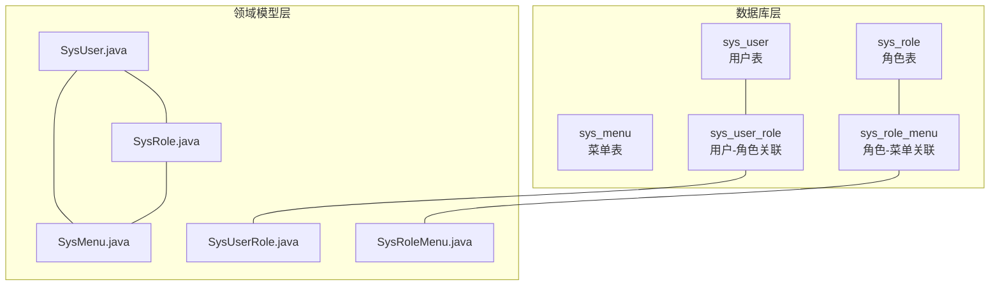
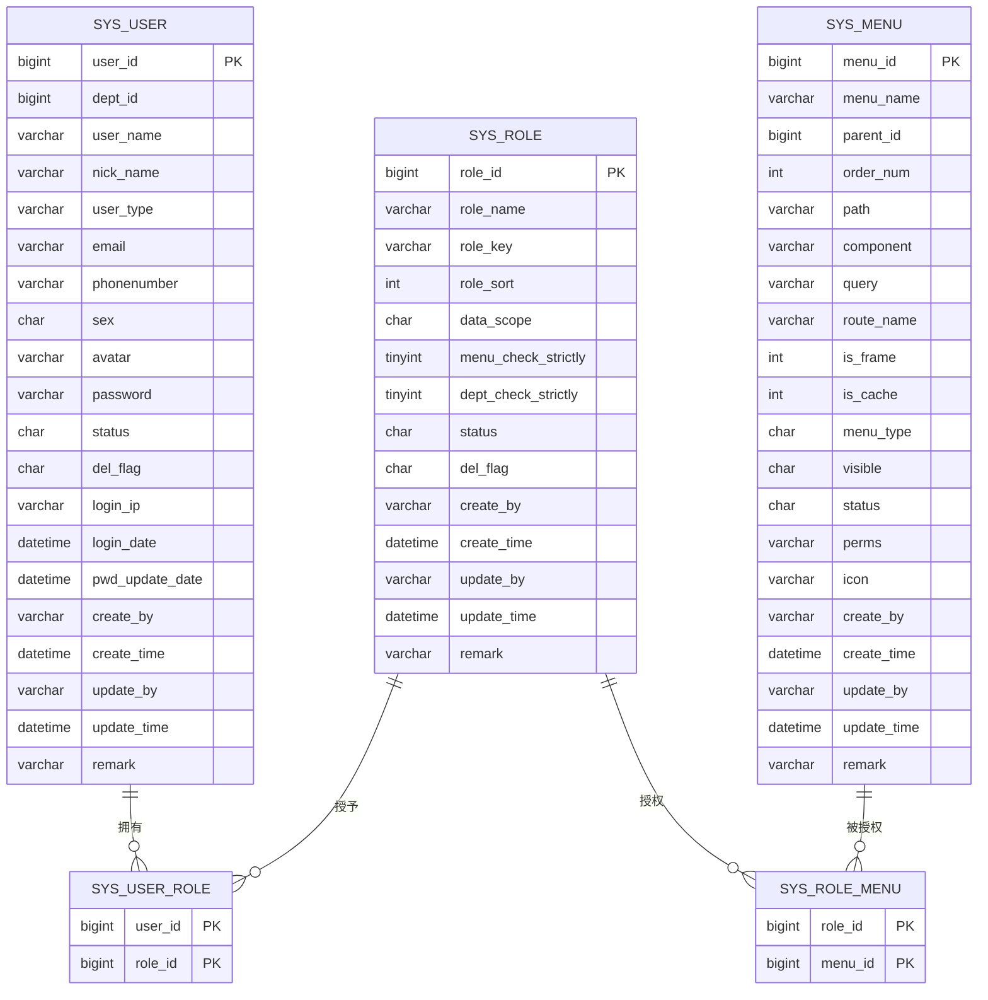
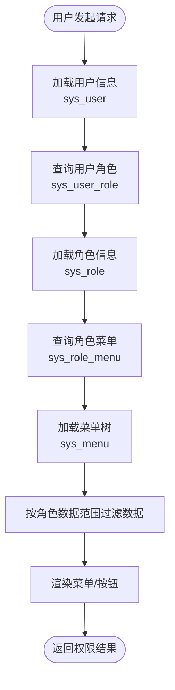
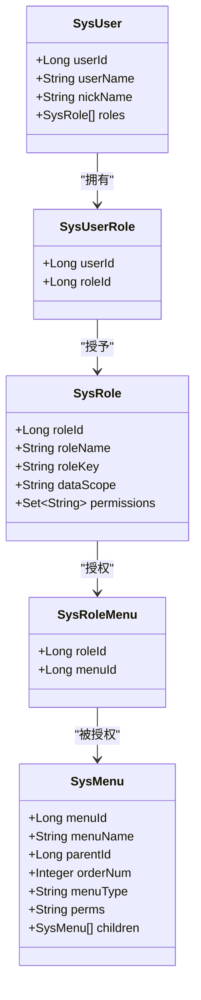
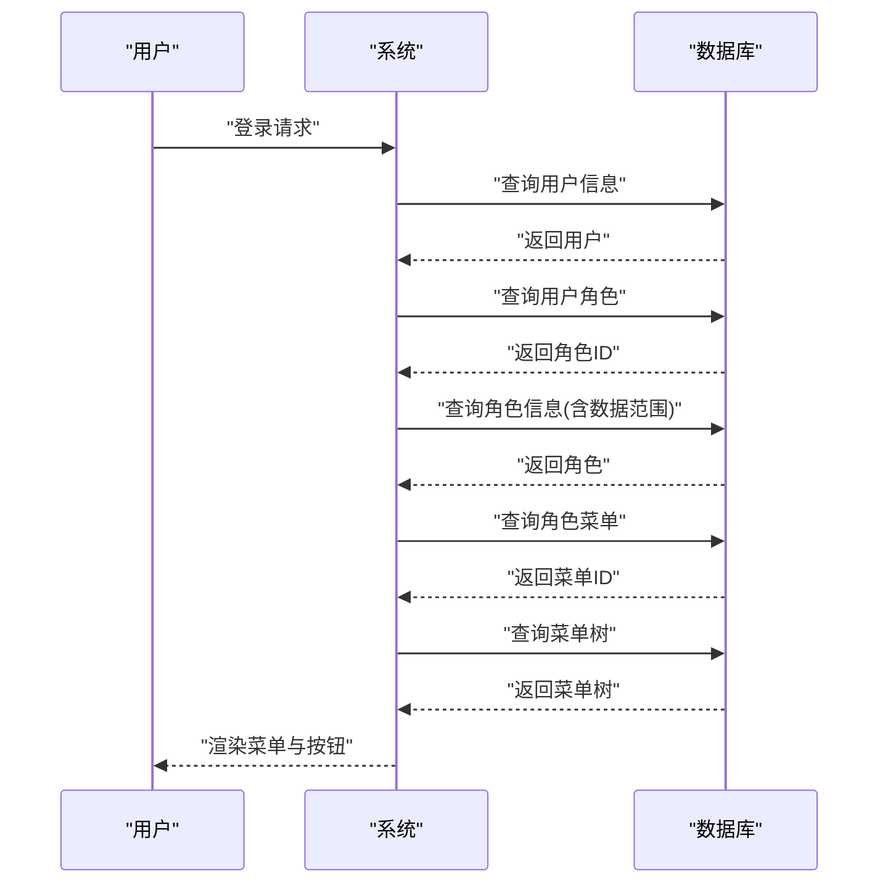

# 用户权限表结构

<cite>
**本文引用的文件**
- [ry_20260321.sql](file://XingChen-Vue/sql/ry_20260321.sql)
- [SysUser.java](file://XingChen-Vue/xingchen-common/src/main/java/com/xingchen/common/core/domain/entity/SysUser.java)
- [SysRole.java](file://XingChen-Vue/xingchen-common/src/main/java/com/xingchen/common/core/domain/entity/SysRole.java)
- [SysMenu.java](file://XingChen-Vue/xingchen-common/src/main/java/com/xingchen/common/core/domain/entity/SysMenu.java)
- [SysUserRole.java](file://XingChen-Vue/xingchen-system/src/main/java/com/xingchen/system/domain/SysUserRole.java)
- [SysRoleMenu.java](file://XingChen-Vue/xingchen-system/src/main/java/com/xingchen/system/domain/SysRoleMenu.java)
</cite>

## 目录
1. [引言](#引言)
2. [项目结构](#项目结构)
3. [核心组件](#核心组件)
4. [架构总览](#架构总览)
5. [详细组件分析](#详细组件分析)
6. [依赖分析](#依赖分析)
7. [性能考虑](#性能考虑)
8. [故障排查指南](#故障排查指南)
9. [结论](#结论)
10. [附录](#附录)

## 引言
本文件聚焦于健康管理系统中基于 RBAC 的用户权限表结构，系统性梳理用户表(sys_user)、角色表(sys_role)、菜单表(sys_menu)、用户角色关联表(sys_user_role)、角色菜单关联表(sys_role_menu)等核心权限表的字段定义、数据类型、约束条件与业务含义，并阐释多对多关联设计、权限继承机制、数据范围控制与菜单树结构实现。同时提供权限表关系图、字段说明表以及典型权限场景下的数据流向示例，帮助读者快速理解并应用该权限模型。

## 项目结构
围绕权限模型的核心文件分布如下：
- 数据库脚本：XingChen-Vue/sql/ry_20260321.sql
- 实体类：XingChen-Vue/xingchen-common/src/main/java/com/xingchen/common/core/domain/entity/Sys*.java
- 关联实体：XingChen-Vue/xingchen-system/src/main/java/com/xingchen/system/domain/SysUserRole.java、SysRoleMenu.java

图表来源
- [ry_20260321.sql:41-64](file://XingChen-Vue/sql/ry_20260321.sql#L41-L64)
- [ry_20260321.sql:104-121](file://XingChen-Vue/sql/ry_20260321.sql#L104-L121)
- [ry_20260321.sql:133-156](file://XingChen-Vue/sql/ry_20260321.sql#L133-L156)
- [ry_20260321.sql:267-272](file://XingChen-Vue/sql/ry_20260321.sql#L267-L272)
- [ry_20260321.sql:284-289](file://XingChen-Vue/sql/ry_20260321.sql#L284-L289)
- [SysUser.java:22-337](file://XingChen-Vue/xingchen-common/src/main/java/com/xingchen/common/core/domain/entity/SysUser.java#L22-L337)
- [SysRole.java:18-242](file://XingChen-Vue/xingchen-common/src/main/java/com/xingchen/common/core/domain/entity/SysRole.java#L18-L242)
- [SysMenu.java:17-275](file://XingChen-Vue/xingchen-common/src/main/java/com/xingchen/common/core/domain/entity/SysMenu.java#L17-L275)
- [SysUserRole.java:11-47](file://XingChen-Vue/xingchen-system/src/main/java/com/xingchen/system/domain/SysUserRole.java#L11-L47)
- [SysRoleMenu.java:11-47](file://XingChen-Vue/xingchen-system/src/main/java/com/xingchen/system/domain/SysRoleMenu.java#L11-L47)

章节来源
- [ry_20260321.sql:41-64](file://XingChen-Vue/sql/ry_20260321.sql#L41-L64)
- [SysUser.java:22-337](file://XingChen-Vue/xingchen-common/src/main/java/com/xingchen/common/core/domain/entity/SysUser.java#L22-L337)

## 核心组件
本节从数据库与领域模型两个维度，分别说明各权限表的结构要点与职责边界。

- 用户表(sys_user)
  - 职责：承载用户基本信息、账号状态、登录信息与基础审计字段。
  - 关键字段：用户ID、部门ID、用户账号、昵称、邮箱、手机号、性别、头像、密码、状态、删除标志、最后登录IP/时间、密码更新时间、创建/更新信息与备注。
  - 约束：主键为用户ID；状态与删除标志采用字符型枚举；密码字段用于鉴权。
  - 业务含义：作为系统身份主体，通过用户-角色关联表与角色建立多对多关系。

- 角色表(sys_role)
  - 职责：定义角色、权限字符串、显示顺序、数据范围策略与菜单/部门树严格联动策略。
  - 关键字段：角色ID、角色名称、角色权限字符串、显示顺序、数据范围、菜单树严格联动、部门树严格联动、状态、删除标志、创建/更新信息与备注。
  - 约束：主键为角色ID；数据范围字段用于控制数据可见性；菜单/部门严格联动影响树形选择行为。
  - 业务含义：作为权限聚合载体，通过角色-菜单关联表与菜单建立多对多关系，并通过数据范围控制数据访问边界。

- 菜单表(sys_menu)
  - 职责：描述前端菜单/按钮的层级结构、路由信息、渲染属性与权限标识。
  - 关键字段：菜单ID、菜单名称、父菜单ID、显示顺序、路由地址、组件路径、路由参数、路由名称、是否外链、是否缓存、菜单类型(M/C/F)、可见状态、状态、权限标识、图标、创建/更新信息与备注。
  - 约束：主键为菜单ID；菜单类型区分目录/菜单/按钮；权限标识用于细粒度权限校验。
  - 业务含义：作为权限最小可执行单元，支撑菜单树渲染与按钮级权限控制。

- 用户角色关联表(sys_user_role)
  - 职责：建立用户与角色的多对多关系。
  - 关键字段：用户ID、角色ID。
  - 约束：联合主键(用户ID, 角色ID)，确保唯一性。
  - 业务含义：用户具备的角色集合由此决定，从而间接获得对应菜单与数据范围权限。

- 角色菜单关联表(sys_role_menu)
  - 职责：建立角色与菜单的多对多关系。
  - 关键字段：角色ID、菜单ID。
  - 约束：联合主键(角色ID, 菜单ID)，确保唯一性。
  - 业务含义：角色具备的菜单集合由此决定，从而形成菜单树与按钮级权限矩阵。

章节来源
- [ry_20260321.sql:104-121](file://XingChen-Vue/sql/ry_20260321.sql#L104-L121)
- [ry_20260321.sql:133-156](file://XingChen-Vue/sql/ry_20260321.sql#L133-L156)
- [ry_20260321.sql:267-272](file://XingChen-Vue/sql/ry_20260321.sql#L267-L272)
- [ry_20260321.sql:284-289](file://XingChen-Vue/sql/ry_20260321.sql#L284-L289)

## 架构总览
RBAC 权限模型通过“用户-角色-菜单”三层映射实现权限控制，结合数据范围策略实现数据域隔离。下图展示权限表之间的关系与典型查询路径。

图表来源
- [ry_20260321.sql:41-64](file://XingChen-Vue/sql/ry_20260321.sql#L41-L64)
- [ry_20260321.sql:104-121](file://XingChen-Vue/sql/ry_20260321.sql#L104-L121)
- [ry_20260321.sql:133-156](file://XingChen-Vue/sql/ry_20260321.sql#L133-L156)
- [ry_20260321.sql:267-272](file://XingChen-Vue/sql/ry_20260321.sql#L267-L272)
- [ry_20260321.sql:284-289](file://XingChen-Vue/sql/ry_20260321.sql#L284-L289)

## 详细组件分析

### 用户表(sys_user)分析
- 字段与类型
  - 主键：bigint user_id
  - 外键：bigint dept_id（指向部门表）
  - 标识：varchar user_name、nick_name
  - 联系方式：varchar email、phonenumber
  - 基本信息：char sex、varchar avatar
  - 安全：varchar password
  - 状态：char status、char del_flag
  - 行为审计：varchar login_ip、datetime login_date、datetime pwd_update_date
  - 基础审计：varchar create_by、datetime create_time、varchar update_by、datetime update_time、varchar remark
- 约束与索引
  - 主键：user_id
  - 状态与删除标志采用字符型枚举，便于统一处理
- 业务含义
  - 用户登录、会话管理、角色分配与数据范围计算的基础数据源

章节来源
- [ry_20260321.sql:41-64](file://XingChen-Vue/sql/ry_20260321.sql#L41-L64)
- [SysUser.java:22-337](file://XingChen-Vue/xingchen-common/src/main/java/com/xingchen/common/core/domain/entity/SysUser.java#L22-L337)

### 角色表(sys_role)分析
- 字段与类型
  - 主键：bigint role_id
  - 标识：varchar role_name、role_key
  - 排序：int role_sort
  - 数据范围：char data_scope（1-5枚举值）
  - 树联动：tinyint menu_check_strictly、dept_check_strictly
  - 状态：char status、char del_flag
  - 基础审计：varchar create_by、datetime create_time、varchar update_by、datetime update_time、varchar remark
- 约束与索引
  - 主键：role_id
- 业务含义
  - 角色是权限聚合点，承担菜单授权与数据范围控制的双重职责

章节来源
- [ry_20260321.sql:104-121](file://XingChen-Vue/sql/ry_20260321.sql#L104-L121)
- [SysRole.java:18-242](file://XingChen-Vue/xingchen-common/src/main/java/com/xingchen/common/core/domain/entity/SysRole.java#L18-L242)

### 菜单表(sys_menu)分析
- 字段与类型
  - 主键：bigint menu_id
  - 结构：bigint parent_id、int order_num
  - 路由：varchar path、varchar component、varchar query、varchar route_name
  - 渲染：int is_frame、int is_cache、char menu_type、char visible、char status、varchar icon
  - 权限：varchar perms
  - 基础审计：varchar create_by、datetime create_time、varchar update_by、datetime update_time、varchar remark
- 约束与索引
  - 主键：menu_id
  - 菜单类型区分目录(M)、菜单(C)、按钮(F)，权限标识用于按钮级校验
- 业务含义
  - 菜单树结构与按钮级权限标识共同构成前端菜单渲染与按钮可见性的依据

章节来源
- [ry_20260321.sql:133-156](file://XingChen-Vue/sql/ry_20260321.sql#L133-L156)
- [SysMenu.java:17-275](file://XingChen-Vue/xingchen-common/src/main/java/com/xingchen/common/core/domain/entity/SysMenu.java#L17-L275)

### 用户-角色关联表(sys_user_role)分析
- 字段与类型
  - 用户ID：bigint user_id
  - 角色ID：bigint role_id
- 约束与索引
  - 联合主键：(user_id, role_id)
- 业务含义
  - 用户具备的角色集合，决定其可访问的菜单与数据范围

章节来源
- [ry_20260321.sql:267-272](file://XingChen-Vue/sql/ry_20260321.sql#L267-L272)
- [SysUserRole.java:11-47](file://XingChen-Vue/xingchen-system/src/main/java/com/xingchen/system/domain/SysUserRole.java#L11-L47)

### 角色-菜单关联表(sys_role_menu)分析
- 字段与类型
  - 角色ID：bigint role_id
  - 菜单ID：bigint menu_id
- 约束与索引
  - 联合主键：(role_id, menu_id)
- 业务含义
  - 角色具备的菜单集合，决定菜单树与按钮级权限矩阵

章节来源
- [ry_20260321.sql:284-289](file://XingChen-Vue/sql/ry_20260321.sql#L284-L289)
- [SysRoleMenu.java:11-47](file://XingChen-Vue/xingchen-system/src/main/java/com/xingchen/system/domain/SysRoleMenu.java#L11-L47)

### 权限继承与数据范围控制
- 权限继承
  - 用户通过用户-角色关联表继承多个角色的权限；角色通过角色-菜单关联表继承多个菜单的权限；最终形成用户可访问的菜单树与按钮集合。
- 数据范围控制
  - 角色表的 data_scope 字段定义数据可见范围（全部/自定义/本部门/本部门及以下/仅本人），用于在查询数据时进行过滤，确保用户只能看到授权范围内的数据。

图表来源
- [ry_20260321.sql:267-272](file://XingChen-Vue/sql/ry_20260321.sql#L267-L272)
- [ry_20260321.sql:284-289](file://XingChen-Vue/sql/ry_20260321.sql#L284-L289)
- [ry_20260321.sql:104-121](file://XingChen-Vue/sql/ry_20260321.sql#L104-L121)
- [ry_20260321.sql:133-156](file://XingChen-Vue/sql/ry_20260321.sql#L133-L156)

### 菜单树结构实现
- 层级关系
  - 菜单表通过 parent_id 形成树形结构；children 字段用于前端渲染。
- 渲染与过滤
  - 前端根据 menu_type 过滤目录(M)/菜单(C)/按钮(F)，并结合 visible/status 控制显示与状态。
- 权限标识
  - 按钮级权限通过 perms 字段进行校验，确保只有具备相应权限的用户才能看到或操作。

章节来源
- [ry_20260321.sql:133-156](file://XingChen-Vue/sql/ry_20260321.sql#L133-L156)
- [SysMenu.java:17-275](file://XingChen-Vue/xingchen-common/src/main/java/com/xingchen/common/core/domain/entity/SysMenu.java#L17-L275)

## 依赖分析
- 表间依赖
  - sys_user 与 sys_user_role：一对多（用户-角色）
  - sys_role 与 sys_user_role：一对多（角色-用户）
  - sys_role 与 sys_role_menu：一对多（角色-菜单）
  - sys_menu 与 sys_role_menu：一对多（菜单-角色）
- 领域模型依赖
  - SysUser 持有角色集合；SysRole 持有菜单集合与数据范围策略；SysMenu 支持子节点树结构。

图表来源
- [SysUser.java:22-337](file://XingChen-Vue/xingchen-common/src/main/java/com/xingchen/common/core/domain/entity/SysUser.java#L22-L337)
- [SysRole.java:18-242](file://XingChen-Vue/xingchen-common/src/main/java/com/xingchen/common/core/domain/entity/SysRole.java#L18-L242)
- [SysMenu.java:17-275](file://XingChen-Vue/xingchen-common/src/main/java/com/xingchen/common/core/domain/entity/SysMenu.java#L17-L275)
- [SysUserRole.java:11-47](file://XingChen-Vue/xingchen-system/src/main/java/com/xingchen/system/domain/SysUserRole.java#L11-L47)
- [SysRoleMenu.java:11-47](file://XingChen-Vue/xingchen-system/src/main/java/com/xingchen/system/domain/SysRoleMenu.java#L11-L47)

## 性能考虑
- 索引与查询
  - 菜单树查询建议基于 parent_id 与 order_num 建立索引，以优化树构建与排序。
  - 用户-角色与角色-菜单关联查询建议使用联合主键，避免额外索引开销。
- 缓存策略
  - 将用户-角色与角色-菜单映射缓存至内存，减少频繁数据库访问。
- 数据范围过滤
  - 在查询数据时优先利用角色数据范围策略进行服务端过滤，避免前端二次筛选带来的性能损耗。

## 故障排查指南
- 常见问题
  - 用户无法看到菜单：检查 sys_user_role 是否存在对应记录，以及 sys_role_menu 中是否授予该菜单。
  - 按钮不可见：确认按钮的 perms 是否在角色权限集合中，且角色已被授予对应菜单。
  - 数据越权：检查角色 data_scope 设置是否过宽或过窄，必要时调整为自定义/本部门等更精确范围。
- 排查步骤
  - 确认用户状态与删除标志正常
  - 核对角色状态与数据范围策略
  - 校验菜单类型与可见状态
  - 检查权限标识与菜单树结构

## 结论
本权限模型以 RBAC 为核心，通过用户-角色-菜单三层映射与数据范围策略，实现了灵活而可控的权限体系。用户-角色与角色-菜单的多对多关联提供了强大的权限组合能力；菜单树与按钮级权限标识保证了前端体验与安全控制的平衡；数据范围策略则有效防止了数据越权。结合合理的索引与缓存策略，可在保证安全性的同时提升系统性能。

## 附录

### 字段说明表
- 用户表(sys_user)
  - user_id：用户唯一标识
  - dept_id：所属部门
  - user_name：登录账号
  - nick_name：昵称
  - email/phonenumber/sex/avatar：联系方式与基本信息
  - password：加密密码
  - status/del_flag：账号状态与逻辑删除
  - login_ip/login_date/pwd_update_date：登录与密码更新审计
  - 其他：创建/更新信息与备注

- 角色表(sys_role)
  - role_id：角色唯一标识
  - role_name：角色名称
  - role_key：权限字符串
  - role_sort：显示顺序
  - data_scope：数据范围策略
  - menu_check_strictly/dept_check_strictly：树联动策略
  - status/del_flag：状态与逻辑删除
  - 其他：创建/更新信息与备注

- 菜单表(sys_menu)
  - menu_id：菜单唯一标识
  - menu_name：菜单名称
  - parent_id：父菜单
  - order_num：显示顺序
  - path/component/query/route_name：路由与组件信息
  - is_frame/is_cache：外链与缓存
  - menu_type：类型(M/C/F)
  - visible/status：可见与状态
  - perms：权限标识
  - icon：图标
  - 其他：创建/更新信息与备注

- 用户-角色关联(sys_user_role)
  - user_id、role_id：联合主键

- 角色-菜单关联(sys_role_menu)
  - role_id、menu_id：联合主键

章节来源
- [ry_20260321.sql:41-64](file://XingChen-Vue/sql/ry_20260321.sql#L41-L64)
- [ry_20260321.sql:104-121](file://XingChen-Vue/sql/ry_20260321.sql#L104-L121)
- [ry_20260321.sql:133-156](file://XingChen-Vue/sql/ry_20260321.sql#L133-L156)
- [ry_20260321.sql:267-272](file://XingChen-Vue/sql/ry_20260321.sql#L267-L272)
- [ry_20260321.sql:284-289](file://XingChen-Vue/sql/ry_20260321.sql#L284-L289)

### 典型权限场景数据流示例
- 场景一：普通用户登录后查看“用户管理”菜单
  - 步骤
    1) 用户登录成功，加载用户信息
    2) 查询用户角色：sys_user_role
    3) 加载角色信息：sys_role（含 data_scope）
    4) 查询角色菜单：sys_role_menu
    5) 加载菜单树：sys_menu（过滤 visible/status）
    6) 渲染菜单树与按钮（校验按钮 perms）
  - 输出：用户可访问的菜单树与按钮集合

- 场景二：用户访问某业务数据时进行数据范围过滤
  - 步骤
    1) 获取用户角色集合
    2) 读取角色 data_scope
    3) 服务端按策略过滤数据（如仅本人/本部门/本部门及以下）
  - 输出：符合数据范围策略的数据集

图表来源
- [ry_20260321.sql:267-272](file://XingChen-Vue/sql/ry_20260321.sql#L267-L272)
- [ry_20260321.sql:284-289](file://XingChen-Vue/sql/ry_20260321.sql#L284-L289)
- [ry_20260321.sql:104-121](file://XingChen-Vue/sql/ry_20260321.sql#L104-L121)
- [ry_20260321.sql:133-156](file://XingChen-Vue/sql/ry_20260321.sql#L133-L156)