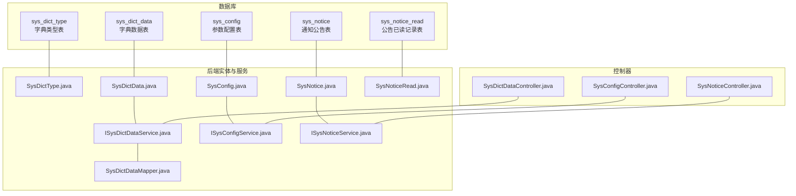
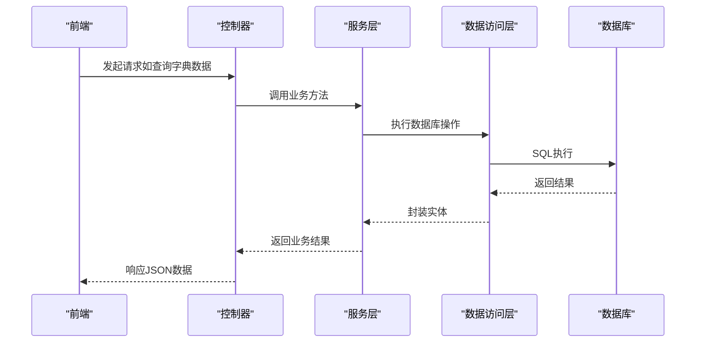
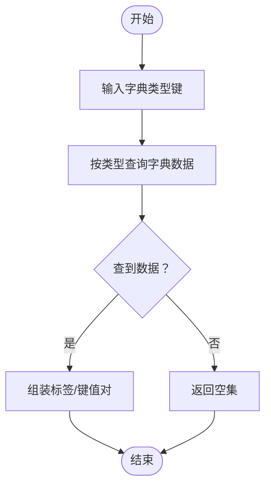
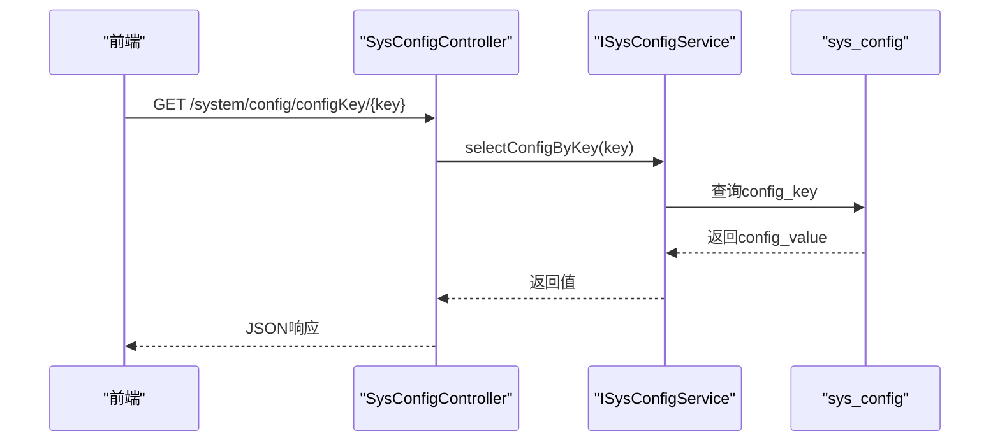
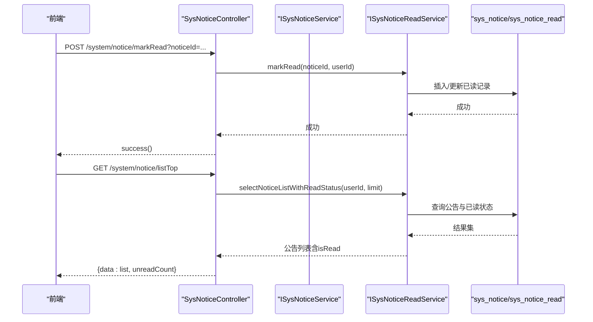
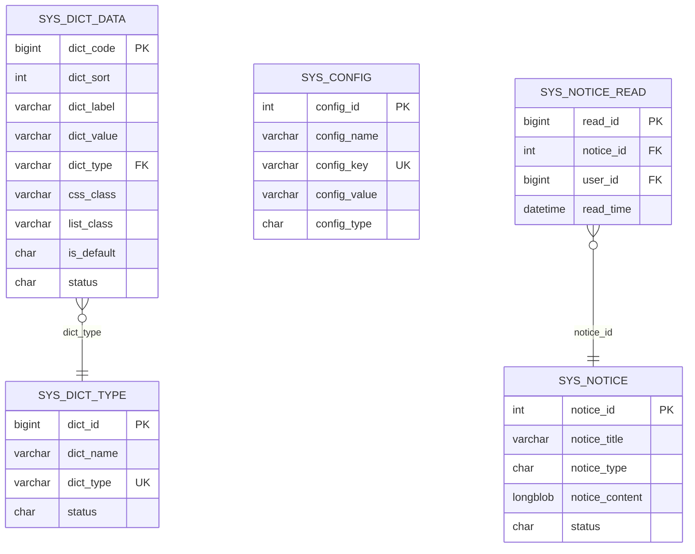

# 系统管理表结构

<cite>
**本文引用的文件**
- [ry_20260321.sql](file://XingChen-Vue/sql/ry_20260321.sql)
- [SysDictType.java](file://XingChen-Vue/xingchen-common/src/main/java/com/xingchen/common/core/domain/entity/SysDictType.java)
- [SysDictData.java](file://XingChen-Vue/xingchen-common/src/main/java/com/xingchen/common/core/domain/entity/SysDictData.java)
- [SysConfig.java](file://XingChen-Vue/xingchen-system/src/main/java/com/xingchen/system/domain/SysConfig.java)
- [SysNotice.java](file://XingChen-Vue/xingchen-system/src/main/java/com/xingchen/system/domain/SysNotice.java)
- [SysNoticeRead.java](file://XingChen-Vue/xingchen-system/src/main/java/com/xingchen/system/domain/SysNoticeRead.java)
- [SysDictDataMapper.java](file://XingChen-Vue/xingchen-system/src/main/java/com/xingchen/system/mapper/SysDictDataMapper.java)
- [ISysDictDataService.java](file://XingChen-Vue/xingchen-system/src/main/java/com/xingchen/system/service/ISysDictDataService.java)
- [ISysConfigService.java](file://XingChen-Vue/xingchen-system/src/main/java/com/xingchen/system/service/ISysConfigService.java)
- [ISysNoticeService.java](file://XingChen-Vue/xingchen-system/src/main/java/com/xingchen/system/service/ISysNoticeService.java)
- [SysDictDataController.java](file://XingChen-Vue/xingchen-admin/src/main/java/com/xingchen/web/controller/system/SysDictDataController.java)
- [SysConfigController.java](file://XingChen-Vue/xingchen-admin/src/main/java/com/xingchen/web/controller/system/SysConfigController.java)
- [SysNoticeController.java](file://XingChen-Vue/xingchen-admin/src/main/java/com/xingchen/web/controller/system/SysNoticeController.java)
</cite>

## 目录
1. [简介](#简介)
2. [项目结构](#项目结构)
3. [核心组件](#核心组件)
4. [架构总览](#架构总览)
5. [详细组件分析](#详细组件分析)
6. [依赖分析](#依赖分析)
7. [性能考虑](#性能考虑)
8. [故障排查指南](#故障排查指南)
9. [结论](#结论)
10. [附录](#附录)

## 简介
本文件聚焦于系统管理相关的核心表结构与业务实现，包括：
- 字典类型表（sys_dict_type）
- 字典数据表（sys_dict_data）
- 参数配置表（sys_config）
- 通知公告表（sys_notice）
- 公告已读记录表（sys_notice_read）

文档从字段定义、数据类型、约束条件与业务含义出发，解释字典的分类管理机制、参数配置的系统化管理、通知公告的发布与阅读追踪机制，并给出表关系图、字段说明表以及典型场景下的数据操作示例。

## 项目结构
系统管理相关表位于数据库初始化脚本中，对应的Java实体类与服务/控制器位于后端工程中，形成“表结构—实体类—服务接口—控制器”的完整映射。

图表来源
- [ry_20260321.sql:446-528](file://XingChen-Vue/sql/ry_20260321.sql#L446-L528)
- [SysDictType.java:12-97](file://XingChen-Vue/xingchen-common/src/main/java/com/xingchen/common/core/domain/entity/SysDictType.java#L12-L97)
- [SysDictData.java:12-177](file://XingChen-Vue/xingchen-common/src/main/java/com/xingchen/common/core/domain/entity/SysDictData.java#L12-L177)
- [SysConfig.java:11-112](file://XingChen-Vue/xingchen-system/src/main/java/com/xingchen/system/domain/SysConfig.java#L11-L112)
- [SysNotice.java:11-118](file://XingChen-Vue/xingchen-system/src/main/java/com/xingchen/system/domain/SysNotice.java#L11-L118)
- [SysNoticeRead.java:7-77](file://XingChen-Vue/xingchen-system/src/main/java/com/xingchen/system/domain/SysNoticeRead.java#L7-L77)
- [ISysDictDataService.java:6-61](file://XingChen-Vue/xingchen-system/src/main/java/com/xingchen/system/service/ISysDictDataService.java#L6-L61)
- [ISysConfigService.java:6-90](file://XingChen-Vue/xingchen-system/src/main/java/com/xingchen/system/service/ISysConfigService.java#L6-L90)
- [ISysNoticeService.java:6-61](file://XingChen-Vue/xingchen-system/src/main/java/com/xingchen/system/service/ISysNoticeService.java#L6-L61)
- [SysDictDataMapper.java:7-96](file://XingChen-Vue/xingchen-system/src/main/java/com/xingchen/system/mapper/SysDictDataMapper.java#L7-L96)
- [SysDictDataController.java:28-122](file://XingChen-Vue/xingchen-admin/src/main/java/com/xingchen/web/controller/system/SysDictDataController.java#L28-L122)
- [SysConfigController.java:25-134](file://XingChen-Vue/xingchen-admin/src/main/java/com/xingchen/web/controller/system/SysConfigController.java#L25-L134)
- [SysNoticeController.java:26-139](file://XingChen-Vue/xingchen-admin/src/main/java/com/xingchen/web/controller/system/SysNoticeController.java#L26-L139)

章节来源
- [ry_20260321.sql:446-661](file://XingChen-Vue/sql/ry_20260321.sql#L446-L661)

## 核心组件

### 字典类型表（sys_dict_type）
- 作用：定义字典分类，每个字典类型对应一组字典数据。
- 关键约束：唯一索引（dict_type），确保类型键唯一。
- 典型字段：dict_id、dict_name、dict_type、status、remark 等。
- 业务含义：用于对不同维度的数据进行分类管理，如性别、菜单状态、系统开关等。

章节来源
- [ry_20260321.sql:448-462](file://XingChen-Vue/sql/ry_20260321.sql#L448-L462)
- [SysDictType.java:17-97](file://XingChen-Vue/xingchen-common/src/main/java/com/xingchen/common/core/domain/entity/SysDictType.java#L17-L97)

### 字典数据表（sys_dict_data）
- 作用：承载具体字典项，与字典类型建立一对多关系。
- 关键约束：主键（dict_code），唯一性由类型+键值组合保证（业务层面）。
- 典型字段：dict_code、dict_sort、dict_label、dict_value、dict_type、is_default、status 等。
- 业务含义：用于前端展示与回显，支持默认项标记与状态控制。

章节来源
- [ry_20260321.sql:479-497](file://XingChen-Vue/sql/ry_20260321.sql#L479-L497)
- [SysDictData.java:17-177](file://XingChen-Vue/xingchen-common/src/main/java/com/xingchen/common/core/domain/entity/SysDictData.java#L17-L177)

### 参数配置表（sys_config）
- 作用：系统运行期可配置的参数，支持内置参数与业务参数。
- 关键约束：主键（config_id），config_key 唯一（业务层面）。
- 典型字段：config_id、config_name、config_key、config_value、config_type、remark 等。
- 业务含义：集中化管理配置项，支持缓存加载、刷新与校验唯一性。

章节来源
- [ry_20260321.sql:533-546](file://XingChen-Vue/sql/ry_20260321.sql#L533-L546)
- [SysConfig.java:16-112](file://XingChen-Vue/xingchen-system/src/main/java/com/xingchen/system/domain/SysConfig.java#L16-L112)

### 通知公告表（sys_notice）
- 作用：发布系统通知与公告，支持内容与状态管理。
- 关键约束：主键（notice_id），notice_type 区分通知/公告。
- 典型字段：notice_id、notice_title、notice_type、notice_content、status 等。
- 业务含义：统一发布渠道，配合已读记录表追踪阅读状态。

章节来源
- [ry_20260321.sql:626-639](file://XingChen-Vue/sql/ry_20260321.sql#L626-L639)
- [SysNotice.java:16-118](file://XingChen-Vue/xingchen-system/src/main/java/com/xingchen/system/domain/SysNotice.java#L16-L118)

### 公告已读记录表（sys_notice_read）
- 作用：记录用户对公告的阅读行为，避免重复统计。
- 关键约束：唯一索引（notice_id, user_id），确保同一用户对同一公告仅记录一次。
- 典型字段：read_id、notice_id、user_id、read_time。
- 业务含义：支撑首页顶部公告列表的“已读/未读”标记与未读计数。

章节来源
- [ry_20260321.sql:652-660](file://XingChen-Vue/sql/ry_20260321.sql#L652-L660)
- [SysNoticeRead.java:12-77](file://XingChen-Vue/xingchen-system/src/main/java/com/xingchen/system/domain/SysNoticeRead.java#L12-L77)

## 架构总览
系统管理相关表与后端组件的交互关系如下：

图表来源
- [SysDictDataController.java:35-122](file://XingChen-Vue/xingchen-admin/src/main/java/com/xingchen/web/controller/system/SysDictDataController.java#L35-L122)
- [ISysDictDataService.java:11-61](file://XingChen-Vue/xingchen-system/src/main/java/com/xingchen/system/service/ISysDictDataService.java#L11-L61)
- [SysDictDataMapper.java:12-96](file://XingChen-Vue/xingchen-system/src/main/java/com/xingchen/system/mapper/SysDictDataMapper.java#L12-L96)

## 详细组件分析

### 字典类型与字典数据的分类管理机制
- 分类管理：通过 sys_dict_type 定义类型键（dict_type），sys_dict_data 以 dict_type 关联到具体字典项。
- 默认项与排序：字典项支持 is_default 与 dict_sort，便于前端默认选择与排序展示。
- 业务流程：控制器接收请求，服务层调用数据访问层，按类型查询或按键值回显标签。

图表来源
- [SysDictDataMapper.java:23-37](file://XingChen-Vue/xingchen-system/src/main/java/com/xingchen/system/mapper/SysDictDataMapper.java#L23-L37)
- [SysDictDataController.java:74-84](file://XingChen-Vue/xingchen-admin/src/main/java/com/xingchen/web/controller/system/SysDictDataController.java#L74-L84)

章节来源
- [ry_20260321.sql:448-528](file://XingChen-Vue/sql/ry_20260321.sql#L448-L528)
- [SysDictType.java:17-97](file://XingChen-Vue/xingchen-common/src/main/java/com/xingchen/common/core/domain/entity/SysDictType.java#L17-L97)
- [SysDictData.java:17-177](file://XingChen-Vue/xingchen-common/src/main/java/com/xingchen/common/core/domain/entity/SysDictData.java#L17-L177)

### 参数配置的系统化管理
- 配置项管理：通过 sys_config 统一管理参数键名与键值，支持内置标记 config_type。
- 缓存与刷新：服务层提供加载、清空、重置缓存的方法，控制器提供刷新缓存接口。
- 唯一性校验：新增/修改前校验 config_key 唯一性，防止重复。

图表来源
- [SysConfigController.java:70-76](file://XingChen-Vue/xingchen-admin/src/main/java/com/xingchen/web/controller/system/SysConfigController.java#L70-L76)
- [ISysConfigService.java:21-27](file://XingChen-Vue/xingchen-system/src/main/java/com/xingchen/system/service/ISysConfigService.java#L21-L27)

章节来源
- [ry_20260321.sql:533-556](file://XingChen-Vue/sql/ry_20260321.sql#L533-L556)
- [SysConfig.java:16-112](file://XingChen-Vue/xingchen-system/src/main/java/com/xingchen/system/domain/SysConfig.java#L16-L112)
- [SysConfigController.java:25-134](file://XingChen-Vue/xingchen-admin/src/main/java/com/xingchen/web/controller/system/SysConfigController.java#L25-L134)

### 通知公告的发布与阅读追踪机制
- 发布与列表：公告支持新增、修改、删除与分页列表；首页顶部返回带“已读/未读”标记的公告集合。
- 已读追踪：用户阅读公告后，调用标记已读接口，写入 sys_notice_read 记录；未读计数基于集合过滤计算。
- 删除联动：删除公告时，同步清理其对应的已读记录，避免脏数据。

图表来源
- [SysNoticeController.java:88-125](file://XingChen-Vue/xingchen-admin/src/main/java/com/xingchen/web/controller/system/SysNoticeController.java#L88-L125)
- [ISysNoticeService.java:11-61](file://XingChen-Vue/xingchen-system/src/main/java/com/xingchen/system/service/ISysNoticeService.java#L11-L61)

章节来源
- [ry_20260321.sql:626-660](file://XingChen-Vue/sql/ry_20260321.sql#L626-L660)
- [SysNotice.java:16-118](file://XingChen-Vue/xingchen-system/src/main/java/com/xingchen/system/domain/SysNotice.java#L16-L118)
- [SysNoticeRead.java:12-77](file://XingChen-Vue/xingchen-system/src/main/java/com/xingchen/system/domain/SysNoticeRead.java#L12-L77)
- [SysNoticeController.java:26-139](file://XingChen-Vue/xingchen-admin/src/main/java/com/xingchen/web/controller/system/SysNoticeController.java#L26-L139)

## 依赖分析
- 表间依赖
  - sys_dict_data.dict_type → sys_dict_type.dict_type（类型键关联）
  - sys_notice_read.notice_id → sys_notice.notice_id（公告阅读关联）
  - sys_notice_read.user_id → 用户表（用户维度，不在本节展开）
- 实体与服务依赖
  - SysDictDataMapper → sys_dict_data
  - ISysDictDataService → SysDictDataMapper
  - SysDictDataController → ISysDictDataService
  - SysConfigController → ISysConfigService
  - SysNoticeController → ISysNoticeService 与 ISysNoticeReadService

图表来源
- [ry_20260321.sql:448-660](file://XingChen-Vue/sql/ry_20260321.sql#L448-L660)

章节来源
- [ry_20260321.sql:448-660](file://XingChen-Vue/sql/ry_20260321.sql#L448-L660)

## 性能考虑
- 字典数据查询
  - 建议在 sys_dict_data 上按 dict_type 建立索引，加速按类型查询与标签回显。
  - 对高频字典类型启用缓存，减少数据库访问。
- 参数配置
  - 配置项加载采用懒加载或按需加载，避免全量热加载造成启动开销。
  - 提供缓存刷新接口，支持动态变更生效。
- 公告已读
  - sys_notice_read 的唯一索引保证幂等写入，建议定期清理历史无效记录，保持索引高效。
  - 首页顶部列表限制数量（如5条），避免大集合扫描。

## 故障排查指南
- 字典类型键冲突
  - 现象：新增/修改字典类型时报唯一键冲突。
  - 处理：检查 dict_type 是否已存在，必要时调整类型键命名规则。
- 字典键值映射异常
  - 现象：前端显示标签与预期不符。
  - 处理：确认 sys_dict_data.dict_type 与 dict_value 正确，必要时通过服务层的标签查询接口验证。
- 参数键名重复
  - 现象：新增/修改参数时报键名重复。
  - 处理：调用唯一性校验接口，修改 config_key 或删除重复项。
- 公告已读未生效
  - 现象：标记已读后仍显示未读。
  - 处理：确认 sys_notice_read 的唯一键约束是否被触发，检查用户ID与公告ID是否正确传入。
- 删除公告后残留已读记录
  - 现象：删除公告后，已读记录未清理。
  - 处理：调用控制器的批量删除接口，确保联动清理已读记录。

章节来源
- [SysDictDataController.java:86-92](file://XingChen-Vue/xingchen-admin/src/main/java/com/xingchen/web/controller/system/SysDictDataController.java#L86-L92)
- [SysConfigController.java:86-107](file://XingChen-Vue/xingchen-admin/src/main/java/com/xingchen/web/controller/system/SysConfigController.java#L86-L107)
- [SysNoticeController.java:129-137](file://XingChen-Vue/xingchen-admin/src/main/java/com/xingchen/web/controller/system/SysNoticeController.java#L129-L137)

## 结论
系统管理表结构围绕“分类—数据—配置—发布—追踪”五条主线构建，具备清晰的职责边界与稳定的扩展能力。通过统一的实体与服务层抽象，实现了对字典、参数与公告的标准化管理；结合唯一索引与缓存策略，兼顾了可用性与性能。

## 附录

### 字典类型表（sys_dict_type）字段说明
- dict_id：字典主键（自增）
- dict_name：字典名称
- dict_type：字典类型（唯一）
- status：状态（0正常 1停用）
- remark：备注
- 创建/更新字段：create_by、create_time、update_by、update_time

章节来源
- [ry_20260321.sql:448-462](file://XingChen-Vue/sql/ry_20260321.sql#L448-L462)
- [SysDictType.java:17-97](file://XingChen-Vue/xingchen-common/src/main/java/com/xingchen/common/core/domain/entity/SysDictType.java#L17-L97)

### 字典数据表（sys_dict_data）字段说明
- dict_code：字典编码（自增）
- dict_sort：排序
- dict_label：标签
- dict_value：键值
- dict_type：字典类型
- css_class：样式属性
- list_class：表格回显样式
- is_default：是否默认（Y/N）
- status：状态（0正常 1停用）
- remark：备注
- 创建/更新字段：create_by、create_time、update_by、update_time

章节来源
- [ry_20260321.sql:479-497](file://XingChen-Vue/sql/ry_20260321.sql#L479-L497)
- [SysDictData.java:17-177](file://XingChen-Vue/xingchen-common/src/main/java/com/xingchen/common/core/domain/entity/SysDictData.java#L17-L177)

### 参数配置表（sys_config）字段说明
- config_id：参数主键（自增）
- config_name：参数名称
- config_key：参数键名（唯一）
- config_value：参数键值
- config_type：系统内置（Y/N）
- remark：备注
- 创建/更新字段：create_by、create_time、update_by、update_time

章节来源
- [ry_20260321.sql:533-546](file://XingChen-Vue/sql/ry_20260321.sql#L533-L546)
- [SysConfig.java:16-112](file://XingChen-Vue/xingchen-system/src/main/java/com/xingchen/system/domain/SysConfig.java#L16-L112)

### 通知公告表（sys_notice）字段说明
- notice_id：公告ID（自增）
- notice_title：公告标题
- notice_type：公告类型（1通知 2公告）
- notice_content：公告内容（长文本）
- status：状态（0正常 1关闭）
- remark：备注
- 创建/更新字段：create_by、create_time、update_by、update_time

章节来源
- [ry_20260321.sql:626-639](file://XingChen-Vue/sql/ry_20260321.sql#L626-L639)
- [SysNotice.java:16-118](file://XingChen-Vue/xingchen-system/src/main/java/com/xingchen/system/domain/SysNotice.java#L16-L118)

### 公告已读记录表（sys_notice_read）字段说明
- read_id：已读主键（自增）
- notice_id：公告ID
- user_id：用户ID
- read_time：阅读时间
- 约束：uk_user_notice（联合唯一）

章节来源
- [ry_20260321.sql:652-660](file://XingChen-Vue/sql/ry_20260321.sql#L652-L660)
- [SysNoticeRead.java:12-77](file://XingChen-Vue/xingchen-system/src/main/java/com/xingchen/system/domain/SysNoticeRead.java#L12-L77)

### 典型系统管理场景下的数据操作示例

- 场景一：按字典类型查询字典数据
  - 控制器路径：GET /system/dict/data/type/{dictType}
  - 服务调用：ISysDictDataService.selectDictDataList(...)
  - 数据访问：SysDictDataMapper.selectDictDataByType(...)
  - 章节来源
    - [SysDictDataController.java:74-84](file://XingChen-Vue/xingchen-admin/src/main/java/com/xingchen/web/controller/system/SysDictDataController.java#L74-L84)
    - [SysDictDataMapper.java:23-28](file://XingChen-Vue/xingchen-system/src/main/java/com/xingchen/system/mapper/SysDictDataMapper.java#L23-L28)

- 场景二：根据参数键名获取参数值
  - 控制器路径：GET /system/config/configKey/{configKey}
  - 服务调用：ISysConfigService.selectConfigByKey(...)
  - 章节来源
    - [SysConfigController.java:70-76](file://XingChen-Vue/xingchen-admin/src/main/java/com/xingchen/web/controller/system/SysConfigController.java#L70-L76)
    - [ISysConfigService.java:21-27](file://XingChen-Vue/xingchen-system/src/main/java/com/xingchen/system/service/ISysConfigService.java#L21-L27)

- 场景三：首页顶部公告列表与未读计数
  - 控制器路径：GET /system/notice/listTop
  - 服务调用：ISysNoticeReadService.selectNoticeListWithReadStatus(userId, limit)
  - 章节来源
    - [SysNoticeController.java:88-100](file://XingChen-Vue/xingchen-admin/src/main/java/com/xingchen/web/controller/system/SysNoticeController.java#L88-L100)

- 场景四：标记公告已读
  - 控制器路径：POST /system/notice/markRead
  - 服务调用：ISysNoticeReadService.markRead(noticeId, userId)
  - 章节来源
    - [SysNoticeController.java:103-112](file://XingChen-Vue/xingchen-admin/src/main/java/com/xingchen/web/controller/system/SysNoticeController.java#L103-L112)

- 场景五：批量标记已读
  - 控制器路径：POST /system/notice/markReadAll
  - 服务调用：ISysNoticeReadService.markReadBatch(userId, noticeIds)
  - 章节来源
    - [SysNoticeController.java:115-125](file://XingChen-Vue/xingchen-admin/src/main/java/com/xingchen/web/controller/system/SysNoticeController.java#L115-L125)

- 场景六：删除公告并清理已读记录
  - 控制器路径：DELETE /system/notice/{noticeIds}
  - 服务调用：ISysNoticeReadService.deleteByNoticeIds(noticeIds) 与 ISysNoticeService.deleteNoticeByIds(...)
  - 章节来源
    - [SysNoticeController.java:127-137](file://XingChen-Vue/xingchen-admin/src/main/java/com/xingchen/web/controller/system/SysNoticeController.java#L127-L137)