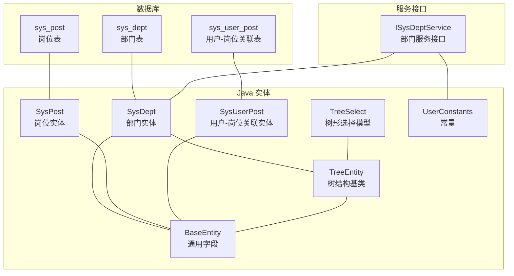
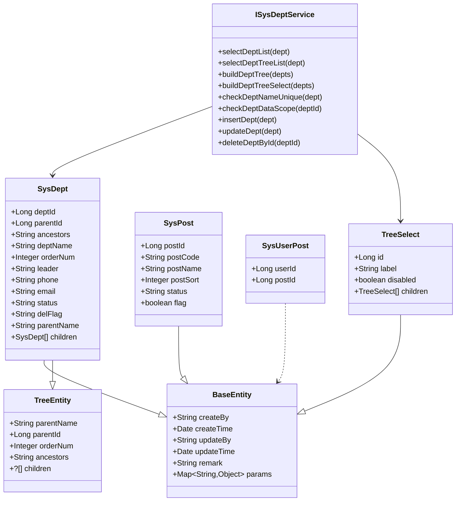
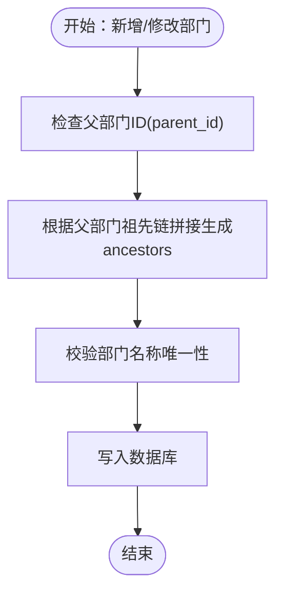
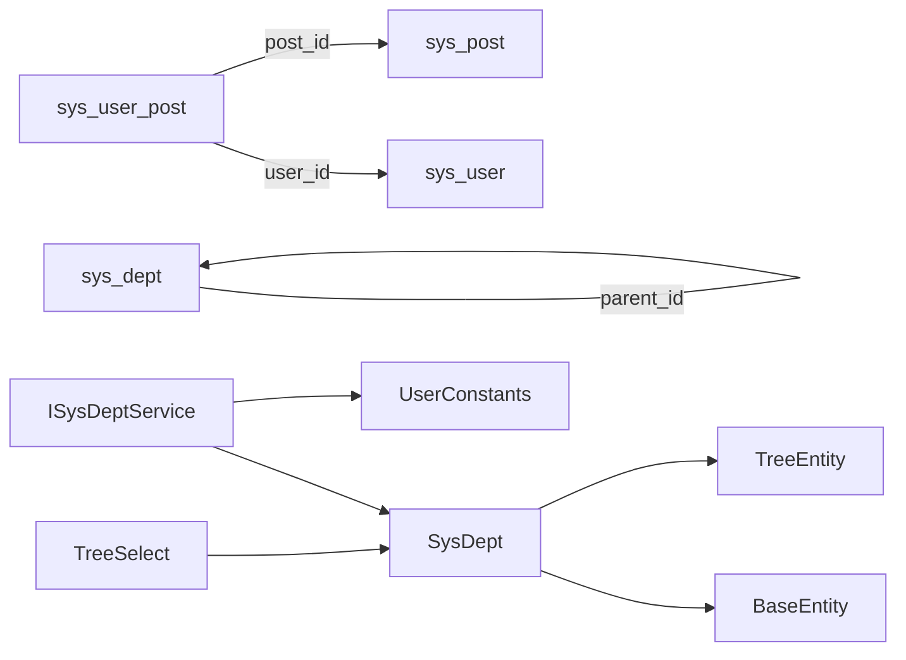

# 组织架构表结构

<cite>
**本文引用的文件**
- [ry_20260321.sql](file://XingChen-Vue/sql/ry_20260321.sql)
- [SysDept.java](file://xingchen-common/src/main/java/com/xingchen/common/core/domain/entity/SysDept.java)
- [SysPost.java](file://xingchen-system/src/main/java/com/xingchen/system/domain/SysPost.java)
- [SysUserPost.java](file://xingchen-system/src/main/java/com/xingchen/system/domain/SysUserPost.java)
- [BaseEntity.java](file://xingchen-common/src/main/java/com/xingchen/common/core/domain/BaseEntity.java)
- [TreeEntity.java](file://xingchen-common/src/main/java/com/xingchen/common/core/domain/TreeEntity.java)
- [TreeSelect.java](file://xingchen-common/src/main/java/com/xingchen/common/core/domain/TreeSelect.java)
- [UserConstants.java](file://xingchen-common/src/main/java/com/xingchen/common/constant/UserConstants.java)
- [ISysDeptService.java](file://xingchen-system/src/main/java/com/xingchen/system/service/ISysDeptService.java)
</cite>

## 目录
1. [简介](#简介)
2. [项目结构](#项目结构)
3. [核心组件](#核心组件)
4. [架构总览](#架构总览)
5. [详细组件分析](#详细组件分析)
6. [依赖分析](#依赖分析)
7. [性能考虑](#性能考虑)
8. [故障排查指南](#故障排查指南)
9. [结论](#结论)
10. [附录](#附录)

## 简介
本文件聚焦于组织架构相关的核心表结构与实现，包括部门表(sys_dept)、岗位表(sys_post)、用户与岗位关联表(sys_user_post)，并结合后端实体类与服务接口，系统性阐述：
- 表字段定义、数据类型、约束与业务含义
- 部门树形结构设计与祖先关系存储机制
- 岗位与用户的多对多关联关系
- 数据权限与角色-部门关联的配合使用
- 典型组织管理场景下的数据操作流程与注意事项

## 项目结构
围绕组织架构的数据库对象主要分布在以下位置：
- SQL初始化脚本：XingChen-Vue/sql/ry_20260321.sql
- 实体类：xingchen-common/src/main/java/com/xingchen/common/core/domain/entity/SysDept.java
- 岗位实体：xingchen-system/src/main/java/com/xingchen/system/domain/SysPost.java
- 用户-岗位关联实体：xingchen-system/src/main/java/com/xingchen/system/domain/SysUserPost.java
- 基类与树结构基类：BaseEntity.java、TreeEntity.java
- 树形选择模型：TreeSelect.java
- 常量定义：UserConstants.java
- 部门服务接口：ISysDeptService.java

图表来源
- [ry_20260321.sql](file://XingChen-Vue/sql/ry_20260321.sql)
- [SysDept.java](file://xingchen-common/src/main/java/com/xingchen/common/core/domain/entity/SysDept.java)
- [SysPost.java](file://xingchen-system/src/main/java/com/xingchen/system/domain/SysPost.java)
- [SysUserPost.java](file://xingchen-system/src/main/java/com/xingchen/system/domain/SysUserPost.java)
- [BaseEntity.java](file://xingchen-common/src/main/java/com/xingchen/common/core/domain/BaseEntity.java)
- [TreeEntity.java](file://xingchen-common/src/main/java/com/xingchen/common/core/domain/TreeEntity.java)
- [TreeSelect.java](file://xingchen-common/src/main/java/com/xingchen/common/core/domain/TreeSelect.java)
- [UserConstants.java](file://xingchen-common/src/main/java/com/xingchen/common/constant/UserConstants.java)
- [ISysDeptService.java](file://xingchen-system/src/main/java/com/xingchen/system/service/ISysDeptService.java)

章节来源
- [ry_20260321.sql](file://XingChen-Vue/sql/ry_20260321.sql)
- [SysDept.java](file://xingchen-common/src/main/java/com/xingchen/common/core/domain/entity/SysDept.java)
- [SysPost.java](file://xingchen-system/src/main/java/com/xingchen/system/domain/SysPost.java)
- [SysUserPost.java](file://xingchen-system/src/main/java/com/xingchen/system/domain/SysUserPost.java)
- [BaseEntity.java](file://xingchen-common/src/main/java/com/xingchen/common/core/domain/BaseEntity.java)
- [TreeEntity.java](file://xingchen-common/src/main/java/com/xingchen/common/core/domain/TreeEntity.java)
- [TreeSelect.java](file://xingchen-common/src/main/java/com/xingchen/common/core/domain/TreeSelect.java)
- [UserConstants.java](file://xingchen-common/src/main/java/com/xingchen/common/constant/UserConstants.java)
- [ISysDeptService.java](file://xingchen-system/src/main/java/com/xingchen/system/service/ISysDeptService.java)

## 核心组件
本节从数据库表到Java实体映射，逐表梳理字段、约束与业务含义，并说明其在树形结构与权限体系中的作用。

- 部门表(sys_dept)
  - 主键：dept_id
  - 关键字段：parent_id、ancestors、dept_name、order_num、leader、phone、email、status、del_flag
  - 约束：非空校验、状态枚举、删除标志
  - 业务含义：用于构建组织树，支持父子关系与祖先链路，支撑数据权限范围计算
  - 参考路径：[ry_20260321.sql](file://XingChen-Vue/sql/ry_20260321.sql)，[SysDept.java](file://xingchen-common/src/main/java/com/xingchen/common/core/domain/entity/SysDept.java)

- 岗位表(sys_post)
  - 主键：post_id
  - 关键字段：post_code、post_name、post_sort、status
  - 约束：非空校验、状态枚举
  - 业务含义：定义可分配给用户的岗位集合，支持排序与启用/停用
  - 参考路径：[ry_20260321.sql](file://XingChen-Vue/sql/ry_20260321.sql)，[SysPost.java](file://xingchen-system/src/main/java/com/xingchen/system/domain/SysPost.java)

- 用户与岗位关联表(sys_user_post)
  - 复合主键：(user_id, post_id)
  - 业务含义：实现用户与岗位的多对多关系，支持一个用户拥有多个岗位
  - 参考路径：[ry_20260321.sql](file://XingChen-Vue/sql/ry_20260321.sql)，[SysUserPost.java](file://xingchen-system/src/main/java/com/xingchen/system/domain/SysUserPost.java)

- 通用基类(BaseEntity)
  - 字段：createBy、createTime、updateBy、updateTime、remark、params
  - 作用：统一记录创建与更新信息，便于审计与扩展
  - 参考路径：[BaseEntity.java](file://xingchen-common/src/main/java/com/xingchen/common/core/domain/BaseEntity.java)

- 树结构基类(TreeEntity)
  - 字段：parentName、parentId、orderNum、ancestors、children
  - 作用：为树形展示与层级构建提供统一结构
  - 参考路径：[TreeEntity.java](file://xingchen-common/src/main/java/com/xingchen/common/core/domain/TreeEntity.java)

- 树形选择模型(TreeSelect)
  - 字段：id、label、disabled、children
  - 作用：将树形数据转换为前端下拉树所需的数据结构，支持禁用态
  - 参考路径：[TreeSelect.java](file://xingchen-common/src/main/java/com/xingchen/common/core/domain/TreeSelect.java)

- 常量(UserConstants)
  - 定义：NORMAL、DEPT_NORMAL、DEPT_DISABLE 等
  - 作用：统一状态枚举，便于业务判断与权限控制
  - 参考路径：[UserConstants.java](file://xingchen-common/src/main/java/com/xingchen/common/constant/UserConstants.java)

- 部门服务接口(ISysDeptService)
  - 能力：查询部门列表、构建部门树、构建下拉树、校验唯一性、数据权限校验、增删改等
  - 作用：封装组织树构建与权限边界判定的业务逻辑
  - 参考路径：[ISysDeptService.java](file://xingchen-system/src/main/java/com/xingchen/system/service/ISysDeptService.java)

章节来源
- [ry_20260321.sql](file://XingChen-Vue/sql/ry_20260321.sql)
- [SysDept.java](file://xingchen-common/src/main/java/com/xingchen/common/core/domain/entity/SysDept.java)
- [SysPost.java](file://xingchen-system/src/main/java/com/xingchen/system/domain/SysPost.java)
- [SysUserPost.java](file://xingchen-system/src/main/java/com/xingchen/system/domain/SysUserPost.java)
- [BaseEntity.java](file://xingchen-common/src/main/java/com/xingchen/common/core/domain/BaseEntity.java)
- [TreeEntity.java](file://xingchen-common/src/main/java/com/xingchen/common/core/domain/TreeEntity.java)
- [TreeSelect.java](file://xingchen-common/src/main/java/com/xingchen/common/core/domain/TreeSelect.java)
- [UserConstants.java](file://xingchen-common/src/main/java/com/xingchen/common/constant/UserConstants.java)
- [ISysDeptService.java](file://xingchen-system/src/main/java/com/xingchen/system/service/ISysDeptService.java)

## 架构总览
组织架构的实现由“数据库表 + 实体类 + 服务接口 + 树形模型”共同构成，形成从数据到表现的完整闭环。

图表来源
- [SysDept.java](file://xingchen-common/src/main/java/com/xingchen/common/core/domain/entity/SysDept.java)
- [SysPost.java](file://xingchen-system/src/main/java/com/xingchen/system/domain/SysPost.java)
- [SysUserPost.java](file://xingchen-system/src/main/java/com/xingchen/system/domain/SysUserPost.java)
- [BaseEntity.java](file://xingchen-common/src/main/java/com/xingchen/common/core/domain/BaseEntity.java)
- [TreeEntity.java](file://xingchen-common/src/main/java/com/xingchen/common/core/domain/TreeEntity.java)
- [TreeSelect.java](file://xingchen-common/src/main/java/com/xingchen/common/core/domain/TreeSelect.java)
- [ISysDeptService.java](file://xingchen-system/src/main/java/com/xingchen/system/service/ISysDeptService.java)

## 详细组件分析

### 部门表(sys_dept)分析
- 字段与约束
  - 主键：dept_id（自增）
  - 父节点：parent_id（默认0表示根）
  - 祖先链：ancestors（逗号分隔的祖先ID序列，如“0,100,101”）
  - 名称与排序：dept_name、order_num
  - 负责人与联系方式：leader、phone、email
  - 状态与删除标志：status（0正常/1停用）、del_flag（0存在/2删除）
  - 通用字段：create_by、create_time、update_by、update_time
- 业务含义
  - 通过parent_id与ancestors实现树形结构与层级查询
  - ancestors便于快速判断包含关系与数据权限范围
  - status与del_flag支持软删除与停用控制
- 树形结构与父子关系
  - 父子关系由parent_id维护；祖先链由ancestors维护
  - 服务层提供构建树、下拉树、校验唯一性、数据权限校验等能力
- 参考路径
  - [ry_20260321.sql](file://XingChen-Vue/sql/ry_20260321.sql)
  - [SysDept.java](file://xingchen-common/src/main/java/com/xingchen/common/core/domain/entity/SysDept.java)
  - [ISysDeptService.java](file://xingchen-system/src/main/java/com/xingchen/system/service/ISysDeptService.java)
  - [TreeSelect.java](file://xingchen-common/src/main/java/com/xingchen/common/core/domain/TreeSelect.java)
  - [UserConstants.java](file://xingchen-common/src/main/java/com/xingchen/common/constant/UserConstants.java)

图表来源
- [ry_20260321.sql](file://XingChen-Vue/sql/ry_20260321.sql)
- [SysDept.java](file://xingchen-common/src/main/java/com/xingchen/common/core/domain/entity/SysDept.java)
- [ISysDeptService.java](file://xingchen-system/src/main/java/com/xingchen/system/service/ISysDeptService.java)

章节来源
- [ry_20260321.sql](file://XingChen-Vue/sql/ry_20260321.sql)
- [SysDept.java](file://xingchen-common/src/main/java/com/xingchen/common/core/domain/entity/SysDept.java)
- [ISysDeptService.java](file://xingchen-system/src/main/java/com/xingchen/system/service/ISysDeptService.java)
- [TreeSelect.java](file://xingchen-common/src/main/java/com/xingchen/common/core/domain/TreeSelect.java)
- [UserConstants.java](file://xingchen-common/src/main/java/com/xingchen/common/constant/UserConstants.java)

### 岗位表(sys_post)分析
- 字段与约束
  - 主键：post_id（自增）
  - 编码与名称：post_code、post_name
  - 排序：post_sort
  - 状态：status（0正常/1停用）
  - 通用字段：create_by、create_time、update_by、update_time、remark
- 业务含义
  - 定义岗位集合，支持排序与启用/停用
  - 作为用户可拥有的角色之一，参与权限计算
- 参考路径
  - [ry_20260321.sql](file://XingChen-Vue/sql/ry_20260321.sql)
  - [SysPost.java](file://xingchen-system/src/main/java/com/xingchen/system/domain/SysPost.java)

章节来源
- [ry_20260321.sql](file://XingChen-Vue/sql/ry_20260321.sql)
- [SysPost.java](file://xingchen-system/src/main/java/com/xingchen/system/domain/SysPost.java)

### 用户与岗位关联表(sys_user_post)分析
- 字段与约束
  - 复合主键：(user_id, post_id)
  - 业务含义：用户与岗位的多对多关系
- 业务含义
  - 支持一个用户拥有多个岗位，便于灵活授权
- 参考路径
  - [ry_20260321.sql](file://XingChen-Vue/sql/ry_20260321.sql)
  - [SysUserPost.java](file://xingchen-system/src/main/java/com/xingchen/system/domain/SysUserPost.java)

章节来源
- [ry_20260321.sql](file://XingChen-Vue/sql/ry_20260321.sql)
- [SysUserPost.java](file://xingchen-system/src/main/java/com/xingchen/system/domain/SysUserPost.java)

### 树形结构与数据权限
- 树形结构
  - 通过TreeEntity提供parentName、parentId、orderNum、ancestors、children
  - 通过TreeSelect将树形数据转换为前端下拉树结构
- 数据权限
  - 部门状态常量：NORMAL、DEPT_NORMAL、DEPT_DISABLE
  - 服务接口提供数据权限校验方法，确保操作边界
- 参考路径
  - [TreeEntity.java](file://xingchen-common/src/main/java/com/xingchen/common/core/domain/TreeEntity.java)
  - [TreeSelect.java](file://xingchen-common/src/main/java/com/xingchen/common/core/domain/TreeSelect.java)
  - [UserConstants.java](file://xingchen-common/src/main/java/com/xingchen/common/constant/UserConstants.java)
  - [ISysDeptService.java](file://xingchen-system/src/main/java/com/xingchen/system/service/ISysDeptService.java)

章节来源
- [TreeEntity.java](file://xingchen-common/src/main/java/com/xingchen/common/core/domain/TreeEntity.java)
- [TreeSelect.java](file://xingchen-common/src/main/java/com/xingchen/common/core/domain/TreeSelect.java)
- [UserConstants.java](file://xingchen-common/src/main/java/com/xingchen/common/constant/UserConstants.java)
- [ISysDeptService.java](file://xingchen-system/src/main/java/com/xingchen/system/service/ISysDeptService.java)

## 依赖分析
- 表间依赖
  - sys_dept：自关联（parent_id → dept_id）
  - sys_user_post：多对多（user_id → sys_user，post_id → sys_post）
- 类间依赖
  - SysDept继承BaseEntity与TreeEntity，具备通用字段与树形结构能力
  - TreeSelect基于SysDept构建树形选择模型
  - ISysDeptService依赖SysDept与TreeSelect进行树构建与权限校验
- 常量依赖
  - UserConstants提供状态枚举，被TreeSelect与服务层广泛使用

图表来源
- [ry_20260321.sql](file://XingChen-Vue/sql/ry_20260321.sql)
- [SysDept.java](file://xingchen-common/src/main/java/com/xingchen/common/core/domain/entity/SysDept.java)
- [TreeEntity.java](file://xingchen-common/src/main/java/com/xingchen/common/core/domain/TreeEntity.java)
- [TreeSelect.java](file://xingchen-common/src/main/java/com/xingchen/common/core/domain/TreeSelect.java)
- [UserConstants.java](file://xingchen-common/src/main/java/com/xingchen/common/constant/UserConstants.java)
- [ISysDeptService.java](file://xingchen-system/src/main/java/com/xingchen/system/service/ISysDeptService.java)

章节来源
- [ry_20260321.sql](file://XingChen-Vue/sql/ry_20260321.sql)
- [SysDept.java](file://xingchen-common/src/main/java/com/xingchen/common/core/domain/entity/SysDept.java)
- [TreeEntity.java](file://xingchen-common/src/main/java/com/xingchen/common/core/domain/TreeEntity.java)
- [TreeSelect.java](file://xingchen-common/src/main/java/com/xingchen/common/core/domain/TreeSelect.java)
- [UserConstants.java](file://xingchen-common/src/main/java/com/xingchen/common/constant/UserConstants.java)
- [ISysDeptService.java](file://xingchen-system/src/main/java/com/xingchen/system/service/ISysDeptService.java)

## 性能考虑
- 祖先链存储
  - ancestors字段便于快速判断包含关系，但需在新增/修改时同步维护，避免冗余或不一致
- 索引建议
  - 建议在parent_id上建立索引，加速树构建与层级查询
  - 对status与del_flag建立索引，优化筛选与权限判断
- 批量操作
  - 排序与批量更新时，优先使用数组参数，减少多次往返
- 序列化
  - TreeSelect在序列化时忽略空子节点，有助于减小传输体积

## 故障排查指南
- 部门树异常
  - 检查ancestors与parent_id是否一致，确保父子关系与祖先链同步更新
  - 使用服务接口的树构建方法验证结果
- 权限越权
  - 确认UserConstants中的状态常量与实际数据一致
  - 使用checkDeptDataScope进行权限边界校验
- 唯一性冲突
  - 使用checkDeptNameUnique进行名称唯一性校验
- 常见问题定位
  - 日志与异常：关注服务层抛出的业务异常与校验失败信息
  - 参考路径：[ISysDeptService.java](file://xingchen-system/src/main/java/com/xingchen/system/service/ISysDeptService.java)

章节来源
- [ISysDeptService.java](file://xingchen-system/src/main/java/com/xingchen/system/service/ISysDeptService.java)
- [UserConstants.java](file://xingchen-common/src/main/java/com/xingchen/common/constant/UserConstants.java)

## 结论
该组织架构方案通过“祖先链+父子关系”的双轨设计，既保证了树形结构的灵活性，又便于权限范围的快速计算。岗位与用户的多对多关联进一步提升了权限模型的弹性。结合服务层的树构建与权限校验能力，能够高效支撑常见的组织管理场景。

## 附录

### 字段说明表
- 部门表(sys_dept)
  - dept_id：部门ID（主键）
  - parent_id：父部门ID（默认0）
  - ancestors：祖先ID序列（逗号分隔）
  - dept_name：部门名称
  - order_num：显示顺序
  - leader：负责人
  - phone：联系电话
  - email：邮箱
  - status：状态（0正常/1停用）
  - del_flag：删除标志（0存在/2删除）
  - 通用字段：create_by、create_time、update_by、update_time

- 岗位表(sys_post)
  - post_id：岗位ID（主键）
  - post_code：岗位编码
  - post_name：岗位名称
  - post_sort：显示顺序
  - status：状态（0正常/1停用）
  - 通用字段：create_by、create_time、update_by、update_time、remark

- 用户与岗位关联表(sys_user_post)
  - user_id：用户ID
  - post_id：岗位ID

章节来源
- [ry_20260321.sql](file://XingChen-Vue/sql/ry_20260321.sql)
- [SysDept.java](file://xingchen-common/src/main/java/com/xingchen/common/core/domain/entity/SysDept.java)
- [SysPost.java](file://xingchen-system/src/main/java/com/xingchen/system/domain/SysPost.java)
- [SysUserPost.java](file://xingchen-system/src/main/java/com/xingchen/system/domain/SysUserPost.java)