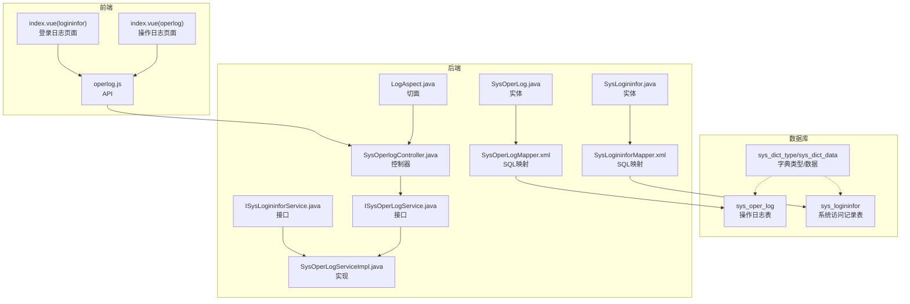
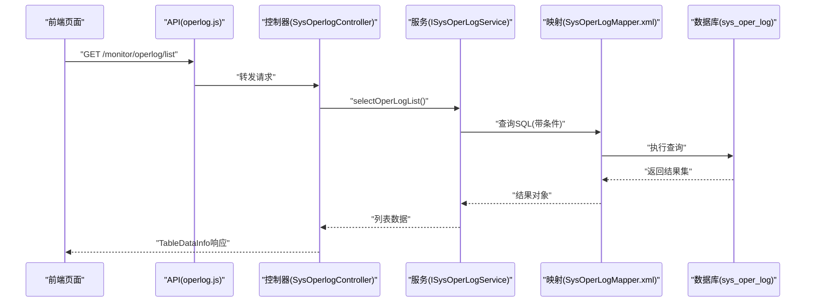
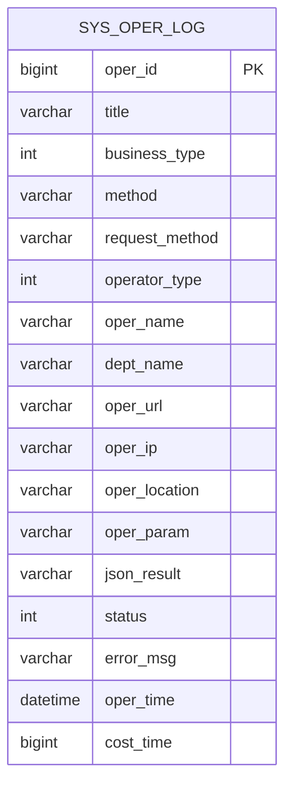
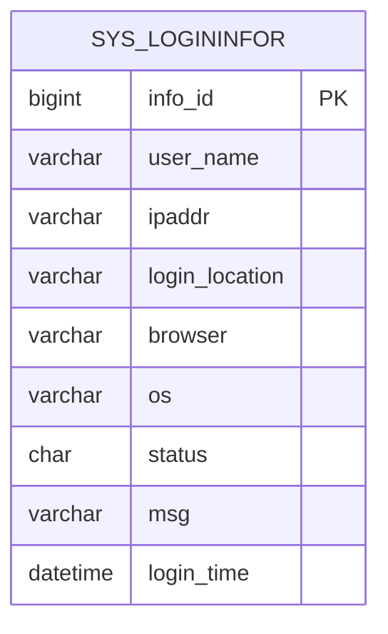
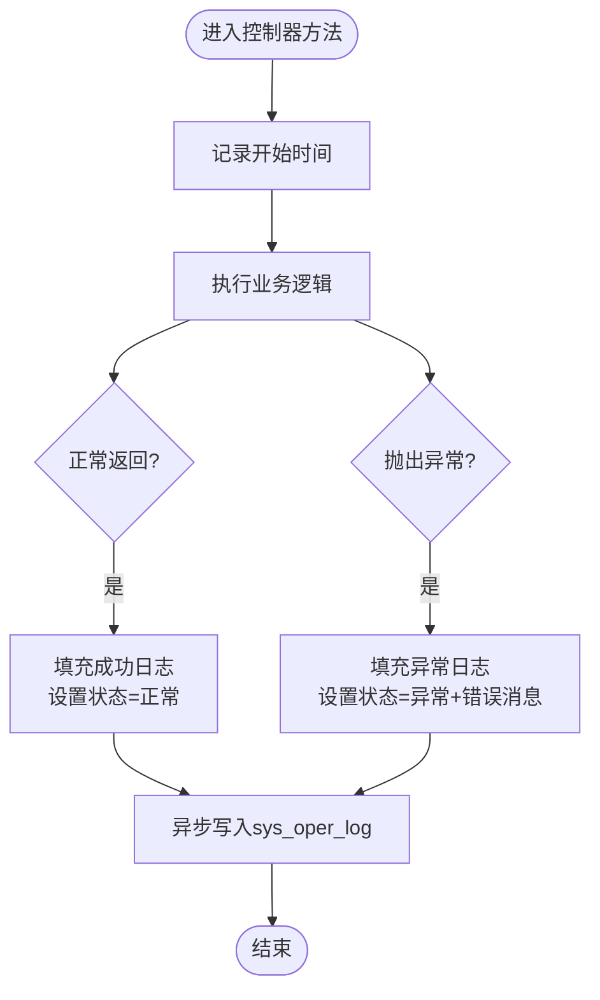
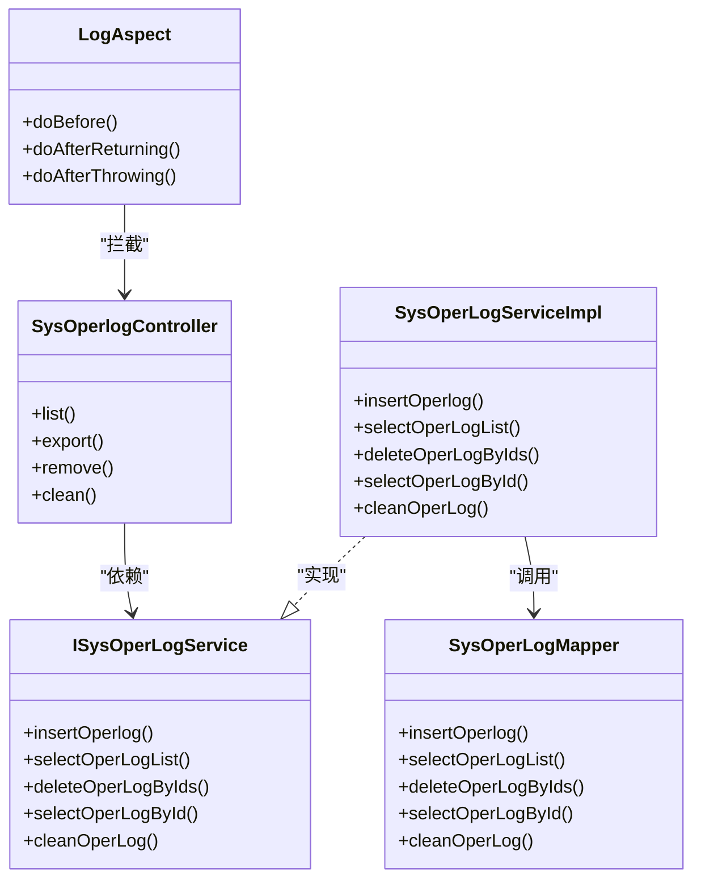

# 运营监控表结构

<cite>
**本文引用的文件**
- [ry_20260321.sql](file://XingChen-Vue/sql/ry_20260321.sql)
- [SysOperLog.java](file://XingChen-Vue/xingchen-system/src/main/java/com/xingchen/system/domain/SysOperLog.java)
- [SysLogininfor.java](file://XingChen-Vue/xingchen-system/src/main/java/com/xingchen/system/domain/SysLogininfor.java)
- [SysOperLogMapper.xml](file://XingChen-Vue/xingchen-system/src/main/resources/mapper/system/SysOperLogMapper.xml)
- [SysLogininforMapper.xml](file://XingChen-Vue/xingchen-system/src/main/resources/mapper/system/SysLogininforMapper.xml)
- [ISysOperLogService.java](file://XingChen-Vue/xingchen-system/src/main/java/com/xingchen/system/service/ISysOperLogService.java)
- [ISysLogininforService.java](file://XingChen-Vue/xingchen-system/src/main/java/com/xingchen/system/service/ISysLogininforService.java)
- [SysOperLogServiceImpl.java](file://XingChen-Vue/xingchen-system/src/main/java/com/xingchen/system/service/impl/SysOperLogServiceImpl.java)
- [LogAspect.java](file://XingChen-Vue/xingchen-framework/src/main/java/com/xingchen/framework/aspectj/LogAspect.java)
- [SysOperlogController.java](file://XingChen-Vue/xingchen-admin/src/main/java/com/xingchen/web/controller/monitor/SysOperlogController.java)
- [operlog.js](file://XingChen-Vue3/src/api/monitor/operlog.js)
- [index.vue(operlog)](file://XingChen-Vue3/src/views/monitor/operlog/index.vue)
- [index.vue(logininfor)](file://XingChen-Vue3/src/views/monitor/logininfor/index.vue)
- [logback.xml](file://XingChen-Vue/xingchen-admin/src/main/resources/logback.xml)
</cite>

## 目录
1. [简介](#简介)
2. [项目结构](#项目结构)
3. [核心组件](#核心组件)
4. [架构总览](#架构总览)
5. [详细组件分析](#详细组件分析)
6. [依赖关系分析](#依赖关系分析)
7. [性能考量](#性能考量)
8. [故障排查指南](#故障排查指南)
9. [结论](#结论)
10. [附录](#附录)

## 简介
本文件聚焦于健康管理系统中的运营监控表结构，重点解析操作日志表(sys_oper_log)与系统访问记录表(sys_logininfor)的字段定义、数据类型、约束条件与业务含义，并结合代码实现说明操作日志的完整记录机制、登录日志的安全审计功能、日志数据的统计分析支持、操作类型的分类体系、日志数据的生命周期管理与安全审计指标。同时提供运营监控表关系图、字段说明表以及典型监控场景下的数据查询示例，帮助开发者与运维人员快速理解与使用。

## 项目结构
围绕运营监控的核心文件分布如下：
- 数据库脚本：包含表结构定义与索引、字典类型与数据
- 实体类：封装表字段映射与导出标注
- MyBatis映射：SQL查询、筛选与清理
- 服务接口与实现：对外暴露的查询、导出、清理等能力
- 控制器与前端：提供REST接口与可视化查询页面
- 切面日志：统一拦截控制器方法，自动记录操作日志
- 日志配置：系统日志滚动与保留策略

图表来源
- [ry_20260321.sql:419-442](file://XingChen-Vue/sql/ry_20260321.sql#L419-L442)
- [SysOperLog.java:1-270](file://XingChen-Vue/xingchen-system/src/main/java/com/xingchen/system/domain/SysOperLog.java#L1-L270)
- [SysLogininfor.java:1-145](file://XingChen-Vue/xingchen-system/src/main/java/com/xingchen/system/domain/SysLogininfor.java#L1-L145)
- [SysOperLogMapper.xml:1-87](file://XingChen-Vue/xingchen-system/src/main/resources/mapper/system/SysOperLogMapper.xml#L1-L87)
- [SysLogininforMapper.xml:1-57](file://XingChen-Vue/xingchen-system/src/main/resources/mapper/system/SysLogininforMapper.xml#L1-L57)
- [ISysOperLogService.java:1-49](file://XingChen-Vue/xingchen-system/src/main/java/com/xingchen/system/service/ISysOperLogService.java#L1-L49)
- [ISysLogininforService.java:1-41](file://XingChen-Vue/xingchen-system/src/main/java/com/xingchen/system/service/ISysLogininforService.java#L1-L41)
- [SysOperLogServiceImpl.java:1-76](file://XingChen-Vue/xingchen-system/src/main/java/com/xingchen/system/service/impl/SysOperLogServiceImpl.java#L1-L76)
- [SysOperlogController.java:1-69](file://XingChen-Vue/xingchen-admin/src/main/java/com/xingchen/web/controller/monitor/SysOperlogController.java#L1-L69)
- [LogAspect.java:1-265](file://XingChen-Vue/xingchen-framework/src/main/java/com/xingchen/framework/aspectj/LogAspect.java#L1-L265)
- [operlog.js:1-26](file://XingChen-Vue3/src/api/monitor/operlog.js#L1-L26)
- [index.vue(operlog):155-245](file://XingChen-Vue3/src/views/monitor/operlog/index.vue#L155-L245)
- [index.vue(logininfor):127-175](file://XingChen-Vue3/src/views/monitor/logininfor/index.vue#L127-L175)

章节来源
- [ry_20260321.sql:419-442](file://XingChen-Vue/sql/ry_20260321.sql#L419-L442)
- [SysOperLog.java:1-270](file://XingChen-Vue/xingchen-system/src/main/java/com/xingchen/system/domain/SysOperLog.java#L1-L270)
- [SysLogininfor.java:1-145](file://XingChen-Vue/xingchen-system/src/main/java/com/xingchen/system/domain/SysLogininfor.java#L1-L145)

## 核心组件
- 操作日志表(sys_oper_log)：记录系统内所有业务操作的详细信息，包括操作模块、业务类型、请求参数、返回结果、状态、错误信息、操作时间与耗时等。
- 系统访问记录表(sys_logininfor)：记录用户登录行为，包括用户账号、登录IP、登录地点、浏览器与操作系统、登录状态与提示消息、访问时间等。
- 字典类型与数据(sys_dict_type/sys_dict_data)：为操作类型、状态等提供枚举化配置，便于前端展示与筛选。

章节来源
- [ry_20260321.sql:419-442](file://XingChen-Vue/sql/ry_20260321.sql#L419-L442)
- [ry_20260321.sql:446-473](file://XingChen-Vue/sql/ry_20260321.sql#L446-L473)
- [ry_20260321.sql:476-528](file://XingChen-Vue/sql/ry_20260321.sql#L476-L528)

## 架构总览
运营监控贯穿“前端查询—控制器—服务—持久层—数据库”的全链路，配合切面日志在控制器方法前后自动采集操作上下文，异步写入数据库，确保不影响业务主流程。

图表来源
- [operlog.js:1-26](file://XingChen-Vue3/src/api/monitor/operlog.js#L1-L26)
- [SysOperlogController.java:34-41](file://XingChen-Vue/xingchen-admin/src/main/java/com/xingchen/web/controller/monitor/SysOperlogController.java#L34-L41)
- [ISysOperLogService.java:20-26](file://XingChen-Vue/xingchen-system/src/main/java/com/xingchen/system/service/ISysOperLogService.java#L20-L26)
- [SysOperLogMapper.xml:37-69](file://XingChen-Vue/xingchen-system/src/main/resources/mapper/system/SysOperLogMapper.xml#L37-L69)

## 详细组件分析

### 操作日志表(sys_oper_log)结构与字段说明
- 主键与索引
  - 主键：oper_id（自增）
  - 索引：business_type、status、oper_time
- 字段定义与业务含义
  - oper_id：日志主键
  - title：模块标题
  - business_type：业务类型（0其它 1新增 2修改 3删除 等）
  - method：方法名称
  - request_method：请求方式（GET/POST/PUT/DELETE）
  - operator_type：操作类别（0其它 1后台用户 2手机端用户）
  - oper_name：操作人员
  - dept_name：部门名称
  - oper_url：请求URL
  - oper_ip：主机地址
  - oper_location：操作地点
  - oper_param：请求参数
  - json_result：返回参数
  - status：操作状态（0正常 1异常）
  - error_msg：错误消息
  - oper_time：操作时间
  - cost_time：消耗时间（毫秒）

图表来源
- [ry_20260321.sql:419-442](file://XingChen-Vue/sql/ry_20260321.sql#L419-L442)

章节来源
- [ry_20260321.sql:419-442](file://XingChen-Vue/sql/ry_20260321.sql#L419-L442)
- [SysOperLog.java:18-88](file://XingChen-Vue/xingchen-system/src/main/java/com/xingchen/system/domain/SysOperLog.java#L18-L88)

### 系统访问记录表(sys_logininfor)结构与字段说明
- 主键与索引
  - 主键：info_id（自增）
  - 索引：status、login_time
- 字段定义与业务含义
  - info_id：访问ID
  - user_name：用户账号
  - ipaddr：登录IP地址
  - login_location：登录地点
  - browser：浏览器类型
  - os：操作系统
  - status：登录状态（0成功 1失败）
  - msg：提示消息
  - login_time：访问时间

图表来源
- [ry_20260321.sql:559-575](file://XingChen-Vue/sql/ry_20260321.sql#L559-L575)

章节来源
- [ry_20260321.sql:559-575](file://XingChen-Vue/sql/ry_20260321.sql#L559-L575)
- [SysLogininfor.java:18-53](file://XingChen-Vue/xingchen-system/src/main/java/com/xingchen/system/domain/SysLogininfor.java#L18-L53)

### 操作日志记录机制（切面+异步）
- 切面拦截
  - 在控制器方法执行前记录开始时间，在返回或异常后统一处理
  - 自动填充操作人、部门、IP、URL、方法名、请求方式、耗时等
- 注解驱动
  - 通过@Log注解声明业务类型、标题、是否保存请求/响应参数等
- 异步落库
  - 使用异步线程池异步写入数据库，避免阻塞主线程

图表来源
- [LogAspect.java:88-140](file://XingChen-Vue/xingchen-framework/src/main/java/com/xingchen/framework/aspectj/LogAspect.java#L88-L140)
- [LogAspect.java:149-168](file://XingChen-Vue/xingchen-framework/src/main/java/com/xingchen/framework/aspectj/LogAspect.java#L149-L168)
- [LogAspect.java:176-220](file://XingChen-Vue/xingchen-framework/src/main/java/com/xingchen/framework/aspectj/LogAspect.java#L176-L220)

章节来源
- [LogAspect.java:56-140](file://XingChen-Vue/xingchen-framework/src/main/java/com/xingchen/framework/aspectj/LogAspect.java#L56-L140)
- [SysOperlogController.java:13-18](file://XingChen-Vue/xingchen-admin/src/main/java/com/xingchen/web/controller/monitor/SysOperlogController.java#L13-L18)

### 登录日志的安全审计功能
- 登录行为记录
  - 记录用户账号、登录IP、登录地点、浏览器与操作系统、登录状态与提示消息、访问时间
- 安全策略支持
  - 通过系统配置可设置登录黑名单IP列表，结合登录日志进行审计与风控
- 前端查询与导出
  - 支持按状态、时间范围、账号/IP等条件筛选，支持导出与清空

章节来源
- [ry_20260321.sql:559-575](file://XingChen-Vue/sql/ry_20260321.sql#L559-L575)
- [SysLogininforMapper.xml:24-44](file://XingChen-Vue/xingchen-system/src/main/resources/mapper/system/SysLogininforMapper.xml#L24-L44)
- [index.vue(logininfor):155-175](file://XingChen-Vue3/src/views/monitor/logininfor/index.vue#L155-L175)

### 日志数据的统计分析支持
- 字典类型与数据
  - sys_oper_type：操作类型（新增、修改、删除、授权、导出、导入、强退、生成代码、清空数据等）
  - sys_common_status：通用状态（成功、失败）
- 前端展示
  - 前端页面通过字典渲染业务类型与状态，便于统计分析

章节来源
- [ry_20260321.sql:446-473](file://XingChen-Vue/sql/ry_20260321.sql#L446-L473)
- [ry_20260321.sql:476-528](file://XingChen-Vue/sql/ry_20260321.sql#L476-L528)
- [index.vue(operlog):160-161](file://XingChen-Vue3/src/views/monitor/operlog/index.vue#L160-L161)

### 操作类型的分类体系
- 业务类型(business_type)
  - 0：其它
  - 1：新增
  - 2：修改
  - 3：删除
  - 4：授权
  - 5：导出
  - 6：导入
  - 7：强退
  - 8：生成代码
  - 9：清空数据
- 操作类别(operator_type)
  - 0：其它
  - 1：后台用户
  - 2：手机端用户

章节来源
- [SysOperLog.java:26-43](file://XingChen-Vue/xingchen-system/src/main/java/com/xingchen/system/domain/SysOperLog.java#L26-L43)
- [ry_20260321.sql:419-442](file://XingChen-Vue/sql/ry_20260321.sql#L419-L442)

### 日志数据的生命周期管理与安全审计指标
- 生命周期管理
  - 提供清空操作日志与登录日志的能力（Truncate/删除）
  - 前端提供清空按钮与批量删除
- 安全审计指标
  - 登录失败率、异常操作占比、高风险操作类型分布、异常IP访问趋势
  - 通过查询条件（状态、时间范围、业务类型、操作人、IP等）进行聚合分析

章节来源
- [SysOperLogMapper.xml:83-85](file://XingChen-Vue/xingchen-system/src/main/resources/mapper/system/SysOperLogMapper.xml#L83-L85)
- [SysLogininforMapper.xml:53-55](file://XingChen-Vue/xingchen-system/src/main/resources/mapper/system/SysLogininforMapper.xml#L53-L55)
- [SysOperlogController.java:61-68](file://XingChen-Vue/xingchen-admin/src/main/java/com/xingchen/web/controller/monitor/SysOperlogController.java#L61-L68)
- [index.vue(operlog):244-245](file://XingChen-Vue3/src/views/monitor/operlog/index.vue#L244-L245)

## 依赖关系分析
- 控制器依赖服务接口
- 服务实现依赖Mapper
- Mapper映射到数据库表
- 切面在控制器层统一注入日志采集
- 前端通过API调用控制器

图表来源
- [SysOperlogController.java:27-69](file://XingChen-Vue/xingchen-admin/src/main/java/com/xingchen/web/controller/monitor/SysOperlogController.java#L27-L69)
- [ISysOperLogService.java:11-48](file://XingChen-Vue/xingchen-system/src/main/java/com/xingchen/system/service/ISysOperLogService.java#L11-L48)
- [SysOperLogServiceImpl.java:15-76](file://XingChen-Vue/xingchen-system/src/main/java/com/xingchen/system/service/impl/SysOperLogServiceImpl.java#L15-L76)
- [SysOperLogMapper.xml:1-87](file://XingChen-Vue/xingchen-system/src/main/resources/mapper/system/SysOperLogMapper.xml#L1-L87)
- [LogAspect.java:41-140](file://XingChen-Vue/xingchen-framework/src/main/java/com/xingchen/framework/aspectj/LogAspect.java#L41-L140)

章节来源
- [SysOperlogController.java:1-69](file://XingChen-Vue/xingchen-admin/src/main/java/com/xingchen/web/controller/monitor/SysOperlogController.java#L1-L69)
- [ISysOperLogService.java:1-49](file://XingChen-Vue/xingchen-system/src/main/java/com/xingchen/system/service/ISysOperLogService.java#L1-L49)
- [SysOperLogServiceImpl.java:1-76](file://XingChen-Vue/xingchen-system/src/main/java/com/xingchen/system/service/impl/SysOperLogServiceImpl.java#L1-L76)
- [SysOperLogMapper.xml:1-87](file://XingChen-Vue/xingchen-system/src/main/resources/mapper/system/SysOperLogMapper.xml#L1-L87)
- [LogAspect.java:1-265](file://XingChen-Vue/xingchen-framework/src/main/java/com/xingchen/framework/aspectj/LogAspect.java#L1-L265)

## 性能考量
- 异步写日志：避免阻塞请求线程，提高接口吞吐
- 索引优化：对business_type、status、oper_time/status、login_time建立索引，提升查询性能
- 参数长度限制：请求参数与返回参数最大长度限制，防止超长文本影响性能
- 分页查询：前端分页与后端分页结合，避免一次性加载大量日志

章节来源
- [LogAspect.java:51-54](file://XingChen-Vue/xingchen-framework/src/main/java/com/xingchen/framework/aspectj/LogAspect.java#L51-L54)
- [SysOperLogMapper.xml:37-69](file://XingChen-Vue/xingchen-system/src/main/resources/mapper/system/SysOperLogMapper.xml#L37-L69)
- [SysLogininforMapper.xml:24-44](file://XingChen-Vue/xingchen-system/src/main/resources/mapper/system/SysLogininforMapper.xml#L24-L44)

## 故障排查指南
- 操作日志未记录
  - 检查控制器方法是否添加@Log注解
  - 确认切面LogAspect是否生效
  - 查看异步线程池与数据库连接
- 登录日志异常
  - 检查登录接口是否正确调用登录日志服务
  - 核对IP解析与地理位置解析逻辑
- 查询性能差
  - 确认是否使用了合适的筛选条件与索引
  - 检查分页参数与时间范围
- 日志清理无效
  - 确认清空接口权限与调用链路

章节来源
- [LogAspect.java:88-140](file://XingChen-Vue/xingchen-framework/src/main/java/com/xingchen/framework/aspectj/LogAspect.java#L88-L140)
- [SysOperlogController.java:61-68](file://XingChen-Vue/xingchen-admin/src/main/java/com/xingchen/web/controller/monitor/SysOperlogController.java#L61-L68)
- [SysOperLogMapper.xml:83-85](file://XingChen-Vue/xingchen-system/src/main/resources/mapper/system/SysOperLogMapper.xml#L83-L85)

## 结论
运营监控表结构清晰、职责明确，配合切面日志与前后端一体化设计，实现了对系统操作与登录行为的全面记录与审计。通过字典体系与灵活的查询条件，能够支撑日常运维与安全审计工作。建议在生产环境中合理设置索引、参数长度限制与日志清理策略，确保系统性能与合规要求。

## 附录

### 典型监控场景下的数据查询示例
- 查询某时间段内的异常操作
  - 条件：status=1，oper_time在指定范围内
  - 参考SQL片段：[SysOperLogMapper.xml:55-66](file://XingChen-Vue/xingchen-system/src/main/resources/mapper/system/SysOperLogMapper.xml#L55-L66)
- 查询某用户的全部操作
  - 条件：oper_name=用户名，oper_time范围
  - 参考SQL片段：[SysOperLogMapper.xml:58-60](file://XingChen-Vue/xingchen-system/src/main/resources/mapper/system/SysOperLogMapper.xml#L58-L60)
- 查询登录失败记录
  - 条件：status=1，login_time范围
  - 参考SQL片段：[SysLogininforMapper.xml:36-41](file://XingChen-Vue/xingchen-system/src/main/resources/mapper/system/SysLogininforMapper.xml#L36-L41)
- 导出操作日志
  - 接口：/monitor/operlog/export
  - 参考API：[operlog.js:4-10](file://XingChen-Vue3/src/api/monitor/operlog.js#L4-L10)
- 清空操作日志
  - 接口：/monitor/operlog/clean
  - 参考控制器：[SysOperlogController.java:61-68](file://XingChen-Vue/xingchen-admin/src/main/java/com/xingchen/web/controller/monitor/SysOperlogController.java#L61-L68)

### 字段说明表
- sys_oper_log
  - oper_id：日志主键
  - title：模块标题
  - business_type：业务类型
  - method：方法名称
  - request_method：请求方式
  - operator_type：操作类别
  - oper_name：操作人员
  - dept_name：部门名称
  - oper_url：请求URL
  - oper_ip：主机地址
  - oper_location：操作地点
  - oper_param：请求参数
  - json_result：返回参数
  - status：操作状态
  - error_msg：错误消息
  - oper_time：操作时间
  - cost_time：消耗时间

- sys_logininfor
  - info_id：访问ID
  - user_name：用户账号
  - ipaddr：登录IP地址
  - login_location：登录地点
  - browser：浏览器类型
  - os：操作系统
  - status：登录状态
  - msg：提示消息
  - login_time：访问时间

章节来源
- [ry_20260321.sql:419-442](file://XingChen-Vue/sql/ry_20260321.sql#L419-L442)
- [ry_20260321.sql:559-575](file://XingChen-Vue/sql/ry_20260321.sql#L559-L575)