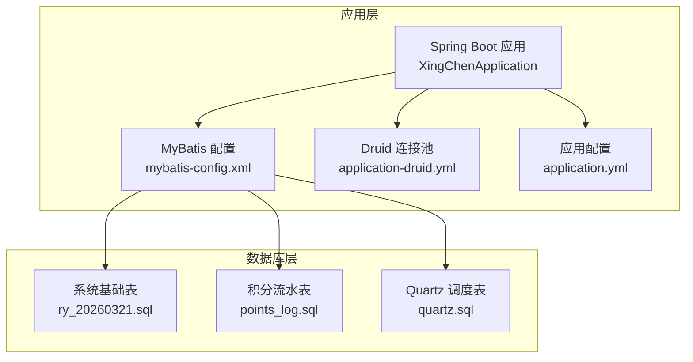
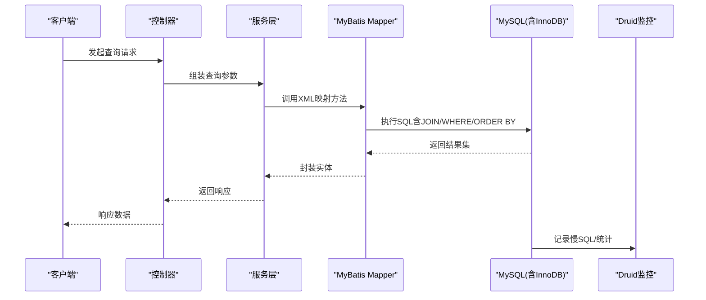
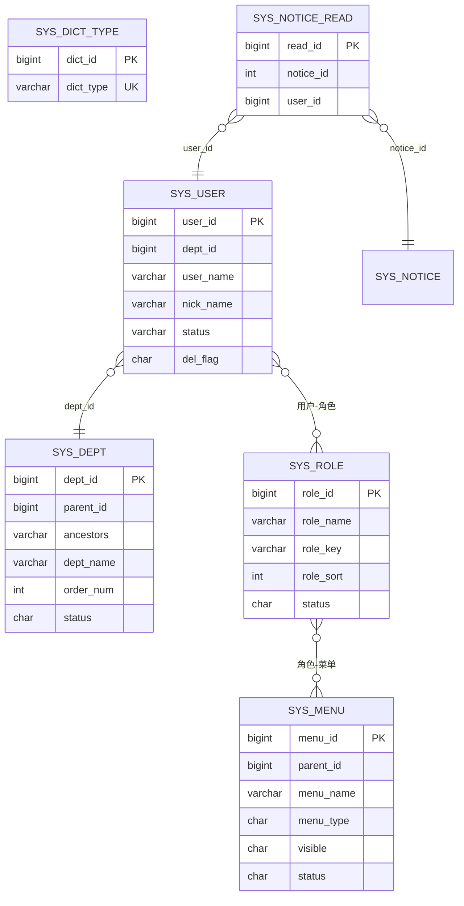
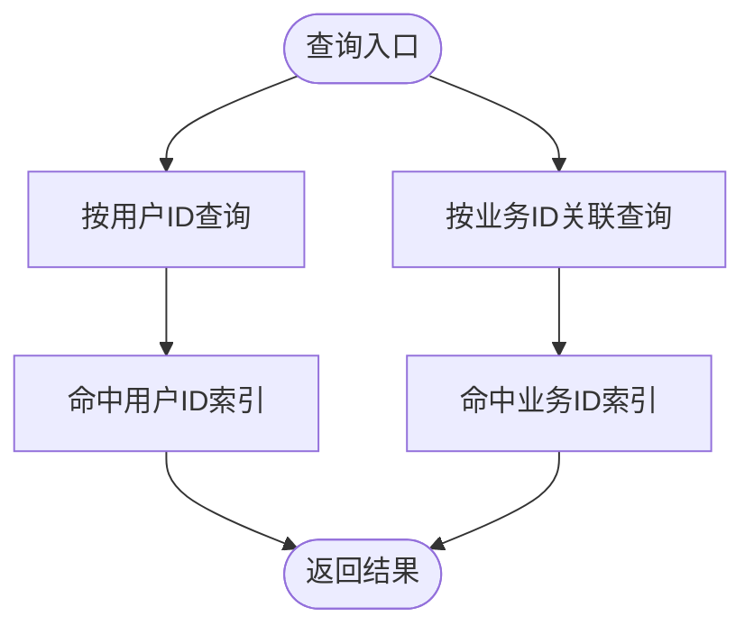
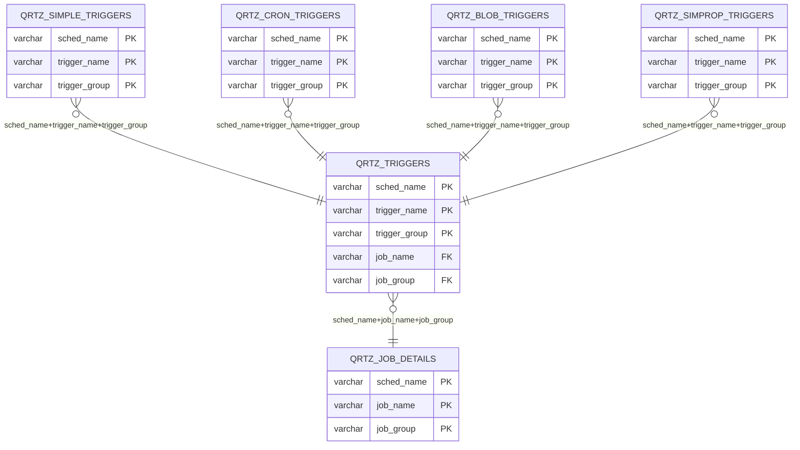
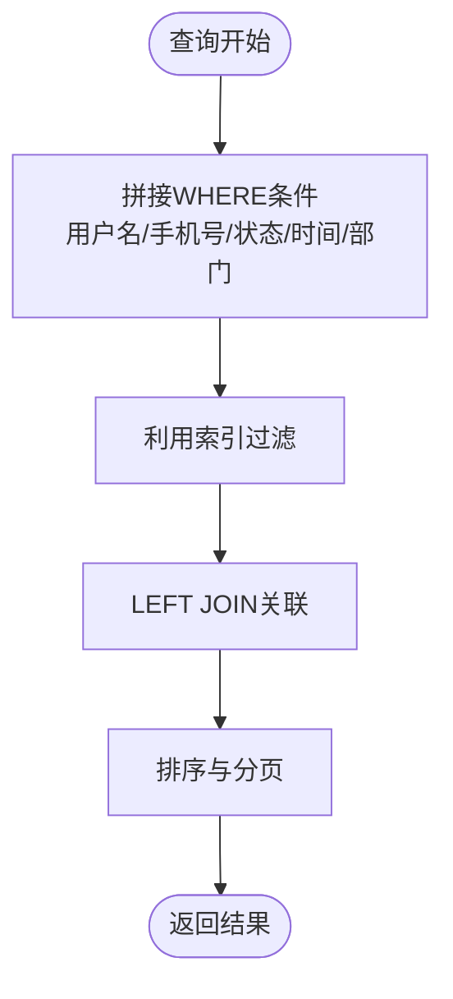
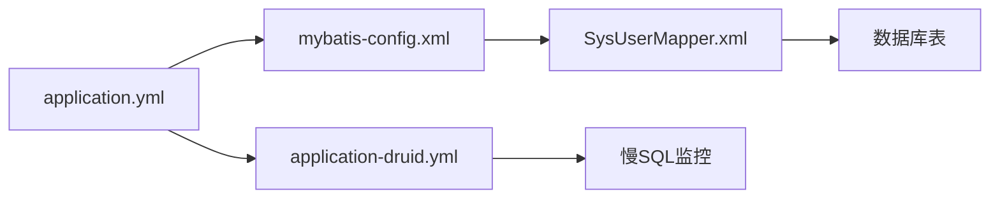

# 索引与约束策略

<cite>
**本文引用的文件**
- [ry_20260321.sql](file://XingChen-Vue/sql/ry_20260321.sql)
- [points_log.sql](file://XingChen-Vue/sql/points_log.sql)
- [quartz.sql](file://XingChen-Vue/sql/quartz.sql)
- [application.yml](file://XingChen-Vue/xingchen-admin/src/main/resources/application.yml)
- [application-druid.yml](file://XingChen-Vue/xingchen-admin/src/main/resources/application-druid.yml)
- [mybatis-config.xml](file://XingChen-Vue/xingchen-admin/src/main/resources/mybatis/mybatis-config.xml)
- [SysUserMapper.xml](file://XingChen-Vue/xingchen-system/src/main/resources/mapper/system/SysUserMapper.xml)
- [SysUser.java](file://XingChen-Vue/xingchen-common/src/main/java/com/xingchen/common/core/domain/entity/SysUser.java)
- [SysPointsLog.java](file://XingChen-Vue/xingchen-system/src/main/java/com/xingchen/system/domain/SysPointsLog.java)
- [SqlUtil.java](file://XingChen-Vue/xingchen-common/src/main/java/com/xingchen/common/utils/sql/SqlUtil.java)
</cite>

## 目录
1. [简介](#简介)
2. [项目结构](#项目结构)
3. [核心组件](#核心组件)
4. [架构总览](#架构总览)
5. [详细组件分析](#详细组件分析)
6. [依赖关系分析](#依赖关系分析)
7. [性能考量](#性能考量)
8. [故障排查指南](#故障排查指南)
9. [结论](#结论)
10. [附录](#附录)

## 简介
本文件面向健康管理系统数据库的索引与约束策略，基于现有SQL脚本与应用配置，系统性梳理各表的主键、唯一索引、复合索引、外键约束、检查约束与非空约束的设计现状，并结合查询模式给出索引使用建议、性能优化策略与维护最佳实践，同时覆盖索引失效场景与慢查询优化案例，帮助读者在实际生产环境中建立稳健、高效的数据库索引体系。

## 项目结构
- 数据库层：包含系统基础表（用户、角色、菜单、字典、定时任务等）、积分流水表与Quartz调度表。
- 应用层：Spring Boot + MyBatis + Druid连接池，通过XML映射文件组织SQL查询，配合Druid慢SQL监控与PageHelper分页。

图表来源
- [application.yml:1-148](file://XingChen-Vue/xingchen-admin/src/main/resources/application.yml#L1-L148)
- [application-druid.yml:1-61](file://XingChen-Vue/xingchen-admin/src/main/resources/application-druid.yml#L1-L61)
- [mybatis-config.xml:1-21](file://XingChen-Vue/xingchen-admin/src/main/resources/mybatis/mybatis-config.xml#L1-L21)
- [ry_20260321.sql:1-722](file://XingChen-Vue/sql/ry_20260321.sql#L1-L722)
- [points_log.sql:1-18](file://XingChen-Vue/sql/points_log.sql#L1-L18)
- [quartz.sql:1-174](file://XingChen-Vue/sql/quartz.sql#L1-L174)

章节来源
- [application.yml:1-148](file://XingChen-Vue/xingchen-admin/src/main/resources/application.yml#L1-L148)
- [application-druid.yml:1-61](file://XingChen-Vue/xingchen-admin/src/main/resources/application-druid.yml#L1-L61)
- [mybatis-config.xml:1-21](file://XingChen-Vue/xingchen-admin/src/main/resources/mybatis/mybatis-config.xml#L1-L21)
- [ry_20260321.sql:1-722](file://XingChen-Vue/sql/ry_20260321.sql#L1-L722)
- [points_log.sql:1-18](file://XingChen-Vue/sql/points_log.sql#L1-L18)
- [quartz.sql:1-174](file://XingChen-Vue/sql/quartz.sql#L1-L174)

## 核心组件
- 系统基础表：用户、角色、菜单、部门、岗位、字典、参数、公告、定时任务等，均采用InnoDB引擎，主键为自增或联合主键。
- 积分流水表：记录员工积分变动明细，包含用户维度与业务关联维度的查询需求。
- Quartz调度表：用于分布式任务调度，包含作业详情、触发器、日历、状态等表，形成完整的外键关系链。

章节来源
- [ry_20260321.sql:1-722](file://XingChen-Vue/sql/ry_20260321.sql#L1-L722)
- [points_log.sql:1-18](file://XingChen-Vue/sql/points_log.sql#L1-L18)
- [quartz.sql:1-174](file://XingChen-Vue/sql/quartz.sql#L1-L174)

## 架构总览
应用通过MyBatis映射SQL到数据库，Druid连接池负责连接管理与慢SQL监控；查询主要围绕用户、角色、菜单、公告、积分流水与Quartz调度表展开，涉及大量关联查询与条件过滤。

图表来源
- [SysUserMapper.xml:60-87](file://XingChen-Vue/xingchen-system/src/main/resources/mapper/system/SysUserMapper.xml#L60-L87)
- [application-druid.yml:55-57](file://XingChen-Vue/xingchen-admin/src/main/resources/application-druid.yml#L55-L57)
- [mybatis-config.xml:1-21](file://XingChen-Vue/xingchen-admin/src/main/resources/mybatis/mybatis-config.xml#L1-L21)

## 详细组件分析

### 1) 系统基础表（ry_20260321.sql）
- 主键设计
  - 多数表采用自增主键（如用户、角色、菜单、公告、定时任务等），保证写入性能与唯一性。
  - 关联表采用联合主键（如用户-角色、角色-菜单、角色-部门、用户-岗位），避免冗余索引。
- 唯一索引
  - 字典类型表对字典类型字段建立唯一索引，确保字典类型唯一性。
  - 公告已读记录表对用户与公告组合建立唯一索引，避免重复记录。
- 复合索引
  - 操作日志表对业务类型、状态、操作时间建立索引，支撑按状态与时间范围的查询。
  - 登录日志表对状态与登录时间建立索引，支撑登录审计与统计。
- 外键约束
  - Quartz调度表中，触发器表与作业详情表、简单触发器表、Cron触发器表、Blob触发器表之间存在外键关系，形成完整的调度生命周期约束。
- 非空与检查约束
  - 多数字段声明为NOT NULL（如用户账号、昵称、岗位编码、角色权限字符串等），并通过应用层注解进一步约束（如用户名长度、邮箱格式、手机号长度等）。
  - 状态字段采用枚举化字符（如'0'/'1'），通过应用层校验与字典表约束，减少非法值进入数据库。

图表来源
- [ry_20260321.sql:41-64](file://XingChen-Vue/sql/ry_20260321.sql#L41-L64)
- [ry_20260321.sql:104-121](file://XingChen-Vue/sql/ry_20260321.sql#L104-L121)
- [ry_20260321.sql:133-156](file://XingChen-Vue/sql/ry_20260321.sql#L133-L156)
- [ry_20260321.sql:448-462](file://XingChen-Vue/sql/ry_20260321.sql#L448-L462)
- [ry_20260321.sql:652-660](file://XingChen-Vue/sql/ry_20260321.sql#L652-L660)

章节来源
- [ry_20260321.sql:1-722](file://XingChen-Vue/sql/ry_20260321.sql#L1-L722)

### 2) 积分流水表（points_log.sql）
- 主键设计：自增主键，满足高并发写入场景。
- 索引设计：
  - 用户维度索引：便于按用户ID快速定位其积分流水。
  - 业务关联索引：便于按业务ID（如打卡记录ID、兑换订单ID）回溯流水。
- 查询模式：常见为按用户ID分页查询、按业务ID关联查询，索引设计贴合查询热点。

图表来源
- [points_log.sql:15-16](file://XingChen-Vue/sql/points_log.sql#L15-L16)
- [SysUserMapper.xml:60-87](file://XingChen-Vue/xingchen-system/src/main/resources/mapper/system/SysUserMapper.xml#L60-L87)

章节来源
- [points_log.sql:1-18](file://XingChen-Vue/sql/points_log.sql#L1-L18)
- [SysUserMapper.xml:60-87](file://XingChen-Vue/xingchen-system/src/main/resources/mapper/system/SysUserMapper.xml#L60-L87)

### 3) Quartz调度表（quartz.sql）
- 外键关系链完整：作业详情 -> 触发器 -> 简单/Cron/Blob触发器 -> 同步机制表，形成严格的生命周期约束。
- 主键与索引：采用联合主键与外键约束，保障调度一致性与可追踪性。

图表来源
- [quartz.sql:16-28](file://XingChen-Vue/sql/quartz.sql#L16-L28)
- [quartz.sql:33-52](file://XingChen-Vue/sql/quartz.sql#L33-L52)
- [quartz.sql:57-66](file://XingChen-Vue/sql/quartz.sql#L57-L66)
- [quartz.sql:71-79](file://XingChen-Vue/sql/quartz.sql#L71-L79)
- [quartz.sql:84-91](file://XingChen-Vue/sql/quartz.sql#L84-L91)
- [quartz.sql:155-172](file://XingChen-Vue/sql/quartz.sql#L155-L172)

章节来源
- [quartz.sql:1-174](file://XingChen-Vue/sql/quartz.sql#L1-L174)

### 4) 查询与约束策略（基于Mapper与实体）
- 用户查询：Mapper中对用户名称、手机号、状态、创建时间区间、部门ID等字段进行条件过滤，建议在这些字段上建立合适的索引以提升过滤效率。
- 字段约束：实体类中对用户名、昵称、邮箱、手机号等字段进行长度与格式校验，配合数据库NOT NULL与默认值，减少脏数据。
- SQL注入防护：工具类对ORDER BY进行白名单与长度限制，避免注入风险。

图表来源
- [SysUserMapper.xml:60-87](file://XingChen-Vue/xingchen-system/src/main/resources/mapper/system/SysUserMapper.xml#L60-L87)
- [SysUser.java:144-178](file://XingChen-Vue/xingchen-common/src/main/java/com/xingchen/common/core/domain/entity/SysUser.java#L144-L178)
- [SqlUtil.java:31-42](file://XingChen-Vue/xingchen-common/src/main/java/com/xingchen/common/utils/sql/SqlUtil.java#L31-L42)

章节来源
- [SysUserMapper.xml:60-87](file://XingChen-Vue/xingchen-system/src/main/resources/mapper/system/SysUserMapper.xml#L60-L87)
- [SysUser.java:144-178](file://XingChen-Vue/xingchen-common/src/main/java/com/xingchen/common/core/domain/entity/SysUser.java#L144-L178)
- [SqlUtil.java:1-46](file://XingChen-Vue/xingchen-common/src/main/java/com/xingchen/common/utils/sql/SqlUtil.java#L1-L46)

## 依赖关系分析
- 应用配置依赖Druid连接池与MyBatis配置，Druid开启慢SQL记录与控制台监控，有助于发现索引缺失或失效问题。
- Mapper依赖数据库表结构，查询条件与索引设计密切相关；实体类的字段约束与数据库约束共同保障数据质量。

图表来源
- [application.yml:104-112](file://XingChen-Vue/xingchen-admin/src/main/resources/application.yml#L104-L112)
- [application-druid.yml:55-57](file://XingChen-Vue/xingchen-admin/src/main/resources/application-druid.yml#L55-L57)
- [mybatis-config.xml:1-21](file://XingChen-Vue/xingchen-admin/src/main/resources/mybatis/mybatis-config.xml#L1-L21)
- [SysUserMapper.xml:60-87](file://XingChen-Vue/xingchen-system/src/main/resources/mapper/system/SysUserMapper.xml#L60-L87)

章节来源
- [application.yml:104-112](file://XingChen-Vue/xingchen-admin/src/main/resources/application.yml#L104-L112)
- [application-druid.yml:55-57](file://XingChen-Vue/xingchen-admin/src/main/resources/application-druid.yml#L55-L57)
- [mybatis-config.xml:1-21](file://XingChen-Vue/xingchen-admin/src/main/resources/mybatis/mybatis-config.xml#L1-L21)
- [SysUserMapper.xml:60-87](file://XingChen-Vue/xingchen-system/src/main/resources/mapper/system/SysUserMapper.xml#L60-L87)

## 性能考量
- 索引设计原则
  - 唯一性：对字典类型、用户账号、手机号、邮箱等建立唯一索引，避免重复与全表扫描。
  - 覆盖性：对高频查询字段组合建立复合索引，尽量覆盖SELECT与WHERE字段，减少回表。
  - 选择性：优先选择区分度高的前缀列，如状态、业务类型、用户ID等。
  - 更新代价：避免过多非必要索引，平衡写入与读取性能。
- 查询优化
  - 使用EXPLAIN分析执行计划，确认索引被使用。
  - 对大结果集分页查询，避免OFFSET过大导致的性能问题。
  - 使用LIMIT限制结果集大小，避免一次性返回过多数据。
- 约束与非空
  - 通过NOT NULL与默认值减少NULL值带来的索引与查询复杂度。
  - 应用层与数据库层双重约束，降低脏数据风险。
- 监控与维护
  - 借助Druid慢SQL日志识别低效查询，针对性补充索引。
  - 定期重建碎片索引，保持统计信息更新，避免执行计划退化。

[本节为通用性能指导，无需特定文件引用]

## 故障排查指南
- 慢查询定位
  - 开启Druid慢SQL记录，关注耗时长、扫描行数多的SQL。
  - 分析SQL是否遗漏索引、是否使用了函数导致索引失效。
- 索引失效场景
  - 条件列使用函数或表达式（如对列做运算或调用函数）。
  - LIKE以通配符开头（如“%abc”）。
  - OR条件中部分列未走索引。
  - 联合索引最左前缀原则未满足。
- 常见问题
  - 用户名/手机号模糊查询：建议在用户名、手机号建立前缀索引或使用全文索引（视版本与需求）。
  - 时间范围查询：确保时间字段建立索引，并避免在WHERE中对时间列做函数转换。
  - 排序字段：对ORDER BY字段建立索引，避免临时表与文件排序。

章节来源
- [application-druid.yml:55-57](file://XingChen-Vue/xingchen-admin/src/main/resources/application-druid.yml#L55-L57)
- [SqlUtil.java:31-42](file://XingChen-Vue/xingchen-common/src/main/java/com/xingchen/common/utils/sql/SqlUtil.java#L31-L42)

## 结论
本项目数据库层以InnoDB为主，主键、唯一索引与外键约束清晰，贴合业务查询模式。建议在高频查询字段上继续完善复合索引，强化慢SQL监控与定期维护，确保索引策略与查询模式持续匹配，从而获得稳定、高效的数据库性能表现。

[本节为总结性内容，无需特定文件引用]

## 附录

### A. 现状与建议对照表
- 系统基础表
  - 已有：主键、唯一索引（字典类型、公告已读）、外键链路（Quartz）。
  - 建议：针对用户名称、手机号、状态、创建时间、部门ID等字段评估复合索引覆盖度。
- 积分流水表
  - 已有：用户ID索引、业务ID索引。
  - 建议：按业务场景补充按时间范围的复合索引，优化报表与统计查询。
- Quartz调度表
  - 已有：完整的外键关系链。
  - 建议：根据调度频率与查询模式，评估触发器状态、时间字段的索引优化空间。

章节来源
- [ry_20260321.sql:1-722](file://XingChen-Vue/sql/ry_20260321.sql#L1-L722)
- [points_log.sql:1-18](file://XingChen-Vue/sql/points_log.sql#L1-L18)
- [quartz.sql:1-174](file://XingChen-Vue/sql/quartz.sql#L1-L174)