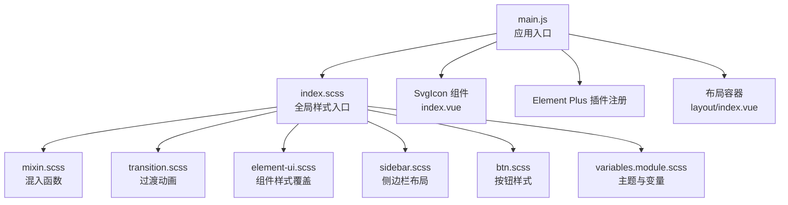
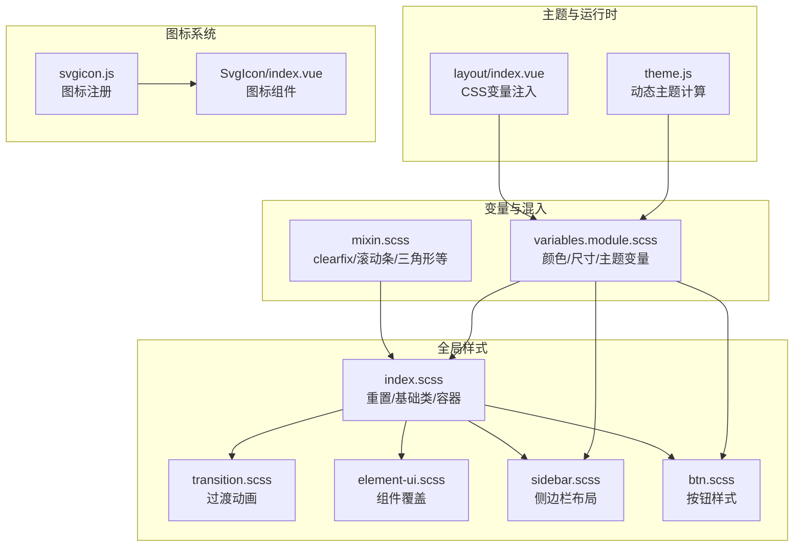
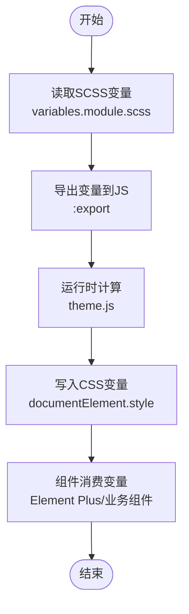
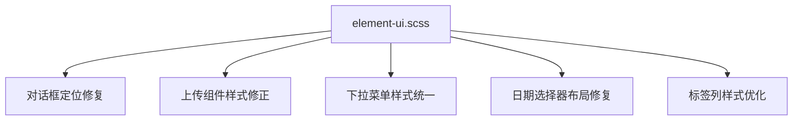
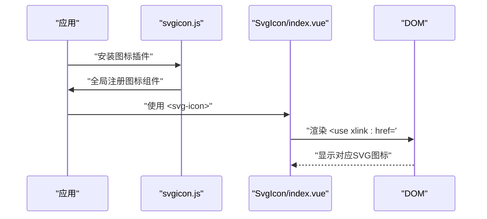
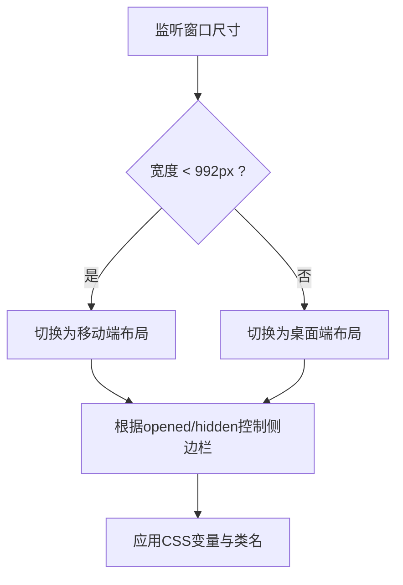
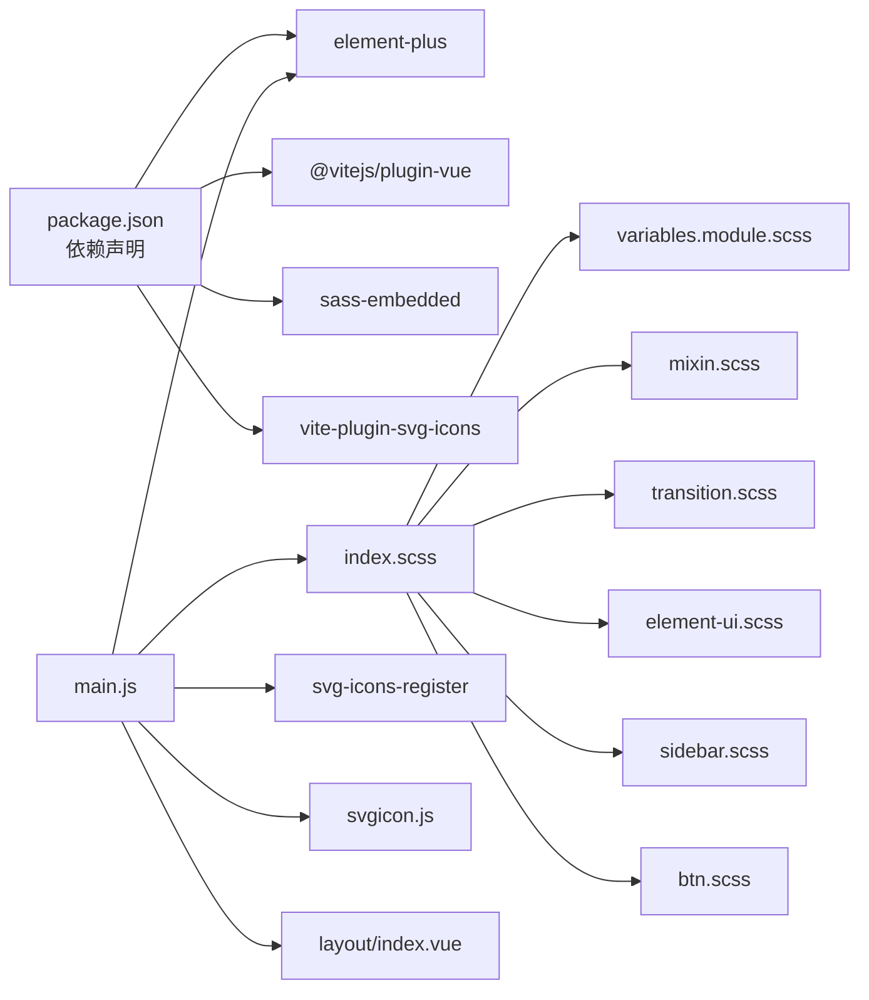

# UI组件库与样式系统

<cite>
**本文引用的文件**
- [index.scss](file://XingChen-Vue3/src/assets/styles/index.scss)
- [element-ui.scss](file://XingChen-Vue3/src/assets/styles/element-ui.scss)
- [variables.module.scss](file://XingChen-Vue3/src/assets/styles/variables.module.scss)
- [mixin.scss](file://XingChen-Vue3/src/assets/styles/mixin.scss)
- [sidebar.scss](file://XingChen-Vue3/src/assets/styles/sidebar.scss)
- [btn.scss](file://XingChen-Vue3/src/assets/styles/btn.scss)
- [transition.scss](file://XingChen-Vue3/src/assets/styles/transition.scss)
- [index.vue](file://XingChen-Vue3/src/layout/index.vue)
- [main.js](file://XingChen-Vue3/src/main.js)
- [theme.js](file://XingChen-Vue3/src/utils/theme.js)
- [index.vue](file://XingChen-Vue3/src/components/SvgIcon/index.vue)
- [svgicon.js](file://XingChen-Vue3/src/components/SvgIcon/svgicon.js)
- [package.json](file://XingChen-Vue3/package.json)
- [vite.config.js](file://XingChen-Vue3/vite.config.js)
</cite>

## 目录
1. [简介](#简介)
2. [项目结构](#项目结构)
3. [核心组件](#核心组件)
4. [架构总览](#架构总览)
5. [详细组件分析](#详细组件分析)
6. [依赖关系分析](#依赖关系分析)
7. [性能考量](#性能考量)
8. [故障排查指南](#故障排查指南)
9. [结论](#结论)
10. [附录](#附录)

## 简介
本文件系统性梳理健康管理系统前端的UI组件库与样式体系，重点围绕Element Plus组件库的使用与定制展开，涵盖主题配置、组件样式覆盖、自定义主题变量；同时阐述SCSS变量系统、CSS模块化与响应式设计实现；解释SVG图标的集成与使用（图标组件封装与动态加载）；并总结全局样式的组织方式（重置样式、基础样式、业务样式），以及样式性能优化与浏览器兼容性处理策略。

## 项目结构
样式系统采用“入口聚合 + 分层模块”的组织方式：
- 入口样式：通过主入口样式文件统一引入各功能域样式，形成全局样式基线
- 功能域样式：按领域拆分（如布局、按钮、过渡动画、侧边栏等），便于维护与复用
- 变量与混入：集中定义颜色、尺寸、布局等基础变量与可复用的混入函数
- 主题系统：结合CSS变量与暗色模式规则，实现主题切换与组件覆盖

**图表来源**
- [main.js:10](file://XingChen-Vue3/src/main.js#L10)
- [index.scss:1-7](file://XingChen-Vue3/src/assets/styles/index.scss#L1-L7)
- [mixin.scss:1-67](file://XingChen-Vue3/src/assets/styles/mixin.scss#L1-L67)
- [transition.scss:1-81](file://XingChen-Vue3/src/assets/styles/transition.scss#L1-L81)
- [element-ui.scss:1-96](file://XingChen-Vue3/src/assets/styles/element-ui.scss#L1-L96)
- [sidebar.scss:1-335](file://XingChen-Vue3/src/assets/styles/sidebar.scss#L1-L335)
- [btn.scss:1-100](file://XingChen-Vue3/src/assets/styles/btn.scss#L1-L100)
- [variables.module.scss:1-310](file://XingChen-Vue3/src/assets/styles/variables.module.scss#L1-L310)
- [index.vue:1-54](file://XingChen-Vue3/src/components/SvgIcon/index.vue#L1-L54)
- [index.vue:1-116](file://XingChen-Vue3/src/layout/index.vue#L1-L116)

**章节来源**
- [main.js:10](file://XingChen-Vue3/src/main.js#L10)
- [index.scss:1-7](file://XingChen-Vue3/src/assets/styles/index.scss#L1-L7)

## 核心组件
- Element Plus组件库：提供表单、表格、弹窗、菜单等基础UI能力，并通过主题变量与覆盖样式实现品牌化定制
- SVG图标系统：通过虚拟模块与组件封装，支持动态加载与统一渲染
- 布局容器：基于CSS变量与媒体查询实现响应式布局与主题切换

**章节来源**
- [main.js:5-82](file://XingChen-Vue3/src/main.js#L5-L82)
- [index.vue:1-116](file://XingChen-Vue3/src/layout/index.vue#L1-L116)
- [index.vue:1-54](file://XingChen-Vue3/src/components/SvgIcon/index.vue#L1-L54)

## 架构总览
样式系统以“变量驱动 + 规则覆盖 + 组件封装”为核心：
- 变量驱动：通过SCSS变量与CSS变量统一管理颜色、尺寸、间距等基础属性
- 规则覆盖：针对Element Plus组件常见问题进行样式修复与品牌化调整
- 组件封装：对常用交互与视觉元素进行组件化封装，提升复用性与一致性

**图表来源**
- [variables.module.scss:1-310](file://XingChen-Vue3/src/assets/styles/variables.module.scss#L1-L310)
- [mixin.scss:1-67](file://XingChen-Vue3/src/assets/styles/mixin.scss#L1-L67)
- [index.scss:1-180](file://XingChen-Vue3/src/assets/styles/index.scss#L1-L180)
- [transition.scss:1-81](file://XingChen-Vue3/src/assets/styles/transition.scss#L1-L81)
- [element-ui.scss:1-96](file://XingChen-Vue3/src/assets/styles/element-ui.scss#L1-L96)
- [sidebar.scss:1-335](file://XingChen-Vue3/src/assets/styles/sidebar.scss#L1-L335)
- [btn.scss:1-100](file://XingChen-Vue3/src/assets/styles/btn.scss#L1-L100)
- [theme.js:1-50](file://XingChen-Vue3/src/utils/theme.js#L1-L50)
- [index.vue:1-116](file://XingChen-Vue3/src/layout/index.vue#L1-L116)
- [index.vue:1-54](file://XingChen-Vue3/src/components/SvgIcon/index.vue#L1-L54)
- [svgicon.js:1-11](file://XingChen-Vue3/src/components/SvgIcon/svgicon.js#L1-L11)

## 详细组件分析

### 主题配置与自定义变量
- SCSS变量系统：集中定义基础颜色、菜单颜色、组件主色等，并通过`:export`导出供JS读取，实现前后端一致的主题控制
- CSS变量：在`:root`与`html.dark`中定义多套主题变量，用于Element Plus组件与业务组件的动态切换
- 运行时主题：通过工具函数计算主色的明/暗变体，并写入到`document.documentElement.style`，实现主题色的即时生效

**图表来源**
- [variables.module.scss:41-66](file://XingChen-Vue3/src/assets/styles/variables.module.scss#L41-L66)
- [variables.module.scss:69-131](file://XingChen-Vue3/src/assets/styles/variables.module.scss#L69-L131)
- [theme.js:1-50](file://XingChen-Vue3/src/utils/theme.js#L1-L50)
- [main.js:78-82](file://XingChen-Vue3/src/main.js#L78-L82)

**章节来源**
- [variables.module.scss:1-310](file://XingChen-Vue3/src/assets/styles/variables.module.scss#L1-L310)
- [theme.js:1-50](file://XingChen-Vue3/src/utils/theme.js#L1-L50)
- [main.js:78-82](file://XingChen-Vue3/src/main.js#L78-L82)

### Element Plus组件样式覆盖
- 针对Element UI常见问题进行覆盖，如对话框定位、上传拖拽区域、下拉菜单样式、日期选择器范围输入框布局等
- 通过作用域选择器与类名组合，确保覆盖的精确性与最小侵入性

**图表来源**
- [element-ui.scss:1-96](file://XingChen-Vue3/src/assets/styles/element-ui.scss#L1-L96)

**章节来源**
- [element-ui.scss:1-96](file://XingChen-Vue3/src/assets/styles/element-ui.scss#L1-L96)

### SVG图标系统
- 图标组件封装：通过`<svg><use xlink:href="#icon-..."/></svg>`实现图标渲染，支持传入类名与颜色
- 图标注册：通过插件自动注册Element Plus内置图标，并结合虚拟模块实现本地SVG图标的批量导入与命名空间管理

**图表来源**
- [svgicon.js:1-11](file://XingChen-Vue3/src/components/SvgIcon/svgicon.js#L1-L11)
- [index.vue:1-54](file://XingChen-Vue3/src/components/SvgIcon/index.vue#L1-L54)
- [main.js:22-24](file://XingChen-Vue3/src/main.js#L22-L24)

**章节来源**
- [index.vue:1-54](file://XingChen-Vue3/src/components/SvgIcon/index.vue#L1-L54)
- [svgicon.js:1-11](file://XingChen-Vue3/src/components/SvgIcon/svgicon.js#L1-L11)
- [main.js:22-24](file://XingChen-Vue3/src/main.js#L22-L24)

### 响应式设计与布局容器
- 布局容器：通过CSS变量与类名切换实现侧边栏展开/收起、移动端适配、固定头部等功能
- 媒体查询：基于宽度阈值切换设备类型，控制侧边栏行为与布局结构
- 侧边栏样式：统一菜单项高度、滚动条、悬停态与主题色，支持折叠状态下的图标与提示优化

**图表来源**
- [index.vue:37-53](file://XingChen-Vue3/src/layout/index.vue#L37-L53)
- [index.vue:65-116](file://XingChen-Vue3/src/layout/index.vue#L65-L116)
- [sidebar.scss:1-335](file://XingChen-Vue3/src/assets/styles/sidebar.scss#L1-L335)

**章节来源**
- [index.vue:1-116](file://XingChen-Vue3/src/layout/index.vue#L1-L116)
- [sidebar.scss:1-335](file://XingChen-Vue3/src/assets/styles/sidebar.scss#L1-L335)

### 全局样式组织
- 重置样式：统一body、html、盒模型，消除默认内外边距与字体平滑差异
- 基础类：提供对齐、浮动、清除浮动、块级显示等高频基础类
- 容器与布局：提供页面容器、组件容器、子导航栏等结构化样式
- 业务样式：通过模块化引入，避免全局污染，保证可维护性

**章节来源**
- [index.scss:8-180](file://XingChen-Vue3/src/assets/styles/index.scss#L8-L180)

## 依赖关系分析
- 样式依赖：全局样式入口统一引入各功能域样式，变量与混入作为底层支撑
- 组件依赖：布局容器依赖变量与混入，图标组件依赖虚拟模块与Element Plus图标注册
- 运行时依赖：主题工具函数依赖SCSS变量导出，Element Plus通过运行时注入CSS变量

**图表来源**
- [package.json:18-46](file://XingChen-Vue3/package.json#L18-L46)
- [main.js:5-25](file://XingChen-Vue3/src/main.js#L5-L25)
- [index.scss:1-7](file://XingChen-Vue3/src/assets/styles/index.scss#L1-L7)
- [variables.module.scss:1-310](file://XingChen-Vue3/src/assets/styles/variables.module.scss#L1-L310)
- [mixin.scss:1-67](file://XingChen-Vue3/src/assets/styles/mixin.scss#L1-L67)
- [transition.scss:1-81](file://XingChen-Vue3/src/assets/styles/transition.scss#L1-L81)
- [element-ui.scss:1-96](file://XingChen-Vue3/src/assets/styles/element-ui.scss#L1-L96)
- [sidebar.scss:1-335](file://XingChen-Vue3/src/assets/styles/sidebar.scss#L1-L335)
- [btn.scss:1-100](file://XingChen-Vue3/src/assets/styles/btn.scss#L1-L100)

**章节来源**
- [package.json:18-46](file://XingChen-Vue3/package.json#L18-L46)
- [main.js:5-25](file://XingChen-Vue3/src/main.js#L5-L25)

## 性能考量
- 样式打包与体积
  - 通过构建配置对输出文件命名与目录进行规范化，减少缓存碎片
  - 合理拆分样式模块，避免单文件过大导致的解析与渲染压力
- 运行时主题计算
  - 主题色变体计算应在必要时触发，避免频繁写入大量CSS变量
- 图标系统
  - 使用虚拟模块与按需注册，减少未使用图标的加载
- 渐进增强
  - 利用CSS变量与暗色模式，降低样式分支判断成本

**章节来源**
- [vite.config.js:29-42](file://XingChen-Vue3/vite.config.js#L29-L42)
- [theme.js:1-50](file://XingChen-Vue3/src/utils/theme.js#L1-L50)
- [svgicon.js:1-11](file://XingChen-Vue3/src/components/SvgIcon/svgicon.js#L1-L11)

## 故障排查指南
- Element Plus样式异常
  - 检查是否正确引入覆盖样式文件，确认选择器优先级与作用域
  - 关注日期选择器、上传组件、下拉菜单等特定场景的覆盖规则
- 主题色不生效
  - 确认运行时是否调用了主题计算函数并写入了CSS变量
  - 检查暗色模式类名是否正确添加至`html`元素
- 图标不显示
  - 确认图标是否已通过虚拟模块注册，组件传参是否正确
  - 检查命名空间与`xlink:href`指向的ID是否一致
- 响应式布局错乱
  - 检查设备类型切换逻辑与侧边栏类名切换
  - 确认CSS变量与媒体查询阈值是否符合预期

**章节来源**
- [element-ui.scss:1-96](file://XingChen-Vue3/src/assets/styles/element-ui.scss#L1-L96)
- [theme.js:1-50](file://XingChen-Vue3/src/utils/theme.js#L1-L50)
- [index.vue:1-116](file://XingChen-Vue3/src/layout/index.vue#L1-L116)
- [index.vue:1-54](file://XingChen-Vue3/src/components/SvgIcon/index.vue#L1-L54)

## 结论
该样式系统以变量与CSS变量为核心，结合Element Plus的组件覆盖与SVG图标的动态加载，形成了可扩展、可维护的品牌化UI体系。通过模块化的样式组织与运行时主题计算，既满足了多主题与暗色模式需求，又兼顾了性能与兼容性。建议在后续迭代中持续沉淀变量与混入，完善主题切换流程，并加强样式模块间的依赖可视化与测试覆盖。

## 附录
- 术语
  - SCSS变量：在编译期生效的颜色、尺寸等基础属性
  - CSS变量：在运行时可动态修改的样式属性，常用于主题切换
  - 覆盖样式：针对第三方组件的样式修复与品牌化调整
- 最佳实践
  - 将品牌色与组件主色收敛到变量系统，避免散落的硬编码颜色
  - 对高频使用的布局与交互进行组件化封装，提升复用性
  - 在构建阶段开启必要的压缩与拆分策略，控制首屏样式体积