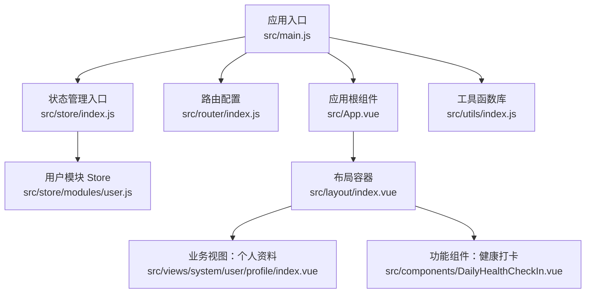
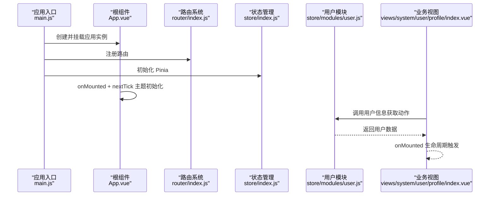
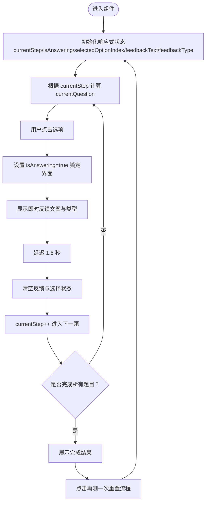
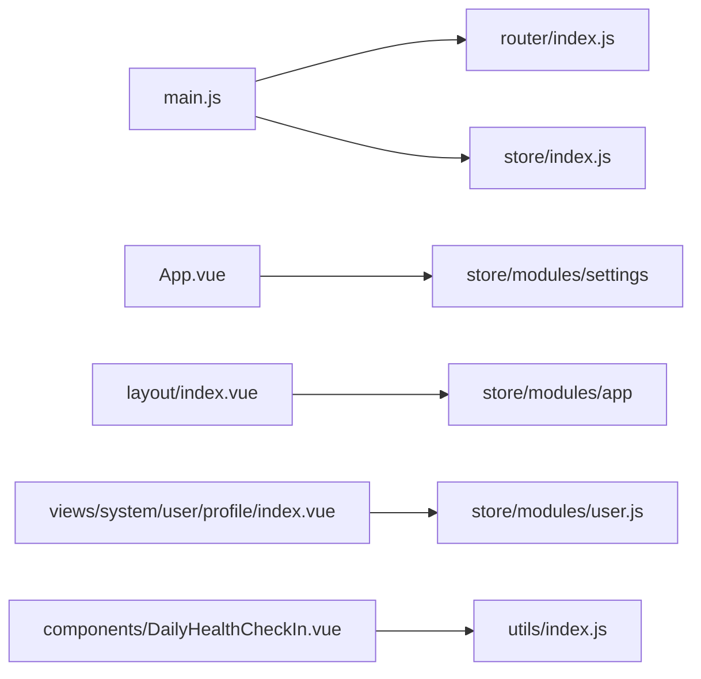

# Vue3 Composition API设计

<cite>
**本文档引用的文件**
- [main.js](file://XingChen-Vue3/src/main.js)
- [App.vue](file://XingChen-Vue3/src/App.vue)
- [index.js](file://XingChen-Vue3/src/router/index.js)
- [index.js](file://XingChen-Vue3/src/store/index.js)
- [user.js](file://XingChen-Vue3/src/store/modules/user.js)
- [DailyHealthCheckIn.vue](file://XingChen-Vue3/src/components/DailyHealthCheckIn.vue)
- [index.vue](file://XingChen-Vue3/src/layout/index.vue)
- [index.vue](file://XingChen-Vue3/src/views/system/user/profile/index.vue)
- [index.js](file://XingChen-Vue3/src/utils/index.js)
</cite>

## 目录
1. [引言](#引言)
2. [项目结构](#项目结构)
3. [核心组件](#核心组件)
4. [架构总览](#架构总览)
5. [详细组件分析](#详细组件分析)
6. [依赖关系分析](#依赖关系分析)
7. [性能考虑](#性能考虑)
8. [故障排查指南](#故障排查指南)
9. [结论](#结论)
10. [附录](#附录)

## 引言
本文件面向希望系统掌握并应用 Vue3 Composition API 的开发者，围绕响应式 API（ref、reactive、computed、watch/watchEffect）、生命周期钩子、组合函数设计与复用、以及在项目中的组织方式展开。文档以实际仓库中的组件与模块为依据，提供可操作的最佳实践与迁移建议。

## 项目结构
本项目采用前后端分离架构，前端基于 Vue3 + Vite，使用 Composition API 与 Pinia 状态管理，结合 Element Plus 组件库与自定义指令、插件体系。核心入口在应用初始化阶段完成全局组件、指令、插件注册，并挂载路由与状态管理。

图表来源
- [main.js:1-85](file://XingChen-Vue3/src/main.js#L1-L85)
- [App.vue:1-16](file://XingChen-Vue3/src/App.vue#L1-L16)
- [index.js:1-197](file://XingChen-Vue3/src/router/index.js#L1-L197)
- [index.js:1-4](file://XingChen-Vue3/src/store/index.js#L1-L4)
- [user.js:1-94](file://XingChen-Vue3/src/store/modules/user.js#L1-L94)
- [index.vue:1-116](file://XingChen-Vue3/src/layout/index.vue#L1-L116)
- [index.vue:1-95](file://XingChen-Vue3/src/views/system/user/profile/index.vue#L1-L95)
- [DailyHealthCheckIn.vue:1-281](file://XingChen-Vue3/src/components/DailyHealthCheckIn.vue#L1-L281)
- [index.js:1-391](file://XingChen-Vue3/src/utils/index.js#L1-L391)

章节来源
- [main.js:1-85](file://XingChen-Vue3/src/main.js#L1-L85)
- [index.js:1-197](file://XingChen-Vue3/src/router/index.js#L1-L197)
- [index.js:1-4](file://XingChen-Vue3/src/store/index.js#L1-L4)

## 核心组件
- 应用入口与全局装配：在入口文件中完成 Element Plus、全局组件、指令、插件、SVG 图标、权限控制等初始化，并挂载路由与状态管理。
- 应用根组件：通过 script setup 定义生命周期钩子，实现主题样式初始化。
- 路由系统：常量路由与动态路由分离，支持权限控制与滚动行为。
- 状态管理：基于 Pinia 的模块化 Store，用户模块封装登录、登出、获取用户信息等动作。
- 视图与组件：布局容器负责设备适配与侧边栏控制；业务视图与功能组件演示响应式与生命周期的实际使用。

章节来源
- [main.js:1-85](file://XingChen-Vue3/src/main.js#L1-L85)
- [App.vue:5-14](file://XingChen-Vue3/src/App.vue#L5-L14)
- [index.js:1-197](file://XingChen-Vue3/src/router/index.js#L1-L197)
- [index.js:1-4](file://XingChen-Vue3/src/store/index.js#L1-L4)
- [user.js:9-94](file://XingChen-Vue3/src/store/modules/user.js#L9-L94)

## 架构总览
下图展示了从应用初始化到视图渲染的关键交互路径，体现 Composition API 在组件与模块中的使用方式。

图表来源
- [main.js:47-84](file://XingChen-Vue3/src/main.js#L47-L84)
- [App.vue:9-14](file://XingChen-Vue3/src/App.vue#L9-L14)
- [index.js:185-197](file://XingChen-Vue3/src/router/index.js#L185-L197)
- [index.js:1-4](file://XingChen-Vue3/src/store/index.js#L1-L4)
- [user.js:39-75](file://XingChen-Vue3/src/store/modules/user.js#L39-L75)
- [index.vue:87-93](file://XingChen-Vue3/src/views/system/user/profile/index.vue#L87-L93)

## 详细组件分析

### 响应式 API 实践：ref、reactive、computed、watch/watchEffect
- ref：用于声明可变标量或对象引用，典型场景包括表单输入、步骤索引、布尔开关等。
- reactive：用于包裹复杂对象，集中管理状态，便于在模板与逻辑中统一访问。
- computed：用于派生状态，减少模板中的计算逻辑，提升可读性与性能。
- watch/watchEffect：用于监听状态变化并执行副作用，watch 精准监听特定响应式源，watchEffect 自动追踪其内部使用的响应式依赖。

示例参考文件路径
- [DailyHealthCheckIn.vue:61-104](file://XingChen-Vue3/src/components/DailyHealthCheckIn.vue#L61-L104)
- [index.vue:71-77](file://XingChen-Vue3/src/views/system/user/profile/index.vue#L71-L77)
- [index.vue:40-53](file://XingChen-Vue3/src/layout/index.vue#L40-L53)

章节来源
- [DailyHealthCheckIn.vue:61-137](file://XingChen-Vue3/src/components/DailyHealthCheckIn.vue#L61-L137)
- [index.vue:71-93](file://XingChen-Vue3/src/views/system/user/profile/index.vue#L71-L93)
- [index.vue:40-53](file://XingChen-Vue3/src/layout/index.vue#L40-L53)

### 生命周期钩子在 Composition API 中的应用
- onMounted：在 DOM 挂载完成后执行，适合进行主题初始化、数据请求、事件绑定等。
- nextTick：等待下一次 DOM 更新批处理结束后执行，确保样式或布局计算基于最新 DOM。
- onUnmounted：清理副作用（如定时器、订阅），避免内存泄漏。

示例参考文件路径
- [App.vue:9-14](file://XingChen-Vue3/src/App.vue#L9-L14)
- [index.vue:87-93](file://XingChen-Vue3/src/views/system/user/profile/index.vue#L87-L93)

章节来源
- [App.vue:9-14](file://XingChen-Vue3/src/App.vue#L9-L14)
- [index.vue:87-93](file://XingChen-Vue3/src/views/system/user/profile/index.vue#L87-L93)

### 组合函数设计模式与复用策略
- 将可复用的逻辑抽取为组合函数，例如设备检测、窗口尺寸监听等，便于在多个组件中共享。
- 将状态与动作封装在 Store 模块中，通过 defineStore 提供统一的状态访问与变更接口。
- 将通用工具函数集中管理，减少重复代码，提升可维护性。

示例参考文件路径
- [index.vue:17-17](file://XingChen-Vue3/src/layout/index.vue#L17-L17)
- [user.js:9-94](file://XingChen-Vue3/src/store/modules/user.js#L9-L94)
- [index.js:1-391](file://XingChen-Vue3/src/utils/index.js#L1-L391)

章节来源
- [index.vue:17-17](file://XingChen-Vue3/src/layout/index.vue#L17-L17)
- [user.js:9-94](file://XingChen-Vue3/src/store/modules/user.js#L9-L94)
- [index.js:1-391](file://XingChen-Vue3/src/utils/index.js#L1-L391)

### 项目组织与逻辑解耦
- 入口文件集中装配：路由、状态、插件、指令、全局组件与工具方法，降低各组件耦合度。
- 视图层与组件层分离：布局容器负责整体结构与设备适配，业务视图负责具体页面逻辑，功能组件负责可复用的 UI 与交互。
- Store 模块化：按领域拆分模块（如用户、字典、权限等），每个模块暴露明确的 actions 与 getters。

示例参考文件路径
- [main.js:47-84](file://XingChen-Vue3/src/main.js#L47-L84)
- [index.vue:1-116](file://XingChen-Vue3/src/layout/index.vue#L1-L116)
- [user.js:1-94](file://XingChen-Vue3/src/store/modules/user.js#L1-L94)

章节来源
- [main.js:47-84](file://XingChen-Vue3/src/main.js#L47-L84)
- [index.vue:1-116](file://XingChen-Vue3/src/layout/index.vue#L1-L116)
- [user.js:1-94](file://XingChen-Vue3/src/store/modules/user.js#L1-L94)

### 从 Options API 到 Composition API 的迁移要点
- 将 data 中的对象迁移到 reactive 或直接使用 ref/computed。
- 将 methods 中的方法直接作为普通函数，配合响应式变量使用。
- 将 computed 迁移为 computed 或在模板中直接使用表达式。
- 将 watch 迁移为 watch 或 watchEffect，注意依赖收集与清理。
- 将生命周期钩子迁移为对应的 onMounted、onUnmounted 等。
- 将混入（mixins）替换为组合函数与模块化 Store。

示例参考文件路径
- [index.vue:71-93](file://XingChen-Vue3/src/views/system/user/profile/index.vue#L71-L93)
- [DailyHealthCheckIn.vue:61-137](file://XingChen-Vue3/src/components/DailyHealthCheckIn.vue#L61-L137)

章节来源
- [index.vue:71-93](file://XingChen-Vue3/src/views/system/user/profile/index.vue#L71-L93)
- [DailyHealthCheckIn.vue:61-137](file://XingChen-Vue3/src/components/DailyHealthCheckIn.vue#L61-L137)

### 关键流程图：健康打卡组件的交互与状态流转

图表来源
- [DailyHealthCheckIn.vue:61-137](file://XingChen-Vue3/src/components/DailyHealthCheckIn.vue#L61-L137)

## 依赖关系分析
- 应用入口依赖路由与状态管理，二者分别提供导航与状态能力。
- 根组件依赖设置模块与工具函数，用于主题初始化。
- 布局容器依赖应用与设置模块，实现侧边栏、标签页、固定头部等功能。
- 业务视图依赖用户模块，发起用户信息获取与切换标签页。
- 功能组件依赖响应式 API 与生命周期钩子，实现交互与状态管理。

图表来源
- [main.js:1-85](file://XingChen-Vue3/src/main.js#L1-L85)
- [index.js:1-197](file://XingChen-Vue3/src/router/index.js#L1-L197)
- [index.js:1-4](file://XingChen-Vue3/src/store/index.js#L1-L4)
- [App.vue:5-14](file://XingChen-Vue3/src/App.vue#L5-L14)
- [index.vue:1-116](file://XingChen-Vue3/src/layout/index.vue#L1-L116)
- [index.vue:1-95](file://XingChen-Vue3/src/views/system/user/profile/index.vue#L1-L95)
- [user.js:1-94](file://XingChen-Vue3/src/store/modules/user.js#L1-L94)
- [DailyHealthCheckIn.vue:1-281](file://XingChen-Vue3/src/components/DailyHealthCheckIn.vue#L1-L281)
- [index.js:1-391](file://XingChen-Vue3/src/utils/index.js#L1-L391)

章节来源
- [main.js:1-85](file://XingChen-Vue3/src/main.js#L1-L85)
- [index.js:1-197](file://XingChen-Vue3/src/router/index.js#L1-L197)
- [index.js:1-4](file://XingChen-Vue3/src/store/index.js#L1-L4)
- [App.vue:5-14](file://XingChen-Vue3/src/App.vue#L5-L14)
- [index.vue:1-116](file://XingChen-Vue3/src/layout/index.vue#L1-L116)
- [index.vue:1-95](file://XingChen-Vue3/src/views/system/user/profile/index.vue#L1-L95)
- [user.js:1-94](file://XingChen-Vue3/src/store/modules/user.js#L1-L94)
- [DailyHealthCheckIn.vue:1-281](file://XingChen-Vue3/src/components/DailyHealthCheckIn.vue#L1-L281)
- [index.js:1-391](file://XingChen-Vue3/src/utils/index.js#L1-L391)

## 性能考虑
- 合理使用 computed：对昂贵计算进行缓存，避免在模板中重复计算。
- 精准监听 watch：优先使用 watch 而非 watchEffect，减少不必要的重渲染。
- 组件拆分与懒加载：路由级懒加载与组件级懒加载降低首屏负担。
- 工具函数优化：避免在渲染路径中进行重型运算，必要时使用防抖/节流。
- 主题与样式：通过 CSS 变量与动态类名减少样式切换成本。

## 故障排查指南
- 生命周期未正确执行：确认在 script setup 中使用正确的生命周期钩子，并在 onMounted 中进行 DOM 依赖操作。
- 响应式状态未更新：检查是否使用 ref/reactive 包裹状态，是否通过 .value 访问标量引用。
- Store 动作未生效：确认动作在模块中定义并导出，组件中正确调用。
- 路由权限不生效：检查动态路由与权限标识匹配情况，确保路由元信息正确。

章节来源
- [App.vue:9-14](file://XingChen-Vue3/src/App.vue#L9-L14)
- [DailyHealthCheckIn.vue:61-137](file://XingChen-Vue3/src/components/DailyHealthCheckIn.vue#L61-L137)
- [user.js:21-94](file://XingChen-Vue3/src/store/modules/user.js#L21-L94)
- [index.js:1-197](file://XingChen-Vue3/src/router/index.js#L1-L197)

## 结论
本项目以 Composition API 为核心，结合 Pinia 与 Element Plus，实现了清晰的组件职责划分与良好的可复用性。通过响应式 API、生命周期钩子与组合函数模式，开发者可以更灵活地组织逻辑、提升可维护性与性能。建议在新功能开发中优先采用 Composition API，并逐步迁移旧有 Options API 组件。

## 附录
- 响应式 API 使用清单
  - ref：标量与对象引用
  - reactive：复杂对象状态
  - computed：派生状态
  - watch/watchEffect：副作用监听
- 生命周期钩子清单
  - onMounted/onUnmounted：挂载/卸载
  - nextTick：DOM 更新后回调
- 组合函数与 Store 模块化建议
  - 将跨组件逻辑抽取为组合函数
  - 将状态与动作封装在模块化 Store 中
  - 将通用工具函数集中管理