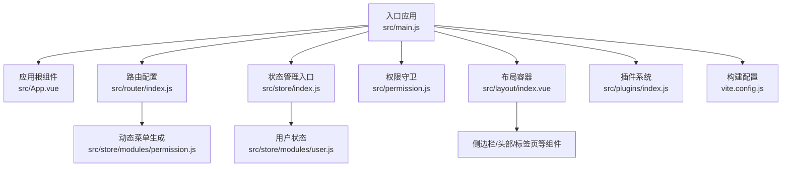
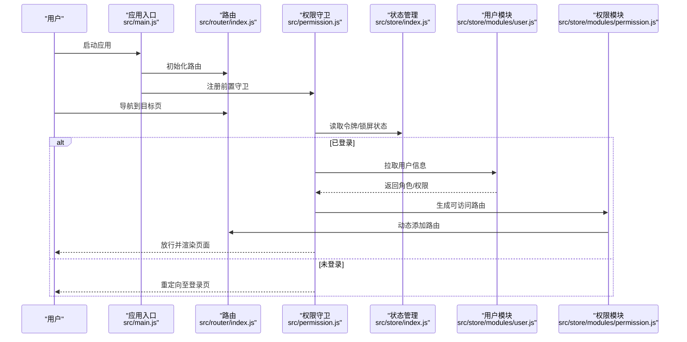
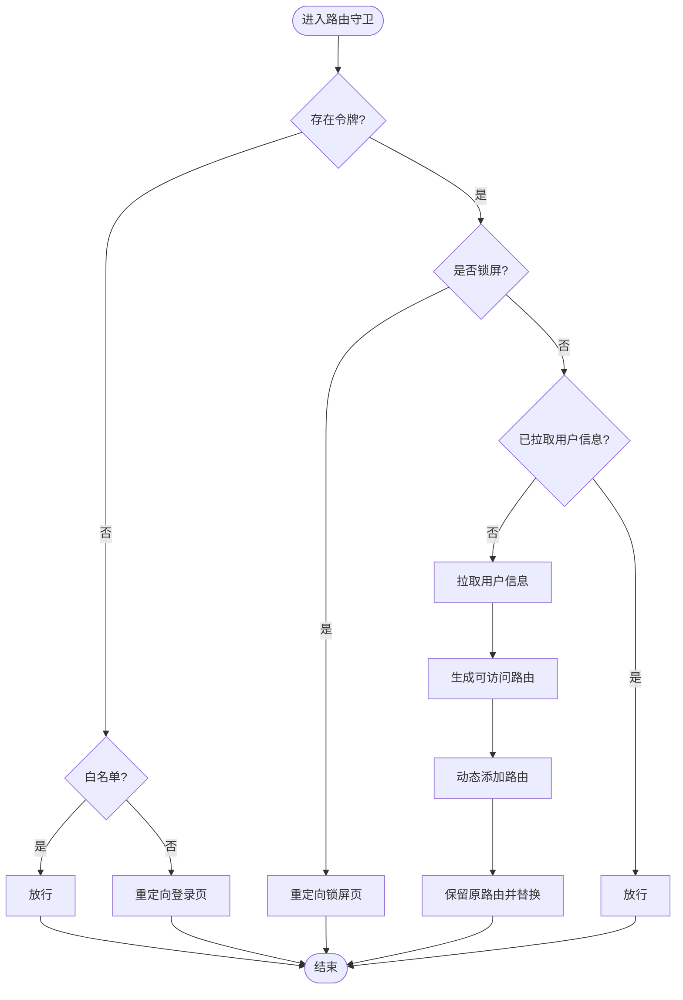
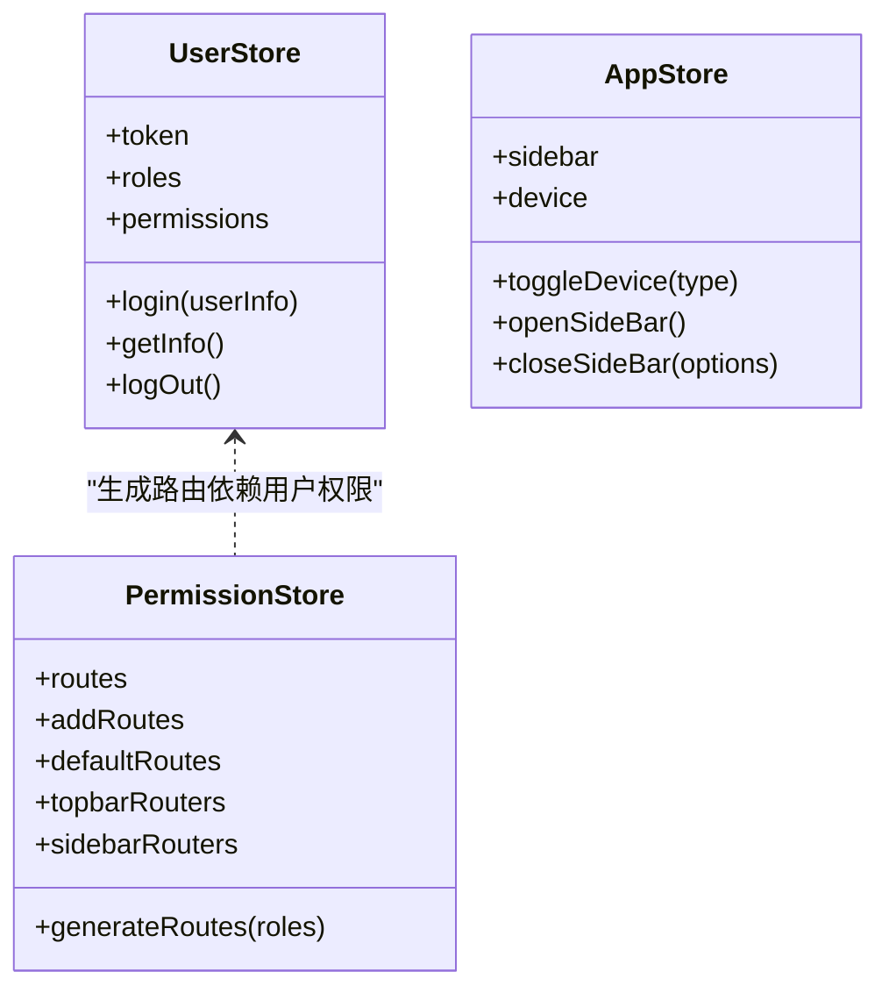
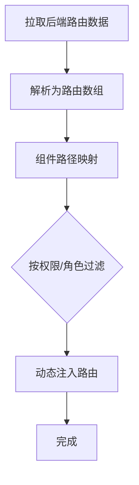
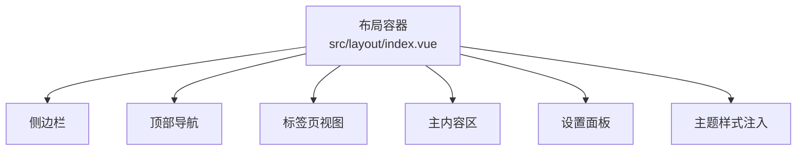
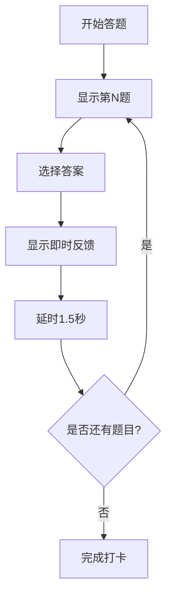
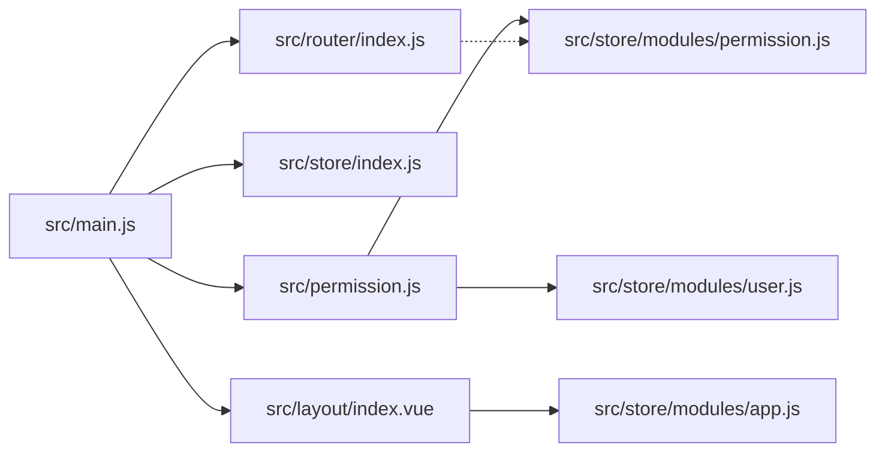

# 前端架构设计

<cite>
**本文引用的文件**
- [XingChen-Vue3/src/main.js](file://XingChen-Vue3/src/main.js)
- [XingChen-Vue3/src/App.vue](file://XingChen-Vue3/src/App.vue)
- [XingChen-Vue3/vite.config.js](file://XingChen-Vue3/vite.config.js)
- [XingChen-Vue3/package.json](file://XingChen-Vue3/package.json)
- [XingChen-Vue3/src/router/index.js](file://XingChen-Vue3/src/router/index.js)
- [XingChen-Vue3/src/permission.js](file://XingChen-Vue3/src/permission.js)
- [XingChen-Vue3/src/layout/index.vue](file://XingChen-Vue3/src/layout/index.vue)
- [XingChen-Vue3/src/utils/permission.js](file://XingChen-Vue3/src/utils/permission.js)
- [XingChen-Vue3/src/directive/permission/hasPermi.js](file://XingChen-Vue3/src/directive/permission/hasPermi.js)
- [XingChen-Vue3/src/store/index.js](file://XingChen-Vue3/src/store/index.js)
- [XingChen-Vue3/src/store/modules/user.js](file://XingChen-Vue3/src/store/modules/user.js)
- [XingChen-Vue3/src/store/modules/permission.js](file://XingChen-Vue3/src/store/modules/permission.js)
- [XingChen-Vue3/src/components/DailyHealthCheckIn.vue](file://XingChen-Vue3/src/components/DailyHealthCheckIn.vue)
- [XingChen-Vue3/src/views/index.vue](file://XingChen-Vue3/src/views/index.vue)
- [XingChen-Vue3/src/plugins/index.js](file://XingChen-Vue3/src/plugins/index.js)
</cite>

## 目录
1. [引言](#引言)
2. [项目结构](#项目结构)
3. [核心组件](#核心组件)
4. [架构总览](#架构总览)
5. [详细组件分析](#详细组件分析)
6. [依赖关系分析](#依赖关系分析)
7. [性能考虑](#性能考虑)
8. [故障排查指南](#故障排查指南)
9. [结论](#结论)
10. [附录](#附录)

## 引言
本文件面向前端架构设计，围绕 Vue3 技术栈与 Composition API 的应用，系统梳理项目在路由配置、权限控制、动态菜单生成、Pinia 状态管理、Element Plus 组件库、响应式布局与构建优化等方面的实现方式，并提供组件树结构图、状态流转图与路由导航图，帮助开发者快速理解与高效迭代。

## 项目结构
项目采用前后端分离的单页应用（SPA）架构，前端以 Vite 作为构建工具，Vue Router 提供路由能力，Pinia 实现状态管理，Element Plus 提供 UI 组件库，配合自定义指令与插件体系实现权限控制与功能增强。

图表来源
- [XingChen-Vue3/src/main.js:1-85](file://XingChen-Vue3/src/main.js#L1-L85)
- [XingChen-Vue3/src/App.vue:1-16](file://XingChen-Vue3/src/App.vue#L1-L16)
- [XingChen-Vue3/src/router/index.js:1-197](file://XingChen-Vue3/src/router/index.js#L1-L197)
- [XingChen-Vue3/src/store/index.js:1-4](file://XingChen-Vue3/src/store/index.js#L1-L4)
- [XingChen-Vue3/src/permission.js:1-78](file://XingChen-Vue3/src/permission.js#L1-L78)
- [XingChen-Vue3/src/layout/index.vue:1-116](file://XingChen-Vue3/src/layout/index.vue#L1-L116)
- [XingChen-Vue3/src/plugins/index.js:1-19](file://XingChen-Vue3/src/plugins/index.js#L1-L19)
- [XingChen-Vue3/src/store/modules/permission.js:1-135](file://XingChen-Vue3/src/store/modules/permission.js#L1-L135)
- [XingChen-Vue3/src/store/modules/user.js:1-94](file://XingChen-Vue3/src/store/modules/user.js#L1-L94)
- [XingChen-Vue3/vite.config.js:1-80](file://XingChen-Vue3/vite.config.js#L1-L80)

章节来源
- [XingChen-Vue3/src/main.js:1-85](file://XingChen-Vue3/src/main.js#L1-L85)
- [XingChen-Vue3/src/router/index.js:1-197](file://XingChen-Vue3/src/router/index.js#L1-L197)
- [XingChen-Vue3/src/store/index.js:1-4](file://XingChen-Vue3/src/store/index.js#L1-L4)
- [XingChen-Vue3/src/permission.js:1-78](file://XingChen-Vue3/src/permission.js#L1-L78)
- [XingChen-Vue3/src/layout/index.vue:1-116](file://XingChen-Vue3/src/layout/index.vue#L1-L116)
- [XingChen-Vue3/src/plugins/index.js:1-19](file://XingChen-Vue3/src/plugins/index.js#L1-L19)
- [XingChen-Vue3/vite.config.js:1-80](file://XingChen-Vue3/vite.config.js#L1-L80)

## 核心组件
- 应用入口与全局装配
  - 创建应用实例、注册 Element Plus、全局组件、指令、插件与权限守卫，挂载全局工具方法与组件。
- 根组件与主题初始化
  - 读取设置仓库的主题配置，在挂载阶段初始化主题样式。
- 路由系统
  - 定义常量路由与动态路由，结合权限守卫按需注入动态路由。
- 权限控制
  - 基于路由元信息与用户权限/角色进行校验；提供指令与工具函数辅助页面元素级权限控制。
- 状态管理
  - 用户信息、权限路由、应用设置、标签页等状态集中管理，支持动态菜单生成与主题切换。
- 布局容器
  - 响应式布局、侧边栏、顶部导航、标签页视图与设置面板组合。
- 插件系统
  - 将常用能力（页签、认证、缓存、模态框、下载）以全局属性形式注入，统一调用入口。
- 构建与运行
  - Vite 配置代理、别名、打包输出与预览；package.json 定义脚本与依赖。

章节来源
- [XingChen-Vue3/src/main.js:1-85](file://XingChen-Vue3/src/main.js#L1-L85)
- [XingChen-Vue3/src/App.vue:1-16](file://XingChen-Vue3/src/App.vue#L1-L16)
- [XingChen-Vue3/src/router/index.js:1-197](file://XingChen-Vue3/src/router/index.js#L1-L197)
- [XingChen-Vue3/src/permission.js:1-78](file://XingChen-Vue3/src/permission.js#L1-L78)
- [XingChen-Vue3/src/store/modules/user.js:1-94](file://XingChen-Vue3/src/store/modules/user.js#L1-L94)
- [XingChen-Vue3/src/store/modules/permission.js:1-135](file://XingChen-Vue3/src/store/modules/permission.js#L1-L135)
- [XingChen-Vue3/src/layout/index.vue:1-116](file://XingChen-Vue3/src/layout/index.vue#L1-L116)
- [XingChen-Vue3/src/plugins/index.js:1-19](file://XingChen-Vue3/src/plugins/index.js#L1-L19)
- [XingChen-Vue3/vite.config.js:1-80](file://XingChen-Vue3/vite.config.js#L1-L80)

## 架构总览
下图展示了从应用启动到路由导航、权限校验与状态管理的整体交互：

图表来源
- [XingChen-Vue3/src/main.js:1-85](file://XingChen-Vue3/src/main.js#L1-L85)
- [XingChen-Vue3/src/router/index.js:1-197](file://XingChen-Vue3/src/router/index.js#L1-L197)
- [XingChen-Vue3/src/permission.js:1-78](file://XingChen-Vue3/src/permission.js#L1-L78)
- [XingChen-Vue3/src/store/modules/user.js:1-94](file://XingChen-Vue3/src/store/modules/user.js#L1-L94)
- [XingChen-Vue3/src/store/modules/permission.js:1-135](file://XingChen-Vue3/src/store/modules/permission.js#L1-L135)

## 详细组件分析

### 路由与权限控制
- 路由配置
  - 常量路由：登录、注册、404、401、首页、锁定屏、个人中心等。
  - 动态路由：基于权限标识（如 system:user:edit）在运行时注入。
- 权限守卫
  - 白名单放行、锁屏拦截、无令牌重定向登录、首次进入拉取用户信息并生成路由。
- 页面级权限
  - 工具函数与指令：支持按权限或角色进行元素级隐藏/显示。

图表来源
- [XingChen-Vue3/src/permission.js:1-78](file://XingChen-Vue3/src/permission.js#L1-L78)
- [XingChen-Vue3/src/store/modules/user.js:1-94](file://XingChen-Vue3/src/store/modules/user.js#L1-L94)
- [XingChen-Vue3/src/store/modules/permission.js:1-135](file://XingChen-Vue3/src/store/modules/permission.js#L1-L135)

章节来源
- [XingChen-Vue3/src/router/index.js:1-197](file://XingChen-Vue3/src/router/index.js#L1-L197)
- [XingChen-Vue3/src/permission.js:1-78](file://XingChen-Vue3/src/permission.js#L1-L78)
- [XingChen-Vue3/src/utils/permission.js:1-51](file://XingChen-Vue3/src/utils/permission.js#L1-L51)
- [XingChen-Vue3/src/directive/permission/hasPermi.js:1-28](file://XingChen-Vue3/src/directive/permission/hasPermi.js#L1-L28)

### Pinia 状态管理
- 用户模块
  - 维护 token、角色、权限、头像等；提供登录、获取用户信息、退出登录动作。
- 权限模块
  - 维护可访问路由集合、侧边栏/顶部路由、默认路由；负责从后端拉取路由并过滤生成。
- 应用模块（布局相关）
  - 侧边栏开关、设备类型、固定头部等。

图表来源
- [XingChen-Vue3/src/store/modules/user.js:1-94](file://XingChen-Vue3/src/store/modules/user.js#L1-L94)
- [XingChen-Vue3/src/store/modules/permission.js:1-135](file://XingChen-Vue3/src/store/modules/permission.js#L1-L135)

章节来源
- [XingChen-Vue3/src/store/modules/user.js:1-94](file://XingChen-Vue3/src/store/modules/user.js#L1-L94)
- [XingChen-Vue3/src/store/modules/permission.js:1-135](file://XingChen-Vue3/src/store/modules/permission.js#L1-L135)

### 动态菜单生成机制
- 后端返回路由树形结构，前端解析为可渲染路由。
- 组件路径映射：通过模块加载器将字符串组件名映射到实际组件。
- 权限过滤：根据路由声明的权限或角色数组进行过滤，仅注入具备访问权的路由。

图表来源
- [XingChen-Vue3/src/store/modules/permission.js:35-54](file://XingChen-Vue3/src/store/modules/permission.js#L35-L54)
- [XingChen-Vue3/src/store/modules/permission.js:116-132](file://XingChen-Vue3/src/store/modules/permission.js#L116-L132)
- [XingChen-Vue3/src/store/modules/permission.js:100-114](file://XingChen-Vue3/src/store/modules/permission.js#L100-L114)

章节来源
- [XingChen-Vue3/src/store/modules/permission.js:1-135](file://XingChen-Vue3/src/store/modules/permission.js#L1-L135)

### 布局与响应式设计
- 布局容器
  - 响应式断点监听，移动端自动收起侧边栏；支持固定头部、标签页视图与设置面板。
- 主题与样式
  - 通过设置模块读取主题变量，动态注入 CSS 变量，实现主题切换。
- 响应式栅格
  - 基于 Element Plus 的栅格系统，适配不同屏幕尺寸。

图表来源
- [XingChen-Vue3/src/layout/index.vue:1-116](file://XingChen-Vue3/src/layout/index.vue#L1-L116)
- [XingChen-Vue3/src/App.vue:1-16](file://XingChen-Vue3/src/App.vue#L1-L16)

章节来源
- [XingChen-Vue3/src/layout/index.vue:1-116](file://XingChen-Vue3/src/layout/index.vue#L1-L116)
- [XingChen-Vue3/src/App.vue:1-16](file://XingChen-Vue3/src/App.vue#L1-L16)

### 组件化开发与示例：每日健康打卡
- 组件职责
  - 渐进式问答、即时反馈、完成态展示。
- 响应式与动画
  - 使用计算属性与过渡动画实现步骤切换与反馈展示。
- 游戏化体验
  - 通过反馈文案与颜色区分正向/警示/危险状态，提升用户参与度。

图表来源
- [XingChen-Vue3/src/components/DailyHealthCheckIn.vue:109-136](file://XingChen-Vue3/src/components/DailyHealthCheckIn.vue#L109-L136)

章节来源
- [XingChen-Vue3/src/components/DailyHealthCheckIn.vue:1-281](file://XingChen-Vue3/src/components/DailyHealthCheckIn.vue#L1-L281)

### 首页视图与数据展示
- 数据卡片
  - 使用 Element Plus 图标与计数组件展示核心指标。
- 项目进度
  - 自定义进度条与扫描线效果，突出科技感。
- 系统动态
  - 时间轴组件展示系统日志与告警信息。

章节来源
- [XingChen-Vue3/src/views/index.vue:1-383](file://XingChen-Vue3/src/views/index.vue#L1-L383)

### 插件系统与全局能力
- 插件装配
  - 将页签、认证、缓存、模态框、下载等能力以全局属性注入，统一调用入口。
- 使用场景
  - 在业务组件中通过 this.$auth/$cache/$modal/$download 等便捷调用。

章节来源
- [XingChen-Vue3/src/plugins/index.js:1-19](file://XingChen-Vue3/src/plugins/index.js#L1-L19)

## 依赖关系分析
- 应用入口依赖路由、状态、指令、插件与权限守卫。
- 权限守卫依赖用户与权限模块，后者依赖路由配置与后端接口。
- 布局容器依赖应用与设置模块，受窗口尺寸变化影响。
- 组件层依赖 Element Plus 与自定义组件库。

图表来源
- [XingChen-Vue3/src/main.js:1-85](file://XingChen-Vue3/src/main.js#L1-L85)
- [XingChen-Vue3/src/router/index.js:1-197](file://XingChen-Vue3/src/router/index.js#L1-L197)
- [XingChen-Vue3/src/permission.js:1-78](file://XingChen-Vue3/src/permission.js#L1-L78)
- [XingChen-Vue3/src/layout/index.vue:1-116](file://XingChen-Vue3/src/layout/index.vue#L1-L116)
- [XingChen-Vue3/src/store/modules/user.js:1-94](file://XingChen-Vue3/src/store/modules/user.js#L1-L94)
- [XingChen-Vue3/src/store/modules/permission.js:1-135](file://XingChen-Vue3/src/store/modules/permission.js#L1-L135)

章节来源
- [XingChen-Vue3/src/main.js:1-85](file://XingChen-Vue3/src/main.js#L1-L85)
- [XingChen-Vue3/src/permission.js:1-78](file://XingChen-Vue3/src/permission.js#L1-L78)

## 性能考虑
- 路由懒加载与动态注入
  - 通过路由懒加载与按需注入减少首屏体积，提升首屏速度。
- 组件按需引入
  - Element Plus 按需引入与 SVG 图标注册，避免全量引入导致体积膨胀。
- 构建优化
  - Vite Rollup 输出命名策略、Source Map 控制、代理与预览配置，便于开发与生产优化。
- 状态与缓存
  - 合理划分状态粒度，避免不必要的响应式开销；利用缓存插件减少重复请求。
- 动画与渲染
  - 使用过渡动画与 KeepAlive 缓存页面，平衡用户体验与性能。

## 故障排查指南
- 登录后无法进入系统
  - 检查令牌是否存在、用户信息拉取是否成功、动态路由是否注入。
- 页面空白或组件不显示
  - 检查路由是否正确注入、组件路径映射是否匹配、权限过滤是否误判。
- 锁屏状态异常
  - 检查锁屏状态与守卫逻辑，确认未登录或白名单路径处理。
- 主题切换无效
  - 检查主题变量注入与 CSS 变量作用域，确保设置模块生效。

章节来源
- [XingChen-Vue3/src/permission.js:1-78](file://XingChen-Vue3/src/permission.js#L1-L78)
- [XingChen-Vue3/src/store/modules/permission.js:1-135](file://XingChen-Vue3/src/store/modules/permission.js#L1-L135)
- [XingChen-Vue3/src/App.vue:1-16](file://XingChen-Vue3/src/App.vue#L1-L16)

## 结论
本项目以 Vue3 + Composition API 为核心，结合 Vue Router 的动态路由与权限守卫、Pinia 的模块化状态管理、Element Plus 的组件生态与自定义指令/插件体系，形成一套清晰、可扩展、易维护的前端架构。通过路由懒加载、组件映射与构建优化，兼顾性能与开发效率；通过布局容器与主题系统，提供良好的用户体验与可定制性。

## 附录
- 构建与部署
  - 开发：npm run dev
  - 生产：npm run build:prod
  - 预览：npm run preview
- 关键配置
  - Vite 别名与代理、Rollup 输出命名、CSS PostCSS 插件等。

章节来源
- [XingChen-Vue3/package.json:8-12](file://XingChen-Vue3/package.json#L8-L12)
- [XingChen-Vue3/vite.config.js:15-61](file://XingChen-Vue3/vite.config.js#L15-L61)