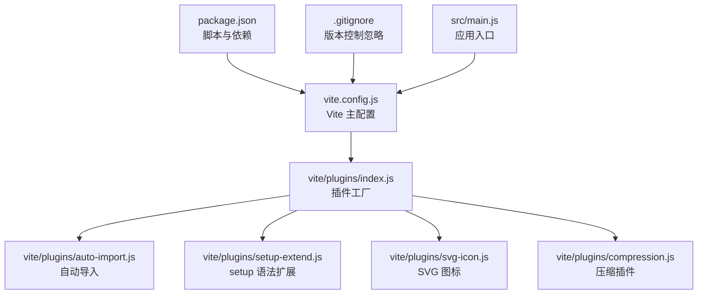
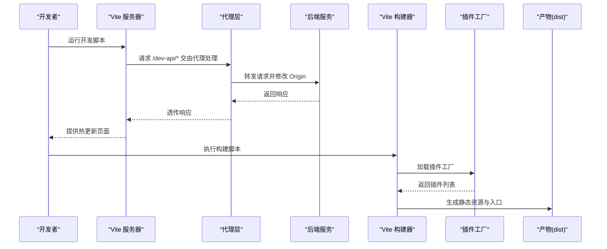
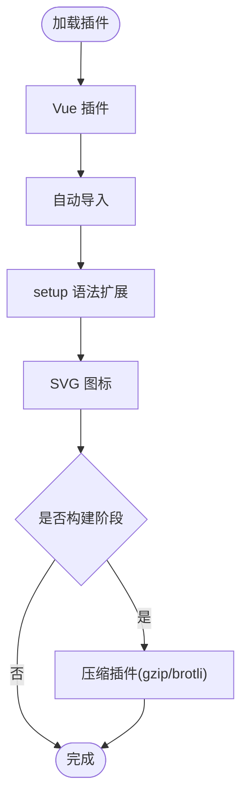
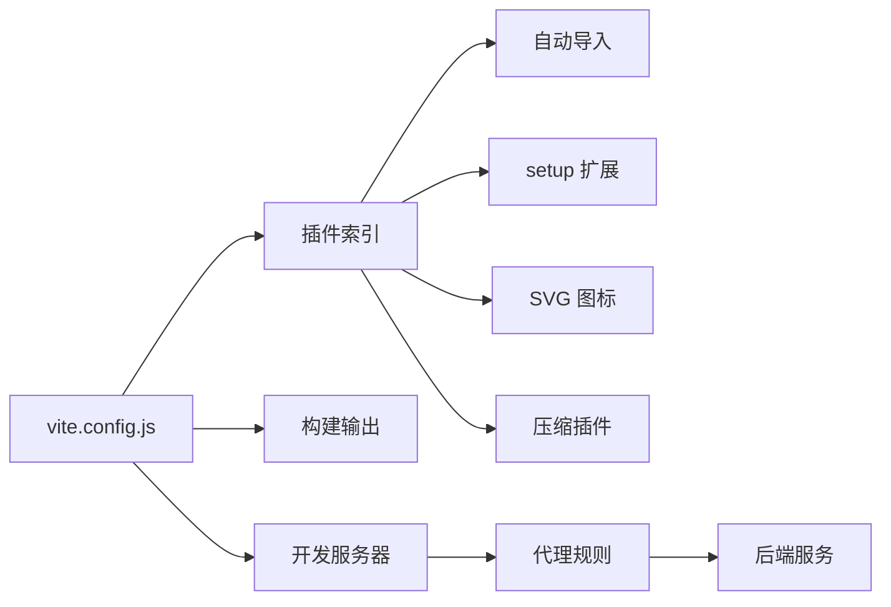

# 构建与部署配置

<cite>
**本文引用的文件**
- [vite.config.js](file://XingChen-Vue3/vite.config.js)
- [package.json](file://XingChen-Vue3/package.json)
- [插件索引](file://XingChen-Vue3/vite/plugins/index.js)
- [压缩插件](file://XingChen-Vue3/vite/plugins/compression.js)
- [.gitignore](file://XingChen-Vue3/.gitignore)
- [主入口](file://XingChen-Vue3/src/main.js)
</cite>

## 目录
1. [简介](#简介)
2. [项目结构](#项目结构)
3. [核心组件](#核心组件)
4. [架构总览](#架构总览)
5. [详细组件分析](#详细组件分析)
6. [依赖关系分析](#依赖关系分析)
7. [性能考虑](#性能考虑)
8. [故障排查指南](#故障排查指南)
9. [结论](#结论)
10. [附录](#附录)

## 简介
本文件系统性梳理健康管理系统前端工程的构建与部署配置，覆盖 Vite 开发服务器、构建输出、打包优化（代码分割、Tree Shaking、资源压缩、缓存策略）、静态资源部署、CDN 配置建议、环境变量管理、Git Hooks 与 CI/CD 流程集成要点，以及构建性能监控与部署故障排查方法。内容以仓库现有配置为基础，结合通用最佳实践进行说明。

## 项目结构
前端工程位于 XingChen-Vue3 目录，采用 Vite + Vue 3 技术栈，核心配置集中在 vite.config.js 中，并通过插件工厂函数统一加载各类插件。包脚本定义于 package.json，提供开发、构建与预览命令；.gitignore 控制版本控制忽略项。

**图表来源**
- [vite.config.js:1-80](file://XingChen-Vue3/vite.config.js#L1-L80)
- [插件索引:1-16](file://XingChen-Vue3/vite/plugins/index.js#L1-L16)
- [压缩插件:1-29](file://XingChen-Vue3/vite/plugins/compression.js#L1-L29)
- [package.json:1-54](file://XingChen-Vue3/package.json#L1-L54)
- [.gitignore:1-74](file://XingChen-Vue3/.gitignore#L1-L74)
- [主入口:1-85](file://XingChen-Vue3/src/main.js#L1-L85)

**章节来源**
- [vite.config.js:1-80](file://XingChen-Vue3/vite.config.js#L1-L80)
- [package.json:1-54](file://XingChen-Vue3/package.json#L1-L54)
- [.gitignore:1-74](file://XingChen-Vue3/.gitignore#L1-L74)
- [主入口:1-85](file://XingChen-Vue3/src/main.js#L1-L85)

## 核心组件
- 开发服务器与代理：本地开发端口、主机绑定、自动打开浏览器，以及后端接口代理规则，支持 dev-api 前缀重写与 OpenAPI 文档代理。
- 构建输出：产物目录、资源目录、源码映射策略、Rollup 输出命名规则（含哈希）。
- 路径解析：别名配置（~、@），扩展名解析顺序。
- 插件体系：Vue 官方插件、自动导入、setup 语法扩展、SVG 图标、按需启用压缩插件。
- 环境变量：通过 loadEnv 加载模式化环境变量，支持构建时开关（如压缩算法选择）。
- CSS 处理：PostCSS 插件移除 charset 规则，避免重复声明。

**章节来源**
- [vite.config.js:8-79](file://XingChen-Vue3/vite.config.js#L8-L79)
- [插件索引:8-15](file://XingChen-Vue3/vite/plugins/index.js#L8-L15)
- [压缩插件:3-28](file://XingChen-Vue3/vite/plugins/compression.js#L3-L28)

## 架构总览
下图展示从开发到构建的关键流程与组件交互：

**图表来源**
- [vite.config.js:44-61](file://XingChen-Vue3/vite.config.js#L44-L61)
- [vite.config.js:29-42](file://XingChen-Vue3/vite.config.js#L29-L42)
- [插件索引:8-15](file://XingChen-Vue3/vite/plugins/index.js#L8-L15)

## 详细组件分析

### 开发服务器与代理配置
- 端口与主机：开启本地可访问的开发服务器，便于多设备联调。
- 自动打开：提升开发体验。
- 代理规则：
  - dev-api 前缀：将 /dev-api* 请求转发至后端地址，并去除前缀。
  - OpenAPI 文档：对 /v3/api-docs/* 的请求进行目标地址转发。
- 适用场景：前后端分离开发，避免跨域问题；OpenAPI 文档在本地可直接访问。

**章节来源**
- [vite.config.js:44-61](file://XingChen-Vue3/vite.config.js#L44-L61)

### 构建输出与 Rollup 配置
- 源码映射：开发模式内联，生产模式关闭，平衡调试需求与产物体积。
- 输出目录：dist 作为产物根目录，assets 作为静态资源子目录。
- 警告阈值：调整 chunkSizeWarningLimit，降低大包警告干扰。
- Rollup 输出命名：
  - 入口与动态块：static/js/[name]-[hash].js
  - 资源文件：static/[ext]/[name]-[hash].[ext]
- 作用：通过哈希命名实现强缓存与失效刷新，便于 CDN 缓存策略落地。

**章节来源**
- [vite.config.js:29-42](file://XingChen-Vue3/vite.config.js#L29-L42)

### 路径解析与别名
- 别名：
  - ~ 指向项目根目录，便于相对路径引用。
  - @ 指向 src，统一业务代码入口。
- 扩展名：优先解析顺序包含 mjs/js/ts/jsx/tsx/json/vue，减少导入歧义。
- 作用：提升开发效率与路径一致性。

**章节来源**
- [vite.config.js:17-27](file://XingChen-Vue3/vite.config.js#L17-L27)

### 插件体系与优化
- 插件工厂：集中注册 Vue、自动导入、setup 语法扩展、SVG 图标、按需压缩。
- 自动导入：对 Vue、Vue Router、Pinia API 进行自动导入，减少样板代码。
- SVG 图标：收集指定目录的 SVG，生成符号 ID，支持构建时 SVGO 优化。
- 压缩插件：根据环境变量选择 gzip 或 brotli 压缩，保留原始文件，便于回滚与调试。

**图表来源**
- [插件索引:8-15](file://XingChen-Vue3/vite/plugins/index.js#L8-L15)
- [压缩插件:3-28](file://XingChen-Vue3/vite/plugins/compression.js#L3-L28)

**章节来源**
- [插件索引:1-16](file://XingChen-Vue3/vite/plugins/index.js#L1-L16)
- [自动导入插件:3-12](file://XingChen-Vue3/vite/plugins/auto-import.js#L3-L12)
- [SVG 图标插件:4-10](file://XingChen-Vue3/vite/plugins/svg-icon.js#L4-L10)
- [压缩插件:3-28](file://XingChen-Vue3/vite/plugins/compression.js#L3-L28)

### CSS 处理与 PostCSS
- 移除 charset 规则：避免重复声明导致的样式冲突或警告。
- 作用：保证样式构建稳定性与兼容性。

**章节来源**
- [vite.config.js:62-77](file://XingChen-Vue3/vite.config.js#L62-L77)

### 应用入口与全局能力
- 全局组件与指令注册：集中挂载分页、富文本、上传等组件与指令。
- Element Plus：按语言与尺寸配置全局组件库。
- SVG 图标：通过虚拟模块注册，统一使用与渲染。
- 作用：确保运行期全局可用性与一致的 UI 行为。

**章节来源**
- [主入口:17-82](file://XingChen-Vue3/src/main.js#L17-L82)

## 依赖关系分析
- 配置到插件：vite.config.js 通过插件工厂加载各功能插件，形成松耦合扩展点。
- 构建到产物：构建阶段依据 Rollup 输出规则生成带哈希的文件名，配合 CDN 缓存策略。
- 代理到后端：开发阶段通过代理将特定路径转发至后端，避免跨域与 CORS 配置复杂度。

**图表来源**
- [vite.config.js:8-79](file://XingChen-Vue3/vite.config.js#L8-L79)
- [插件索引:8-15](file://XingChen-Vue3/vite/plugins/index.js#L8-L15)

**章节来源**
- [vite.config.js:8-79](file://XingChen-Vue3/vite.config.js#L8-L79)
- [插件索引:8-15](file://XingChen-Vue3/vite/plugins/index.js#L8-L15)

## 性能考虑
- 代码分割与 Tree Shaking
  - 通过按需导入与自动导入减少冗余代码；保持 ES Module 形态有利于打包器进行死代码消除。
  - 将第三方库拆分为独立 chunk，结合哈希命名实现长效缓存。
- 资源压缩
  - 生产构建启用 gzip 或 brotli 压缩，显著降低传输体积；保留原始文件便于调试。
- 缓存策略
  - 使用静态资源命名中的哈希值，结合 CDN max-age 与 ETag 实现强缓存与智能刷新。
- 源码映射
  - 生产关闭源码映射，开发使用内联映射，兼顾调试与性能。
- 体积监控
  - 结合构建日志与 Rollup 输出统计，持续关注大依赖与重复引入。

[本节为通用性能建议，不直接分析具体文件]

## 故障排查指南
- 代理无效或 404
  - 检查代理前缀与后端地址是否匹配；确认请求路径是否以 /dev-api 开头。
  - 参考：[vite.config.js:48-60](file://XingChen-Vue3/vite.config.js#L48-L60)
- 构建失败或体积异常
  - 查看压缩插件是否正确启用；检查环境变量 VITE_BUILD_COMPRESS 是否包含期望算法。
  - 参考：[压缩插件:4-26](file://XingChen-Vue3/vite/plugins/compression.js#L4-L26)
- 资源未命中缓存
  - 确认 Rollup 输出命名规则已生效；核对 CDN 配置是否使用文件名哈希。
  - 参考：[vite.config.js:35-41](file://XingChen-Vue3/vite.config.js#L35-L41)
- 开发服务器无法访问
  - 确认 host 已设为 true，端口未被占用；浏览器访问本机 IP 地址而非仅 localhost。
  - 参考：[vite.config.js:44-47](file://XingChen-Vue3/vite.config.js#L44-L47)
- 版本控制误提交
  - dist、node_modules 等目录应被忽略；检查 .gitignore 内容。
  - 参考：[.gitignore:1-74](file://XingChen-Vue3/.gitignore#L1-L74)

**章节来源**
- [vite.config.js:35-41](file://XingChen-Vue3/vite.config.js#L35-L41)
- [vite.config.js:44-60](file://XingChen-Vue3/vite.config.js#L44-L60)
- [压缩插件:4-26](file://XingChen-Vue3/vite/plugins/compression.js#L4-L26)
- [.gitignore:1-74](file://XingChen-Vue3/.gitignore#L1-L74)

## 结论
本项目基于 Vite 的构建配置清晰、插件化扩展完善，具备良好的开发体验与可维护性。通过合理的代理、输出命名与压缩策略，能够满足生产环境的性能与稳定性要求。建议在 CI/CD 中固化构建脚本与环境变量，并结合 CDN 缓存策略与监控指标持续优化交付质量。

[本节为总结性内容，不直接分析具体文件]

## 附录

### 环境变量与脚本
- 环境变量加载：通过 loadEnv 按模式读取，支持在构建时切换压缩算法等行为。
- 脚本命令：
  - 开发：vite
  - 生产构建：vite build
  - 预览：vite preview
- 参考：
  - [vite.config.js:9-10](file://XingChen-Vue3/vite.config.js#L9-L10)
  - [package.json:8-12](file://XingChen-Vue3/package.json#L8-L12)

**章节来源**
- [vite.config.js:9-10](file://XingChen-Vue3/vite.config.js#L9-L10)
- [package.json:8-12](file://XingChen-Vue3/package.json#L8-L12)