# 状态管理设计

<cite>
**本文档引用的文件**
- [store/index.js](file://XingChen-Vue3/src/store/index.js)
- [store/modules/user.js](file://XingChen-Vue3/src/store/modules/user.js)
- [store/modules/app.js](file://XingChen-Vue3/src/store/modules/app.js)
- [store/modules/permission.js](file://XingChen-Vue3/src/store/modules/permission.js)
- [store/modules/settings.js](file://XingChen-Vue3/src/store/modules/settings.js)
- [store/modules/dict.js](file://XingChen-Vue3/src/store/modules/dict.js)
- [store/modules/tagsView.js](file://XingChen-Vue3/src/store/modules/tagsView.js)
- [store/modules/lock.js](file://XingChen-Vue3/src/store/modules/lock.js)
- [main.js](file://XingChen-Vue3/src/main.js)
- [auth.js](file://XingChen-Vue3/src/utils/auth.js)
- [cache.js](file://XingChen-Vue3/src/plugins/cache.js)
- [settings.js](file://XingChen-Vue3/src/settings.js)
- [package.json](file://XingChen-Vue3/package.json)
</cite>

## 目录
1. [引言](#引言)
2. [项目结构](#项目结构)
3. [核心组件](#核心组件)
4. [架构概览](#架构概览)
5. [详细组件分析](#详细组件分析)
6. [依赖关系分析](#依赖关系分析)
7. [性能考虑](#性能考虑)
8. [故障排除指南](#故障排除指南)
9. [结论](#结论)

## 引言

本项目采用Pinia作为状态管理解决方案，构建了完整的模块化状态管理体系。通过精心设计的store模块划分，实现了用户状态、应用状态、权限状态等核心业务领域的状态管理。本文档深入解析该状态管理架构的设计理念、实现细节和最佳实践。

## 项目结构

项目采用模块化的状态管理架构，所有store模块统一管理在`src/store/modules/`目录下：

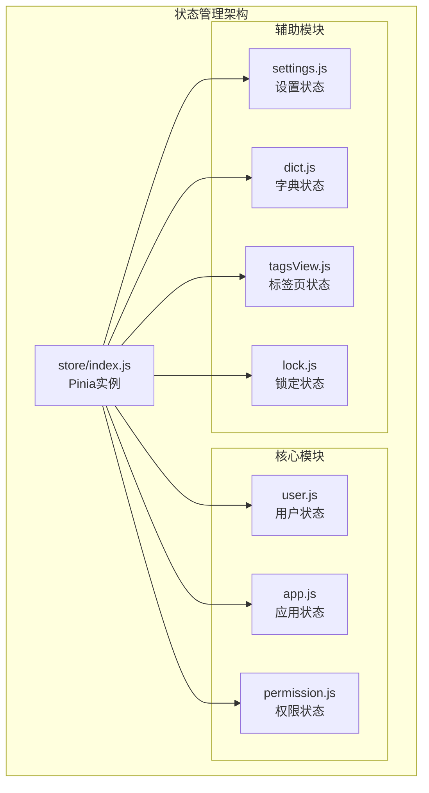

**图表来源**
- [store/index.js:1-4](file://XingChen-Vue3/src/store/index.js#L1-L4)
- [store/modules/user.js:1-94](file://XingChen-Vue3/src/store/modules/user.js#L1-L94)
- [store/modules/app.js:1-47](file://XingChen-Vue3/src/store/modules/app.js#L1-L47)

**章节来源**
- [store/index.js:1-4](file://XingChen-Vue3/src/store/index.js#L1-L4)
- [main.js:13-70](file://XingChen-Vue3/src/main.js#L13-L70)

## 核心组件

### Pinia实例配置

项目通过简单的配置创建Pinia实例，为整个应用提供状态管理能力：

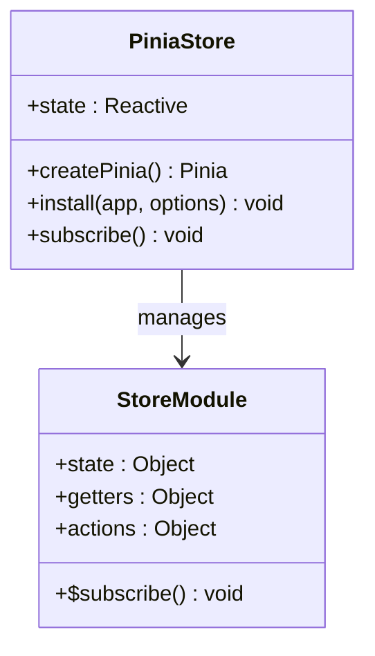

**图表来源**
- [store/index.js:1-4](file://XingChen-Vue3/src/store/index.js#L1-L4)

### 用户状态模块

用户状态模块是系统的核心状态管理单元，负责用户认证、个人信息管理和权限控制：

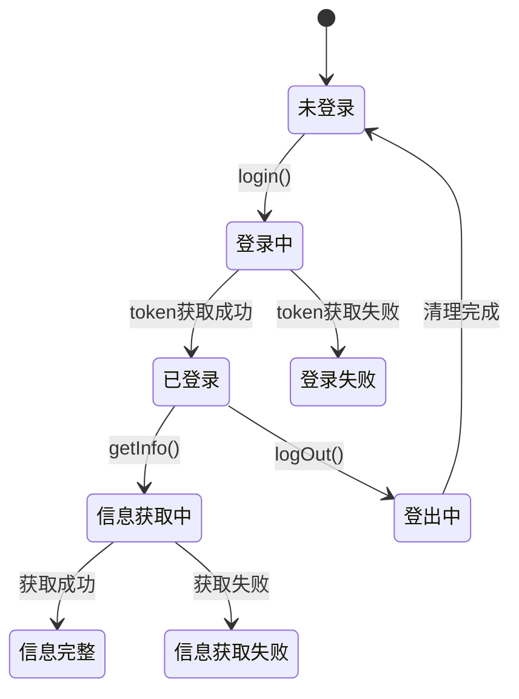

**图表来源**
- [store/modules/user.js:21-89](file://XingChen-Vue3/src/store/modules/user.js#L21-L89)

**章节来源**
- [store/modules/user.js:1-94](file://XingChen-Vue3/src/store/modules/user.js#L1-L94)

## 架构概览

### 状态管理架构设计

项目采用分层的状态管理架构，每个模块专注于特定的业务领域：

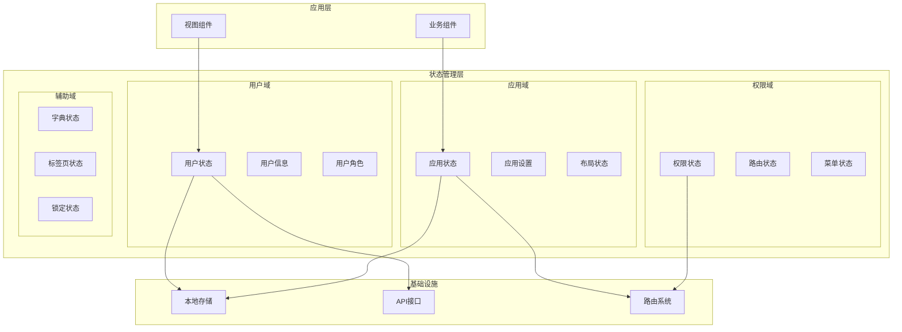

**图表来源**
- [store/modules/user.js:12-20](file://XingChen-Vue3/src/store/modules/user.js#L12-L20)
- [store/modules/app.js:6-14](file://XingChen-Vue3/src/store/modules/app.js#L6-L14)

## 详细组件分析

### 用户状态管理

用户状态模块实现了完整的用户生命周期管理：

#### 状态定义
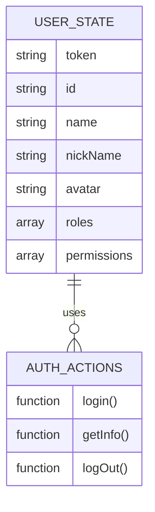

**图表来源**
- [store/modules/user.js:12-20](file://XingChen-Vue3/src/store/modules/user.js#L12-L20)

#### 认证流程
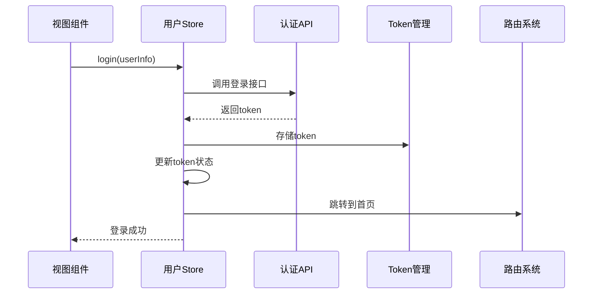

**图表来源**
- [store/modules/user.js:23-38](file://XingChen-Vue3/src/store/modules/user.js#L23-L38)
- [utils/auth.js:1-16](file://XingChen-Vue3/src/utils/auth.js#L1-L16)

**章节来源**
- [store/modules/user.js:1-94](file://XingChen-Vue3/src/store/modules/user.js#L1-L94)

### 应用状态管理

应用状态模块负责管理UI状态和用户体验设置：

#### 应用状态结构
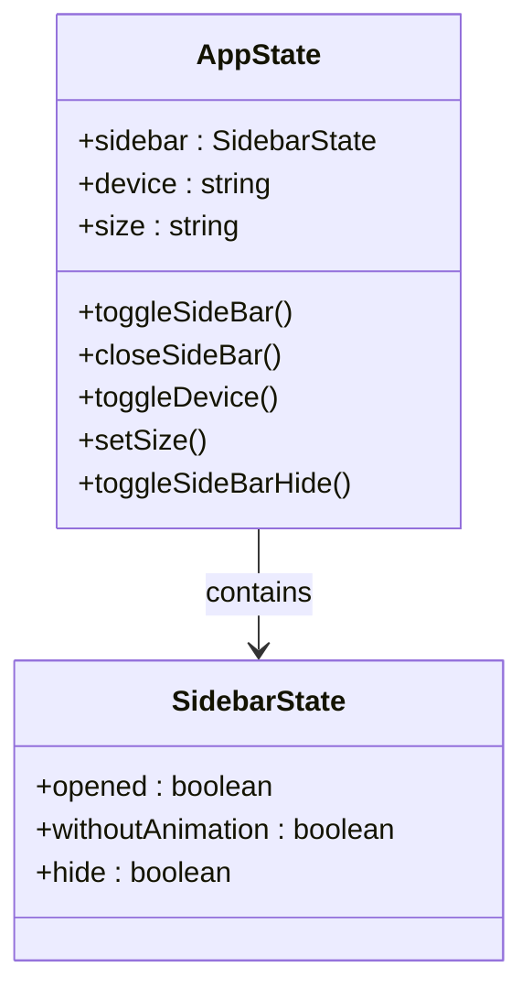

**图表来源**
- [store/modules/app.js:6-14](file://XingChen-Vue3/src/store/modules/app.js#L6-L14)

**章节来源**
- [store/modules/app.js:1-47](file://XingChen-Vue3/src/store/modules/app.js#L1-L47)

### 权限状态管理

权限状态模块实现了动态路由生成和权限控制：

#### 权限路由生成流程
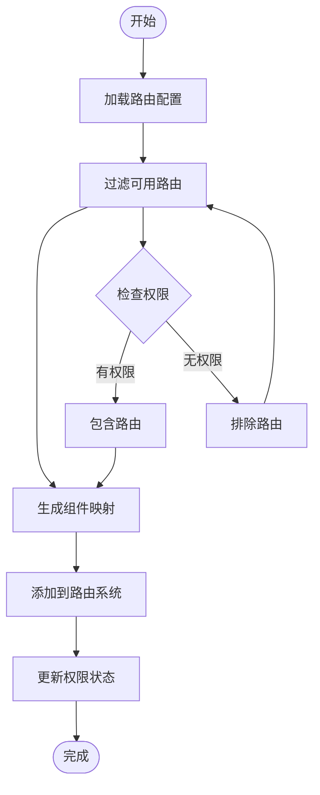

**图表来源**
- [store/modules/permission.js:35-54](file://XingChen-Vue3/src/store/modules/permission.js#L35-L54)

**章节来源**
- [store/modules/permission.js:1-135](file://XingChen-Vue3/src/store/modules/permission.js#L1-L135)

### 设置状态管理

设置状态模块提供了主题切换和布局配置功能：

#### 主题切换机制
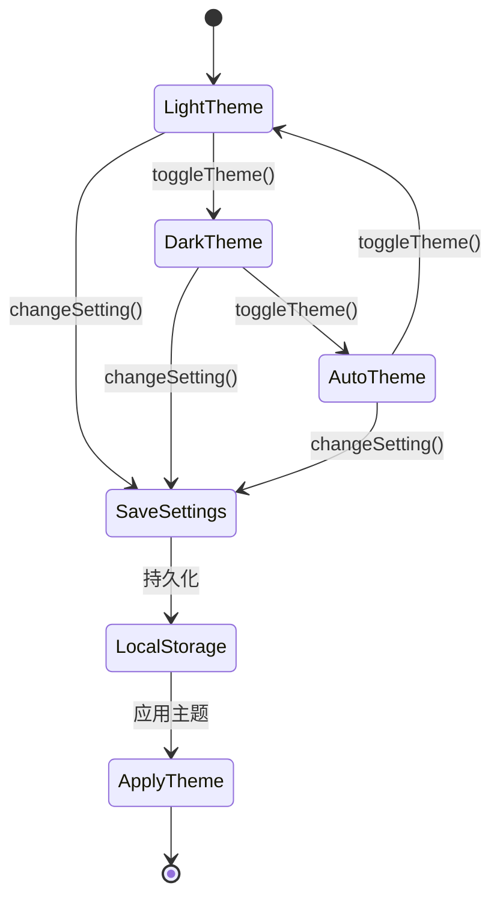

**图表来源**
- [store/modules/settings.js:44-48](file://XingChen-Vue3/src/store/modules/settings.js#L44-L48)

**章节来源**
- [store/modules/settings.js:1-53](file://XingChen-Vue3/src/store/modules/settings.js#L1-L53)

### 标签页状态管理

标签页状态模块实现了多页面标签页的完整生命周期管理：

#### 标签页操作流程
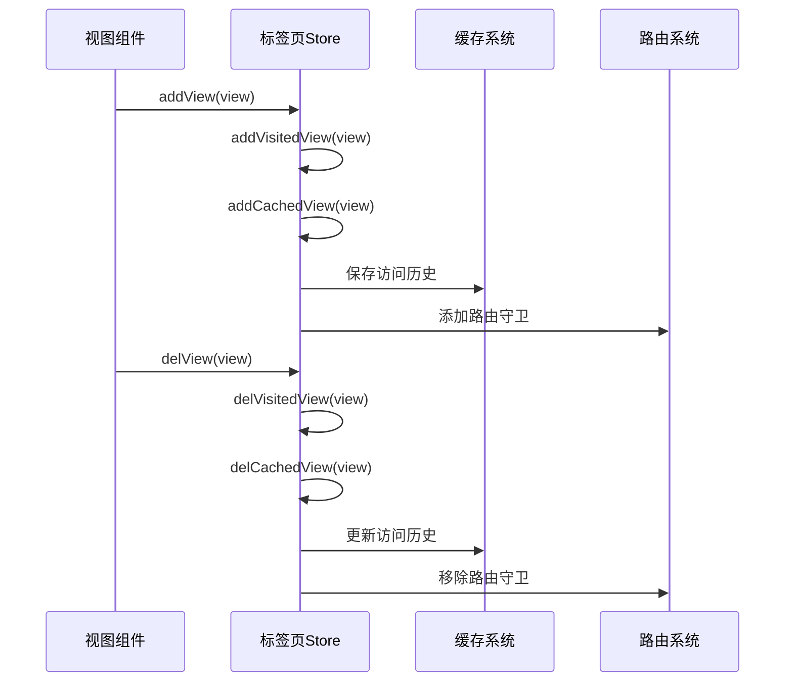

**图表来源**
- [store/modules/tagsView.js:33-76](file://XingChen-Vue3/src/store/modules/tagsView.js#L33-L76)

**章节来源**
- [store/modules/tagsView.js:1-227](file://XingChen-Vue3/src/store/modules/tagsView.js#L1-L227)

### 锁定状态管理

锁定状态模块提供了屏幕锁定和解锁功能：

#### 锁定状态流程
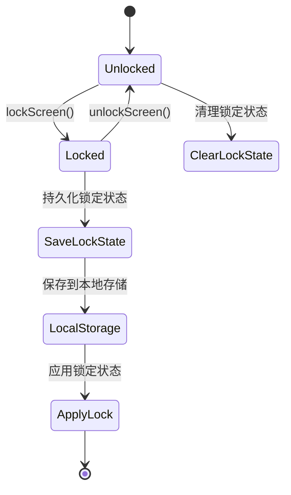

**图表来源**
- [store/modules/lock.js:10-23](file://XingChen-Vue3/src/store/modules/lock.js#L10-L23)

**章节来源**
- [store/modules/lock.js:1-28](file://XingChen-Vue3/src/store/modules/lock.js#L1-L28)

## 依赖关系分析

### 外部依赖关系

项目使用Pinia作为核心状态管理库，配合Vue 3的响应式系统：

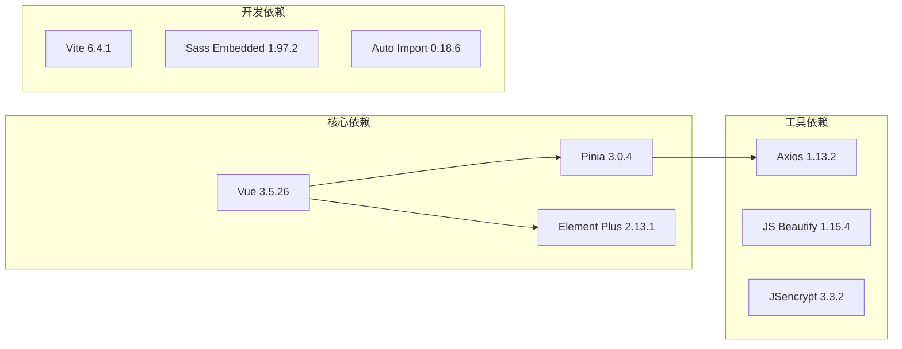

**图表来源**
- [package.json:18-36](file://XingChen-Vue3/package.json#L18-L36)

### 内部模块依赖

各状态模块之间的依赖关系清晰明确：

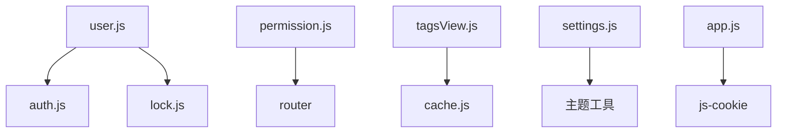

**图表来源**
- [store/modules/user.js:1-8](file://XingChen-Vue3/src/store/modules/user.js#L1-L8)
- [store/modules/permission.js:1-2](file://XingChen-Vue3/src/store/modules/permission.js#L1-L2)
- [store/modules/tagsView.js:1-2](file://XingChen-Vue3/src/store/modules/tagsView.js#L1-L2)

**章节来源**
- [package.json:1-54](file://XingChen-Vue3/package.json#L1-L54)

## 性能考虑

### 状态持久化策略

项目实现了多层次的状态持久化机制：

1. **用户认证状态**：Token存储在Cookie中，确保跨页面会话保持
2. **应用设置状态**：布局设置存储在localStorage中，实现主题和布局的持久化
3. **标签页状态**：访问历史存储在localStorage中，支持页面刷新后的状态恢复
4. **锁定状态**：屏幕锁定状态存储在localStorage中，确保锁定状态的一致性

### 内存管理策略

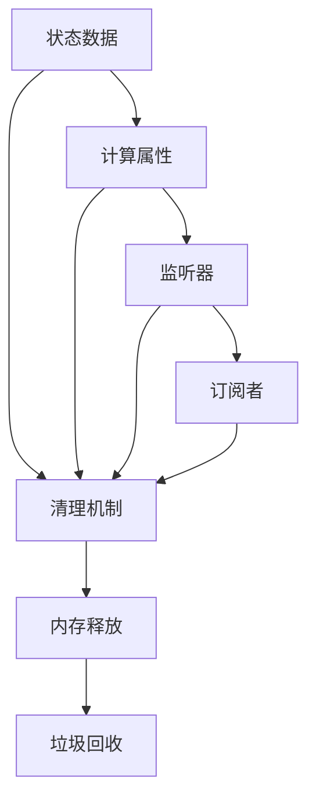

### 性能优化建议

1. **状态拆分**：将大型状态拆分为多个小模块，避免不必要的状态更新
2. **计算属性缓存**：合理使用计算属性，避免重复计算
3. **懒加载组件**：动态导入大型组件，减少初始包体积
4. **状态压缩**：对大型数组和对象进行压缩存储

## 故障排除指南

### 常见问题诊断

#### 状态不同步问题
- 检查状态更新是否在正确的组件上下文中执行
- 确认状态变更触发了相应的响应式更新
- 验证状态持久化是否正确配置

#### 权限控制失效
- 检查用户角色和权限标识是否正确设置
- 验证路由守卫的权限检查逻辑
- 确认权限状态与后端数据的一致性

#### 标签页状态异常
- 检查标签页缓存的清理机制
- 验证路由参数的变化处理
- 确认标签页状态的持久化存储

**章节来源**
- [store/modules/user.js:76-89](file://XingChen-Vue3/src/store/modules/user.js#L76-L89)
- [store/modules/tagsView.js:135-159](file://XingChen-Vue3/src/store/modules/tagsView.js#L135-L159)

## 结论

本项目的状态管理设计体现了现代前端应用的最佳实践：

1. **模块化架构**：清晰的模块划分使得状态管理易于维护和扩展
2. **响应式设计**：充分利用Vue 3的响应式系统，实现高效的状态更新
3. **持久化策略**：多层次的状态持久化确保用户体验的一致性
4. **性能优化**：合理的状态拆分和缓存策略提升了应用性能
5. **安全性考虑**：敏感状态的保护和权限控制确保了系统的安全性

通过Pinia的引入，项目实现了比传统Vuex更简洁的API和更好的TypeScript支持，为复杂业务场景提供了强大的状态管理能力。这种设计不仅满足了当前的功能需求，也为未来的功能扩展奠定了坚实的基础。