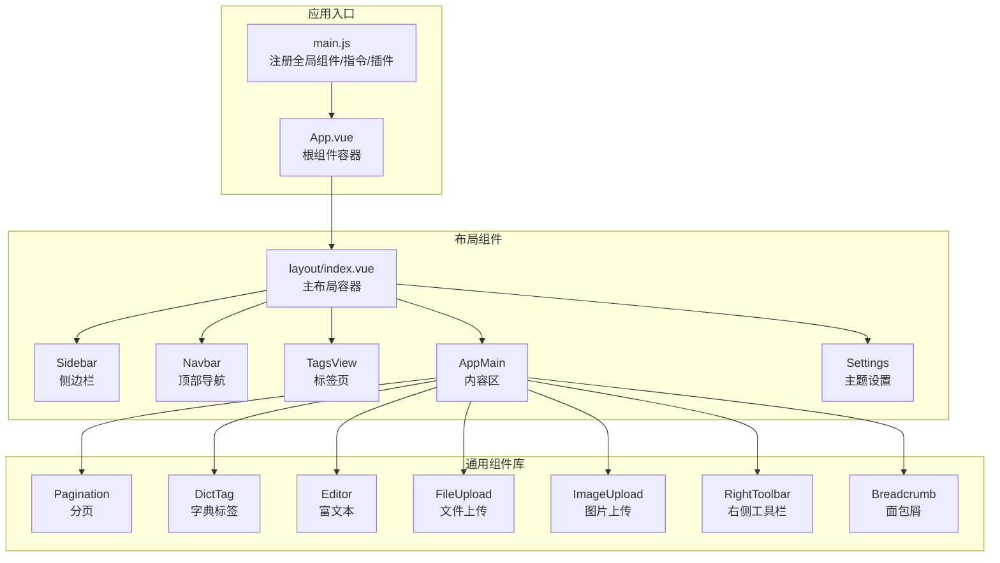
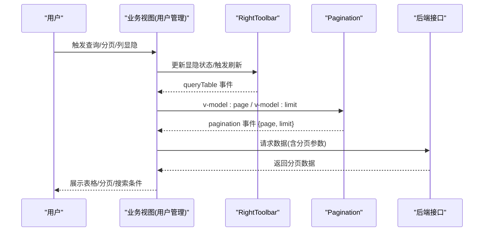
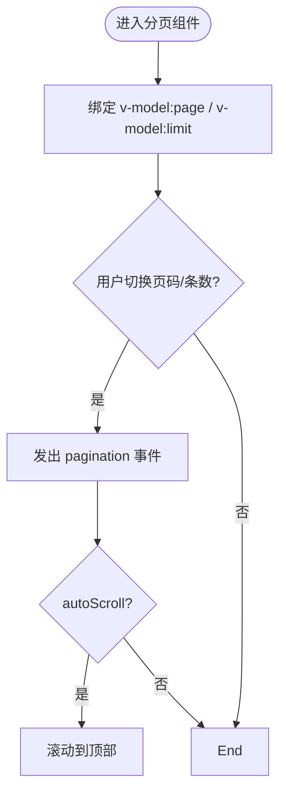
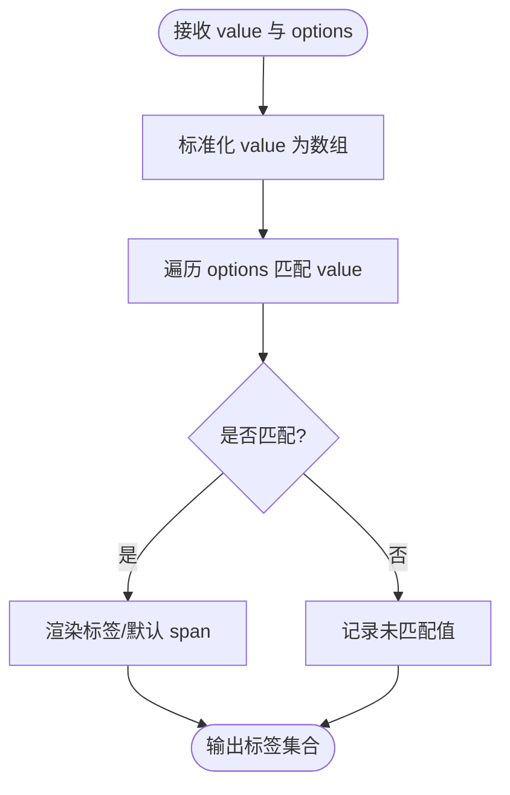
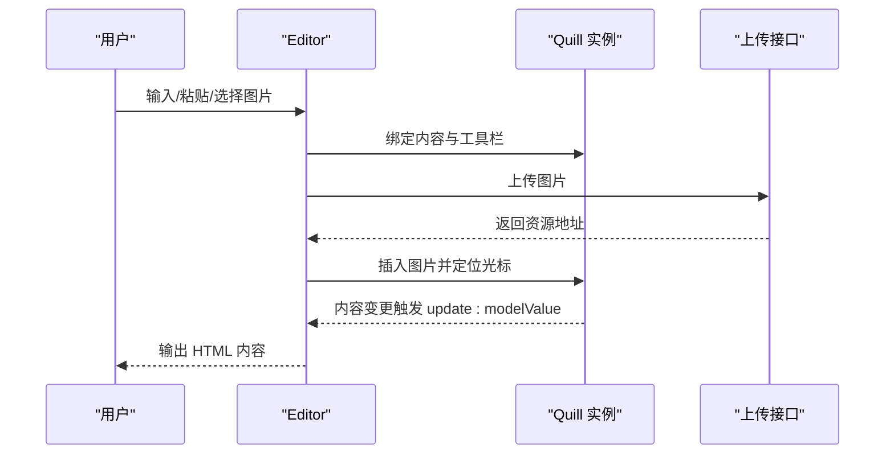
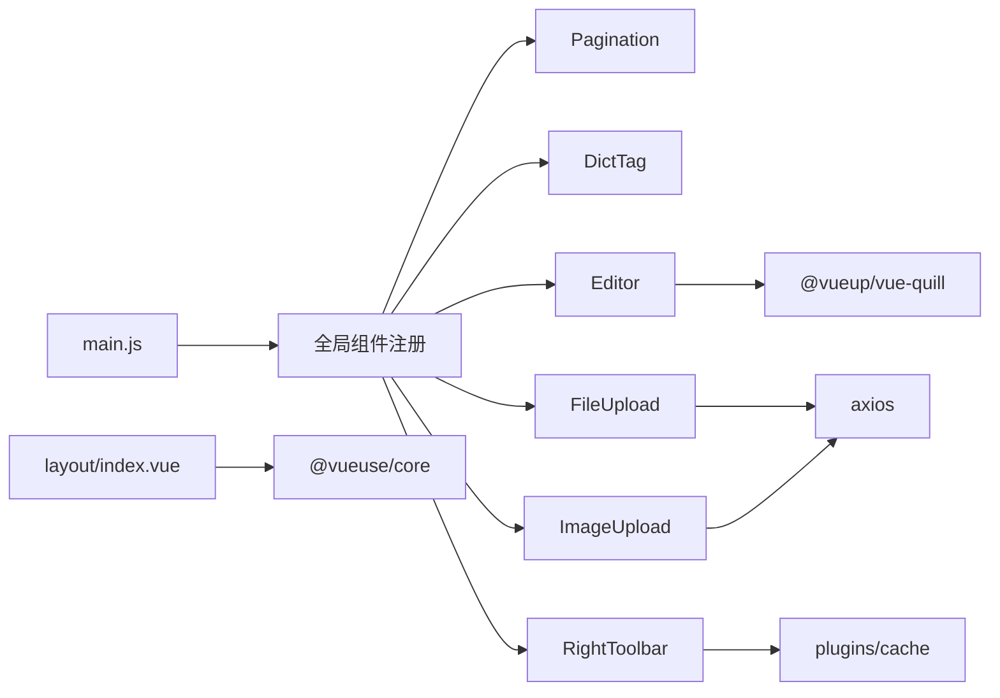

# 组件架构设计

<cite>
**本文引用的文件**   
- [main.js](file://XingChen-Vue3/src/main.js)
- [App.vue](file://XingChen-Vue3/src/App.vue)
- [index.vue](file://XingChen-Vue3/src/layout/index.vue)
- [index.vue](file://XingChen-Vue3/src/components/Pagination/index.vue)
- [index.vue](file://XingChen-Vue3/src/components/DictTag/index.vue)
- [index.vue](file://XingChen-Vue3/src/components/Editor/index.vue)
- [index.vue](file://XingChen-Vue3/src/components/Breadcrumb/index.vue)
- [index.vue](file://XingChen-Vue3/src/components/FileUpload/index.vue)
- [index.vue](file://XingChen-Vue3/src/components/ImageUpload/index.vue)
- [index.vue](file://XingChen-Vue3/src/components/RightToolbar/index.vue)
- [index.vue](file://XingChen-Vue3/src/views/system/user/index.vue)
- [package.json](file://XingChen-Vue3/package.json)
- [vite.config.js](file://XingChen-Vue3/vite.config.js)
</cite>

## 目录
1. [引言](#引言)
2. [项目结构](#项目结构)
3. [核心组件](#核心组件)
4. [架构总览](#架构总览)
5. [组件详解](#组件详解)
6. [依赖关系分析](#依赖关系分析)
7. [性能考量](#性能考量)
8. [故障排查指南](#故障排查指南)
9. [结论](#结论)
10. [附录](#附录)

## 引言
本文件系统化梳理“健康管理系统”的组件化架构，覆盖基础组件、业务组件与布局组件的设计原则与实现要点；深入解析 props 设计、事件通信、插槽与作用域插槽的应用；总结组件可复用性设计、组件间通信模式与生命周期管理；给出分页、字典标签、富文本编辑器等自定义组件的开发规范；并提供测试策略与性能优化建议。

## 项目结构
项目采用前后端分离的 Vue3 + Vite 前端工程，组件集中在 src/components 目录，布局组件位于 src/layout，页面视图位于 src/views。全局组件在入口处集中注册，便于跨页面复用。

**图表来源**
- [main.js:1-85](file://XingChen-Vue3/src/main.js#L1-L85)
- [App.vue:1-16](file://XingChen-Vue3/src/App.vue#L1-L16)
- [index.vue:1-116](file://XingChen-Vue3/src/layout/index.vue#L1-L116)

**章节来源**
- [main.js:1-85](file://XingChen-Vue3/src/main.js#L1-L85)
- [App.vue:1-16](file://XingChen-Vue3/src/App.vue#L1-L16)
- [index.vue:1-116](file://XingChen-Vue3/src/layout/index.vue#L1-L116)

## 核心组件
- 基础组件：分页、字典标签、富文本、文件上传、图片上传、右侧工具栏、面包屑等。
- 布局组件：主布局容器、侧边栏、顶部导航、标签页、内容区、主题设置。
- 页面组件：系统用户管理等业务页面，组合使用上述组件完成完整功能。

这些组件通过统一入口注册，形成可复用的 UI 基座，支撑各业务页面快速搭建。

**章节来源**
- [main.js:32-67](file://XingChen-Vue3/src/main.js#L32-L67)

## 架构总览
组件架构遵循“入口注册 + 布局承载 + 业务页面组合”的模式。全局组件在入口集中注册，布局组件负责响应式与主题切换，业务页面通过 props 与事件与组件交互，实现数据驱动与行为解耦。

**图表来源**
- [index.vue:43-138](file://XingChen-Vue3/src/components/RightToolbar/index.vue#L43-L138)
- [index.vue:80-95](file://XingChen-Vue3/src/components/Pagination/index.vue#L80-L95)
- [index.vue:240-247](file://XingChen-Vue3/src/views/system/user/index.vue#L240-L247)

## 组件详解

### 分页组件 Pagination
- 设计目标：封装 Element Plus 分页，提供双向绑定的 page/limit 与统一的分页事件输出。
- 关键特性：
  - props：total、page、limit、pageSizes、layout、background、autoScroll、hidden。
  - 事件：pagination({ page, limit })、update:page、update:limit。
  - 行为：自动滚动至顶部、移动端 pagerCount 动态适配。
- 可复用性：支持任意表格场景，统一分页交互与滚动体验。

**图表来源**
- [index.vue:20-60](file://XingChen-Vue3/src/components/Pagination/index.vue#L20-L60)
- [index.vue:80-95](file://XingChen-Vue3/src/components/Pagination/index.vue#L80-L95)

**章节来源**
- [index.vue:1-105](file://XingChen-Vue3/src/components/Pagination/index.vue#L1-L105)

### 字典标签组件 DictTag
- 设计目标：根据字典数据将值渲染为标签，支持多种标签类型与样式。
- 关键特性：
  - props：options（字典项数组）、value（当前值，支持字符串/数字/数组）、showValue、separator。
  - 行为：匹配 options 中的值，未匹配项可按需展示；支持多值分隔。
- 可复用性：统一字典值展示，减少重复逻辑。

**图表来源**
- [index.vue:31-54](file://XingChen-Vue3/src/components/DictTag/index.vue#L31-L54)
- [index.vue:78-80](file://XingChen-Vue3/src/components/DictTag/index.vue#L78-L80)

**章节来源**
- [index.vue:1-88](file://XingChen-Vue3/src/components/DictTag/index.vue#L1-L88)

### 富文本编辑器 Editor
- 设计目标：基于 Quill 提供富文本编辑能力，支持图片上传与粘贴插入。
- 关键特性：
  - props：modelValue、height、minHeight、readOnly、fileSize、type(url/base64)。
  - 事件：update:modelValue（内容变更）。
  - 行为：工具栏配置、只读控制、图片上传与粘贴处理、占位符与模块化配置。
- 可复用性：统一富文本输入体验，支持不同上传策略。

**图表来源**
- [index.vue:37-130](file://XingChen-Vue3/src/components/Editor/index.vue#L37-L130)
- [index.vue:133-195](file://XingChen-Vue3/src/components/Editor/index.vue#L133-L195)

**章节来源**
- [index.vue:1-277](file://XingChen-Vue3/src/components/Editor/index.vue#L1-L277)

### 文件上传组件 FileUpload
- 设计目标：支持多文件上传、格式/大小校验、数量限制、拖拽排序与列表展示。
- 关键特性：
  - props：modelValue、action、data、limit、fileSize、fileType、isShowTip、disabled、drag。
  - 事件：update:modelValue（文件列表变更）。
  - 行为：前置校验、loading、错误提示、列表渲染、拖拽排序、字符串序列化。
- 可复用性：统一文件上传流程，降低页面重复代码。

**章节来源**
- [index.vue:1-257](file://XingChen-Vue3/src/components/FileUpload/index.vue#L1-L257)

### 图片上传组件 ImageUpload
- 设计目标：图片上传与预览，支持多图、数量限制、格式校验、拖拽排序与外部链接识别。
- 关键特性：
  - props：与 FileUpload 类似，但聚焦图片类型。
  - 行为：图片预览对话框、外部链接检测、列表渲染与排序。
- 可复用性：统一图片上传体验，提升表单素材管理效率。

**章节来源**
- [index.vue:1-258](file://XingChen-Vue3/src/components/ImageUpload/index.vue#L1-L258)

### 右侧工具栏 RightToolbar
- 设计目标：提供搜索显隐切换、刷新、列显隐控制（复选框/穿梭框）与本地存储记忆。
- 关键特性：
  - props：showSearch、columns、search、showColumnsType、gutter、storageKey。
  - 事件：update:showSearch、queryTable。
  - 行为：动画切换搜索区域、列显隐持久化、全选/反选。
- 可复用性：统一表格工具栏交互，提升可访问性与可用性。

**章节来源**
- [index.vue:1-250](file://XingChen-Vue3/src/components/RightToolbar/index.vue#L1-L250)

### 面包屑 Breadcrumb
- 设计目标：动态生成面包屑，支持多级菜单与首页拼接。
- 关键特性：
  - 逻辑：根据路由匹配层级，过滤 meta.title，处理首页与重定向。
  - 交互：点击跳转或阻止默认行为。
- 可复用性：统一导航路径指示，增强用户空间定位。

**章节来源**
- [index.vue:1-97](file://XingChen-Vue3/src/components/Breadcrumb/index.vue#L1-L97)

### 布局组件 Layout
- 设计目标：响应式布局容器，集成侧边栏、顶部导航、标签页、内容区与主题设置。
- 关键特性：
  - 响应式：监听窗口宽度，切换设备类型与侧边栏状态。
  - 主题：动态注入 CSS 变量，支持主题切换。
  - 结构：模块化子组件组合，便于扩展与维护。
- 可复用性：统一布局骨架，保障一致的用户体验。

**章节来源**
- [index.vue:1-116](file://XingChen-Vue3/src/layout/index.vue#L1-L116)

### 页面组件示例：用户管理
- 设计目标：组织机构树 + 查询表单 + 表格 + 分页 + 导入导出 + 对话框。
- 关键特性：
  - 交互：树节点点击联动查询、搜索条件显隐、批量操作、状态切换。
  - 组件编排：Pagination、RightToolbar、ExcelImportDialog 等组合使用。
  - 生命周期：mounted 初始化树与列表，下载配置等。
- 可复用性：模板化页面结构，降低重复开发成本。

**章节来源**
- [index.vue:1-455](file://XingChen-Vue3/src/views/system/user/index.vue#L1-L455)

## 依赖关系分析
- 入口注册：在 main.js 中集中注册全局组件与插件，确保跨页面一致性。
- 组件依赖：Editor 依赖 @vueup/vue-quill；上传组件依赖 axios 与 sortablejs；布局依赖 @vueuse/core。
- 构建与运行：vite.config.js 提供代理、别名与打包配置；package.json 管理依赖版本。

**图表来源**
- [main.js:32-67](file://XingChen-Vue3/src/main.js#L32-L67)
- [index.vue:29-33](file://XingChen-Vue3/src/components/Editor/index.vue#L29-L33)
- [index.vue:43-45](file://XingChen-Vue3/src/components/FileUpload/index.vue#L43-L45)
- [index.vue:50-53](file://XingChen-Vue3/src/components/ImageUpload/index.vue#L50-L53)
- [index.vue:42-43](file://XingChen-Vue3/src/components/RightToolbar/index.vue#L42-L43)
- [index.vue:17-18](file://XingChen-Vue3/src/layout/index.vue#L17-L18)

**章节来源**
- [package.json:18-37](file://XingChen-Vue3/package.json#L18-L37)
- [vite.config.js:1-80](file://XingChen-Vue3/vite.config.js#L1-L80)

## 性能考量
- 组件懒加载与按需引入：对重型组件（如富文本）在路由级或页面级按需加载，减少首屏体积。
- 事件节流与防抖：分页与搜索事件结合防抖，避免频繁请求。
- 列显隐缓存：RightToolbar 支持 localStorage 记忆，减少重复交互成本。
- 上传优化：文件上传前严格校验，避免无效请求；图片上传采用二进制 FormData。
- 打包优化：Vite Rollup 输出命名策略与 chunkSize 警告阈值配置，合理拆分代码块。
- 主题与样式：动态注入 CSS 变量，避免重复样式计算。

[本节为通用指导，无需特定文件引用]

## 故障排查指南
- 富文本图片上传失败
  - 检查上传接口返回结构与状态码；确认 Authorization 头部传递。
  - 核对文件类型与大小限制，必要时调整 fileSize 与 fileType。
- 分页跳转异常
  - 确认 total 与当前页计算逻辑，避免页码越界；检查 autoScroll 是否导致滚动冲突。
- 列显隐不生效
  - 检查 storageKey 是否正确；确认 columns 结构与可见性字段。
- 上传组件禁用状态
  - disabled 模式仅用于查看，不触发上传；需要上传时移除禁用态。
- 布局响应式问题
  - 检查窗口尺寸监听与设备类型切换逻辑，确保侧边栏状态同步。

**章节来源**
- [index.vue:133-172](file://XingChen-Vue3/src/components/Editor/index.vue#L133-L172)
- [index.vue:80-95](file://XingChen-Vue3/src/components/Pagination/index.vue#L80-L95)
- [index.vue:160-176](file://XingChen-Vue3/src/components/RightToolbar/index.vue#L160-L176)
- [index.vue:121-149](file://XingChen-Vue3/src/components/FileUpload/index.vue#L121-L149)

## 结论
该组件架构以“入口统一注册 + 布局承载 + 业务页面组合”为核心，通过分页、字典标签、富文本、上传、工具栏等通用组件，形成高内聚、低耦合的 UI 基座。配合响应式布局与主题系统，满足多终端与个性化需求。建议持续完善组件测试与性能监控，保持架构演进的稳定性与可维护性。

[本节为总结，无需特定文件引用]

## 附录
- 开发规范建议
  - Props 设计：明确必填/可选、默认值与类型约束；提供合理的默认布局与样式。
  - 事件命名：统一使用 camelCase；事件参数尽量包含上下文信息。
  - 插槽使用：在复杂组件中提供具名插槽，支持作用域插槽以增强定制性。
  - 生命周期：在 onMounted 中初始化第三方库；在 watch 中处理 props 变更。
  - 测试策略：为关键组件编写单元测试与端到端测试，覆盖边界与异常场景。
  - 性能优化：组件拆分、懒加载、缓存与防抖、合理打包策略。

[本节为通用指导，无需特定文件引用]