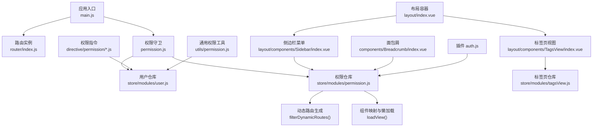
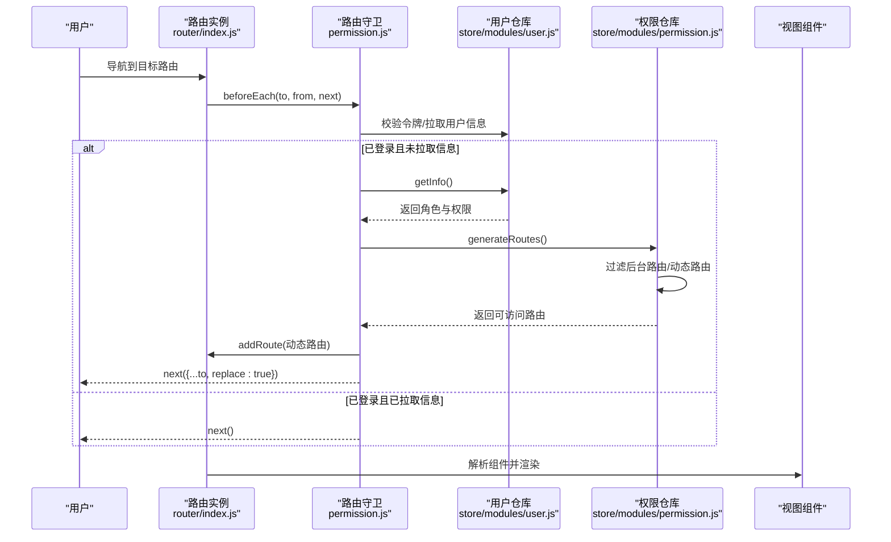
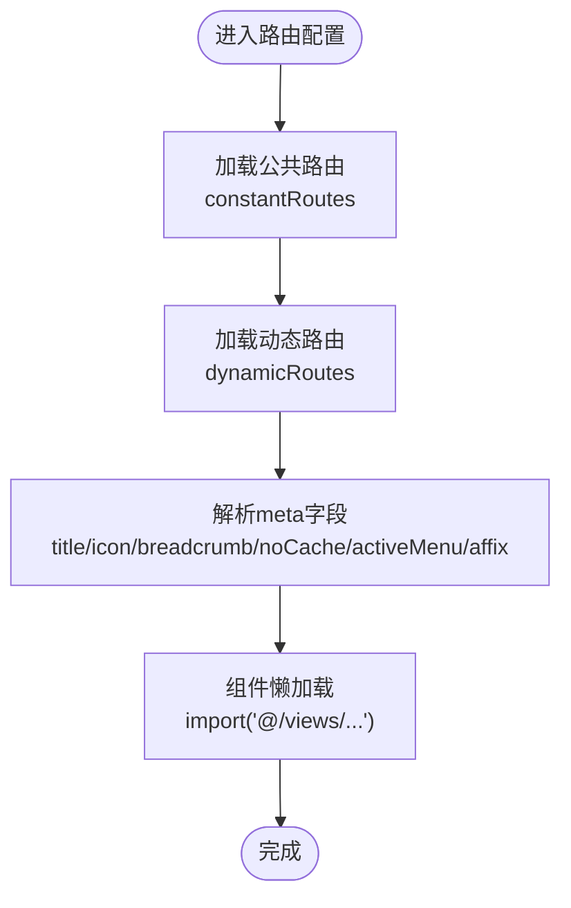
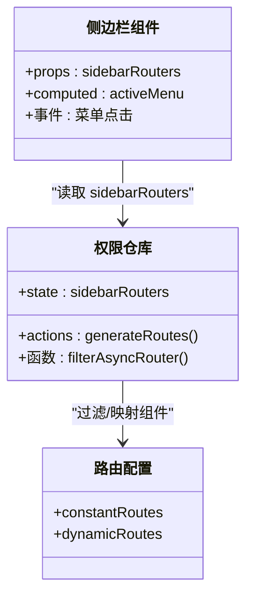
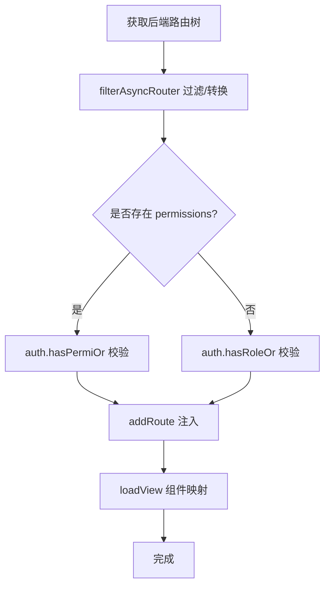
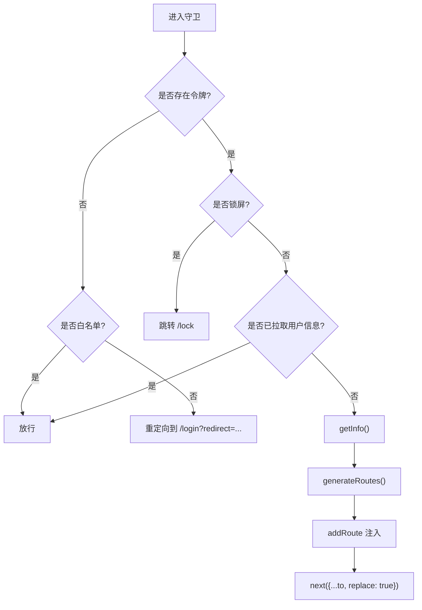
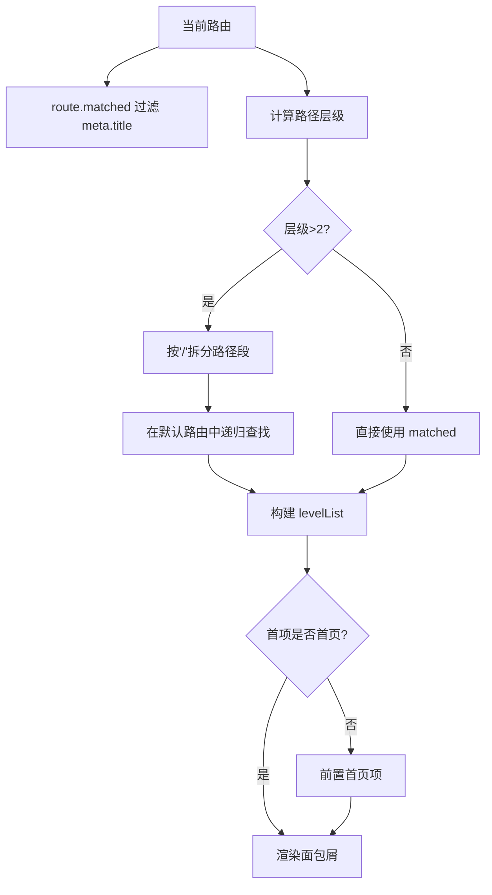
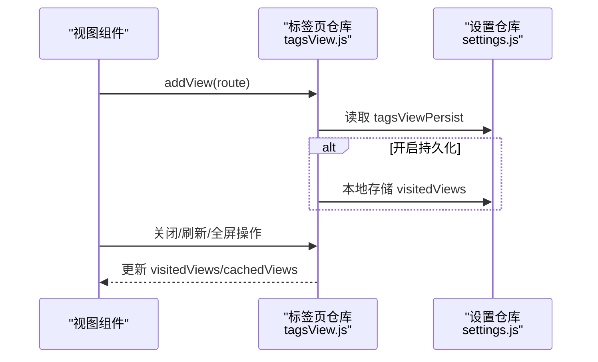
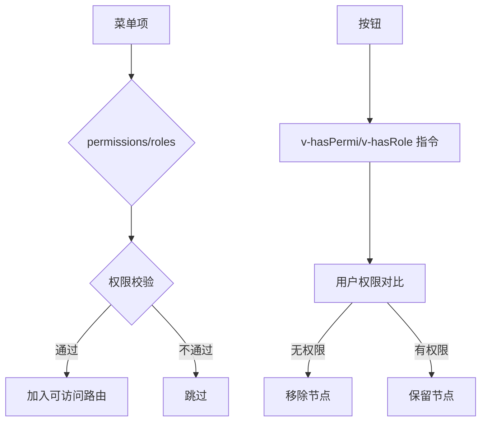
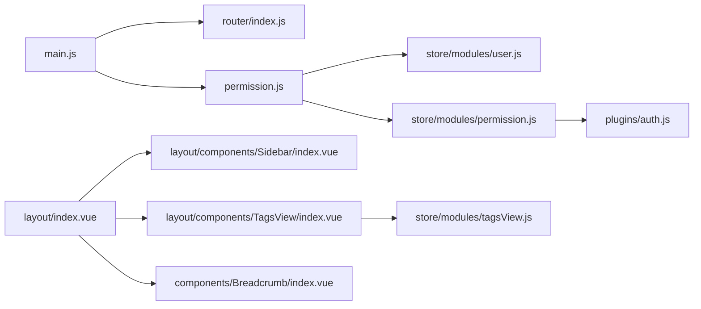

# 路由与导航

<cite>
**本文引用的文件**
- [路由配置 index.js](file://XingChen-Vue3/src/router/index.js)
- [应用入口 main.js](file://XingChen-Vue3/src/main.js)
- [路由守卫 permission.js](file://XingChen-Vue3/src/permission.js)
- [权限仓库 permission.js（store）](file://XingChen-Vue3/src/store/modules/permission.js)
- [侧边栏组件 index.vue](file://XingChen-Vue3/src/layout/components/Sidebar/index.vue)
- [标签页组件 index.vue](file://XingChen-Vue3/src/layout/components/TagsView/index.vue)
- [标签页仓库 tagsView.js](file://XingChen-Vue3/src/store/modules/tagsView.js)
- [面包屑组件 index.vue](file://XingChen-Vue3/src/components/Breadcrumb/index.vue)
- [布局容器 index.vue](file://XingChen-Vue3/src/layout/index.vue)
- [用户仓库 user.js](file://XingChen-Vue3/src/store/modules/user.js)
- [权限指令 hasPermi.js](file://XingChen-Vue3/src/directive/permission/hasPermi.js)
- [权限指令 hasRole.js](file://XingChen-Vue3/src/directive/permission/hasRole.js)
- [通用权限工具 permission.js](file://XingChen-Vue3/src/utils/permission.js)
- [插件 auth.js](file://XingChen-Vue3/src/plugins/auth.js)
</cite>

## 目录
1. [引言](#引言)
2. [项目结构](#项目结构)
3. [核心组件](#核心组件)
4. [架构总览](#架构总览)
5. [详细组件分析](#详细组件分析)
6. [依赖关系分析](#依赖关系分析)
7. [性能考虑](#性能考虑)
8. [故障排查指南](#故障排查指南)
9. [结论](#结论)
10. [附录](#附录)

## 引言
本文件系统化梳理健康管理系统前端的“路由与导航”能力，覆盖 Vue Router 的配置与使用、嵌套路由与动态路由、路由懒加载、权限控制（路由守卫、菜单权限、按钮权限）、导航栏、面包屑与标签页管理、路由元信息（meta）的使用，以及性能优化、预加载策略与 SEO 优化建议。目标是帮助开发者快速理解并扩展系统的导航体系。

## 项目结构
围绕路由与导航的关键目录与文件如下：
- 路由定义与懒加载：src/router/index.js
- 应用入口与插件注册：src/main.js
- 路由守卫与鉴权流程：src/permission.js
- 权限仓库与动态路由生成：src/store/modules/permission.js
- 侧边栏菜单渲染：src/layout/components/Sidebar/index.vue
- 标签页视图与持久化：src/layout/components/TagsView/index.vue、src/store/modules/tagsView.js
- 面包屑导航：src/components/Breadcrumb/index.vue
- 布局容器与响应式：src/layout/index.vue
- 用户与权限数据源：src/store/modules/user.js
- 权限指令与工具：src/directive/permission/*.js、src/utils/permission.js、src/plugins/auth.js

**图表来源**
- [应用入口 main.js:1-85](file://XingChen-Vue3/src/main.js#L1-L85)
- [路由配置 index.js:1-197](file://XingChen-Vue3/src/router/index.js#L1-L197)
- [路由守卫 permission.js:1-78](file://XingChen-Vue3/src/permission.js#L1-L78)
- [权限仓库 permission.js（store）:1-135](file://XingChen-Vue3/src/store/modules/permission.js#L1-L135)
- [侧边栏组件 index.vue:1-105](file://XingChen-Vue3/src/layout/components/Sidebar/index.vue#L1-L105)
- [标签页组件 index.vue:1-595](file://XingChen-Vue3/src/layout/components/TagsView/index.vue#L1-L595)
- [标签页仓库 tagsView.js:1-227](file://XingChen-Vue3/src/store/modules/tagsView.js#L1-L227)
- [面包屑组件 index.vue:1-97](file://XingChen-Vue3/src/components/Breadcrumb/index.vue#L1-L97)
- [布局容器 index.vue:1-116](file://XingChen-Vue3/src/layout/index.vue#L1-L116)
- [用户仓库 user.js:1-94](file://XingChen-Vue3/src/store/modules/user.js#L1-L94)
- [权限指令 hasPermi.js:1-28](file://XingChen-Vue3/src/directive/permission/hasPermi.js#L1-L28)
- [权限指令 hasRole.js:1-28](file://XingChen-Vue3/src/directive/permission/hasRole.js#L1-L28)
- [通用权限工具 permission.js:1-51](file://XingChen-Vue3/src/utils/permission.js#L1-L51)
- [插件 auth.js:1-61](file://XingChen-Vue3/src/plugins/auth.js#L1-L61)

**章节来源**
- [路由配置 index.js:1-197](file://XingChen-Vue3/src/router/index.js#L1-L197)
- [应用入口 main.js:1-85](file://XingChen-Vue3/src/main.js#L1-L85)

## 核心组件
- 路由配置与懒加载：通过 createRouter 创建路由实例，constantRoutes 定义公共路由，dynamicRoutes 定义受控的动态路由；路由组件采用 import 动态导入实现懒加载。
- 路由守卫：在 permission.js 中统一拦截导航，结合用户令牌、锁定态、白名单与权限仓库生成可访问路由集合。
- 权限仓库：从后端获取路由树，过滤出侧边栏、顶部菜单与默认路由，并对动态路由进行权限校验后注入。
- 侧边栏菜单：根据权限仓库的 sidebarRouters 渲染，支持折叠、主题与高亮 activeMenu。
- 标签页：记录访问历史、支持刷新、关闭、全屏、持久化等，提供丰富的上下文操作。
- 面包屑：根据 matched 与默认路由计算层级，自动拼接首页与当前页标题。
- 权限控制：路由级（permissions/roles）、菜单级（meta 控制显示）、按钮级（指令 v-hasPermi/v-hasRole）。

**章节来源**
- [路由配置 index.js:27-197](file://XingChen-Vue3/src/router/index.js#L27-L197)
- [路由守卫 permission.js:21-73](file://XingChen-Vue3/src/permission.js#L21-L73)
- [权限仓库 permission.js（store）:35-135](file://XingChen-Vue3/src/store/modules/permission.js#L35-L135)
- [侧边栏组件 index.vue:16-68](file://XingChen-Vue3/src/layout/components/Sidebar/index.vue#L16-L68)
- [标签页组件 index.vue:103-352](file://XingChen-Vue3/src/layout/components/TagsView/index.vue#L103-L352)
- [面包屑组件 index.vue:20-83](file://XingChen-Vue3/src/components/Breadcrumb/index.vue#L20-L83)
- [权限指令 hasPermi.js:7-27](file://XingChen-Vue3/src/directive/permission/hasPermi.js#L7-L27)
- [权限指令 hasRole.js:7-27](file://XingChen-Vue3/src/directive/permission/hasRole.js#L7-L27)

## 架构总览
下图展示从用户导航到页面渲染的完整链路，包括鉴权、动态路由注入与视图渲染。

**图表来源**
- [路由守卫 permission.js:21-73](file://XingChen-Vue3/src/permission.js#L21-L73)
- [权限仓库 permission.js（store）:35-54](file://XingChen-Vue3/src/store/modules/permission.js#L35-L54)
- [用户仓库 user.js:39-74](file://XingChen-Vue3/src/store/modules/user.js#L39-L74)
- [路由配置 index.js:185-197](file://XingChen-Vue3/src/router/index.js#L185-L197)

## 详细组件分析

### 路由定义与懒加载
- 公共路由（constantRoutes）：包含登录、注册、404、401、重定向、首页、锁定屏等，均采用动态导入实现懒加载。
- 动态路由（dynamicRoutes）：以 permissions/roles 字段声明访问控制，仅在权限满足时注入路由。
- 路由元信息（meta）：title/icon/breadcrumb/noCache/activeMenu/affix 等用于菜单、面包屑、缓存与固定标签等行为控制。
- 历史模式：history: createWebHistory()。

**图表来源**
- [路由配置 index.js:27-109](file://XingChen-Vue3/src/router/index.js#L27-L109)
- [路由配置 index.js:112-183](file://XingChen-Vue3/src/router/index.js#L112-L183)
- [路由配置 index.js:185-197](file://XingChen-Vue3/src/router/index.js#L185-L197)

**章节来源**
- [路由配置 index.js:27-197](file://XingChen-Vue3/src/router/index.js#L27-L197)

### 嵌套路由与菜单渲染
- 侧边栏根据 permissionStore.sidebarRouters 渲染，支持多级嵌套与折叠。
- activeMenu 元信息用于高亮当前菜单项。
- Layout/ParentView/InnerLink 组件在权限仓库中按需替换为真实组件。

**图表来源**
- [侧边栏组件 index.vue:16-68](file://XingChen-Vue3/src/layout/components/Sidebar/index.vue#L16-L68)
- [权限仓库 permission.js（store）:35-84](file://XingChen-Vue3/src/store/modules/permission.js#L35-L84)

**章节来源**
- [侧边栏组件 index.vue:1-105](file://XingChen-Vue3/src/layout/components/Sidebar/index.vue#L1-L105)
- [权限仓库 permission.js（store）:59-84](file://XingChen-Vue3/src/store/modules/permission.js#L59-L84)

### 动态路由与权限校验
- 后端返回路由树，权限仓库将其转换为可渲染的路由对象。
- 动态路由校验：若存在 permissions 则使用插件 auth.js 的 hasPermiOr 校验；否则回退到 roles 校验。
- 组件映射：loadView 通过 import.meta.glob 遍历 views 下的 .vue 文件，按组件路径匹配并返回动态导入函数。

**图表来源**
- [权限仓库 permission.js（store）:35-114](file://XingChen-Vue3/src/store/modules/permission.js#L35-L114)
- [插件 auth.js:27-60](file://XingChen-Vue3/src/plugins/auth.js#L27-L60)

**章节来源**
- [权限仓库 permission.js（store）:35-135](file://XingChen-Vue3/src/store/modules/permission.js#L35-L135)
- [插件 auth.js:1-61](file://XingChen-Vue3/src/plugins/auth.js#L1-L61)

### 路由守卫与鉴权流程
- 白名单：登录/注册免登。
- 锁屏态：isLock=true 时强制跳转至 /lock。
- 首次登录：拉取用户信息后调用 generateRoutes，将返回的可访问路由逐条 addRoute。
- 替换导航：确保动态路由注入完成后重新导航到原目标。

**图表来源**
- [路由守卫 permission.js:21-73](file://XingChen-Vue3/src/permission.js#L21-L73)
- [用户仓库 user.js:39-74](file://XingChen-Vue3/src/store/modules/user.js#L39-L74)
- [权限仓库 permission.js（store）:35-54](file://XingChen-Vue3/src/store/modules/permission.js#L35-L54)

**章节来源**
- [路由守卫 permission.js:1-78](file://XingChen-Vue3/src/permission.js#L1-L78)
- [用户仓库 user.js:1-94](file://XingChen-Vue3/src/store/modules/user.js#L1-L94)

### 面包屑导航
- 根据 matched 与默认路由计算层级，自动拼接“首页”。
- 多级路径解析：通过路径分段与默认路由树递归匹配，最终过滤掉不需要显示的项。

**图表来源**
- [面包屑组件 index.vue:20-83](file://XingChen-Vue3/src/components/Breadcrumb/index.vue#L20-L83)
- [权限仓库 permission.js（store）:28-51](file://XingChen-Vue3/src/store/modules/permission.js#L28-L51)

**章节来源**
- [面包屑组件 index.vue:1-97](file://XingChen-Vue3/src/components/Breadcrumb/index.vue#L1-L97)

### 标签页管理
- 访问历史：addView/addVisitedView，记录 title/meta/name/path/query。
- 缓存策略：cachedViews 记录 keep-alive 名称，noCache 为 true 时不缓存。
- 持久化：支持本地存储，重启后恢复非固钉标签。
- 操作：关闭当前/关闭其他/关闭左侧/关闭右侧/全部关闭/刷新/全屏。

**图表来源**
- [标签页组件 index.vue:103-352](file://XingChen-Vue3/src/layout/components/TagsView/index.vue#L103-L352)
- [标签页仓库 tagsView.js:33-222](file://XingChen-Vue3/src/store/modules/tagsView.js#L33-L222)

**章节来源**
- [标签页组件 index.vue:1-595](file://XingChen-Vue3/src/layout/components/TagsView/index.vue#L1-L595)
- [标签页仓库 tagsView.js:1-227](file://XingChen-Vue3/src/store/modules/tagsView.js#L1-L227)

### 按钮权限与菜单权限
- 菜单权限：通过路由的 permissions/roles 字段与插件 auth.js 的 hasPermiOr/hasRoleOr 控制是否注入路由。
- 按钮权限：v-hasPermi 与 v-hasRole 指令在挂载时判断用户权限，无权限则移除 DOM 节点。
- 通用工具：checkPermi/checkRole 提供模板内校验能力。

**图表来源**
- [权限仓库 permission.js（store）:100-114](file://XingChen-Vue3/src/store/modules/permission.js#L100-L114)
- [插件 auth.js:27-60](file://XingChen-Vue3/src/plugins/auth.js#L27-L60)
- [权限指令 hasPermi.js:7-27](file://XingChen-Vue3/src/directive/permission/hasPermi.js#L7-L27)
- [权限指令 hasRole.js:7-27](file://XingChen-Vue3/src/directive/permission/hasRole.js#L7-L27)
- [通用权限工具 permission.js:8-51](file://XingChen-Vue3/src/utils/permission.js#L8-L51)

**章节来源**
- [权限仓库 permission.js（store）:100-135](file://XingChen-Vue3/src/store/modules/permission.js#L100-L135)
- [权限指令 hasPermi.js:1-28](file://XingChen-Vue3/src/directive/permission/hasPermi.js#L1-L28)
- [权限指令 hasRole.js:1-28](file://XingChen-Vue3/src/directive/permission/hasRole.js#L1-L28)
- [通用权限工具 permission.js:1-51](file://XingChen-Vue3/src/utils/permission.js#L1-L51)

### 路由元信息（meta）使用
- title/icon/breadcrumb/noCache/activeMenu/affix 等用于控制菜单显示、图标、面包屑、缓存与固定标签等。
- 示例：首页 affix 固定标签；某些编辑页 noCache 不缓存；activeMenu 高亮对应侧边栏。

**章节来源**
- [路由配置 index.js:18-24](file://XingChen-Vue3/src/router/index.js#L18-L24)
- [标签页组件 index.vue:151-153](file://XingChen-Vue3/src/layout/components/TagsView/index.vue#L151-L153)
- [侧边栏组件 index.vue:62-68](file://XingChen-Vue3/src/layout/components/Sidebar/index.vue#L62-L68)

## 依赖关系分析
- main.js 将 router 与 store、插件、指令等注册到应用。
- permission.js 作为全局守卫，依赖用户与权限仓库。
- 权限仓库依赖后端接口与组件映射工具，生成可注入路由。
- 布局容器整合侧边栏、标签页与主内容区域。

**图表来源**
- [应用入口 main.js:69-75](file://XingChen-Vue3/src/main.js#L69-L75)
- [路由守卫 permission.js:1-78](file://XingChen-Vue3/src/permission.js#L1-L78)
- [权限仓库 permission.js（store）:1-56](file://XingChen-Vue3/src/store/modules/permission.js#L1-L56)
- [布局容器 index.vue:1-116](file://XingChen-Vue3/src/layout/index.vue#L1-L116)
- [侧边栏组件 index.vue:1-105](file://XingChen-Vue3/src/layout/components/Sidebar/index.vue#L1-L105)
- [标签页组件 index.vue:1-595](file://XingChen-Vue3/src/layout/components/TagsView/index.vue#L1-L595)
- [标签页仓库 tagsView.js:1-227](file://XingChen-Vue3/src/store/modules/tagsView.js#L1-L227)
- [面包屑组件 index.vue:1-97](file://XingChen-Vue3/src/components/Breadcrumb/index.vue#L1-L97)
- [插件 auth.js:1-61](file://XingChen-Vue3/src/plugins/auth.js#L1-L61)

**章节来源**
- [应用入口 main.js:1-85](file://XingChen-Vue3/src/main.js#L1-L85)
- [布局容器 index.vue:1-116](file://XingChen-Vue3/src/layout/index.vue#L1-L116)

## 性能考虑
- 路由懒加载：所有路由组件均采用动态导入，减少首屏体积。
- keep-alive 缓存：通过 meta.noCache 控制是否缓存；cachedViews 记录组件名称，避免重复渲染。
- 标签页持久化：开启后可恢复最近访问，减少重复加载。
- 预加载策略（建议）：对高频访问的路由或关键路径可采用路由级别的预加载（如在导航前预取数据），但需结合业务场景谨慎使用，避免过度消耗资源。
- 滚动位置恢复：路由内置滚动行为，优先恢复历史位置，提升体验。

**章节来源**
- [路由配置 index.js:188-193](file://XingChen-Vue3/src/router/index.js#L188-L193)
- [标签页仓库 tagsView.js:62-67](file://XingChen-Vue3/src/store/modules/tagsView.js#L62-L67)
- [标签页组件 index.vue:143-149](file://XingChen-Vue3/src/layout/components/TagsView/index.vue#L143-L149)

## 故障排查指南
- 路由无法显示或报错找不到组件
  - 检查路由 component 路径是否与 src/views 下文件名一致（不带后缀），loadView 会据此匹配。
  - 若组件路径错误，会在控制台输出警告提示。
- 动态路由未生效
  - 确认后端返回的组件路径与 views 文件夹结构一致。
  - 确认 permissions/roles 是否满足过滤条件。
- 权限指令导致按钮消失
  - 检查用户权限是否包含所需权限或角色。
  - 模板中 v-hasPermi/v-hasRole 的值格式是否正确。
- 面包屑不显示或不正确
  - 确认 meta.title 存在且未设置 breadcrumb:false。
  - 多级路径需确保默认路由树中有对应父级节点。
- 标签页异常
  - 检查 affix 标记与 noCache 设置。
  - 若开启持久化，确认本地存储键值存在且格式正确。

**章节来源**
- [权限仓库 permission.js（store）:116-132](file://XingChen-Vue3/src/store/modules/permission.js#L116-L132)
- [权限仓库 permission.js（store）:100-114](file://XingChen-Vue3/src/store/modules/permission.js#L100-L114)
- [权限指令 hasPermi.js:13-22](file://XingChen-Vue3/src/directive/permission/hasPermi.js#L13-L22)
- [权限指令 hasRole.js:13-22](file://XingChen-Vue3/src/directive/permission/hasRole.js#L13-L22)
- [面包屑组件 index.vue:39-40](file://XingChen-Vue3/src/components/Breadcrumb/index.vue#L39-L40)
- [标签页组件 index.vue:173-193](file://XingChen-Vue3/src/layout/components/TagsView/index.vue#L173-L193)
- [标签页仓库 tagsView.js:10-18](file://XingChen-Vue3/src/store/modules/tagsView.js#L10-L18)

## 结论
本系统以 Vue Router 为核心，结合权限仓库与路由守卫实现了完善的权限控制与导航体验。通过 meta 元信息、动态路由与指令层的权限控制，配合侧边栏、面包屑与标签页，形成了一套可扩展、可维护的前端导航体系。建议在后续迭代中进一步完善预加载策略与 SEO 优化，以提升性能与可发现性。

## 附录
- SEO 优化建议（概念性）
  - 使用路由元信息中的 title 作为页面标题，结合动态标题工具设置页面标题。
  - 对于需要搜索引擎抓取的内容，尽量避免过度使用异步懒加载；对关键页面可采用服务端渲染或静态生成策略。
  - 为 404/401 页面提供清晰的提示与返回路径，改善用户体验。