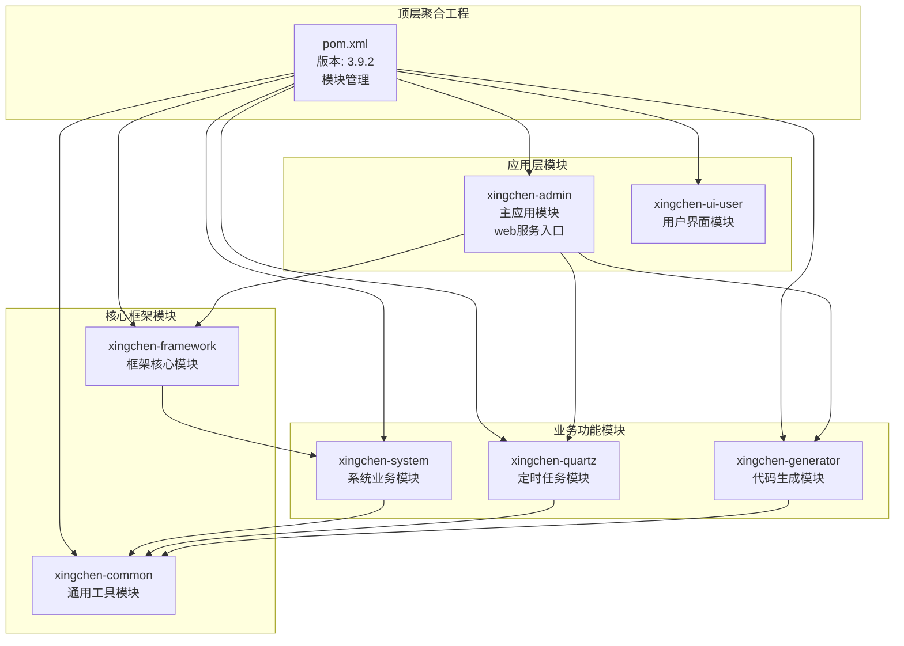
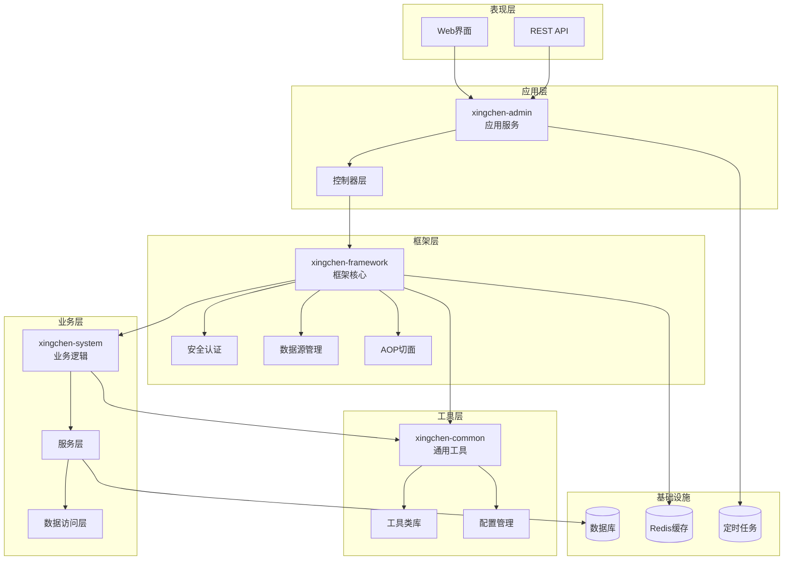
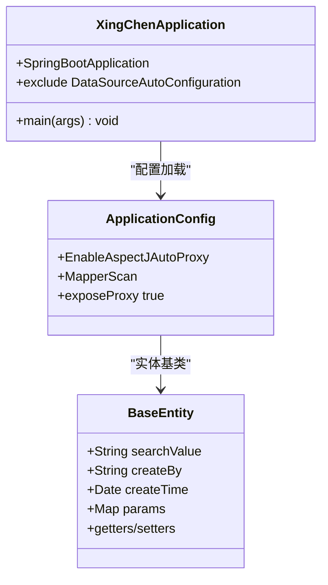
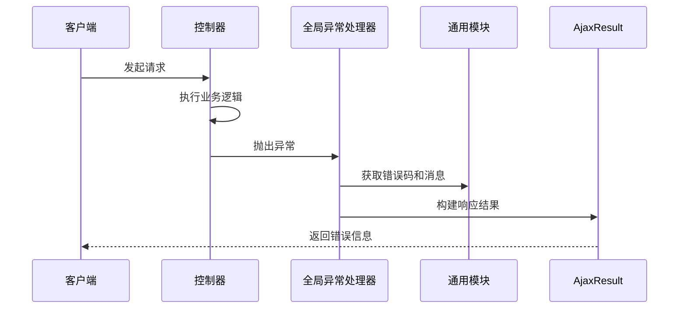
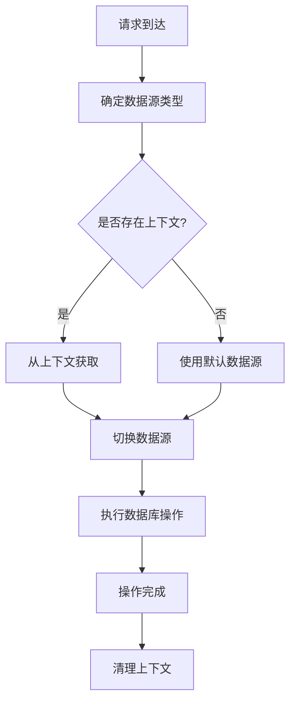
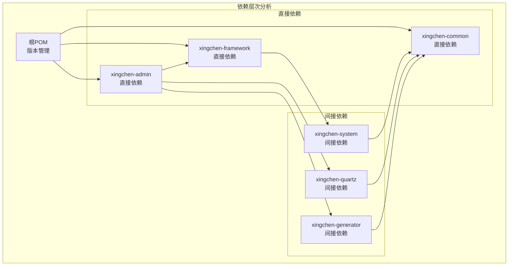

# Maven模块化架构

<cite>
**本文档引用的文件**
- [XingChen-Vue/pom.xml](file://XingChen-Vue/pom.xml)
- [XingChen-Vue/xingchen-admin/pom.xml](file://XingChen-Vue/xingchen-admin/pom.xml)
- [XingChen-Vue/xingchen-common/pom.xml](file://XingChen-Vue/xingchen-common/pom.xml)
- [XingChen-Vue/xingchen-framework/pom.xml](file://XingChen-Vue/xingchen-framework/pom.xml)
- [XingChen-Vue/xingchen-system/pom.xml](file://XingChen-Vue/xingchen-system/pom.xml)
- [XingChen-Vue/xingchen-quartz/pom.xml](file://XingChen-Vue/xingchen-quartz/pom.xml)
- [XingChen-Vue/xingchen-generator/pom.xml](file://XingChen-Vue/xingchen-generator/pom.xml)
- [XingChen-Vue/xingchen-admin/src/main/java/com/xingchen/XingChenApplication.java](file://XingChen-Vue/xingchen-admin/src/main/java/com/xingchen/XingChenApplication.java)
- [XingChen-Vue/xingchen-common/src/main/java/com/xingchen/common/core/domain/BaseEntity.java](file://XingChen-Vue/xingchen-common/src/main/java/com/xingchen/common/core/domain/BaseEntity.java)
- [XingChen-Vue/xingchen-framework/src/main/java/com/xingchen/framework/config/ApplicationConfig.java](file://XingChen-Vue/xingchen-framework/src/main/java/com/xingchen/framework/config/ApplicationConfig.java)
- [XingChen-Vue/xingchen-common/src/main/java/com/xingchen/common/exception/base/BaseException.java](file://XingChen-Vue/xingchen-common/src/main/java/com/xingchen/common/exception/base/BaseException.java)
- [XingChen-Vue/xingchen-framework/src/main/java/com/xingchen/framework/web/exception/GlobalExceptionHandler.java](file://XingChen-Vue/xingchen-framework/src/main/java/com/xingchen/framework/web/exception/GlobalExceptionHandler.java)
- [XingChen-Vue/xingchen-system/src/main/java/com/xingchen/system/service/ISysUserService.java](file://XingChen-Vue/xingchen-system/src/main/java/com/xingchen/system/service/ISysUserService.java)
- [XingChen-Vue/xingchen-framework/src/main/java/com/xingchen/framework/datasource/DynamicDataSource.java](file://XingChen-Vue/xingchen-framework/src/main/java/com/xingchen/framework/datasource/DynamicDataSource.java)
- [XingChen-Vue/xingchen-admin/src/main/resources/application.yml](file://XingChen-Vue/xingchen-admin/src/main/resources/application.yml)
</cite>

## 目录
1. [简介](#简介)
2. [项目结构](#项目结构)
3. [核心组件](#核心组件)
4. [架构概览](#架构概览)
5. [详细组件分析](#详细组件分析)
6. [依赖分析](#依赖分析)
7. [性能考虑](#性能考虑)
8. [故障排除指南](#故障排除指南)
9. [结论](#结论)
10. [附录](#附录)

## 简介
本项目是一个基于Spring Boot 4.0.3的多模块Maven架构健康管理系统。采用模块化设计理念，将系统拆分为独立的功能模块，实现了高内聚低耦合的架构目标。项目包含主应用模块、框架核心模块、通用工具模块、业务模块以及辅助功能模块，形成了完整的微服务化架构体系。

## 项目结构
项目采用标准的Maven多模块结构，顶层聚合工程统一管理所有子模块的版本和依赖关系。

**图表来源**
- [XingChen-Vue/pom.xml:176-183](file://XingChen-Vue/pom.xml#L176-L183)
- [XingChen-Vue/xingchen-admin/pom.xml:39-55](file://XingChen-Vue/xingchen-admin/pom.xml#L39-L55)
- [XingChen-Vue/xingchen-framework/pom.xml:56-60](file://XingChen-Vue/xingchen-framework/pom.xml#L56-L60)

**章节来源**
- [XingChen-Vue/pom.xml:1-232](file://XingChen-Vue/pom.xml#L1-L232)

## 核心组件
系统由七个主要模块组成，每个模块都有明确的职责分工：

### 主应用模块 (xingchen-admin)
作为系统的入口点，负责提供Web服务接口和用户交互功能。该模块排除了数据源自动配置，为后续的动态数据源切换做准备。

### 框架核心模块 (xingchen-framework)
提供系统的基础框架能力，包括：
- 安全认证和权限控制
- 动态数据源切换
- 全局异常处理
- AOP切面编程
- 拦截器和过滤器

### 通用工具模块 (xingchen-common)
封装通用的工具类和基础设施：
- 实体基类和数据模型
- 异常处理机制
- 工具类库（文件、加密、验证等）
- 配置管理
- XSS防护

### 业务模块 (xingchen-system)
实现具体的业务逻辑，包括用户管理、角色权限、菜单管理等核心业务功能。

### 辅助功能模块
- **定时任务模块 (xingchen-quartz)**: 提供调度任务功能
- **代码生成模块 (xingchen-generator)**: 自动生成代码模板
- **用户界面模块 (xingchen-ui-user)**: 前端用户界面

**章节来源**
- [XingChen-Vue/xingchen-admin/src/main/java/com/xingchen/XingChenApplication.java:12-18](file://XingChen-Vue/xingchen-admin/src/main/java/com/xingchen/XingChenApplication.java#L12-L18)
- [XingChen-Vue/xingchen-common/src/main/java/com/xingchen/common/core/domain/BaseEntity.java:16-118](file://XingChen-Vue/xingchen-common/src/main/java/com/xingchen/common/core/domain/BaseEntity.java#L16-L118)

## 架构概览
系统采用分层架构设计，通过模块间的清晰边界实现松耦合的依赖关系。

**图表来源**
- [XingChen-Vue/xingchen-admin/pom.xml:39-55](file://XingChen-Vue/xingchen-admin/pom.xml#L39-L55)
- [XingChen-Vue/xingchen-framework/pom.xml:18-62](file://XingChen-Vue/xingchen-framework/pom.xml#L18-L62)
- [XingChen-Vue/xingchen-system/pom.xml:18-26](file://XingChen-Vue/xingchen-system/pom.xml#L18-L26)

## 详细组件分析

### 应用启动组件分析
主应用模块通过Spring Boot启动类实现系统的初始化配置。

**图表来源**
- [XingChen-Vue/xingchen-admin/src/main/java/com/xingchen/XingChenApplication.java:12-18](file://XingChen-Vue/xingchen-admin/src/main/java/com/xingchen/XingChenApplication.java#L12-L18)
- [XingChen-Vue/xingchen-framework/src/main/java/com/xingchen/framework/config/ApplicationConfig.java:12-19](file://XingChen-Vue/xingchen-framework/src/main/java/com/xingchen/framework/config/ApplicationConfig.java#L12-L19)
- [XingChen-Vue/xingchen-common/src/main/java/com/xingchen/common/core/domain/BaseEntity.java:16-118](file://XingChen-Vue/xingchen-common/src/main/java/com/xingchen/common/core/domain/BaseEntity.java#L16-L118)

### 异常处理机制
框架模块提供了统一的异常处理机制，确保系统在出现错误时能够优雅地处理。

**图表来源**
- [XingChen-Vue/xingchen-framework/src/main/java/com/xingchen/framework/web/exception/GlobalExceptionHandler.java:27-145](file://XingChen-Vue/xingchen-framework/src/main/java/com/xingchen/framework/web/exception/GlobalExceptionHandler.java#L27-L145)
- [XingChen-Vue/xingchen-common/src/main/java/com/xingchen/common/exception/base/BaseException.java:11-97](file://XingChen-Vue/xingchen-common/src/main/java/com/xingchen/common/exception/base/BaseException.java#L11-L97)

### 数据源管理机制
框架模块实现了动态数据源切换功能，支持多数据源场景。

**图表来源**
- [XingChen-Vue/xingchen-framework/src/main/java/com/xingchen/framework/datasource/DynamicDataSource.java:12-25](file://XingChen-Vue/xingchen-framework/src/main/java/com/xingchen/framework/datasource/DynamicDataSource.java#L12-L25)

**章节来源**
- [XingChen-Vue/xingchen-framework/src/main/java/com/xingchen/framework/web/exception/GlobalExceptionHandler.java:1-146](file://XingChen-Vue/xingchen-framework/src/main/java/com/xingchen/framework/web/exception/GlobalExceptionHandler.java#L1-L146)
- [XingChen-Vue/xingchen-framework/src/main/java/com/xingchen/framework/datasource/DynamicDataSource.java:1-26](file://XingChen-Vue/xingchen-framework/src/main/java/com/xingchen/framework/datasource/DynamicDataSource.java#L1-L26)

## 依赖分析
系统采用严格的依赖层次结构，确保模块间的低耦合高内聚。

**图表来源**
- [XingChen-Vue/pom.xml:37-174](file://XingChen-Vue/pom.xml#L37-L174)
- [XingChen-Vue/xingchen-admin/pom.xml:39-55](file://XingChen-Vue/xingchen-admin/pom.xml#L39-L55)
- [XingChen-Vue/xingchen-framework/pom.xml:56-60](file://XingChen-Vue/xingchen-framework/pom.xml#L56-L60)

### 版本管理策略
项目采用集中式版本管理，通过dependencyManagement统一管理所有模块的版本号，确保依赖的一致性和可维护性。

**章节来源**
- [XingChen-Vue/pom.xml:15-34](file://XingChen-Vue/pom.xml#L15-L34)
- [XingChen-Vue/pom.xml:37-174](file://XingChen-Vue/pom.xml#L37-L174)

## 性能考虑
系统在设计时充分考虑了性能优化和可扩展性：

### 缓存策略
- Redis缓存集成，支持多种缓存场景
- 本地缓存与分布式缓存结合
- 缓存失效策略和过期时间配置

### 数据库优化
- 分页查询优化，支持大数据量场景
- 连接池配置优化
- SQL执行计划优化

### 并发处理
- 线程池配置和管理
- 异步任务处理
- 限流和熔断机制

## 故障排除指南
针对常见的系统问题提供解决方案：

### 启动问题
- 检查数据库连接配置
- 验证Redis服务状态
- 确认端口占用情况

### 性能问题
- 监控数据库查询性能
- 分析内存使用情况
- 检查线程池配置

### 配置问题
- 验证application.yml配置
- 检查环境变量设置
- 确认模块依赖关系

**章节来源**
- [XingChen-Vue/xingchen-admin/src/main/resources/application.yml:1-148](file://XingChen-Vue/xingchen-admin/src/main/resources/application.yml#L1-L148)

## 结论
本Maven模块化架构通过合理的模块划分和依赖管理，实现了高内聚低耦合的设计目标。各模块职责明确，依赖关系清晰，为系统的可维护性和可扩展性奠定了坚实基础。通过统一的版本管理和配置中心，确保了开发效率和部署一致性。

## 附录

### 模块职责划分原则
1. **单一职责原则**: 每个模块专注于特定的功能领域
2. **开闭原则**: 对扩展开放，对修改封闭
3. **依赖倒置原则**: 高层模块不应该依赖低层模块
4. **接口隔离原则**: 客户端不应该依赖它不需要的接口

### 最佳实践建议
1. **模块设计**: 保持模块边界清晰，避免循环依赖
2. **版本管理**: 使用集中式版本管理，统一依赖版本
3. **配置管理**: 将配置与代码分离，支持环境差异化
4. **异常处理**: 建立统一的异常处理机制
5. **日志管理**: 实现结构化的日志记录和监控

### 扩展指南
1. **新增模块**: 遵循现有模块的目录结构和命名规范
2. **依赖添加**: 通过dependencyManagement统一管理新依赖
3. **配置扩展**: 在application.yml中添加必要的配置项
4. **测试覆盖**: 为新模块编写完整的单元测试和集成测试