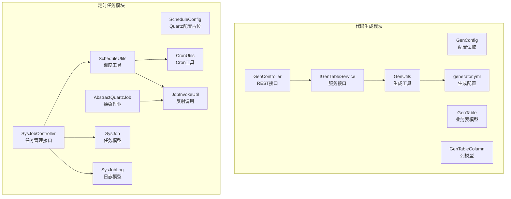
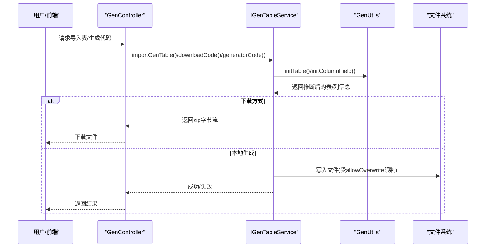
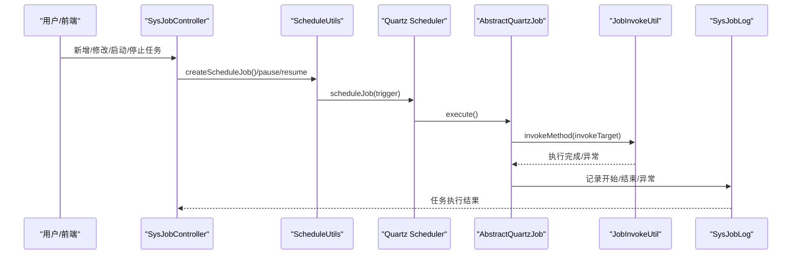
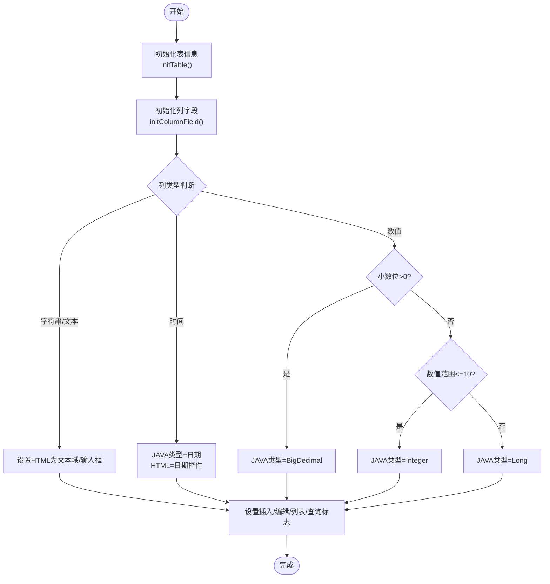
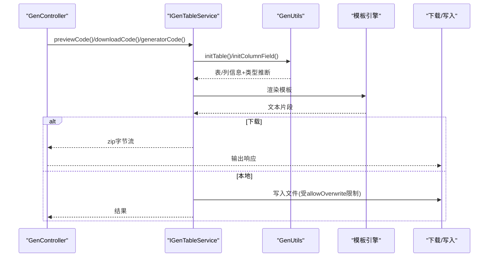
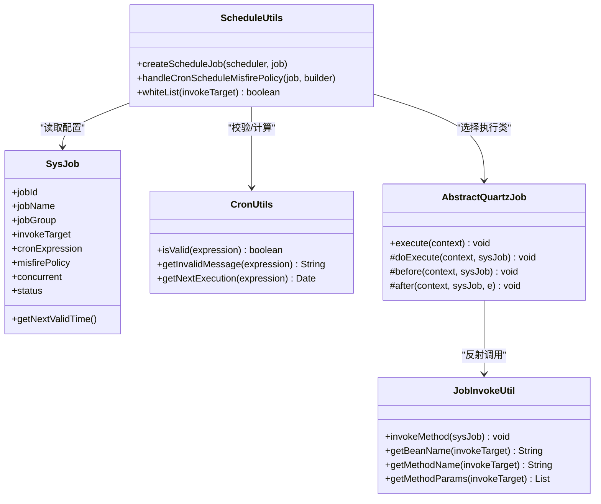
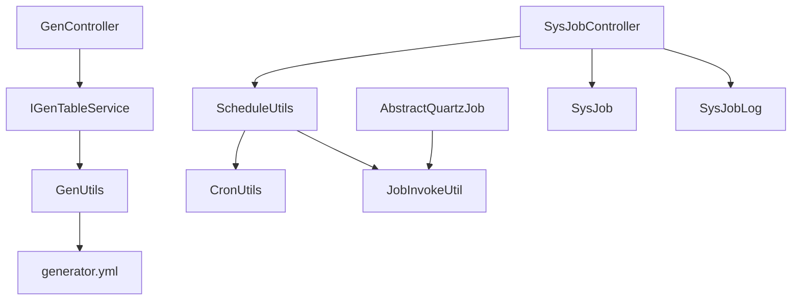

# 专用功能模块

<cite>
**本文引用的文件**
- [GenConfig.java](file://XingChen-Vue/xingchen-generator/src/main/java/com/xingchen/generator/config/GenConfig.java)
- [GenController.java](file://XingChen-Vue/xingchen-generator/src/main/java/com/xingchen/generator/controller/GenController.java)
- [GenTable.java](file://XingChen-Vue/xingchen-generator/src/main/java/com/xingchen/generator/domain/GenTable.java)
- [GenTableColumn.java](file://XingChen-Vue/xingchen-generator/src/main/java/com/xingchen/generator/domain/GenTableColumn.java)
- [IGenTableService.java](file://XingChen-Vue/xingchen-generator/src/main/java/com/xingchen/generator/service/IGenTableService.java)
- [GenUtils.java](file://XingChen-Vue/xingchen-generator/src/main/java/com/xingchen/generator/util/GenUtils.java)
- [generator.yml](file://XingChen-Vue/xingchen-generator/src/main/resources/generator.yml)
- [ScheduleConfig.java](file://XingChen-Vue/xingchen-quartz/src/main/java/com/xingchen/quartz/config/ScheduleConfig.java)
- [SysJobController.java](file://XingChen-Vue/xingchen-quartz/src/main/java/com/xingchen/quartz/controller/SysJobController.java)
- [SysJob.java](file://XingChen-Vue/xingchen-quartz/src/main/java/com/xingchen/quartz/domain/SysJob.java)
- [SysJobLog.java](file://XingChen-Vue/xingchen-quartz/src/main/java/com/xingchen/quartz/domain/SysJobLog.java)
- [AbstractQuartzJob.java](file://XingChen-Vue/xingchen-quartz/src/main/java/com/xingchen/quartz/util/AbstractQuartzJob.java)
- [CronUtils.java](file://XingChen-Vue/xingchen-quartz/src/main/java/com/xingchen/quartz/util/CronUtils.java)
- [JobInvokeUtil.java](file://XingChen-Vue/xingchen-quartz/src/main/java/com/xingchen/quartz/util/JobInvokeUtil.java)
- [ScheduleUtils.java](file://XingChen-Vue/xingchen-quartz/src/main/java/com/xingchen/quartz/util/ScheduleUtils.java)
</cite>

## 目录
1. [引言](#引言)
2. [项目结构](#项目结构)
3. [核心组件](#核心组件)
4. [架构总览](#架构总览)
5. [详细组件分析](#详细组件分析)
6. [依赖分析](#依赖分析)
7. [性能考虑](#性能考虑)
8. [故障排查指南](#故障排查指南)
9. [结论](#结论)
10. [附录](#附录)

## 引言
本文件聚焦于健康管理系统中的两个专用功能模块：代码生成模块（xingchen-generator）与定时任务模块（xingchen-quartz）。前者通过模板引擎与配置驱动，实现从数据库表到前后端代码的自动化生成；后者基于 Quartz 提供任务调度、并发控制与执行监控能力。本文将从设计目的、实现原理、工作流程、配置项、扩展接口与自定义开发等方面进行系统化说明，并提供使用示例与最佳实践。

## 项目结构
- 代码生成模块位于 xingchen-generator，包含配置、控制器、领域模型、服务接口、工具类与模板资源。
- 定时任务模块位于 xingchen-quartz，包含配置、控制器、领域模型、工具类与持久化映射资源。

图表来源
- [GenController.java:47-264](file://XingChen-Vue/xingchen-generator/src/main/java/com/xingchen/generator/controller/GenController.java#L47-L264)
- [IGenTableService.java:12-132](file://XingChen-Vue/xingchen-generator/src/main/java/com/xingchen/generator/service/IGenTableService.java#L12-L132)
- [GenUtils.java:16-258](file://XingChen-Vue/xingchen-generator/src/main/java/com/xingchen/generator/util/GenUtils.java#L16-L258)
- [generator.yml:1-12](file://XingChen-Vue/xingchen-generator/src/main/resources/generator.yml#L1-L12)
- [SysJobController.java:35-186](file://XingChen-Vue/xingchen-quartz/src/main/java/com/xingchen/quartz/controller/SysJobController.java#L35-L186)
- [ScheduleUtils.java:27-142](file://XingChen-Vue/xingchen-quartz/src/main/java/com/xingchen/quartz/util/ScheduleUtils.java#L27-L142)
- [CronUtils.java:13-64](file://XingChen-Vue/xingchen-quartz/src/main/java/com/xingchen/quartz/util/CronUtils.java#L13-L64)
- [JobInvokeUtil.java:16-183](file://XingChen-Vue/xingchen-quartz/src/main/java/com/xingchen/quartz/util/JobInvokeUtil.java#L16-L183)
- [AbstractQuartzJob.java:23-107](file://XingChen-Vue/xingchen-quartz/src/main/java/com/xingchen/quartz/util/AbstractQuartzJob.java#L23-L107)

章节来源
- [GenController.java:47-264](file://XingChen-Vue/xingchen-generator/src/main/java/com/xingchen/generator/controller/GenController.java#L47-L264)
- [SysJobController.java:35-186](file://XingChen-Vue/xingchen-quartz/src/main/java/com/xingchen/quartz/controller/SysJobController.java#L35-L186)

## 核心组件
- 代码生成模块
  - 配置读取：GenConfig 从 generator.yml 加载作者、包路径、表前缀、覆盖策略等。
  - 控制器：GenController 提供导入表、预览、下载、生成到本地、同步数据库、批量生成等接口。
  - 领域模型：GenTable、GenTableColumn 封装表与列元信息及生成选项。
  - 服务接口：IGenTableService 定义生成、预览、下载、同步等契约。
  - 工具类：GenUtils 负责表名转类名、列类型推断、HTML控件类型选择、业务名提取等。
- 定时任务模块
  - 控制器：SysJobController 提供任务的增删改查、启停、立即执行、导出等。
  - 领域模型：SysJob、SysJobLog 封装任务与执行日志。
  - 调度工具：ScheduleUtils、CronUtils、JobInvokeUtil、AbstractQuartzJob 实现调度、Cron解析、反射调用与日志记录。

章节来源
- [GenConfig.java:16-87](file://XingChen-Vue/xingchen-generator/src/main/java/com/xingchen/generator/config/GenConfig.java#L16-L87)
- [GenController.java:47-264](file://XingChen-Vue/xingchen-generator/src/main/java/com/xingchen/generator/controller/GenController.java#L47-L264)
- [GenTable.java:16-398](file://XingChen-Vue/xingchen-generator/src/main/java/com/xingchen/generator/domain/GenTable.java#L16-L398)
- [GenTableColumn.java:12-374](file://XingChen-Vue/xingchen-generator/src/main/java/com/xingchen/generator/domain/GenTableColumn.java#L12-L374)
- [IGenTableService.java:12-132](file://XingChen-Vue/xingchen-generator/src/main/java/com/xingchen/generator/service/IGenTableService.java#L12-L132)
- [GenUtils.java:16-258](file://XingChen-Vue/xingchen-generator/src/main/java/com/xingchen/generator/util/GenUtils.java#L16-L258)
- [SysJobController.java:35-186](file://XingChen-Vue/xingchen-quartz/src/main/java/com/xingchen/quartz/controller/SysJobController.java#L35-L186)
- [SysJob.java:21-172](file://XingChen-Vue/xingchen-quartz/src/main/java/com/xingchen/quartz/domain/SysJob.java#L21-172)
- [SysJobLog.java:15-159](file://XingChen-Vue/xingchen-quartz/src/main/java/com/xingchen/quartz/domain/SysJobLog.java#L15-159)
- [ScheduleUtils.java:27-142](file://XingChen-Vue/xingchen-quartz/src/main/java/com/xingchen/quartz/util/ScheduleUtils.java#L27-L142)
- [CronUtils.java:13-64](file://XingChen-Vue/xingchen-quartz/src/main/java/com/xingchen/quartz/util/CronUtils.java#L13-L64)
- [JobInvokeUtil.java:16-183](file://XingChen-Vue/xingchen-quartz/src/main/java/com/xingchen/quartz/util/JobInvokeUtil.java#L16-L183)
- [AbstractQuartzJob.java:23-107](file://XingChen-Vue/xingchen-quartz/src/main/java/com/xingchen/quartz/util/AbstractQuartzJob.java#L23-L107)

## 架构总览
- 代码生成模块采用“配置驱动 + 模板引擎”的思路：通过 generator.yml 配置生成参数，控制器接收请求后调用服务层，服务层利用工具类完成表/列元信息解析与类型推断，最终输出预览或打包下载。
- 定时任务模块采用“控制器 -> 调度工具 -> Quartz -> 反射调用 -> 日志记录”的链路：控制器校验 Cron 与白名单，调度工具创建触发器并交由 Quartz 执行，执行时通过抽象作业统一记录日志。

图表来源
- [GenController.java:113-224](file://XingChen-Vue/xingchen-generator/src/main/java/com/xingchen/generator/controller/GenController.java#L113-L224)
- [IGenTableService.java:84-123](file://XingChen-Vue/xingchen-generator/src/main/java/com/xingchen/generator/service/IGenTableService.java#L84-L123)
- [GenUtils.java:21-131](file://XingChen-Vue/xingchen-generator/src/main/java/com/xingchen/generator/util/GenUtils.java#L21-L131)

图表来源
- [SysJobController.java:83-184](file://XingChen-Vue/xingchen-quartz/src/main/java/com/xingchen/quartz/controller/SysJobController.java#L83-L184)
- [ScheduleUtils.java:60-98](file://XingChen-Vue/xingchen-quartz/src/main/java/com/xingchen/quartz/util/ScheduleUtils.java#L60-L98)
- [AbstractQuartzJob.java:33-51](file://XingChen-Vue/xingchen-quartz/src/main/java/com/xingchen/quartz/util/AbstractQuartzJob.java#L33-L51)
- [JobInvokeUtil.java:23-40](file://XingChen-Vue/xingchen-quartz/src/main/java/com/xingchen/quartz/util/JobInvokeUtil.java#L23-L40)

## 详细组件分析

### 代码生成模块

#### 配置与模板引擎
- 配置来源：generator.yml 中的 author、packageName、autoRemovePre、tablePrefix、allowOverwrite。
- 配置读取：GenConfig 通过 @ConfigurationProperties 与 @PropertySource 将 YAML 键值注入静态字段，供全局使用。
- 模板资源：vm 目录下按语言/框架组织模板（如 java、js、vue、ts、xml 等），由服务层在生成阶段按需渲染。

章节来源
- [generator.yml:1-12](file://XingChen-Vue/xingchen-generator/src/main/resources/generator.yml#L1-L12)
- [GenConfig.java:16-87](file://XingChen-Vue/xingchen-generator/src/main/java/com/xingchen/generator/config/GenConfig.java#L16-L87)

#### 生成策略与输出控制
- 生成入口：GenController 提供多种生成方式
  - 预览：previewCode 返回各模板渲染后的文本映射。
  - 下载：downloadCode 返回 zip 字节流，浏览器直接下载。
  - 本地生成：genCode 在 allowOverwrite=true 时写入本地文件。
  - 批量生成：batchGenCode 支持多表打包下载。
- 同步数据库：synchDb 将数据库变更同步回 GenTable 元信息。
- 表结构创建：createTable 解析 SQL 并导入新表到生成元数据。

章节来源
- [GenController.java:191-249](file://XingChen-Vue/xingchen-generator/src/main/java/com/xingchen/generator/controller/GenController.java#L191-L249)

#### 数据模型与类型推断
- GenTable：封装表元信息、模板类别（crud/tree/sub）、包名、模块名、业务名、作者、生成方式与路径、树形字段等。
- GenTableColumn：封装列元信息、JAVA 类型、HTML 控件类型、是否必填/插入/编辑/列表/查询、字典类型、排序等。
- GenUtils：负责
  - 表名转类名（支持自动去前缀与自定义前缀列表）
  - 列类型推断（字符串/文本域/日期/数字/长整型/浮点型）
  - HTML 控件类型选择（输入框、单选框、下拉框、富文本、上传等）
  - 业务名提取、关键字替换、数据库类型截取与长度解析

图表来源
- [GenUtils.java:21-131](file://XingChen-Vue/xingchen-generator/src/main/java/com/xingchen/generator/util/GenUtils.java#L21-L131)

章节来源
- [GenTable.java:16-398](file://XingChen-Vue/xingchen-generator/src/main/java/com/xingchen/generator/domain/GenTable.java#L16-L398)
- [GenTableColumn.java:12-374](file://XingChen-Vue/xingchen-generator/src/main/java/com/xingchen/generator/domain/GenTableColumn.java#L12-L374)
- [GenUtils.java:16-258](file://XingChen-Vue/xingchen-generator/src/main/java/com/xingchen/generator/util/GenUtils.java#L16-L258)

#### 生成流程时序

图表来源
- [GenController.java:191-224](file://XingChen-Vue/xingchen-generator/src/main/java/com/xingchen/generator/controller/GenController.java#L191-L224)
- [IGenTableService.java:92-123](file://XingChen-Vue/xingchen-generator/src/main/java/com/xingchen/generator/service/IGenTableService.java#L92-L123)
- [GenUtils.java:21-131](file://XingChen-Vue/xingchen-generator/src/main/java/com/xingchen/generator/util/GenUtils.java#L21-L131)

### 定时任务模块

#### 任务调度机制
- 任务模型：SysJob 包含任务名、组、Cron 表达式、并发策略、状态、下次执行时间等。
- 调度工具：ScheduleUtils
  - 根据 concurrent 选择并发执行类
  - 构建 JobDetail 与 CronTrigger
  - 处理 misfirePolicy（忽略/立即/不处理）
  - 白名单校验 invokeTarget，防止非法调用
- Cron 工具：CronUtils 提供表达式合法性校验与下一次执行时间计算。
- 反射调用：JobInvokeUtil 解析 invokeTarget（bean.method(args...)），支持字符串、布尔、长整型、双精度、整型等参数类型解析与反射调用。
- 抽象作业：AbstractQuartzJob 统一 before/after 生命周期，记录 SysJobLog。

图表来源
- [SysJob.java:21-172](file://XingChen-Vue/xingchen-quartz/src/main/java/com/xingchen/quartz/domain/SysJob.java#L21-172)
- [ScheduleUtils.java:27-142](file://XingChen-Vue/xingchen-quartz/src/main/java/com/xingchen/quartz/util/ScheduleUtils.java#L27-L142)
- [CronUtils.java:13-64](file://XingChen-Vue/xingchen-quartz/src/main/java/com/xingchen/quartz/util/CronUtils.java#L13-L64)
- [JobInvokeUtil.java:16-183](file://XingChen-Vue/xingchen-quartz/src/main/java/com/xingchen/quartz/util/JobInvokeUtil.java#L16-L183)
- [AbstractQuartzJob.java:23-107](file://XingChen-Vue/xingchen-quartz/src/main/java/com/xingchen/quartz/util/AbstractQuartzJob.java#L23-L107)

#### 任务执行策略与安全控制
- 并发策略：concurrent=0 允许并发，否则禁止并发执行。
- misfirePolicy：支持默认、忽略错失、立即执行、不处理四种策略。
- 白名单校验：仅允许白名单包路径下的 Bean 调用，防止远程协议（RMI/LDAP/HTTP）与违规字符串注入。
- 立即执行：run 接口可强制当前执行一次。

章节来源
- [SysJobController.java:154-172](file://XingChen-Vue/xingchen-quartz/src/main/java/com/xingchen/quartz/controller/SysJobController.java#L154-L172)
- [ScheduleUtils.java:103-120](file://XingChen-Vue/xingchen-quartz/src/main/java/com/xingchen/quartz/util/ScheduleUtils.java#L103-L120)
- [SysJobController.java:83-111](file://XingChen-Vue/xingchen-quartz/src/main/java/com/xingchen/quartz/controller/SysJobController.java#L83-L111)

#### 监控与日志
- SysJobLog 记录任务执行的开始/结束时间、状态、异常信息与耗时。
- AbstractQuartzJob 在 after 阶段统一落库，便于审计与排障。

章节来源
- [SysJobLog.java:15-159](file://XingChen-Vue/xingchen-quartz/src/main/java/com/xingchen/quartz/domain/SysJobLog.java#L15-159)
- [AbstractQuartzJob.java:70-96](file://XingChen-Vue/xingchen-quartz/src/main/java/com/xingchen/quartz/util/AbstractQuartzJob.java#L70-L96)

## 依赖分析
- 代码生成模块内部耦合度低，控制器依赖服务接口，服务依赖工具类与配置；模板资源独立于 Java 逻辑。
- 定时任务模块中 SysJobController 依赖 ScheduleUtils、CronUtils、JobInvokeUtil；AbstractQuartzJob 依赖 JobInvokeUtil 与日志服务；调度工厂配置在注释中提供参考。

图表来源
- [GenController.java:49-53](file://XingChen-Vue/xingchen-generator/src/main/java/com/xingchen/generator/controller/GenController.java#L49-L53)
- [IGenTableService.java:12-132](file://XingChen-Vue/xingchen-generator/src/main/java/com/xingchen/generator/service/IGenTableService.java#L12-L132)
- [GenUtils.java:16-258](file://XingChen-Vue/xingchen-generator/src/main/java/com/xingchen/generator/util/GenUtils.java#L16-L258)
- [SysJobController.java:39-40](file://XingChen-Vue/xingchen-quartz/src/main/java/com/xingchen/quartz/controller/SysJobController.java#L39-L40)
- [ScheduleUtils.java:27-142](file://XingChen-Vue/xingchen-quartz/src/main/java/com/xingchen/quartz/util/ScheduleUtils.java#L27-L142)
- [JobInvokeUtil.java:16-183](file://XingChen-Vue/xingchen-quartz/src/main/java/com/xingchen/quartz/util/JobInvokeUtil.java#L16-L183)
- [AbstractQuartzJob.java:23-107](file://XingChen-Vue/xingchen-quartz/src/main/java/com/xingchen/quartz/util/AbstractQuartzJob.java#L23-L107)

## 性能考虑
- 代码生成
  - 大批量生成时优先使用下载方式，减少本地磁盘写入开销。
  - 合理设置模板数量与复杂度，避免过度渲染导致内存压力。
- 定时任务
  - 并发策略按业务场景选择，避免阻塞关键路径。
  - misfirePolicy 与 Cron 表达式应结合业务 SLA 设计，防止任务堆积。
  - 白名单与参数解析在执行前完成，降低运行时反射成本。

## 故障排查指南
- 代码生成
  - 若提示不允许覆盖本地文件，请检查 generator.yml 的 allowOverwrite 配置。
  - 预览为空或字段缺失：确认导入表是否成功、列信息是否完整。
- 定时任务
  - Cron 表达式不合法：使用 CronUtils.isValid 校验，查看 getInvalidMessage 获取具体错误。
  - 任务无法执行：检查白名单配置与 invokeTarget 格式；确认 Scheduler 是否启动。
  - 执行异常：查看 SysJobLog 的 exceptionInfo 与耗时，定位具体方法与参数。

章节来源
- [GenController.java:218-224](file://XingChen-Vue/xingchen-generator/src/main/java/com/xingchen/generator/controller/GenController.java#L218-L224)
- [CronUtils.java:21-42](file://XingChen-Vue/xingchen-quartz/src/main/java/com/xingchen/quartz/util/CronUtils.java#L21-L42)
- [ScheduleUtils.java:128-140](file://XingChen-Vue/xingchen-quartz/src/main/java/com/xingchen/quartz/util/ScheduleUtils.java#L128-L140)
- [AbstractQuartzJob.java:84-92](file://XingChen-Vue/xingchen-quartz/src/main/java/com/xingchen/quartz/util/AbstractQuartzJob.java#L84-L92)

## 结论
代码生成模块通过配置与工具类实现了高可定制的代码产出流程，适合快速落地 CRUD、树形与主子表等常见业务；定时任务模块基于 Quartz 提供了安全可控的调度能力，配合白名单与日志体系，满足生产环境的稳定性与可观测性需求。两者均可通过扩展接口与自定义策略进一步适配更复杂的业务场景。

## 附录

### 配置选项与扩展接口清单
- 代码生成配置（generator.yml）
  - author：默认作者
  - packageName：生成包路径
  - autoRemovePre：是否自动去除表前缀
  - tablePrefix：表前缀列表（逗号分隔）
  - allowOverwrite：是否允许生成文件覆盖到本地
- 生成扩展接口
  - IGenTableService：可在服务层扩展导入、生成、预览、下载、同步等策略
  - GenUtils：可在工具类中扩展类型推断与模板选择规则
- 定时任务配置（注释中提供参考）
  - SchedulerFactoryBean：可配置线程池、JobStore、集群与覆盖策略
  - 白名单：Constants.JOB_WHITELIST_STR 与 Constants.JOB_ERROR_STR 控制调用范围
- 任务扩展接口
  - AbstractQuartzJob：可继承实现 doExecute，注入业务逻辑
  - ScheduleUtils：可扩展 misfirePolicy 与并发策略

章节来源
- [generator.yml:1-12](file://XingChen-Vue/xingchen-generator/src/main/resources/generator.yml#L1-L12)
- [IGenTableService.java:12-132](file://XingChen-Vue/xingchen-generator/src/main/java/com/xingchen/generator/service/IGenTableService.java#L12-L132)
- [GenUtils.java:16-258](file://XingChen-Vue/xingchen-generator/src/main/java/com/xingchen/generator/util/GenUtils.java#L16-L258)
- [ScheduleConfig.java:14-57](file://XingChen-Vue/xingchen-quartz/src/main/java/com/xingchen/quartz/config/ScheduleConfig.java#L14-57)
- [AbstractQuartzJob.java:105-106](file://XingChen-Vue/xingchen-quartz/src/main/java/com/xingchen/quartz/util/AbstractQuartzJob.java#L105-L106)
- [ScheduleUtils.java:103-120](file://XingChen-Vue/xingchen-quartz/src/main/java/com/xingchen/quartz/util/ScheduleUtils.java#L103-L120)

### 使用示例与最佳实践
- 代码生成
  - 示例：导入多表 -> 预览 -> 下载 zip -> 根据需要调整模板 -> 本地生成
  - 最佳实践：先预览再下载，确保字段与模板符合预期；本地生成需开启 allowOverwrite 并谨慎覆盖
- 定时任务
  - 示例：新增任务 -> 校验 Cron -> 白名单通过 -> 启动/暂停/立即执行
  - 最佳实践：为关键任务配置合理的 misfirePolicy；对高频任务启用并发控制；严格限制 invokeTarget 的包路径