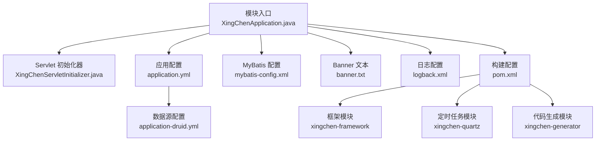
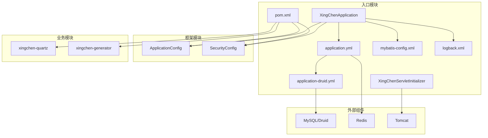
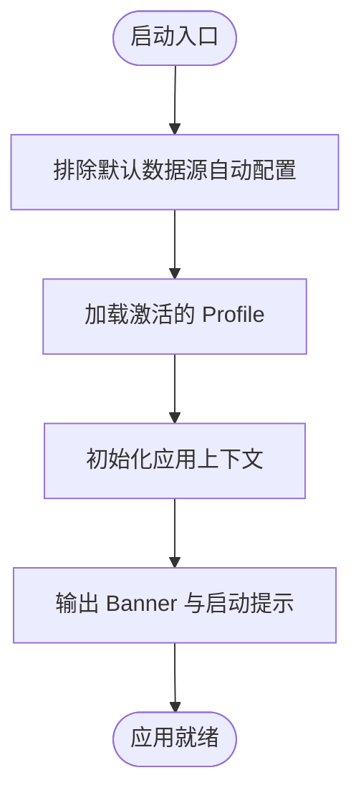
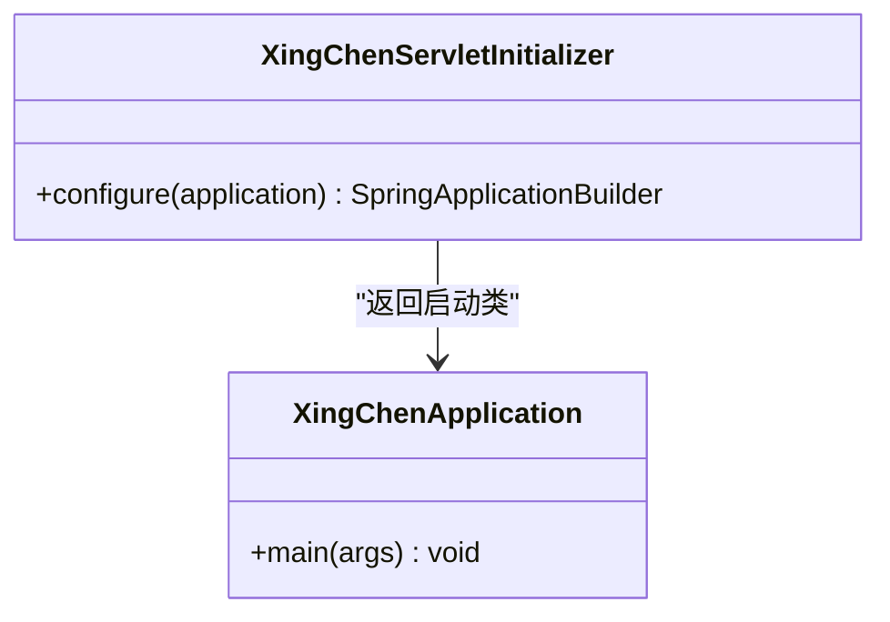
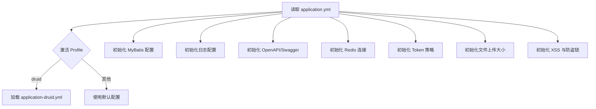
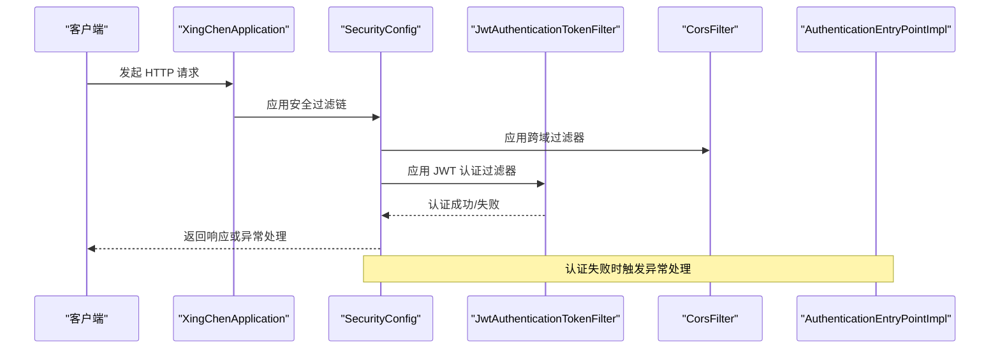
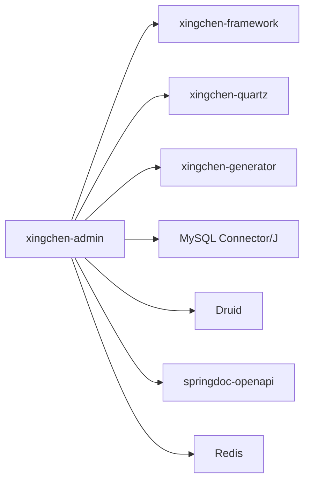

# 主应用模块(xingchen-admin)

<cite>
**本文引用的文件**
- [XingChenApplication.java](file://XingChen-Vue/xingchen-admin/src/main/java/com/xingchen/XingChenApplication.java)
- [XingChenServletInitializer.java](file://XingChen-Vue/xingchen-admin/src/main/java/com/xingchen/XingChenServletInitializer.java)
- [application.yml](file://XingChen-Vue/xingchen-admin/src/main/resources/application.yml)
- [application-druid.yml](file://XingChen-Vue/xingchen-admin/src/main/resources/application-druid.yml)
- [mybatis-config.xml](file://XingChen-Vue/xingchen-admin/src/main/resources/mybatis/mybatis-config.xml)
- [banner.txt](file://XingChen-Vue/xingchen-admin/src/main/resources/banner.txt)
- [logback.xml](file://XingChen-Vue/xingchen-admin/src/main/resources/logback.xml)
- [pom.xml](file://XingChen-Vue/xingchen-admin/pom.xml)
- [ApplicationConfig.java](file://XingChen-Vue/xingchen-framework/src/main/java/com/xingchen/framework/config/ApplicationConfig.java)
- [SecurityConfig.java](file://XingChen-Vue/xingchen-framework/src/main/java/com/xingchen/framework/config/SecurityConfig.java)
</cite>

## 目录
1. [简介](#简介)
2. [项目结构](#项目结构)
3. [核心组件](#核心组件)
4. [架构总览](#架构总览)
5. [详细组件分析](#详细组件分析)
6. [依赖分析](#依赖分析)
7. [性能考虑](#性能考虑)
8. [故障排查指南](#故障排查指南)
9. [结论](#结论)
10. [附录](#附录)

## 简介
xingchen-admin 是健康管理系统（XingChen）的 Web 服务入口模块，负责承载 Spring Boot 应用的启动、配置加载、安全策略、MyBatis 数据访问以及 OpenAPI/Swagger 文档等能力。该模块以 Spring Boot 自动装配为核心，整合框架模块（xingchen-framework）、定时任务模块（xingchen-quartz）与代码生成模块（xingchen-generator），并通过 Maven 插件打包为可独立运行的 JAR 或 WAR。

## 项目结构
xingchen-admin 的结构遵循“入口模块 + 外部配置 + 资源文件”的组织方式：
- 启动类与 Servlet 初始化器位于 Java 源码根目录
- 配置文件分为基础配置与数据源配置，分别对应不同环境 Profile
- MyBatis 全局配置与日志配置位于 resources 下
- 构建脚本通过 Maven 插件完成打包与 WAR 支持

图表来源
- [XingChenApplication.java:1-31](file://XingChen-Vue/xingchen-admin/src/main/java/com/xingchen/XingChenApplication.java#L1-L31)
- [XingChenServletInitializer.java:1-19](file://XingChen-Vue/xingchen-admin/src/main/java/com/xingchen/XingChenServletInitializer.java#L1-L19)
- [application.yml:1-148](file://XingChen-Vue/xingchen-admin/src/main/resources/application.yml#L1-L148)
- [application-druid.yml:1-61](file://XingChen-Vue/xingchen-admin/src/main/resources/application-druid.yml#L1-L61)
- [mybatis-config.xml:1-21](file://XingChen-Vue/xingchen-admin/src/main/resources/mybatis/mybatis-config.xml#L1-L21)
- [banner.txt:1-24](file://XingChen-Vue/xingchen-admin/src/main/resources/banner.txt#L1-L24)
- [logback.xml:1-93](file://XingChen-Vue/xingchen-admin/src/main/resources/logback.xml#L1-L93)
- [pom.xml:1-88](file://XingChen-Vue/xingchen-admin/pom.xml#L1-L88)

章节来源
- [XingChenApplication.java:1-31](file://XingChen-Vue/xingchen-admin/src/main/java/com/xingchen/XingChenApplication.java#L1-L31)
- [XingChenServletInitializer.java:1-19](file://XingChen-Vue/xingchen-admin/src/main/java/com/xingchen/XingChenServletInitializer.java#L1-L19)
- [application.yml:1-148](file://XingChen-Vue/xingchen-admin/src/main/resources/application.yml#L1-L148)
- [application-druid.yml:1-61](file://XingChen-Vue/xingchen-admin/src/main/resources/application-druid.yml#L1-L61)
- [mybatis-config.xml:1-21](file://XingChen-Vue/xingchen-admin/src/main/resources/mybatis/mybatis-config.xml#L1-L21)
- [banner.txt:1-24](file://XingChen-Vue/xingchen-admin/src/main/resources/banner.txt#L1-L24)
- [logback.xml:1-93](file://XingChen-Vue/xingchen-admin/src/main/resources/logback.xml#L1-L93)
- [pom.xml:1-88](file://XingChen-Vue/xingchen-admin/pom.xml#L1-L88)

## 核心组件
- 启动类与自动装配
  - 启动类通过注解声明排除数据源自动配置，交由框架模块统一管理动态数据源与 Druid 连接池
  - 启动类负责应用上下文初始化、Banner 输出与运行时提示
- Servlet 初始化器
  - 支持将应用打包为 WAR 并部署到外部 Tomcat 容器
- 配置体系
  - application.yml 提供项目元信息、服务器、日志、国际化、Redis、Token、MyBatis、PageHelper、OpenAPI、防盗链与 XSS 等配置
  - application-druid.yml 提供 Druid 数据源与监控控制台配置
- ORM 与日志
  - mybatis-config.xml 提供 MyBatis 全局设置（如缓存、执行器、日志实现）
  - logback.xml 提供控制台与滚动文件输出、按级别过滤与用户操作日志通道
- 构建与打包
  - pom.xml 引入 DevTools、OpenAPI、MySQL 驱动与三大子模块；通过 Spring Boot Maven 插件与 WAR 插件完成打包与部署支持

章节来源
- [XingChenApplication.java:12-29](file://XingChen-Vue/xingchen-admin/src/main/java/com/xingchen/XingChenApplication.java#L12-L29)
- [XingChenServletInitializer.java:11-17](file://XingChen-Vue/xingchen-admin/src/main/java/com/xingchen/XingChenServletInitializer.java#L11-L17)
- [application.yml:1-148](file://XingChen-Vue/xingchen-admin/src/main/resources/application.yml#L1-L148)
- [application-druid.yml:1-61](file://XingChen-Vue/xingchen-admin/src/main/resources/application-druid.yml#L1-L61)
- [mybatis-config.xml:1-21](file://XingChen-Vue/xingchen-admin/src/main/resources/mybatis/mybatis-config.xml#L1-L21)
- [logback.xml:1-93](file://XingChen-Vue/xingchen-admin/src/main/resources/logback.xml#L1-L93)
- [pom.xml:18-86](file://XingChen-Vue/xingchen-admin/pom.xml#L18-L86)

## 架构总览
xingchen-admin 作为入口模块，向上承接框架模块的安全、拦截、异步与工具能力，向下对接定时任务与代码生成模块，并通过配置中心与外部组件（Redis、MySQL、Druid）协同工作。

图表来源
- [XingChenApplication.java:12-29](file://XingChen-Vue/xingchen-admin/src/main/java/com/xingchen/XingChenApplication.java#L12-L29)
- [XingChenServletInitializer.java:11-17](file://XingChen-Vue/xingchen-admin/src/main/java/com/xingchen/XingChenServletInitializer.java#L11-L17)
- [application.yml:48-148](file://XingChen-Vue/xingchen-admin/src/main/resources/application.yml#L48-L148)
- [application-druid.yml:1-61](file://XingChen-Vue/xingchen-admin/src/main/resources/application-druid.yml#L1-L61)
- [mybatis-config.xml:1-21](file://XingChen-Vue/xingchen-admin/src/main/resources/mybatis/mybatis-config.xml#L1-L21)
- [logback.xml:1-93](file://XingChen-Vue/xingchen-admin/src/main/resources/logback.xml#L1-L93)
- [pom.xml:18-56](file://XingChen-Vue/xingchen-admin/pom.xml#L18-L56)
- [ApplicationConfig.java:12-19](file://XingChen-Vue/xingchen-framework/src/main/java/com/xingchen/framework/config/ApplicationConfig.java#L12-L19)
- [SecurityConfig.java:27-129](file://XingChen-Vue/xingchen-framework/src/main/java/com/xingchen/framework/config/SecurityConfig.java#L27-L129)

## 详细组件分析

### 启动类与应用上下文初始化
- 设计职责
  - 作为 Spring Boot 应用的唯一入口，负责排除默认数据源自动配置，避免与框架模块的动态数据源冲突
  - 初始化应用上下文、Banner 输出与运行提示
- 关键点
  - 启动类通过注解声明排除数据源自动配置，确保由框架模块统一管理
  - 支持通过命令行参数传入 JVM 参数（如热部署开关）
- 流程图

图表来源
- [XingChenApplication.java:12-29](file://XingChen-Vue/xingchen-admin/src/main/java/com/xingchen/XingChenApplication.java#L12-L29)
- [application.yml:54-55](file://XingChen-Vue/xingchen-admin/src/main/resources/application.yml#L54-L55)

章节来源
- [XingChenApplication.java:12-29](file://XingChen-Vue/xingchen-admin/src/main/java/com/xingchen/XingChenApplication.java#L12-L29)

### Servlet 初始化器与 WAR 部署
- 设计职责
  - 在外部 Tomcat 中以 WAR 方式部署时，提供 SpringApplicationBuilder 配置
- 关键点
  - 返回启动类作为应用入口，确保容器启动流程与本地运行一致
- 类图

图表来源
- [XingChenServletInitializer.java:11-17](file://XingChen-Vue/xingchen-admin/src/main/java/com/xingchen/XingChenServletInitializer.java#L11-L17)
- [XingChenApplication.java:15-18](file://XingChen-Vue/xingchen-admin/src/main/java/com/xingchen/XingChenApplication.java#L15-L18)

章节来源
- [XingChenServletInitializer.java:11-17](file://XingChen-Vue/xingchen-admin/src/main/java/com/xingchen/XingChenServletInitializer.java#L11-L17)

### 配置体系与运行时行为
- application.yml
  - 项目元信息：名称、版本、版权年份、文件路径、验证码类型等
  - 服务器：端口、上下文路径、Tomcat 线程与排队参数
  - 日志：模块与框架日志级别
  - 用户：密码最大重试次数与锁定时间
  - Spring：国际化、Profile、文件上传大小、Jackson 时区与日期格式、DevTools 热部署
  - Redis：地址、端口、数据库、连接超时与连接池参数
  - Token：Header 名称、密钥、过期时间
  - MyBatis：实体别名包、Mapper 扫描路径、全局配置文件位置
  - PageHelper：方言、方法参数支持与 SQL 参数
  - OpenAPI：API 文档路径、UI 启用与分组扫描
  - 防盗链：开关与允许域名列表
  - XSS：过滤开关、排除路径与匹配模式
- application-druid.yml
  - 数据源类型与驱动
  - 主库与从库（默认关闭）URL、账号与密码
  - 连接池初始大小、最小空闲、最大活跃、等待与超时参数
  - 检测与销毁策略、慢 SQL 记录与 SQL 合并
  - 控制台白名单、访问路径与账号密码
- 运行时行为
  - 激活 Profile 为 druid，加载 Druid 数据源配置
  - 启用 OpenAPI/Swagger UI，便于接口调试与文档浏览
  - 启用 DevTools 热部署，提升开发效率
  - 启用 XSS 过滤与防盗链策略，增强安全性
- 配置项表格

图表来源
- [application.yml:48-148](file://XingChen-Vue/xingchen-admin/src/main/resources/application.yml#L48-L148)
- [application-druid.yml:1-61](file://XingChen-Vue/xingchen-admin/src/main/resources/application-druid.yml#L1-L61)

章节来源
- [application.yml:1-148](file://XingChen-Vue/xingchen-admin/src/main/resources/application.yml#L1-L148)
- [application-druid.yml:1-61](file://XingChen-Vue/xingchen-admin/src/main/resources/application-druid.yml#L1-L61)

### ORM 与日志配置
- MyBatis 全局设置
  - 启用二级缓存、JDBC 自动生成主键、默认执行器类型与日志实现
- Logback 输出
  - 控制台输出与按级别（INFO/ERROR）滚动文件输出
  - 用户操作日志独立通道与保留策略
- 行为影响
  - 统一日志格式与级别，便于问题定位与审计
  - MyBatis 默认日志实现为 SLF4J，便于与 Logback 协同

章节来源
- [mybatis-config.xml:1-21](file://XingChen-Vue/xingchen-admin/src/main/resources/mybatis/mybatis-config.xml#L1-L21)
- [logback.xml:1-93](file://XingChen-Vue/xingchen-admin/src/main/resources/logback.xml#L1-L93)

### 构建与打包
- 依赖
  - DevTools、OpenAPI、MySQL 驱动
  - 框架模块、定时任务模块、代码生成模块
- 插件
  - Spring Boot Maven 插件：repackage 生成可执行 JAR/WAR
  - WAR 插件：支持外部容器部署
- 行为
  - 打包产物包含资源文件与依赖库，最终名称为模块 artifactId

章节来源
- [pom.xml:18-86](file://XingChen-Vue/xingchen-admin/pom.xml#L18-L86)

### 模块整合与依赖注入
- 入口模块通过框架模块提供的配置类实现自动装配：
  - ApplicationConfig：开启 AOP 代理与 Mapper 扫描
  - SecurityConfig：配置 Spring Security 过滤链、匿名放行 URL、JWT 过滤器与跨域过滤器
- 依赖注入使用场景
  - 安全模块：认证失败处理器、登出处理器、JWT 过滤器、跨域过滤器
  - 配置模块：匿名放行 URL 属性
- 交互序列图

图表来源
- [SecurityConfig.java:86-118](file://XingChen-Vue/xingchen-framework/src/main/java/com/xingchen/framework/config/SecurityConfig.java#L86-L118)
- [SecurityConfig.java:18-21](file://XingChen-Vue/xingchen-framework/src/main/java/com/xingchen/framework/config/SecurityConfig.java#L18-L21)

章节来源
- [ApplicationConfig.java:12-19](file://XingChen-Vue/xingchen-framework/src/main/java/com/xingchen/framework/config/ApplicationConfig.java#L12-L19)
- [SecurityConfig.java:27-129](file://XingChen-Vue/xingchen-framework/src/main/java/com/xingchen/framework/config/SecurityConfig.java#L27-L129)

## 依赖分析
- 内部依赖
  - xingchen-admin 依赖 xingchen-framework（安全、拦截、异步、工具）、xingchen-quartz（定时任务）、xingchen-generator（代码生成）
- 外部依赖
  - Spring Boot、Spring Security、MyBatis、MySQL 驱动、Druid、OpenAPI、Redis
- 依赖关系图

图表来源
- [pom.xml:18-56](file://XingChen-Vue/xingchen-admin/pom.xml#L18-L56)

章节来源
- [pom.xml:18-56](file://XingChen-Vue/xingchen-admin/pom.xml#L18-L56)

## 性能考虑
- 连接池与数据库
  - Druid 连接池参数（初始大小、最小空闲、最大活跃、等待与超时）需结合业务并发与数据库性能调优
  - 慢 SQL 记录与合并策略有助于定位性能瓶颈
- 线程与服务器
  - Tomcat 线程池参数（最大线程、最小空闲、接受队列）应根据请求峰值与响应时间目标调整
- 缓存与日志
  - MyBatis 二级缓存与 Logback 滚动策略对内存与磁盘占用有直接影响
- 热部署
  - DevTools 热部署在开发阶段提升效率，生产环境建议关闭以减少资源消耗

## 故障排查指南
- 启动失败
  - 检查 application.yml 与 application-druid.yml 的语法与路径
  - 确认激活 Profile 是否正确加载
- 数据库连接异常
  - 校验 Druid 主库 URL、账号与密码
  - 查看慢 SQL 与连接池状态
- 安全与认证问题
  - 核对匿名放行 URL 与 JWT 过滤器顺序
  - 检查跨域过滤器配置
- 日志与审计
  - 检查日志级别与输出路径
  - 关注用户操作日志通道与保留策略

章节来源
- [application.yml:48-148](file://XingChen-Vue/xingchen-admin/src/main/resources/application.yml#L48-L148)
- [application-druid.yml:1-61](file://XingChen-Vue/xingchen-admin/src/main/resources/application-druid.yml#L1-L61)
- [logback.xml:1-93](file://XingChen-Vue/xingchen-admin/src/main/resources/logback.xml#L1-L93)
- [SecurityConfig.java:86-118](file://XingChen-Vue/xingchen-framework/src/main/java/com/xingchen/framework/config/SecurityConfig.java#L86-L118)

## 结论
xingchen-admin 作为系统入口模块，通过清晰的启动类与配置体系，实现了与框架模块、定时任务模块与代码生成模块的无缝整合。其配置覆盖了安全、数据访问、文档、日志与部署等多个维度，既满足开发阶段的高效迭代，也为生产环境提供了稳定的运行保障。建议在生产环境中关闭热部署、合理配置连接池与线程池参数，并持续优化慢 SQL 与日志策略。

## 附录
- 启动参数与环境变量
  - 可通过 JVM 参数控制热部署、Banner 输出与日志级别
  - 通过环境变量或外部配置文件覆盖 application.yml 中的敏感信息
- 扩展点与定制化
  - 新增匿名放行 URL：在安全配置中添加放行规则
  - 自定义日志输出：在 logback.xml 中新增 Appender 与 Logger
  - 数据源扩展：在 application-druid.yml 中新增从库或调整连接池参数
  - 文档与监控：通过 OpenAPI 与 Druid 控制台进行接口与数据库监控