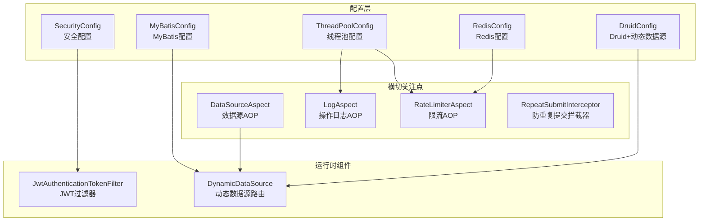
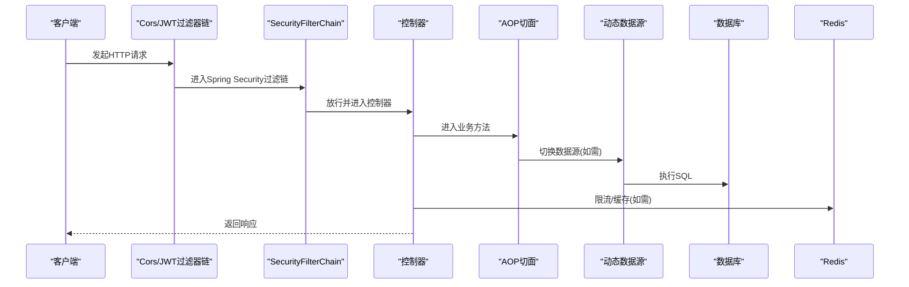
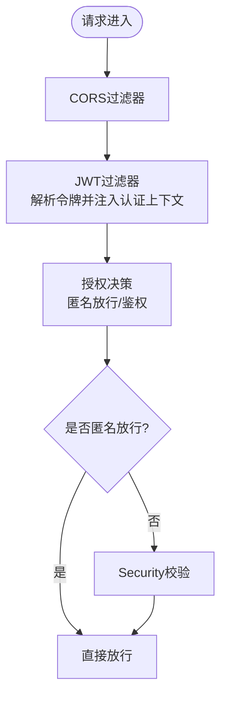
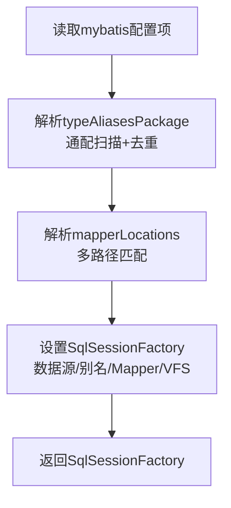
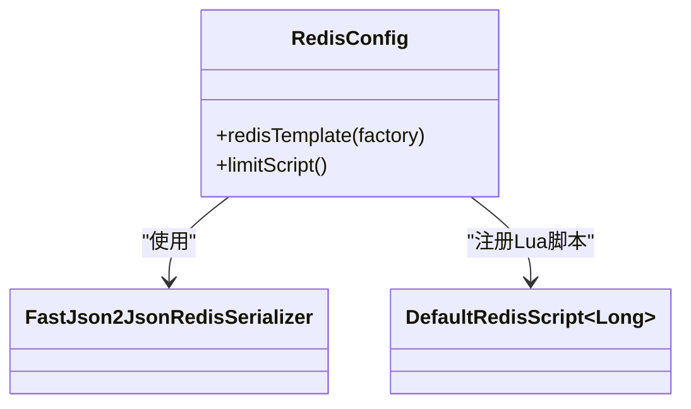
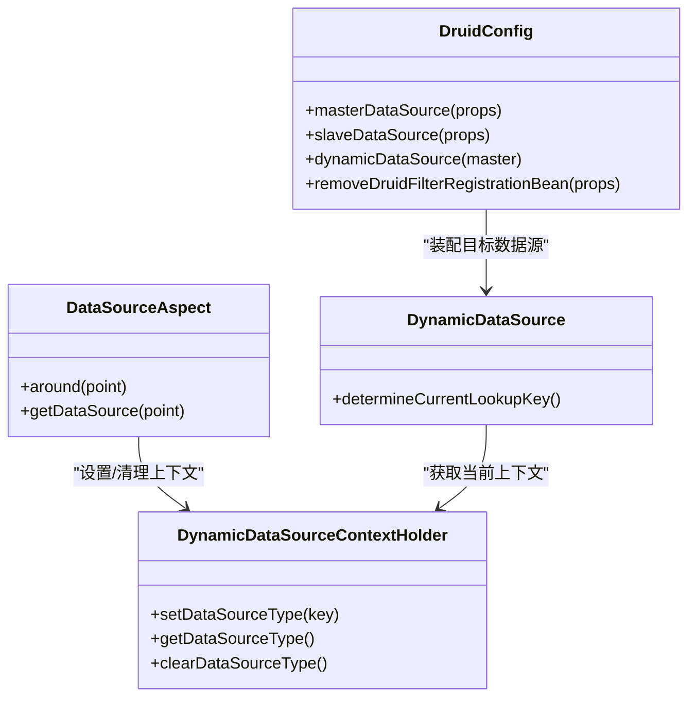
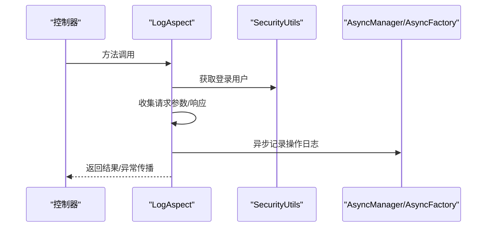
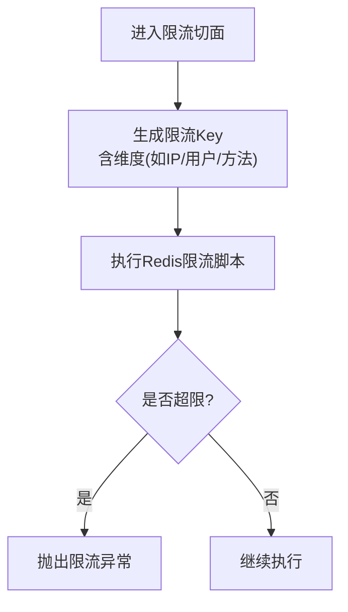
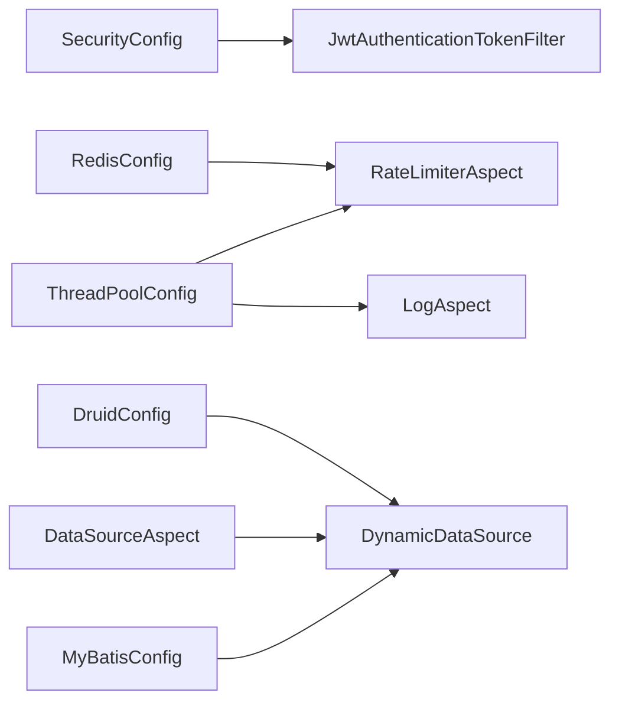

# 框架核心模块(xingchen-framework)

<cite>
**本文引用的文件**
- [SecurityConfig.java](file://XingChen-Vue/xingchen-framework/src/main/java/com/xingchen/framework/config/SecurityConfig.java)
- [MyBatisConfig.java](file://XingChen-Vue/xingchen-framework/src/main/java/com/xingchen/framework/config/MyBatisConfig.java)
- [RedisConfig.java](file://XingChen-Vue/xingchen-framework/src/main/java/com/xingchen/framework/config/RedisConfig.java)
- [DruidConfig.java](file://XingChen-Vue/xingchen-framework/src/main/java/com/xingchen/framework/config/DruidConfig.java)
- [ThreadPoolConfig.java](file://XingChen-Vue/xingchen-framework/src/main/java/com/xingchen/framework/config/ThreadPoolConfig.java)
- [DataSourceAspect.java](file://XingChen-Vue/xingchen-framework/src/main/java/com/xingchen/framework/aspectj/DataSourceAspect.java)
- [LogAspect.java](file://XingChen-Vue/xingchen-framework/src/main/java/com/xingchen/framework/aspectj/LogAspect.java)
- [RateLimiterAspect.java](file://XingChen-Vue/xingchen-framework/src/main/java/com/xingchen/framework/aspectj/RateLimiterAspect.java)
- [DynamicDataSource.java](file://XingChen-Vue/xingchen-framework/src/main/java/com/xingchen/framework/datasource/DynamicDataSource.java)
- [JwtAuthenticationTokenFilter.java](file://XingChen-Vue/xingchen-framework/src/main/java/com/xingchen/framework/security/filter/JwtAuthenticationTokenFilter.java)
- [RepeatSubmitInterceptor.java](file://XingChen-Vue/xingchen-framework/src/main/java/com/xingchen/framework/interceptor/RepeatSubmitInterceptor.java)
</cite>

## 目录
1. [简介](#简介)
2. [项目结构](#项目结构)
3. [核心组件](#核心组件)
4. [架构总览](#架构总览)
5. [详细组件分析](#详细组件分析)
6. [依赖关系分析](#依赖关系分析)
7. [性能考量](#性能考量)
8. [故障排查指南](#故障排查指南)
9. [结论](#结论)
10. [附录：扩展与自定义指南](#附录扩展与自定义指南)

## 简介
xingchen-framework 是健康管理系统后端的基础设施模块，负责提供统一的安全认证、数据访问、缓存与限流、动态数据源、日志与异步任务管理等横切能力。它以 Spring Boot 为基础，结合 Spring Security、Spring AOP、MyBatis、Redis、Druid 等技术栈，形成一套可扩展、可配置、可演进的通用框架层。

## 项目结构
框架模块位于 XingChen-Vue/xingchen-framework，主要按“配置类、AOP切面、拦截器、动态数据源、安全管理、异步任务”分层组织，职责清晰、边界明确。

图表来源
- [SecurityConfig.java:1-129](file://XingChen-Vue/xingchen-framework/src/main/java/com/xingchen/framework/config/SecurityConfig.java#L1-L129)
- [MyBatisConfig.java:1-132](file://XingChen-Vue/xingchen-framework/src/main/java/com/xingchen/framework/config/MyBatisConfig.java#L1-L132)
- [RedisConfig.java:1-71](file://XingChen-Vue/xingchen-framework/src/main/java/com/xingchen/framework/config/RedisConfig.java#L1-L71)
- [DruidConfig.java:1-127](file://XingChen-Vue/xingchen-framework/src/main/java/com/xingchen/framework/config/DruidConfig.java#L1-L127)
- [ThreadPoolConfig.java:1-64](file://XingChen-Vue/xingchen-framework/src/main/java/com/xingchen/framework/config/ThreadPoolConfig.java#L1-L64)
- [DataSourceAspect.java:1-73](file://XingChen-Vue/xingchen-framework/src/main/java/com/xingchen/framework/aspectj/DataSourceAspect.java#L1-L73)
- [LogAspect.java:1-265](file://XingChen-Vue/xingchen-framework/src/main/java/com/xingchen/framework/aspectj/LogAspect.java#L1-L265)
- [RateLimiterAspect.java:1-90](file://XingChen-Vue/xingchen-framework/src/main/java/com/xingchen/framework/aspectj/RateLimiterAspect.java#L1-L90)
- [DynamicDataSource.java:1-26](file://XingChen-Vue/xingchen-framework/src/main/java/com/xingchen/framework/datasource/DynamicDataSource.java#L1-L26)
- [JwtAuthenticationTokenFilter.java:1-45](file://XingChen-Vue/xingchen-framework/src/main/java/com/xingchen/framework/security/filter/JwtAuthenticationTokenFilter.java#L1-L45)
- [RepeatSubmitInterceptor.java:1-57](file://XingChen-Vue/xingchen-framework/src/main/java/com/xingchen/framework/interceptor/RepeatSubmitInterceptor.java#L1-L57)

章节来源
- [SecurityConfig.java:1-129](file://XingChen-Vue/xingchen-framework/src/main/java/com/xingchen/framework/config/SecurityConfig.java#L1-L129)
- [MyBatisConfig.java:1-132](file://XingChen-Vue/xingchen-framework/src/main/java/com/xingchen/framework/config/MyBatisConfig.java#L1-L132)
- [RedisConfig.java:1-71](file://XingChen-Vue/xingchen-framework/src/main/java/com/xingchen/framework/config/RedisConfig.java#L1-L71)
- [DruidConfig.java:1-127](file://XingChen-Vue/xingchen-framework/src/main/java/com/xingchen/framework/config/DruidConfig.java#L1-L127)
- [ThreadPoolConfig.java:1-64](file://XingChen-Vue/xingchen-framework/src/main/java/com/xingchen/framework/config/ThreadPoolConfig.java#L1-L64)

## 核心组件
- 安全配置：基于 Spring Security 的无状态认证、跨域、匿名放行、登出处理与密码加密。
- MyBatis 配置：支持通配扫描实体包、Mapper 路径解析与 SpringBootVFS 集成。
- Redis 配置：启用缓存、JSON 序列化、限流 Lua 脚本注册。
- 动态数据源：基于注解的主从切换、运行时路由与清理。
- AOP 切面：日志记录、限流保护、数据源切换。
- 拦截器：防重复提交。
- 线程池：统一的业务线程池与调度线程池，含拒绝策略与异常兜底。
- JWT 过滤器：请求级令牌解析与鉴权上下文注入。

章节来源
- [SecurityConfig.java:22-129](file://XingChen-Vue/xingchen-framework/src/main/java/com/xingchen/framework/config/SecurityConfig.java#L22-L129)
- [MyBatisConfig.java:27-132](file://XingChen-Vue/xingchen-framework/src/main/java/com/xingchen/framework/config/MyBatisConfig.java#L27-L132)
- [RedisConfig.java:12-71](file://XingChen-Vue/xingchen-framework/src/main/java/com/xingchen/framework/config/RedisConfig.java#L12-L71)
- [DruidConfig.java:27-127](file://XingChen-Vue/xingchen-framework/src/main/java/com/xingchen/framework/config/DruidConfig.java#L27-L127)
- [ThreadPoolConfig.java:12-64](file://XingChen-Vue/xingchen-framework/src/main/java/com/xingchen/framework/config/ThreadPoolConfig.java#L12-L64)
- [DataSourceAspect.java:18-73](file://XingChen-Vue/xingchen-framework/src/main/java/com/xingchen/framework/aspectj/DataSourceAspect.java#L18-L73)
- [LogAspect.java:36-265](file://XingChen-Vue/xingchen-framework/src/main/java/com/xingchen/framework/aspectj/LogAspect.java#L36-L265)
- [RateLimiterAspect.java:22-90](file://XingChen-Vue/xingchen-framework/src/main/java/com/xingchen/framework/aspectj/RateLimiterAspect.java#L22-L90)
- [RepeatSubmitInterceptor.java:14-57](file://XingChen-Vue/xingchen-framework/src/main/java/com/xingchen/framework/interceptor/RepeatSubmitInterceptor.java#L14-L57)
- [JwtAuthenticationTokenFilter.java:19-45](file://XingChen-Vue/xingchen-framework/src/main/java/com/xingchen/framework/security/filter/JwtAuthenticationTokenFilter.java#L19-L45)

## 架构总览
框架通过“配置类装配 + AOP/拦截器织入 + 运行时组件执行”的方式，将安全、数据、缓存、日志、限流等横切能力统一纳入请求生命周期。

图表来源
- [SecurityConfig.java:85-118](file://XingChen-Vue/xingchen-framework/src/main/java/com/xingchen/framework/config/SecurityConfig.java#L85-L118)
- [JwtAuthenticationTokenFilter.java:30-43](file://XingChen-Vue/xingchen-framework/src/main/java/com/xingchen/framework/security/filter/JwtAuthenticationTokenFilter.java#L30-L43)
- [DataSourceAspect.java:37-56](file://XingChen-Vue/xingchen-framework/src/main/java/com/xingchen/framework/aspectj/DataSourceAspect.java#L37-L56)
- [RateLimiterAspect.java:49-74](file://XingChen-Vue/xingchen-framework/src/main/java/com/xingchen/framework/aspectj/RateLimiterAspect.java#L49-L74)

## 详细组件分析

### 安全配置（SecurityConfig）
- 无状态会话：禁用 CSRF 与 Session，使用 JWT。
- 匿名放行：通过配置类与注解组合，放行登录、注册、验证码、静态资源、监控与网关接口。
- 过滤器链：JWT 过滤器在用户名密码过滤器之前，CORS 过滤器在多个过滤器之前。
- 密码加密：BCryptPasswordEncoder。
- 方法级安全：开启 @PreAuthorize/@Secured 支持。

图表来源
- [SecurityConfig.java:85-118](file://XingChen-Vue/xingchen-framework/src/main/java/com/xingchen/framework/config/SecurityConfig.java#L85-L118)
- [JwtAuthenticationTokenFilter.java:30-43](file://XingChen-Vue/xingchen-framework/src/main/java/com/xingchen/framework/security/filter/JwtAuthenticationTokenFilter.java#L30-L43)

章节来源
- [SecurityConfig.java:27-129](file://XingChen-Vue/xingchen-framework/src/main/java/com/xingchen/framework/config/SecurityConfig.java#L27-L129)

### MyBatis 配置（MyBatisConfig）
- 实体别名包扫描：支持通配符扫描，自动去重并校验包路径。
- Mapper 路径解析：支持多路径匹配，忽略不可读资源。
- 配置文件与 VFS：加载自定义 MyBatis 配置，集成 SpringBootVFS。

图表来源
- [MyBatisConfig.java:116-131](file://XingChen-Vue/xingchen-framework/src/main/java/com/xingchen/framework/config/MyBatisConfig.java#L116-L131)

章节来源
- [MyBatisConfig.java:27-132](file://XingChen-Vue/xingchen-framework/src/main/java/com/xingchen/framework/config/MyBatisConfig.java#L27-L132)

### Redis 配置（RedisConfig）
- 缓存启用：@EnableCaching。
- 序列化：Key 使用字符串序列化，Value 使用 Fastjson2 JSON 序列化。
- 限流脚本：注册 Lua 限流脚本，支持按 key/count/time 维度限流。

图表来源
- [RedisConfig.java:22-70](file://XingChen-Vue/xingchen-framework/src/main/java/com/xingchen/framework/config/RedisConfig.java#L22-L70)

章节来源
- [RedisConfig.java:12-71](file://XingChen-Vue/xingchen-framework/src/main/java/com/xingchen/framework/config/RedisConfig.java#L12-L71)

### 动态数据源（DruidConfig + DynamicDataSource）
- 多数据源：主库与可选从库，通过 Druid 配置与条件装配。
- 运行时切换：通过注解标注的方法或类，AOP 切面在调用前后设置/清理上下文。
- 路由选择：根据上下文键决定当前数据源。

图表来源
- [DruidConfig.java:34-79](file://XingChen-Vue/xingchen-framework/src/main/java/com/xingchen/framework/config/DruidConfig.java#L34-L79)
- [DynamicDataSource.java:12-26](file://XingChen-Vue/xingchen-framework/src/main/java/com/xingchen/framework/datasource/DynamicDataSource.java#L12-L26)
- [DataSourceAspect.java:37-72](file://XingChen-Vue/xingchen-framework/src/main/java/com/xingchen/framework/aspectj/DataSourceAspect.java#L37-L72)

章节来源
- [DruidConfig.java:27-127](file://XingChen-Vue/xingchen-framework/src/main/java/com/xingchen/framework/config/DruidConfig.java#L27-L127)
- [DynamicDataSource.java:7-26](file://XingChen-Vue/xingchen-framework/src/main/java/com/xingchen/framework/datasource/DynamicDataSource.java#L7-L26)
- [DataSourceAspect.java:18-73](file://XingChen-Vue/xingchen-framework/src/main/java/com/xingchen/framework/aspectj/DataSourceAspect.java#L18-L73)

### AOP 切面

#### 日志切面（LogAspect）
- 前置：记录开始时间。
- 返回/异常：构造操作日志对象，填充用户、IP、URL、耗时、请求/响应参数、异常信息。
- 异步记录：通过异步管理器异步入库，避免阻塞主线程。

图表来源
- [LogAspect.java:59-140](file://XingChen-Vue/xingchen-framework/src/main/java/com/xingchen/framework/aspectj/LogAspect.java#L59-L140)

章节来源
- [LogAspect.java:36-265](file://XingChen-Vue/xingchen-framework/src/main/java/com/xingchen/framework/aspectj/LogAspect.java#L36-L265)

#### 限流切面（RateLimiterAspect）
- 前置：根据注解参数与请求上下文生成唯一 key。
- 执行：调用 Redis 限流脚本，超过阈值抛出业务异常。
- 可扩展：支持 IP/用户/自定义维度组合。

图表来源
- [RateLimiterAspect.java:49-74](file://XingChen-Vue/xingchen-framework/src/main/java/com/xingchen/framework/aspectj/RateLimiterAspect.java#L49-L74)
- [RedisConfig.java:43-70](file://XingChen-Vue/xingchen-framework/src/main/java/com/xingchen/framework/config/RedisConfig.java#L43-L70)

章节来源
- [RateLimiterAspect.java:22-90](file://XingChen-Vue/xingchen-framework/src/main/java/com/xingchen/framework/aspectj/RateLimiterAspect.java#L22-L90)
- [RedisConfig.java:43-70](file://XingChen-Vue/xingchen-framework/src/main/java/com/xingchen/framework/config/RedisConfig.java#L43-L70)

#### 数据源切换（DataSourceAspect）
- 切点：方法或类上存在数据源注解。
- 环绕：执行前设置上下文，执行后清理，确保线程安全。

章节来源
- [DataSourceAspect.java:18-73](file://XingChen-Vue/xingchen-framework/src/main/java/com/xingchen/framework/aspectj/DataSourceAspect.java#L18-L73)

### 拦截器（RepeatSubmitInterceptor）
- 抽象拦截器：通过注解判断是否重复提交。
- 子类实现：在子类中定义具体判定规则（如基于表单 token/时间戳/签名）。
- 返回：若重复提交，输出统一错误响应并阻止继续执行。

章节来源
- [RepeatSubmitInterceptor.java:14-57](file://XingChen-Vue/xingchen-framework/src/main/java/com/xingchen/framework/interceptor/RepeatSubmitInterceptor.java#L14-L57)

### 线程池配置（ThreadPoolConfig）
- 业务线程池：核心/最大/队列/存活时间可配置，默认拒绝策略为调用方线程执行。
- 调度线程池：带命名工厂与守护线程，异常统一打印。

章节来源
- [ThreadPoolConfig.java:12-64](file://XingChen-Vue/xingchen-framework/src/main/java/com/xingchen/framework/config/ThreadPoolConfig.java#L12-L64)

## 依赖关系分析
- 配置类之间低耦合：各自独立装配自身组件，通过 Spring 容器自动装配协作。
- AOP 切面与运行时组件松耦合：通过注解与上下文键交互，避免强绑定。
- 关键外部依赖：Spring Security、MyBatis、Redis、Druid、AOP/拦截器机制。

图表来源
- [SecurityConfig.java:1-129](file://XingChen-Vue/xingchen-framework/src/main/java/com/xingchen/framework/config/SecurityConfig.java#L1-L129)
- [RedisConfig.java:1-71](file://XingChen-Vue/xingchen-framework/src/main/java/com/xingchen/framework/config/RedisConfig.java#L1-L71)
- [DruidConfig.java:1-127](file://XingChen-Vue/xingchen-framework/src/main/java/com/xingchen/framework/config/DruidConfig.java#L1-L127)
- [DataSourceAspect.java:1-73](file://XingChen-Vue/xingchen-framework/src/main/java/com/xingchen/framework/aspectj/DataSourceAspect.java#L1-L73)
- [LogAspect.java:1-265](file://XingChen-Vue/xingchen-framework/src/main/java/com/xingchen/framework/aspectj/LogAspect.java#L1-L265)
- [RateLimiterAspect.java:1-90](file://XingChen-Vue/xingchen-framework/src/main/java/com/xingchen/framework/aspectj/RateLimiterAspect.java#L1-L90)
- [ThreadPoolConfig.java:1-64](file://XingChen-Vue/xingchen-framework/src/main/java/com/xingchen/framework/config/ThreadPoolConfig.java#L1-L64)

## 性能考量
- 无状态认证：减少服务端会话存储，提升横向扩展能力。
- 异步日志：避免 IO 阻塞主流程，提高吞吐。
- 限流脚本：Redis 单命令原子性，降低网络往返与竞争开销。
- 动态数据源：按需切换，避免不必要的连接占用。
- 线程池：合理设置队列与拒绝策略，防止雪崩。

## 故障排查指南
- 登录鉴权失败
  - 检查 JWT 过滤器是否正确注入与顺序。
  - 核对匿名放行列表与请求路径。
  - 参考：[SecurityConfig.java:85-118](file://XingChen-Vue/xingchen-framework/src/main/java/com/xingchen/framework/config/SecurityConfig.java#L85-L118)，[JwtAuthenticationTokenFilter.java:30-43](file://XingChen-Vue/xingchen-framework/src/main/java/com/xingchen/framework/security/filter/JwtAuthenticationTokenFilter.java#L30-L43)
- 数据源切换无效
  - 确认注解使用位置（方法/类）与上下文清理逻辑。
  - 参考：[DataSourceAspect.java:37-56](file://XingChen-Vue/xingchen-framework/src/main/java/com/xingchen/framework/aspectj/DataSourceAspect.java#L37-L56)，[DynamicDataSource.java:21-25](file://XingChen-Vue/xingchen-framework/src/main/java/com/xingchen/framework/datasource/DynamicDataSource.java#L21-L25)
- 日志未入库
  - 检查异步线程池与异常打印。
  - 参考：[LogAspect.java:127-139](file://XingChen-Vue/xingchen-framework/src/main/java/com/xingchen/framework/aspectj/LogAspect.java#L127-L139)，[ThreadPoolConfig.java:48-62](file://XingChen-Vue/xingchen-framework/src/main/java/com/xingchen/framework/config/ThreadPoolConfig.java#L48-L62)
- 限流误伤
  - 校验限流 key 维度与参数配置，确认 Redis 脚本执行结果。
  - 参考：[RateLimiterAspect.java:49-74](file://XingChen-Vue/xingchen-framework/src/main/java/com/xingchen/framework/aspectj/RateLimiterAspect.java#L49-L74)，[RedisConfig.java:43-70](file://XingChen-Vue/xingchen-framework/src/main/java/com/xingchen/framework/config/RedisConfig.java#L43-L70)
- 重复提交拦截
  - 检查拦截器是否生效与子类判定逻辑。
  - 参考：[RepeatSubmitInterceptor.java:22-45](file://XingChen-Vue/xingchen-framework/src/main/java/com/xingchen/framework/interceptor/RepeatSubmitInterceptor.java#L22-L45)

## 结论
xingchen-framework 将安全、数据、缓存、日志、限流、异步等横切能力以配置类与 AOP/拦截器形式无缝集成，形成高内聚、低耦合的基础设施层。通过注解驱动与上下文键管理，既保证了灵活性，又确保了线程安全与性能稳定。

## 附录：扩展与自定义指南
- 自定义安全规则
  - 在 SecurityConfig 中扩展匿名放行列表与授权策略。
  - 参考：[SecurityConfig.java:85-118](file://XingChen-Vue/xingchen-framework/src/main/java/com/xingchen/framework/config/SecurityConfig.java#L85-L118)
- 自定义 MyBatis 扫描
  - 调整 typeAliasesPackage 与 mapperLocations，确保包路径正确。
  - 参考：[MyBatisConfig.java:116-131](file://XingChen-Vue/xingchen-framework/src/main/java/com/xingchen/framework/config/MyBatisConfig.java#L116-L131)
- 自定义数据源
  - 新增从库配置 Bean 并在 DynamicDataSource 中注册。
  - 参考：[DruidConfig.java:43-60](file://XingChen-Vue/xingchen-framework/src/main/java/com/xingchen/framework/config/DruidConfig.java#L43-L60)，[DynamicDataSource.java:14-19](file://XingChen-Vue/xingchen-framework/src/main/java/com/xingchen/framework/datasource/DynamicDataSource.java#L14-L19)
- 自定义限流策略
  - 在 RateLimiterAspect 中扩展 key 生成逻辑或维度。
  - 参考：[RateLimiterAspect.java:76-88](file://XingChen-Vue/xingchen-framework/src/main/java/com/xingchen/framework/aspectj/RateLimiterAspect.java#L76-L88)
- 自定义日志记录
  - 在 LogAspect 中扩展字段收集或异步策略。
  - 参考：[LogAspect.java:88-140](file://XingChen-Vue/xingchen-framework/src/main/java/com/xingchen/framework/aspectj/LogAspect.java#L88-L140)
- 自定义线程池
  - 调整核心/最大/队列容量与拒绝策略。
  - 参考：[ThreadPoolConfig.java:32-43](file://XingChen-Vue/xingchen-framework/src/main/java/com/xingchen/framework/config/ThreadPoolConfig.java#L32-L43)