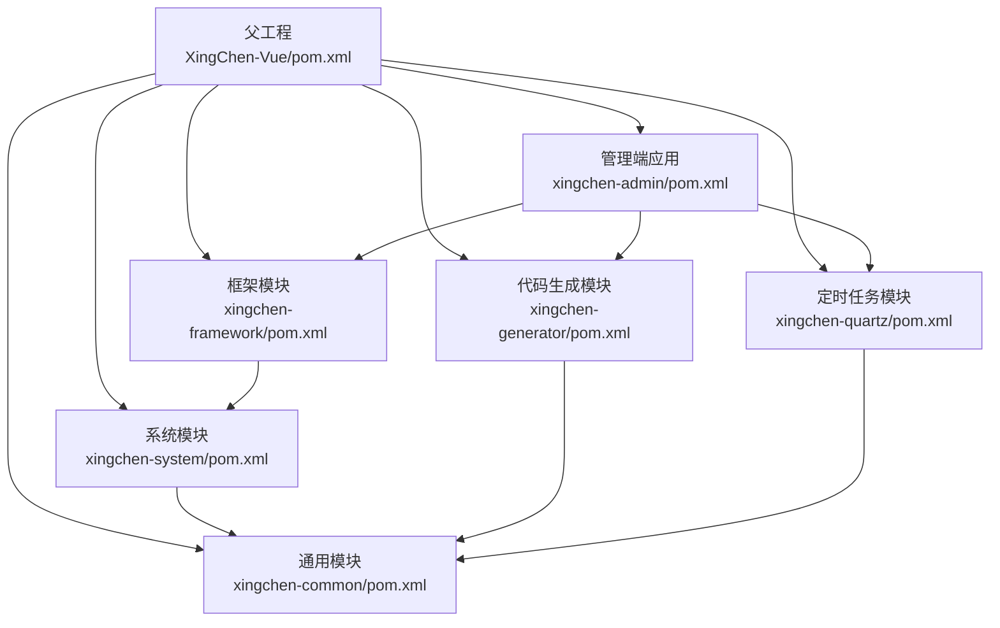
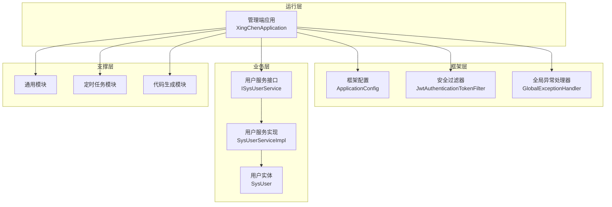
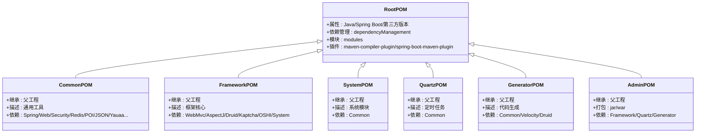
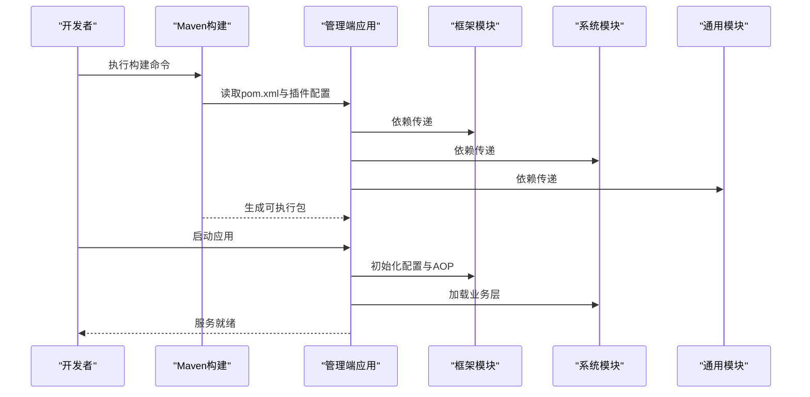
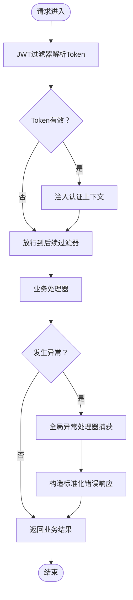
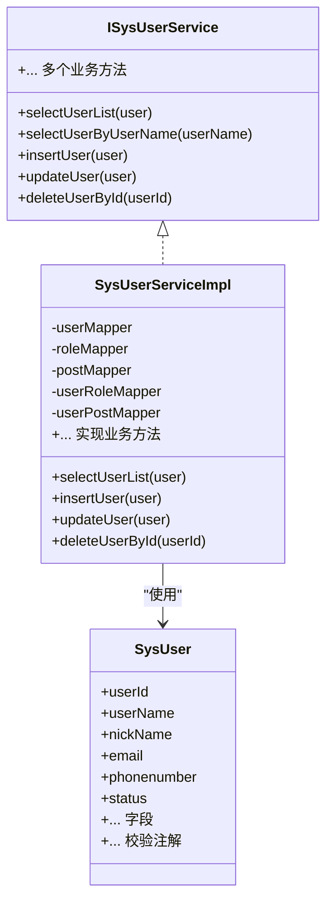
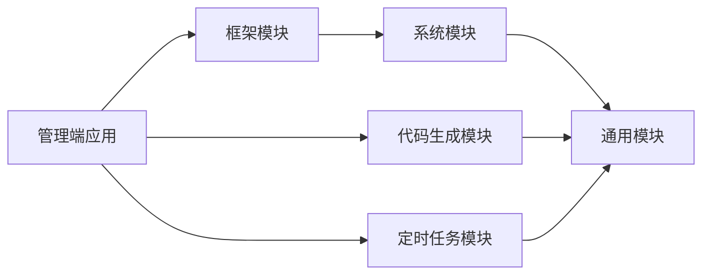

# 模块总体架构

<cite>
**本文引用的文件**
- [根POM（XingChen-Vue/pom.xml）](file://XingChen-Vue/pom.xml)
- [公共模块（xingchen-common/pom.xml）](file://XingChen-Vue/xingchen-common/pom.xml)
- [框架模块（xingchen-framework/pom.xml）](file://XingChen-Vue/xingchen-framework/pom.xml)
- [系统模块（xingchen-system/pom.xml）](file://XingChen-Vue/xingchen-system/pom.xml)
- [定时任务模块（xingchen-quartz/pom.xml）](file://XingChen-Vue/xingchen-quartz/pom.xml)
- [代码生成模块（xingchen-generator/pom.xml）](file://XingChen-Vue/xingchen-generator/pom.xml)
- [管理端应用（xingchen-admin/pom.xml）](file://XingChen-Vue/xingchen-admin/pom.xml)
- [启动类（XingChenApplication.java）](file://XingChen-Vue/xingchen-admin/src/main/java/com/xingchen/XingChenApplication.java)
- [应用配置（application.yml）](file://XingChen-Vue/xingchen-admin/src/main/resources/application.yml)
- [框架配置（ApplicationConfig.java）](file://XingChen-Vue/xingchen-framework/src/main/java/com/xingchen/framework/config/ApplicationConfig.java)
- [全局异常处理器（GlobalExceptionHandler.java）](file://XingChen-Vue/xingchen-framework/src/main/java/com/xingchen/framework/web/exception/GlobalExceptionHandler.java)
- [基础异常类（BaseException.java）](file://XingChen-Vue/xingchen-common/src/main/java/com/xingchen/common/exception/base/BaseException.java)
- [用户实体（SysUser.java）](file://XingChen-Vue/xingchen-common/src/main/java/com/xingchen/common/core/domain/entity/SysUser.java)
- [用户服务接口（ISysUserService.java）](file://XingChen-Vue/xingchen-system/src/main/java/com/xingchen/system/service/ISysUserService.java)
- [用户服务实现（SysUserServiceImpl.java）](file://XingChen-Vue/xingchen-system/src/main/java/com/xingchen/system/service/impl/SysUserServiceImpl.java)
- [JWT过滤器（JwtAuthenticationTokenFilter.java）](file://XingChen-Vue/xingchen-framework/src/main/java/com/xingchen/framework/security/filter/JwtAuthenticationTokenFilter.java)
</cite>

## 目录
1. [简介](#简介)
2. [项目结构](#项目结构)
3. [核心组件](#核心组件)
4. [架构总览](#架构总览)
5. [详细组件分析](#详细组件分析)
6. [依赖关系分析](#依赖关系分析)
7. [性能考量](#性能考量)
8. [故障排查指南](#故障排查指南)
9. [结论](#结论)
10. [附录](#附录)

## 简介
本项目采用Maven多模块架构，围绕“健康管理系统”目标，将系统拆分为统一的父工程与若干子模块，形成清晰的层次化结构。父工程负责版本与依赖的集中管理，子模块按功能域划分，如通用工具、框架核心、系统业务、定时任务、代码生成与管理端应用。模块间通过继承父POM实现依赖版本统一，通过模块依赖实现能力复用与职责分离，最终由管理端应用聚合打包并对外提供服务。

## 项目结构
- 父工程（XingChen-Vue/pom.xml）
  - 统一版本属性与依赖管理（dependencyManagement）
  - 声明子模块（modules）
  - 配置编译与插件（maven-compiler-plugin、spring-boot-maven-plugin）
  - 配置阿里云仓库镜像
- 子模块
  - xingchen-common：通用工具与基础能力
  - xingchen-framework：框架核心（Web、AOP、拦截器、安全、缓存、MyBatis等）
  - xingchen-system：系统业务（用户、菜单、角色、字典等）
  - xingchen-quartz：定时任务
  - xingchen-generator：代码生成
  - xingchen-admin：管理端应用（打包为可执行JAR/WAR，聚合其他模块）

图表来源
- [根POM（XingChen-Vue/pom.xml）:176-183](file://XingChen-Vue/pom.xml#L176-L183)
- [管理端应用（xingchen-admin/pom.xml）:39-55](file://XingChen-Vue/xingchen-admin/pom.xml#L39-L55)
- [框架模块（xingchen-framework/pom.xml）:56-60](file://XingChen-Vue/xingchen-framework/pom.xml#L56-L60)
- [系统模块（xingchen-system/pom.xml）:20-24](file://XingChen-Vue/xingchen-system/pom.xml#L20-L24)
- [定时任务模块（xingchen-quartz/pom.xml）:26-30](file://XingChen-Vue/xingchen-quartz/pom.xml#L26-L30)
- [代码生成模块（xingchen-generator/pom.xml）:26-30](file://XingChen-Vue/xingchen-generator/pom.xml#L26-L30)

章节来源
- [根POM（XingChen-Vue/pom.xml）:1-232](file://XingChen-Vue/pom.xml#L1-L232)
- [管理端应用（xingchen-admin/pom.xml）:1-88](file://XingChen-Vue/xingchen-admin/pom.xml#L1-L88)

## 核心组件
- 父工程与版本管理
  - 使用属性统一管理Java版本、Spring Boot版本及第三方组件版本，避免版本漂移
  - 在dependencyManagement中集中声明各模块依赖，确保子模块无需重复指定版本
- 模块划分原则
  - 通用性优先：公共工具与基础能力下沉至common
  - 职责单一：框架模块封装横切能力；系统模块聚焦业务领域；定时任务与代码生成作为独立支撑模块
  - 可复用性：通过模块依赖实现跨模块能力共享
- 构建与打包
  - 父工程统一编译参数与插件
  - 管理端应用使用spring-boot-maven-plugin进行可执行打包，同时保留WAR插件配置
- 运行与配置
  - 启动类排除数据源自动装配，配合框架配置启用Mapper扫描与AOP代理
  - 应用配置文件集中管理端口、日志、Redis、MyBatis、分页、OpenAPI等

章节来源
- [根POM（XingChen-Vue/pom.xml）:15-34](file://XingChen-Vue/pom.xml#L15-L34)
- [根POM（XingChen-Vue/pom.xml）:37-174](file://XingChen-Vue/pom.xml#L37-L174)
- [根POM（XingChen-Vue/pom.xml）:186-205](file://XingChen-Vue/pom.xml#L186-L205)
- [管理端应用（xingchen-admin/pom.xml）:59-86](file://XingChen-Vue/xingchen-admin/pom.xml#L59-L86)
- [启动类（XingChenApplication.java）:1-31](file://XingChen-Vue/xingchen-admin/src/main/java/com/xingchen/XingChenApplication.java#L1-L31)
- [框架配置（ApplicationConfig.java）:1-20](file://XingChen-Vue/xingchen-framework/src/main/java/com/xingchen/framework/config/ApplicationConfig.java#L1-L20)
- [应用配置（application.yml）:1-148](file://XingChen-Vue/xingchen-admin/src/main/resources/application.yml#L1-L148)

## 架构总览
系统采用“父工程统一治理 + 多模块分层”的架构，管理端应用作为运行载体，聚合框架、系统、定时任务与代码生成模块，通过依赖传递获得统一的版本与能力。框架模块提供Web、安全、缓存、AOP、MyBatis等基础设施；系统模块承载业务模型与服务；通用模块沉淀公共能力；定时任务与代码生成作为辅助模块提升开发效率与运维能力。

图表来源
- [启动类（XingChenApplication.java）:12-18](file://XingChen-Vue/xingchen-admin/src/main/java/com/xingchen/XingChenApplication.java#L12-L18)
- [框架配置（ApplicationConfig.java）:12-19](file://XingChen-Vue/xingchen-framework/src/main/java/com/xingchen/framework/config/ApplicationConfig.java#L12-L19)
- [JWT过滤器（JwtAuthenticationTokenFilter.java）:24-44](file://XingChen-Vue/xingchen-framework/src/main/java/com/xingchen/framework/security/filter/JwtAuthenticationTokenFilter.java#L24-L44)
- [全局异常处理器（GlobalExceptionHandler.java）:27-145](file://XingChen-Vue/xingchen-framework/src/main/java/com/xingchen/framework/web/exception/GlobalExceptionHandler.java#L27-L145)
- [用户服务接口（ISysUserService.java）:12-217](file://XingChen-Vue/xingchen-system/src/main/java/com/xingchen/system/service/ISysUserService.java#L12-L217)
- [用户服务实现（SysUserServiceImpl.java）:40-200](file://XingChen-Vue/xingchen-system/src/main/java/com/xingchen/system/service/impl/SysUserServiceImpl.java#L40-L200)
- [用户实体（SysUser.java）:22-336](file://XingChen-Vue/xingchen-common/src/main/java/com/xingchen/common/core/domain/entity/SysUser.java#L22-L336)

## 详细组件分析

### 父工程与模块继承关系
- 父工程通过dependencyManagement集中管理依赖版本，子模块仅需声明坐标即可继承版本
- 子模块通过parent继承父工程，确保构建行为一致
- 模块声明在父工程modules中，保证Maven生命周期内正确的构建顺序

图表来源
- [根POM（XingChen-Vue/pom.xml）:5-9](file://XingChen-Vue/pom.xml#L5-L9)
- [公共模块（xingchen-common/pom.xml）:5-9](file://XingChen-Vue/xingchen-common/pom.xml#L5-L9)
- [框架模块（xingchen-framework/pom.xml）:5-9](file://XingChen-Vue/xingchen-framework/pom.xml#L5-L9)
- [系统模块（xingchen-system/pom.xml）:5-9](file://XingChen-Vue/xingchen-system/pom.xml#L5-L9)
- [定时任务模块（xingchen-quartz/pom.xml）:5-9](file://XingChen-Vue/xingchen-quartz/pom.xml#L5-L9)
- [代码生成模块（xingchen-generator/pom.xml）:5-9](file://XingChen-Vue/xingchen-generator/pom.xml#L5-L9)
- [管理端应用（xingchen-admin/pom.xml）:5-9](file://XingChen-Vue/xingchen-admin/pom.xml#L5-L9)

章节来源
- [根POM（XingChen-Vue/pom.xml）:176-183](file://XingChen-Vue/pom.xml#L176-L183)
- [公共模块（xingchen-common/pom.xml）:1-123](file://XingChen-Vue/xingchen-common/pom.xml#L1-L123)
- [框架模块（xingchen-framework/pom.xml）:1-64](file://XingChen-Vue/xingchen-framework/pom.xml#L1-L64)
- [系统模块（xingchen-system/pom.xml）:1-28](file://XingChen-Vue/xingchen-system/pom.xml#L1-L28)
- [定时任务模块（xingchen-quartz/pom.xml）:1-34](file://XingChen-Vue/xingchen-quartz/pom.xml#L1-L34)
- [代码生成模块（xingchen-generator/pom.xml）:1-40](file://XingChen-Vue/xingchen-generator/pom.xml#L1-L40)
- [管理端应用（xingchen-admin/pom.xml）:1-88](file://XingChen-Vue/xingchen-admin/pom.xml#L1-L88)

### 管理端应用启动与配置
- 启动类排除数据源自动装配，结合框架配置启用Mapper扫描与AOP代理
- 应用配置集中管理端口、日志级别、Redis、MyBatis、分页、OpenAPI等
- 管理端应用依赖框架、定时任务与代码生成模块，打包为可执行JAR并兼容WAR

图表来源
- [管理端应用（xingchen-admin/pom.xml）:39-55](file://XingChen-Vue/xingchen-admin/pom.xml#L39-L55)
- [管理端应用（xingchen-admin/pom.xml）:59-86](file://XingChen-Vue/xingchen-admin/pom.xml#L59-L86)
- [启动类（XingChenApplication.java）:12-18](file://XingChen-Vue/xingchen-admin/src/main/java/com/xingchen/XingChenApplication.java#L12-L18)
- [框架配置（ApplicationConfig.java）:12-19](file://XingChen-Vue/xingchen-framework/src/main/java/com/xingchen/framework/config/ApplicationConfig.java#L12-L19)

章节来源
- [启动类（XingChenApplication.java）:1-31](file://XingChen-Vue/xingchen-admin/src/main/java/com/xingchen/XingChenApplication.java#L1-L31)
- [应用配置（application.yml）:1-148](file://XingChen-Vue/xingchen-admin/src/main/resources/application.yml#L1-L148)
- [管理端应用（xingchen-admin/pom.xml）:1-88](file://XingChen-Vue/xingchen-admin/pom.xml#L1-L88)

### 异常处理与安全过滤
- 全局异常处理器统一捕获各类运行时异常、业务异常、参数校验异常等，返回标准化响应
- 基础异常类提供模块、编码、参数与默认消息的统一承载
- JWT过滤器在每次请求中解析与验证Token，完成身份上下文注入

图表来源
- [JWT过滤器（JwtAuthenticationTokenFilter.java）:24-44](file://XingChen-Vue/xingchen-framework/src/main/java/com/xingchen/framework/security/filter/JwtAuthenticationTokenFilter.java#L24-L44)
- [全局异常处理器（GlobalExceptionHandler.java）:27-145](file://XingChen-Vue/xingchen-framework/src/main/java/com/xingchen/framework/web/exception/GlobalExceptionHandler.java#L27-L145)
- [基础异常类（BaseException.java）:11-97](file://XingChen-Vue/xingchen-common/src/main/java/com/xingchen/common/exception/base/BaseException.java#L11-L97)

章节来源
- [全局异常处理器（GlobalExceptionHandler.java）:1-146](file://XingChen-Vue/xingchen-framework/src/main/java/com/xingchen/framework/web/exception/GlobalExceptionHandler.java#L1-L146)
- [基础异常类（BaseException.java）:1-98](file://XingChen-Vue/xingchen-common/src/main/java/com/xingchen/common/exception/base/BaseException.java#L1-L98)
- [JWT过滤器（JwtAuthenticationTokenFilter.java）:1-45](file://XingChen-Vue/xingchen-framework/src/main/java/com/xingchen/framework/security/filter/JwtAuthenticationTokenFilter.java#L1-L45)

### 业务服务与数据模型
- 用户服务接口定义用户相关业务方法，服务实现类承担具体逻辑并结合数据权限注解
- 用户实体承载用户字段与校验注解，体现数据模型与约束
- 系统模块依赖通用模块，复用实体与工具能力

图表来源
- [用户服务接口（ISysUserService.java）:12-217](file://XingChen-Vue/xingchen-system/src/main/java/com/xingchen/system/service/ISysUserService.java#L12-L217)
- [用户服务实现（SysUserServiceImpl.java）:40-200](file://XingChen-Vue/xingchen-system/src/main/java/com/xingchen/system/service/impl/SysUserServiceImpl.java#L40-L200)
- [用户实体（SysUser.java）:22-336](file://XingChen-Vue/xingchen-common/src/main/java/com/xingchen/common/core/domain/entity/SysUser.java#L22-L336)

章节来源
- [用户服务接口（ISysUserService.java）:1-218](file://XingChen-Vue/xingchen-system/src/main/java/com/xingchen/system/service/ISysUserService.java#L1-L218)
- [用户服务实现（SysUserServiceImpl.java）:1-566](file://XingChen-Vue/xingchen-system/src/main/java/com/xingchen/system/service/impl/SysUserServiceImpl.java#L1-L566)
- [用户实体（SysUser.java）:1-337](file://XingChen-Vue/xingchen-common/src/main/java/com/xingchen/common/core/domain/entity/SysUser.java#L1-L337)

## 依赖关系分析
- 依赖传递
  - 管理端应用直接依赖框架、定时任务与代码生成模块
  - 框架模块依赖系统模块，系统模块依赖通用模块
  - 通用模块依赖Spring生态与第三方组件，版本由父工程统一管理
- 内聚与耦合
  - 模块内聚度高，跨模块依赖通过明确的接口与依赖声明实现
  - 通过dependencyManagement降低版本冲突风险，提升可维护性
- 循环依赖
  - 当前结构未见循环依赖：Admin -> Framework -> System -> Common；Admin -> Quartz；Admin -> Generator

图表来源
- [管理端应用（xingchen-admin/pom.xml）:39-55](file://XingChen-Vue/xingchen-admin/pom.xml#L39-L55)
- [框架模块（xingchen-framework/pom.xml）:56-60](file://XingChen-Vue/xingchen-framework/pom.xml#L56-L60)
- [系统模块（xingchen-system/pom.xml）:20-24](file://XingChen-Vue/xingchen-system/pom.xml#L20-L24)
- [定时任务模块（xingchen-quartz/pom.xml）:26-30](file://XingChen-Vue/xingchen-quartz/pom.xml#L26-L30)
- [代码生成模块（xingchen-generator/pom.xml）:26-30](file://XingChen-Vue/xingchen-generator/pom.xml#L26-L30)

章节来源
- [根POM（XingChen-Vue/pom.xml）:37-174](file://XingChen-Vue/pom.xml#L37-L174)
- [管理端应用（xingchen-admin/pom.xml）:1-88](file://XingChen-Vue/xingchen-admin/pom.xml#L1-L88)
- [框架模块（xingchen-framework/pom.xml）:1-64](file://XingChen-Vue/xingchen-framework/pom.xml#L1-L64)
- [系统模块（xingchen-system/pom.xml）:1-28](file://XingChen-Vue/xingchen-system/pom.xml#L1-L28)
- [定时任务模块（xingchen-quartz/pom.xml）:1-34](file://XingChen-Vue/xingchen-quartz/pom.xml#L1-L34)
- [代码生成模块（xingchen-generator/pom.xml）:1-40](file://XingChen-Vue/xingchen-generator/pom.xml#L1-L40)

## 性能考量
- 依赖精简与版本统一：通过父工程集中管理依赖版本，减少不必要的传递依赖，降低运行时开销
- 插件优化：统一编译参数与Spring Boot插件配置，提升构建与打包效率
- 缓存与序列化：框架模块集成Redis与Fastjson，结合业务场景合理设置缓存策略与序列化配置
- 分页与ORM：MyBatis与PageHelper配置需结合数据规模与查询复杂度进行调优

## 故障排查指南
- 启动失败
  - 检查启动类排除的数据源自动装配与框架配置的Mapper扫描是否生效
  - 关注应用配置文件中的端口、Redis、数据库驱动等关键项
- 异常处理
  - 全局异常处理器会捕获业务异常与运行时异常，定位错误码与默认消息
  - 基础异常类提供模块、编码与参数信息，便于快速定位问题来源
- 安全与认证
  - JWT过滤器负责Token解析与认证上下文注入，若出现鉴权失败，检查Token合法性与服务端配置

章节来源
- [启动类（XingChenApplication.java）:12-18](file://XingChen-Vue/xingchen-admin/src/main/java/com/xingchen/XingChenApplication.java#L12-L18)
- [应用配置（application.yml）:48-148](file://XingChen-Vue/xingchen-admin/src/main/resources/application.yml#L48-L148)
- [全局异常处理器（GlobalExceptionHandler.java）:57-102](file://XingChen-Vue/xingchen-framework/src/main/java/com/xingchen/framework/web/exception/GlobalExceptionHandler.java#L57-L102)
- [基础异常类（BaseException.java）:35-76](file://XingChen-Vue/xingchen-common/src/main/java/com/xingchen/common/exception/base/BaseException.java#L35-L76)
- [JWT过滤器（JwtAuthenticationTokenFilter.java）:30-43](file://XingChen-Vue/xingchen-framework/src/main/java/com/xingchen/framework/security/filter/JwtAuthenticationTokenFilter.java#L30-L43)

## 结论
本项目通过父工程统一治理与多模块分层设计，实现了版本统一、职责分离与能力复用。管理端应用作为运行载体，聚合框架、系统、定时任务与代码生成模块，形成稳定高效的开发与运维体系。建议在后续迭代中持续完善模块边界与接口契约，加强监控与日志策略，以进一步提升系统的可观测性与可维护性。

## 附录
- 模块构建顺序
  - 父工程 -> 通用模块 -> 框架模块 -> 系统模块 -> 定时任务模块 -> 代码生成模块 -> 管理端应用
- 打包策略
  - 管理端应用支持JAR/WAR两种打包方式，便于不同部署环境适配
- 发布流程建议
  - 版本升级：在父工程统一修改版本属性，确保所有模块版本一致
  - 构建与测试：先在本地执行全模块构建与集成测试，再进行制品发布
  - 镜像与仓库：利用阿里云仓库镜像加速依赖下载，确保构建稳定性