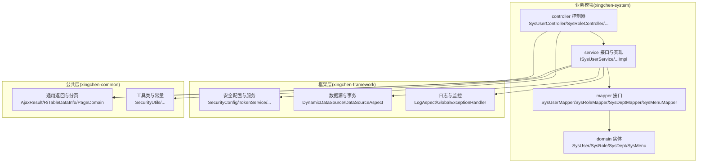
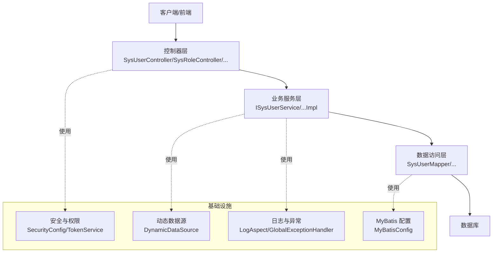
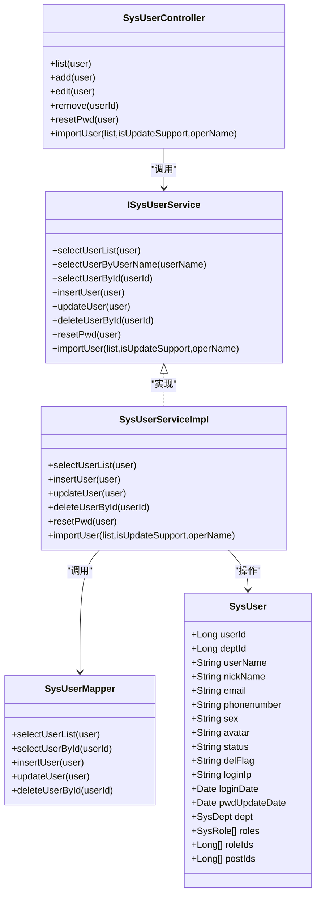
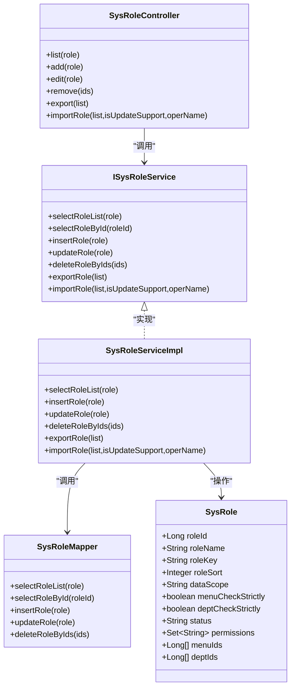
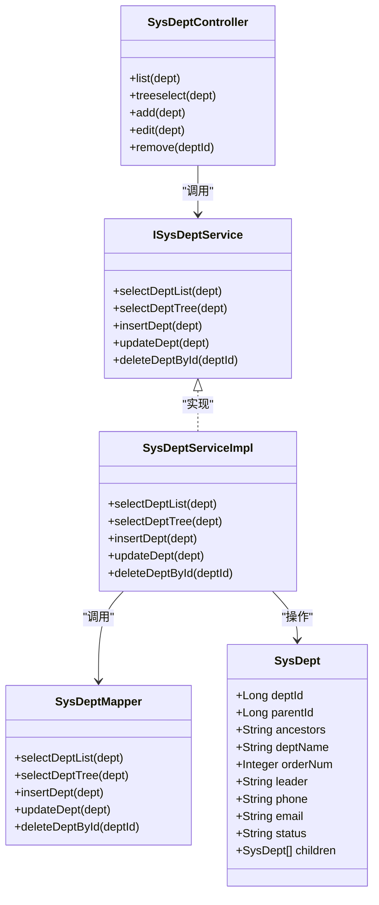
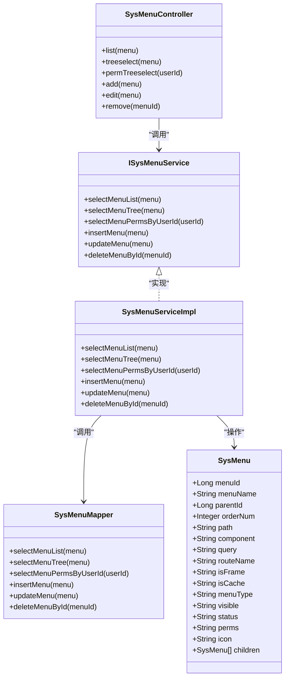
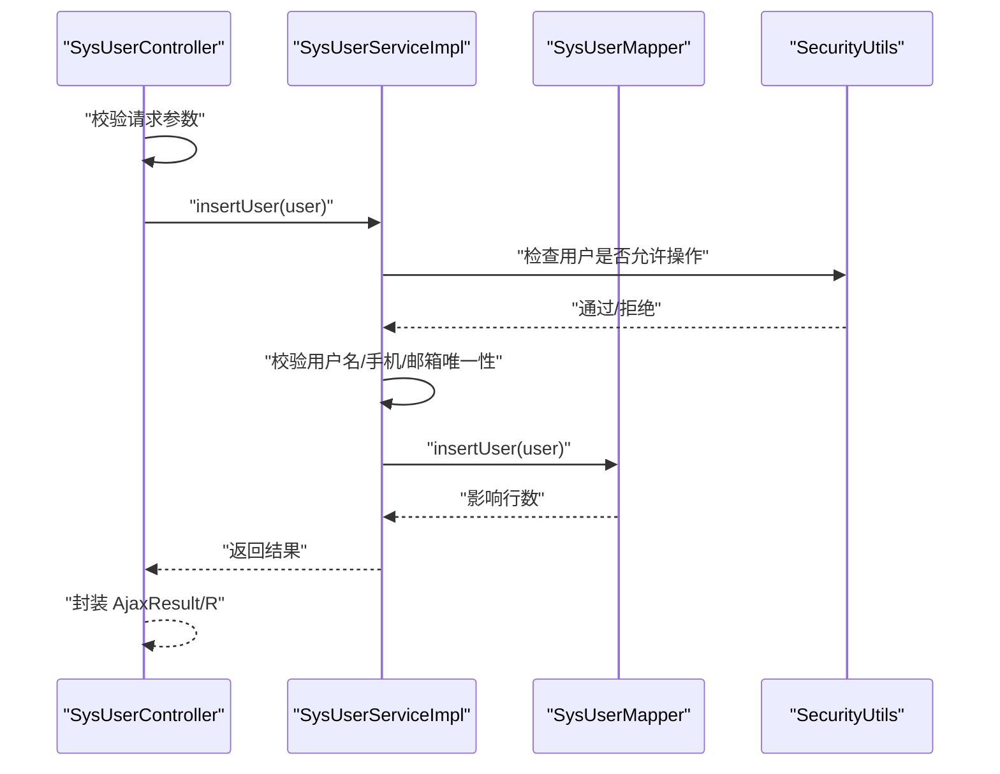
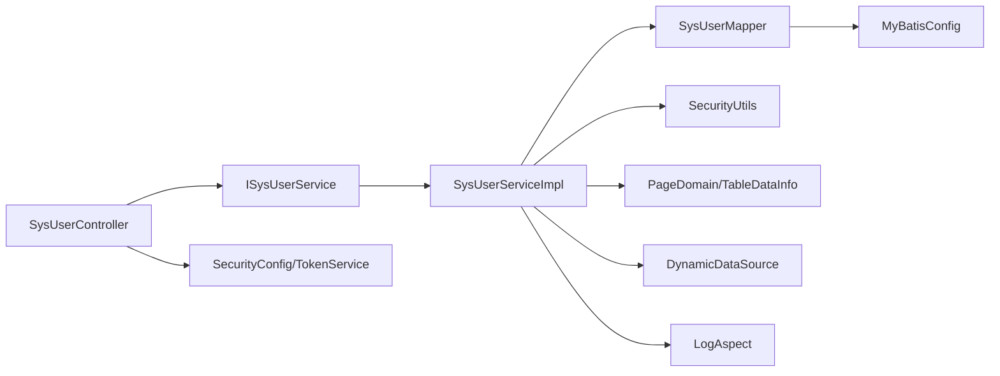

# 系统业务模块(xingchen-system)

<cite>
**本文引用的文件**
- [SysUser.java](file://XingChen-Vue/xingchen-common/src/main/java/com/xingchen/common/core/domain/entity/SysUser.java)
- [SysRole.java](file://XingChen-Vue/xingchen-common/src/main/java/com/xingchen/common/core/domain/entity/SysRole.java)
- [SysDept.java](file://XingChen-Vue/xingchen-common/src/main/java/com/xingchen/common/core/domain/entity/SysDept.java)
- [SysMenu.java](file://XingChen-Vue/xingchen-common/src/main/java/com/xingchen/common/core/domain/entity/SysMenu.java)
- [ISysUserService.java](file://XingChen-Vue/xingchen-system/src/main/java/com/xingchen/system/service/ISysUserService.java)
- [SysUserMapper.java](file://XingChen-Vue/xingchen-system/src/main/java/com/xingchen/system/mapper/SysUserMapper.java)
- [SysUserServiceImpl.java](file://XingChen-Vue/xingchen-system/src/main/java/com/xingchen/system/service/impl/SysUserServiceImpl.java)
- [SysUserController.java](file://XingChen-Vue/xingchen-system/src/main/java/com/xingchen/system/web/controller/SysUserController.java)
- [SysRoleMapper.java](file://XingChen-Vue/xingchen-system/src/main/java/com/xingchen/system/mapper/SysRoleMapper.java)
- [SysRoleServiceImpl.java](file://XingChen-Vue/xingchen-system/src/main/java/com/xingchen/system/service/impl/SysRoleServiceImpl.java)
- [SysRoleController.java](file://XingChen-Vue/xingchen-system/src/main/java/com/xingchen/system/web/controller/SysRoleController.java)
- [SysDeptMapper.java](file://XingChen-Vue/xingchen-system/src/main/java/com/xingchen/system/mapper/SysDeptMapper.java)
- [SysDeptServiceImpl.java](file://XingChen-Vue/xingchen-system/src/main/java/com/xingchen/system/service/impl/SysDeptServiceImpl.java)
- [SysDeptController.java](file://XingChen-Vue/xingchen-system/src/main/java/com/xingchen/system/web/controller/SysDeptController.java)
- [SysMenuMapper.java](file://XingChen-Vue/xingchen-system/src/main/java/com/xingchen/system/mapper/SysMenuMapper.java)
- [SysMenuServiceImpl.java](file://XingChen-Vue/xingchen-system/src/main/java/com/xingchen/system/service/impl/SysMenuServiceImpl.java)
- [SysMenuController.java](file://XingChen-Vue/xingchen-system/src/main/java/com/xingchen/system/web/controller/SysMenuController.java)
- [BaseEntity.java](file://XingChen-Vue/xingchen-common/src/main/java/com/xingchen/common/core/domain/BaseEntity.java)
- [AjaxResult.java](file://XingChen-Vue/xingchen-common/src/main/java/com/xingchen/common/core/domain/AjaxResult.java)
- [R.java](file://XingChen-Vue/xingchen-common/src/main/java/com/xingchen/common/core/domain/R.java)
- [SecurityUtils.java](file://XingChen-Vue/xingchen-common/src/main/java/com/xingchen/common/utils/SecurityUtils.java)
- [PageDomain.java](file://XingChen-Vue/xingchen-common/src/main/java/com/xingchen/common/core/page/PageDomain.java)
- [TableDataInfo.java](file://XingChen-Vue/xingchen-common/src/main/java/com/xingchen/common/core/page/TableDataInfo.java)
- [TableSupport.java](file://XingChen-Vue/xingchen-common/src/main/java/com/xingchen/common/core/page/TableSupport.java)
- [MyBatisConfig.java](file://XingChen-Vue/xingchen-framework/src/main/java/com/xingchen/framework/config/MyBatisConfig.java)
- [DruidConfig.java](file://XingChen-Vue/xingchen-framework/src/main/java/com/xingchen/framework/config/DruidConfig.java)
- [SecurityConfig.java](file://XingChen-Vue/xingchen-framework/src/main/java/com/xingchen/framework/config/SecurityConfig.java)
- [RedisConfig.java](file://XingChen-Vue/xingchen-framework/src/main/java/com/xingchen/framework/config/RedisConfig.java)
- [DynamicDataSource.java](file://XingChen-Vue/xingchen-framework/src/main/java/com/xingchen/framework/datasource/DynamicDataSource.java)
- [DynamicDataSourceContextHolder.java](file://XingChen-Vue/xingchen-framework/src/main/java/com/xingchen/framework/datasource/DynamicDataSourceContextHolder.java)
- [DataScopeAspect.java](file://XingChen-Vue/xingchen-framework/src/main/java/com/xingchen/framework/aspectj/DataScopeAspect.java)
- [DataSourceAspect.java](file://XingChen-Vue/xingchen-framework/src/main/java/com/xingchen/framework/aspectj/DataSourceAspect.java)
- [LogAspect.java](file://XingChen-Vue/xingchen-framework/src/main/java/com/xingchen/framework/aspectj/LogAspect.java)
- [GlobalExceptionHandler.java](file://XingChen-Vue/xingchen-framework/src/main/java/com/xingchen/framework/web/exception/GlobalExceptionHandler.java)
- [PermissionService.java](file://XingChen-Vue/xingchen-framework/src/main/java/com/xingchen/framework/web/service/PermissionService.java)
- [SysLoginService.java](file://XingChen-Vue/xingchen-framework/src/main/java/com/xingchen/framework/web/service/SysLoginService.java)
- [SysPasswordService.java](file://XingChen-Vue/xingchen-framework/src/main/java/com/xingchen/framework/web/service/SysPasswordService.java)
- [SysPermissionService.java](file://XingChen-Vue/xingchen-framework/src/main/java/com/xingchen/framework/web/service/SysPermissionService.java)
- [SysRegisterService.java](file://XingChen-Vue/xingchen-framework/src/main/java/com/xingchen/framework/web/service/SysRegisterService.java)
- [TokenService.java](file://XingChen-Vue/xingchen-framework/src/main/java/com/xingchen/framework/web/service/TokenService.java)
- [UserDetailsServiceImpl.java](file://XingChen-Vue/xingchen-framework/src/main/java/com/xingchen/framework/web/service/UserDetailsServiceImpl.java)
- [application.yml](file://XingChen-Vue/xingchen-admin/src/main/resources/application.yml)
- [mybatis-config.xml](file://XingChen-Vue/xingchen-admin/src/main/resources/mybatis/mybatis-config.xml)
- [SysUserMapper.xml](file://XingChen-Vue/xingchen-system/src/main/resources/mapper/system/SysUserMapper.xml)
- [SysRoleMapper.xml](file://XingChen-Vue/xingchen-system/src/main/resources/mapper/system/SysRoleMapper.xml)
- [SysDeptMapper.xml](file://XingChen-Vue/xingchen-system/src/main/resources/mapper/system/SysDeptMapper.xml)
- [SysMenuMapper.xml](file://XingChen-Vue/xingchen-system/src/main/resources/mapper/system/SysMenuMapper.xml)
</cite>

## 目录
1. [引言](#引言)
2. [项目结构](#项目结构)
3. [核心组件](#核心组件)
4. [架构总览](#架构总览)
5. [详细组件分析](#详细组件分析)
6. [依赖分析](#依赖分析)
7. [性能考虑](#性能考虑)
8. [故障排查指南](#故障排查指南)
9. [结论](#结论)
10. [附录](#附录)

## 引言
xingchen-system 是健康管理系统中的核心业务模块，负责实现用户管理、角色权限、部门管理、菜单管理等关键业务能力。该模块采用清晰的分层架构设计，涵盖 domain（领域模型）、mapper（数据映射）、service（业务服务）、controller（控制层）以及框架层（安全、事务、数据源切换、日志、异常处理等），确保业务逻辑与基础设施解耦，便于扩展与维护。

## 项目结构
系统采用多模块 Maven 架构，xingchen-system 作为业务模块位于 XingChen-Vue 工程下，主要包含以下层次：
- domain 层：定义业务实体（用户、角色、部门、菜单等）
- mapper 层：MyBatis 映射接口，负责数据库访问
- service 层：业务接口与实现类，封装业务规则
- controller 层：对外暴露 REST 接口，处理请求与响应
- framework 层：提供安全认证、数据源切换、日志、异常处理等横切能力
- admin 层：应用入口与配置

**图表来源**
- [SysUser.java:1-337](file://XingChen-Vue/xingchen-common/src/main/java/com/xingchen/common/core/domain/entity/SysUser.java#L1-L337)
- [SysRole.java:1-242](file://XingChen-Vue/xingchen-common/src/main/java/com/xingchen/common/core/domain/entity/SysRole.java#L1-L242)
- [SysDept.java:1-204](file://XingChen-Vue/xingchen-common/src/main/java/com/xingchen/common/core/domain/entity/SysDept.java#L1-L204)
- [SysMenu.java:1-275](file://XingChen-Vue/xingchen-common/src/main/java/com/xingchen/common/core/domain/entity/SysMenu.java#L1-L275)
- [ISysUserService.java:1-218](file://XingChen-Vue/xingchen-system/src/main/java/com/xingchen/system/service/ISysUserService.java#L1-L218)
- [SysUserMapper.java](file://XingChen-Vue/xingchen-system/src/main/java/com/xingchen/system/mapper/SysUserMapper.java)
- [SysUserServiceImpl.java](file://XingChen-Vue/xingchen-system/src/main/java/com/xingchen/system/service/impl/SysUserServiceImpl.java)
- [SysUserController.java](file://XingChen-Vue/xingchen-system/src/main/java/com/xingchen/system/web/controller/SysUserController.java)
- [SecurityConfig.java](file://XingChen-Vue/xingchen-framework/src/main/java/com/xingchen/framework/config/SecurityConfig.java)
- [DynamicDataSource.java](file://XingChen-Vue/xingchen-framework/src/main/java/com/xingchen/framework/datasource/DynamicDataSource.java)
- [LogAspect.java](file://XingChen-Vue/xingchen-framework/src/main/java/com/xingchen/framework/aspectj/LogAspect.java)
- [AjaxResult.java](file://XingChen-Vue/xingchen-common/src/main/java/com/xingchen/common/core/domain/AjaxResult.java)
- [TableDataInfo.java](file://XingChen-Vue/xingchen-common/src/main/java/com/xingchen/common/core/page/TableDataInfo.java)

**章节来源**
- [application.yml](file://XingChen-Vue/xingchen-admin/src/main/resources/application.yml)
- [mybatis-config.xml](file://XingChen-Vue/xingchen-admin/src/main/resources/mybatis/mybatis-config.xml)

## 核心组件
本模块围绕四大核心业务实体展开：
- 用户（SysUser）：包含用户基本信息、部门关联、角色集合、岗位组、登录信息等
- 角色（SysRole）：包含角色名称、权限字符、数据范围、菜单/部门权限集合等
- 部门（SysDept）：组织架构树形结构，支持父子关系与层级祖先链
- 菜单（SysMenu）：菜单树形结构，支持路由、组件、权限标识、类型（目录/菜单/按钮）

这些实体均继承基础实体类，具备统一的审计字段（创建人、创建时间、更新人、更新时间、备注等）。

**章节来源**
- [SysUser.java:1-337](file://XingChen-Vue/xingchen-common/src/main/java/com/xingchen/common/core/domain/entity/SysUser.java#L1-L337)
- [SysRole.java:1-242](file://XingChen-Vue/xingchen-common/src/main/java/com/xingchen/common/core/domain/entity/SysRole.java#L1-L242)
- [SysDept.java:1-204](file://XingChen-Vue/xingchen-common/src/main/java/com/xingchen/common/core/domain/entity/SysDept.java#L1-L204)
- [SysMenu.java:1-275](file://XingChen-Vue/xingchen-common/src/main/java/com/xingchen/common/core/domain/entity/SysMenu.java#L1-L275)
- [BaseEntity.java](file://XingChen-Vue/xingchen-common/src/main/java/com/xingchen/common/core/domain/BaseEntity.java)

## 架构总览
系统采用经典的分层架构：
- 表现层：控制器接收请求，调用服务层，返回统一结果包装
- 业务层：服务接口定义业务契约，实现类执行具体业务逻辑
- 数据访问层：Mapper 接口 + XML 映射，完成数据库 CRUD
- 基础设施层：安全、数据源切换、日志、异常处理、MyBatis 配置等

**图表来源**
- [SysUserController.java](file://XingChen-Vue/xingchen-system/src/main/java/com/xingchen/system/web/controller/SysUserController.java)
- [SysUserServiceImpl.java](file://XingChen-Vue/xingchen-system/src/main/java/com/xingchen/system/service/impl/SysUserServiceImpl.java)
- [SysUserMapper.java](file://XingChen-Vue/xingchen-system/src/main/java/com/xingchen/system/mapper/SysUserMapper.java)
- [SecurityConfig.java](file://XingChen-Vue/xingchen-framework/src/main/java/com/xingchen/framework/config/SecurityConfig.java)
- [DynamicDataSource.java](file://XingChen-Vue/xingchen-framework/src/main/java/com/xingchen/framework/datasource/DynamicDataSource.java)
- [LogAspect.java](file://XingChen-Vue/xingchen-framework/src/main/java/com/xingchen/framework/aspectj/LogAspect.java)
- [MyBatisConfig.java](file://XingChen-Vue/xingchen-framework/src/main/java/com/xingchen/framework/config/MyBatisConfig.java)

## 详细组件分析

### 用户管理模块
用户管理覆盖用户增删改查、角色授权、状态变更、登录信息更新、密码重置、导入导出等功能。接口定义在业务服务层，实现类中组合数据访问与工具类，控制器负责参数校验与统一返回。

**图表来源**
- [SysUser.java:1-337](file://XingChen-Vue/xingchen-common/src/main/java/com/xingchen/common/core/domain/entity/SysUser.java#L1-L337)
- [ISysUserService.java:1-218](file://XingChen-Vue/xingchen-system/src/main/java/com/xingchen/system/service/ISysUserService.java#L1-L218)
- [SysUserServiceImpl.java](file://XingChen-Vue/xingchen-system/src/main/java/com/xingchen/system/service/impl/SysUserServiceImpl.java)
- [SysUserMapper.java](file://XingChen-Vue/xingchen-system/src/main/java/com/xingchen/system/mapper/SysUserMapper.java)
- [SysUserController.java](file://XingChen-Vue/xingchen-system/src/main/java/com/xingchen/system/web/controller/SysUserController.java)

**章节来源**
- [ISysUserService.java:1-218](file://XingChen-Vue/xingchen-system/src/main/java/com/xingchen/system/service/ISysUserService.java#L1-L218)
- [SysUserServiceImpl.java](file://XingChen-Vue/xingchen-system/src/main/java/com/xingchen/system/service/impl/SysUserServiceImpl.java)
- [SysUserMapper.xml](file://XingChen-Vue/xingchen-system/src/main/resources/mapper/system/SysUserMapper.xml)

### 角色权限模块
角色权限模块负责角色的增删改查、角色与菜单/部门的关联、数据范围控制、权限校验等。通过服务层实现角色授权与权限计算，并结合框架层的数据范围切面实现细粒度的数据权限控制。

**图表来源**
- [SysRole.java:1-242](file://XingChen-Vue/xingchen-common/src/main/java/com/xingchen/common/core/domain/entity/SysRole.java#L1-L242)
- [ISysRoleService.java](file://XingChen-Vue/xingchen-system/src/main/java/com/xingchen/system/service/ISysRoleService.java)
- [SysRoleServiceImpl.java](file://XingChen-Vue/xingchen-system/src/main/java/com/xingchen/system/service/impl/SysRoleServiceImpl.java)
- [SysRoleMapper.java](file://XingChen-Vue/xingchen-system/src/main/java/com/xingchen/system/mapper/SysRoleMapper.java)
- [SysRoleController.java](file://XingChen-Vue/xingchen-system/src/main/java/com/xingchen/system/web/controller/SysRoleController.java)

**章节来源**
- [SysRole.java:1-242](file://XingChen-Vue/xingchen-common/src/main/java/com/xingchen/common/core/domain/entity/SysRole.java#L1-L242)
- [SysRoleMapper.xml](file://XingChen-Vue/xingchen-system/src/main/resources/mapper/system/SysRoleMapper.xml)

### 部门管理模块
部门管理支持树形组织架构的增删改查、父子关系维护、排序与状态控制。服务层提供部门树构建与权限范围计算，配合数据范围切面实现按部门维度的数据隔离。

**图表来源**
- [SysDept.java:1-204](file://XingChen-Vue/xingchen-common/src/main/java/com/xingchen/common/core/domain/entity/SysDept.java#L1-L204)
- [ISysDeptService.java](file://XingChen-Vue/xingchen-system/src/main/java/com/xingchen/system/service/ISysDeptService.java)
- [SysDeptServiceImpl.java](file://XingChen-Vue/xingchen-system/src/main/java/com/xingchen/system/service/impl/SysDeptServiceImpl.java)
- [SysDeptMapper.java](file://XingChen-Vue/xingchen-system/src/main/java/com/xingchen/system/mapper/SysDeptMapper.java)
- [SysDeptController.java](file://XingChen-Vue/xingchen-system/src/main/java/com/xingchen/system/web/controller/SysDeptController.java)

**章节来源**
- [SysDept.java:1-204](file://XingChen-Vue/xingchen-common/src/main/java/com/xingchen/common/core/domain/entity/SysDept.java#L1-L204)
- [SysDeptMapper.xml](file://XingChen-Vue/xingchen-system/src/main/resources/mapper/system/SysDeptMapper.xml)

### 菜单管理模块
菜单管理支持目录、菜单、按钮三级结构，提供路由、组件、权限标识、缓存与可见性控制。服务层负责菜单树构建与权限字符串生成，控制器提供完整的 CRUD 与树形选择接口。

**图表来源**
- [SysMenu.java:1-275](file://XingChen-Vue/xingchen-common/src/main/java/com/xingchen/common/core/domain/entity/SysMenu.java#L1-L275)
- [ISysMenuService.java](file://XingChen-Vue/xingchen-system/src/main/java/com/xingchen/system/service/ISysMenuService.java)
- [SysMenuServiceImpl.java](file://XingChen-Vue/xingchen-system/src/main/java/com/xingchen/system/service/impl/SysMenuServiceImpl.java)
- [SysMenuMapper.java](file://XingChen-Vue/xingchen-system/src/main/java/com/xingchen/system/mapper/SysMenuMapper.java)
- [SysMenuController.java](file://XingChen-Vue/xingchen-system/src/main/java/com/xingchen/system/web/controller/SysMenuController.java)

**章节来源**
- [SysMenu.java:1-275](file://XingChen-Vue/xingchen-common/src/main/java/com/xingchen/common/core/domain/entity/SysMenu.java#L1-L275)
- [SysMenuMapper.xml](file://XingChen-Vue/xingchen-system/src/main/resources/mapper/system/SysMenuMapper.xml)

### 业务流程示例：用户新增
用户新增涉及控制器参数校验、服务层业务规则（如唯一性校验、角色授权）、数据访问层持久化以及统一结果返回。

**图表来源**
- [SysUserController.java](file://XingChen-Vue/xingchen-system/src/main/java/com/xingchen/system/web/controller/SysUserController.java)
- [SysUserServiceImpl.java](file://XingChen-Vue/xingchen-system/src/main/java/com/xingchen/system/service/impl/SysUserServiceImpl.java)
- [SysUserMapper.java](file://XingChen-Vue/xingchen-system/src/main/java/com/xingchen/system/mapper/SysUserMapper.java)
- [SecurityUtils.java](file://XingChen-Vue/xingchen-common/src/main/java/com/xingchen/common/utils/SecurityUtils.java)
- [AjaxResult.java](file://XingChen-Vue/xingchen-common/src/main/java/com/xingchen/common/core/domain/AjaxResult.java)
- [R.java](file://XingChen-Vue/xingchen-common/src/main/java/com/xingchen/common/core/domain/R.java)

## 依赖分析
模块间依赖关系如下：
- 控制器依赖业务服务接口
- 业务实现依赖 Mapper 接口与工具类
- Mapper 依赖 MyBatis 配置与数据库
- 业务实现依赖安全与权限工具、分页组件
- 框架层提供数据源切换、日志与异常处理

**图表来源**
- [SysUserController.java](file://XingChen-Vue/xingchen-system/src/main/java/com/xingchen/system/web/controller/SysUserController.java)
- [ISysUserService.java](file://XingChen-Vue/xingchen-system/src/main/java/com/xingchen/system/service/ISysUserService.java)
- [SysUserServiceImpl.java](file://XingChen-Vue/xingchen-system/src/main/java/com/xingchen/system/service/impl/SysUserServiceImpl.java)
- [SysUserMapper.java](file://XingChen-Vue/xingchen-system/src/main/java/com/xingchen/system/mapper/SysUserMapper.java)
- [MyBatisConfig.java](file://XingChen-Vue/xingchen-framework/src/main/java/com/xingchen/framework/config/MyBatisConfig.java)
- [DynamicDataSource.java](file://XingChen-Vue/xingchen-framework/src/main/java/com/xingchen/framework/datasource/DynamicDataSource.java)
- [LogAspect.java](file://XingChen-Vue/xingchen-framework/src/main/java/com/xingchen/framework/aspectj/LogAspect.java)
- [SecurityConfig.java](file://XingChen-Vue/xingchen-framework/src/main/java/com/xingchen/framework/config/SecurityConfig.java)

**章节来源**
- [PageDomain.java](file://XingChen-Vue/xingchen-common/src/main/java/com/xingchen/common/core/page/PageDomain.java)
- [TableDataInfo.java](file://XingChen-Vue/xingchen-common/src/main/java/com/xingchen/common/core/page/TableDataInfo.java)
- [TableSupport.java](file://XingChen-Vue/xingchen-common/src/main/java/com/xingchen/common/core/page/TableSupport.java)

## 性能考虑
- 分页查询：使用分页组件与数据库索引优化，避免一次性加载大量数据
- 缓存策略：结合 Redis 配置对热点数据进行缓存（如字典、菜单权限）
- SQL 优化：合理使用 MyBatis 的延迟加载与批量操作，减少 N+1 查询
- 数据源切换：通过动态数据源实现读写分离与多数据源场景
- 日志与监控：开启必要的日志切面，定位慢查询与异常
- 安全与鉴权：JWT 令牌与权限校验应尽量前置，减少不必要的业务调用

**章节来源**
- [RedisConfig.java](file://XingChen-Vue/xingchen-framework/src/main/java/com/xingchen/framework/config/RedisConfig.java)
- [DruidConfig.java](file://XingChen-Vue/xingchen-framework/src/main/java/com/xingchen/framework/config/DruidConfig.java)
- [DynamicDataSource.java](file://XingChen-Vue/xingchen-framework/src/main/java/com/xingchen/framework/datasource/DynamicDataSource.java)
- [LogAspect.java](file://XingChen-Vue/xingchen-framework/src/main/java/com/xingchen/framework/aspectj/LogAspect.java)

## 故障排查指南
- 统一异常处理：全局异常处理器集中处理业务异常与系统异常，返回标准化错误信息
- 参数校验：控制器与实体类注解配合，快速发现非法输入
- 安全日志：登录、操作、在线用户等日志记录，便于审计与问题追踪
- 数据权限：数据范围切面确保越权访问被拦截
- 数据源问题：动态数据源上下文切换导致的连接异常，需检查数据源配置与线程绑定

**章节来源**
- [GlobalExceptionHandler.java](file://XingChen-Vue/xingchen-framework/src/main/java/com/xingchen/framework/web/exception/GlobalExceptionHandler.java)
- [LogAspect.java](file://XingChen-Vue/xingchen-framework/src/main/java/com/xingchen/framework/aspectj/LogAspect.java)
- [DataScopeAspect.java](file://XingChen-Vue/xingchen-framework/src/main/java/com/xingchen/framework/aspectj/DataScopeAspect.java)
- [DataSourceAspect.java](file://XingChen-Vue/xingchen-framework/src/main/java/com/xingchen/framework/aspectj/DataSourceAspect.java)

## 结论
xingchen-system 模块以清晰的分层架构实现了用户、角色、部门、菜单等核心业务，结合框架层的安全、数据源、日志与异常处理，形成高内聚、低耦合的系统设计。通过接口驱动的服务层与 MyBatis 数据访问层，模块具备良好的可扩展性与可维护性。建议在后续开发中继续完善缓存策略、SQL 优化与监控告警体系，提升整体性能与稳定性。

## 附录
- 开发规范与最佳实践
  - 接口命名：ISysXxxService，实现类：SysXxxServiceImpl
  - 控制器：遵循 RESTful 设计，返回统一包装（AjaxResult/R）
  - 实体类：使用校验注解与 XSS 过滤，避免脏数据进入数据库
  - 事务管理：在服务层声明式事务，保证业务原子性
  - 数据权限：优先使用数据范围切面，避免在业务代码中重复判断
  - 日志记录：关键操作必须记录操作日志与异常日志
  - 性能优化：分页查询、批量操作、缓存命中率、SQL 索引优化

- 新功能开发步骤
  1) 在 domain 层定义实体与关系
  2) 在 mapper 层编写接口与 XML
  3) 在 service 层定义接口与实现
  4) 在 controller 层暴露接口并进行参数校验
  5) 配置 MyBatis、安全与数据源
  6) 编写单元测试与集成测试
  7) 添加日志与异常处理

- 参考文件路径
  - [SysUserMapper.xml](file://XingChen-Vue/xingchen-system/src/main/resources/mapper/system/SysUserMapper.xml)
  - [SysRoleMapper.xml](file://XingChen-Vue/xingchen-system/src/main/resources/mapper/system/SysRoleMapper.xml)
  - [SysDeptMapper.xml](file://XingChen-Vue/xingchen-system/src/main/resources/mapper/system/SysDeptMapper.xml)
  - [SysMenuMapper.xml](file://XingChen-Vue/xingchen-system/src/main/resources/mapper/system/SysMenuMapper.xml)