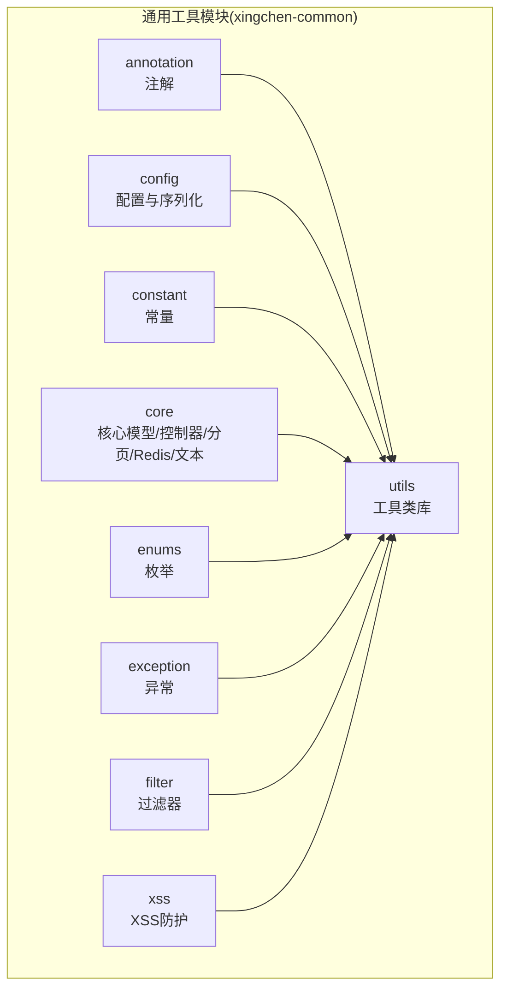
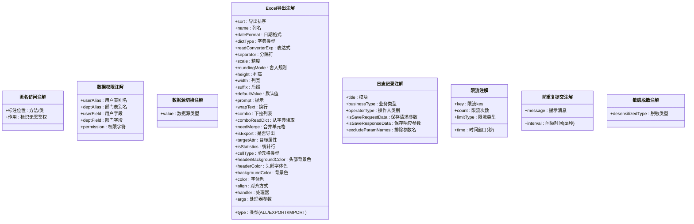
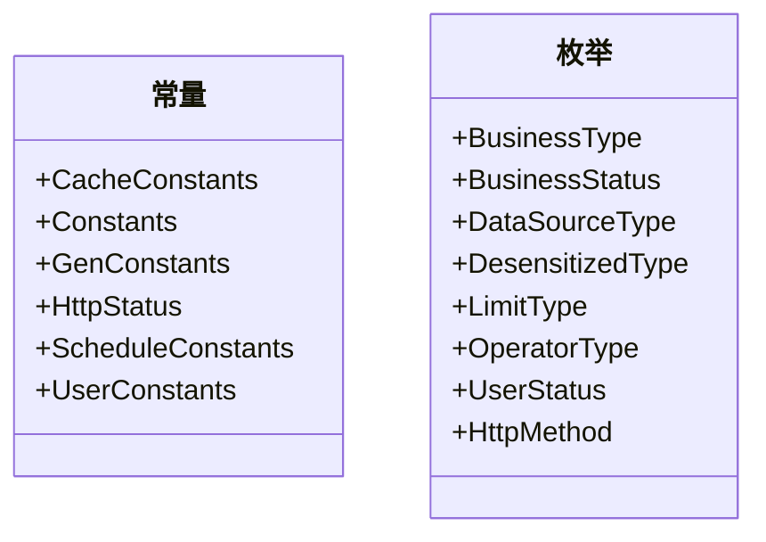
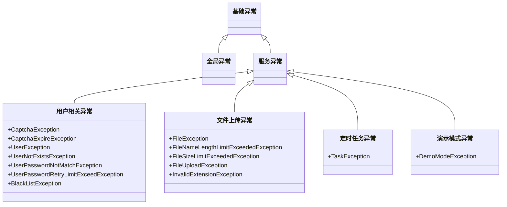
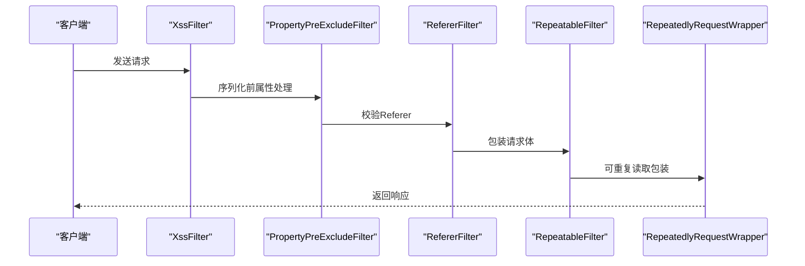
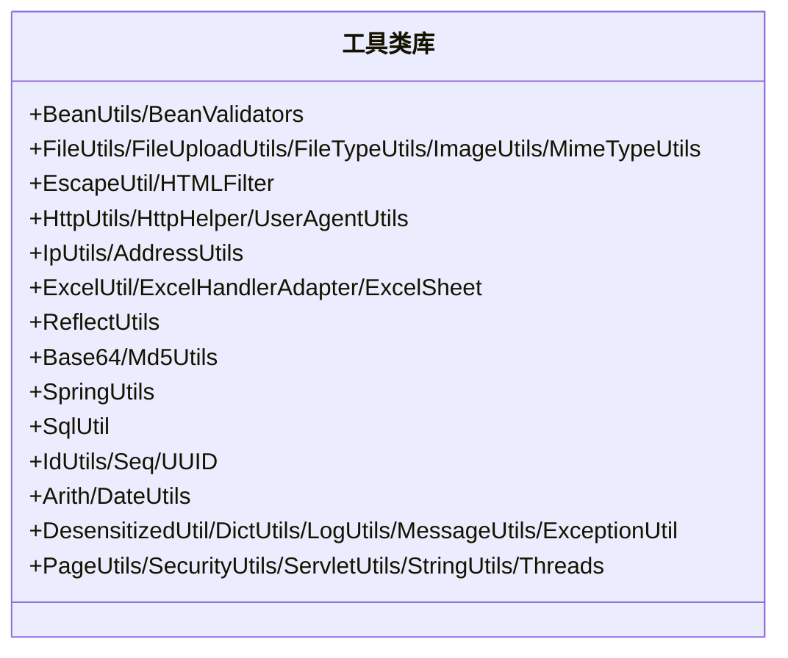
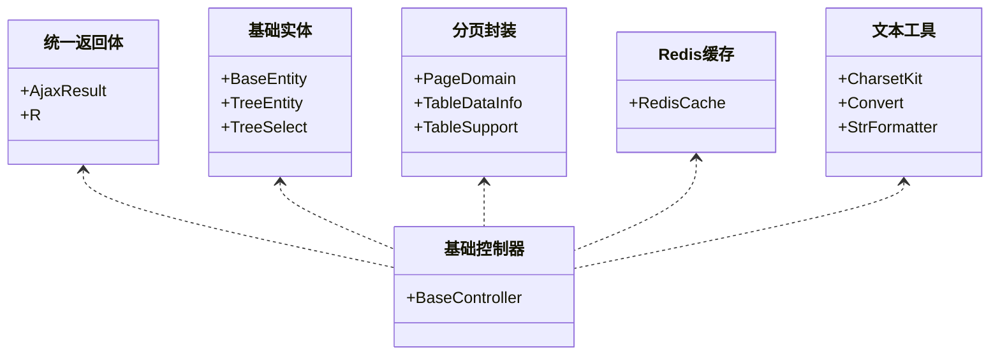
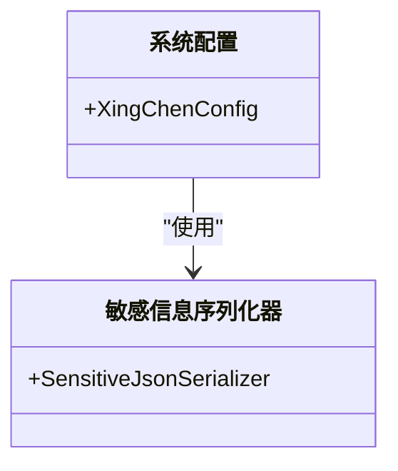
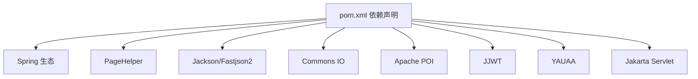

# 通用工具模块(xingchen-common)

<cite>
**本文引用的文件**
- [pom.xml](file://xingchen-common/pom.xml)
- [Anonymous.java](file://xingchen-common/src/main/java/com/xingchen/common/annotation/Anonymous.java)
- [DataScope.java](file://xingchen-common/src/main/java/com/xingchen/common/annotation/DataScope.java)
- [DataSource.java](file://xingchen-common/src/main/java/com/xingchen/common/annotation/DataSource.java)
- [Excel.java](file://xingchen-common/src/main/java/com/xingchen/common/annotation/Excel.java)
- [Excels.java](file://xingchen-common/src/main/java/com/xingchen/common/annotation/Excels.java)
- [Log.java](file://xingchen-common/src/main/java/com/xingchen/common/annotation/Log.java)
- [RateLimiter.java](file://xingchen-common/src/main/java/com/xingchen/common/annotation/RateLimiter.java)
- [RepeatSubmit.java](file://xingchen-common/src/main/java/com/xingchen/common/annotation/RepeatSubmit.java)
- [Sensitive.java](file://xingchen-common/src/main/java/com/xingchen/common/annotation/Sensitive.java)
- [XingChenConfig.java](file://xingchen-common/src/main/java/com/xingchen/common/config/XingChenConfig.java)
- [SensitiveJsonSerializer.java](file://xingchen-common/src/main/java/com/xingchen/common/config/serializer/SensitiveJsonSerializer.java)
- [CacheConstants.java](file://xingchen-common/src/main/java/com/xingchen/common/constant/CacheConstants.java)
- [Constants.java](file://xingchen-common/src/main/java/com/xingchen/common/constant/Constants.java)
- [GenConstants.java](file://xingchen-common/src/main/java/com/xingchen/common/constant/GenConstants.java)
- [HttpStatus.java](file://xingchen-common/src/main/java/com/xingchen/common/constant/HttpStatus.java)
- [ScheduleConstants.java](file://xingchen-common/src/main/java/com/xingchen/common/constant/ScheduleConstants.java)
- [UserConstants.java](file://xingchen-common/src/main/java/com/xingchen/common/constant/UserConstants.java)
- [BaseController.java](file://xingchen-common/src/main/java/com/xingchen/common/core/controller/BaseController.java)
- [AjaxResult.java](file://xingchen-common/src/main/java/com/xingchen/common/core/domain/AjaxResult.java)
- [BaseEntity.java](file://xingchen-common/src/main/java/com/xingchen/common/core/domain/BaseEntity.java)
- [R.java](file://xingchen-common/src/main/java/com/xingchen/common/core/domain/R.java)
- [TreeEntity.java](file://xingchen-common/src/main/java/com/xingchen/common/core/domain/TreeEntity.java)
- [TreeSelect.java](file://xingchen-common/src/main/java/com/xingchen/common/core/domain/TreeSelect.java)
- [PageDomain.java](file://xingchen-common/src/main/java/com/xingchen/common/core/page/PageDomain.java)
- [TableDataInfo.java](file://xingchen-common/src/main/java/com/xingchen/common/core/page/TableDataInfo.java)
- [TableSupport.java](file://xingchen-common/src/main/java/com/xingchen/common/core/page/TableSupport.java)
- [RedisCache.java](file://xingchen-common/src/main/java/com/xingchen/common/core/redis/RedisCache.java)
- [CharsetKit.java](file://xingchen-common/src/main/java/com/xingchen/common/core/text/CharsetKit.java)
- [Convert.java](file://xingchen-common/src/main/java/com/xingchen/common/core/text/Convert.java)
- [StrFormatter.java](file://xingchen-common/src/main/java/com/xingchen/common/core/text/StrFormatter.java)
- [BusinessStatus.java](file://xingchen-common/src/main/java/com/xingchen/common/enums/BusinessStatus.java)
- [BusinessType.java](file://xingchen-common/src/main/java/com/xingchen/common/enums/BusinessType.java)
- [DataSourceType.java](file://xingchen-common/src/main/java/com/xingchen/common/enums/DataSourceType.java)
- [DesensitizedType.java](file://xingchen-common/src/main/java/com/xingchen/common/enums/DesensitizedType.java)
- [HttpMethod.java](file://xingchen-common/src/main/java/com/xingchen/common/enums/HttpMethod.java)
- [LimitType.java](file://xingchen-common/src/main/java/com/xingchen/common/enums/LimitType.java)
- [OperatorType.java](file://xingchen-common/src/main/java/com/xingchen/common/enums/OperatorType.java)
- [UserStatus.java](file://xingchen-common/src/main/java/com/xingchen/common/enums/UserStatus.java)
- [BaseException.java](file://xingchen-common/src/main/java/com/xingchen/common/exception/base/BaseException.java)
- [FileException.java](file://xingchen-common/src/main/java/com/xingchen/common/exception/file/FileException.java)
- [FileNameLengthLimitExceededException.java](file://xingchen-common/src/main/java/com/xingchen/common/exception/file/FileNameLengthLimitExceededException.java)
- [FileSizeLimitExceededException.java](file://xingchen-common/src/main/java/com/xingchen/common/exception/file/FileSizeLimitExceededException.java)
- [FileUploadException.java](file://xingchen-common/src/main/java/com/xingchen/common/exception/file/FileUploadException.java)
- [InvalidExtensionException.java](file://xingchen-common/src/main/java/com/xingchen/common/exception/file/InvalidExtensionException.java)
- [TaskException.java](file://xingchen-common/src/main/java/com/xingchen/common/exception/job/TaskException.java)
- [BlackListException.java](file://xingchen-common/src/main/java/com/xingchen/common/exception/user/BlackListException.java)
- [CaptchaException.java](file://xingchen-common/src/main/java/com/xingchen/common/exception/user/CaptchaException.java)
- [CaptchaExpireException.java](file://xingchen-common/src/main/java/com/xingchen/common/exception/user/CaptchaExpireException.java)
- [UserException.java](file://xingchen-common/src/main/java/com/xingchen/common/exception/user/UserException.java)
- [UserNotExistsException.java](file://xingchen-common/src/main/java/com/xingchen/common/exception/user/UserNotExistsException.java)
- [UserPasswordNotMatchException.java](file://xingchen-common/src/main/java/com/xingchen/common/exception/user/UserPasswordNotMatchException.java)
- [UserPasswordRetryLimitExceedException.java](file://xingchen-common/src/main/java/com/xingchen/common/exception/user/UserPasswordRetryLimitExceedException.java)
- [DemoModeException.java](file://xingchen-common/src/main/java/com/xingchen/common/exception/DemoModeException.java)
- [GlobalException.java](file://xingchen-common/src/main/java/com/xingchen/common/exception/GlobalException.java)
- [ServiceException.java](file://xingchen-common/src/main/java/com/xingchen/common/exception/ServiceException.java)
- [UtilException.java](file://xingchen-common/src/main/java/com/xingchen/common/exception/UtilException.java)
- [PropertyPreExcludeFilter.java](file://xingchen-common/src/main/java/com/xingchen/common/filter/PropertyPreExcludeFilter.java)
- [RefererFilter.java](file://xingchen-common/src/main/java/com/xingchen/common/filter/RefererFilter.java)
- [RepeatableFilter.java](file://xingchen-common/src/main/java/com/xingchen/common/filter/RepeatableFilter.java)
- [RepeatedlyRequestWrapper.java](file://xingchen-common/src/main/java/com/xingchen/common/filter/RepeatedlyRequestWrapper.java)
- [XssFilter.java](file://xingchen-common/src/main/java/com/xingchen/common/filter/XssFilter.java)
- [XssHttpServletRequestWrapper.java](file://xingchen-common/src/main/java/com/xingchen/common/filter/XssHttpServletRequestWrapper.java)
- [BeanUtils.java](file://xingchen-common/src/main/java/com/xingchen/common/utils/bean/BeanUtils.java)
- [BeanValidators.java](file://xingchen-common/src/main/java/com/xingchen/common/utils/bean/BeanValidators.java)
- [FileTypeUtils.java](file://xingchen-common/src/main/java/com/xingchen/common/utils/file/FileTypeUtils.java)
- [FileUploadUtils.java](file://xingchen-common/src/main/java/com/xingchen/common/utils/file/FileUploadUtils.java)
- [FileUtils.java](file://xingchen-common/src/main/java/com/xingchen/common/utils/file/FileUtils.java)
- [ImageUtils.java](file://xingchen-common/src/main/java/com/xingchen/common/utils/file/ImageUtils.java)
- [MimeTypeUtils.java](file://xingchen-common/src/main/java/com/xingchen/common/utils/file/MimeTypeUtils.java)
- [EscapeUtil.java](file://xingchen-common/src/main/java/com/xingchen/common/utils/html/EscapeUtil.java)
- [HTMLFilter.java](file://xingchen-common/src/main/java/com/xingchen/common/utils/html/HTMLFilter.java)
- [HttpHelper.java](file://xingchen-common/src/main/java/com/xingchen/common/utils/http/HttpHelper.java)
- [HttpUtils.java](file://xingchen-common/src/main/java/com/xingchen/common/utils/http/HttpUtils.java)
- [UserAgentUtils.java](file://xingchen-common/src/main/java/com/xingchen/common/utils/http/UserAgentUtils.java)
- [AddressUtils.java](file://xingchen-common/src/main/java/com/xingchen/common/utils/ip/AddressUtils.java)
- [IpUtils.java](file://xingchen-common/src/main/java/com/xingchen/common/utils/ip/IpUtils.java)
- [ExcelHandlerAdapter.java](file://xingchen-common/src/main/java/com/xingchen/common/utils/poi/ExcelHandlerAdapter.java)
- [ExcelSheet.java](file://xingchen-common/src/main/java/com/xingchen/common/utils/poi/ExcelSheet.java)
- [ExcelUtil.java](file://xingchen-common/src/main/java/com/xingchen/common/utils/poi/ExcelUtil.java)
- [ReflectUtils.java](file://xingchen-common/src/main/java/com/xingchen/common/utils/reflect/ReflectUtils.java)
- [Base64.java](file://xingchen-common/src/main/java/com/xingchen/common/utils/sign/Base64.java)
- [Md5Utils.java](file://xingchen-common/src/main/java/com/xingchen/common/utils/sign/Md5Utils.java)
- [SpringUtils.java](file://xingchen-common/src/main/java/com/xingchen/common/utils/spring/SpringUtils.java)
- [SqlUtil.java](file://xingchen-common/src/main/java/com/xingchen/common/utils/sql/SqlUtil.java)
- [IdUtils.java](file://xingchen-common/src/main/java/com/xingchen/common/utils/uuid/IdUtils.java)
- [Seq.java](file://xingchen-common/src/main/java/com/xingchen/common/utils/uuid/Seq.java)
- [UUID.java](file://xingchen-common/src/main/java/com/xingchen/common/utils/uuid/UUID.java)
- [Arith.java](file://xingchen-common/src/main/java/com/xingchen/common/utils/Arith.java)
- [DateUtils.java](file://xingchen-common/src/main/java/com/xingchen/common/utils/DateUtils.java)
- [DesensitizedUtil.java](file://xingchen-common/src/main/java/com/xingchen/common/utils/DesensitizedUtil.java)
- [DictUtils.java](file://xingchen-common/src/main/java/com/xingchen/common/utils/DictUtils.java)
- [ExceptionUtil.java](file://xingchen-common/src/main/java/com/xingchen/common/utils/ExceptionUtil.java)
- [LogUtils.java](file://xingchen-common/src/main/java/com/xingchen/common/utils/LogUtils.java)
- [MessageUtils.java](file://xingchen-common/src/main/java/com/xingchen/common/utils/MessageUtils.java)
- [PageUtils.java](file://xingchen-common/src/main/java/com/xingchen/common/utils/PageUtils.java)
- [SecurityUtils.java](file://xingchen-common/src/main/java/com/xingchen/common/utils/SecurityUtils.java)
- [ServletUtils.java](file://xingchen-common/src/main/java/com/xingchen/common/utils/ServletUtils.java)
- [StringUtils.java](file://xingchen-common/src/main/java/com/xingchen/common/utils/StringUtils.java)
- [Threads.java](file://xingchen-common/src/main/java/com/xingchen/common/utils/Threads.java)
- [Xss.java](file://xingchen-common/src/main/java/com/xingchen/common/xss/Xss.java)
- [XssValidator.java](file://xingchen-common/src/main/java/com/xingchen/common/xss/XssValidator.java)
</cite>

## 目录
1. [简介](#简介)
2. [项目结构](#项目结构)
3. [核心组件](#核心组件)
4. [架构总览](#架构总览)
5. [详细组件分析](#详细组件分析)
6. [依赖分析](#依赖分析)
7. [性能考虑](#性能考虑)
8. [故障排查指南](#故障排查指南)
9. [结论](#结论)
10. [附录](#附录)

## 简介
通用工具模块(xingchen-common)是健康管理系统中的基础设施模块，旨在为上层业务模块提供统一、可复用的基础能力，包括但不限于：
- 注解体系：权限匿名访问、数据源切换、日志记录、限流、防重复提交、敏感信息脱敏等
- 常量定义：缓存键前缀、HTTP状态码、定时任务常量、用户相关常量等
- 枚举定义：业务类型、操作类型、数据源类型、脱敏类型、限流类型等
- 异常体系：服务异常、全局异常、文件上传异常、用户相关异常、定时任务异常等
- 过滤器链：XSS防护、重复提交拦截、请求体可重复读取、Referer校验等
- 工具类库：Bean拷贝与校验、文件处理、HTML转义与过滤、HTTP辅助、IP归属查询、POI Excel处理、反射工具、签名与加密、Spring上下文、SQL安全、UUID、日期时间、分页、安全工具、Servlet工具、字符串工具、线程工具等
- 核心模型：统一返回体、分页封装、树形实体、基础实体等
- 配置与序列化：系统配置、敏感信息JSON序列化器

该模块通过清晰的分层设计与职责划分，确保各子模块之间低耦合、高内聚，并为上层模块提供一致的编程体验。

## 项目结构
模块采用按功能域分包的组织方式，主要包如下：
- annotation：自定义注解，覆盖匿名访问、数据权限、数据源切换、Excel导出、日志、限流、防重复提交、敏感脱敏等
- config：系统配置与JSON序列化器
- constant：系统常量
- core：核心模型与基础控制器、分页、Redis缓存、文本工具
- enums：枚举类型
- exception：异常体系
- filter：Web过滤器链
- utils：工具类库
- xss：XSS防护

图表来源
- [pom.xml:18-121](file://xingchen-common/pom.xml#L18-L121)

章节来源
- [pom.xml:1-123](file://xingchen-common/pom.xml#L1-L123)

## 核心组件
本节聚焦于模块的关键构件及其职责边界。

- 注解体系
  - 匿名访问：用于标识无需鉴权的方法或类
  - 数据权限：用于SQL层面的数据范围过滤
  - 数据源切换：用于动态切换主从库或自定义数据源
  - Excel导出：用于实体字段映射Excel列、样式、字典转换、统计等
  - 日志记录：用于统一记录操作日志，控制请求/响应数据保存
  - 限流：基于Redis进行限流控制
  - 防重复提交：基于时间窗口防止表单重复提交
  - 敏感脱敏：基于Jackson序列化器对字段进行脱敏输出

- 常量定义
  - 缓存键前缀、HTTP状态码、定时任务常量、用户相关常量等

- 枚举定义
  - 业务类型、操作类型、数据源类型、脱敏类型、限流类型等

- 异常体系
  - 统一的服务异常、全局异常、文件上传异常、用户相关异常、定时任务异常等

- 过滤器链
  - XSS过滤、重复请求拦截、请求体可重复读取、Referer校验

- 工具类库
  - Bean拷贝与校验、文件处理、HTML转义与过滤、HTTP辅助、IP归属查询、POI Excel处理、反射工具、签名与加密、Spring上下文、SQL安全、UUID、日期时间、分页、安全工具、Servlet工具、字符串工具、线程工具等

- 核心模型
  - 统一返回体、分页封装、树形实体、基础实体

- 配置与序列化
  - 系统配置、敏感信息JSON序列化器

章节来源
- [Anonymous.java:1-20](file://xingchen-common/src/main/java/com/xingchen/common/annotation/Anonymous.java#L1-L20)
- [DataScope.java:1-44](file://xingchen-common/src/main/java/com/xingchen/common/annotation/DataScope.java#L1-L44)
- [DataSource.java:1-29](file://xingchen-common/src/main/java/com/xingchen/common/annotation/DataSource.java#L1-L29)
- [Excel.java:1-198](file://xingchen-common/src/main/java/com/xingchen/common/annotation/Excel.java#L1-L198)
- [Log.java:1-52](file://xingchen-common/src/main/java/com/xingchen/common/annotation/Log.java#L1-L52)
- [RateLimiter.java:1-41](file://xingchen-common/src/main/java/com/xingchen/common/annotation/RateLimiter.java#L1-L41)
- [RepeatSubmit.java:1-32](file://xingchen-common/src/main/java/com/xingchen/common/annotation/RepeatSubmit.java#L1-L32)
- [Sensitive.java:1-25](file://xingchen-common/src/main/java/com/xingchen/common/annotation/Sensitive.java#L1-L25)
- [CacheConstants.java](file://xingchen-common/src/main/java/com/xingchen/common/constant/CacheConstants.java)
- [Constants.java](file://xingchen-common/src/main/java/com/xingchen/common/constant/Constants.java)
- [GenConstants.java](file://xingchen-common/src/main/java/com/xingchen/common/constant/GenConstants.java)
- [HttpStatus.java](file://xingchen-common/src/main/java/com/xingchen/common/constant/HttpStatus.java)
- [ScheduleConstants.java](file://xingchen-common/src/main/java/com/xingchen/common/constant/ScheduleConstants.java)
- [UserConstants.java](file://xingchen-common/src/main/java/com/xingchen/common/constant/UserConstants.java)
- [BusinessStatus.java](file://xingchen-common/src/main/java/com/xingchen/common/enums/BusinessStatus.java)
- [BusinessType.java](file://xingchen-common/src/main/java/com/xingchen/common/enums/BusinessType.java)
- [DataSourceType.java](file://xingchen-common/src/main/java/com/xingchen/common/enums/DataSourceType.java)
- [DesensitizedType.java](file://xingchen-common/src/main/java/com/xingchen/common/enums/DesensitizedType.java)
- [LimitType.java](file://xingchen-common/src/main/java/com/xingchen/common/enums/LimitType.java)
- [OperatorType.java](file://xingchen-common/src/main/java/com/xingchen/common/enums/OperatorType.java)
- [UserStatus.java](file://xingchen-common/src/main/java/com/xingchen/common/enums/UserStatus.java)
- [BaseException.java](file://xingchen-common/src/main/java/com/xingchen/common/exception/base/BaseException.java)
- [FileException.java](file://xingchen-common/src/main/java/com/xingchen/common/exception/file/FileException.java)
- [FileNameLengthLimitExceededException.java](file://xingchen-common/src/main/java/com/xingchen/common/exception/file/FileNameLengthLimitExceededException.java)
- [FileSizeLimitExceededException.java](file://xingchen-common/src/main/java/com/xingchen/common/exception/file/FileSizeLimitExceededException.java)
- [FileUploadException.java](file://xingchen-common/src/main/java/com/xingchen/common/exception/file/FileUploadException.java)
- [InvalidExtensionException.java](file://xingchen-common/src/main/java/com/xingchen/common/exception/file/InvalidExtensionException.java)
- [TaskException.java](file://xingchen-common/src/main/java/com/xingchen/common/exception/job/TaskException.java)
- [BlackListException.java](file://xingchen-common/src/main/java/com/xingchen/common/exception/user/BlackListException.java)
- [CaptchaException.java](file://xingchen-common/src/main/java/com/xingchen/common/exception/user/CaptchaException.java)
- [CaptchaExpireException.java](file://xingchen-common/src/main/java/com/xingchen/common/exception/user/CaptchaExpireException.java)
- [UserException.java](file://xingchen-common/src/main/java/com/xingchen/common/exception/user/UserException.java)
- [UserNotExistsException.java](file://xingchen-common/src/main/java/com/xingchen/common/exception/user/UserNotExistsException.java)
- [UserPasswordNotMatchException.java](file://xingchen-common/src/main/java/com/xingchen/common/exception/user/UserPasswordNotMatchException.java)
- [UserPasswordRetryLimitExceedException.java](file://xingchen-common/src/main/java/com/xingchen/common/exception/user/UserPasswordRetryLimitExceedException.java)
- [DemoModeException.java](file://xingchen-common/src/main/java/com/xingchen/common/exception/DemoModeException.java)
- [GlobalException.java](file://xingchen-common/src/main/java/com/xingchen/common/exception/GlobalException.java)
- [ServiceException.java](file://xingchen-common/src/main/java/com/xingchen/common/exception/ServiceException.java)
- [UtilException.java](file://xingchen-common/src/main/java/com/xingchen/common/exception/UtilException.java)
- [PropertyPreExcludeFilter.java](file://xingchen-common/src/main/java/com/xingchen/common/filter/PropertyPreExcludeFilter.java)
- [RefererFilter.java](file://xingchen-common/src/main/java/com/xingchen/common/filter/RefererFilter.java)
- [RepeatableFilter.java](file://xingchen-common/src/main/java/com/xingchen/common/filter/RepeatableFilter.java)
- [RepeatedlyRequestWrapper.java](file://xingchen-common/src/main/java/com/xingchen/common/filter/RepeatedlyRequestWrapper.java)
- [XssFilter.java](file://xingchen-common/src/main/java/com/xingchen/common/filter/XssFilter.java)
- [XssHttpServletRequestWrapper.java](file://xingchen-common/src/main/java/com/xingchen/common/filter/XssHttpServletRequestWrapper.java)
- [BeanUtils.java](file://xingchen-common/src/main/java/com/xingchen/common/utils/bean/BeanUtils.java)
- [BeanValidators.java](file://xingchen-common/src/main/java/com/xingchen/common/utils/bean/BeanValidators.java)
- [FileTypeUtils.java](file://xingchen-common/src/main/java/com/xingchen/common/utils/file/FileTypeUtils.java)
- [FileUploadUtils.java](file://xingchen-common/src/main/java/com/xingchen/common/utils/file/FileUploadUtils.java)
- [FileUtils.java](file://xingchen-common/src/main/java/com/xingchen/common/utils/file/FileUtils.java)
- [ImageUtils.java](file://xingchen-common/src/main/java/com/xingchen/common/utils/file/ImageUtils.java)
- [MimeTypeUtils.java](file://xingchen-common/src/main/java/com/xingchen/common/utils/file/MimeTypeUtils.java)
- [EscapeUtil.java](file://xingchen-common/src/main/java/com/xingchen/common/utils/html/EscapeUtil.java)
- [HTMLFilter.java](file://xingchen-common/src/main/java/com/xingchen/common/utils/html/HTMLFilter.java)
- [HttpHelper.java](file://xingchen-common/src/main/java/com/xingchen/common/utils/http/HttpHelper.java)
- [HttpUtils.java](file://xingchen-common/src/main/java/com/xingchen/common/utils/http/HttpUtils.java)
- [UserAgentUtils.java](file://xingchen-common/src/main/java/com/xingchen/common/utils/http/UserAgentUtils.java)
- [AddressUtils.java](file://xingchen-common/src/main/java/com/xingchen/common/utils/ip/AddressUtils.java)
- [IpUtils.java](file://xingchen-common/src/main/java/com/xingchen/common/utils/ip/IpUtils.java)
- [ExcelHandlerAdapter.java](file://xingchen-common/src/main/java/com/xingchen/common/utils/poi/ExcelHandlerAdapter.java)
- [ExcelSheet.java](file://xingchen-common/src/main/java/com/xingchen/common/utils/poi/ExcelSheet.java)
- [ExcelUtil.java](file://xingchen-common/src/main/java/com/xingchen/common/utils/poi/ExcelUtil.java)
- [ReflectUtils.java](file://xingchen-common/src/main/java/com/xingchen/common/utils/reflect/ReflectUtils.java)
- [Base64.java](file://xingchen-common/src/main/java/com/xingchen/common/utils/sign/Base64.java)
- [Md5Utils.java](file://xingchen-common/src/main/java/com/xingchen/common/utils/sign/Md5Utils.java)
- [SpringUtils.java](file://xingchen-common/src/main/java/com/xingchen/common/utils/spring/SpringUtils.java)
- [SqlUtil.java](file://xingchen-common/src/main/java/com/xingchen/common/utils/sql/SqlUtil.java)
- [IdUtils.java](file://xingchen-common/src/main/java/com/xingchen/common/utils/uuid/IdUtils.java)
- [Seq.java](file://xingchen-common/src/main/java/com/xingchen/common/utils/uuid/Seq.java)
- [UUID.java](file://xingchen-common/src/main/java/com/xingchen/common/utils/uuid/UUID.java)
- [Arith.java](file://xingchen-common/src/main/java/com/xingchen/common/utils/Arith.java)
- [DateUtils.java](file://xingchen-common/src/main/java/com/xingchen/common/utils/DateUtils.java)
- [DesensitizedUtil.java](file://xingchen-common/src/main/java/com/xingchen/common/utils/DesensitizedUtil.java)
- [DictUtils.java](file://xingchen-common/src/main/java/com/xingchen/common/utils/DictUtils.java)
- [ExceptionUtil.java](file://xingchen-common/src/main/java/com/xingchen/common/utils/ExceptionUtil.java)
- [LogUtils.java](file://xingchen-common/src/main/java/com/xingchen/common/utils/LogUtils.java)
- [MessageUtils.java](file://xingchen-common/src/main/java/com/xingchen/common/utils/MessageUtils.java)
- [PageUtils.java](file://xingchen-common/src/main/java/com/xingchen/common/utils/PageUtils.java)
- [SecurityUtils.java](file://xingchen-common/src/main/java/com/xingchen/common/utils/SecurityUtils.java)
- [ServletUtils.java](file://xingchen-common/src/main/java/com/xingchen/common/utils/ServletUtils.java)
- [StringUtils.java](file://xingchen-common/src/main/java/com/xingchen/common/utils/StringUtils.java)
- [Threads.java](file://xingchen-common/src/main/java/com/xingchen/common/utils/Threads.java)
- [Xss.java](file://xingchen-common/src/main/java/com/xingchen/common/xss/Xss.java)
- [XssValidator.java](file://xingchen-common/src/main/java/com/xingchen/common/xss/XssValidator.java)

## 架构总览
通用工具模块通过“注解驱动 + 工具类 + 过滤器 + 异常 + 枚举 + 常量”的组合，向上层模块提供横切能力与基础设施。下图展示了模块内部关键组件之间的交互关系。

```mermaid
graph TB
subgraph "注解层"
AN["Anonymous"]
DS["DataScope"]
DSC["DataSource"]
EX["Excel/Excels"]
LG["Log"]
RL["RateLimiter"]
RS["RepeatSubmit"]
SD["Sensitive"]
end
subgraph "过滤器层"
XF["XssFilter"]
PR["PropertyPreExcludeFilter"]
RF["RefererFilter"]
RMF["RepeatableFilter"]
RW["RepeatedlyRequestWrapper"]
end
subgraph "工具层(utils)"
BU["BeanUtils/BeanValidators"]
FU["FileUtils/FileUploadUtils/FileTypeUtils/ImageUtils/MimeTypeUtils"]
HT["HttpUtils/HttpHelper/UserAgentUtils"]
IP["IpUtils/AddressUtils"]
POI["ExcelUtil/ExcelHandlerAdapter/ExcelSheet"]
RE["ReflectUtils"]
SI["Base64/Md5Utils"]
SP["SpringUtils"]
SQ["SqlUtil"]
ID["IdUtils/Seq/UUID"]
DT["DateUtils/Arith"]
PG["PageUtils"]
SE["SecurityUtils/ServletUtils"]
ST["StringUtils/Threads"]
DE["DesensitizedUtil/DictUtils/LogUtils/MessageUtils/ExceptionUtil"]
end
subgraph "核心(core)"
BC["BaseController"]
AR["AjaxResult/R"]
BE["BaseEntity/TreeEntity/TreeSelect"]
PD["PageDomain/TableDataInfo/TableSupport"]
RC["RedisCache"]
TX["CharsetKit/Convert/StrFormatter"]
end
subgraph "配置(config)"
CFG["XingChenConfig"]
SJS["SensitiveJsonSerializer"]
end
subgraph "异常(exception)"
BX["BaseException"]
GE["GlobalException"]
SEV["ServiceException"]
UEX["UserException/*"]
FEX["FileException/*"]
JEX["TaskException"]
DEMO["DemoModeException"]
end
subgraph "枚举(enums)"
BT["BusinessType"]
BS["BusinessStatus"]
DTYP["DataSourceType"]
DES["DesensitizedType"]
LT["LimitType"]
OT["OperatorType"]
UT["UserStatus"]
HM["HttpMethod"]
end
subgraph "常量(constant)"
CC["CacheConstants"]
CS["Constants"]
GC["GenConstants"]
HS["HttpStatus"]
SC["ScheduleConstants"]
UC["UserConstants"]
end
AN --> BC
DSC --> SQL["SQL构建/过滤"]
DSC --> RC
DSC --> DTYP
DSC --> BT
DSC --> OT
DSC --> CC
DSC --> LS["限流策略"]
EX --> POI
LG --> LOG["日志存储"]
RL --> LS["限流策略"]
RS --> RMF
RS --> RW
SD --> SJS
XF --> ST
PR --> SJS
RMF --> RW
BC --> AR
BC --> PD
BC --> RC
BC --> SE
BC --> ST
AR --> HS
BE --> TX
PD --> PG
RC --> ST
CFG --> SJS
BX --> GE
GE --> SEV
SEV --> UEX
SEV --> FEX
SEV --> JEX
DEMO --> GE
```

图表来源
- [Excel.java:1-198](file://xingchen-common/src/main/java/com/xingchen/common/annotation/Excel.java#L1-L198)
- [Log.java:1-52](file://xingchen-common/src/main/java/com/xingchen/common/annotation/Log.java#L1-L52)
- [RateLimiter.java:1-41](file://xingchen-common/src/main/java/com/xingchen/common/annotation/RateLimiter.java#L1-L41)
- [RepeatSubmit.java:1-32](file://xingchen-common/src/main/java/com/xingchen/common/annotation/RepeatSubmit.java#L1-L32)
- [Sensitive.java:1-25](file://xingchen-common/src/main/java/com/xingchen/common/annotation/Sensitive.java#L1-L25)
- [XingChenConfig.java](file://xingchen-common/src/main/java/com/xingchen/common/config/XingChenConfig.java)
- [SensitiveJsonSerializer.java](file://xingchen-common/src/main/java/com/xingchen/common/config/serializer/SensitiveJsonSerializer.java)
- [CacheConstants.java](file://xingchen-common/src/main/java/com/xingchen/common/constant/CacheConstants.java)
- [BusinessType.java](file://xingchen-common/src/main/java/com/xingchen/common/enums/BusinessType.java)
- [OperatorType.java](file://xingchen-common/src/main/java/com/xingchen/common/enums/OperatorType.java)
- [DataSourceType.java](file://xingchen-common/src/main/java/com/xingchen/common/enums/DataSourceType.java)
- [DesensitizedType.java](file://xingchen-common/src/main/java/com/xingchen/common/enums/DesensitizedType.java)
- [LimitType.java](file://xingchen-common/src/main/java/com/xingchen/common/enums/LimitType.java)
- [UserStatus.java](file://xingchen-common/src/main/java/com/xingchen/common/enums/UserStatus.java)
- [BaseController.java](file://xingchen-common/src/main/java/com/xingchen/common/core/controller/BaseController.java)
- [AjaxResult.java](file://xingchen-common/src/main/java/com/xingchen/common/core/domain/AjaxResult.java)
- [R.java](file://xingchen-common/src/main/java/com/xingchen/common/core/domain/R.java)
- [BaseEntity.java](file://xingchen-common/src/main/java/com/xingchen/common/core/domain/BaseEntity.java)
- [TreeEntity.java](file://xingchen-common/src/main/java/com/xingchen/common/core/domain/TreeEntity.java)
- [TreeSelect.java](file://xingchen-common/src/main/java/com/xingchen/common/core/domain/TreeSelect.java)
- [PageDomain.java](file://xingchen-common/src/main/java/com/xingchen/common/core/page/PageDomain.java)
- [TableDataInfo.java](file://xingchen-common/src/main/java/com/xingchen/common/core/page/TableDataInfo.java)
- [TableSupport.java](file://xingchen-common/src/main/java/com/xingchen/common/core/page/TableSupport.java)
- [RedisCache.java](file://xingchen-common/src/main/java/com/xingchen/common/core/redis/RedisCache.java)
- [CharsetKit.java](file://xingchen-common/src/main/java/com/xingchen/common/core/text/CharsetKit.java)
- [Convert.java](file://xingchen-common/src/main/java/com/xingchen/common/core/text/Convert.java)
- [StrFormatter.java](file://xingchen-common/src/main/java/com/xingchen/common/core/text/StrFormatter.java)
- [BeanUtils.java](file://xingchen-common/src/main/java/com/xingchen/common/utils/bean/BeanUtils.java)
- [BeanValidators.java](file://xingchen-common/src/main/java/com/xingchen/common/utils/bean/BeanValidators.java)
- [FileUtils.java](file://xingchen-common/src/main/java/com/xingchen/common/utils/file/FileUtils.java)
- [FileUploadUtils.java](file://xingchen-common/src/main/java/com/xingchen/common/utils/file/FileUploadUtils.java)
- [FileTypeUtils.java](file://xingchen-common/src/main/java/com/xingchen/common/utils/file/FileTypeUtils.java)
- [ImageUtils.java](file://xingchen-common/src/main/java/com/xingchen/common/utils/file/ImageUtils.java)
- [MimeTypeUtils.java](file://xingchen-common/src/main/java/com/xingchen/common/utils/file/MimeTypeUtils.java)
- [HttpUtils.java](file://xingchen-common/src/main/java/com/xingchen/common/utils/http/HttpUtils.java)
- [HttpHelper.java](file://xingchen-common/src/main/java/com/xingchen/common/utils/http/HttpHelper.java)
- [UserAgentUtils.java](file://xingchen-common/src/main/java/com/xingchen/common/utils/http/UserAgentUtils.java)
- [IpUtils.java](file://xingchen-common/src/main/java/com/xingchen/common/utils/ip/IpUtils.java)
- [AddressUtils.java](file://xingchen-common/src/main/java/com/xingchen/common/utils/ip/AddressUtils.java)
- [ExcelUtil.java](file://xingchen-common/src/main/java/com/xingchen/common/utils/poi/ExcelUtil.java)
- [ExcelHandlerAdapter.java](file://xingchen-common/src/main/java/com/xingchen/common/utils/poi/ExcelHandlerAdapter.java)
- [ExcelSheet.java](file://xingchen-common/src/main/java/com/xingchen/common/utils/poi/ExcelSheet.java)
- [ReflectUtils.java](file://xingchen-common/src/main/java/com/xingchen/common/utils/reflect/ReflectUtils.java)
- [Base64.java](file://xingchen-common/src/main/java/com/xingchen/common/utils/sign/Base64.java)
- [Md5Utils.java](file://xingchen-common/src/main/java/com/xingchen/common/utils/sign/Md5Utils.java)
- [SpringUtils.java](file://xingchen-common/src/main/java/com/xingchen/common/utils/spring/SpringUtils.java)
- [SqlUtil.java](file://xingchen-common/src/main/java/com/xingchen/common/utils/sql/SqlUtil.java)
- [IdUtils.java](file://xingchen-common/src/main/java/com/xingchen/common/utils/uuid/IdUtils.java)
- [Seq.java](file://xingchen-common/src/main/java/com/xingchen/common/utils/uuid/Seq.java)
- [UUID.java](file://xingchen-common/src/main/java/com/xingchen/common/utils/uuid/UUID.java)
- [Arith.java](file://xingchen-common/src/main/java/com/xingchen/common/utils/Arith.java)
- [DateUtils.java](file://xingchen-common/src/main/java/com/xingchen/common/utils/DateUtils.java)
- [DesensitizedUtil.java](file://xingchen-common/src/main/java/com/xingchen/common/utils/DesensitizedUtil.java)
- [DictUtils.java](file://xingchen-common/src/main/java/com/xingchen/common/utils/DictUtils.java)
- [ExceptionUtil.java](file://xingchen-common/src/main/java/com/xingchen/common/utils/ExceptionUtil.java)
- [LogUtils.java](file://xingchen-common/src/main/java/com/xingchen/common/utils/LogUtils.java)
- [MessageUtils.java](file://xingchen-common/src/main/java/com/xingchen/common/utils/MessageUtils.java)
- [PageUtils.java](file://xingchen-common/src/main/java/com/xingchen/common/utils/PageUtils.java)
- [SecurityUtils.java](file://xingchen-common/src/main/java/com/xingchen/common/utils/SecurityUtils.java)
- [ServletUtils.java](file://xingchen-common/src/main/java/com/xingchen/common/utils/ServletUtils.java)
- [StringUtils.java](file://xingchen-common/src/main/java/com/xingchen/common/utils/StringUtils.java)
- [Threads.java](file://xingchen-common/src/main/java/com/xingchen/common/utils/Threads.java)
- [BaseException.java](file://xingchen-common/src/main/java/com/xingchen/common/exception/base/BaseException.java)
- [GlobalException.java](file://xingchen-common/src/main/java/com/xingchen/common/exception/GlobalException.java)
- [ServiceException.java](file://xingchen-common/src/main/java/com/xingchen/common/exception/ServiceException.java)
- [UserException.java](file://xingchen-common/src/main/java/com/xingchen/common/exception/user/UserException.java)
- [FileException.java](file://xingchen-common/src/main/java/com/xingchen/common/exception/file/FileException.java)
- [TaskException.java](file://xingchen-common/src/main/java/com/xingchen/common/exception/job/TaskException.java)
- [DemoModeException.java](file://xingchen-common/src/main/java/com/xingchen/common/exception/DemoModeException.java)

## 详细组件分析

### 注解体系
- 匿名访问注解：用于标识无需鉴权的方法或类，便于在网关或安全层快速放行
- 数据权限注解：通过别名与字段映射，生成SQL片段或参与权限过滤
- 数据源切换注解：支持方法级优先于类级的切换策略
- Excel导出注解：支持列宽、高度、字典映射、精度控制、样式、提示、组合框、统计行、导入导出类型等
- 日志记录注解：统一记录模块、业务类型、操作人类别、是否保存请求/响应参数、排除字段
- 限流注解：支持限流key、时间窗口、次数、限流类型
- 防重复提交注解：基于时间窗口与提示消息
- 敏感脱敏注解：结合JSON序列化器实现字段脱敏

图表来源
- [Anonymous.java:1-20](file://xingchen-common/src/main/java/com/xingchen/common/annotation/Anonymous.java#L1-L20)
- [DataScope.java:1-44](file://xingchen-common/src/main/java/com/xingchen/common/annotation/DataScope.java#L1-L44)
- [DataSource.java:1-29](file://xingchen-common/src/main/java/com/xingchen/common/annotation/DataSource.java#L1-L29)
- [Excel.java:1-198](file://xingchen-common/src/main/java/com/xingchen/common/annotation/Excel.java#L1-L198)
- [Log.java:1-52](file://xingchen-common/src/main/java/com/xingchen/common/annotation/Log.java#L1-L52)
- [RateLimiter.java:1-41](file://xingchen-common/src/main/java/com/xingchen/common/annotation/RateLimiter.java#L1-L41)
- [RepeatSubmit.java:1-32](file://xingchen-common/src/main/java/com/xingchen/common/annotation/RepeatSubmit.java#L1-L32)
- [Sensitive.java:1-25](file://xingchen-common/src/main/java/com/xingchen/common/annotation/Sensitive.java#L1-L25)

章节来源
- [Anonymous.java:1-20](file://xingchen-common/src/main/java/com/xingchen/common/annotation/Anonymous.java#L1-L20)
- [DataScope.java:1-44](file://xingchen-common/src/main/java/com/xingchen/common/annotation/DataScope.java#L1-L44)
- [DataSource.java:1-29](file://xingchen-common/src/main/java/com/xingchen/common/annotation/DataSource.java#L1-L29)
- [Excel.java:1-198](file://xingchen-common/src/main/java/com/xingchen/common/annotation/Excel.java#L1-L198)
- [Excels.java:1-19](file://xingchen-common/src/main/java/com/xingchen/common/annotation/Excels.java#L1-L19)
- [Log.java:1-52](file://xingchen-common/src/main/java/com/xingchen/common/annotation/Log.java#L1-L52)
- [RateLimiter.java:1-41](file://xingchen-common/src/main/java/com/xingchen/common/annotation/RateLimiter.java#L1-L41)
- [RepeatSubmit.java:1-32](file://xingchen-common/src/main/java/com/xingchen/common/annotation/RepeatSubmit.java#L1-L32)
- [Sensitive.java:1-25](file://xingchen-common/src/main/java/com/xingchen/common/annotation/Sensitive.java#L1-L25)

### 常量与枚举
- 常量：缓存键前缀、HTTP状态码、定时任务常量、用户相关常量等
- 枚举：业务类型、操作类型、数据源类型、脱敏类型、限流类型、用户状态、HTTP方法等

图表来源
- [CacheConstants.java](file://xingchen-common/src/main/java/com/xingchen/common/constant/CacheConstants.java)
- [Constants.java](file://xingchen-common/src/main/java/com/xingchen/common/constant/Constants.java)
- [GenConstants.java](file://xingchen-common/src/main/java/com/xingchen/common/constant/GenConstants.java)
- [HttpStatus.java](file://xingchen-common/src/main/java/com/xingchen/common/constant/HttpStatus.java)
- [ScheduleConstants.java](file://xingchen-common/src/main/java/com/xingchen/common/constant/ScheduleConstants.java)
- [UserConstants.java](file://xingchen-common/src/main/java/com/xingchen/common/constant/UserConstants.java)
- [BusinessType.java](file://xingchen-common/src/main/java/com/xingchen/common/enums/BusinessType.java)
- [BusinessStatus.java](file://xingchen-common/src/main/java/com/xingchen/common/enums/BusinessStatus.java)
- [DataSourceType.java](file://xingchen-common/src/main/java/com/xingchen/common/enums/DataSourceType.java)
- [DesensitizedType.java](file://xingchen-common/src/main/java/com/xingchen/common/enums/DesensitizedType.java)
- [LimitType.java](file://xingchen-common/src/main/java/com/xingchen/common/enums/LimitType.java)
- [OperatorType.java](file://xingchen-common/src/main/java/com/xingchen/common/enums/OperatorType.java)
- [UserStatus.java](file://xingchen-common/src/main/java/com/xingchen/common/enums/UserStatus.java)
- [HttpMethod.java](file://xingchen-common/src/main/java/com/xingchen/common/enums/HttpMethod.java)

章节来源
- [CacheConstants.java](file://xingchen-common/src/main/java/com/xingchen/common/constant/CacheConstants.java)
- [Constants.java](file://xingchen-common/src/main/java/com/xingchen/common/constant/Constants.java)
- [GenConstants.java](file://xingchen-common/src/main/java/com/xingchen/common/constant/GenConstants.java)
- [HttpStatus.java](file://xingchen-common/src/main/java/com/xingchen/common/constant/HttpStatus.java)
- [ScheduleConstants.java](file://xingchen-common/src/main/java/com/xingchen/common/constant/ScheduleConstants.java)
- [UserConstants.java](file://xingchen-common/src/main/java/com/xingchen/common/constant/UserConstants.java)
- [BusinessType.java](file://xingchen-common/src/main/java/com/xingchen/common/enums/BusinessType.java)
- [BusinessStatus.java](file://xingchen-common/src/main/java/com/xingchen/common/enums/BusinessStatus.java)
- [DataSourceType.java](file://xingchen-common/src/main/java/com/xingchen/common/enums/DataSourceType.java)
- [DesensitizedType.java](file://xingchen-common/src/main/java/com/xingchen/common/enums/DesensitizedType.java)
- [LimitType.java](file://xingchen-common/src/main/java/com/xingchen/common/enums/LimitType.java)
- [OperatorType.java](file://xingchen-common/src/main/java/com/xingchen/common/enums/OperatorType.java)
- [UserStatus.java](file://xingchen-common/src/main/java/com/xingchen/common/enums/UserStatus.java)
- [HttpMethod.java](file://xingchen-common/src/main/java/com/xingchen/common/enums/HttpMethod.java)

### 异常处理机制
- 基础异常：所有异常的基类
- 全局异常：统一处理未捕获异常
- 服务异常：业务异常基类
- 用户相关异常：登录验证码、密码错误、用户不存在等
- 文件上传异常：文件大小、扩展名、文件名长度限制等
- 定时任务异常：任务执行异常
- 演示模式异常：演示环境下的限制

图表来源
- [BaseException.java](file://xingchen-common/src/main/java/com/xingchen/common/exception/base/BaseException.java)
- [GlobalException.java](file://xingchen-common/src/main/java/com/xingchen/common/exception/GlobalException.java)
- [ServiceException.java](file://xingchen-common/src/main/java/com/xingchen/common/exception/ServiceException.java)
- [UserException.java](file://xingchen-common/src/main/java/com/xingchen/common/exception/user/UserException.java)
- [FileException.java](file://xingchen-common/src/main/java/com/xingchen/common/exception/file/FileException.java)
- [TaskException.java](file://xingchen-common/src/main/java/com/xingchen/common/exception/job/TaskException.java)
- [DemoModeException.java](file://xingchen-common/src/main/java/com/xingchen/common/exception/DemoModeException.java)

章节来源
- [BaseException.java](file://xingchen-common/src/main/java/com/xingchen/common/exception/base/BaseException.java)
- [GlobalException.java](file://xingchen-common/src/main/java/com/xingchen/common/exception/GlobalException.java)
- [ServiceException.java](file://xingchen-common/src/main/java/com/xingchen/common/exception/ServiceException.java)
- [UserException.java](file://xingchen-common/src/main/java/com/xingchen/common/exception/user/UserException.java)
- [FileException.java](file://xingchen-common/src/main/java/com/xingchen/common/exception/file/FileException.java)
- [TaskException.java](file://xingchen-common/src/main/java/com/xingchen/common/exception/job/TaskException.java)
- [DemoModeException.java](file://xingchen-common/src/main/java/com/xingchen/common/exception/DemoModeException.java)

### 过滤器链
- XSS过滤：防止跨站脚本攻击
- 属性预排除过滤：对JSON序列化前的属性进行预处理
- Referer校验：防止跨站请求伪造
- 请求体可重复读取：解决流被消费后无法再次读取的问题
- 请求包装器：对请求参数进行增强

图表来源
- [XssFilter.java](file://xingchen-common/src/main/java/com/xingchen/common/filter/XssFilter.java)
- [PropertyPreExcludeFilter.java](file://xingchen-common/src/main/java/com/xingchen/common/filter/PropertyPreExcludeFilter.java)
- [RefererFilter.java](file://xingchen-common/src/main/java/com/xingchen/common/filter/RefererFilter.java)
- [RepeatableFilter.java](file://xingchen-common/src/main/java/com/xingchen/common/filter/RepeatableFilter.java)
- [RepeatedlyRequestWrapper.java](file://xingchen-common/src/main/java/com/xingchen/common/filter/RepeatedlyRequestWrapper.java)

章节来源
- [XssFilter.java](file://xingchen-common/src/main/java/com/xingchen/common/filter/XssFilter.java)
- [PropertyPreExcludeFilter.java](file://xingchen-common/src/main/java/com/xingchen/common/filter/PropertyPreExcludeFilter.java)
- [RefererFilter.java](file://xingchen-common/src/main/java/com/xingchen/common/filter/RefererFilter.java)
- [RepeatableFilter.java](file://xingchen-common/src/main/java/com/xingchen/common/filter/RepeatableFilter.java)
- [RepeatedlyRequestWrapper.java](file://xingchen-common/src/main/java/com/xingchen/common/filter/RepeatedlyRequestWrapper.java)

### 工具类库
- Bean：对象拷贝与校验
- 文件：文件类型判断、上传工具、文件工具、图片工具、MIME类型
- HTML：转义与过滤
- HTTP：请求体读取、HTTP工具、User-Agent解析
- IP：IP解析与归属地查询
- POI：Excel处理、工作表、处理器适配器
- 反射：反射工具
- 签名与加密：Base64、MD5
- Spring：Spring上下文工具
- SQL：SQL安全工具
- UUID：ID生成、序列、UUID
- 数值与日期：Arith、DateUtils
- 其他：脱敏工具、字典工具、日志工具、消息工具、分页工具、安全工具、Servlet工具、字符串工具、线程工具

图表来源
- [BeanUtils.java](file://xingchen-common/src/main/java/com/xingchen/common/utils/bean/BeanUtils.java)
- [BeanValidators.java](file://xingchen-common/src/main/java/com/xingchen/common/utils/bean/BeanValidators.java)
- [FileUtils.java](file://xingchen-common/src/main/java/com/xingchen/common/utils/file/FileUtils.java)
- [FileUploadUtils.java](file://xingchen-common/src/main/java/com/xingchen/common/utils/file/FileUploadUtils.java)
- [FileTypeUtils.java](file://xingchen-common/src/main/java/com/xingchen/common/utils/file/FileTypeUtils.java)
- [ImageUtils.java](file://xingchen-common/src/main/java/com/xingchen/common/utils/file/ImageUtils.java)
- [MimeTypeUtils.java](file://xingchen-common/src/main/java/com/xingchen/common/utils/file/MimeTypeUtils.java)
- [EscapeUtil.java](file://xingchen-common/src/main/java/com/xingchen/common/utils/html/EscapeUtil.java)
- [HTMLFilter.java](file://xingchen-common/src/main/java/com/xingchen/common/utils/html/HTMLFilter.java)
- [HttpUtils.java](file://xingchen-common/src/main/java/com/xingchen/common/utils/http/HttpUtils.java)
- [HttpHelper.java](file://xingchen-common/src/main/java/com/xingchen/common/utils/http/HttpHelper.java)
- [UserAgentUtils.java](file://xingchen-common/src/main/java/com/xingchen/common/utils/http/UserAgentUtils.java)
- [IpUtils.java](file://xingchen-common/src/main/java/com/xingchen/common/utils/ip/IpUtils.java)
- [AddressUtils.java](file://xingchen-common/src/main/java/com/xingchen/common/utils/ip/AddressUtils.java)
- [ExcelUtil.java](file://xingchen-common/src/main/java/com/xingchen/common/utils/poi/ExcelUtil.java)
- [ExcelHandlerAdapter.java](file://xingchen-common/src/main/java/com/xingchen/common/utils/poi/ExcelHandlerAdapter.java)
- [ExcelSheet.java](file://xingchen-common/src/main/java/com/xingchen/common/utils/poi/ExcelSheet.java)
- [ReflectUtils.java](file://xingchen-common/src/main/java/com/xingchen/common/utils/reflect/ReflectUtils.java)
- [Base64.java](file://xingchen-common/src/main/java/com/xingchen/common/utils/sign/Base64.java)
- [Md5Utils.java](file://xingchen-common/src/main/java/com/xingchen/common/utils/sign/Md5Utils.java)
- [SpringUtils.java](file://xingchen-common/src/main/java/com/xingchen/common/utils/spring/SpringUtils.java)
- [SqlUtil.java](file://xingchen-common/src/main/java/com/xingchen/common/utils/sql/SqlUtil.java)
- [IdUtils.java](file://xingchen-common/src/main/java/com/xingchen/common/utils/uuid/IdUtils.java)
- [Seq.java](file://xingchen-common/src/main/java/com/xingchen/common/utils/uuid/Seq.java)
- [UUID.java](file://xingchen-common/src/main/java/com/xingchen/common/utils/uuid/UUID.java)
- [Arith.java](file://xingchen-common/src/main/java/com/xingchen/common/utils/Arith.java)
- [DateUtils.java](file://xingchen-common/src/main/java/com/xingchen/common/utils/DateUtils.java)
- [DesensitizedUtil.java](file://xingchen-common/src/main/java/com/xingchen/common/utils/DesensitizedUtil.java)
- [DictUtils.java](file://xingchen-common/src/main/java/com/xingchen/common/utils/DictUtils.java)
- [ExceptionUtil.java](file://xingchen-common/src/main/java/com/xingchen/common/utils/ExceptionUtil.java)
- [LogUtils.java](file://xingchen-common/src/main/java/com/xingchen/common/utils/LogUtils.java)
- [MessageUtils.java](file://xingchen-common/src/main/java/com/xingchen/common/utils/MessageUtils.java)
- [PageUtils.java](file://xingchen-common/src/main/java/com/xingchen/common/utils/PageUtils.java)
- [SecurityUtils.java](file://xingchen-common/src/main/java/com/xingchen/common/utils/SecurityUtils.java)
- [ServletUtils.java](file://xingchen-common/src/main/java/com/xingchen/common/utils/ServletUtils.java)
- [StringUtils.java](file://xingchen-common/src/main/java/com/xingchen/common/utils/StringUtils.java)
- [Threads.java](file://xingchen-common/src/main/java/com/xingchen/common/utils/Threads.java)

章节来源
- [BeanUtils.java](file://xingchen-common/src/main/java/com/xingchen/common/utils/bean/BeanUtils.java)
- [BeanValidators.java](file://xingchen-common/src/main/java/com/xingchen/common/utils/bean/BeanValidators.java)
- [FileUtils.java](file://xingchen-common/src/main/java/com/xingchen/common/utils/file/FileUtils.java)
- [FileUploadUtils.java](file://xingchen-common/src/main/java/com/xingchen/common/utils/file/FileUploadUtils.java)
- [FileTypeUtils.java](file://xingchen-common/src/main/java/com/xingchen/common/utils/file/FileTypeUtils.java)
- [ImageUtils.java](file://xingchen-common/src/main/java/com/xingchen/common/utils/file/ImageUtils.java)
- [MimeTypeUtils.java](file://xingchen-common/src/main/java/com/xingchen/common/utils/file/MimeTypeUtils.java)
- [EscapeUtil.java](file://xingchen-common/src/main/java/com/xingchen/common/utils/html/EscapeUtil.java)
- [HTMLFilter.java](file://xingchen-common/src/main/java/com/xingchen/common/utils/html/HTMLFilter.java)
- [HttpUtils.java](file://xingchen-common/src/main/java/com/xingchen/common/utils/http/HttpUtils.java)
- [HttpHelper.java](file://xingchen-common/src/main/java/com/xingchen/common/utils/http/HttpHelper.java)
- [UserAgentUtils.java](file://xingchen-common/src/main/java/com/xingchen/common/utils/http/UserAgentUtils.java)
- [IpUtils.java](file://xingchen-common/src/main/java/com/xingchen/common/utils/ip/IpUtils.java)
- [AddressUtils.java](file://xingchen-common/src/main/java/com/xingchen/common/utils/ip/AddressUtils.java)
- [ExcelUtil.java](file://xingchen-common/src/main/java/com/xingchen/common/utils/poi/ExcelUtil.java)
- [ExcelHandlerAdapter.java](file://xingchen-common/src/main/java/com/xingchen/common/utils/poi/ExcelHandlerAdapter.java)
- [ExcelSheet.java](file://xingchen-common/src/main/java/com/xingchen/common/utils/poi/ExcelSheet.java)
- [ReflectUtils.java](file://xingchen-common/src/main/java/com/xingchen/common/utils/reflect/ReflectUtils.java)
- [Base64.java](file://xingchen-common/src/main/java/com/xingchen/common/utils/sign/Base64.java)
- [Md5Utils.java](file://xingchen-common/src/main/java/com/xingchen/common/utils/sign/Md5Utils.java)
- [SpringUtils.java](file://xingchen-common/src/main/java/com/xingchen/common/utils/spring/SpringUtils.java)
- [SqlUtil.java](file://xingchen-common/src/main/java/com/xingchen/common/utils/sql/SqlUtil.java)
- [IdUtils.java](file://xingchen-common/src/main/java/com/xingchen/common/utils/uuid/IdUtils.java)
- [Seq.java](file://xingchen-common/src/main/java/com/xingchen/common/utils/uuid/Seq.java)
- [UUID.java](file://xingchen-common/src/main/java/com/xingchen/common/utils/uuid/UUID.java)
- [Arith.java](file://xingchen-common/src/main/java/com/xingchen/common/utils/Arith.java)
- [DateUtils.java](file://xingchen-common/src/main/java/com/xingchen/common/utils/DateUtils.java)
- [DesensitizedUtil.java](file://xingchen-common/src/main/java/com/xingchen/common/utils/DesensitizedUtil.java)
- [DictUtils.java](file://xingchen-common/src/main/java/com/xingchen/common/utils/DictUtils.java)
- [ExceptionUtil.java](file://xingchen-common/src/main/java/com/xingchen/common/utils/ExceptionUtil.java)
- [LogUtils.java](file://xingchen-common/src/main/java/com/xingchen/common/utils/LogUtils.java)
- [MessageUtils.java](file://xingchen-common/src/main/java/com/xingchen/common/utils/MessageUtils.java)
- [PageUtils.java](file://xingchen-common/src/main/java/com/xingchen/common/utils/PageUtils.java)
- [SecurityUtils.java](file://xingchen-common/src/main/java/com/xingchen/common/utils/SecurityUtils.java)
- [ServletUtils.java](file://xingchen-common/src/main/java/com/xingchen/common/utils/ServletUtils.java)
- [StringUtils.java](file://xingchen-common/src/main/java/com/xingchen/common/utils/StringUtils.java)
- [Threads.java](file://xingchen-common/src/main/java/com/xingchen/common/utils/Threads.java)

### 核心模型与控制器
- 统一返回体：AjaxResult、R
- 基础实体：BaseEntity、TreeEntity、TreeSelect
- 分页封装：PageDomain、TableDataInfo、TableSupport
- 基础控制器：BaseController
- Redis缓存：RedisCache
- 文本工具：CharsetKit、Convert、StrFormatter

图表来源
- [AjaxResult.java](file://xingchen-common/src/main/java/com/xingchen/common/core/domain/AjaxResult.java)
- [R.java](file://xingchen-common/src/main/java/com/xingchen/common/core/domain/R.java)
- [BaseEntity.java](file://xingchen-common/src/main/java/com/xingchen/common/core/domain/BaseEntity.java)
- [TreeEntity.java](file://xingchen-common/src/main/java/com/xingchen/common/core/domain/TreeEntity.java)
- [TreeSelect.java](file://xingchen-common/src/main/java/com/xingchen/common/core/domain/TreeSelect.java)
- [PageDomain.java](file://xingchen-common/src/main/java/com/xingchen/common/core/page/PageDomain.java)
- [TableDataInfo.java](file://xingchen-common/src/main/java/com/xingchen/common/core/page/TableDataInfo.java)
- [TableSupport.java](file://xingchen-common/src/main/java/com/xingchen/common/core/page/TableSupport.java)
- [BaseController.java](file://xingchen-common/src/main/java/com/xingchen/common/core/controller/BaseController.java)
- [RedisCache.java](file://xingchen-common/src/main/java/com/xingchen/common/core/redis/RedisCache.java)
- [CharsetKit.java](file://xingchen-common/src/main/java/com/xingchen/common/core/text/CharsetKit.java)
- [Convert.java](file://xingchen-common/src/main/java/com/xingchen/common/core/text/Convert.java)
- [StrFormatter.java](file://xingchen-common/src/main/java/com/xingchen/common/core/text/StrFormatter.java)

章节来源
- [AjaxResult.java](file://xingchen-common/src/main/java/com/xingchen/common/core/domain/AjaxResult.java)
- [R.java](file://xingchen-common/src/main/java/com/xingchen/common/core/domain/R.java)
- [BaseEntity.java](file://xingchen-common/src/main/java/com/xingchen/common/core/domain/BaseEntity.java)
- [TreeEntity.java](file://xingchen-common/src/main/java/com/xingchen/common/core/domain/TreeEntity.java)
- [TreeSelect.java](file://xingchen-common/src/main/java/com/xingchen/common/core/domain/TreeSelect.java)
- [PageDomain.java](file://xingchen-common/src/main/java/com/xingchen/common/core/page/PageDomain.java)
- [TableDataInfo.java](file://xingchen-common/src/main/java/com/xingchen/common/core/page/TableDataInfo.java)
- [TableSupport.java](file://xingchen-common/src/main/java/com/xingchen/common/core/page/TableSupport.java)
- [BaseController.java](file://xingchen-common/src/main/java/com/xingchen/common/core/controller/BaseController.java)
- [RedisCache.java](file://xingchen-common/src/main/java/com/xingchen/common/core/redis/RedisCache.java)
- [CharsetKit.java](file://xingchen-common/src/main/java/com/xingchen/common/core/text/CharsetKit.java)
- [Convert.java](file://xingchen-common/src/main/java/com/xingchen/common/core/text/Convert.java)
- [StrFormatter.java](file://xingchen-common/src/main/java/com/xingchen/common/core/text/StrFormatter.java)

### 配置与序列化
- 系统配置：XingChenConfig
- 敏感信息JSON序列化器：SensitiveJsonSerializer

图表来源
- [XingChenConfig.java](file://xingchen-common/src/main/java/com/xingchen/common/config/XingChenConfig.java)
- [SensitiveJsonSerializer.java](file://xingchen-common/src/main/java/com/xingchen/common/config/serializer/SensitiveJsonSerializer.java)

章节来源
- [XingChenConfig.java](file://xingchen-common/src/main/java/com/xingchen/common/config/XingChenConfig.java)
- [SensitiveJsonSerializer.java](file://xingchen-common/src/main/java/com/xingchen/common/config/serializer/SensitiveJsonSerializer.java)

## 依赖分析
模块对外部依赖的使用集中在以下方面：
- Spring生态：Spring Context Support、Web、Security、Validation、Cache、Redis
- 分页：PageHelper
- JSON：Jackson、Fastjson2
- IO：Commons IO
- Excel：Apache POI OOXML
- JWT：JJWT
- YAUAA：User-Agent解析
- Servlet API：Jakarta Servlet

图表来源
- [pom.xml:18-121](file://xingchen-common/pom.xml#L18-L121)

章节来源
- [pom.xml:1-123](file://xingchen-common/pom.xml#L1-L123)

## 性能考虑
- 限流与防重复提交：通过注解与过滤器在入口处进行限速与去重，降低后端压力
- Excel导出：支持列宽、样式、字典映射、精度控制，避免在业务层重复计算
- SQL安全：提供SQL工具类，减少注入风险并提升查询效率
- Redis缓存：统一缓存接口，降低数据库负载
- JSON序列化：敏感信息脱敏序列化器，避免敏感数据泄露
- 线程工具：提供线程池与并发工具，便于异步处理

## 故障排查指南
- Excel导出异常：检查字段注解配置、字典类型、精度与舍入规则
- 文件上传异常：检查文件大小限制、扩展名限制、文件名长度限制
- 用户登录异常：验证码过期、密码错误、用户不存在、黑名单
- 定时任务异常：任务执行失败、调度异常
- XSS与重复提交：确认过滤器链顺序与配置，检查请求包装器使用
- 敏感信息脱敏：确认注解使用与序列化器生效

章节来源
- [FileUploadException.java](file://xingchen-common/src/main/java/com/xingchen/common/exception/file/FileUploadException.java)
- [FileNameLengthLimitExceededException.java](file://xingchen-common/src/main/java/com/xingchen/common/exception/file/FileNameLengthLimitExceededException.java)
- [FileSizeLimitExceededException.java](file://xingchen-common/src/main/java/com/xingchen/common/exception/file/FileSizeLimitExceededException.java)
- [InvalidExtensionException.java](file://xingchen-common/src/main/java/com/xingchen/common/exception/file/InvalidExtensionException.java)
- [CaptchaExpireException.java](file://xingchen-common/src/main/java/com/xingchen/common/exception/user/CaptchaExpireException.java)
- [UserPasswordNotMatchException.java](file://xingchen-common/src/main/java/com/xingchen/common/exception/user/UserPasswordNotMatchException.java)
- [UserNotExistsException.java](file://xingchen-common/src/main/java/com/xingchen/common/exception/user/UserNotExistsException.java)
- [BlackListException.java](file://xingchen-common/src/main/java/com/xingchen/common/exception/user/BlackListException.java)
- [TaskException.java](file://xingchen-common/src/main/java/com/xingchen/common/exception/job/TaskException.java)
- [XssFilter.java](file://xingchen-common/src/main/java/com/xingchen/common/filter/XssFilter.java)
- [RepeatableFilter.java](file://xingchen-common/src/main/java/com/xingchen/common/filter/RepeatableFilter.java)
- [RepeatedlyRequestWrapper.java](file://xingchen-common/src/main/java/com/xingchen/common/filter/RepeatedlyRequestWrapper.java)
- [Sensitive.java:1-25](file://xingchen-common/src/main/java/com/xingchen/common/annotation/Sensitive.java#L1-L25)

## 结论
通用工具模块通过完善的注解体系、常量与枚举、异常处理、过滤器链、工具类库以及核心模型，为上层模块提供了稳定、可扩展且高性能的基础设施。其分层设计与职责分离使得模块易于维护与演进，同时保证了系统的安全性与一致性。

## 附录
- 使用示例与最佳实践
  - 注解使用：在控制器方法上使用日志、限流、防重复提交注解，确保横切关注点集中管理
  - Excel导出：为实体字段添加Excel注解，配置样式与字典映射，减少业务代码重复
  - 敏感脱敏：对涉及隐私的字段添加敏感注解，配合序列化器自动脱敏
  - 过滤器配置：确保XSS、Referer、重复提交过滤器按正确顺序加载
  - 工具类调用：优先使用模块提供的工具类，避免重复造轮子
- 扩展方法
  - 新增注解：遵循现有注解命名与元注解约定，明确作用域与生命周期
  - 新增工具类：提供清晰的职责边界与测试用例，保持与现有工具类风格一致
  - 新增过滤器：确保与现有过滤器链兼容，避免破坏请求包装器与序列化流程
  - 新增异常：继承服务异常基类，提供明确的错误码与提示信息
- 维护指南与新功能添加规范
  - 代码风格：遵循模块内统一的命名与注释规范
  - 测试：新增功能需配套单元测试与集成测试
  - 文档：更新README或内部文档，说明新增能力与使用方式
  - 版本：遵循语义化版本管理，变更影响面较大的功能需升级大版本