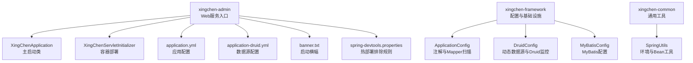
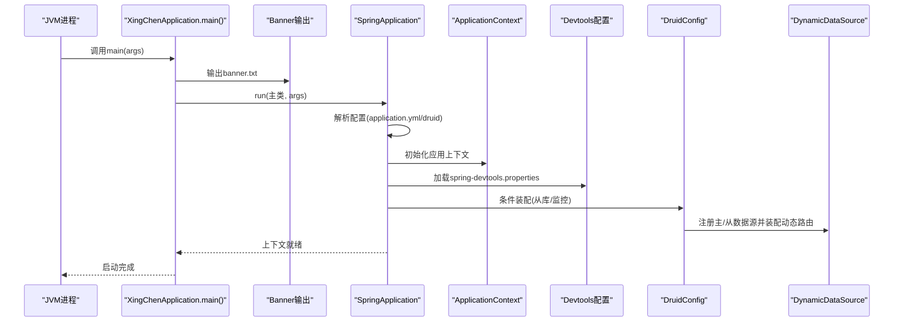
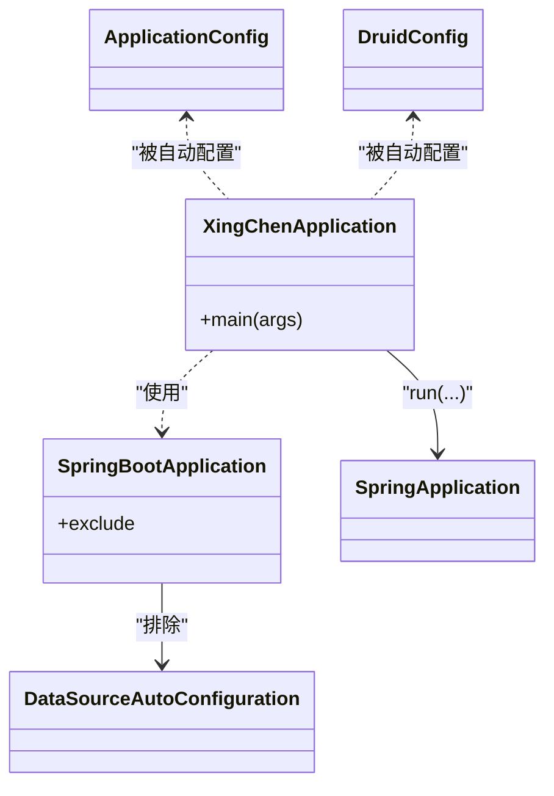
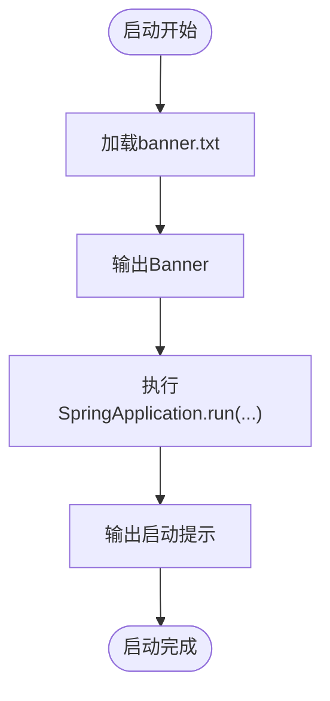
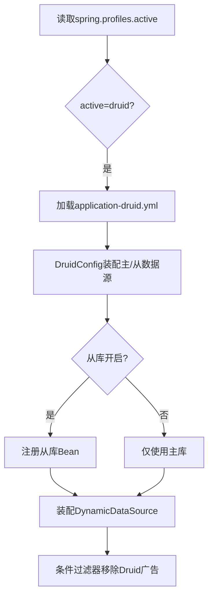
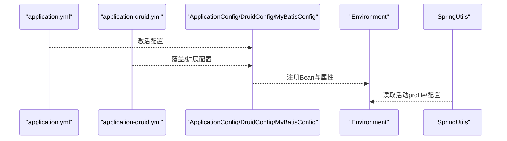
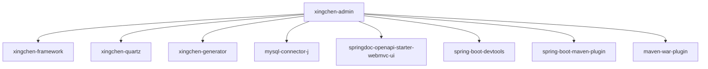

# Spring Boot应用启动

<cite>
**本文引用的文件**   
- [XingChenApplication.java](file://XingChen-Vue/xingchen-admin/src/main/java/com/xingchen/XingChenApplication.java)
- [XingChenServletInitializer.java](file://XingChen-Vue/xingchen-admin/src/main/java/com/xingchen/XingChenServletInitializer.java)
- [application.yml](file://XingChen-Vue/xingchen-admin/src/main/resources/application.yml)
- [application-druid.yml](file://XingChen-Vue/xingchen-admin/src/main/resources/application-druid.yml)
- [banner.txt](file://XingChen-Vue/xingchen-admin/src/main/resources/banner.txt)
- [spring-devtools.properties](file://XingChen-Vue/xingchen-admin/src/main/resources/META-INF/spring-devtools.properties)
- [pom.xml](file://XingChen-Vue/xingchen-admin/pom.xml)
- [ApplicationConfig.java](file://XingChen-Vue/xingchen-framework/src/main/java/com/xingchen/framework/config/ApplicationConfig.java)
- [DruidConfig.java](file://XingChen-Vue/xingchen-framework/src/main/java/com/xingchen/framework/config/DruidConfig.java)
- [MyBatisConfig.java](file://XingChen-Vue/xingchen-framework/src/main/java/com/xingchen/framework/config/MyBatisConfig.java)
- [SpringUtils.java](file://XingChen-Vue/xingchen-common/src/main/java/com/xingchen/common/utils/spring/SpringUtils.java)
</cite>

## 目录
1. [简介](#简介)
2. [项目结构](#项目结构)
3. [核心组件](#核心组件)
4. [架构总览](#架构总览)
5. [详细组件分析](#详细组件分析)
6. [依赖分析](#依赖分析)
7. [性能考虑](#性能考虑)
8. [故障排查指南](#故障排查指南)
9. [结论](#结论)
10. [附录](#附录)

## 简介
本文件围绕健康管理系统后端的Spring Boot启动机制展开，重点解析XingChenApplication主启动类的设计原理与启动流程，阐述@SpringBootApplication注解作用、exclude排除数据源自动配置的原因、Banner显示机制、开发工具配置，以及自动配置原理、条件注解使用与应用上下文初始化过程。同时提供启动参数配置、环境变量设置、生产部署注意事项、故障排查与性能优化建议。

## 项目结构
后端采用多模块Maven工程组织，其中xingchen-admin为Web服务入口模块，xingchen-framework提供配置与基础设施，xingchen-common提供通用能力，xingchen-quartz提供定时任务，xingchen-generator提供代码生成等。启动入口位于xingchen-admin模块的XingChenApplication与XingChenServletInitializer。

**图表来源**
- [XingChenApplication.java:1-31](file://XingChen-Vue/xingchen-admin/src/main/java/com/xingchen/XingChenApplication.java#L1-L31)
- [XingChenServletInitializer.java:1-19](file://XingChen-Vue/xingchen-admin/src/main/java/com/xingchen/XingChenServletInitializer.java#L1-L19)
- [application.yml:1-148](file://XingChen-Vue/xingchen-admin/src/main/resources/application.yml#L1-L148)
- [application-druid.yml:1-61](file://XingChen-Vue/xingchen-admin/src/main/resources/application-druid.yml#L1-L61)
- [banner.txt:1-24](file://XingChen-Vue/xingchen-admin/src/main/resources/banner.txt#L1-L24)
- [spring-devtools.properties:1-1](file://XingChen-Vue/xingchen-admin/src/main/resources/META-INF/spring-devtools.properties#L1-L1)
- [ApplicationConfig.java:1-20](file://XingChen-Vue/xingchen-framework/src/main/java/com/xingchen/framework/config/ApplicationConfig.java#L1-L20)
- [DruidConfig.java:1-127](file://XingChen-Vue/xingchen-framework/src/main/java/com/xingchen/framework/config/DruidConfig.java#L1-L127)
- [MyBatisConfig.java:1-37](file://XingChen-Vue/xingchen-framework/src/main/java/com/xingchen/framework/config/MyBatisConfig.java#L1-L37)
- [SpringUtils.java:126-164](file://XingChen-Vue/xingchen-common/src/main/java/com/xingchen/common/utils/spring/SpringUtils.java#L126-L164)

**章节来源**
- [XingChenApplication.java:1-31](file://XingChen-Vue/xingchen-admin/src/main/java/com/xingchen/XingChenApplication.java#L1-L31)
- [XingChenServletInitializer.java:1-19](file://XingChen-Vue/xingchen-admin/src/main/java/com/xingchen/XingChenServletInitializer.java#L1-L19)
- [application.yml:1-148](file://XingChen-Vue/xingchen-admin/src/main/resources/application.yml#L1-L148)
- [application-druid.yml:1-61](file://XingChen-Vue/xingchen-admin/src/main/resources/application-druid.yml#L1-L61)
- [banner.txt:1-24](file://XingChen-Vue/xingchen-admin/src/main/resources/banner.txt#L1-L24)
- [spring-devtools.properties:1-1](file://XingChen-Vue/xingchen-admin/src/main/resources/META-INF/spring-devtools.properties#L1-L1)
- [ApplicationConfig.java:1-20](file://XingChen-Vue/xingchen-framework/src/main/java/com/xingchen/framework/config/ApplicationConfig.java#L1-L20)
- [DruidConfig.java:1-127](file://XingChen-Vue/xingchen-framework/src/main/java/com/xingchen/framework/config/DruidConfig.java#L1-L127)
- [MyBatisConfig.java:1-37](file://XingChen-Vue/xingchen-framework/src/main/java/com/xingchen/framework/config/MyBatisConfig.java#L1-L37)
- [SpringUtils.java:126-164](file://XingChen-Vue/xingchen-common/src/main/java/com/xingchen/common/utils/spring/SpringUtils.java#L126-L164)

## 核心组件
- 主启动类：XingChenApplication，使用@SpringBootApplication(exclude = { DataSourceAutoConfiguration.class })显式排除数据源自动配置，结合application-druid.yml与DruidConfig实现自定义数据源与动态数据源。
- 容器部署：XingChenServletInitializer继承SpringBootServletInitializer，用于WAR打包部署到外部Tomcat。
- 配置体系：application.yml集中管理端口、日志、Redis、MyBatis、OpenAPI等；application-druid.yml提供Druid数据源与监控配置；spring-devtools.properties定义热部署排除规则。
- 自动配置与条件注解：ApplicationConfig启用AOP与Mapper扫描；DruidConfig基于ConditionalOnProperty按需加载从库与监控过滤器；MyBatisConfig负责MyBatis会话工厂配置。
- 环境与Bean工具：SpringUtils提供获取活动profile、读取配置属性与获取Bean的能力。

**章节来源**
- [XingChenApplication.java:12-18](file://XingChen-Vue/xingchen-admin/src/main/java/com/xingchen/XingChenApplication.java#L12-L18)
- [XingChenServletInitializer.java:11-17](file://XingChen-Vue/xingchen-admin/src/main/java/com/xingchen/XingChenServletInitializer.java#L11-L17)
- [application.yml:48-148](file://XingChen-Vue/xingchen-admin/src/main/resources/application.yml#L48-L148)
- [application-druid.yml:1-61](file://XingChen-Vue/xingchen-admin/src/main/resources/application-druid.yml#L1-L61)
- [spring-devtools.properties:1-1](file://XingChen-Vue/xingchen-admin/src/main/resources/META-INF/spring-devtools.properties#L1-L1)
- [ApplicationConfig.java:12-19](file://XingChen-Vue/xingchen-framework/src/main/java/com/xingchen/framework/config/ApplicationConfig.java#L12-L19)
- [DruidConfig.java:32-127](file://XingChen-Vue/xingchen-framework/src/main/java/com/xingchen/framework/config/DruidConfig.java#L32-L127)
- [MyBatisConfig.java:32-37](file://XingChen-Vue/xingchen-framework/src/main/java/com/xingchen/framework/config/MyBatisConfig.java#L32-L37)
- [SpringUtils.java:137-164](file://XingChen-Vue/xingchen-common/src/main/java/com/xingchen/common/utils/spring/SpringUtils.java#L137-L164)

## 架构总览
下图展示从JVM启动到应用上下文完成初始化的关键步骤，涵盖Banner输出、配置加载、自动配置与条件装配、数据源与动态数据源装配、以及容器部署路径。

**图表来源**
- [XingChenApplication.java:15-28](file://XingChen-Vue/xingchen-admin/src/main/java/com/xingchen/XingChenApplication.java#L15-L28)
- [banner.txt:1-24](file://XingChen-Vue/xingchen-admin/src/main/resources/banner.txt#L1-L24)
- [application.yml:48-148](file://XingChen-Vue/xingchen-admin/src/main/resources/application.yml#L48-L148)
- [application-druid.yml:1-61](file://XingChen-Vue/xingchen-admin/src/main/resources/application-druid.yml#L1-L61)
- [spring-devtools.properties:1-1](file://XingChen-Vue/xingchen-admin/src/main/resources/META-INF/spring-devtools.properties#L1-L1)
- [DruidConfig.java:32-79](file://XingChen-Vue/xingchen-framework/src/main/java/com/xingchen/framework/config/DruidConfig.java#L32-L79)

## 详细组件分析

### 主启动类与@SpringBootApplication注解
- 设计要点
  - 使用@SpringBootApplication(exclude = { DataSourceAutoConfiguration.class })显式排除Spring Boot默认数据源自动配置，避免与自定义Druid动态数据源冲突。
  - 在main方法中调用SpringApplication.run，随后输出启动横幅与提示信息。
- 自动配置原理
  - @SpringBootApplication组合了@ComponentScan、@EnableAutoConfiguration与@EnableConfigurationProperties，负责扫描组件与触发自动配置。
  - 排除DataSourceAutoConfiguration后，由DruidConfig与动态数据源装配接管数据源生命周期与监控。
- 条件注解与上下文初始化
  - 条件装配在DruidConfig中体现，如@ConditionalOnProperty控制从库与监控视图的启用。
  - ApplicationConfig启用AOP与Mapper扫描，确保业务切面与持久层接口生效。
- 启动参数与环境变量
  - 可通过命令行传入--spring.profiles.active=druid切换配置文件。
  - 可通过-D或环境变量覆盖配置项，例如server.port、spring.redis.*等。

**图表来源**
- [XingChenApplication.java:12-18](file://XingChen-Vue/xingchen-admin/src/main/java/com/xingchen/XingChenApplication.java#L12-L18)
- [ApplicationConfig.java:12-19](file://XingChen-Vue/xingchen-framework/src/main/java/com/xingchen/framework/config/ApplicationConfig.java#L12-L19)
- [DruidConfig.java:32-79](file://XingChen-Vue/xingchen-framework/src/main/java/com/xingchen/framework/config/DruidConfig.java#L32-L79)

**章节来源**
- [XingChenApplication.java:12-28](file://XingChen-Vue/xingchen-admin/src/main/java/com/xingchen/XingChenApplication.java#L12-L28)
- [ApplicationConfig.java:12-19](file://XingChen-Vue/xingchen-framework/src/main/java/com/xingchen/framework/config/ApplicationConfig.java#L12-L19)
- [DruidConfig.java:32-79](file://XingChen-Vue/xingchen-framework/src/main/java/com/xingchen/framework/config/DruidConfig.java#L32-L79)

### Banner显示机制
- Banner文件位置与内容
  - 位于resources/banner.txt，支持占位符如${xingchen.version}、${spring-boot.version}。
- 显示时机
  - 在SpringApplication.run之前输出，作为启动成功的第一反馈。
- 自定义提示
  - 启动完成后打印ASCII艺术提示，增强可读性与品牌感。

**图表来源**
- [XingChenApplication.java:17-28](file://XingChen-Vue/xingchen-admin/src/main/java/com/xingchen/XingChenApplication.java#L17-L28)
- [banner.txt:1-24](file://XingChen-Vue/xingchen-admin/src/main/resources/banner.txt#L1-L24)

**章节来源**
- [XingChenApplication.java:17-28](file://XingChen-Vue/xingchen-admin/src/main/java/com/xingchen/XingChenApplication.java#L17-L28)
- [banner.txt:1-24](file://XingChen-Vue/xingchen-admin/src/main/resources/banner.txt#L1-L24)

### 开发工具配置（Devtools）
- spring-devtools.properties
  - 通过restart.include.json=/com.alibaba.fastjson2.*.jar将特定依赖纳入重启扫描范围，避免热部署误判。
- application.yml中的devtools开关
  - spring.devtools.restart.enabled: true启用热部署，便于开发调试。
- 实践建议
  - 生产环境建议关闭热部署，避免不必要的开销与安全风险。

**章节来源**
- [spring-devtools.properties:1-1](file://XingChen-Vue/xingchen-admin/src/main/resources/META-INF/spring-devtools.properties#L1-L1)
- [application.yml:67-70](file://XingChen-Vue/xingchen-admin/src/main/resources/application.yml#L67-L70)

### 自动配置原理与条件注解
- 自动配置触发
  - application.yml中spring.profiles.active: druid激活druid配置文件，配合DruidConfig按需装配数据源与监控。
- 条件注解使用
  - @ConditionalOnProperty用于根据配置开关决定Bean创建，如从库启用、监控视图启用。
  - @ConfigurationProperties绑定配置前缀，简化配置注入。
- 动态数据源装配
  - 通过setDataSource方法尝试注入从库Bean，若不存在则忽略，保证主库可用性。

**图表来源**
- [application.yml:54-55](file://XingChen-Vue/xingchen-admin/src/main/resources/application.yml#L54-L55)
- [application-druid.yml:1-61](file://XingChen-Vue/xingchen-admin/src/main/resources/application-druid.yml#L1-L61)
- [DruidConfig.java:32-127](file://XingChen-Vue/xingchen-framework/src/main/java/com/xingchen/framework/config/DruidConfig.java#L32-L127)

**章节来源**
- [application.yml:54-55](file://XingChen-Vue/xingchen-admin/src/main/resources/application.yml#L54-L55)
- [application-druid.yml:1-61](file://XingChen-Vue/xingchen-admin/src/main/resources/application-druid.yml#L1-L61)
- [DruidConfig.java:32-127](file://XingChen-Vue/xingchen-framework/src/main/java/com/xingchen/framework/config/DruidConfig.java#L32-L127)

### 应用上下文初始化过程
- 配置加载顺序
  - 优先加载application.yml，再根据profiles加载application-druid.yml。
  - 读取banner.txt并输出启动横幅。
- Bean装配
  - ApplicationConfig启用AOP与Mapper扫描。
  - DruidConfig按条件装配数据源与监控过滤器。
  - MyBatisConfig负责MyBatis会话工厂与扫描路径。
- 环境与Bean工具
  - SpringUtils提供获取活动profile、读取配置属性与获取Bean的能力，便于运行期动态决策。

**图表来源**
- [application.yml:48-148](file://XingChen-Vue/xingchen-admin/src/main/resources/application.yml#L48-L148)
- [application-druid.yml:1-61](file://XingChen-Vue/xingchen-admin/src/main/resources/application-druid.yml#L1-L61)
- [ApplicationConfig.java:12-19](file://XingChen-Vue/xingchen-framework/src/main/java/com/xingchen/framework/config/ApplicationConfig.java#L12-L19)
- [DruidConfig.java:32-79](file://XingChen-Vue/xingchen-framework/src/main/java/com/xingchen/framework/config/DruidConfig.java#L32-L79)
- [MyBatisConfig.java:32-37](file://XingChen-Vue/xingchen-framework/src/main/java/com/xingchen/framework/config/MyBatisConfig.java#L32-L37)
- [SpringUtils.java:137-164](file://XingChen-Vue/xingchen-common/src/main/java/com/xingchen/common/utils/spring/SpringUtils.java#L137-L164)

**章节来源**
- [application.yml:48-148](file://XingChen-Vue/xingchen-admin/src/main/resources/application.yml#L48-L148)
- [application-druid.yml:1-61](file://XingChen-Vue/xingchen-admin/src/main/resources/application-druid.yml#L1-L61)
- [ApplicationConfig.java:12-19](file://XingChen-Vue/xingchen-framework/src/main/java/com/xingchen/framework/config/ApplicationConfig.java#L12-L19)
- [DruidConfig.java:32-79](file://XingChen-Vue/xingchen-framework/src/main/java/com/xingchen/framework/config/DruidConfig.java#L32-L79)
- [MyBatisConfig.java:32-37](file://XingChen-Vue/xingchen-framework/src/main/java/com/xingchen/framework/config/MyBatisConfig.java#L32-L37)
- [SpringUtils.java:137-164](file://XingChen-Vue/xingchen-common/src/main/java/com/xingchen/common/utils/spring/SpringUtils.java#L137-L164)

### 启动参数、环境变量与生产部署
- 启动参数
  - --spring.profiles.active=druid：激活Druid数据源与监控配置。
  - --server.port=8080：指定端口。
  - --spring.devtools.restart.enabled=false：生产关闭热部署。
- 环境变量
  - 可通过环境变量覆盖spring.redis.host、spring.redis.port、spring.datasource.druid.master.url等。
- 生产部署注意事项
  - 关闭devtools热部署，避免内存泄漏与安全风险。
  - 确认application-druid.yml中的数据库账号密码与URL正确。
  - 使用容器或系统服务管理进程，配合xc.sh/status/restart脚本进行运维。

**章节来源**
- [application.yml:54-55](file://XingChen-Vue/xingchen-admin/src/main/resources/application.yml#L54-L55)
- [application.yml:67-70](file://XingChen-Vue/xingchen-admin/src/main/resources/application.yml#L67-L70)
- [application.yml:74-93](file://XingChen-Vue/xingchen-admin/src/main/resources/application.yml#L74-L93)
- [application-druid.yml:8-11](file://XingChen-Vue/xingchen-admin/src/main/resources/application-druid.yml#L8-L11)

## 依赖分析
- 模块依赖
  - xingchen-admin依赖xingchen-framework、xingchen-quartz、xingchen-generator与MySQL驱动、springdoc等。
  - Maven插件包含spring-boot-maven-plugin与maven-war-plugin，支持JAR/WAR打包与外部Tomcat部署。
- 启动类与配置的耦合
  - XingChenApplication通过排除DataSourceAutoConfiguration与DruidConfig配合，形成清晰的职责边界。
  - ApplicationConfig与MyBatisConfig分别负责AOP/Mapper与ORM配置，降低耦合度。

**图表来源**
- [pom.xml:18-57](file://XingChen-Vue/xingchen-admin/pom.xml#L18-L57)
- [pom.xml:59-86](file://XingChen-Vue/xingchen-admin/pom.xml#L59-L86)

**章节来源**
- [pom.xml:18-57](file://XingChen-Vue/xingchen-admin/pom.xml#L18-L57)
- [pom.xml:59-86](file://XingChen-Vue/xingchen-admin/pom.xml#L59-L86)

## 性能考虑
- 线程池与Tomcat参数
  - application.yml中server.tomcat配置了accept-count、threads.max/min-spare，合理设置可提升高并发下的连接处理能力。
- Redis连接池
  - spring.data.redis.lettuce.pool配置min-idle/max-idle/max-active/max-wait，建议与业务QPS匹配调整。
- Druid监控与慢SQL
  - application-druid.yml开启statViewServlet与stat.filter，结合slow-sql阈值记录慢查询，辅助定位性能瓶颈。
- AOP与Mapper扫描
  - ApplicationConfig启用AOP与MapperScan，确保事务与持久层生效，避免重复扫描带来的额外开销。

**章节来源**
- [application.yml:23-32](file://XingChen-Vue/xingchen-admin/src/main/resources/application.yml#L23-L32)
- [application.yml:84-93](file://XingChen-Vue/xingchen-admin/src/main/resources/application.yml#L84-L93)
- [application-druid.yml:44-57](file://XingChen-Vue/xingchen-admin/src/main/resources/application-druid.yml#L44-L57)
- [ApplicationConfig.java:12-19](file://XingChen-Vue/xingchen-framework/src/main/java/com/xingchen/framework/config/ApplicationConfig.java#L12-L19)

## 故障排查指南
- 启动失败（端口占用）
  - 现象：启动报端口冲突。
  - 处理：修改server.port或释放占用端口。
- 数据源无法连接
  - 现象：应用启动时报数据库连接异常。
  - 处理：检查application-druid.yml中master.url/username/password；确认数据库服务状态；核对防火墙与网络策略。
- Druid监控页面异常
  - 现象：访问/druid路径失败或页面广告未去除。
  - 处理：确认spring.datasource.druid.statViewServlet.enabled与url-pattern配置；检查removeDruidFilterRegistrationBean是否生效。
- 热部署导致内存泄漏
  - 现象：频繁重启后内存增长。
  - 处理：生产关闭spring.devtools.restart.enabled；必要时调整spring-devtools.properties排除规则。
- Profile未生效
  - 现象：配置未按预期加载。
  - 处理：确认--spring.profiles.active参数或spring.profiles.active配置；检查application-druid.yml是否存在。

**章节来源**
- [application.yml:17-19](file://XingChen-Vue/xingchen-admin/src/main/resources/application.yml#L17-L19)
- [application-druid.yml:8-11](file://XingChen-Vue/xingchen-admin/src/main/resources/application-druid.yml#L8-L11)
- [application-druid.yml:44-51](file://XingChen-Vue/xingchen-admin/src/main/resources/application-druid.yml#L44-L51)
- [spring-devtools.properties:1-1](file://XingChen-Vue/xingchen-admin/src/main/resources/META-INF/spring-devtools.properties#L1-L1)
- [application.yml:54-55](file://XingChen-Vue/xingchen-admin/src/main/resources/application.yml#L54-L55)

## 结论
本项目通过@SpringBootApplication(exclude = { DataSourceAutoConfiguration.class })明确排除默认数据源自动配置，结合application-druid.yml与DruidConfig实现可控的数据源与动态路由，辅以条件注解与AOP/Mapper扫描，构建了清晰、可维护且高性能的启动与配置体系。开发阶段利用Devtools提升效率，生产阶段通过合理的配置与监控保障稳定性与可观测性。

## 附录
- 启动流程要点回顾
  - Banner输出与横幅占位符渲染。
  - 配置加载与Profile切换。
  - 条件装配与动态数据源注册。
  - 容器部署与外部Tomcat集成。
- 常用运维脚本
  - 使用xc.sh脚本进行启动/停止/重启/状态查询，便于生产运维。