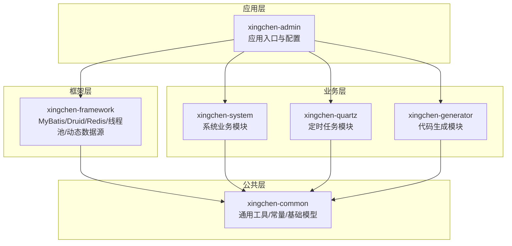
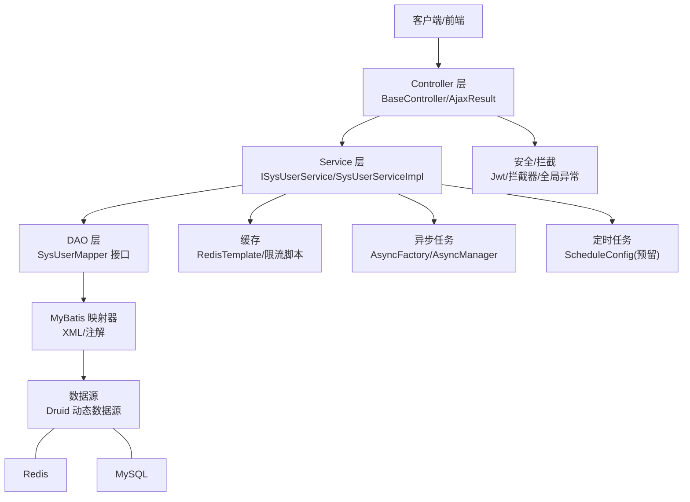
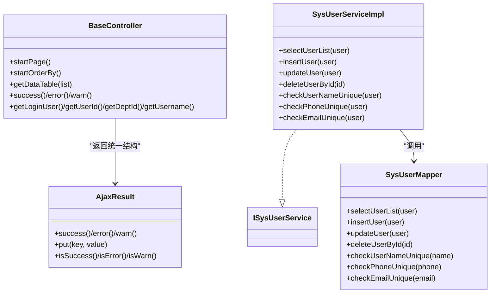
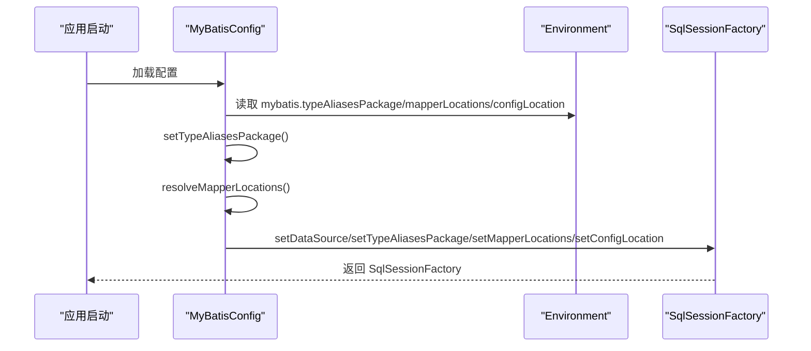
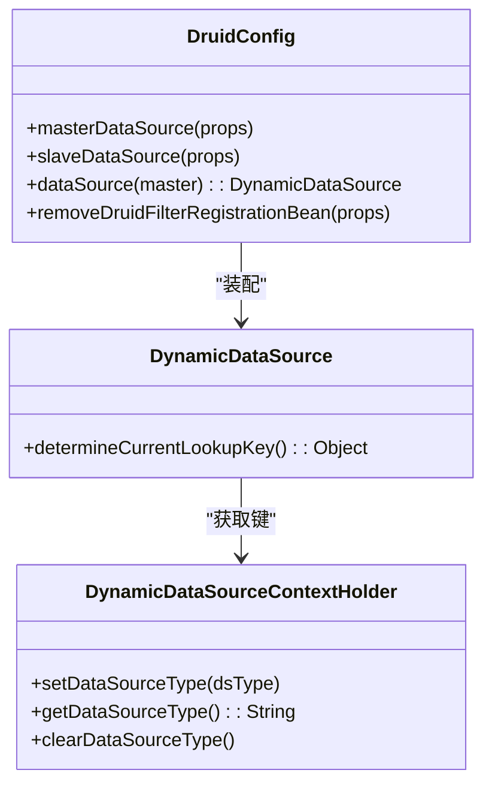
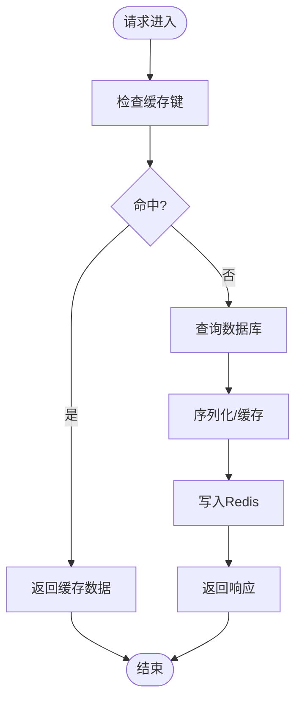
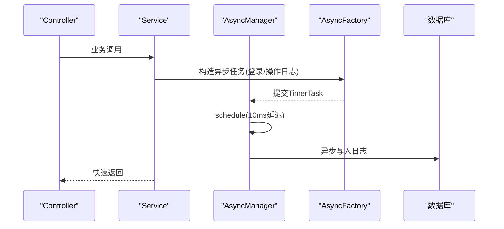
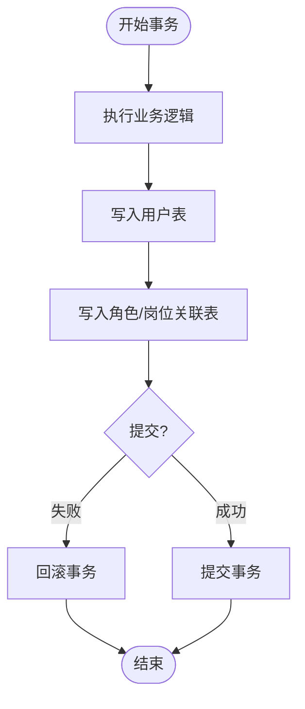
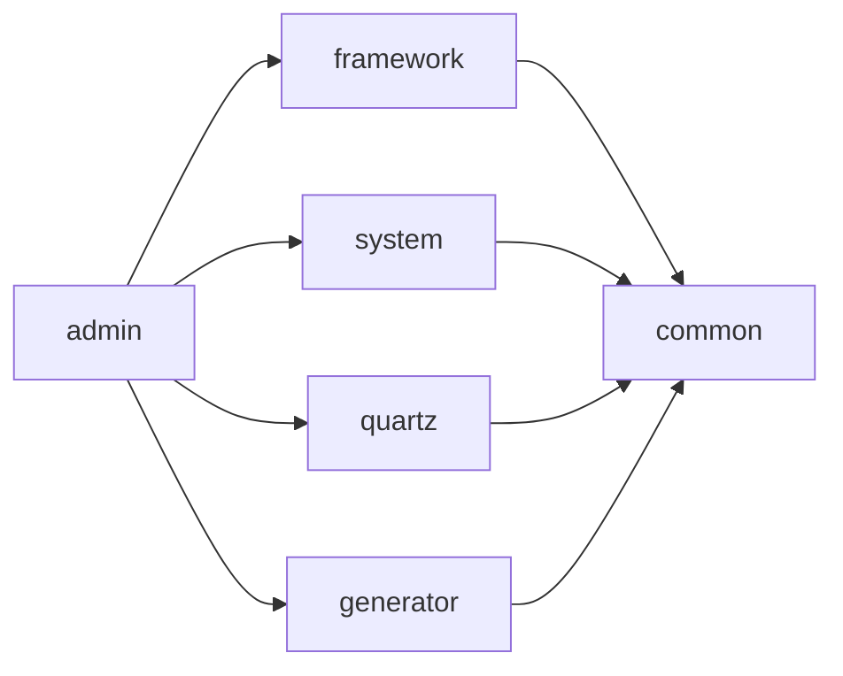

# 后端架构设计

<cite>
**本文引用的文件**
- [application.yml](file://XingChen-Vue/xingchen-admin/src/main/resources/application.yml)
- [application-druid.yml](file://XingChen-Vue/xingchen-admin/src/main/resources/application-druid.yml)
- [mybatis-config.xml](file://XingChen-Vue/xingchen-admin/src/main/resources/mybatis/mybatis-config.xml)
- [MyBatisConfig.java](file://XingChen-Vue/xingchen-framework/src/main/java/com/xingchen/framework/config/MyBatisConfig.java)
- [DruidConfig.java](file://XingChen-Vue/xingchen-framework/src/main/java/com/xingchen/framework/config/DruidConfig.java)
- [RedisConfig.java](file://XingChen-Vue/xingchen-framework/src/main/java/com/xingchen/framework/config/RedisConfig.java)
- [ThreadPoolConfig.java](file://XingChen-Vue/xingchen-framework/src/main/java/com/xingchen/framework/config/ThreadPoolConfig.java)
- [ScheduleConfig.java](file://XingChen-Vue/xingchen-quartz/src/main/java/com/xingchen/quartz/config/ScheduleConfig.java)
- [AsyncFactory.java](file://XingChen-Vue/xingchen-framework/src/main/java/com/xingchen/framework/manager/factory/AsyncFactory.java)
- [AsyncManager.java](file://XingChen-Vue/xingchen-framework/src/main/java/com/xingchen/framework/manager/AsyncManager.java)
- [DynamicDataSource.java](file://XingChen-Vue/xingchen-framework/src/main/java/com/xingchen/framework/datasource/DynamicDataSource.java)
- [DynamicDataSourceContextHolder.java](file://XingChen-Vue/xingchen-framework/src/main/java/com/xingchen/framework/datasource/DynamicDataSourceContextHolder.java)
- [SysUserServiceImpl.java](file://XingChen-Vue/xingchen-system/src/main/java/com/xingchen/system/service/impl/SysUserServiceImpl.java)
- [SysUserMapper.java](file://XingChen-Vue/xingchen-system/src/main/java/com/xingchen/system/mapper/SysUserMapper.java)
- [BaseController.java](file://XingChen-Vue/xingchen-common/src/main/java/com/xingchen/common/core/controller/BaseController.java)
- [AjaxResult.java](file://XingChen-Vue/xingchen-common/src/main/java/com/xingchen/common/core/domain/AjaxResult.java)
</cite>

## 目录
1. [简介](#简介)
2. [项目结构](#项目结构)
3. [核心组件](#核心组件)
4. [架构总览](#架构总览)
5. [详细组件分析](#详细组件分析)
6. [依赖分析](#依赖分析)
7. [性能考虑](#性能考虑)
8. [故障排查指南](#故障排查指南)
9. [结论](#结论)
10. [附录](#附录)

## 简介
本文件面向健康管理系统后端，系统基于Spring Boot构建，采用多模块Maven工程组织，遵循分层架构与MVC设计模式，实现Controller-Service-DAO三层结构。系统集成了MyBatis ORM、Druid数据源与监控、Redis缓存、动态数据源、异步任务与定时任务等能力，覆盖认证鉴权、业务逻辑、数据持久化与性能优化等关键领域。

## 项目结构
系统采用多模块Maven工程，按功能域拆分模块，职责清晰、耦合度低：
- xingchen-admin：应用入口与资源配置，加载各模块配置与启动类
- xingchen-common：通用工具、常量、基础实体、分页模型、异常体系
- xingchen-framework：框架支撑，包含MyBatis配置、Druid数据源、Redis缓存、线程池、动态数据源、安全与拦截器、全局异常等
- xingchen-system：系统业务模块，包含用户、菜单、角色、字典、通知等子域的Mapper/Service/Domain
- xingchen-quartz：定时任务模块，提供Quartz调度配置与任务封装
- xingchen-generator：代码生成模块（用于演示与扩展）

**图表来源**
- [application.yml:1-148](file://XingChen-Vue/xingchen-admin/src/main/resources/application.yml#L1-L148)
- [MyBatisConfig.java:1-132](file://XingChen-Vue/xingchen-framework/src/main/java/com/xingchen/framework/config/MyBatisConfig.java#L1-L132)
- [DruidConfig.java:1-127](file://XingChen-Vue/xingchen-framework/src/main/java/com/xingchen/framework/config/DruidConfig.java#L1-L127)
- [RedisConfig.java:1-71](file://XingChen-Vue/xingchen-framework/src/main/java/com/xingchen/framework/config/RedisConfig.java#L1-L71)
- [ThreadPoolConfig.java:1-64](file://XingChen-Vue/xingchen-framework/src/main/java/com/xingchen/framework/config/ThreadPoolConfig.java#L1-L64)
- [SysUserServiceImpl.java:1-566](file://XingChen-Vue/xingchen-system/src/main/java/com/xingchen/system/service/impl/SysUserServiceImpl.java#L1-L566)

**章节来源**
- [application.yml:1-148](file://XingChen-Vue/xingchen-admin/src/main/resources/application.yml#L1-L148)

## 核心组件
- 分层架构与MVC
  - Controller层：统一输出AjaxResult，封装分页与排序，继承BaseController
  - Service层：业务编排与事务控制，面向接口编程
  - DAO层：MyBatis Mapper接口，负责数据访问
- 配置中心
  - application.yml集中管理服务端口、日志、MyBatis、PageHelper、Swagger、Redis、Token等
  - application-druid.yml集中管理Druid数据源与监控
- ORM与数据源
  - MyBatisConfig动态扫描别名与Mapper XML，结合mybatis-config.xml设置全局参数
  - DruidConfig提供主从数据源与动态数据源路由
- 缓存与限流
  - RedisConfig配置RedisTemplate与限流脚本
- 并发与调度
  - ThreadPoolConfig提供线程池与调度线程池
  - AsyncFactory/AsyncManager封装异步日志与操作记录
  - ScheduleConfig预留Quartz集群配置（当前注释）
- 安全与拦截
  - 框架层提供安全上下文、拦截器与全局异常处理

**章节来源**
- [BaseController.java:1-203](file://XingChen-Vue/xingchen-common/src/main/java/com/xingchen/common/core/controller/BaseController.java#L1-L203)
- [AjaxResult.java:1-217](file://XingChen-Vue/xingchen-common/src/main/java/com/xingchen/common/core/domain/AjaxResult.java#L1-L217)
- [MyBatisConfig.java:1-132](file://XingChen-Vue/xingchen-framework/src/main/java/com/xingchen/framework/config/MyBatisConfig.java#L1-L132)
- [mybatis-config.xml:1-21](file://XingChen-Vue/xingchen-admin/src/main/resources/mybatis/mybatis-config.xml#L1-L21)
- [DruidConfig.java:1-127](file://XingChen-Vue/xingchen-framework/src/main/java/com/xingchen/framework/config/DruidConfig.java#L1-L127)
- [RedisConfig.java:1-71](file://XingChen-Vue/xingchen-framework/src/main/java/com/xingchen/framework/config/RedisConfig.java#L1-L71)
- [ThreadPoolConfig.java:1-64](file://XingChen-Vue/xingchen-framework/src/main/java/com/xingchen/framework/config/ThreadPoolConfig.java#L1-L64)
- [AsyncFactory.java:1-103](file://XingChen-Vue/xingchen-framework/src/main/java/com/xingchen/framework/manager/factory/AsyncFactory.java#L1-L103)
- [AsyncManager.java:1-56](file://XingChen-Vue/xingchen-framework/src/main/java/com/xingchen/framework/manager/AsyncManager.java#L1-L56)
- [ScheduleConfig.java:1-58](file://XingChen-Vue/xingchen-quartz/src/main/java/com/xingchen/quartz/config/ScheduleConfig.java#L1-L58)

## 架构总览
系统采用“控制器-服务-数据访问”三层结构与MVC模式，配合框架层的ORM、数据源、缓存、并发与安全能力，形成高内聚、低耦合的后端架构。

**图表来源**
- [BaseController.java:1-203](file://XingChen-Vue/xingchen-common/src/main/java/com/xingchen/common/core/controller/BaseController.java#L1-L203)
- [SysUserServiceImpl.java:1-566](file://XingChen-Vue/xingchen-system/src/main/java/com/xingchen/system/service/impl/SysUserServiceImpl.java#L1-L566)
- [SysUserMapper.java:1-148](file://XingChen-Vue/xingchen-system/src/main/java/com/xingchen/system/mapper/SysUserMapper.java#L1-L148)
- [MyBatisConfig.java:1-132](file://XingChen-Vue/xingchen-framework/src/main/java/com/xingchen/framework/config/MyBatisConfig.java#L1-L132)
- [DruidConfig.java:1-127](file://XingChen-Vue/xingchen-framework/src/main/java/com/xingchen/framework/config/DruidConfig.java#L1-L127)
- [RedisConfig.java:1-71](file://XingChen-Vue/xingchen-framework/src/main/java/com/xingchen/framework/config/RedisConfig.java#L1-L71)
- [AsyncFactory.java:1-103](file://XingChen-Vue/xingchen-framework/src/main/java/com/xingchen/framework/manager/factory/AsyncFactory.java#L1-L103)
- [AsyncManager.java:1-56](file://XingChen-Vue/xingchen-framework/src/main/java/com/xingchen/framework/manager/AsyncManager.java#L1-L56)
- [ScheduleConfig.java:1-58](file://XingChen-Vue/xingchen-quartz/src/main/java/com/xingchen/quartz/config/ScheduleConfig.java#L1-L58)

## 详细组件分析

### 分层架构与MVC
- 控制器层
  - BaseController统一处理分页、排序、参数绑定与统一响应
  - AjaxResult标准化返回结构，便于前后端对接
- 服务层
  - SysUserServiceImpl实现用户相关业务，使用@Transactional声明事务边界
  - 通过Mapper接口完成数据读写，避免直接操作数据库
- DAO层
  - SysUserMapper定义用户相关查询与变更方法，交由MyBatis映射执行

**图表来源**
- [BaseController.java:1-203](file://XingChen-Vue/xingchen-common/src/main/java/com/xingchen/common/core/controller/BaseController.java#L1-L203)
- [AjaxResult.java:1-217](file://XingChen-Vue/xingchen-common/src/main/java/com/xingchen/common/core/domain/AjaxResult.java#L1-L217)
- [SysUserServiceImpl.java:1-566](file://XingChen-Vue/xingchen-system/src/main/java/com/xingchen/system/service/impl/SysUserServiceImpl.java#L1-L566)
- [SysUserMapper.java:1-148](file://XingChen-Vue/xingchen-system/src/main/java/com/xingchen/system/mapper/SysUserMapper.java#L1-L148)

**章节来源**
- [BaseController.java:1-203](file://XingChen-Vue/xingchen-common/src/main/java/com/xingchen/common/core/controller/BaseController.java#L1-L203)
- [AjaxResult.java:1-217](file://XingChen-Vue/xingchen-common/src/main/java/com/xingchen/common/core/domain/AjaxResult.java#L1-L217)
- [SysUserServiceImpl.java:1-566](file://XingChen-Vue/xingchen-system/src/main/java/com/xingchen/system/service/impl/SysUserServiceImpl.java#L1-L566)
- [SysUserMapper.java:1-148](file://XingChen-Vue/xingchen-system/src/main/java/com/xingchen/system/mapper/SysUserMapper.java#L1-L148)

### ORM与MyBatis配置
- MyBatisConfig
  - 动态解析别名包与Mapper XML路径，支持通配符扫描
  - 通过Environment读取配置，装配SqlSessionFactory
- mybatis-config.xml
  - 全局设置：开启缓存、支持自增主键、默认执行器、日志实现、驼峰映射等

**图表来源**
- [MyBatisConfig.java:1-132](file://XingChen-Vue/xingchen-framework/src/main/java/com/xingchen/framework/config/MyBatisConfig.java#L1-L132)
- [mybatis-config.xml:1-21](file://XingChen-Vue/xingchen-admin/src/main/resources/mybatis/mybatis-config.xml#L1-L21)

**章节来源**
- [MyBatisConfig.java:1-132](file://XingChen-Vue/xingchen-framework/src/main/java/com/xingchen/framework/config/MyBatisConfig.java#L1-L132)
- [mybatis-config.xml:1-21](file://XingChen-Vue/xingchen-admin/src/main/resources/mybatis/mybatis-config.xml#L1-L21)

### Druid数据源与动态数据源
- DruidConfig
  - 从application-druid.yml读取主从数据源配置
  - 构建DynamicDataSource，支持主从切换与运行时动态切换
  - 提供移除监控页广告的过滤器
- DynamicDataSource/DynamicDataSourceContextHolder
  - 通过ThreadLocal维护当前数据源键，实现读写分离与路由

**图表来源**
- [DruidConfig.java:1-127](file://XingChen-Vue/xingchen-framework/src/main/java/com/xingchen/framework/config/DruidConfig.java#L1-L127)
- [DynamicDataSource.java:1-26](file://XingChen-Vue/xingchen-framework/src/main/java/com/xingchen/framework/datasource/DynamicDataSource.java#L1-L26)
- [DynamicDataSourceContextHolder.java:1-46](file://XingChen-Vue/xingchen-framework/src/main/java/com/xingchen/framework/datasource/DynamicDataSourceContextHolder.java#L1-L46)

**章节来源**
- [DruidConfig.java:1-127](file://XingChen-Vue/xingchen-framework/src/main/java/com/xingchen/framework/config/DruidConfig.java#L1-L127)
- [DynamicDataSource.java:1-26](file://XingChen-Vue/xingchen-framework/src/main/java/com/xingchen/framework/datasource/DynamicDataSource.java#L1-L26)
- [DynamicDataSourceContextHolder.java:1-46](file://XingChen-Vue/xingchen-framework/src/main/java/com/xingchen/framework/datasource/DynamicDataSourceContextHolder.java#L1-L46)

### Redis缓存与限流
- RedisConfig
  - 配置RedisTemplate，使用FastJson2序列化
  - 提供限流脚本（Lua），基于Redis实现滑动/计数限流
- 应用场景
  - 业务热点数据缓存、分布式限流、幂等校验等

**图表来源**
- [RedisConfig.java:1-71](file://XingChen-Vue/xingchen-framework/src/main/java/com/xingchen/framework/config/RedisConfig.java#L1-L71)

**章节来源**
- [RedisConfig.java:1-71](file://XingChen-Vue/xingchen-framework/src/main/java/com/xingchen/framework/config/RedisConfig.java#L1-L71)

### 异步任务与定时任务
- 异步任务
  - AsyncManager提供调度入口，延迟10ms执行，避免主线程阻塞
  - AsyncFactory封装登录日志与操作日志的异步记录
- 定时任务
  - ThreadPoolConfig提供调度线程池，CallerRunsPolicy拒绝策略兜底
  - ScheduleConfig预留Quartz集群配置（当前注释），可按需启用

**图表来源**
- [AsyncManager.java:1-56](file://XingChen-Vue/xingchen-framework/src/main/java/com/xingchen/framework/manager/AsyncManager.java#L1-L56)
- [AsyncFactory.java:1-103](file://XingChen-Vue/xingchen-framework/src/main/java/com/xingchen/framework/manager/factory/AsyncFactory.java#L1-L103)
- [ThreadPoolConfig.java:1-64](file://XingChen-Vue/xingchen-framework/src/main/java/com/xingchen/framework/config/ThreadPoolConfig.java#L1-L64)

**章节来源**
- [AsyncManager.java:1-56](file://XingChen-Vue/xingchen-framework/src/main/java/com/xingchen/framework/manager/AsyncManager.java#L1-L56)
- [AsyncFactory.java:1-103](file://XingChen-Vue/xingchen-framework/src/main/java/com/xingchen/framework/manager/factory/AsyncFactory.java#L1-L103)
- [ThreadPoolConfig.java:1-64](file://XingChen-Vue/xingchen-framework/src/main/java/com/xingchen/framework/config/ThreadPoolConfig.java#L1-L64)
- [ScheduleConfig.java:1-58](file://XingChen-Vue/xingchen-quartz/src/main/java/com/xingchen/quartz/config/ScheduleConfig.java#L1-L58)

### 事务管理机制
- 事务边界
  - Service层使用@Transactional标注复杂业务（新增/更新/删除用户及其关联关系）
- 一致性保障
  - 通过声明式事务确保关联表的一致性写入
  - 与动态数据源配合，保证读写分离下的事务一致性

**图表来源**
- [SysUserServiceImpl.java:1-566](file://XingChen-Vue/xingchen-system/src/main/java/com/xingchen/system/service/impl/SysUserServiceImpl.java#L1-L566)

**章节来源**
- [SysUserServiceImpl.java:1-566](file://XingChen-Vue/xingchen-system/src/main/java/com/xingchen/system/service/impl/SysUserServiceImpl.java#L1-L566)

## 依赖分析
- 模块间依赖
  - xingchen-admin依赖framework、system、quartz、generator
  - framework依赖common
  - system依赖common
  - quartz依赖common
  - generator依赖common
- 组件耦合
  - Service对Mapper接口松耦合，便于单元测试与替换实现
  - Controller仅依赖Service接口，保持薄控制器
  - 框架层提供横切能力（缓存、事务、动态数据源、异步、定时），降低业务侵入

**图表来源**
- [application.yml:1-148](file://XingChen-Vue/xingchen-admin/src/main/resources/application.yml#L1-L148)

**章节来源**
- [application.yml:1-148](file://XingChen-Vue/xingchen-admin/src/main/resources/application.yml#L1-L148)

## 性能考虑
- 数据库层
  - 使用Druid连接池与监控，合理设置连接数、空闲与超时参数
  - 动态数据源支持读写分离，提升读性能
- ORM层
  - MyBatis全局设置开启缓存与合适执行器，减少重复查询
  - PageHelper分页插件，避免一次性拉取大量数据
- 缓存层
  - RedisTemplate序列化策略优化，热点数据缓存
  - 限流脚本降低突发流量对数据库冲击
- 并发层
  - 线程池与调度线程池参数调优，拒绝策略兜底
  - 异步日志与操作记录，降低IO阻塞对主流程影响

[本节为通用性能建议，无需特定文件引用]

## 故障排查指南
- 配置问题
  - application.yml与application-druid.yml参数不一致导致连接失败
  - MyBatis别名包或Mapper路径配置错误导致映射失败
- 数据源问题
  - 动态数据源键未设置或切换异常，导致读写错乱
  - Druid监控页面广告无法去除，检查过滤器注册与URL模式
- 缓存问题
  - Redis序列化异常或键空间冲突，检查RedisTemplate配置
  - 限流脚本未生效，核对脚本文本与KEY/ARGV传参
- 异步与定时
  - 异步任务未执行，检查AsyncManager调度与线程池状态
  - 定时任务未触发，确认Quartz配置与集群设置

**章节来源**
- [application.yml:1-148](file://XingChen-Vue/xingchen-admin/src/main/resources/application.yml#L1-L148)
- [application-druid.yml:1-61](file://XingChen-Vue/xingchen-admin/src/main/resources/application-druid.yml#L1-L61)
- [MyBatisConfig.java:1-132](file://XingChen-Vue/xingchen-framework/src/main/java/com/xingchen/framework/config/MyBatisConfig.java#L1-L132)
- [DruidConfig.java:1-127](file://XingChen-Vue/xingchen-framework/src/main/java/com/xingchen/framework/config/DruidConfig.java#L1-L127)
- [RedisConfig.java:1-71](file://XingChen-Vue/xingchen-framework/src/main/java/com/xingchen/framework/config/RedisConfig.java#L1-L71)
- [AsyncManager.java:1-56](file://XingChen-Vue/xingchen-framework/src/main/java/com/xingchen/framework/manager/AsyncManager.java#L1-L56)
- [ScheduleConfig.java:1-58](file://XingChen-Vue/xingchen-quartz/src/main/java/com/xingchen/quartz/config/ScheduleConfig.java#L1-L58)

## 结论
本系统通过清晰的多模块划分与分层架构，结合MyBatis、Druid、Redis、动态数据源、异步与定时任务等能力，实现了高性能、可扩展、易维护的后端架构。建议在生产环境中进一步完善监控与压测、参数化配置与灰度发布策略，持续优化线程池与缓存命中率，确保系统稳定与高可用。

## 附录
- 配置文件要点
  - application.yml：服务端口、Tomcat线程、日志级别、国际化、文件上传、Redis、Token、MyBatis、PageHelper、Swagger、XSS等
  - application-druid.yml：数据源类型、驱动、主从库、连接池参数、监控控制台、慢SQL统计、墙规则
- 最佳实践
  - 控制器只做参数校验与分页，业务逻辑下沉至Service
  - 使用@Transactional明确事务边界，避免跨事务的长耗时操作
  - 合理使用缓存与限流，避免热点Key与缓存穿透
  - 动态数据源切换前先设置键，避免脏读
  - 异步任务仅用于非关键路径日志与报表生成

**章节来源**
- [application.yml:1-148](file://XingChen-Vue/xingchen-admin/src/main/resources/application.yml#L1-L148)
- [application-druid.yml:1-61](file://XingChen-Vue/xingchen-admin/src/main/resources/application-druid.yml#L1-L61)