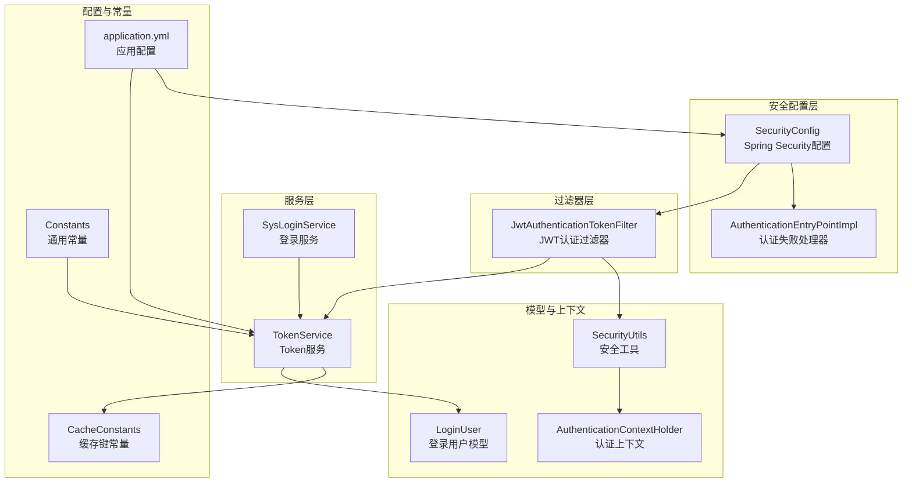
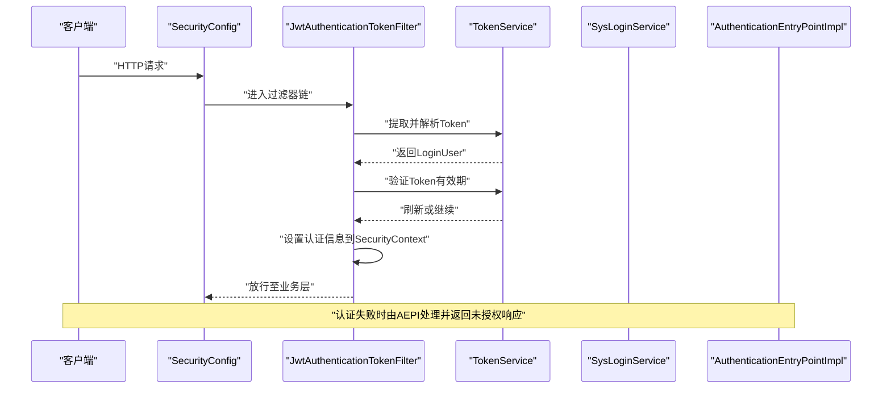
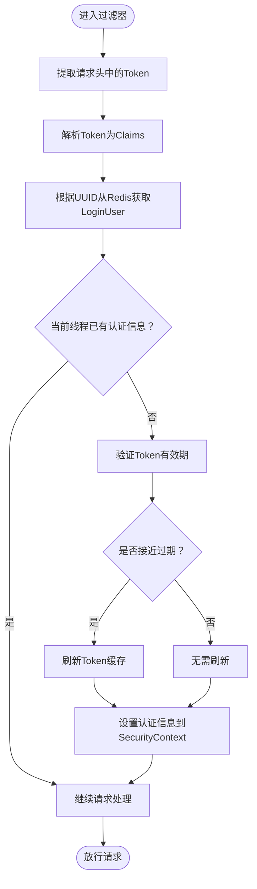
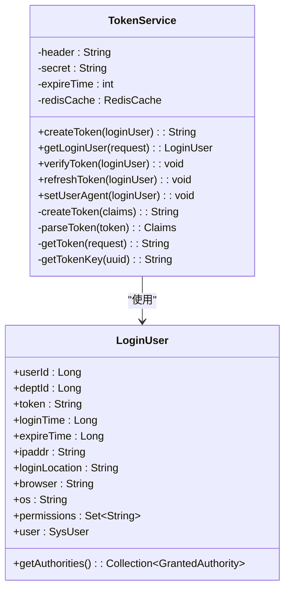
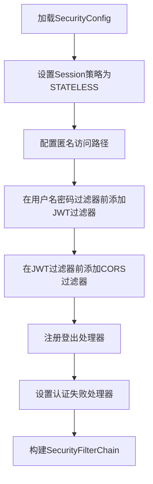
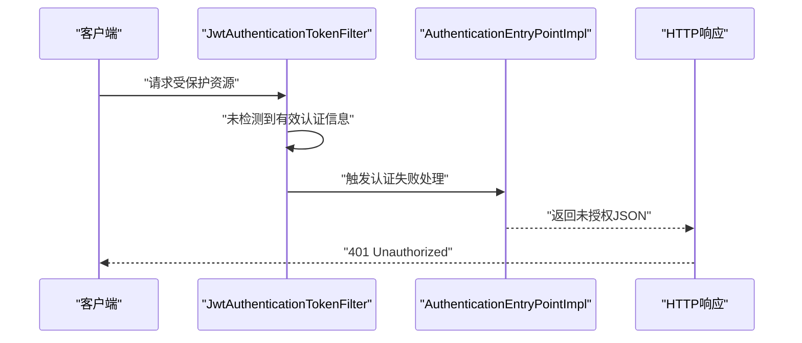
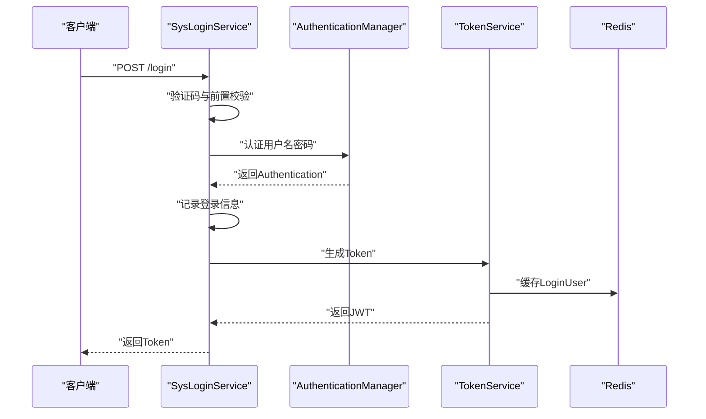
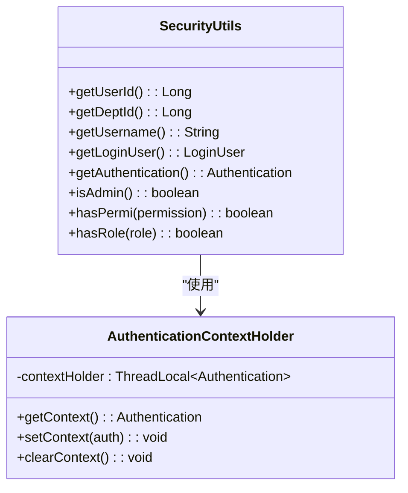
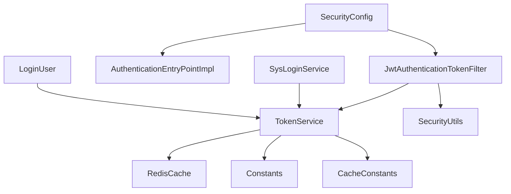

# JWT Token认证机制

<cite>
**本文档引用的文件**
- [JwtAuthenticationTokenFilter.java](file://XingChen-Vue/xingchen-framework/src/main/java/com/xingchen/framework/security/filter/JwtAuthenticationTokenFilter.java)
- [TokenService.java](file://XingChen-Vue/xingchen-framework/src/main/java/com/xingchen/framework/web/service/TokenService.java)
- [SecurityConfig.java](file://XingChen-Vue/xingchen-framework/src/main/java/com/xingchen/framework/config/SecurityConfig.java)
- [AuthenticationEntryPointImpl.java](file://XingChen-Vue/xingchen-framework/src/main/java/com/xingchen/framework/security/handle/AuthenticationEntryPointImpl.java)
- [AuthenticationContextHolder.java](file://XingChen-Vue/xingchen-framework/src/main/java/com/xingchen/framework/security/context/AuthenticationContextHolder.java)
- [SysLoginService.java](file://XingChen-Vue/xingchen-framework/src/main/java/com/xingchen/framework/web/service/SysLoginService.java)
- [Constants.java](file://XingChen-Vue/xingchen-common/src/main/java/com/xingchen/common/constant/Constants.java)
- [CacheConstants.java](file://XingChen-Vue/xingchen-common/src/main/java/com/xingchen/common/constant/CacheConstants.java)
- [LoginUser.java](file://XingChen-Vue/xingchen-common/src/main/java/com/xingchen/common/core/domain/model/LoginUser.java)
- [SecurityUtils.java](file://XingChen-Vue/xingchen-common/src/main/java/com/xingchen/common/utils/SecurityUtils.java)
- [application.yml](file://XingChen-Vue/xingchen-admin/src/main/resources/application.yml)
</cite>

## 目录
1. [简介](#简介)
2. [项目结构](#项目结构)
3. [核心组件](#核心组件)
4. [架构概览](#架构概览)
5. [详细组件分析](#详细组件分析)
6. [依赖关系分析](#依赖关系分析)
7. [性能考虑](#性能考虑)
8. [故障排除指南](#故障排除指南)
9. [结论](#结论)
10. [附录](#附录)

## 简介
本文件详细阐述健康管理系统中的JWT Token认证机制，涵盖Token的生成、验证与刷新流程，TokenService的实现原理，以及JwtAuthenticationTokenFilter的工作机制。文档还解释了Token在请求头中的传递方式、有效期管理、异常处理机制，并提供JWT配置的最佳实践与安全注意事项。

## 项目结构
JWT认证机制涉及后端Spring Security配置、过滤器链、Token服务、用户上下文管理以及相关常量与工具类。整体采用基于Token的无状态认证模式，通过过滤器在每个请求到达业务层之前完成身份验证与授权。

**图表来源**
- [SecurityConfig.java:1-128](file://XingChen-Vue/xingchen-framework/src/main/java/com/xingchen/framework/config/SecurityConfig.java#L1-128)
- [JwtAuthenticationTokenFilter.java:1-45](file://XingChen-Vue/xingchen-framework/src/main/java/com/xingchen/framework/security/filter/JwtAuthenticationTokenFilter.java#L1-45)
- [TokenService.java:1-233](file://XingChen-Vue/xingchen-framework/src/main/java/com/xingchen/framework/web/service/TokenService.java#L1-233)
- [SysLoginService.java:1-177](file://XingChen-Vue/xingchen-framework/src/main/java/com/xingchen/framework/web/service/SysLoginService.java#L1-177)
- [AuthenticationEntryPointImpl.java:1-35](file://XingChen-Vue/xingchen-framework/src/main/java/com/xingchen/framework/security/handle/AuthenticationEntryPointImpl.java#L1-35)
- [AuthenticationContextHolder.java:1-29](file://XingChen-Vue/xingchen-framework/src/main/java/com/xingchen/framework/security/context/AuthenticationContextHolder.java#L1-29)
- [SecurityUtils.java:1-189](file://XingChen-Vue/xingchen-common/src/main/java/com/xingchen/common/utils/SecurityUtils.java#L1-189)
- [application.yml:95-102](file://XingChen-Vue/xingchen-admin/src/main/resources/application.yml#L95-102)
- [Constants.java:100-121](file://XingChen-Vue/xingchen-common/src/main/java/com/xingchen/common/constant/Constants.java#L100-121)
- [CacheConstants.java:10-13](file://XingChen-Vue/xingchen-common/src/main/java/com/xingchen/common/constant/CacheConstants.java#L10-13)

**章节来源**
- [SecurityConfig.java:1-128](file://XingChen-Vue/xingchen-framework/src/main/java/com/xingchen/framework/config/SecurityConfig.java#L1-128)
- [application.yml:95-102](file://XingChen-Vue/xingchen-admin/src/main/resources/application.yml#L95-102)

## 核心组件
- **JwtAuthenticationTokenFilter**：在请求进入业务层前，从请求头提取并验证JWT Token，构建认证信息并注入到Spring Security上下文中。
- **TokenService**：负责Token的生成、解析、验证与刷新，同时维护用户登录信息在Redis中的缓存。
- **SecurityConfig**：配置Spring Security过滤器链，启用无状态会话策略，注册JWT过滤器与跨域过滤器。
- **AuthenticationEntryPointImpl**：处理认证失败场景，返回统一的未授权响应。
- **SysLoginService**：登录流程的核心服务，完成验证码校验、用户认证与Token生成。
- **LoginUser**：封装登录用户的身份信息、权限集合与设备信息等。
- **AuthenticationContextHolder/SecurityUtils**：提供线程本地的认证上下文访问与安全工具方法。
- **Constants/CacheConstants**：定义Token前缀、用户键、缓存键等常量。

**章节来源**
- [JwtAuthenticationTokenFilter.java:1-45](file://XingChen-Vue/xingchen-framework/src/main/java/com/xingchen/framework/security/filter/JwtAuthenticationTokenFilter.java#L1-45)
- [TokenService.java:1-233](file://XingChen-Vue/xingchen-framework/src/main/java/com/xingchen/framework/web/service/TokenService.java#L1-233)
- [SecurityConfig.java:1-128](file://XingChen-Vue/xingchen-framework/src/main/java/com/xingchen/framework/config/SecurityConfig.java#L1-128)
- [AuthenticationEntryPointImpl.java:1-35](file://XingChen-Vue/xingchen-framework/src/main/java/com/xingchen/framework/security/handle/AuthenticationEntryPointImpl.java#L1-35)
- [SysLoginService.java:1-177](file://XingChen-Vue/xingchen-framework/src/main/java/com/xingchen/framework/web/service/SysLoginService.java#L1-177)
- [LoginUser.java:1-279](file://XingChen-Vue/xingchen-common/src/main/java/com/xingchen/common/core/domain/model/LoginUser.java#L1-279)
- [AuthenticationContextHolder.java:1-29](file://XingChen-Vue/xingchen-framework/src/main/java/com/xingchen/framework/security/context/AuthenticationContextHolder.java#L1-29)
- [SecurityUtils.java:1-189](file://XingChen-Vue/xingchen-common/src/main/java/com/xingchen/common/utils/SecurityUtils.java#L1-189)
- [Constants.java:100-121](file://XingChen-Vue/xingchen-common/src/main/java/com/xingchen/common/constant/Constants.java#L100-121)
- [CacheConstants.java:10-13](file://XingChen-Vue/xingchen-common/src/main/java/com/xingchen/common/constant/CacheConstants.java#L10-13)

## 架构概览
JWT认证采用无状态设计，客户端在登录成功后获得JWT Token，后续请求在请求头中携带该Token。过滤器负责提取、解析与验证Token，并将认证信息写入当前线程的安全上下文，供业务层使用。

**图表来源**
- [SecurityConfig.java:90-118](file://XingChen-Vue/xingchen-framework/src/main/java/com/xingchen/framework/config/SecurityConfig.java#L90-118)
- [JwtAuthenticationTokenFilter.java:30-43](file://XingChen-Vue/xingchen-framework/src/main/java/com/xingchen/framework/security/filter/JwtAuthenticationTokenFilter.java#L30-43)
- [TokenService.java:62-83](file://XingChen-Vue/xingchen-framework/src/main/java/com/xingchen/framework/web/service/TokenService.java#L62-83)
- [SysLoginService.java:63-100](file://XingChen-Vue/xingchen-framework/src/main/java/com/xingchen/framework/web/service/SysLoginService.java#L63-100)
- [AuthenticationEntryPointImpl.java:26-33](file://XingChen-Vue/xingchen-framework/src/main/java/com/xingchen/framework/security/handle/AuthenticationEntryPointImpl.java#L26-33)

## 详细组件分析

### JwtAuthenticationTokenFilter工作原理
- **职责**：每请求一次，从请求头提取Token，解析得到LoginUser，若尚未存在认证信息则验证Token并设置认证上下文。
- **关键流程**：
  - 调用TokenService提取并解析Token，获取LoginUser。
  - 若LoginUser非空且当前线程未有认证信息，则调用TokenService验证Token有效期，必要时刷新。
  - 构建UsernamePasswordAuthenticationToken并设置到SecurityContextHolder。
  - 放行至后续过滤器与业务层。

**图表来源**
- [JwtAuthenticationTokenFilter.java:30-43](file://XingChen-Vue/xingchen-framework/src/main/java/com/xingchen/framework/security/filter/JwtAuthenticationTokenFilter.java#L30-43)
- [TokenService.java:62-83](file://XingChen-Vue/xingchen-framework/src/main/java/com/xingchen/framework/web/service/TokenService.java#L62-83)
- [TokenService.java:133-141](file://XingChen-Vue/xingchen-framework/src/main/java/com/xingchen/framework/web/service/TokenService.java#L133-141)

**章节来源**
- [JwtAuthenticationTokenFilter.java:19-44](file://XingChen-Vue/xingchen-framework/src/main/java/com/xingchen/framework/security/filter/JwtAuthenticationTokenFilter.java#L19-44)
- [TokenService.java:62-83](file://XingChen-Vue/xingchen-framework/src/main/java/com/xingchen/framework/web/service/TokenService.java#L62-83)
- [TokenService.java:133-141](file://XingChen-Vue/xingchen-framework/src/main/java/com/xingchen/framework/web/service/TokenService.java#L133-141)

### TokenService实现原理
- **Token生成**：
  - 生成唯一Token标识并填充LoginUser。
  - 设置UA信息（IP、位置、浏览器、操作系统）。
  - 刷新Token缓存，有效期为配置的分钟数。
  - 构造Claims并使用HS512签名生成JWT字符串。
- **Token提取与解析**：
  - 从请求头header中提取Token，去除前缀。
  - 使用secret解析JWT并获取Claims。
  - 从Redis中根据uuid获取LoginUser。
- **Token验证与刷新**：
  - 当距离过期时间小于20分钟时自动刷新缓存。
  - 更新登录时间与过期时间。
- **用户代理信息**：
  - 通过ServletUtils与工具类获取UA、IP、位置、浏览器与操作系统信息。

**图表来源**
- [TokenService.java:32-233](file://XingChen-Vue/xingchen-framework/src/main/java/com/xingchen/framework/web/service/TokenService.java#L32-233)
- [LoginUser.java:19-279](file://XingChen-Vue/xingchen-common/src/main/java/com/xingchen/common/core/domain/model/LoginUser.java#L19-279)

**章节来源**
- [TokenService.java:114-125](file://XingChen-Vue/xingchen-framework/src/main/java/com/xingchen/framework/web/service/TokenService.java#L114-125)
- [TokenService.java:148-155](file://XingChen-Vue/xingchen-framework/src/main/java/com/xingchen/framework/web/service/TokenService.java#L148-155)
- [TokenService.java:178-198](file://XingChen-Vue/xingchen-framework/src/main/java/com/xingchen/framework/web/service/TokenService.java#L178-198)
- [TokenService.java:218-226](file://XingChen-Vue/xingchen-framework/src/main/java/com/xingchen/framework/web/service/TokenService.java#L218-226)
- [TokenService.java:228-231](file://XingChen-Vue/xingchen-framework/src/main/java/com/xingchen/framework/web/service/TokenService.java#L228-231)

### SecurityConfig配置与过滤器链
- **无状态会话**：禁用Session，使用STATELESS策略。
- **匿名访问路径**：配置允许匿名访问的URL与静态资源。
- **过滤器注册**：
  - 在用户名密码过滤器之前添加JWT过滤器。
  - 在JWT过滤器之前添加CORS过滤器。
  - 注册登出处理器。
- **认证失败处理**：设置AuthenticationEntryPointImpl处理未授权。

**图表来源**
- [SecurityConfig.java:90-118](file://XingChen-Vue/xingchen-framework/src/main/java/com/xingchen/framework/config/SecurityConfig.java#L90-118)

**章节来源**
- [SecurityConfig.java:90-118](file://XingChen-Vue/xingchen-framework/src/main/java/com/xingchen/framework/config/SecurityConfig.java#L90-118)

### 认证失败处理与异常机制
- **AuthenticationEntryPointImpl**：当请求需要认证但未提供有效认证信息时，返回统一的未授权响应。
- **异常传播**：登录服务在认证失败时抛出特定异常，由全局异常处理捕获并返回标准格式。

**图表来源**
- [JwtAuthenticationTokenFilter.java:30-43](file://XingChen-Vue/xingchen-framework/src/main/java/com/xingchen/framework/security/filter/JwtAuthenticationTokenFilter.java#L30-43)
- [AuthenticationEntryPointImpl.java:26-33](file://XingChen-Vue/xingchen-framework/src/main/java/com/xingchen/framework/security/handle/AuthenticationEntryPointImpl.java#L26-33)

**章节来源**
- [AuthenticationEntryPointImpl.java:16-35](file://XingChen-Vue/xingchen-framework/src/main/java/com/xingchen/framework/security/handle/AuthenticationEntryPointImpl.java#L16-35)

### 登录流程与Token生成
- **SysLoginService.login**：
  - 验证验证码与前置条件。
  - 使用AuthenticationManager执行用户名密码认证。
  - 记录登录日志与信息。
  - 调用TokenService.createToken生成JWT并返回给客户端。

**图表来源**
- [SysLoginService.java:63-100](file://XingChen-Vue/xingchen-framework/src/main/java/com/xingchen/framework/web/service/SysLoginService.java#L63-100)
- [TokenService.java:114-125](file://XingChen-Vue/xingchen-framework/src/main/java/com/xingchen/framework/web/service/TokenService.java#L114-125)
- [TokenService.java:148-155](file://XingChen-Vue/xingchen-framework/src/main/java/com/xingchen/framework/web/service/TokenService.java#L148-155)

**章节来源**
- [SysLoginService.java:63-100](file://XingChen-Vue/xingchen-framework/src/main/java/com/xingchen/framework/web/service/SysLoginService.java#L63-100)

### Token上下文管理
- **AuthenticationContextHolder**：提供ThreadLocal存储当前线程的Authentication，便于业务层随时获取认证信息。
- **SecurityUtils**：封装获取当前用户、权限、角色等便捷方法，内部通过SecurityContextHolder获取Authentication。

**图表来源**
- [AuthenticationContextHolder.java:10-29](file://XingChen-Vue/xingchen-framework/src/main/java/com/xingchen/framework/security/context/AuthenticationContextHolder.java#L10-29)
- [SecurityUtils.java:21-189](file://XingChen-Vue/xingchen-common/src/main/java/com/xingchen/common/utils/SecurityUtils.java#L21-189)

**章节来源**
- [AuthenticationContextHolder.java:10-29](file://XingChen-Vue/xingchen-framework/src/main/java/com/xingchen/framework/security/context/AuthenticationContextHolder.java#L10-29)
- [SecurityUtils.java:21-189](file://XingChen-Vue/xingchen-common/src/main/java/com/xingchen/common/utils/SecurityUtils.java#L21-189)

## 依赖关系分析
- **过滤器依赖**：JwtAuthenticationTokenFilter依赖TokenService进行Token提取与验证；依赖SecurityUtils判断当前线程是否已有认证信息。
- **服务依赖**：TokenService依赖RedisCache进行用户信息缓存；依赖Constants与CacheConstants进行键值约定；依赖application.yml中的token配置。
- **配置依赖**：SecurityConfig依赖JwtAuthenticationTokenFilter、AuthenticationEntryPointImpl与CorsFilter，配置无状态会话与过滤器顺序。
- **模型依赖**：LoginUser实现UserDetails接口，提供权限集合与用户信息，供认证与授权使用。

**图表来源**
- [JwtAuthenticationTokenFilter.java:17-28](file://XingChen-Vue/xingchen-framework/src/main/java/com/xingchen/framework/security/filter/JwtAuthenticationTokenFilter.java#L17-28)
- [TokenService.java:14-55](file://XingChen-Vue/xingchen-framework/src/main/java/com/xingchen/framework/web/service/TokenService.java#L14-55)
- [SecurityConfig.java:18-47](file://XingChen-Vue/xingchen-framework/src/main/java/com/xingchen/framework/config/SecurityConfig.java#L18-47)
- [SysLoginService.java:39-43](file://XingChen-Vue/xingchen-framework/src/main/java/com/xingchen/framework/web/service/SysLoginService.java#L39-43)
- [LoginUser.java:19-279](file://XingChen-Vue/xingchen-common/src/main/java/com/xingchen/common/core/domain/model/LoginUser.java#L19-279)

**章节来源**
- [JwtAuthenticationTokenFilter.java:17-28](file://XingChen-Vue/xingchen-framework/src/main/java/com/xingchen/framework/security/filter/JwtAuthenticationTokenFilter.java#L17-28)
- [TokenService.java:14-55](file://XingChen-Vue/xingchen-framework/src/main/java/com/xingchen/framework/web/service/TokenService.java#L14-55)
- [SecurityConfig.java:18-47](file://XingChen-Vue/xingchen-framework/src/main/java/com/xingchen/framework/config/SecurityConfig.java#L18-47)
- [SysLoginService.java:39-43](file://XingChen-Vue/xingchen-framework/src/main/java/com/xingchen/framework/web/service/SysLoginService.java#L39-43)
- [LoginUser.java:19-279](file://XingChen-Vue/xingchen-common/src/main/java/com/xingchen/common/core/domain/model/LoginUser.java#L19-279)

## 性能考虑
- **Redis缓存命中**：Token对应的LoginUser存储在Redis中，避免频繁查询数据库，提升Token验证性能。
- **Token有效期与刷新**：接近过期（20分钟内）自动刷新，减少因过期导致的重复登录开销。
- **无状态设计**：禁用Session，降低服务器内存占用，便于水平扩展。
- **过滤器链优化**：将JWT过滤器置于用户名密码过滤器之前，确保每次请求都能快速完成认证。

[本节为通用性能建议，不直接分析具体文件]

## 故障排除指南
- **认证失败（401）**：
  - 检查请求头是否正确携带Token，确认header名称与前缀符合配置。
  - 查看认证失败处理器返回的错误信息，定位具体原因。
- **Token无效或过期**：
  - 确认Token签名算法与密钥一致。
  - 检查Redis中是否存在对应Token的缓存。
- **登录频繁失败**：
  - 核对验证码配置与Redis中的验证码缓存。
  - 检查用户前置校验规则（用户名/密码长度、黑名单IP等）。
- **权限不足（403）**：
  - 检查用户权限集合与目标资源所需权限匹配情况。

**章节来源**
- [AuthenticationEntryPointImpl.java:26-33](file://XingChen-Vue/xingchen-framework/src/main/java/com/xingchen/framework/security/handle/AuthenticationEntryPointImpl.java#L26-33)
- [TokenService.java:62-83](file://XingChen-Vue/xingchen-framework/src/main/java/com/xingchen/framework/web/service/TokenService.java#L62-83)
- [SysLoginService.java:110-129](file://XingChen-Vue/xingchen-framework/src/main/java/com/xingchen/framework/web/service/SysLoginService.java#L110-129)

## 结论
本系统的JWT认证机制通过Spring Security过滤器链与TokenService实现了高效的无状态认证。Token在请求头中以Bearer前缀传递，服务端解析并验证后将认证信息注入上下文，供业务层使用。配合Redis缓存与自动刷新策略，系统在保证安全性的同时兼顾性能与可扩展性。

[本节为总结性内容，不直接分析具体文件]

## 附录

### Token在请求头中的传递方式
- 请求头字段：由配置决定，默认为Authorization。
- Token前缀：固定为Bearer + 空格。
- 提取逻辑：过滤器从请求头读取后去除前缀，仅保留纯Token。

**章节来源**
- [application.yml](file://XingChen-Vue/xingchen-admin/src/main/resources/application.yml#L98)
- [Constants.java:104-106](file://XingChen-Vue/xingchen-common/src/main/java/com/xingchen/common/constant/Constants.java#L104-106)
- [TokenService.java:218-226](file://XingChen-Vue/xingchen-framework/src/main/java/com/xingchen/framework/web/service/TokenService.java#L218-226)

### 有效期管理与刷新策略
- 有效期：由配置项expireTime控制（单位：分钟），默认30分钟。
- 刷新阈值：距离过期时间小于20分钟时自动刷新缓存。
- 刷新动作：更新登录时间与过期时间，并延长Redis缓存有效期。

**章节来源**
- [application.yml:101-102](file://XingChen-Vue/xingchen-admin/src/main/resources/application.yml#L101-102)
- [TokenService.java:133-141](file://XingChen-Vue/xingchen-framework/src/main/java/com/xingchen/framework/web/service/TokenService.java#L133-141)
- [TokenService.java:148-155](file://XingChen-Vue/xingchen-framework/src/main/java/com/xingchen/framework/web/service/TokenService.java#L148-155)

### 安全存储方案
- Redis缓存：Token对应的LoginUser以带过期时间的键值形式存储，键前缀由CacheConstants定义。
- 密钥与算法：使用HS512签名算法与配置的secret进行签名与验证。
- 用户代理信息：记录IP、位置、浏览器与操作系统，便于审计与风控。

**章节来源**
- [CacheConstants.java:10-13](file://XingChen-Vue/xingchen-common/src/main/java/com/xingchen/common/constant/CacheConstants.java#L10-13)
- [TokenService.java:178-198](file://XingChen-Vue/xingchen-framework/src/main/java/com/xingchen/framework/web/service/TokenService.java#L178-198)
- [TokenService.java:162-170](file://XingChen-Vue/xingchen-framework/src/main/java/com/xingchen/framework/web/service/TokenService.java#L162-170)

### JWT配置最佳实践与安全注意事项
- 密钥管理：secret应足够复杂且妥善保管，定期轮换。
- 传输安全：生产环境必须使用HTTPS，防止Token被窃取。
- 有效期设置：根据业务场景合理设置expireTime，平衡用户体验与安全。
- 前缀与头部：保持header名称与前缀一致性，避免混淆。
- 缓存清理：登出或异常情况下及时删除Redis中的用户缓存。
- 审计与监控：记录登录与认证事件，监控异常登录行为。

[本节为通用安全建议，不直接分析具体文件]