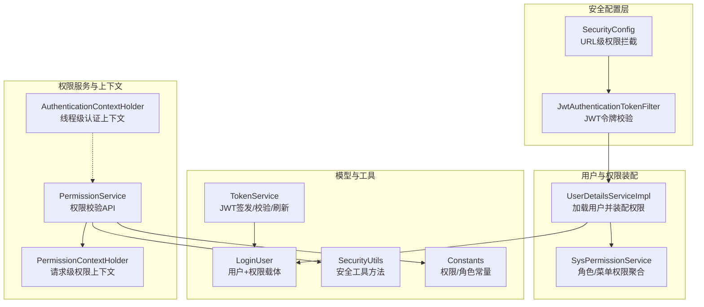
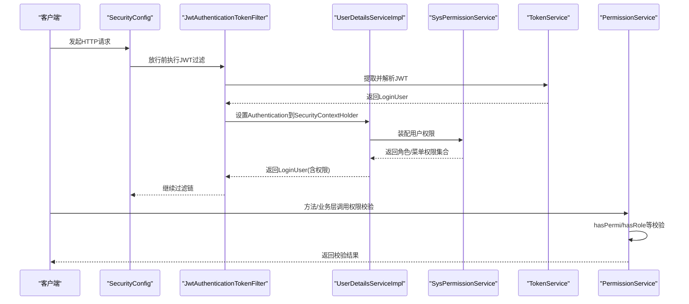
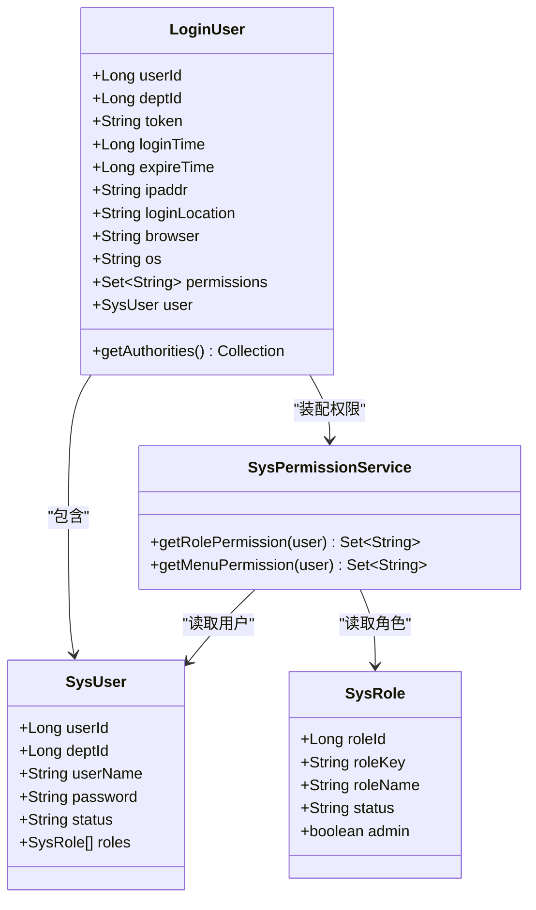
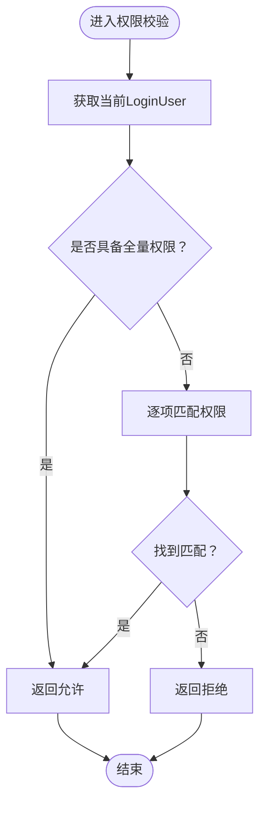
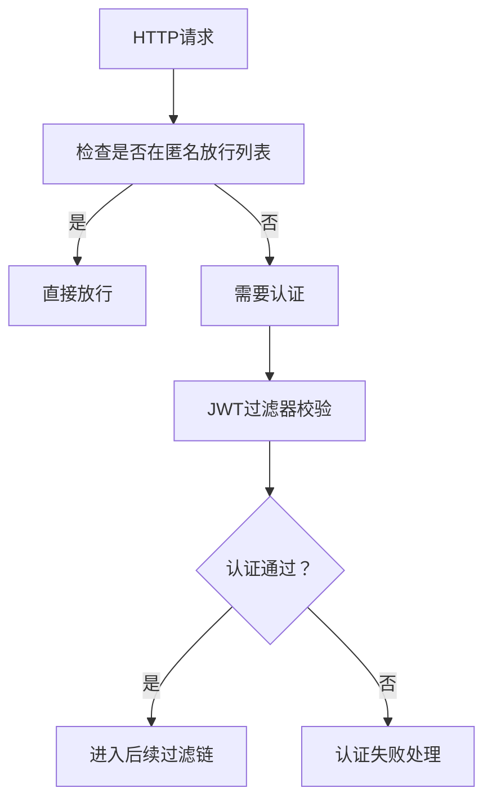
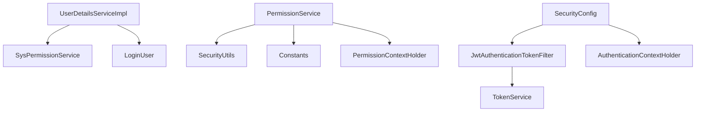

# RBAC权限控制模型

<cite>
**本文引用的文件**
- [AuthenticationContextHolder.java](file://XingChen-Vue/xingchen-framework/src/main/java/com/xingchen/framework/security/context/AuthenticationContextHolder.java)
- [PermissionContextHolder.java](file://XingChen-Vue/xingchen-framework/src/main/java/com/xingchen/framework/security/context/PermissionContextHolder.java)
- [PermissionService.java](file://XingChen-Vue/xingchen-framework/src/main/java/com/xingchen/framework/web/service/PermissionService.java)
- [SysPermissionService.java](file://XingChen-Vue/xingchen-framework/src/main/java/com/xingchen/framework/web/service/SysPermissionService.java)
- [JwtAuthenticationTokenFilter.java](file://XingChen-Vue/xingchen-framework/src/main/java/com/xingchen/framework/security/filter/JwtAuthenticationTokenFilter.java)
- [SecurityConfig.java](file://XingChen-Vue/xingchen-framework/src/main/java/com/xingchen/framework/config/SecurityConfig.java)
- [LoginUser.java](file://XingChen-Vue/xingchen-common/src/main/java/com/xingchen/common/core/domain/model/LoginUser.java)
- [Constants.java](file://XingChen-Vue/xingchen-common/src/main/java/com/xingchen/common/constant/Constants.java)
- [UserDetailsServiceImpl.java](file://XingChen-Vue/xingchen-framework/src/main/java/com/xingchen/framework/web/service/UserDetailsServiceImpl.java)
- [TokenService.java](file://XingChen-Vue/xingchen-framework/src/main/java/com/xingchen/framework/web/service/TokenService.java)
- [SecurityUtils.java](file://XingChen-Vue/xingchen-common/src/main/java/com/xingchen/common/utils/SecurityUtils.java)
</cite>

## 目录
1. [引言](#引言)
2. [项目结构](#项目结构)
3. [核心组件](#核心组件)
4. [架构总览](#架构总览)
5. [详细组件分析](#详细组件分析)
6. [依赖关系分析](#依赖关系分析)
7. [性能考量](#性能考量)
8. [故障排查指南](#故障排查指南)
9. [结论](#结论)
10. [附录](#附录)

## 引言
本文件系统性阐述该健康管理系统中的RBAC（基于角色的权限控制）模型，覆盖用户-角色-权限三层关系设计、权限服务实现机制、权限上下文管理策略、权限验证流程、LoginUser模型中的权限信息结构、权限继承与组合规则、方法级与URL级权限注解与拦截、动态权限配置，以及最佳实践与常见问题解决方案。目标是帮助开发者与运维人员快速理解并正确应用权限体系。

## 项目结构
围绕RBAC的核心模块分布如下：
- 安全配置与过滤链：负责URL级权限拦截、跨域、会话策略等
- JWT认证过滤器：负责从请求中提取并验证令牌，构建认证上下文
- 用户详情加载与权限装配：负责按用户加载角色与菜单权限，组装LoginUser
- 权限服务：提供hasPermi、hasAnyPermi、hasRole、hasAnyRoles等校验能力
- 权限上下文：线程/请求作用域内传递当前校验的权限标识
- 常量与工具：统一权限/角色标识、通配符、分隔符、安全工具方法

图表来源
- [SecurityConfig.java:86-118](file://XingChen-Vue/xingchen-framework/src/main/java/com/xingchen/framework/config/SecurityConfig.java#L86-L118)
- [JwtAuthenticationTokenFilter.java:30-43](file://XingChen-Vue/xingchen-framework/src/main/java/com/xingchen/framework/security/filter/JwtAuthenticationTokenFilter.java#L30-L43)
- [UserDetailsServiceImpl.java:37-65](file://XingChen-Vue/xingchen-framework/src/main/java/com/xingchen/framework/web/service/UserDetailsServiceImpl.java#L37-L65)
- [SysPermissionService.java:37-88](file://XingChen-Vue/xingchen-framework/src/main/java/com/xingchen/framework/web/service/SysPermissionService.java#L37-L88)
- [PermissionService.java:27-146](file://XingChen-Vue/xingchen-framework/src/main/java/com/xingchen/framework/web/service/PermissionService.java#L27-L146)
- [AuthenticationContextHolder.java:14-27](file://XingChen-Vue/xingchen-framework/src/main/java/com/xingchen/framework/security/context/AuthenticationContextHolder.java#L14-L27)
- [PermissionContextHolder.java:16-26](file://XingChen-Vue/xingchen-framework/src/main/java/com/xingchen/framework/security/context/PermissionContextHolder.java#L16-L26)
- [LoginUser.java:245-277](file://XingChen-Vue/xingchen-common/src/main/java/com/xingchen/common/core/domain/model/LoginUser.java#L245-L277)
- [TokenService.java:62-83](file://XingChen-Vue/xingchen-framework/src/main/java/com/xingchen/framework/web/service/TokenService.java#L62-L83)
- [SecurityUtils.java:72-90](file://XingChen-Vue/xingchen-common/src/main/java/com/xingchen/common/utils/SecurityUtils.java#L72-L90)
- [Constants.java:74-91](file://XingChen-Vue/xingchen-common/src/main/java/com/xingchen/common/constant/Constants.java#L74-L91)

章节来源
- [SecurityConfig.java:27-118](file://XingChen-Vue/xingchen-framework/src/main/java/com/xingchen/framework/config/SecurityConfig.java#L27-L118)
- [JwtAuthenticationTokenFilter.java:25-43](file://XingChen-Vue/xingchen-framework/src/main/java/com/xingchen/framework/security/filter/JwtAuthenticationTokenFilter.java#L25-L43)
- [UserDetailsServiceImpl.java:24-65](file://XingChen-Vue/xingchen-framework/src/main/java/com/xingchen/framework/web/service/UserDetailsServiceImpl.java#L24-L65)
- [SysPermissionService.java:23-88](file://XingChen-Vue/xingchen-framework/src/main/java/com/xingchen/framework/web/service/SysPermissionService.java#L23-L88)
- [PermissionService.java:18-146](file://XingChen-Vue/xingchen-framework/src/main/java/com/xingchen/framework/web/service/PermissionService.java#L18-L146)
- [LoginUser.java:19-279](file://XingChen-Vue/xingchen-common/src/main/java/com/xingchen/common/core/domain/model/LoginUser.java#L19-L279)
- [Constants.java:11-205](file://XingChen-Vue/xingchen-common/src/main/java/com/xingchen/common/constant/Constants.java#L11-L205)
- [TokenService.java:31-233](file://XingChen-Vue/xingchen-framework/src/main/java/com/xingchen/framework/web/service/TokenService.java#L31-L233)
- [SecurityUtils.java:21-189](file://XingChen-Vue/xingchen-common/src/main/java/com/xingchen/common/utils/SecurityUtils.java#L21-L189)

## 核心组件
- LoginUser：承载用户基本信息与权限集合，实现Spring Security的UserDetails接口，并将权限转换为GrantedAuthority集合
- SysPermissionService：根据用户角色与菜单服务聚合角色权限与菜单权限，支持管理员“全量权限”
- PermissionService：提供hasPermi、hasAnyPermi、hasRole、hasAnyRoles等校验方法，内部结合Constants常量与SecurityUtils
- SecurityConfig：启用方法级安全注解（@PreAuthorize、@Secured），配置URL级放行与拦截策略
- JwtAuthenticationTokenFilter：从请求头解析JWT，校验并设置Authentication到SecurityContextHolder
- TokenService：JWT签发、解析、刷新与Redis缓存交互
- SecurityUtils：提供获取当前用户、权限匹配、角色判断等便捷方法
- AuthenticationContextHolder/PermissionContextHolder：分别在线程与请求作用域内保存认证与权限上下文

章节来源
- [LoginUser.java:19-279](file://XingChen-Vue/xingchen-common/src/main/java/com/xingchen/common/core/domain/model/LoginUser.java#L19-L279)
- [SysPermissionService.java:23-88](file://XingChen-Vue/xingchen-framework/src/main/java/com/xingchen/framework/web/service/SysPermissionService.java#L23-L88)
- [PermissionService.java:18-146](file://XingChen-Vue/xingchen-framework/src/main/java/com/xingchen/framework/web/service/PermissionService.java#L18-L146)
- [SecurityConfig.java:27-118](file://XingChen-Vue/xingchen-framework/src/main/java/com/xingchen/framework/config/SecurityConfig.java#L27-L118)
- [JwtAuthenticationTokenFilter.java:25-43](file://XingChen-Vue/xingchen-framework/src/main/java/com/xingchen/framework/security/filter/JwtAuthenticationTokenFilter.java#L25-L43)
- [TokenService.java:31-233](file://XingChen-Vue/xingchen-framework/src/main/java/com/xingchen/framework/web/service/TokenService.java#L31-L233)
- [SecurityUtils.java:21-189](file://XingChen-Vue/xingchen-common/src/main/java/com/xingchen/common/utils/SecurityUtils.java#L21-L189)
- [AuthenticationContextHolder.java:10-28](file://XingChen-Vue/xingchen-framework/src/main/java/com/xingchen/framework/security/context/AuthenticationContextHolder.java#L10-L28)
- [PermissionContextHolder.java:12-27](file://XingChen-Vue/xingchen-framework/src/main/java/com/xingchen/framework/security/context/PermissionContextHolder.java#L12-L27)

## 架构总览
下图展示从请求进入至权限校验的关键流程：URL级放行/拦截、JWT解析与认证、权限装配与校验、上下文传递。

图表来源
- [SecurityConfig.java:86-118](file://XingChen-Vue/xingchen-framework/src/main/java/com/xingchen/framework/config/SecurityConfig.java#L86-L118)
- [JwtAuthenticationTokenFilter.java:30-43](file://XingChen-Vue/xingchen-framework/src/main/java/com/xingchen/framework/security/filter/JwtAuthenticationTokenFilter.java#L30-L43)
- [UserDetailsServiceImpl.java:37-65](file://XingChen-Vue/xingchen-framework/src/main/java/com/xingchen/framework/web/service/UserDetailsServiceImpl.java#L37-L65)
- [SysPermissionService.java:37-88](file://XingChen-Vue/xingchen-framework/src/main/java/com/xingchen/framework/web/service/SysPermissionService.java#L37-L88)
- [TokenService.java:62-83](file://XingChen-Vue/xingchen-framework/src/main/java/com/xingchen/framework/web/service/TokenService.java#L62-L83)
- [PermissionService.java:27-146](file://XingChen-Vue/xingchen-framework/src/main/java/com/xingchen/framework/web/service/PermissionService.java#L27-L146)

## 详细组件分析

### LoginUser模型与权限信息结构
- 字段与职责
  - 用户标识与基础信息：userId、deptId、token、loginTime、expireTime、ipaddr、loginLocation、browser、os
  - 权限集合：permissions（Set<String>），用于方法/业务层直接判断
  - 用户实体：user（SysUser），用于角色与扩展信息
- 权限权威集合
  - getAuthorities()将permissions转换为GrantedAuthority集合，供Spring Security内部使用
- 权限继承与组合
  - 管理员角色（超级管理员）在SysPermissionService中被赋予特殊标识，具备全量权限
  - 菜单权限集合由角色权限与用户直接授权合并而成，形成“角色+菜单”的组合权限
- 权限匹配规则
  - 通配符“*:*:*”代表全量权限
  - 使用简单匹配策略支持通配符与精确匹配

图表来源
- [LoginUser.java:19-279](file://XingChen-Vue/xingchen-common/src/main/java/com/xingchen/common/core/domain/model/LoginUser.java#L19-L279)
- [SysPermissionService.java:37-88](file://XingChen-Vue/xingchen-framework/src/main/java/com/xingchen/framework/web/service/SysPermissionService.java#L37-L88)

章节来源
- [LoginUser.java:69-277](file://XingChen-Vue/xingchen-common/src/main/java/com/xingchen/common/core/domain/model/LoginUser.java#L69-L277)
- [SysPermissionService.java:37-88](file://XingChen-Vue/xingchen-framework/src/main/java/com/xingchen/framework/web/service/SysPermissionService.java#L37-L88)
- [Constants.java:74-91](file://XingChen-Vue/xingchen-common/src/main/java/com/xingchen/common/constant/Constants.java#L74-L91)

### 权限服务与上下文管理
- 权限服务（PermissionService）
  - hasPermi：校验是否具备某权限，支持“全量权限”与精确匹配
  - hasAnyPermi：校验是否具备任一权限（逗号分隔）
  - hasRole/hasAnyRoles：校验角色，支持“超级管理员”豁免
  - 内部通过SecurityUtils获取当前LoginUser，结合Constants常量与分隔符进行匹配
- 上下文管理
  - PermissionContextHolder：在请求作用域内设置/获取当前校验的权限标识，便于审计或日志追踪
  - AuthenticationContextHolder：在线程作用域内保存Authentication，供全局安全上下文使用

图表来源
- [PermissionService.java:27-40](file://XingChen-Vue/xingchen-framework/src/main/java/com/xingchen/framework/web/service/PermissionService.java#L27-L40)
- [PermissionService.java:155-158](file://XingChen-Vue/xingchen-framework/src/main/java/com/xingchen/framework/web/service/PermissionService.java#L155-L158)
- [PermissionContextHolder.java:16-26](file://XingChen-Vue/xingchen-framework/src/main/java/com/xingchen/framework/security/context/PermissionContextHolder.java#L16-L26)
- [AuthenticationContextHolder.java:14-27](file://XingChen-Vue/xingchen-framework/src/main/java/com/xingchen/framework/security/context/AuthenticationContextHolder.java#L14-L27)

章节来源
- [PermissionService.java:18-146](file://XingChen-Vue/xingchen-framework/src/main/java/com/xingchen/framework/web/service/PermissionService.java#L18-L146)
- [PermissionContextHolder.java:12-27](file://XingChen-Vue/xingchen-framework/src/main/java/com/xingchen/framework/security/context/PermissionContextHolder.java#L12-L27)
- [AuthenticationContextHolder.java:10-28](file://XingChen-Vue/xingchen-framework/src/main/java/com/xingchen/framework/security/context/AuthenticationContextHolder.java#L10-L28)

### URL级权限拦截与动态配置
- URL放行策略
  - 通过SecurityConfig配置匿名访问的URL集合（如登录、注册、静态资源、Swagger、Druid等）
  - 除放行列表外，其余请求均需认证
- 动态权限配置
  - 通过PermitAllUrlProperties注入URL白名单，实现运行时可配置
  - 结合@EnableMethodSecurity(prePostEnabled=true, securedEnabled=true)，开启方法级注解

图表来源
- [SecurityConfig.java:86-118](file://XingChen-Vue/xingchen-framework/src/main/java/com/xingchen/framework/config/SecurityConfig.java#L86-L118)
- [JwtAuthenticationTokenFilter.java:30-43](file://XingChen-Vue/xingchen-framework/src/main/java/com/xingchen/framework/security/filter/JwtAuthenticationTokenFilter.java#L30-L43)

章节来源
- [SecurityConfig.java:27-118](file://XingChen-Vue/xingchen-framework/src/main/java/com/xingchen/framework/config/SecurityConfig.java#L27-L118)

### 方法级权限注解使用（@PreAuthorize、@Secured）
- 启用注解
  - SecurityConfig中启用@EnableMethodSecurity(prePostEnabled=true, securedEnabled=true)
- 使用场景
  - 控制器或服务层方法上使用@PreAuthorize或@Secured进行细粒度权限控制
  - 结合PermissionService与SecurityUtils提供的hasPermi/hasRole等便捷方法
- 注意事项
  - 确保方法可见性与事务边界符合注解生效条件
  - 在异步或跨线程场景下，注意Authentication与权限上下文的传递

章节来源
- [SecurityConfig.java:27](file://XingChen-Vue/xingchen-framework/src/main/java/com/xingchen/framework/config/SecurityConfig.java#L27-L27)
- [PermissionService.java:27-146](file://XingChen-Vue/xingchen-framework/src/main/java/com/xingchen/framework/web/service/PermissionService.java#L27-L146)
- [SecurityUtils.java:139-186](file://XingChen-Vue/xingchen-common/src/main/java/com/xingchen/common/utils/SecurityUtils.java#L139-L186)

### 权限继承与权限组合规则
- 继承规则
  - 超级管理员角色具备“全量权限”标识，天然满足任何权限校验
  - 多角色用户，其权限为各角色权限与菜单权限的并集
- 组合规则
  - “全量权限”优先于具体权限
  - 通配符“*:*:*”与精确权限同时存在时，视为具备对应权限
  - 角色与菜单权限叠加，形成最终权限集合

章节来源
- [SysPermissionService.java:37-88](file://XingChen-Vue/xingchen-framework/src/main/java/com/xingchen/framework/web/service/SysPermissionService.java#L37-L88)
- [Constants.java:74-91](file://XingChen-Vue/xingchen-common/src/main/java/com/xingchen/common/constant/Constants.java#L74-L91)

## 依赖关系分析
- 组件耦合
  - UserDetailsServiceImpl依赖SysPermissionService与ISysUserService完成用户加载与权限装配
  - PermissionService依赖SecurityUtils、Constants与PermissionContextHolder进行权限校验与上下文记录
  - JwtAuthenticationTokenFilter依赖TokenService解析与验证JWT，并设置Authentication
  - SecurityConfig集中配置URL放行与方法级注解启用
- 外部依赖
  - Spring Security：认证与授权框架
  - Redis：存储LoginUser缓存，支撑JWT离线校验与刷新
  - JWT库：令牌签发与解析

图表来源
- [UserDetailsServiceImpl.java:37-65](file://XingChen-Vue/xingchen-framework/src/main/java/com/xingchen/framework/web/service/UserDetailsServiceImpl.java#L37-L65)
- [SysPermissionService.java:37-88](file://XingChen-Vue/xingchen-framework/src/main/java/com/xingchen/framework/web/service/SysPermissionService.java#L37-L88)
- [PermissionService.java:27-146](file://XingChen-Vue/xingchen-framework/src/main/java/com/xingchen/framework/web/service/PermissionService.java#L27-L146)
- [JwtAuthenticationTokenFilter.java:30-43](file://XingChen-Vue/xingchen-framework/src/main/java/com/xingchen/framework/security/filter/JwtAuthenticationTokenFilter.java#L30-L43)
- [TokenService.java:62-83](file://XingChen-Vue/xingchen-framework/src/main/java/com/xingchen/framework/web/service/TokenService.java#L62-L83)
- [SecurityConfig.java:86-118](file://XingChen-Vue/xingchen-framework/src/main/java/com/xingchen/framework/config/SecurityConfig.java#L86-L118)
- [AuthenticationContextHolder.java:14-27](file://XingChen-Vue/xingchen-framework/src/main/java/com/xingchen/framework/security/context/AuthenticationContextHolder.java#L14-L27)
- [PermissionContextHolder.java:16-26](file://XingChen-Vue/xingchen-framework/src/main/java/com/xingchen/framework/security/context/PermissionContextHolder.java#L16-L26)

章节来源
- [UserDetailsServiceImpl.java:24-65](file://XingChen-Vue/xingchen-framework/src/main/java/com/xingchen/framework/web/service/UserDetailsServiceImpl.java#L24-L65)
- [PermissionService.java:18-146](file://XingChen-Vue/xingchen-framework/src/main/java/com/xingchen/framework/web/service/PermissionService.java#L18-L146)
- [JwtAuthenticationTokenFilter.java:25-43](file://XingChen-Vue/xingchen-framework/src/main/java/com/xingchen/framework/security/filter/JwtAuthenticationTokenFilter.java#L25-L43)
- [SecurityConfig.java:27-118](file://XingChen-Vue/xingchen-framework/src/main/java/com/xingchen/framework/config/SecurityConfig.java#L27-L118)

## 性能考量
- JWT与Redis缓存
  - LoginUser通过Redis缓存，避免频繁查询数据库；Token有效期临近阈值时自动刷新，降低重复签发成本
- 权限匹配优化
  - 使用Set<String>存储权限，contains操作为O(1)；通配符匹配采用简单匹配策略，适合中低复杂度权限树
- 线程与请求上下文
  - AuthenticationContextHolder与PermissionContextHolder减少重复查询与构造开销
- URL拦截
  - 将高频匿名访问路径放入白名单，减少不必要的认证开销

章节来源
- [TokenService.java:133-155](file://XingChen-Vue/xingchen-framework/src/main/java/com/xingchen/framework/web/service/TokenService.java#L133-L155)
- [PermissionService.java:155-158](file://XingChen-Vue/xingchen-framework/src/main/java/com/xingchen/framework/web/service/PermissionService.java#L155-L158)
- [SecurityConfig.java:100-109](file://XingChen-Vue/xingchen-framework/src/main/java/com/xingchen/framework/config/SecurityConfig.java#L100-L109)

## 故障排查指南
- 认证失败
  - 检查JWT过滤器是否正确解析请求头中的令牌前缀与格式
  - 确认TokenService的secret与header配置一致
- 权限校验失败
  - 确认LoginUser的permissions是否正确装配（SysPermissionService）
  - 检查Constants中的全量权限标识与分隔符是否与前端/后端约定一致
- 上下文丢失
  - 确保在多线程/异步场景下正确传递Authentication与权限上下文
- URL拦截异常
  - 检查SecurityConfig中的匿名放行列表与实际请求路径是否匹配
  - 确认@EnableMethodSecurity已启用且注解使用位置正确

章节来源
- [JwtAuthenticationTokenFilter.java:30-43](file://XingChen-Vue/xingchen-framework/src/main/java/com/xingchen/framework/security/filter/JwtAuthenticationTokenFilter.java#L30-L43)
- [TokenService.java:62-83](file://XingChen-Vue/xingchen-framework/src/main/java/com/xingchen/framework/web/service/TokenService.java#L62-L83)
- [SysPermissionService.java:37-88](file://XingChen-Vue/xingchen-framework/src/main/java/com/xingchen/framework/web/service/SysPermissionService.java#L37-L88)
- [Constants.java:74-91](file://XingChen-Vue/xingchen-common/src/main/java/com/xingchen/common/constant/Constants.java#L74-L91)
- [SecurityConfig.java:86-118](file://XingChen-Vue/xingchen-framework/src/main/java/com/xingchen/framework/config/SecurityConfig.java#L86-L118)

## 结论
该RBAC权限模型以LoginUser为核心载体，结合SysPermissionService聚合角色与菜单权限，通过PermissionService提供统一的权限校验API，并借助SecurityConfig与JwtAuthenticationTokenFilter实现URL级与方法级的双重权限控制。配合Redis缓存与上下文管理，整体具备良好的可维护性与性能表现。建议在实际落地中严格遵循权限最小化、通配符谨慎使用、注解位置明确等最佳实践。

## 附录
- 最佳实践
  - 权限最小化：仅授予完成任务所需的最小权限集合
  - 统一分隔符与命名规范：确保PERMISSION_DELIMITER与ROLE_DELIMITER一致
  - 注解与URL双保险：对关键接口同时启用方法级与URL级拦截
  - 异步与跨线程：在异步任务中显式传递Authentication与权限上下文
- 常见问题
  - 令牌过期：通过TokenService的自动刷新机制降低影响
  - 权限不生效：检查LoginUser权限装配与Constants配置
  - URL拦截误伤：核对匿名放行列表与真实路径