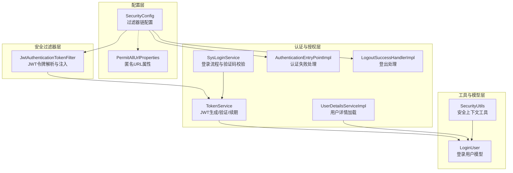
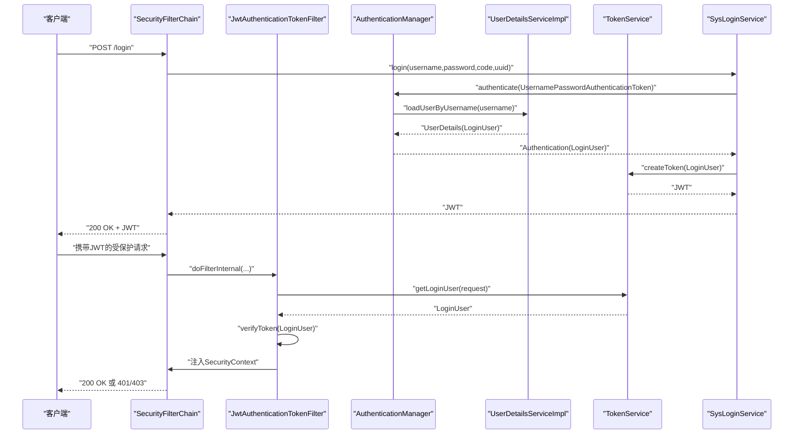
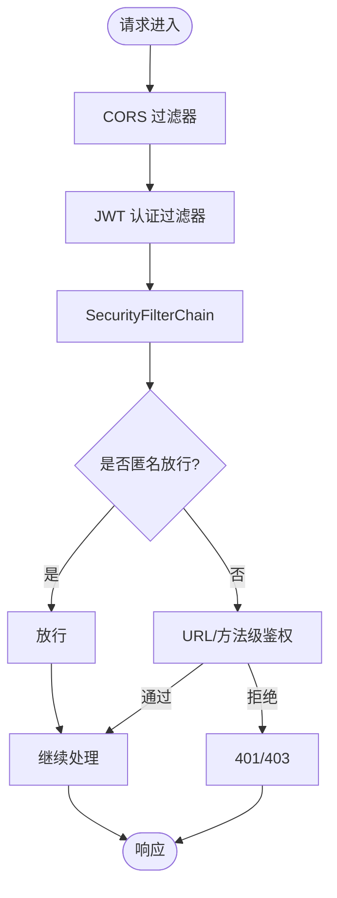
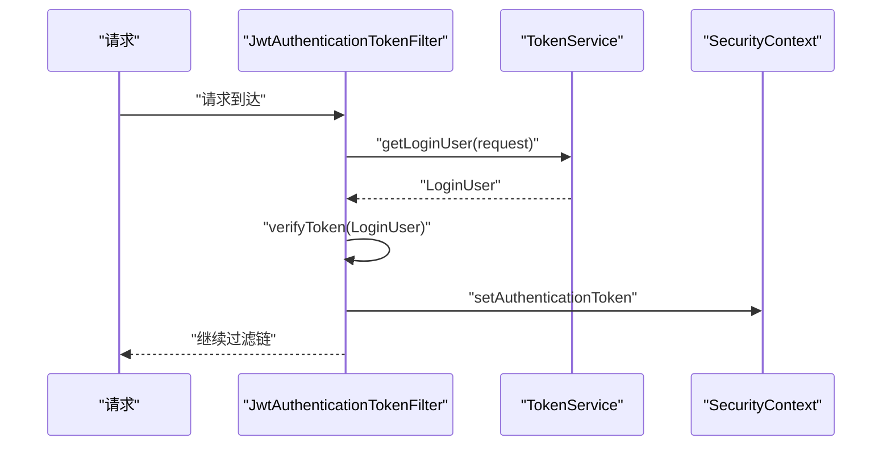
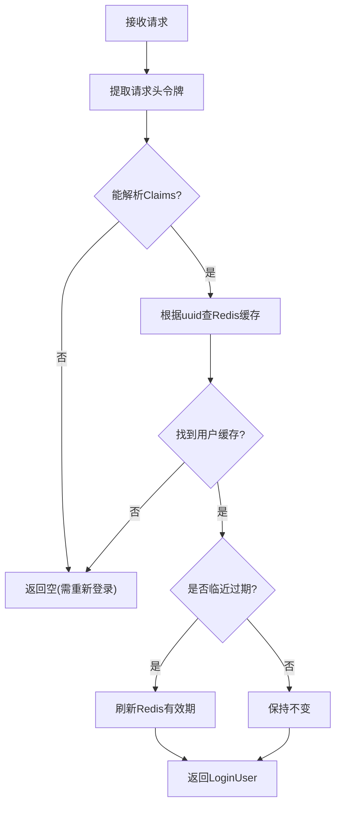
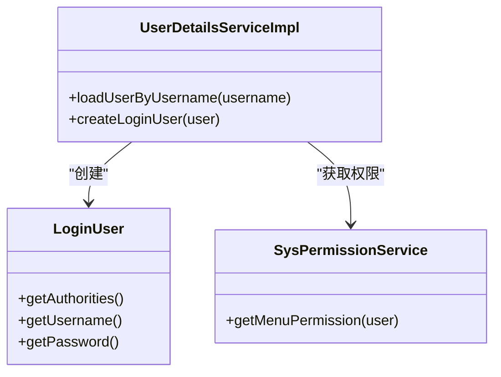
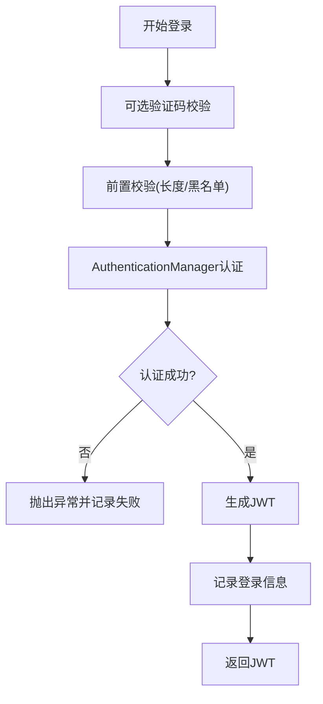
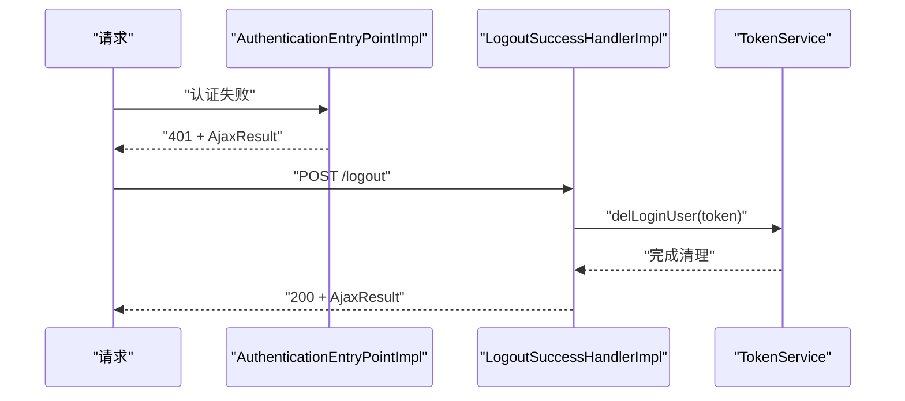
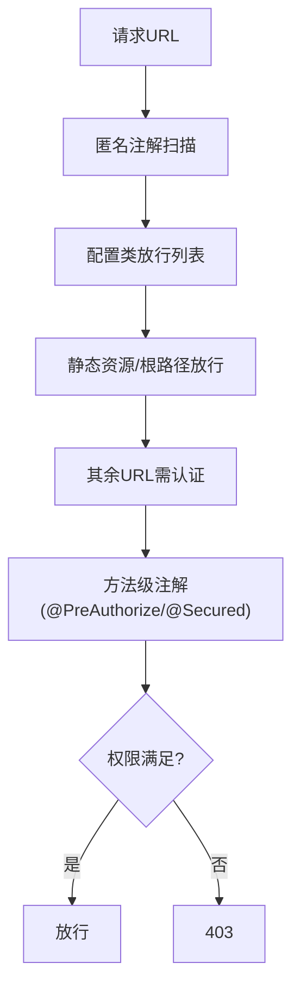
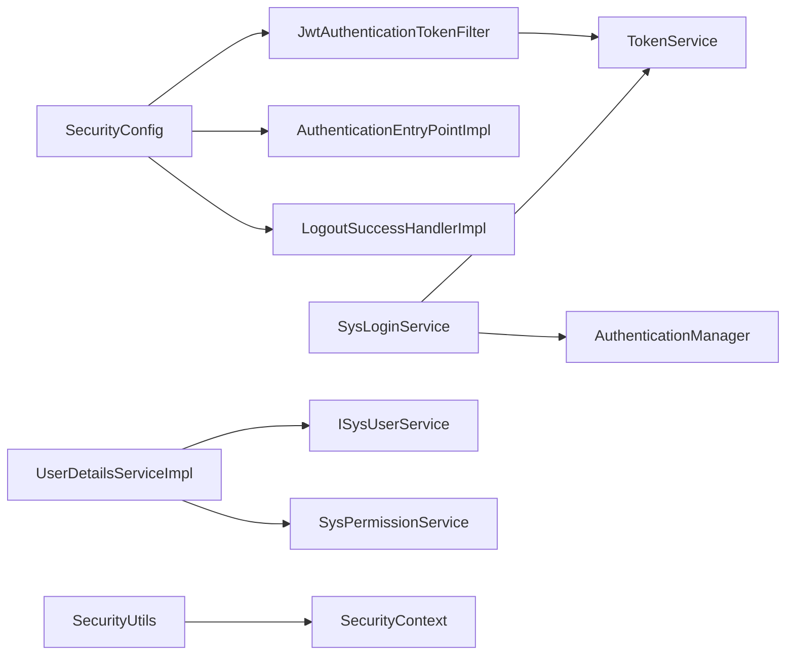

# 安全认证架构

<cite>
**本文引用的文件**
- [SecurityConfig.java](file://XingChen-Vue/xingchen-framework/src/main/java/com/xingchen/framework/config/SecurityConfig.java)
- [JwtAuthenticationTokenFilter.java](file://XingChen-Vue/xingchen-framework/src/main/java/com/xingchen/framework/security/filter/JwtAuthenticationTokenFilter.java)
- [TokenService.java](file://XingChen-Vue/xingchen-framework/src/main/java/com/xingchen/framework/web/service/TokenService.java)
- [UserDetailsServiceImpl.java](file://XingChen-Vue/xingchen-framework/src/main/java/com/xingchen/framework/web/service/UserDetailsServiceImpl.java)
- [SysLoginService.java](file://XingChen-Vue/xingchen-framework/src/main/java/com/xingchen/framework/web/service/SysLoginService.java)
- [AuthenticationEntryPointImpl.java](file://XingChen-Vue/xingchen-framework/src/main/java/com/xingchen/framework/security/handle/AuthenticationEntryPointImpl.java)
- [LogoutSuccessHandlerImpl.java](file://XingChen-Vue/xingchen-framework/src/main/java/com/xingchen/framework/security/handle/LogoutSuccessHandlerImpl.java)
- [PermitAllUrlProperties.java](file://XingChen-Vue/xingchen-framework/src/main/java/com/xingchen/framework/config/properties/PermitAllUrlProperties.java)
- [SecurityUtils.java](file://XingChen-Vue/xingchen-common/src/main/java/com/xingchen/common/utils/SecurityUtils.java)
- [LoginUser.java](file://XingChen-Vue/xingchen-common/src/main/java/com/xingchen/common/core/domain/model/LoginUser.java)
</cite>

## 目录
1. [简介](#简介)
2. [项目结构](#项目结构)
3. [核心组件](#核心组件)
4. [架构总览](#架构总览)
5. [详细组件分析](#详细组件分析)
6. [依赖分析](#依赖分析)
7. [性能考虑](#性能考虑)
8. [故障排查指南](#故障排查指南)
9. [结论](#结论)
10. [附录](#附录)

## 简介
本文件系统性梳理健康管理系统中的安全认证架构，覆盖以下要点：
- Spring Security 集成方案与过滤器链配置
- JWT Token 认证机制（生成、验证、续期）
- RBAC 权限控制模型（基于注解与URL拦截）
- 自定义认证逻辑与权限拦截策略
- 跨域安全配置
- XSS 防护、CSRF 保护现状与建议
- 密码加密策略
- 最佳实践与漏洞防护指南

## 项目结构
围绕安全相关的模块划分如下：
- 配置层：Spring Security 总体配置、跨域与匿名URL属性
- 安全过滤器层：JWT 请求过滤器、CORS 过滤器插入点
- 认证与授权层：用户详情加载、登录服务、登出处理、认证入口点
- 工具与模型层：安全上下文工具、登录用户模型

图表来源
- [SecurityConfig.java:85-118](file://XingChen-Vue/xingchen-framework/src/main/java/com/xingchen/framework/config/SecurityConfig.java#L85-L118)
- [JwtAuthenticationTokenFilter.java:30-43](file://XingChen-Vue/xingchen-framework/src/main/java/com/xingchen/framework/security/filter/JwtAuthenticationTokenFilter.java#L30-L43)
- [TokenService.java:114-155](file://XingChen-Vue/xingchen-framework/src/main/java/com/xingchen/framework/web/service/TokenService.java#L114-L155)
- [UserDetailsServiceImpl.java:37-65](file://XingChen-Vue/xingchen-framework/src/main/java/com/xingchen/framework/web/service/UserDetailsServiceImpl.java#L37-L65)
- [SysLoginService.java:63-100](file://XingChen-Vue/xingchen-framework/src/main/java/com/xingchen/framework/web/service/SysLoginService.java#L63-L100)
- [AuthenticationEntryPointImpl.java:26-33](file://XingChen-Vue/xingchen-framework/src/main/java/com/xingchen/framework/security/handle/AuthenticationEntryPointImpl.java#L26-L33)
- [LogoutSuccessHandlerImpl.java:38-52](file://XingChen-Vue/xingchen-framework/src/main/java/com/xingchen/framework/security/handle/LogoutSuccessHandlerImpl.java#L38-L52)
- [PermitAllUrlProperties.java:38-56](file://XingChen-Vue/xingchen-framework/src/main/java/com/xingchen/framework/config/properties/PermitAllUrlProperties.java#L38-L56)
- [SecurityUtils.java:87-90](file://XingChen-Vue/xingchen-common/src/main/java/com/xingchen/common/utils/SecurityUtils.java#L87-L90)
- [LoginUser.java:19-279](file://XingChen-Vue/xingchen-common/src/main/java/com/xingchen/common/core/domain/model/LoginUser.java#L19-L279)

章节来源
- [SecurityConfig.java:85-118](file://XingChen-Vue/xingchen-framework/src/main/java/com/xingchen/framework/config/SecurityConfig.java#L85-L118)
- [PermitAllUrlProperties.java:38-56](file://XingChen-Vue/xingchen-framework/src/main/java/com/xingchen/framework/config/properties/PermitAllUrlProperties.java#L38-L56)

## 核心组件
- Spring Security 配置与过滤器链
  - 禁用 CSRF，启用方法级安全注解，基于状态的无状态会话策略
  - 统一异常处理、登出处理、CORS 插入点
- JWT 认证过滤器
  - 从请求头提取令牌，解析用户信息，注入到安全上下文
- Token 服务
  - JWT 构建与解析、Redis 缓存用户会话、过期续期
- 用户详情服务
  - 加载用户、校验状态、装配权限集合
- 登录服务
  - 验证码校验、前置校验、认证流程、生成令牌
- 认证入口点与登出处理器
  - 统一返回未授权与登出成功响应
- 安全工具与登录用户模型
  - 提供权限判断、角色判断、密码加解密等工具方法

章节来源
- [SecurityConfig.java:85-127](file://XingChen-Vue/xingchen-framework/src/main/java/com/xingchen/framework/config/SecurityConfig.java#L85-L127)
- [JwtAuthenticationTokenFilter.java:30-43](file://XingChen-Vue/xingchen-framework/src/main/java/com/xingchen/framework/security/filter/JwtAuthenticationTokenFilter.java#L30-L43)
- [TokenService.java:114-232](file://XingChen-Vue/xingchen-framework/src/main/java/com/xingchen/framework/web/service/TokenService.java#L114-L232)
- [UserDetailsServiceImpl.java:37-65](file://XingChen-Vue/xingchen-framework/src/main/java/com/xingchen/framework/web/service/UserDetailsServiceImpl.java#L37-L65)
- [SysLoginService.java:63-100](file://XingChen-Vue/xingchen-framework/src/main/java/com/xingchen/framework/web/service/SysLoginService.java#L63-L100)
- [AuthenticationEntryPointImpl.java:26-33](file://XingChen-Vue/xingchen-framework/src/main/java/com/xingchen/framework/security/handle/AuthenticationEntryPointImpl.java#L26-L33)
- [LogoutSuccessHandlerImpl.java:38-52](file://XingChen-Vue/xingchen-framework/src/main/java/com/xingchen/framework/security/handle/LogoutSuccessHandlerImpl.java#L38-L52)
- [SecurityUtils.java:92-115](file://XingChen-Vue/xingchen-common/src/main/java/com/xingchen/common/utils/SecurityUtils.java#L92-L115)
- [LoginUser.java:19-279](file://XingChen-Vue/xingchen-common/src/main/java/com/xingchen/common/core/domain/model/LoginUser.java#L19-L279)

## 架构总览
系统采用“无状态 + JWT + RBAC”的认证授权架构：
- 传输层：CORS 过滤器在 JWT 过滤器之前执行，确保跨域预检与后续请求均受控
- 认证层：登录接口完成验证码与前置校验后，交由 Spring Security 的 AuthenticationManager 完成认证；认证成功后生成 JWT 并写入 Redis
- 授权层：JWT 过滤器每次请求解析令牌，恢复用户身份与权限，注入到安全上下文；URL 层面通过配置与注解控制放行与鉴权
- 异常与登出：统一认证失败返回与登出清理逻辑

图表来源
- [SecurityConfig.java:85-118](file://XingChen-Vue/xingchen-framework/src/main/java/com/xingchen/framework/config/SecurityConfig.java#L85-L118)
- [JwtAuthenticationTokenFilter.java:30-43](file://XingChen-Vue/xingchen-framework/src/main/java/com/xingchen/framework/security/filter/JwtAuthenticationTokenFilter.java#L30-L43)
- [TokenService.java:62-83](file://XingChen-Vue/xingchen-framework/src/main/java/com/xingchen/framework/web/service/TokenService.java#L62-L83)
- [UserDetailsServiceImpl.java:37-65](file://XingChen-Vue/xingchen-framework/src/main/java/com/xingchen/framework/web/service/UserDetailsServiceImpl.java#L37-L65)
- [SysLoginService.java:63-100](file://XingChen-Vue/xingchen-framework/src/main/java/com/xingchen/framework/web/service/SysLoginService.java#L63-L100)

## 详细组件分析

### Spring Security 配置与过滤器链
- 关键特性
  - 禁用 CSRF（无状态令牌）
  - 禁用缓存与帧选项，提升安全性
  - 方法级安全注解开启（@PreAuthorize/@Secured）
  - 会话策略：STATELESS
  - URL 放行策略：配置类 + 注解扫描
  - 登录/登出处理：自定义处理器
  - CORS：在多个过滤器前插入
- 过滤器顺序
  - CORS → JWT → UsernamePasswordAuthenticationFilter → LogoutFilter

图表来源
- [SecurityConfig.java:85-118](file://XingChen-Vue/xingchen-framework/src/main/java/com/xingchen/framework/config/SecurityConfig.java#L85-L118)
- [PermitAllUrlProperties.java:38-56](file://XingChen-Vue/xingchen-framework/src/main/java/com/xingchen/framework/config/properties/PermitAllUrlProperties.java#L38-L56)

章节来源
- [SecurityConfig.java:85-118](file://XingChen-Vue/xingchen-framework/src/main/java/com/xingchen/framework/config/SecurityConfig.java#L85-L118)

### JWT 认证过滤器
- 功能
  - 从请求头读取令牌
  - 通过 TokenService 解析并校验用户信息
  - 将认证信息注入到 SecurityContext，供后续授权使用
- 注意事项
  - 仅在 SecurityContext 中无认证信息时才注入
  - 与 TokenService 的 verifyToken 配合实现过期续期

图表来源
- [JwtAuthenticationTokenFilter.java:30-43](file://XingChen-Vue/xingchen-framework/src/main/java/com/xingchen/framework/security/filter/JwtAuthenticationTokenFilter.java#L30-L43)
- [TokenService.java:133-141](file://XingChen-Vue/xingchen-framework/src/main/java/com/xingchen/framework/web/service/TokenService.java#L133-L141)

章节来源
- [JwtAuthenticationTokenFilter.java:30-43](file://XingChen-Vue/xingchen-framework/src/main/java/com/xingchen/framework/security/filter/JwtAuthenticationTokenFilter.java#L30-L43)

### TokenService（JWT 生成、验证与续期）
- 令牌生成
  - 生成唯一标识，封装用户信息，构建 JWT
- 令牌解析
  - 从请求头提取令牌，解析签发声明，定位 Redis 中的用户缓存
- 令牌验证与续期
  - 在即将过期（阈值内）时刷新缓存有效期
- 存储与键空间
  - 使用 Redis 缓存用户对象，键前缀由常量定义

图表来源
- [TokenService.java:62-83](file://XingChen-Vue/xingchen-framework/src/main/java/com/xingchen/framework/web/service/TokenService.java#L62-L83)
- [TokenService.java:133-155](file://XingChen-Vue/xingchen-framework/src/main/java/com/xingchen/framework/web/service/TokenService.java#L133-L155)

章节来源
- [TokenService.java:62-155](file://XingChen-Vue/xingchen-framework/src/main/java/com/xingchen/framework/web/service/TokenService.java#L62-L155)

### UserDetailsServiceImpl（用户详情加载）
- 加载用户
  - 根据用户名查询用户，校验是否存在、未删除、未停用
- 密码校验
  - 委托密码服务进行校验
- 权限装配
  - 依据用户查询菜单权限，构造 LoginUser

图表来源
- [UserDetailsServiceImpl.java:37-65](file://XingChen-Vue/xingchen-framework/src/main/java/com/xingchen/framework/web/service/UserDetailsServiceImpl.java#L37-L65)
- [LoginUser.java:19-279](file://XingChen-Vue/xingchen-common/src/main/java/com/xingchen/common/core/domain/model/LoginUser.java#L19-L279)

章节来源
- [UserDetailsServiceImpl.java:37-65](file://XingChen-Vue/xingchen-framework/src/main/java/com/xingchen/framework/web/service/UserDetailsServiceImpl.java#L37-L65)

### SysLoginService（登录流程与验证码校验）
- 验证码校验
  - 读取 Redis 中验证码并校验，支持关闭验证码
- 登录前置校验
  - 校验用户名/密码长度、黑名单 IP
- 认证与记录
  - 通过 AuthenticationManager 完成认证，记录登录日志
- 令牌生成
  - 生成 JWT 并返回给客户端

图表来源
- [SysLoginService.java:63-100](file://XingChen-Vue/xingchen-framework/src/main/java/com/xingchen/framework/web/service/SysLoginService.java#L63-L100)
- [SysLoginService.java:110-129](file://XingChen-Vue/xingchen-framework/src/main/java/com/xingchen/framework/web/service/SysLoginService.java#L110-L129)
- [SysLoginService.java:136-165](file://XingChen-Vue/xingchen-framework/src/main/java/com/xingchen/framework/web/service/SysLoginService.java#L136-L165)

章节来源
- [SysLoginService.java:63-177](file://XingChen-Vue/xingchen-framework/src/main/java/com/xingchen/framework/web/service/SysLoginService.java#L63-L177)

### 认证失败与登出处理
- 认证失败
  - 统一返回未授权错误，避免泄露内部细节
- 登出
  - 清理 Redis 中的用户缓存，记录登出日志，返回成功

图表来源
- [AuthenticationEntryPointImpl.java:26-33](file://XingChen-Vue/xingchen-framework/src/main/java/com/xingchen/framework/security/handle/AuthenticationEntryPointImpl.java#L26-L33)
- [LogoutSuccessHandlerImpl.java:38-52](file://XingChen-Vue/xingchen-framework/src/main/java/com/xingchen/framework/security/handle/LogoutSuccessHandlerImpl.java#L38-L52)
- [TokenService.java:99-106](file://XingChen-Vue/xingchen-framework/src/main/java/com/xingchen/framework/web/service/TokenService.java#L99-L106)

章节来源
- [AuthenticationEntryPointImpl.java:26-33](file://XingChen-Vue/xingchen-framework/src/main/java/com/xingchen/framework/security/handle/AuthenticationEntryPointImpl.java#L26-L33)
- [LogoutSuccessHandlerImpl.java:38-52](file://XingChen-Vue/xingchen-framework/src/main/java/com/xingchen/framework/security/handle/LogoutSuccessHandlerImpl.java#L38-L52)

### RBAC 权限控制模型
- URL 层面
  - 配置类与注解扫描结合，动态收集标注匿名访问的 URL
  - 默认除放行列表外全部需要认证
- 方法层面
  - 开启方法级安全注解，配合 @PreAuthorize/@Secured 实现细粒度控制
- 权限判断工具
  - SecurityUtils 提供 hasPermi/hasRole 等便捷方法

图表来源
- [PermitAllUrlProperties.java:38-56](file://XingChen-Vue/xingchen-framework/src/main/java/com/xingchen/framework/config/properties/PermitAllUrlProperties.java#L38-L56)
- [SecurityConfig.java:100-109](file://XingChen-Vue/xingchen-framework/src/main/java/com/xingchen/framework/config/SecurityConfig.java#L100-L109)
- [SecurityUtils.java:144-186](file://XingChen-Vue/xingchen-common/src/main/java/com/xingchen/common/utils/SecurityUtils.java#L144-L186)

章节来源
- [PermitAllUrlProperties.java:38-75](file://XingChen-Vue/xingchen-framework/src/main/java/com/xingchen/framework/config/properties/PermitAllUrlProperties.java#L38-L75)
- [SecurityConfig.java:100-109](file://XingChen-Vue/xingchen-framework/src/main/java/com/xingchen/framework/config/SecurityConfig.java#L100-L109)
- [SecurityUtils.java:144-186](file://XingChen-Vue/xingchen-common/src/main/java/com/xingchen/common/utils/SecurityUtils.java#L144-L186)

### 跨域安全配置
- CORS 过滤器在多个过滤器前插入，确保预检与后续请求均受控
- 建议在生产环境明确配置 allowedOrigins、allowedMethods、allowedHeaders、allowCredentials

章节来源
- [SecurityConfig.java:114-116](file://XingChen-Vue/xingchen-framework/src/main/java/com/xingchen/framework/config/SecurityConfig.java#L114-L116)

### XSS 防护与 CSRF 保护现状
- XSS
  - 后端提供 XSS 过滤包装与校验器，建议在表单提交与富文本场景使用
- CSRF
  - 当前禁用 CSRF（无状态令牌），在无 Cookie 场景下合理；若引入 Cookie 或表单场景，建议启用 CSRF 令牌

章节来源
- [SecurityConfig.java:89-90](file://XingChen-Vue/xingchen-framework/src/main/java/com/xingchen/framework/config/SecurityConfig.java#L89-L90)

### 密码加密策略
- 使用 BCrypt 进行密码加密与匹配
- 工具方法集中于 SecurityUtils，便于全局一致使用

章节来源
- [SecurityUtils.java:92-115](file://XingChen-Vue/xingchen-common/src/main/java/com/xingchen/common/utils/SecurityUtils.java#L92-L115)

## 依赖分析
- 组件耦合
  - SecurityConfig 作为总入口，依赖过滤器、异常处理、登出处理器与 CORS
  - JwtAuthenticationTokenFilter 依赖 TokenService
  - SysLoginService 依赖 AuthenticationManager、TokenService、验证码与配置服务
  - UserDetailsServiceImpl 依赖用户与权限服务
  - SecurityUtils 依赖 Spring Security 上下文与工具集
- 外部依赖
  - JWT 库用于签名与解析
  - Redis 用于缓存用户会话与验证码

图表来源
- [SecurityConfig.java:85-118](file://XingChen-Vue/xingchen-framework/src/main/java/com/xingchen/framework/config/SecurityConfig.java#L85-L118)
- [JwtAuthenticationTokenFilter.java:27-28](file://XingChen-Vue/xingchen-framework/src/main/java/com/xingchen/framework/security/filter/JwtAuthenticationTokenFilter.java#L27-L28)
- [TokenService.java:54-55](file://XingChen-Vue/xingchen-framework/src/main/java/com/xingchen/framework/web/service/TokenService.java#L54-L55)
- [SysLoginService.java:42-43](file://XingChen-Vue/xingchen-framework/src/main/java/com/xingchen/framework/web/service/SysLoginService.java#L42-L43)
- [UserDetailsServiceImpl.java:28-35](file://XingChen-Vue/xingchen-framework/src/main/java/com/xingchen/framework/web/service/UserDetailsServiceImpl.java#L28-L35)
- [SecurityUtils.java:87-90](file://XingChen-Vue/xingchen-common/src/main/java/com/xingchen/common/utils/SecurityUtils.java#L87-L90)

章节来源
- [SecurityConfig.java:85-118](file://XingChen-Vue/xingchen-framework/src/main/java/com/xingchen/framework/config/SecurityConfig.java#L85-L118)

## 性能考虑
- 令牌续期
  - 在即将过期时刷新 Redis 缓存，降低频繁重建代价
- 缓存命中
  - 通过 Redis 缓存用户对象，减少数据库查询
- 无状态设计
  - 无需服务器端会话存储，利于横向扩展

## 故障排查指南
- 401 未认证
  - 检查请求头是否携带正确令牌、令牌是否过期或被清理
  - 参考：[AuthenticationEntryPointImpl.java:26-33](file://XingChen-Vue/xingchen-framework/src/main/java/com/xingchen/framework/security/handle/AuthenticationEntryPointImpl.java#L26-L33)
- 403 权限不足
  - 检查用户权限集合与方法级注解配置
  - 参考：[SecurityUtils.java:144-186](file://XingChen-Vue/xingchen-common/src/main/java/com/xingchen/common/utils/SecurityUtils.java#L144-L186)
- 登录失败
  - 验证码未过期且一致、用户名/密码长度、黑名单检查
  - 参考：[SysLoginService.java:110-129](file://XingChen-Vue/xingchen-framework/src/main/java/com/xingchen/framework/web/service/SysLoginService.java#L110-L129)
- 登出无效
  - 确认 Redis 中用户缓存已被清理
  - 参考：[TokenService.java:99-106](file://XingChen-Vue/xingchen-framework/src/main/java/com/xingchen/framework/web/service/TokenService.java#L99-L106)

章节来源
- [AuthenticationEntryPointImpl.java:26-33](file://XingChen-Vue/xingchen-framework/src/main/java/com/xingchen/framework/security/handle/AuthenticationEntryPointImpl.java#L26-L33)
- [SecurityUtils.java:144-186](file://XingChen-Vue/xingchen-common/src/main/java/com/xingchen/common/utils/SecurityUtils.java#L144-L186)
- [SysLoginService.java:110-129](file://XingChen-Vue/xingchen-framework/src/main/java/com/xingchen/framework/web/service/SysLoginService.java#L110-L129)
- [TokenService.java:99-106](file://XingChen-Vue/xingchen-framework/src/main/java/com/xingchen/framework/web/service/TokenService.java#L99-L106)

## 结论
本安全架构以 Spring Security 为核心，结合 JWT 与 RBAC 实现了高可用、可扩展的认证授权体系。通过无状态设计与 Redis 缓存优化，兼顾性能与安全性。建议在生产环境中完善 CORS 白名单、增强 XSS 过滤策略，并对需要的场景启用 CSRF 保护。

## 附录
- 最佳实践
  - 明确 CORS 白名单与预检策略
  - 对敏感操作启用方法级权限注解
  - 定期轮换密钥，限制令牌有效期
  - 引入速率限制与重复提交拦截
- 漏洞防护指南
  - 输入校验与输出编码，防范 XSS
  - 严格控制放行列表，最小权限原则
  - 审计登录与关键操作日志