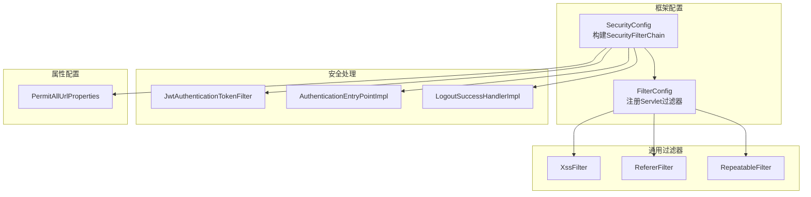
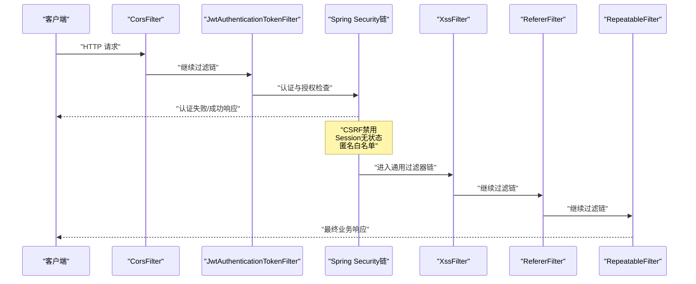
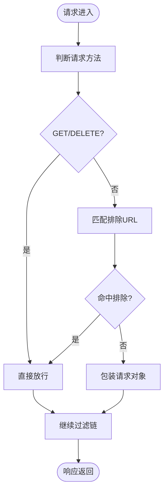
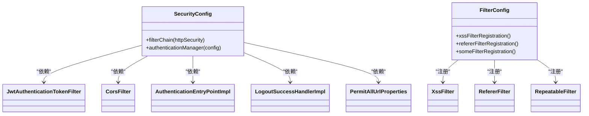

# 安全过滤器链配置

<cite>
**本文引用的文件**
- [SecurityConfig.java](file://XingChen-Vue/xingchen-framework/src/main/java/com/xingchen/framework/config/SecurityConfig.java)
- [FilterConfig.java](file://XingChen-Vue/xingchen-framework/src/main/java/com/xingchen/framework/config/FilterConfig.java)
- [XssFilter.java](file://XingChen-Vue/xingchen-common/src/main/java/com/xingchen/common/filter/XssFilter.java)
- [RepeatableFilter.java](file://XingChen-Vue/xingchen-common/src/main/java/com/xingchen/common/filter/RepeatableFilter.java)
- [RefererFilter.java](file://XingChen-Vue/xingchen-common/src/main/java/com/xingchen/common/filter/RefererFilter.java)
- [XssHttpServletRequestWrapper.java](file://XingChen-Vue/xingchen-common/src/main/java/com/xingchen/common/filter/XssHttpServletRequestWrapper.java)
- [RepeatedlyRequestWrapper.java](file://XingChen-Vue/xingchen-common/src/main/java/com/xingchen/common/filter/RepeatedlyRequestWrapper.java)
- [JwtAuthenticationTokenFilter.java](file://XingChen-Vue/xingchen-framework/src/main/java/com/xingchen/framework/security/filter/JwtAuthenticationTokenFilter.java)
- [AuthenticationEntryPointImpl.java](file://XingChen-Vue/xingchen-framework/src/main/java/com/xingchen/framework/security/handle/AuthenticationEntryPointImpl.java)
- [LogoutSuccessHandlerImpl.java](file://XingChen-Vue/xingchen-framework/src/main/java/com/xingchen/framework/security/handle/LogoutSuccessHandlerImpl.java)
- [PermitAllUrlProperties.java](file://XingChen-Vue/xingchen-framework/src/main/java/com/xingchen/framework/config/properties/PermitAllUrlProperties.java)
</cite>

## 目录
1. [简介](#简介)
2. [项目结构](#项目结构)
3. [核心组件](#核心组件)
4. [架构总览](#架构总览)
5. [详细组件分析](#详细组件分析)
6. [依赖关系分析](#依赖关系分析)
7. [性能考量](#性能考量)
8. [故障排查指南](#故障排查指南)
9. [结论](#结论)
10. [附录](#附录)

## 简介
本文件系统性梳理健康管理系统中的安全过滤器链配置，重点覆盖以下内容：
- Spring Security 过滤器链的构建与执行顺序
- 关键过滤器：CorsFilter、XssFilter、RepeatableFilter 的功能与配置要点
- CSRF 禁用策略、Session 管理配置与异常处理机制
- 自定义过滤器的接入方式、优先级设置与调试方法
- 安全过滤器最佳实践与性能优化建议

## 项目结构
围绕安全过滤器链的关键模块分布如下：
- 框架层配置：Spring Security 配置、通用过滤器注册
- 安全处理：JWT 认证过滤器、认证入口点、登出处理器
- 通用过滤器：XSS 防护、重复读取请求包装、Referer 校验
- 配置属性：允许匿名访问的 URL 列表

图表来源
- [SecurityConfig.java:85-118](file://XingChen-Vue/xingchen-framework/src/main/java/com/xingchen/framework/config/SecurityConfig.java#L85-L118)
- [FilterConfig.java:34-78](file://XingChen-Vue/xingchen-framework/src/main/java/com/xingchen/framework/config/FilterConfig.java#L34-L78)

章节来源
- [SecurityConfig.java:27-129](file://XingChen-Vue/xingchen-framework/src/main/java/com/xingchen/framework/config/SecurityConfig.java#L27-L129)
- [FilterConfig.java:17-81](file://XingChen-Vue/xingchen-framework/src/main/java/com/xingchen/framework/config/FilterConfig.java#L17-L81)

## 核心组件
- Spring Security 过滤器链：通过 SecurityFilterChain 统一装配，禁用 CSRF、禁用缓存头、无状态 Session、基于注解的授权规则、登出处理，并插入 CORS 与 JWT 认证过滤器。
- 通用过滤器链：通过 FilterRegistrationBean 注册，XSS 过滤器优先级最高，Referer 过滤器次之，Repeatable 过滤器最低。

章节来源
- [SecurityConfig.java:85-118](file://XingChen-Vue/xingchen-framework/src/main/java/com/xingchen/framework/config/SecurityConfig.java#L85-L118)
- [FilterConfig.java:34-78](file://XingChen-Vue/xingchen-framework/src/main/java/com/xingchen/framework/config/FilterConfig.java#L34-L78)

## 架构总览
下图展示从客户端到业务处理的整体过滤器链路，包括 Spring Security 过滤器与通用 Servlet 过滤器的协作关系。

图表来源
- [SecurityConfig.java:112-117](file://XingChen-Vue/xingchen-framework/src/main/java/com/xingchen/framework/config/SecurityConfig.java#L112-L117)
- [FilterConfig.java:34-78](file://XingChen-Vue/xingchen-framework/src/main/java/com/xingchen/framework/config/FilterConfig.java#L34-L78)

## 详细组件分析

### Spring Security 过滤器链构建
- CSRF 禁用：因采用基于 Token 的认证且无 Session，禁用 CSRF 以避免不必要的开销与兼容性问题。
- 头部安全：禁用缓存头与同源策略限制，减少浏览器侧缓存干扰。
- 异常处理：统一认证失败入口，便于集中处理未授权场景。
- Session 策略：设置为无状态，降低服务端会话存储压力。
- 授权规则：允许匿名访问的 URL 由属性配置加载；静态资源与文档资源默认放行；其余请求需认证。
- 登出处理：配置登出 URL 与成功处理器。
- 过滤器插入顺序：
  - 在用户名密码认证过滤器之前插入 JWT 认证过滤器，确保鉴权信息提前解析。
  - 在 CORS 过滤器之前插入多个过滤器位置，保证跨域配置在认证前生效。

章节来源
- [SecurityConfig.java:85-118](file://XingChen-Vue/xingchen-framework/src/main/java/com/xingchen/framework/config/SecurityConfig.java#L85-L118)
- [PermitAllUrlProperties.java](file://XingChen-Vue/xingchen-framework/src/main/java/com/xingchen/framework/config/properties/PermitAllUrlProperties.java)

### CORS 过滤器（CorsFilter）
- 作用：解决跨域请求问题，确保预检与正式请求均能正确携带凭据与头部。
- 插入位置：在 JWT 认证过滤器与登出过滤器之前，确保跨域策略在认证与登出逻辑之前生效。
- 与 Spring Security 的关系：作为独立的 CORS 实现，与 Security 的 cors 配置互补或替代，具体取决于部署策略。

章节来源
- [SecurityConfig.java:114-116](file://XingChen-Vue/xingchen-framework/src/main/java/com/xingchen/framework/config/SecurityConfig.java#L114-L116)

### XSS 防护过滤器（XssFilter）
- 功能：对非 GET/DELETE 请求进行 XSS 防护，支持排除 URL 列表与 HTTP 方法白名单。
- 包装机制：对请求体进行包装，拦截潜在恶意输入。
- 初始化参数：通过 FilterRegistrationBean 注入排除 URL 列表，按逗号分隔。
- 执行顺序：优先级最高，确保在其他过滤器前完成防护。

图表来源
- [XssFilter.java:43-68](file://XingChen-Vue/xingchen-common/src/main/java/com/xingchen/common/filter/XssFilter.java#L43-L68)
- [XssHttpServletRequestWrapper.java](file://XingChen-Vue/xingchen-common/src/main/java/com/xingchen/common/filter/XssHttpServletRequestWrapper.java)

章节来源
- [XssFilter.java:17-75](file://XingChen-Vue/xingchen-common/src/main/java/com/xingchen/common/filter/XssFilter.java#L17-L75)
- [FilterConfig.java:34-49](file://XingChen-Vue/xingchen-framework/src/main/java/com/xingchen/framework/config/FilterConfig.java#L34-L49)

### 可重复读取过滤器（RepeatableFilter）
- 功能：针对 JSON 请求体，提供可重复读取能力，避免后续过滤器或业务代码无法再次读取请求体。
- 触发条件：仅当 Content-Type 为 JSON 时启用包装。
- 执行顺序：最低优先级，确保在所有安全与业务过滤器之后执行，减少对上游逻辑的影响。

章节来源
- [RepeatableFilter.java:14-53](file://XingChen-Vue/xingchen-common/src/main/java/com/xingchen/common/filter/RepeatableFilter.java#L14-L53)
- [FilterConfig.java:68-78](file://XingChen-Vue/xingchen-framework/src/main/java/com/xingchen/framework/config/FilterConfig.java#L68-L78)

### Referer 防盗链过滤器（RefererFilter）
- 功能：校验请求头中的 Referer 是否来自允许的域名列表，防止资源被外部站点直接引用。
- 行为：若 Referer 缺失或不在允许列表内，直接返回禁止访问错误。
- 初始化参数：通过 FilterRegistrationBean 注入允许的域名集合。

章节来源
- [RefererFilter.java:15-77](file://XingChen-Vue/xingchen-common/src/main/java/com/xingchen/common/filter/RefererFilter.java#L15-L77)
- [FilterConfig.java:51-66](file://XingChen-Vue/xingchen-framework/src/main/java/com/xingchen/framework/config/FilterConfig.java#L51-L66)

### JWT 认证过滤器（JwtAuthenticationTokenFilter）
- 作用：在 Security 过滤器链中提前解析 Token 并建立认证上下文，使后续授权与业务逻辑可感知用户身份。
- 插入位置：在用户名密码认证过滤器之前，确保认证阶段即完成用户识别。

章节来源
- [JwtAuthenticationTokenFilter.java](file://XingChen-Vue/xingchen-framework/src/main/java/com/xingchen/framework/security/filter/JwtAuthenticationTokenFilter.java)
- [SecurityConfig.java:112-113](file://XingChen-Vue/xingchen-framework/src/main/java/com/xingchen/framework/config/SecurityConfig.java#L112-L113)

### 异常处理与登出
- 认证失败处理：统一由认证入口点处理未授权请求，便于标准化响应格式。
- 登出处理：配置登出 URL 与成功处理器，确保登出流程可控。

章节来源
- [AuthenticationEntryPointImpl.java](file://XingChen-Vue/xingchen-framework/src/main/java/com/xingchen/framework/security/handle/AuthenticationEntryPointImpl.java)
- [LogoutSuccessHandlerImpl.java](file://XingChen-Vue/xingchen-framework/src/main/java/com/xingchen/framework/security/handle/LogoutSuccessHandlerImpl.java)
- [SecurityConfig.java:95-111](file://XingChen-Vue/xingchen-framework/src/main/java/com/xingchen/framework/config/SecurityConfig.java#L95-L111)

## 依赖关系分析
- SecurityConfig 依赖：
  - JwtAuthenticationTokenFilter：负责 Token 解析与认证上下文建立
  - CorsFilter：跨域策略前置
  - AuthenticationEntryPointImpl：认证失败统一处理
  - LogoutSuccessHandlerImpl：登出成功处理
  - PermitAllUrlProperties：匿名放行 URL 列表
- FilterConfig 依赖：
  - XssFilter、RefererFilter、RepeatableFilter：通过 FilterRegistrationBean 注册并设置优先级
  - 属性注入：xss.excludes、xss.urlPatterns、referer.allowed-domains

图表来源
- [SecurityConfig.java:43-59](file://XingChen-Vue/xingchen-framework/src/main/java/com/xingchen/framework/config/SecurityConfig.java#L43-L59)
- [FilterConfig.java:34-78](file://XingChen-Vue/xingchen-framework/src/main/java/com/xingchen/framework/config/FilterConfig.java#L34-L78)

章节来源
- [SecurityConfig.java:43-59](file://XingChen-Vue/xingchen-framework/src/main/java/com/xingchen/framework/config/SecurityConfig.java#L43-L59)
- [FilterConfig.java:34-78](file://XingChen-Vue/xingchen-framework/src/main/java/com/xingchen/framework/config/FilterConfig.java#L34-L78)

## 性能考量
- 无状态 Session：禁用 Session 降低服务器内存占用与序列化成本，提升横向扩展能力。
- 过滤器顺序优化：将高优先级的 XSS 与 CORS 放置在链路前端，避免无效计算；将 RepeatableFilter 放在末尾，减少对上游逻辑影响。
- JSON 请求体复用：仅在必要时包装请求体，避免对非 JSON 请求产生额外开销。
- 匿名放行：合理配置匿名 URL，减少认证与授权检查次数。
- 日志与监控：结合全局异常处理器与审计日志，定位性能瓶颈与安全事件。

## 故障排查指南
- CSRF 相关问题
  - 现象：跨域请求被拦截或报错
  - 排查：确认已禁用 CSRF；核对 CORS 配置是否在认证过滤器之前
  - 参考
    - [SecurityConfig.java:89-90](file://XingChen-Vue/xingchen-framework/src/main/java/com/xingchen/framework/config/SecurityConfig.java#L89-L90)
    - [SecurityConfig.java:114-116](file://XingChen-Vue/xingchen-framework/src/main/java/com/xingchen/framework/config/SecurityConfig.java#L114-L116)
- 认证失败
  - 现象：统一返回未授权
  - 排查：检查 Token 是否有效、过期或格式错误；确认认证入口点是否被触发
  - 参考
    - [SecurityConfig.java:95-96](file://XingChen-Vue/xingchen-framework/src/main/java/com/xingchen/framework/config/SecurityConfig.java#L95-L96)
    - [AuthenticationEntryPointImpl.java](file://XingChen-Vue/xingchen-framework/src/main/java/com/xingchen/framework/security/handle/AuthenticationEntryPointImpl.java)
- 登出异常
  - 现象：登出后仍可访问受保护资源
  - 排查：确认登出 URL 与成功处理器配置；检查 Token 黑名单或前端清除逻辑
  - 参考
    - [SecurityConfig.java:110-111](file://XingChen-Vue/xingchen-framework/src/main/java/com/xingchen/framework/config/SecurityConfig.java#L110-L111)
    - [LogoutSuccessHandlerImpl.java](file://XingChen-Vue/xingchen-framework/src/main/java/com/xingchen/framework/security/handle/LogoutSuccessHandlerImpl.java)
- XSS 过滤误伤
  - 现象：正常请求被拦截
  - 排查：检查排除 URL 列表与 HTTP 方法白名单；确认包装后的请求体是否被正确传递
  - 参考
    - [XssFilter.java:24-68](file://XingChen-Vue/xingchen-common/src/main/java/com/xingchen/common/filter/XssFilter.java#L24-L68)
    - [XssHttpServletRequestWrapper.java](file://XingChen-Vue/xingchen-common/src/main/java/com/xingchen/common/filter/XssHttpServletRequestWrapper.java)
- JSON 请求体读取异常
  - 现象：业务层无法读取请求体
  - 排查：确认 RepeatableFilter 是否生效；检查 Content-Type 是否为 JSON
  - 参考
    - [RepeatableFilter.java:27-45](file://XingChen-Vue/xingchen-common/src/main/java/com/xingchen/common/filter/RepeatableFilter.java#L27-L45)
    - [RepeatedlyRequestWrapper.java](file://XingChen-Vue/xingchen-common/src/main/java/com/xingchen/common/filter/RepeatedlyRequestWrapper.java)
- Referer 校验失败
  - 现象：提示 Referer 不允许
  - 排查：确认 allowed-domains 配置；检查请求头是否携带 Referer
  - 参考
    - [RefererFilter.java:34-70](file://XingChen-Vue/xingchen-common/src/main/java/com/xingchen/common/filter/RefererFilter.java#L34-L70)
    - [FilterConfig.java:51-66](file://XingChen-Vue/xingchen-framework/src/main/java/com/xingchen/framework/config/FilterConfig.java#L51-L66)

## 结论
本系统的安全过滤器链通过 Spring Security 与通用 Servlet 过滤器协同工作，实现了：
- 无 CSRF、无状态 Session 的轻量级认证模型
- 前置的跨域与 XSS 防护，以及可选的 Referer 校验
- 明确的过滤器顺序与优先级，兼顾安全性与性能
- 可扩展的配置方式，便于按需启用/调整各项安全措施

## 附录

### 自定义过滤器接入与优先级设置
- 接入方式
  - 使用 FilterRegistrationBean 注册自定义过滤器，设置 DispatcherType、URL 匹配与初始化参数
  - 通过 setOrder 设置优先级：HIGHEST_PRECEDENCE 最高，LOWEST_PRECEDENCE 最低
- 优先级建议
  - 安全前置：XSS/CORS/Referer 等应尽量靠前
  - 业务前置：如鉴权、限流等中间件
  - 末端收尾：日志、统计、可重复读取等
- 参考
  - [FilterConfig.java:34-78](file://XingChen-Vue/xingchen-framework/src/main/java/com/xingchen/framework/config/FilterConfig.java#L34-L78)

### 过滤器链调试方法
- 开启调试日志：在日志配置中增加相关包的日志级别，观察过滤器执行顺序与异常
- 分段验证：逐个启用/禁用过滤器，定位问题范围
- 单元测试：对关键过滤器编写请求包装与响应断言的测试用例
- 浏览器开发者工具：检查请求头、响应状态码与跨域预检行为