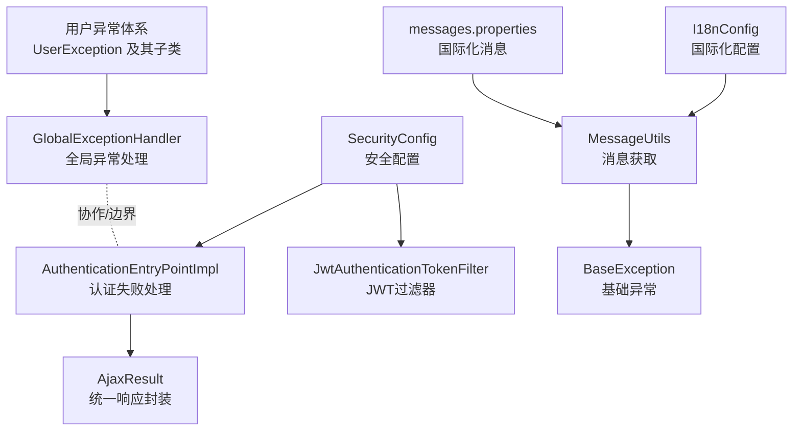
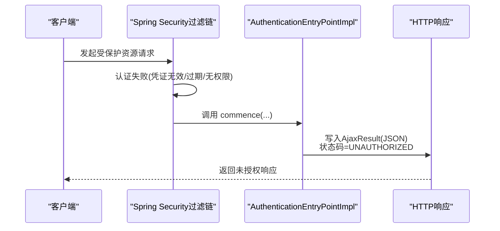
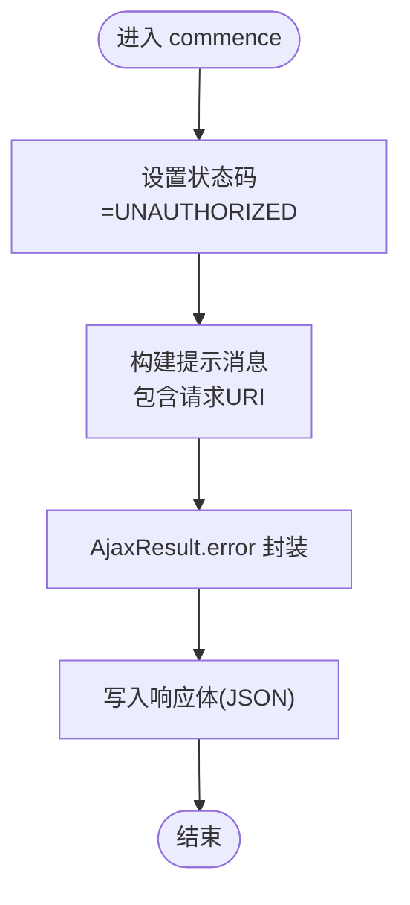
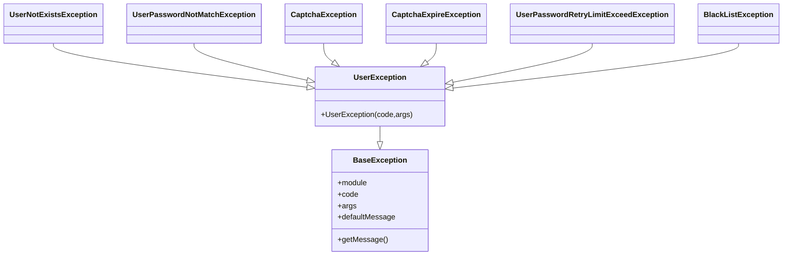
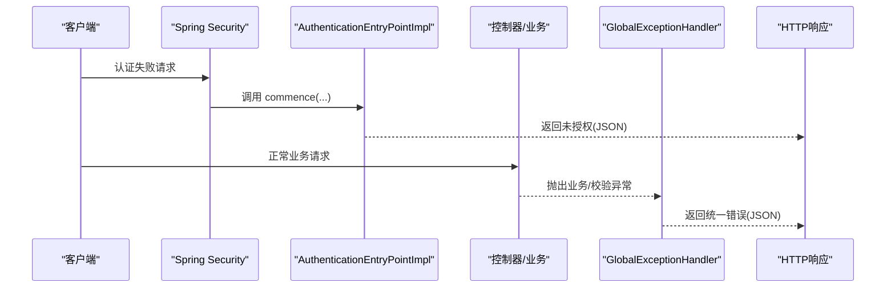
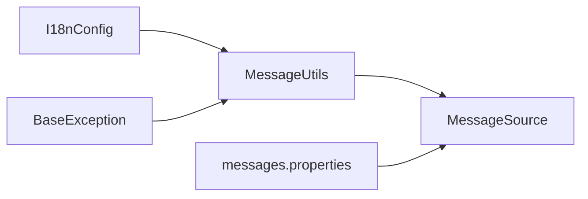
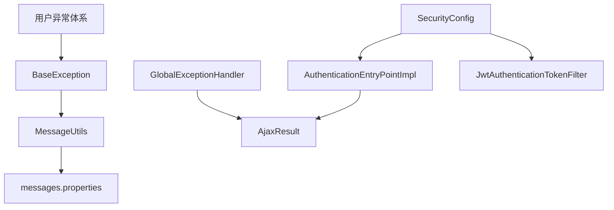

# 认证异常处理

<cite>
**本文引用的文件**
- [AuthenticationEntryPointImpl.java](file://XingChen-Vue/xingchen-framework/src/main/java/com/xingchen/framework/security/handle/AuthenticationEntryPointImpl.java)
- [GlobalExceptionHandler.java](file://XingChen-Vue/xingchen-framework/src/main/java/com/xingchen/framework/web/exception/GlobalExceptionHandler.java)
- [SecurityConfig.java](file://XingChen-Vue/xingchen-framework/src/main/java/com/xingchen/framework/config/SecurityConfig.java)
- [BaseException.java](file://XingChen-Vue/xingchen-common/src/main/java/com/xingchen/common/exception/base/BaseException.java)
- [UserException.java](file://XingChen-Vue/xingchen-common/src/main/java/com/xingchen/common/exception/user/UserException.java)
- [UserNotExistsException.java](file://XingChen-Vue/xingchen-common/src/main/java/com/xingchen/common/exception/user/UserNotExistsException.java)
- [UserPasswordNotMatchException.java](file://XingChen-Vue/xingchen-common/src/main/java/com/xingchen/common/exception/user/UserPasswordNotMatchException.java)
- [UserPasswordRetryLimitExceedException.java](file://XingChen-Vue/xingchen-common/src/main/java/com/xingchen/common/exception/user/UserPasswordRetryLimitExceedException.java)
- [CaptchaException.java](file://XingChen-Vue/xingchen-common/src/main/java/com/xingchen/common/exception/user/CaptchaException.java)
- [CaptchaExpireException.java](file://XingChen-Vue/xingchen-common/src/main/java/com/xingchen/common/exception/user/CaptchaExpireException.java)
- [BlackListException.java](file://XingChen-Vue/xingchen-common/src/main/java/com/xingchen/common/exception/user/BlackListException.java)
- [AjaxResult.java](file://XingChen-Vue/xingchen-common/src/main/java/com/xingchen/common/core/domain/AjaxResult.java)
- [I18nConfig.java](file://XingChen-Vue/xingchen-framework/src/main/java/com/xingchen/framework/config/I18nConfig.java)
- [MessageUtils.java](file://XingChen-Vue/xingchen-common/src/main/java/com/xingchen/common/utils/MessageUtils.java)
- [messages.properties](file://XingChen-Vue/xingchen-admin/src/main/resources/i18n/messages.properties)
- [Constants.java](file://XingChen-Vue/xingchen-common/src/main/java/com/xingchen/common/constant/Constants.java)
- [JwtAuthenticationTokenFilter.java](file://XingChen-Vue/xingchen-framework/src/main/java/com/xingchen/framework/security/filter/JwtAuthenticationTokenFilter.java)
</cite>

## 目录
1. [简介](#简介)
2. [项目结构](#项目结构)
3. [核心组件](#核心组件)
4. [架构总览](#架构总览)
5. [详细组件分析](#详细组件分析)
6. [依赖关系分析](#依赖关系分析)
7. [性能考量](#性能考量)
8. [故障排查指南](#故障排查指南)
9. [结论](#结论)
10. [附录](#附录)

## 简介
本文件聚焦于系统的认证异常处理机制，围绕 AuthenticationEntryPointImpl 的实现原理展开，结合用户侧常见认证异常类型（如用户不存在、密码错误、验证码失效、密码重试超限、黑名单等），阐述全局异常处理与认证异常处理的边界与协作关系，并给出异常信息格式化输出、国际化支持以及安全日志记录的最佳实践与用户体验优化建议。

## 项目结构
认证异常处理涉及后端安全配置、认证入口点、全局异常处理、用户异常体系、国际化与响应封装等模块。下图展示与认证异常处理直接相关的组件与交互：

图表来源
- [SecurityConfig.java:1-128](file://XingChen-Vue/xingchen-framework/src/main/java/com/xingchen/framework/config/SecurityConfig.java#L1-L128)
- [AuthenticationEntryPointImpl.java:1-34](file://XingChen-Vue/xingchen-framework/src/main/java/com/xingchen/framework/security/handle/AuthenticationEntryPointImpl.java#L1-L34)
- [JwtAuthenticationTokenFilter.java:32-44](file://XingChen-Vue/xingchen-framework/src/main/java/com/xingchen/framework/security/filter/JwtAuthenticationTokenFilter.java#L32-L44)
- [GlobalExceptionHandler.java:1-146](file://XingChen-Vue/xingchen-framework/src/main/java/com/xingchen/framework/web/exception/GlobalExceptionHandler.java#L1-L146)
- [UserException.java:1-18](file://XingChen-Vue/xingchen-common/src/main/java/com/xingchen/common/exception/user/UserException.java#L1-L18)
- [BaseException.java:1-98](file://XingChen-Vue/xingchen-common/src/main/java/com/xingchen/common/exception/base/BaseException.java#L1-L98)
- [I18nConfig.java:1-44](file://XingChen-Vue/xingchen-framework/src/main/java/com/xingchen/framework/config/I18nConfig.java#L1-L44)
- [MessageUtils.java:1-26](file://XingChen-Vue/xingchen-common/src/main/java/com/xingchen/common/utils/MessageUtils.java#L1-L26)
- [messages.properties:1-39](file://XingChen-Vue/xingchen-admin/src/main/resources/i18n/messages.properties#L1-L39)

章节来源
- [SecurityConfig.java:1-128](file://XingChen-Vue/xingchen-framework/src/main/java/com/xingchen/framework/config/SecurityConfig.java#L1-L128)
- [AuthenticationEntryPointImpl.java:1-34](file://XingChen-Vue/xingchen-framework/src/main/java/com/xingchen/framework/security/handle/AuthenticationEntryPointImpl.java#L1-L34)
- [GlobalExceptionHandler.java:1-146](file://XingChen-Vue/xingchen-framework/src/main/java/com/xingchen/framework/web/exception/GlobalExceptionHandler.java#L1-L146)

## 核心组件
- 认证失败处理入口 AuthenticationEntryPointImpl：负责在Spring Security认证阶段失败时返回统一的未授权响应。
- 安全配置 SecurityConfig：装配认证入口点、JWT过滤器、跨域过滤器与放行URL策略。
- 全局异常处理 GlobalExceptionHandler：捕获运行期异常、业务异常、参数校验异常等，统一输出AjaxResult。
- 用户异常体系：以 UserException 为基础，派生出用户不存在、密码错误、验证码错误/过期、密码重试超限、黑名单等具体异常类型。
- 国际化与消息：通过 I18nConfig、MessageUtils 与 messages.properties 提供多语言支持。
- 统一响应封装 AjaxResult：标准化接口返回结构，包含状态码、消息与可选数据。

章节来源
- [AuthenticationEntryPointImpl.java:1-34](file://XingChen-Vue/xingchen-framework/src/main/java/com/xingchen/framework/security/handle/AuthenticationEntryPointImpl.java#L1-L34)
- [SecurityConfig.java:1-128](file://XingChen-Vue/xingchen-framework/src/main/java/com/xingchen/framework/config/SecurityConfig.java#L1-L128)
- [GlobalExceptionHandler.java:1-146](file://XingChen-Vue/xingchen-framework/src/main/java/com/xingchen/framework/web/exception/GlobalExceptionHandler.java#L1-L146)
- [UserException.java:1-18](file://XingChen-Vue/xingchen-common/src/main/java/com/xingchen/common/exception/user/UserException.java#L1-L18)
- [BaseException.java:1-98](file://XingChen-Vue/xingchen-common/src/main/java/com/xingchen/common/exception/base/BaseException.java#L1-L98)
- [AjaxResult.java:1-217](file://XingChen-Vue/xingchen-common/src/main/java/com/xingchen/common/core/domain/AjaxResult.java#L1-L217)
- [I18nConfig.java:1-44](file://XingChen-Vue/xingchen-framework/src/main/java/com/xingchen/framework/config/I18nConfig.java#L1-L44)
- [MessageUtils.java:1-26](file://XingChen-Vue/xingchen-common/src/main/java/com/xingchen/common/utils/MessageUtils.java#L1-L26)
- [messages.properties:1-39](file://XingChen-Vue/xingchen-admin/src/main/resources/i18n/messages.properties#L1-L39)

## 架构总览
认证异常处理在Spring Security过滤链中触发，当认证失败时由 AuthenticationEntryPointImpl 输出统一响应；对于业务层抛出的用户相关异常，由 GlobalExceptionHandler 捕获并返回统一结构。国际化通过消息源按当前区域动态解析。

图表来源
- [AuthenticationEntryPointImpl.java:26-33](file://XingChen-Vue/xingchen-framework/src/main/java/com/xingchen/framework/security/handle/AuthenticationEntryPointImpl.java#L26-L33)
- [AjaxResult.java:133-171](file://XingChen-Vue/xingchen-common/src/main/java/com/xingchen/common/core/domain/AjaxResult.java#L133-L171)

## 详细组件分析

### AuthenticationEntryPointImpl 实现原理
- 触发时机：Spring Security 在认证阶段（如JWT无效、缺失）判定失败时回调。
- 处理逻辑：设置状态码为未授权，拼装友好提示，使用 AjaxResult.error 封装并写回JSON字符串。
- 输出格式：遵循 AjaxResult 统一结构，便于前端解析与提示。

图表来源
- [AuthenticationEntryPointImpl.java:26-33](file://XingChen-Vue/xingchen-framework/src/main/java/com/xingchen/framework/security/handle/AuthenticationEntryPointImpl.java#L26-L33)
- [AjaxResult.java:133-171](file://XingChen-Vue/xingchen-common/src/main/java/com/xingchen/common/core/domain/AjaxResult.java#L133-L171)

章节来源
- [AuthenticationEntryPointImpl.java:1-34](file://XingChen-Vue/xingchen-framework/src/main/java/com/xingchen/framework/security/handle/AuthenticationEntryPointImpl.java#L1-L34)
- [AjaxResult.java:1-217](file://XingChen-Vue/xingchen-common/src/main/java/com/xingchen/common/core/domain/AjaxResult.java#L1-L217)

### 用户认证异常类型与处理策略
- 用户不存在/密码错误
  - 异常类型：UserNotExistsException、UserPasswordNotMatchException
  - 处理策略：通常在业务登录流程中抛出，由 GlobalExceptionHandler 捕获并返回统一错误结构；国际化消息键对应“用户不存在/密码错误”。
- 验证码错误/失效
  - 异常类型：CaptchaException、CaptchaExpireException
  - 处理策略：登录时校验失败抛出，GlobalExceptionHandler 捕获并返回对应国际化消息。
- 密码重试超限
  - 异常类型：UserPasswordRetryLimitExceedException
  - 处理策略：携带重试次数与锁定时长参数，国际化消息可格式化显示。
- 黑名单IP
  - 异常类型：BlackListException
  - 处理策略：登录拦截时抛出，提示访问被限制。

图表来源
- [BaseException.java:35-76](file://XingChen-Vue/xingchen-common/src/main/java/com/xingchen/common/exception/base/BaseException.java#L35-L76)
- [UserException.java:14-17](file://XingChen-Vue/xingchen-common/src/main/java/com/xingchen/common/exception/user/UserException.java#L14-L17)
- [UserNotExistsException.java:12-15](file://XingChen-Vue/xingchen-common/src/main/java/com/xingchen/common/exception/user/UserNotExistsException.java#L12-L15)
- [UserPasswordNotMatchException.java:12-15](file://XingChen-Vue/xingchen-common/src/main/java/com/xingchen/common/exception/user/UserPasswordNotMatchException.java#L12-L15)
- [CaptchaException.java:12-15](file://XingChen-Vue/xingchen-common/src/main/java/com/xingchen/common/exception/user/CaptchaException.java#L12-L15)
- [CaptchaExpireException.java:12-15](file://XingChen-Vue/xingchen-common/src/main/java/com/xingchen/common/exception/user/CaptchaExpireException.java#L12-L15)
- [UserPasswordRetryLimitExceedException.java:12-15](file://XingChen-Vue/xingchen-common/src/main/java/com/xingchen/common/exception/user/UserPasswordRetryLimitExceedException.java#L12-L15)
- [BlackListException.java:12-15](file://XingChen-Vue/xingchen-common/src/main/java/com/xingchen/common/exception/user/BlackListException.java#L12-L15)

章节来源
- [UserException.java:1-18](file://XingChen-Vue/xingchen-common/src/main/java/com/xingchen/common/exception/user/UserException.java#L1-L18)
- [UserNotExistsException.java:1-16](file://XingChen-Vue/xingchen-common/src/main/java/com/xingchen/common/exception/user/UserNotExistsException.java#L1-L16)
- [UserPasswordNotMatchException.java:1-16](file://XingChen-Vue/xingchen-common/src/main/java/com/xingchen/common/exception/user/UserPasswordNotMatchException.java#L1-L16)
- [CaptchaException.java:1-16](file://XingChen-Vue/xingchen-common/src/main/java/com/xingchen/common/exception/user/CaptchaException.java#L1-L16)
- [CaptchaExpireException.java:1-16](file://XingChen-Vue/xingchen-common/src/main/java/com/xingchen/common/exception/user/CaptchaExpireException.java#L1-L16)
- [UserPasswordRetryLimitExceedException.java:1-16](file://XingChen-Vue/xingchen-common/src/main/java/com/xingchen/common/exception/user/UserPasswordRetryLimitExceedException.java#L1-L16)
- [BlackListException.java:1-17](file://XingChen-Vue/xingchen-common/src/main/java/com/xingchen/common/exception/user/BlackListException.java#L1-L17)

### 全局异常处理与认证异常处理的协作
- 认证异常处理：由 AuthenticationEntryPointImpl 在认证阶段统一返回未授权响应，不进入业务异常捕获流程。
- 业务异常处理：由 GlobalExceptionHandler 捕获 ServiceException、验证异常、运行时异常等，统一输出 AjaxResult。
- 协作关系：两者职责清晰分离，认证失败走入口点快速返回；业务异常统一收敛，提升一致性与可观测性。

图表来源
- [AuthenticationEntryPointImpl.java:26-33](file://XingChen-Vue/xingchen-framework/src/main/java/com/xingchen/framework/security/handle/AuthenticationEntryPointImpl.java#L26-L33)
- [GlobalExceptionHandler.java:35-64](file://XingChen-Vue/xingchen-framework/src/main/java/com/xingchen/framework/web/exception/GlobalExceptionHandler.java#L35-L64)

章节来源
- [GlobalExceptionHandler.java:1-146](file://XingChen-Vue/xingchen-framework/src/main/java/com/xingchen/framework/web/exception/GlobalExceptionHandler.java#L1-L146)
- [SecurityConfig.java:100-118](file://XingChen-Vue/xingchen-framework/src/main/java/com/xingchen/framework/config/SecurityConfig.java#L100-L118)

### 异常信息格式化输出与国际化
- 统一响应：AjaxResult 提供 success/error/warn 等静态方法，确保前后端契约一致。
- 国际化：MessageUtils 通过 Spring 的 MessageSource 按当前 Locale 解析消息键；I18nConfig 设置默认语言与参数切换拦截器；messages.properties 提供多语言键值。
- 基础异常：BaseException 支持 code+args 的消息模板解析，优先从国际化资源获取，否则回落到默认消息。

图表来源
- [MessageUtils.java:21-25](file://XingChen-Vue/xingchen-common/src/main/java/com/xingchen/common/utils/MessageUtils.java#L21-L25)
- [I18nConfig.java:20-42](file://XingChen-Vue/xingchen-framework/src/main/java/com/xingchen/framework/config/I18nConfig.java#L20-L42)
- [BaseException.java:64-76](file://XingChen-Vue/xingchen-common/src/main/java/com/xingchen/common/exception/base/BaseException.java#L64-L76)
- [messages.properties:3-8](file://XingChen-Vue/xingchen-admin/src/main/resources/i18n/messages.properties#L3-L8)

章节来源
- [AjaxResult.java:133-171](file://XingChen-Vue/xingchen-common/src/main/java/com/xingchen/common/core/domain/AjaxResult.java#L133-L171)
- [MessageUtils.java:1-26](file://XingChen-Vue/xingchen-common/src/main/java/com/xingchen/common/utils/MessageUtils.java#L1-L26)
- [I18nConfig.java:1-44](file://XingChen-Vue/xingchen-framework/src/main/java/com/xingchen/framework/config/I18nConfig.java#L1-L44)
- [BaseException.java:1-98](file://XingChen-Vue/xingchen-common/src/main/java/com/xingchen/common/exception/base/BaseException.java#L1-L98)
- [messages.properties:1-39](file://XingChen-Vue/xingchen-admin/src/main/resources/i18n/messages.properties#L1-L39)

### 安全日志记录策略
- 认证失败日志：AuthenticationEntryPointImpl 仅返回未授权响应，不记录敏感细节；若需审计可在上游过滤器或服务层补充。
- 业务异常日志：GlobalExceptionHandler 对 AccessDeniedException、RuntimeException、Exception 等进行统一记录，包含请求URI与异常摘要，便于追踪。
- 最佳实践：避免在日志中输出用户名、密码、令牌等敏感信息；对高风险操作（如登录失败、黑名单触发）单独打点并分级告警。

章节来源
- [AuthenticationEntryPointImpl.java:26-33](file://XingChen-Vue/xingchen-framework/src/main/java/com/xingchen/framework/security/handle/AuthenticationEntryPointImpl.java#L26-L33)
- [GlobalExceptionHandler.java:35-113](file://XingChen-Vue/xingchen-framework/src/main/java/com/xingchen/framework/web/exception/GlobalExceptionHandler.java#L35-L113)

### 自定义异常处理器配置
- 认证入口点：在 SecurityConfig 中注入 AuthenticationEntryPointImpl 并交由 Spring Security 使用。
- JWT过滤器：在 SecurityConfig 中添加 JwtAuthenticationTokenFilter，用于解析与验证令牌并建立认证上下文。
- 放行URL：通过 PermitAllUrlProperties 配置匿名可访问的接口列表，减少不必要的认证开销。

章节来源
- [SecurityConfig.java:34-59](file://XingChen-Vue/xingchen-framework/src/main/java/com/xingchen/framework/config/SecurityConfig.java#L34-L59)
- [SecurityConfig.java:100-118](file://XingChen-Vue/xingchen-framework/src/main/java/com/xingchen/framework/config/SecurityConfig.java#L100-L118)
- [JwtAuthenticationTokenFilter.java:32-44](file://XingChen-Vue/xingchen-framework/src/main/java/com/xingchen/framework/security/filter/JwtAuthenticationTokenFilter.java#L32-L44)

## 依赖关系分析
- 认证入口点依赖 AjaxResult 进行统一响应封装。
- 用户异常体系依赖国际化消息键与 BaseException 的消息解析能力。
- 全局异常处理依赖 AjaxResult 与日志框架输出统一错误。
- 安全配置依赖认证入口点、JWT过滤器与跨域过滤器共同完成认证与放行策略。

图表来源
- [AuthenticationEntryPointImpl.java:10-14](file://XingChen-Vue/xingchen-framework/src/main/java/com/xingchen/framework/security/handle/AuthenticationEntryPointImpl.java#L10-L14)
- [GlobalExceptionHandler.java:14-20](file://XingChen-Vue/xingchen-framework/src/main/java/com/xingchen/framework/web/exception/GlobalExceptionHandler.java#L14-L20)
- [UserException.java:3-4](file://XingChen-Vue/xingchen-common/src/main/java/com/xingchen/common/exception/user/UserException.java#L3-L4)
- [BaseException.java:3-4](file://XingChen-Vue/xingchen-common/src/main/java/com/xingchen/common/exception/base/BaseException.java#L3-L4)
- [MessageUtils.java:3-5](file://XingChen-Vue/xingchen-common/src/main/java/com/xingchen/common/utils/MessageUtils.java#L3-L5)
- [SecurityConfig.java:19-20](file://XingChen-Vue/xingchen-framework/src/main/java/com/xingchen/framework/config/SecurityConfig.java#L19-L20)
- [JwtAuthenticationTokenFilter.java:34-40](file://XingChen-Vue/xingchen-framework/src/main/java/com/xingchen/framework/security/filter/JwtAuthenticationTokenFilter.java#L34-L40)

章节来源
- [AjaxResult.java:1-217](file://XingChen-Vue/xingchen-common/src/main/java/com/xingchen/common/core/domain/AjaxResult.java#L1-L217)
- [BaseException.java:1-98](file://XingChen-Vue/xingchen-common/src/main/java/com/xingchen/common/exception/base/BaseException.java#L1-L98)
- [MessageUtils.java:1-26](file://XingChen-Vue/xingchen-common/src/main/java/com/xingchen/common/utils/MessageUtils.java#L1-L26)
- [messages.properties:1-39](file://XingChen-Vue/xingchen-admin/src/main/resources/i18n/messages.properties#L1-L39)
- [SecurityConfig.java:1-128](file://XingChen-Vue/xingchen-framework/src/main/java/com/xingchen/framework/config/SecurityConfig.java#L1-L128)
- [JwtAuthenticationTokenFilter.java:32-44](file://XingChen-Vue/xingchen-framework/src/main/java/com/xingchen/framework/security/filter/JwtAuthenticationTokenFilter.java#L32-L44)

## 性能考量
- 认证失败快速返回：AuthenticationEntryPointImpl 不引入额外计算，直接输出JSON，降低延迟。
- 过滤器链顺序：SecurityConfig 中先添加 CORS，再添加 JWT 过滤器，避免重复解析与不必要的开销。
- 日志级别控制：对高频认证失败事件采用较低日志级别或采样，防止日志风暴影响性能。

## 故障排查指南
- 认证失败但提示不明确
  - 检查 AuthenticationEntryPointImpl 是否生效（确认 SecurityConfig 已注入）。
  - 确认请求是否命中了放行URL导致未触发认证。
- 国际化消息未生效
  - 检查 I18nConfig 的默认语言与参数拦截器配置。
  - 确认 messages.properties 中是否存在对应键值。
- 业务异常未统一返回
  - 检查 GlobalExceptionHandler 是否扫描到对应异常类型。
  - 确认异常是否在业务层正确抛出并被拦截。

章节来源
- [SecurityConfig.java:100-118](file://XingChen-Vue/xingchen-framework/src/main/java/com/xingchen/framework/config/SecurityConfig.java#L100-L118)
- [I18nConfig.java:20-42](file://XingChen-Vue/xingchen-framework/src/main/java/com/xingchen/framework/config/I18nConfig.java#L20-L42)
- [messages.properties:3-8](file://XingChen-Vue/xingchen-admin/src/main/resources/i18n/messages.properties#L3-L8)
- [GlobalExceptionHandler.java:35-113](file://XingChen-Vue/xingchen-framework/src/main/java/com/xingchen/framework/web/exception/GlobalExceptionHandler.java#L35-L113)

## 结论
该系统通过 AuthenticationEntryPointImpl 在认证阶段提供统一的未授权响应，配合 GlobalExceptionHandler 对业务异常进行集中处理，形成清晰的异常处理边界。结合国际化与统一响应封装，既保证了用户体验的一致性，也提升了系统的可观测性与安全性。建议在实际部署中完善审计日志策略与告警机制，持续优化认证链路性能与用户体验。

## 附录
- 常见认证异常键值参考
  - 用户不存在/密码错误：user.not.exists、user.password.not.match
  - 验证码错误/失效：user.jcaptcha.error、user.jcaptcha.expire
  - 密码重试超限：user.password.retry.limit.exceed
  - 黑名单：login.blocked

章节来源
- [messages.properties:3-12](file://XingChen-Vue/xingchen-admin/src/main/resources/i18n/messages.properties#L3-L12)
- [Constants.java:94-96](file://XingChen-Vue/xingchen-common/src/main/java/com/xingchen/common/constant/Constants.java#L94-L96)