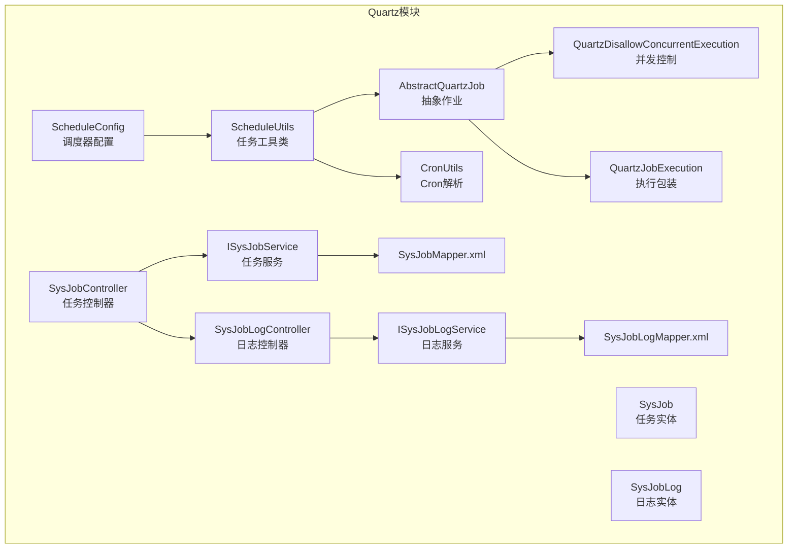
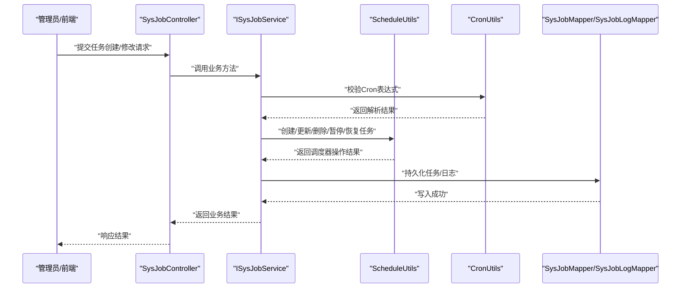
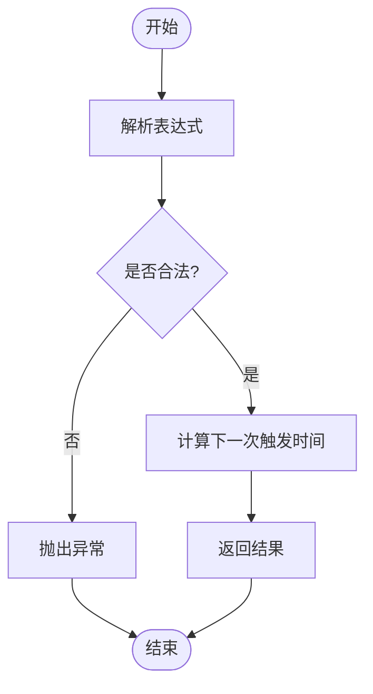
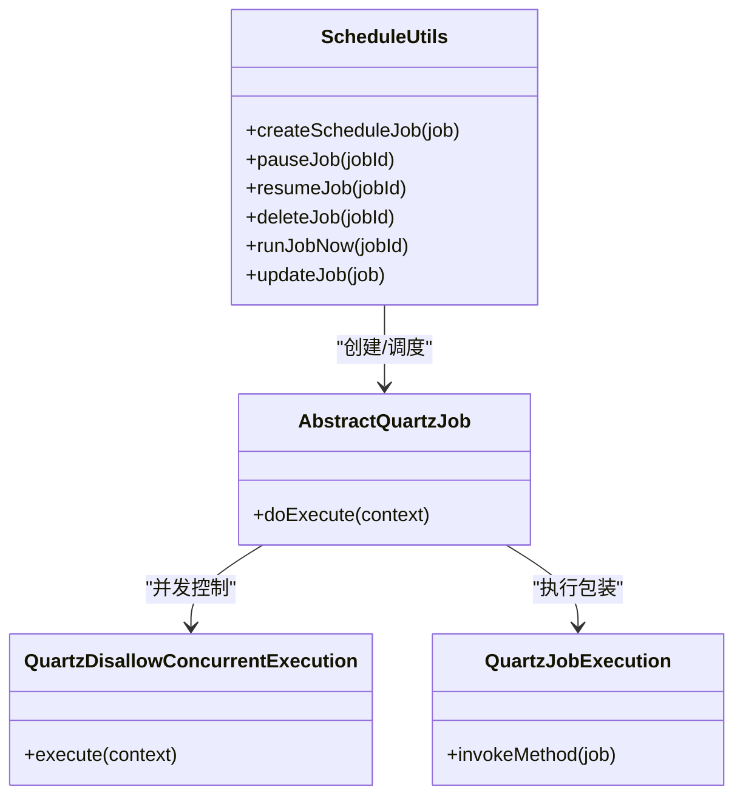
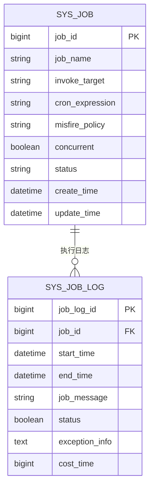
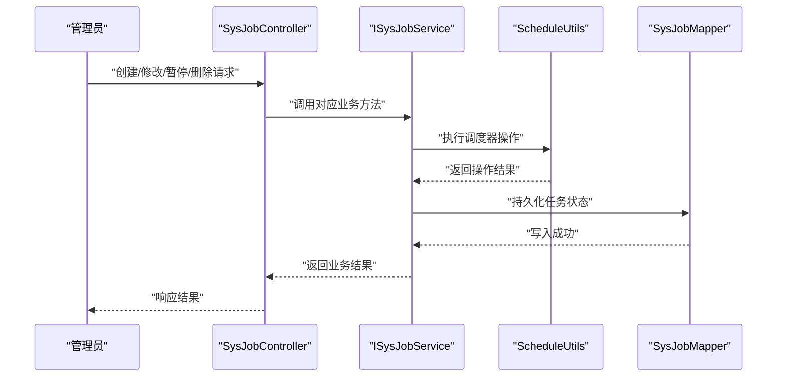
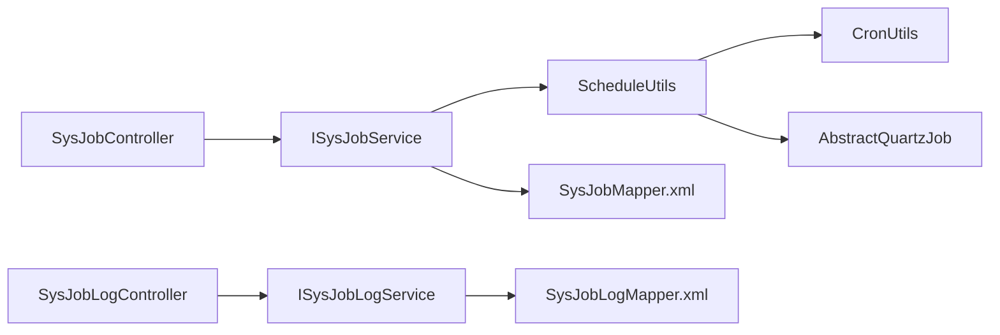

# Quartz定时任务

<cite>
**本文引用的文件**
- [ScheduleConfig.java](file://XingChen-Vue/xingchen-quartz/src/main/java/com/xingchen/quartz/config/ScheduleConfig.java)
- [ScheduleUtils.java](file://XingChen-Vue/xingchen-quartz/src/main/java/com/xingchen/quartz/util/ScheduleUtils.java)
- [CronUtils.java](file://XingChen-Vue/xingchen-quartz/src/main/java/com/xingchen/quartz/util/CronUtils.java)
- [SysJob.java](file://XingChen-Vue/xingchen-quartz/src/main/java/com/xingchen/quartz/domain/SysJob.java)
- [SysJobLog.java](file://XingChen-Vue/xingchen-quartz/src/main/java/com/xingchen/quartz/domain/SysJobLog.java)
- [SysJobController.java](file://XingChen-Vue/xingchen-quartz/src/main/java/com/xingchen/quartz/controller/SysJobController.java)
- [SysJobLogController.java](file://XingChen-Vue/xingchen-quartz/src/main/java/com/xingchen/quartz/controller/SysJobLogController.java)
- [ISysJobService.java](file://XingChen-Vue/xingchen-quartz/src/main/java/com/xingchen/quartz/service/ISysJobService.java)
- [ISysJobLogService.java](file://XingChen-Vue/xingchen-quartz/src/main/java/com/xingchen/quartz/service/ISysJobLogService.java)
- [AbstractQuartzJob.java](file://XingChen-Vue/xingchen-quartz/src/main/java/com/xingchen/quartz/util/AbstractQuartzJob.java)
- [QuartzDisallowConcurrentExecution.java](file://XingChen-Vue/xingchen-quartz/src/main/java/com/xingchen/quartz/util/QuartzDisallowConcurrentExecution.java)
- [QuartzJobExecution.java](file://XingChen-Vue/xingchen-quartz/src/main/java/com/xingchen/quartz/util/QuartzJobExecution.java)
- [RyTask.java](file://XingChen-Vue/xingchen-quartz/src/main/java/com/xingchen/quartz/task/RyTask.java)
- [SysJobMapper.java](file://XingChen-Vue/xingchen-quartz/src/main/resources/mapper/quartz/SysJobMapper.xml)
- [SysJobLogMapper.java](file://XingChen-Vue/xingchen-quartz/src/main/resources/mapper/quartz/SysJobLogMapper.xml)
- [quartz.sql](file://XingChen-Vue/doc/sql/quartz.sql)
- [application.yml](file://XingChen-Vue/xingchen-admin/src/main/resources/application.yml)
</cite>

## 目录
1. [简介](#简介)
2. [项目结构](#项目结构)
3. [核心组件](#核心组件)
4. [架构总览](#架构总览)
5. [详细组件分析](#详细组件分析)
6. [依赖关系分析](#依赖关系分析)
7. [性能考虑](#性能考虑)
8. [故障排查指南](#故障排查指南)
9. [结论](#结论)
10. [附录](#附录)

## 简介
本文件系统性梳理了基于Quartz的定时任务子系统，涵盖配置类ScheduleConfig、Cron表达式解析、任务工具类ScheduleUtils、实体SysJob与SysJobLog及其持久化策略，并给出任务的创建、修改、暂停与删除流程；同时提供Cron表达式语法详解与常见需求实现方案，以及调度监控、日志记录与异常处理机制。

## 项目结构
Quartz相关模块位于xingchen-quartz工程中，采用按功能分层组织：配置、控制器、领域模型、服务、工具类与MyBatis映射文件。系统通过ScheduleConfig启用Quartz调度器，ScheduleUtils封装任务CRUD操作，CronUtils负责Cron表达式解析，SysJob与SysJobLog分别承载任务定义与执行日志，控制器提供REST接口，服务层协调业务与持久化。

图表来源
- [ScheduleConfig.java](file://XingChen-Vue/xingchen-quartz/src/main/java/com/xingchen/quartz/config/ScheduleConfig.java)
- [ScheduleUtils.java](file://XingChen-Vue/xingchen-quartz/src/main/java/com/xingchen/quartz/util/ScheduleUtils.java)
- [CronUtils.java](file://XingChen-Vue/xingchen-quartz/src/main/java/com/xingchen/quartz/util/CronUtils.java)
- [AbstractQuartzJob.java](file://XingChen-Vue/xingchen-quartz/src/main/java/com/xingchen/quartz/util/AbstractQuartzJob.java)
- [QuartzDisallowConcurrentExecution.java](file://XingChen-Vue/xingchen-quartz/src/main/java/com/xingchen/quartz/util/QuartzDisallowConcurrentExecution.java)
- [QuartzJobExecution.java](file://XingChen-Vue/xingchen-quartz/src/main/java/com/xingchen/quartz/util/QuartzJobExecution.java)
- [SysJob.java](file://XingChen-Vue/xingchen-quartz/src/main/java/com/xingchen/quartz/domain/SysJob.java)
- [SysJobLog.java](file://XingChen-Vue/xingchen-quartz/src/main/java/com/xingchen/quartz/domain/SysJobLog.java)
- [SysJobController.java](file://XingChen-Vue/xingchen-quartz/src/main/java/com/xingchen/quartz/controller/SysJobController.java)
- [SysJobLogController.java](file://XingChen-Vue/xingchen-quartz/src/main/java/com/xingchen/quartz/controller/SysJobLogController.java)
- [ISysJobService.java](file://XingChen-Vue/xingchen-quartz/src/main/java/com/xingchen/quartz/service/ISysJobService.java)
- [ISysJobLogService.java](file://XingChen-Vue/xingchen-quartz/src/main/java/com/xingchen/quartz/service/ISysJobLogService.java)
- [SysJobMapper.java](file://XingChen-Vue/xingchen-quartz/src/main/resources/mapper/quartz/SysJobMapper.xml)
- [SysJobLogMapper.java](file://XingChen-Vue/xingchen-quartz/src/main/resources/mapper/quartz/SysJobLogMapper.xml)

章节来源
- [ScheduleConfig.java](file://XingChen-Vue/xingchen-quartz/src/main/java/com/xingchen/quartz/config/ScheduleConfig.java)
- [ScheduleUtils.java](file://XingChen-Vue/xingchen-quartz/src/main/java/com/xingchen/quartz/util/ScheduleUtils.java)
- [CronUtils.java](file://XingChen-Vue/xingchen-quartz/src/main/java/com/xingchen/quartz/util/CronUtils.java)
- [SysJob.java](file://XingChen-Vue/xingchen-quartz/src/main/java/com/xingchen/quartz/domain/SysJob.java)
- [SysJobLog.java](file://XingChen-Vue/xingchen-quartz/src/main/java/com/xingchen/quartz/domain/SysJobLog.java)
- [SysJobController.java](file://XingChen-Vue/xingchen-quartz/src/main/java/com/xingchen/quartz/controller/SysJobController.java)
- [SysJobLogController.java](file://XingChen-Vue/xingchen-quartz/src/main/java/com/xingchen/quartz/controller/SysJobLogController.java)
- [ISysJobService.java](file://XingChen-Vue/xingchen-quartz/src/main/java/com/xingchen/quartz/service/ISysJobService.java)
- [ISysJobLogService.java](file://XingChen-Vue/xingchen-quartz/src/main/java/com/xingchen/quartz/service/ISysJobLogService.java)
- [SysJobMapper.java](file://XingChen-Vue/xingchen-quartz/src/main/resources/mapper/quartz/SysJobMapper.xml)
- [SysJobLogMapper.java](file://XingChen-Vue/xingchen-quartz/src/main/resources/mapper/quartz/SysJobLogMapper.xml)

## 核心组件
- 配置类ScheduleConfig：初始化Quartz调度器，设置线程池大小、任务存储方式等，确保系统具备调度能力。
- CronUtils：解析Cron表达式，校验合法性并生成下一次触发时间，为ScheduleUtils提供解析支持。
- ScheduleUtils：封装Quartz任务的CRUD操作（创建、修改、暂停、恢复、删除），统一调度生命周期管理。
- 实体SysJob：任务定义，包含任务名称、Bean参数、方法名、Cron表达式、并发策略、状态等字段。
- 实体SysJobLog：任务执行日志，记录执行时间、结果、异常信息等，用于审计与排障。
- 控制器：SysJobController与SysJobLogController提供REST接口，支撑前端或外部系统对任务进行管理与查询。
- 服务层：ISysJobService与ISysJobLogService定义业务契约，协调数据访问与调度器交互。
- 抽象作业与执行包装：AbstractQuartzJob定义作业骨架，QuartzDisallowConcurrentExecution与QuartzJobExecution分别处理并发与执行包装。

章节来源
- [ScheduleConfig.java](file://XingChen-Vue/xingchen-quartz/src/main/java/com/xingchen/quartz/config/ScheduleConfig.java)
- [CronUtils.java](file://XingChen-Vue/xingchen-quartz/src/main/java/com/xingchen/quartz/util/CronUtils.java)
- [ScheduleUtils.java](file://XingChen-Vue/xingchen-quartz/src/main/java/com/xingchen/quartz/util/ScheduleUtils.java)
- [SysJob.java](file://XingChen-Vue/xingchen-quartz/src/main/java/com/xingchen/quartz/domain/SysJob.java)
- [SysJobLog.java](file://XingChen-Vue/xingchen-quartz/src/main/java/com/xingchen/quartz/domain/SysJobLog.java)
- [SysJobController.java](file://XingChen-Vue/xingchen-quartz/src/main/java/com/xingchen/quartz/controller/SysJobController.java)
- [SysJobLogController.java](file://XingChen-Vue/xingchen-quartz/src/main/java/com/xingchen/quartz/controller/SysJobLogController.java)
- [ISysJobService.java](file://XingChen-Vue/xingchen-quartz/src/main/java/com/xingchen/quartz/service/ISysJobService.java)
- [ISysJobLogService.java](file://XingChen-Vue/xingchen-quartz/src/main/java/com/xingchen/quartz/service/ISysJobLogService.java)
- [AbstractQuartzJob.java](file://XingChen-Vue/xingchen-quartz/src/main/java/com/xingchen/quartz/util/AbstractQuartzJob.java)
- [QuartzDisallowConcurrentExecution.java](file://XingChen-Vue/xingchen-quartz/src/main/java/com/xingchen/quartz/util/QuartzDisallowConcurrentExecution.java)
- [QuartzJobExecution.java](file://XingChen-Vue/xingchen-quartz/src/main/java/com/xingchen/quartz/util/QuartzJobExecution.java)

## 架构总览
系统通过ScheduleConfig完成Quartz初始化，ScheduleUtils在业务层统一调度任务生命周期，CronUtils保障Cron表达式的正确性。SysJob与SysJobLog通过MyBatis映射到数据库，控制器提供对外接口，服务层协调调度器与持久化。

图表来源
- [SysJobController.java](file://XingChen-Vue/xingchen-quartz/src/main/java/com/xingchen/quartz/controller/SysJobController.java)
- [ISysJobService.java](file://XingChen-Vue/xingchen-quartz/src/main/java/com/xingchen/quartz/service/ISysJobService.java)
- [ScheduleUtils.java](file://XingChen-Vue/xingchen-quartz/src/main/java/com/xingchen/quartz/util/ScheduleUtils.java)
- [CronUtils.java](file://XingChen-Vue/xingchen-quartz/src/main/java/com/xingchen/quartz/util/CronUtils.java)
- [SysJobMapper.java](file://XingChen-Vue/xingchen-quartz/src/main/resources/mapper/quartz/SysJobMapper.xml)
- [SysJobLogMapper.java](file://XingChen-Vue/xingchen-quartz/src/main/resources/mapper/quartz/SysJobLogMapper.xml)

## 详细组件分析

### ScheduleConfig配置类
- 职责：初始化Quartz调度器，配置线程池、任务存储、作业工厂等。
- 关键点：确保调度器单例、线程池容量合理、持久化存储策略（如内存或数据库）可配置。
- 影响范围：所有定时任务的运行基础。

章节来源
- [ScheduleConfig.java](file://XingChen-Vue/xingchen-quartz/src/main/java/com/xingchen/quartz/config/ScheduleConfig.java)

### Cron表达式解析机制（CronUtils）
- 功能：校验Cron表达式格式，计算下一次触发时间，支持常见表达式变体。
- 复杂度：解析过程与表达式长度成正比，通常O(n)。
- 错误处理：非法表达式抛出异常，由上层捕获并反馈给调用方。
- 性能：解析逻辑轻量，适合高频调用。

图表来源
- [CronUtils.java](file://XingChen-Vue/xingchen-quartz/src/main/java/com/xingchen/quartz/util/CronUtils.java)

章节来源
- [CronUtils.java](file://XingChen-Vue/xingchen-quartz/src/main/java/com/xingchen/quartz/util/CronUtils.java)

### ScheduleUtils任务工具类
- 职责：封装Quartz任务的创建、修改、暂停、恢复、删除等操作，屏蔽底层调度器细节。
- 并发策略：结合QuartzDisallowConcurrentExecution实现禁止并发执行的任务类型。
- 执行包装：通过QuartzJobExecution统一封装反射调用与异常处理。
- 生命周期：与SysJob状态字段联动，保证数据库状态与调度器状态一致。

图表来源
- [ScheduleUtils.java](file://XingChen-Vue/xingchen-quartz/src/main/java/com/xingchen/quartz/util/ScheduleUtils.java)
- [AbstractQuartzJob.java](file://XingChen-Vue/xingchen-quartz/src/main/java/com/xingchen/quartz/util/AbstractQuartzJob.java)
- [QuartzDisallowConcurrentExecution.java](file://XingChen-Vue/xingchen-quartz/src/main/java/com/xingchen/quartz/util/QuartzDisallowConcurrentExecution.java)
- [QuartzJobExecution.java](file://XingChen-Vue/xingchen-quartz/src/main/java/com/xingchen/quartz/util/QuartzJobExecution.java)

章节来源
- [ScheduleUtils.java](file://XingChen-Vue/xingchen-quartz/src/main/java/com/xingchen/quartz/util/ScheduleUtils.java)
- [AbstractQuartzJob.java](file://XingChen-Vue/xingchen-quartz/src/main/java/com/xingchen/quartz/util/AbstractQuartzJob.java)
- [QuartzDisallowConcurrentExecution.java](file://XingChen-Vue/xingchen-quartz/src/main/java/com/xingchen/quartz/util/QuartzDisallowConcurrentExecution.java)
- [QuartzJobExecution.java](file://XingChen-Vue/xingchen-quartz/src/main/java/com/xingchen/quartz/util/QuartzJobExecution.java)

### SysJob与SysJobLog实体设计与持久化策略
- SysJob字段要点：任务标识、Bean名称、方法名、方法参数、Cron表达式、并发策略、状态、备注、创建/更新时间等。
- SysJobLog字段要点：任务标识、开始/结束时间、执行结果、异常信息、耗时等。
- 持久化策略：通过MyBatis XML映射文件实现增删改查；SysJobLog用于审计与排障，建议定期归档或清理历史数据以控制表规模。
- 约束与索引：建议在任务状态、Cron表达式、创建时间等字段建立索引以提升查询效率。

图表来源
- [SysJob.java](file://XingChen-Vue/xingchen-quartz/src/main/java/com/xingchen/quartz/domain/SysJob.java)
- [SysJobLog.java](file://XingChen-Vue/xingchen-quartz/src/main/java/com/xingchen/quartz/domain/SysJobLog.java)
- [SysJobMapper.java](file://XingChen-Vue/xingchen-quartz/src/main/resources/mapper/quartz/SysJobMapper.xml)
- [SysJobLogMapper.java](file://XingChen-Vue/xingchen-quartz/src/main/resources/mapper/quartz/SysJobLogMapper.xml)

章节来源
- [SysJob.java](file://XingChen-Vue/xingchen-quartz/src/main/java/com/xingchen/quartz/domain/SysJob.java)
- [SysJobLog.java](file://XingChen-Vue/xingchen-quartz/src/main/java/com/xingchen/quartz/domain/SysJobLog.java)
- [SysJobMapper.java](file://XingChen-Vue/xingchen-quartz/src/main/resources/mapper/quartz/SysJobMapper.xml)
- [SysJobLogMapper.java](file://XingChen-Vue/xingchen-quartz/src/main/resources/mapper/quartz/SysJobLogMapper.xml)

### 任务调度监控、日志记录与异常处理
- 监控：SysJobLog记录每次执行的开始/结束时间、耗时与状态，便于统计与告警。
- 日志：异常信息完整落库，支持前端展示与问题定位。
- 异常处理：通过QuartzJobExecution统一捕获反射调用异常，转换为业务可识别的状态码与消息。

章节来源
- [SysJobLog.java](file://XingChen-Vue/xingchen-quartz/src/main/java/com/xingchen/quartz/domain/SysJobLog.java)
- [QuartzJobExecution.java](file://XingChen-Vue/xingchen-quartz/src/main/java/com/xingchen/quartz/util/QuartzJobExecution.java)

### Cron表达式语法详解与常见需求
- 语法组成：秒 分 时 日 月 周 年（可选）。支持通配符*、步长/、范围-、指定列表,、问号?、最后一个L、工作日W、最后一天L、第几个X周的最后一个D等。
- 常见需求示例（不展示具体表达式内容，仅说明场景）：
  - 每分钟执行：秒位设为0，分位通配，时日月周均通配。
  - 每天固定时间执行：日月周设为?，时分设为固定值。
  - 每周一9点执行：日月周中周几为1，时分设为9:00，其他位通配。
  - 每月最后一天23:59执行：日为L，时分23:59，其他位通配。
  - 工作日9:30执行：周为1-5，时分9:30，其他位通配。
- 注意事项：周与日不能同时为具体值；年份字段可省略；表达式过短会导致解析失败。

章节来源
- [CronUtils.java](file://XingChen-Vue/xingchen-quartz/src/main/java/com/xingchen/quartz/util/CronUtils.java)

### 任务的创建、修改、暂停与删除流程
- 创建：校验Cron表达式 → 通过ScheduleUtils创建任务 → 写入SysJob → 返回创建结果。
- 修改：校验新Cron表达式 → 通过ScheduleUtils更新触发器 → 更新SysJob → 返回修改结果。
- 暂停：通过ScheduleUtils暂停任务 → 更新SysJob状态为暂停 → 记录日志。
- 删除：通过ScheduleUtils删除任务 → 清理SysJob与SysJobLog相关记录 → 返回删除结果。
- 恢复：通过ScheduleUtils恢复任务 → 更新SysJob状态为正常 → 记录日志。

图表来源
- [SysJobController.java](file://XingChen-Vue/xingchen-quartz/src/main/java/com/xingchen/quartz/controller/SysJobController.java)
- [ISysJobService.java](file://XingChen-Vue/xingchen-quartz/src/main/java/com/xingchen/quartz/service/ISysJobService.java)
- [ScheduleUtils.java](file://XingChen-Vue/xingchen-quartz/src/main/java/com/xingchen/quartz/util/ScheduleUtils.java)
- [SysJobMapper.java](file://XingChen-Vue/xingchen-quartz/src/main/resources/mapper/quartz/SysJobMapper.xml)

章节来源
- [SysJobController.java](file://XingChen-Vue/xingchen-quartz/src/main/java/com/xingchen/quartz/controller/SysJobController.java)
- [ISysJobService.java](file://XingChen-Vue/xingchen-quartz/src/main/java/com/xingchen/quartz/service/ISysJobService.java)
- [ScheduleUtils.java](file://XingChen-Vue/xingchen-quartz/src/main/java/com/xingchen/quartz/util/ScheduleUtils.java)
- [SysJobMapper.java](file://XingChen-Vue/xingchen-quartz/src/main/resources/mapper/quartz/SysJobMapper.xml)

## 依赖关系分析
- 组件耦合：ScheduleUtils依赖CronUtils与AbstractQuartzJob；控制器依赖服务接口；服务依赖Mapper与ScheduleUtils。
- 外部依赖：Quartz调度器、MyBatis ORM、数据库连接池。
- 循环依赖：未发现循环依赖，职责边界清晰。

图表来源
- [SysJobController.java](file://XingChen-Vue/xingchen-quartz/src/main/java/com/xingchen/quartz/controller/SysJobController.java)
- [SysJobLogController.java](file://XingChen-Vue/xingchen-quartz/src/main/java/com/xingchen/quartz/controller/SysJobLogController.java)
- [ISysJobService.java](file://XingChen-Vue/xingchen-quartz/src/main/java/com/xingchen/quartz/service/ISysJobService.java)
- [ISysJobLogService.java](file://XingChen-Vue/xingchen-quartz/src/main/java/com/xingchen/quartz/service/ISysJobLogService.java)
- [ScheduleUtils.java](file://XingChen-Vue/xingchen-quartz/src/main/java/com/xingchen/quartz/util/ScheduleUtils.java)
- [CronUtils.java](file://XingChen-Vue/xingchen-quartz/src/main/java/com/xingchen/quartz/util/CronUtils.java)
- [AbstractQuartzJob.java](file://XingChen-Vue/xingchen-quartz/src/main/java/com/xingchen/quartz/util/AbstractQuartzJob.java)
- [SysJobMapper.java](file://XingChen-Vue/xingchen-quartz/src/main/resources/mapper/quartz/SysJobMapper.xml)
- [SysJobLogMapper.java](file://XingChen-Vue/xingchen-quartz/src/main/resources/mapper/quartz/SysJobLogMapper.xml)

章节来源
- [SysJobController.java](file://XingChen-Vue/xingchen-quartz/src/main/java/com/xingchen/quartz/controller/SysJobController.java)
- [SysJobLogController.java](file://XingChen-Vue/xingchen-quartz/src/main/java/com/xingchen/quartz/controller/SysJobLogController.java)
- [ISysJobService.java](file://XingChen-Vue/xingchen-quartz/src/main/java/com/xingchen/quartz/service/ISysJobService.java)
- [ISysJobLogService.java](file://XingChen-Vue/xingchen-quartz/src/main/java/com/xingchen/quartz/service/ISysJobLogService.java)
- [ScheduleUtils.java](file://XingChen-Vue/xingchen-quartz/src/main/java/com/xingchen/quartz/util/ScheduleUtils.java)
- [CronUtils.java](file://XingChen-Vue/xingchen-quartz/src/main/java/com/xingchen/quartz/util/CronUtils.java)
- [AbstractQuartzJob.java](file://XingChen-Vue/xingchen-quartz/src/main/java/com/xingchen/quartz/util/AbstractQuartzJob.java)
- [SysJobMapper.java](file://XingChen-Vue/xingchen-quartz/src/main/resources/mapper/quartz/SysJobMapper.xml)
- [SysJobLogMapper.java](file://XingChen-Vue/xingchen-quartz/src/main/resources/mapper/quartz/SysJobLogMapper.xml)

## 性能考虑
- Cron解析：表达式解析为轻量级操作，但频繁校验可能带来开销，建议缓存合法表达式与下一次触发时间。
- 并发控制：对需要串行执行的任务启用并发控制，避免资源竞争；对高吞吐任务评估线程池大小与队列长度。
- 数据持久化：SysJobLog体量增长较快，建议按月归档或清理策略，限制查询范围；为常用查询字段建立索引。
- 调度器优化：合理设置线程池大小，避免过多上下文切换；对大量任务采用分批加载与延迟初始化。

## 故障排查指南
- Cron表达式错误：检查表达式格式与取值范围，优先使用CronUtils进行校验。
- 任务无法启动：确认SysJob状态为正常，检查调度器是否已初始化，查看SysJobLog中的异常信息。
- 并发冲突：若出现任务堆积，检查并发策略配置与线程池饱和情况。
- 数据不一致：核对数据库状态与调度器状态，必要时通过ScheduleUtils进行修复同步。

章节来源
- [CronUtils.java](file://XingChen-Vue/xingchen-quartz/src/main/java/com/xingchen/quartz/util/CronUtils.java)
- [SysJobLog.java](file://XingChen-Vue/xingchen-quartz/src/main/java/com/xingchen/quartz/domain/SysJobLog.java)
- [ScheduleUtils.java](file://XingChen-Vue/xingchen-quartz/src/main/java/com/xingchen/quartz/util/ScheduleUtils.java)

## 结论
该Quartz定时任务子系统通过清晰的分层设计与完善的工具链，实现了从配置、调度、持久化到监控与异常处理的全栈能力。ScheduleConfig、CronUtils与ScheduleUtils构成调度核心，SysJob与SysJobLog提供完整的任务与审计能力。遵循本文提供的流程与最佳实践，可在生产环境中稳定运行各类定时任务。

## 附录
- 数据库脚本：quartz.sql定义了调度相关表结构，建议在初始化环境时导入。
- 应用配置：application.yml中包含Quartz相关配置项，需根据部署环境调整线程池与持久化策略。

章节来源
- [quartz.sql](file://XingChen-Vue/doc/sql/quartz.sql)
- [application.yml](file://XingChen-Vue/xingchen-admin/src/main/resources/application.yml)