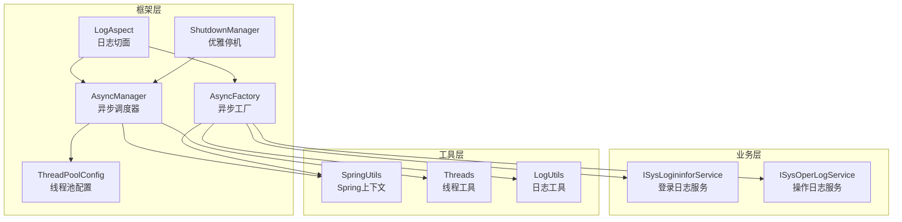
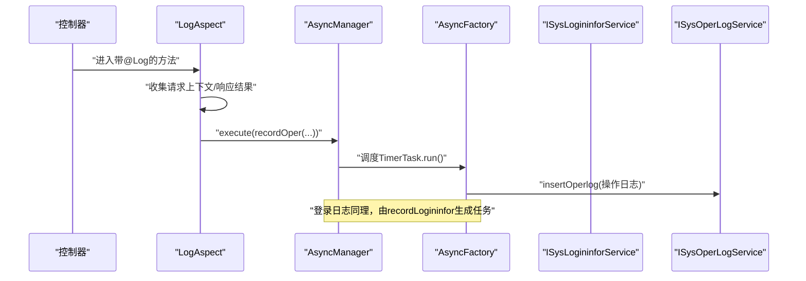
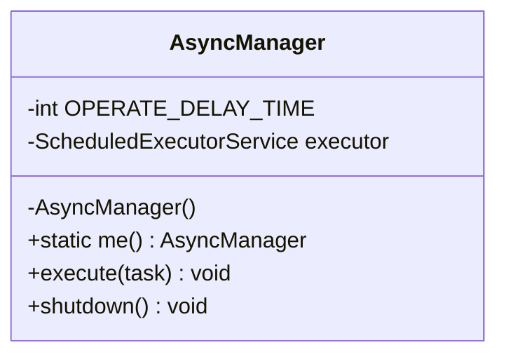
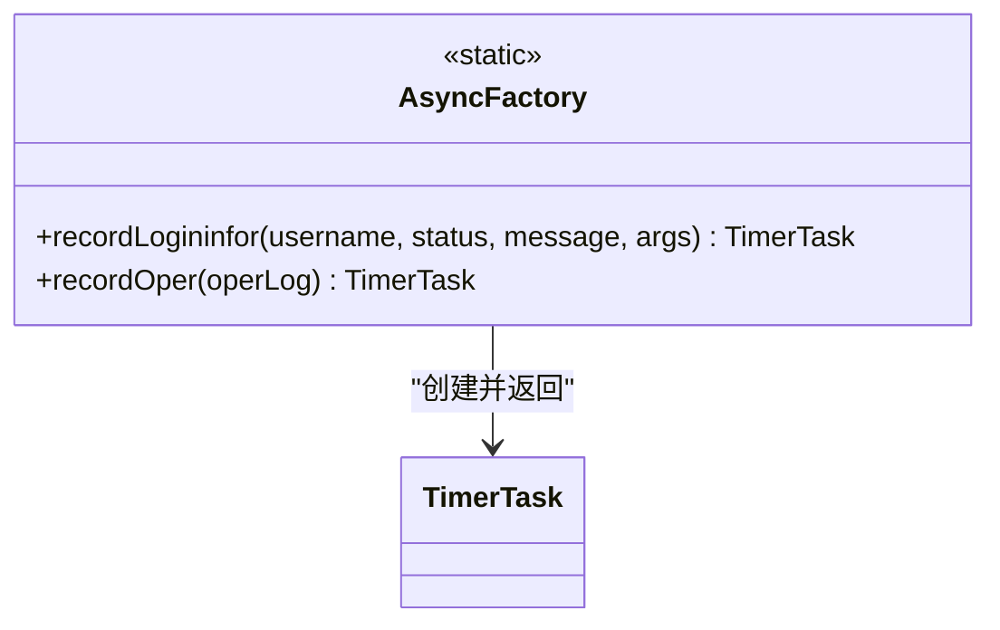
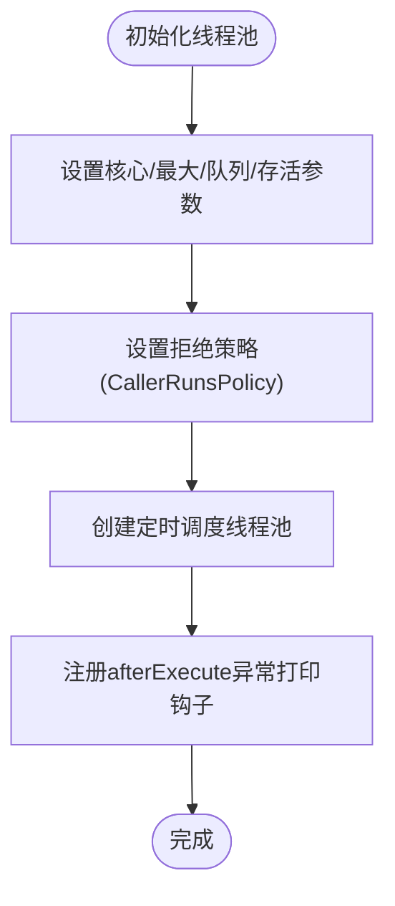
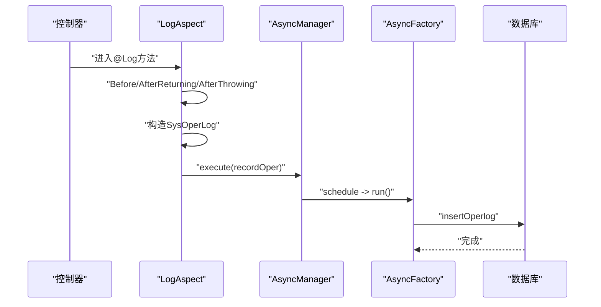
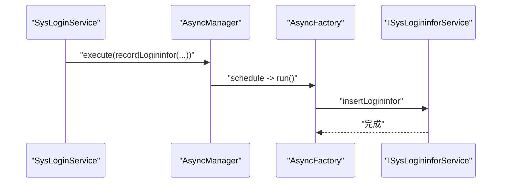
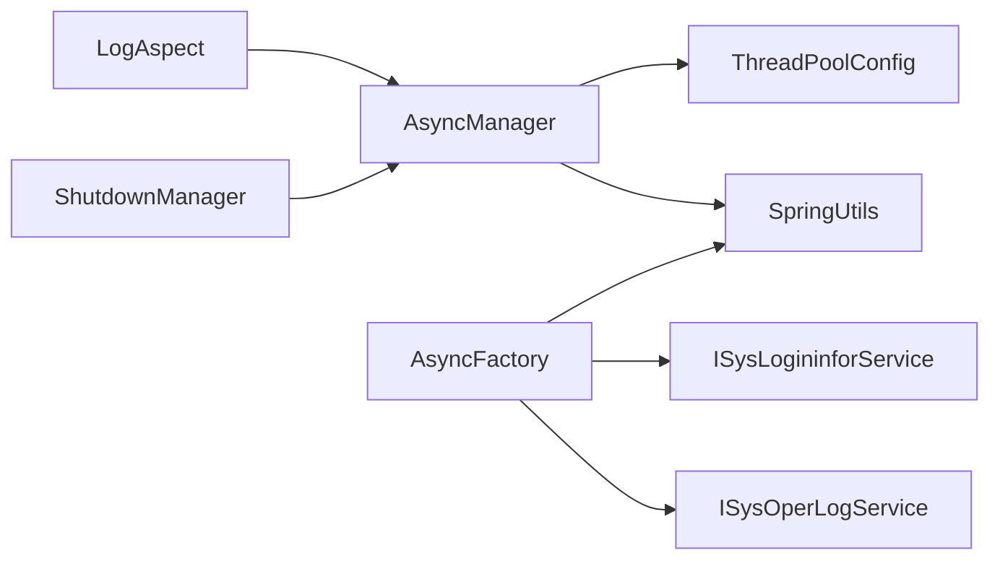

# 异步任务管理

<cite>
**本文引用的文件**
- [AsyncManager.java](file://XingChen-Vue/xingchen-framework/src/main/java/com/xingchen/framework/manager/AsyncManager.java)
- [AsyncFactory.java](file://XingChen-Vue/xingchen-framework/src/main/java/com/xingchen/framework/manager/factory/AsyncFactory.java)
- [ThreadPoolConfig.java](file://XingChen-Vue/xingchen-framework/src/main/java/com/xingchen/framework/config/ThreadPoolConfig.java)
- [LogAspect.java](file://XingChen-Vue/xingchen-framework/src/main/java/com/xingchen/framework/aspectj/LogAspect.java)
- [SysLoginService.java](file://XingChen-Vue/xingchen-framework/src/main/java/com/xingchen/framework/web/service/SysLoginService.java)
- [LogoutSuccessHandlerImpl.java](file://XingChen-Vue/xingchen-framework/src/main/java/com/xingchen/framework/security/handle/LogoutSuccessHandlerImpl.java)
- [ShutdownManager.java](file://XingChen-Vue/xingchen-framework/src/main/java/com/xingchen/framework/manager/ShutdownManager.java)
</cite>

## 目录
1. [简介](#简介)
2. [项目结构](#项目结构)
3. [核心组件](#核心组件)
4. [架构总览](#架构总览)
5. [详细组件分析](#详细组件分析)
6. [依赖关系分析](#依赖关系分析)
7. [性能考量](#性能考量)
8. [故障排查指南](#故障排查指南)
9. [结论](#结论)
10. [附录](#附录)

## 简介
本文件系统化梳理健康管理系统中的异步任务管理机制，重点覆盖以下内容：
- AsyncManager 异步任务调度器：单例调度器，基于 ScheduledExecutorService 的任务提交与延迟执行，以及优雅停机流程。
- AsyncFactory 工厂类：封装具体异步任务（如登录日志、操作日志）的创建与执行逻辑，屏蔽业务细节。
- 线程池配置：ThreadPoolConfig 提供线程池与定时调度线程池的统一配置，并内置异常打印钩子。
- 注解与切面：通过 LogAspect 切面在控制器方法前后收集上下文并异步落库，体现“异步方法”的执行策略与结果处理。
- 监控、异常捕获与重试：线程池拒绝策略、异常打印钩子、优雅停机保障系统稳定。

## 项目结构
围绕异步任务管理的相关模块分布如下：
- framework 层负责异步调度与工厂、线程池配置、切面与安全处理器等
- common 层提供工具类（如 SpringUtils、Threads、LogUtils 等）
- system 层提供业务实体与服务接口（如 SysLogininfor、SysOperLog 及其服务）

图表来源
- [AsyncManager.java:14-55](file://XingChen-Vue/xingchen-framework/src/main/java/com/xingchen/framework/manager/AsyncManager.java#L14-L55)
- [AsyncFactory.java:24-102](file://XingChen-Vue/xingchen-framework/src/main/java/com/xingchen/framework/manager/factory/AsyncFactory.java#L24-L102)
- [ThreadPoolConfig.java:18-63](file://XingChen-Vue/xingchen-framework/src/main/java/com/xingchen/framework/config/ThreadPoolConfig.java#L18-L63)
- [LogAspect.java:41-140](file://XingChen-Vue/xingchen-framework/src/main/java/com/xingchen/framework/aspectj/LogAspect.java#L41-L140)
- [ShutdownManager.java:14-39](file://XingChen-Vue/xingchen-framework/src/main/java/com/xingchen/framework/manager/ShutdownManager.java#L14-L39)

章节来源
- [AsyncManager.java:14-55](file://XingChen-Vue/xingchen-framework/src/main/java/com/xingchen/framework/manager/AsyncManager.java#L14-L55)
- [ThreadPoolConfig.java:18-63](file://XingChen-Vue/xingchen-framework/src/main/java/com/xingchen/framework/config/ThreadPoolConfig.java#L18-L63)

## 核心组件
- AsyncManager：单例调度器，负责将 TimerTask 任务按固定延迟提交至 ScheduledExecutorService 执行，并提供优雅停机能力。
- AsyncFactory：静态工厂，生成具体的异步任务（如登录日志、操作日志），内部完成 IP 地址解析、UA 解析、日志落库等。
- ThreadPoolConfig：定义线程池与定时调度线程池，设置容量、队列、存活时间与拒绝策略，并在调度线程池中注册异常打印钩子。
- LogAspect：面向控制器的切面，收集请求上下文与响应结果，构造 SysOperLog 并通过 AsyncManager 异步提交至 AsyncFactory 执行持久化。
- ShutdownManager：应用销毁阶段触发，调用 AsyncManager 关闭调度线程池，确保资源回收。

章节来源
- [AsyncManager.java:14-55](file://XingChen-Vue/xingchen-framework/src/main/java/com/xingchen/framework/manager/AsyncManager.java#L14-L55)
- [AsyncFactory.java:24-102](file://XingChen-Vue/xingchen-framework/src/main/java/com/xingchen/framework/manager/factory/AsyncFactory.java#L24-L102)
- [ThreadPoolConfig.java:18-63](file://XingChen-Vue/xingchen-framework/src/main/java/com/xingchen/framework/config/ThreadPoolConfig.java#L18-L63)
- [LogAspect.java:41-140](file://XingChen-Vue/xingchen-framework/src/main/java/com/xingchen/framework/aspectj/LogAspect.java#L41-L140)
- [ShutdownManager.java:14-39](file://XingChen-Vue/xingchen-framework/src/main/java/com/xingchen/framework/manager/ShutdownManager.java#L14-L39)

## 架构总览
异步任务从“切面收集上下文”到“调度器提交任务”，再到“工厂执行业务”的完整链路如下：

图表来源
- [LogAspect.java:88-140](file://XingChen-Vue/xingchen-framework/src/main/java/com/xingchen/framework/aspectj/LogAspect.java#L88-L140)
- [AsyncManager.java:43-46](file://XingChen-Vue/xingchen-framework/src/main/java/com/xingchen/framework/manager/AsyncManager.java#L43-L46)
- [AsyncFactory.java:89-101](file://XingChen-Vue/xingchen-framework/src/main/java/com/xingchen/framework/manager/factory/AsyncFactory.java#L89-L101)

## 详细组件分析

### AsyncManager 异步调度器
- 单例模式：私有构造与静态实例，提供全局唯一入口。
- 延迟执行：每次提交任务时增加固定延迟，降低瞬时并发压力。
- 调度线程池：从 Spring 上下文获取名为“scheduledExecutorService”的线程池。
- 优雅停机：通过 Threads.shutdownAndAwaitTermination 关闭线程池，避免任务丢失。

图表来源
- [AsyncManager.java:14-55](file://XingChen-Vue/xingchen-framework/src/main/java/com/xingchen/framework/manager/AsyncManager.java#L14-L55)

章节来源
- [AsyncManager.java:14-55](file://XingChen-Vue/xingchen-framework/src/main/java/com/xingchen/framework/manager/AsyncManager.java#L14-L55)

### AsyncFactory 异步工厂
- 登录日志任务：封装 IP、地理位置、浏览器与操作系统信息，根据状态码映射成功/失败，并持久化。
- 操作日志任务：远程解析操作地点，持久化操作日志。
- 任务类型：TimerTask，run 方法内完成 IO 与业务处理，避免阻塞主线程。

图表来源
- [AsyncFactory.java:24-102](file://XingChen-Vue/xingchen-framework/src/main/java/com/xingchen/framework/manager/factory/AsyncFactory.java#L24-L102)

章节来源
- [AsyncFactory.java:24-102](file://XingChen-Vue/xingchen-framework/src/main/java/com/xingchen/framework/manager/factory/AsyncFactory.java#L24-L102)

### 线程池配置 ThreadPoolConfig
- 线程池参数：核心池大小、最大池大小、队列容量、存活时间。
- 拒绝策略：CallerRunsPolicy，当线程池饱和时由调用线程执行，保证不丢任务。
- 定时调度线程池：自定义命名与守护线程，afterExecute 中统一打印异常，便于问题定位。
- 全局 Bean：为 AsyncManager 提供“scheduledExecutorService”。

图表来源
- [ThreadPoolConfig.java:18-63](file://XingChen-Vue/xingchen-framework/src/main/java/com/xingchen/framework/config/ThreadPoolConfig.java#L18-L63)

章节来源
- [ThreadPoolConfig.java:18-63](file://XingChen-Vue/xingchen-framework/src/main/java/com/xingchen/framework/config/ThreadPoolConfig.java#L18-L63)

### 切面与异步方法执行策略
- LogAspect 在方法完成后（包括正常返回与异常抛出）收集上下文，构造 SysOperLog，并通过 AsyncManager 异步提交。
- 执行策略：先同步收集上下文，再异步持久化，避免阻塞请求线程。
- 结果处理：正常路径写入成功状态，异常路径写入失败状态与错误信息。

图表来源
- [LogAspect.java:59-140](file://XingChen-Vue/xingchen-framework/src/main/java/com/xingchen/framework/aspectj/LogAspect.java#L59-L140)
- [AsyncManager.java:43-46](file://XingChen-Vue/xingchen-framework/src/main/java/com/xingchen/framework/manager/AsyncManager.java#L43-L46)
- [AsyncFactory.java:89-101](file://XingChen-Vue/xingchen-framework/src/main/java/com/xingchen/framework/manager/factory/AsyncFactory.java#L89-L101)

章节来源
- [LogAspect.java:59-140](file://XingChen-Vue/xingchen-framework/src/main/java/com/xingchen/framework/aspectj/LogAspect.java#L59-L140)

### 登录场景的异步任务使用
- 登录成功/失败/验证码过期/重复登录等场景均通过 AsyncManager 异步提交 AsyncFactory 的登录日志任务。
- 任务内部完成 IP 解析、UA 解析与状态映射，并持久化到 SysLogininfor。

图表来源
- [SysLoginService.java:81-161](file://XingChen-Vue/xingchen-framework/src/main/java/com/xingchen/framework/web/service/SysLoginService.java#L81-L161)
- [AsyncManager.java:43-46](file://XingChen-Vue/xingchen-framework/src/main/java/com/xingchen/framework/manager/AsyncManager.java#L43-L46)
- [AsyncFactory.java:37-81](file://XingChen-Vue/xingchen-framework/src/main/java/com/xingchen/framework/manager/factory/AsyncFactory.java#L37-L81)

章节来源
- [SysLoginService.java:81-161](file://XingChen-Vue/xingchen-framework/src/main/java/com/xingchen/framework/web/service/SysLoginService.java#L81-L161)

### 注销场景的异步任务使用
- LogoutSuccessHandlerImpl 在用户注销后异步记录登录日志，确保主流程快速返回。

章节来源
- [LogoutSuccessHandlerImpl.java:48](file://XingChen-Vue/xingchen-framework/src/main/java/com/xingchen/framework/security/handle/LogoutSuccessHandlerImpl.java#L48)

### 优雅停机与资源回收
- ShutdownManager 在应用销毁阶段调用 AsyncManager.shutdown，确保定时调度线程池有序关闭。

章节来源
- [ShutdownManager.java:18-38](file://XingChen-Vue/xingchen-framework/src/main/java/com/xingchen/framework/manager/ShutdownManager.java#L18-L38)

## 依赖关系分析
- AsyncManager 依赖 Spring 上下文中的“scheduledExecutorService”与 Threads 工具。
- AsyncFactory 依赖 SpringUtils 获取业务服务接口，完成持久化。
- LogAspect 依赖 AsyncManager 与 AsyncFactory，形成“收集上下文 → 异步提交 → 工厂执行”的闭环。
- ThreadPoolConfig 为 AsyncManager 提供线程池 Bean，并在调度线程池中注入异常打印钩子。

图表来源
- [LogAspect.java:32-33](file://XingChen-Vue/xingchen-framework/src/main/java/com/xingchen/framework/aspectj/LogAspect.java#L32-L33)
- [AsyncManager.java:24](file://XingChen-Vue/xingchen-framework/src/main/java/com/xingchen/framework/manager/AsyncManager.java#L24)
- [AsyncFactory.java:13-17](file://XingChen-Vue/xingchen-framework/src/main/java/com/xingchen/framework/manager/factory/AsyncFactory.java#L13-L17)
- [ThreadPoolConfig.java:48-62](file://XingChen-Vue/xingchen-framework/src/main/java/com/xingchen/framework/config/ThreadPoolConfig.java#L48-L62)
- [ShutdownManager.java:31](file://XingChen-Vue/xingchen-framework/src/main/java/com/xingchen/framework/manager/ShutdownManager.java#L31)

章节来源
- [LogAspect.java:32-33](file://XingChen-Vue/xingchen-framework/src/main/java/com/xingchen/framework/aspectj/LogAspect.java#L32-L33)
- [AsyncManager.java:24](file://XingChen-Vue/xingchen-framework/src/main/java/com/xingchen/framework/manager/AsyncManager.java#L24)
- [AsyncFactory.java:13-17](file://XingChen-Vue/xingchen-framework/src/main/java/com/xingchen/framework/manager/factory/AsyncFactory.java#L13-L17)
- [ThreadPoolConfig.java:48-62](file://XingChen-Vue/xingchen-framework/src/main/java/com/xingchen/framework/config/ThreadPoolConfig.java#L48-L62)
- [ShutdownManager.java:31](file://XingChen-Vue/xingchen-framework/src/main/java/com/xingchen/framework/manager/ShutdownManager.java#L31)

## 性能考量
- 延迟提交：AsyncManager 在每次提交任务时增加固定延迟，有助于平滑突发流量，降低瞬时压力。
- 线程池参数：合理的核心池大小、最大池大小与队列容量，结合 CallerRunsPolicy，可在高负载时保证任务不丢失。
- 异常打印钩子：调度线程池的 afterExecute 统一打印异常，便于快速定位问题，减少隐性失败。
- IO 放置：AsyncFactory 的 run 方法内完成 IO 与业务持久化，避免阻塞请求线程，提升吞吐。

章节来源
- [AsyncManager.java:19](file://XingChen-Vue/xingchen-framework/src/main/java/com/xingchen/framework/manager/AsyncManager.java#L19)
- [ThreadPoolConfig.java:40-42](file://XingChen-Vue/xingchen-framework/src/main/java/com/xingchen/framework/config/ThreadPoolConfig.java#L40-L42)
- [ThreadPoolConfig.java:56-60](file://XingChen-Vue/xingchen-framework/src/main/java/com/xingchen/framework/config/ThreadPoolConfig.java#L56-L60)

## 故障排查指南
- 任务未执行：检查“scheduledExecutorService”Bean 是否正确注册，确认 AsyncManager 是否能从 SpringUtils 获取该 Bean。
- 任务堆积：观察队列容量与任务耗时，必要时调整线程池参数或拆分任务。
- 异常被吞没：关注调度线程池的 afterExecute 钩子输出，定位异常根因。
- 优雅停机失败：确认 ShutdownManager 是否在销毁阶段被调用，AsyncManager 的 shutdown 是否被正确执行。

章节来源
- [AsyncManager.java:24](file://XingChen-Vue/xingchen-framework/src/main/java/com/xingchen/framework/manager/AsyncManager.java#L24)
- [ThreadPoolConfig.java:56-60](file://XingChen-Vue/xingchen-framework/src/main/java/com/xingchen/framework/config/ThreadPoolConfig.java#L56-L60)
- [ShutdownManager.java:27-32](file://XingChen-Vue/xingchen-framework/src/main/java/com/xingchen/framework/manager/ShutdownManager.java#L27-L32)

## 结论
本系统通过 AsyncManager、AsyncFactory 与 ThreadPoolConfig 形成一套轻量、稳定的异步任务体系：切面负责上下文收集与异步提交，调度器负责延迟与执行，工厂负责业务落库。配合线程池的拒绝策略与异常打印钩子，以及优雅停机流程，整体具备良好的可靠性与可观测性。

## 附录
- 开发建议
  - 使用切面自动收集上下文，避免在业务代码中重复编写异步落库逻辑。
  - 对耗时 IO 放置于 AsyncFactory 的 run 方法内，保持请求线程快速返回。
  - 合理设置线程池参数，结合压测结果动态调优。
  - 对关键异步任务增加超时与重试策略（如需），并通过日志与监控进行追踪。
- 性能优化
  - 采用延迟提交平滑流量峰值。
  - 使用 CallerRunsPolicy 保证高负载下的任务不丢失。
  - 定期清理与评估日志落库任务，避免冗余 IO。