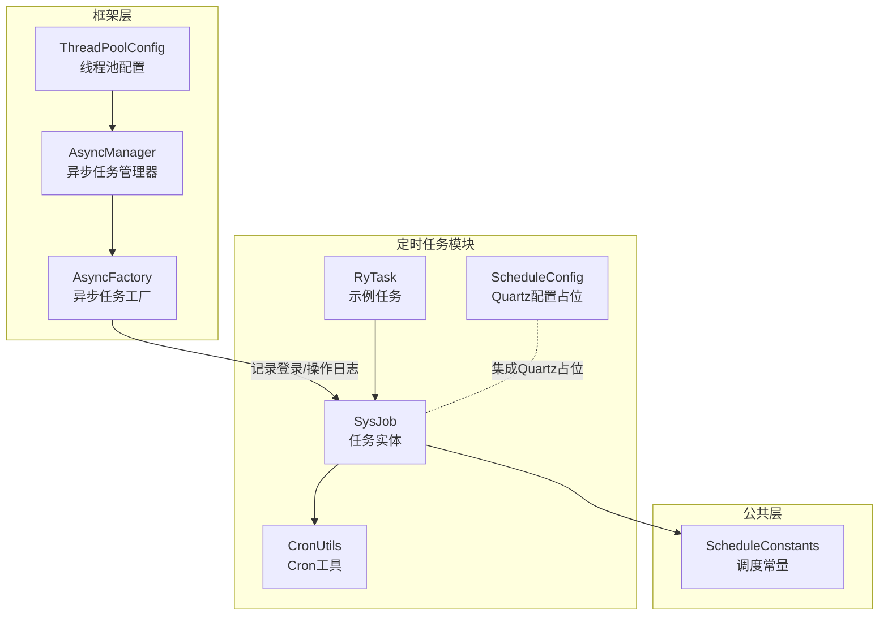
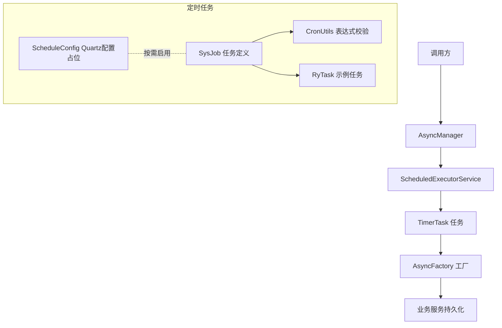
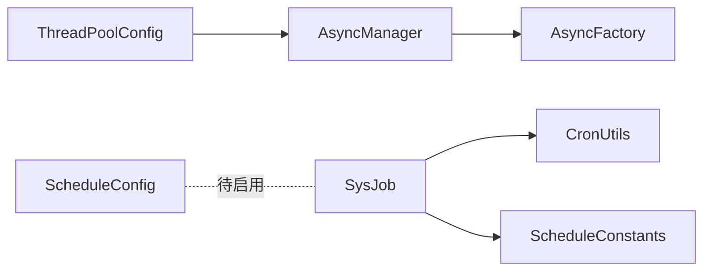

# 异步任务调度

<cite>
**本文引用的文件**
- [ThreadPoolConfig.java](file://XingChen-Vue/xingchen-framework/src/main/java/com/xingchen/framework/config/ThreadPoolConfig.java)
- [AsyncManager.java](file://XingChen-Vue/xingchen-framework/src/main/java/com/xingchen/framework/manager/AsyncManager.java)
- [AsyncFactory.java](file://XingChen-Vue/xingchen-framework/src/main/java/com/xingchen/framework/manager/factory/AsyncFactory.java)
- [ScheduleConstants.java](file://XingChen-Vue/xingchen-common/src/main/java/com/xingchen/common/constant/ScheduleConstants.java)
- [SysJob.java](file://XingChen-Vue/xingchen-quartz/src/main/java/com/xingchen/quartz/domain/SysJob.java)
- [RyTask.java](file://XingChen-Vue/xingchen-quartz/src/main/java/com/xingchen/quartz/task/RyTask.java)
- [CronUtils.java](file://XingChen-Vue/xingchen-quartz/src/main/java/com/xingchen/quartz/util/CronUtils.java)
- [ScheduleConfig.java](file://XingChen-Vue/xingchen-quartz/src/main/java/com/xingchen/quartz/config/ScheduleConfig.java)
</cite>

## 目录
1. [简介](#简介)
2. [项目结构](#项目结构)
3. [核心组件](#核心组件)
4. [架构总览](#架构总览)
5. [详细组件分析](#详细组件分析)
6. [依赖分析](#依赖分析)
7. [性能考虑](#性能考虑)
8. [故障排查指南](#故障排查指南)
9. [结论](#结论)
10. [附录](#附录)

## 简介
本文件面向“异步任务调度”主题，系统梳理健康管理系统中已实现的线程池配置、异步任务管理与定时任务调度机制。内容覆盖：
- 线程池配置与拒绝策略
- 异步任务管理器与工厂
- Quartz定时任务框架集成要点（含Cron表达式校验与任务持久化思路）
- 任务调度监控、异常处理与性能调优
- 最佳实践与故障恢复方案

## 项目结构
围绕异步与定时任务，系统主要由以下模块构成：
- 框架层（xingchen-framework）：线程池配置、异步任务管理器与工厂
- 公共常量（xingchen-common）：调度相关常量定义
- 定时任务模块（xingchen-quartz）：Quartz集成示例、任务实体、Cron工具、示例任务等

图表来源
- [ThreadPoolConfig.java:1-64](file://XingChen-Vue/xingchen-framework/src/main/java/com/xingchen/framework/config/ThreadPoolConfig.java#L1-L64)
- [AsyncManager.java:1-56](file://XingChen-Vue/xingchen-framework/src/main/java/com/xingchen/framework/manager/AsyncManager.java#L1-L56)
- [AsyncFactory.java:1-103](file://XingChen-Vue/xingchen-framework/src/main/java/com/xingchen/framework/manager/factory/AsyncFactory.java#L1-L103)
- [ScheduleConstants.java:1-51](file://XingChen-Vue/xingchen-common/src/main/java/com/xingchen/common/constant/ScheduleConstants.java#L1-L51)
- [SysJob.java:1-172](file://XingChen-Vue/xingchen-quartz/src/main/java/com/xingchen/quartz/domain/SysJob.java#L1-L172)
- [RyTask.java:1-29](file://XingChen-Vue/xingchen-quartz/src/main/java/com/xingchen/quartz/task/RyTask.java#L1-L29)
- [CronUtils.java:1-64](file://XingChen-Vue/xingchen-quartz/src/main/java/com/xingchen/quartz/util/CronUtils.java#L1-L64)
- [ScheduleConfig.java:1-58](file://XingChen-Vue/xingchen-quartz/src/main/java/com/xingchen/quartz/config/ScheduleConfig.java#L1-L58)

章节来源
- [ThreadPoolConfig.java:1-64](file://XingChen-Vue/xingchen-framework/src/main/java/com/xingchen/framework/config/ThreadPoolConfig.java#L1-L64)
- [AsyncManager.java:1-56](file://XingChen-Vue/xingchen-framework/src/main/java/com/xingchen/framework/manager/AsyncManager.java#L1-L56)
- [AsyncFactory.java:1-103](file://XingChen-Vue/xingchen-framework/src/main/java/com/xingchen/framework/manager/factory/AsyncFactory.java#L1-L103)
- [ScheduleConstants.java:1-51](file://XingChen-Vue/xingchen-common/src/main/java/com/xingchen/common/constant/ScheduleConstants.java#L1-L51)
- [SysJob.java:1-172](file://XingChen-Vue/xingchen-quartz/src/main/java/com/xingchen/quartz/domain/SysJob.java#L1-L172)
- [RyTask.java:1-29](file://XingChen-Vue/xingchen-quartz/src/main/java/com/xingchen/quartz/task/RyTask.java#L1-L29)
- [CronUtils.java:1-64](file://XingChen-Vue/xingchen-quartz/src/main/java/com/xingchen/quartz/util/CronUtils.java#L1-L64)
- [ScheduleConfig.java:1-58](file://XingChen-Vue/xingchen-quartz/src/main/java/com/xingchen/quartz/config/ScheduleConfig.java#L1-L58)

## 核心组件
- 线程池配置：定义核心线程数、最大线程数、队列容量、空闲存活时间与拒绝策略，确保高并发下的稳定性与可控性。
- 异步任务管理器：封装ScheduledExecutorService，统一调度TimerTask，支持延迟执行与优雅关闭。
- 异步任务工厂：生成具体业务异步任务（如登录日志、操作日志），通过Spring上下文注入服务完成持久化。
- 调度常量：定义Misfire策略、并发控制与任务状态枚举，便于统一管理。
- 定时任务实体：封装任务元数据（名称、分组、Cron表达式、并发策略、状态等），并提供下次执行时间计算。
- Cron工具：提供表达式有效性校验、错误信息获取与下一次执行时间推算。
- Quartz配置占位：提供Quartz集成的参数模板与集群持久化思路（当前为注释状态，便于按需启用）。

章节来源
- [ThreadPoolConfig.java:1-64](file://XingChen-Vue/xingchen-framework/src/main/java/com/xingchen/framework/config/ThreadPoolConfig.java#L1-L64)
- [AsyncManager.java:1-56](file://XingChen-Vue/xingchen-framework/src/main/java/com/xingchen/framework/manager/AsyncManager.java#L1-L56)
- [AsyncFactory.java:1-103](file://XingChen-Vue/xingchen-framework/src/main/java/com/xingchen/framework/manager/factory/AsyncFactory.java#L1-L103)
- [ScheduleConstants.java:1-51](file://XingChen-Vue/xingchen-common/src/main/java/com/xingchen/common/constant/ScheduleConstants.java#L1-L51)
- [SysJob.java:1-172](file://XingChen-Vue/xingchen-quartz/src/main/java/com/xingchen/quartz/domain/SysJob.java#L1-L172)
- [CronUtils.java:1-64](file://XingChen-Vue/xingchen-quartz/src/main/java/com/xingchen/quartz/util/CronUtils.java#L1-L64)
- [ScheduleConfig.java:1-58](file://XingChen-Vue/xingchen-quartz/src/main/java/com/xingchen/quartz/config/ScheduleConfig.java#L1-L58)

## 架构总览
系统采用“线程池+异步任务管理器+工厂”的异步执行模型，并以Quartz作为定时任务调度框架的集成入口。异步任务用于非阻塞记录与日志等场景；定时任务用于周期性或延时触发的业务逻辑。

图表来源
- [AsyncManager.java:1-56](file://XingChen-Vue/xingchen-framework/src/main/java/com/xingchen/framework/manager/AsyncManager.java#L1-L56)
- [AsyncFactory.java:1-103](file://XingChen-Vue/xingchen-framework/src/main/java/com/xingchen/framework/manager/factory/AsyncFactory.java#L1-L103)
- [SysJob.java:1-172](file://XingChen-Vue/xingchen-quartz/src/main/java/com/xingchen/quartz/domain/SysJob.java#L1-L172)
- [CronUtils.java:1-64](file://XingChen-Vue/xingchen-quartz/src/main/java/com/xingchen/quartz/util/CronUtils.java#L1-L64)
- [RyTask.java:1-29](file://XingChen-Vue/xingchen-quartz/src/main/java/com/xingchen/quartz/task/RyTask.java#L1-L29)
- [ScheduleConfig.java:1-58](file://XingChen-Vue/xingchen-quartz/src/main/java/com/xingchen/quartz/config/ScheduleConfig.java#L1-L58)

## 详细组件分析

### 线程池配置（ThreadPoolConfig）
- 关键参数
  - 核心线程数、最大线程数、队列容量、空闲存活时间
  - 拒绝策略：CallerRunsPolicy，当线程池饱和时由调用线程执行，避免任务丢失
- 定时任务线程池
  - 使用ScheduledThreadPoolExecutor，自定义线程命名与守护线程属性
  - afterExecute钩子打印异常，便于问题定位
- 适用场景
  - 高吞吐的异步日志、通知等非CPU密集型任务
  - 需要可控拒绝行为的生产环境

章节来源
- [ThreadPoolConfig.java:1-64](file://XingChen-Vue/xingchen-framework/src/main/java/com/xingchen/framework/config/ThreadPoolConfig.java#L1-L64)

### 异步任务管理器（AsyncManager）
- 设计要点
  - 单例持有ScheduledExecutorService实例
  - 统一延迟调度（毫秒级），降低抖动
  - 提供优雅关闭能力，保障应用停机前的任务收尾
- 使用方式
  - 通过AsyncFactory生成TimerTask，交由AsyncManager调度执行

章节来源
- [AsyncManager.java:1-56](file://XingChen-Vue/xingchen-framework/src/main/java/com/xingchen/framework/manager/AsyncManager.java#L1-L56)

### 异步任务工厂（AsyncFactory）
- 功能职责
  - 生成登录日志记录任务：解析IP、地址、浏览器与操作系统，写入日志并持久化
  - 生成操作日志记录任务：远程查询操作地点并持久化
- 实现特点
  - 使用TimerTask封装业务逻辑
  - 通过SpringUtils获取业务服务进行持久化
  - 使用工具类进行日志格式化与IP地址解析

章节来源
- [AsyncFactory.java:1-103](file://XingChen-Vue/xingchen-framework/src/main/java/com/xingchen/framework/manager/factory/AsyncFactory.java#L1-L103)

### 调度常量（ScheduleConstants）
- Misfire策略
  - 默认、忽略错失、触发一次、不触发立即执行
- 并发控制
  - 允许并发与禁止并发两种模式
- 任务状态
  - 正常与暂停

章节来源
- [ScheduleConstants.java:1-51](file://XingChen-Vue/xingchen-common/src/main/java/com/xingchen/common/constant/ScheduleConstants.java#L1-L51)

### 定时任务实体（SysJob）
- 字段说明
  - 任务ID、名称、分组、调用目标字符串、Cron表达式、Misfire策略、并发策略、状态
- 方法要点
  - 校验Cron表达式合法性
  - 计算下一次有效执行时间
  - 提供标准的toString输出

章节来源
- [SysJob.java:1-172](file://XingChen-Vue/xingchen-quartz/src/main/java/com/xingchen/quartz/domain/SysJob.java#L1-L172)

### Cron工具（CronUtils）
- 能力清单
  - 校验Cron表达式有效性
  - 获取无效表达式的错误信息
  - 推算下一次执行时间
- 应用价值
  - 在任务创建/编辑时即时验证表达式，减少运行期风险

章节来源
- [CronUtils.java:1-64](file://XingChen-Vue/xingchen-quartz/src/main/java/com/xingchen/quartz/util/CronUtils.java#L1-L64)

### Quartz配置占位（ScheduleConfig）
- 当前状态
  - 配置类被注释，未启用
- 预留能力
  - 数据源、线程池、JobStore、集群、表前缀、启动延迟、自动启动等参数
  - 适合需要持久化与集群部署的场景

章节来源
- [ScheduleConfig.java:1-58](file://XingChen-Vue/xingchen-quartz/src/main/java/com/xingchen/quartz/config/ScheduleConfig.java#L1-L58)

### 示例定时任务（RyTask）
- 方法族
  - 无参、有参、多参三种形式，便于演示不同调用方式
- 使用建议
  - 将实际业务逻辑封装在独立组件中，避免直接在任务类中耦合复杂流程

章节来源
- [RyTask.java:1-29](file://XingChen-Vue/xingchen-quartz/src/main/java/com/xingchen/quartz/task/RyTask.java#L1-L29)

## 依赖分析
- 组件内聚与耦合
  - AsyncManager与ThreadPoolConfig强耦合（依赖ScheduledExecutorService Bean）
  - AsyncFactory与业务服务弱耦合（通过SpringUtils获取）
  - SysJob与CronUtils存在直接依赖，便于表达式校验与时间推算
- 外部依赖
  - Quartz（当前配置为占位，未启用）
  - Apache Commons Lang3（线程工厂与并发工具）

图表来源
- [ThreadPoolConfig.java:1-64](file://XingChen-Vue/xingchen-framework/src/main/java/com/xingchen/framework/config/ThreadPoolConfig.java#L1-L64)
- [AsyncManager.java:1-56](file://XingChen-Vue/xingchen-framework/src/main/java/com/xingchen/framework/manager/AsyncManager.java#L1-L56)
- [AsyncFactory.java:1-103](file://XingChen-Vue/xingchen-framework/src/main/java/com/xingchen/framework/manager/factory/AsyncFactory.java#L1-L103)
- [SysJob.java:1-172](file://XingChen-Vue/xingchen-quartz/src/main/java/com/xingchen/quartz/domain/SysJob.java#L1-L172)
- [CronUtils.java:1-64](file://XingChen-Vue/xingchen-quartz/src/main/java/com/xingchen/quartz/util/CronUtils.java#L1-L64)
- [ScheduleConstants.java:1-51](file://XingChen-Vue/xingchen-common/src/main/java/com/xingchen/common/constant/ScheduleConstants.java#L1-L51)
- [ScheduleConfig.java:1-58](file://XingChen-Vue/xingchen-quartz/src/main/java/com/xingchen/quartz/config/ScheduleConfig.java#L1-L58)

## 性能考虑
- 线程池参数调优
  - 根据任务类型调整核心/最大线程数与队列容量，避免频繁拒绝或过度上下文切换
  - 对于IO密集型异步任务，适当提高线程数；对于CPU密集型，遵循CPU核数原则
- 拒绝策略选择
  - CallerRunsPolicy适用于保护性降级；若追求吞吐，可考虑记录并丢弃策略
- 任务粒度与批量化
  - 将小任务合并批量提交，减少调度开销
- 监控指标
  - 线程池活跃线程数、队列长度、拒绝次数、任务平均耗时
- 定时任务优化
  - Cron表达式尽量均匀分布，避免同时触发
  - 合理设置Misfire策略，平衡准确性与资源占用

## 故障排查指南
- 异步任务未执行
  - 检查线程池是否正确初始化与未被提前关闭
  - 确认AsyncManager的调度是否被调用且未抛出异常
- 异步任务异常
  - 查看ScheduledExecutorService的afterExecute钩子日志
  - 核对AsyncFactory中业务服务的可用性与事务边界
- Cron表达式错误
  - 使用CronUtils进行有效性校验与错误信息获取
  - 通过getNextExecution确认预期执行时间
- Quartz集成问题
  - 若启用ScheduleConfig，请检查数据源、表前缀与集群配置
  - 确保任务类可被Spring容器发现（示例组件名为ryTask）

章节来源
- [ThreadPoolConfig.java:45-62](file://XingChen-Vue/xingchen-framework/src/main/java/com/xingchen/framework/config/ThreadPoolConfig.java#L45-L62)
- [AsyncManager.java:43-46](file://XingChen-Vue/xingchen-framework/src/main/java/com/xingchen/framework/manager/AsyncManager.java#L43-L46)
- [AsyncFactory.java:37-81](file://XingChen-Vue/xingchen-framework/src/main/java/com/xingchen/framework/manager/factory/AsyncFactory.java#L37-L81)
- [CronUtils.java:21-62](file://XingChen-Vue/xingchen-quartz/src/main/java/com/xingchen/quartz/util/CronUtils.java#L21-L62)
- [ScheduleConfig.java:14-57](file://XingChen-Vue/xingchen-quartz/src/main/java/com/xingchen/quartz/config/ScheduleConfig.java#L14-L57)

## 结论
本系统提供了完善的异步任务执行与定时任务调度基础：线程池配置确保高可用，异步任务管理器与工厂实现低侵入的异步落地，SysJob与CronUtils支撑定时任务的定义与校验。建议在生产环境中结合监控指标持续优化线程池参数，并按需启用Quartz持久化与集群能力，以满足更复杂的调度需求。

## 附录
- 最佳实践
  - 明确区分同步/异步任务，避免阻塞线程池
  - 对高频异步任务进行限流与熔断
  - 定时任务表达式应具备可读性与可维护性
  - 对关键任务增加重试与告警机制
- 故障恢复
  - 异步任务失败重试与死信队列（可扩展）
  - 定时任务错失触发后的补偿策略（依据Misfire策略）
  - 线程池饱和时的快速失败与报警