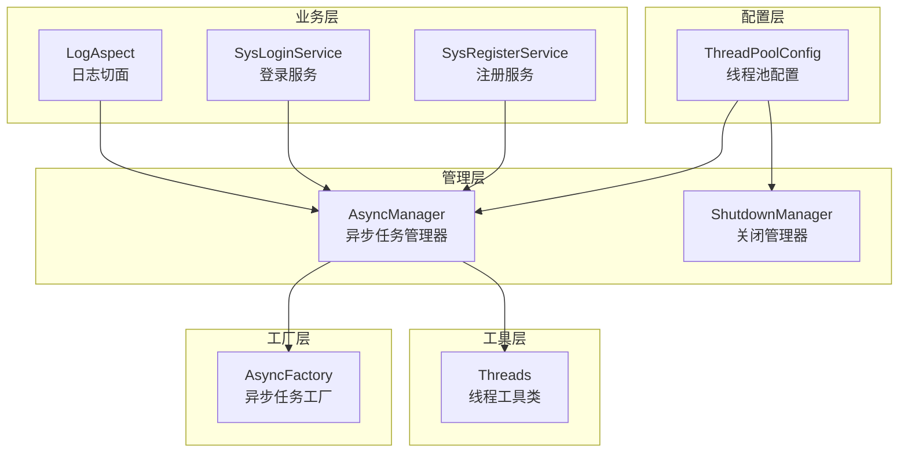
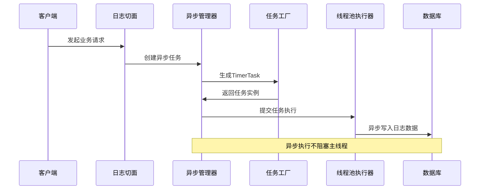
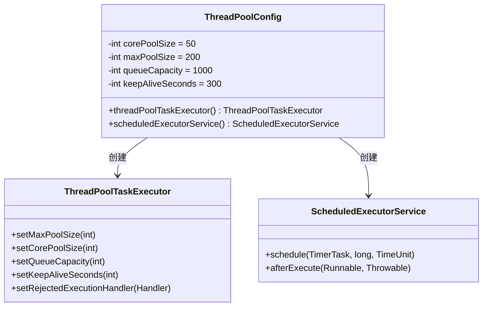
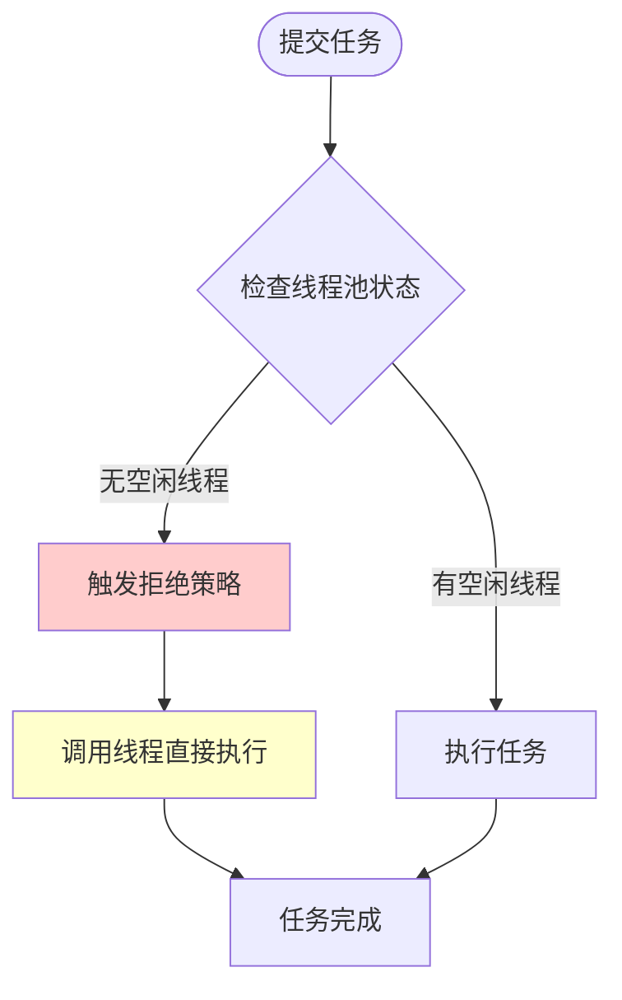
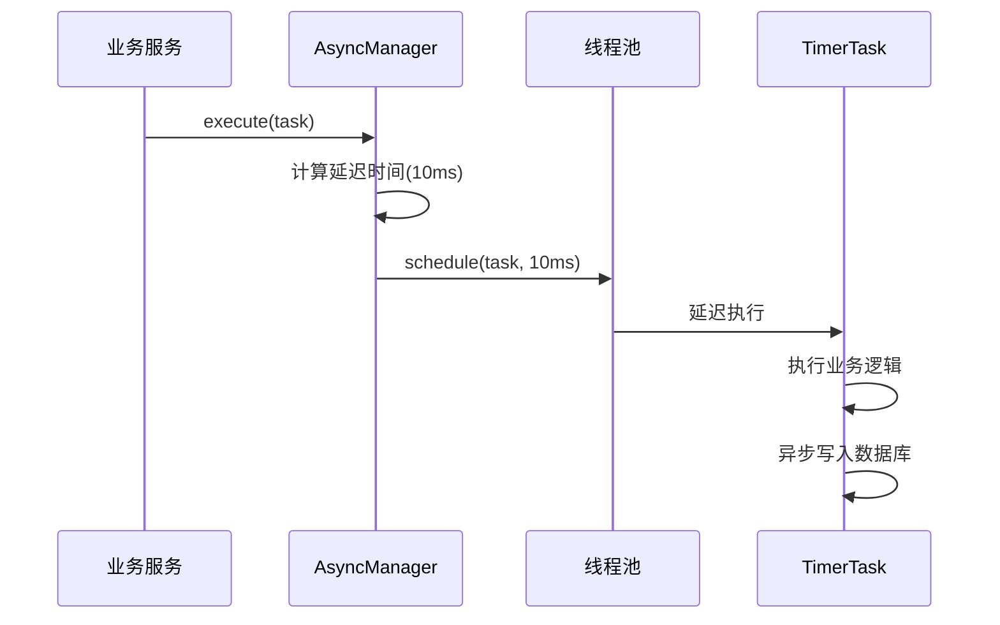
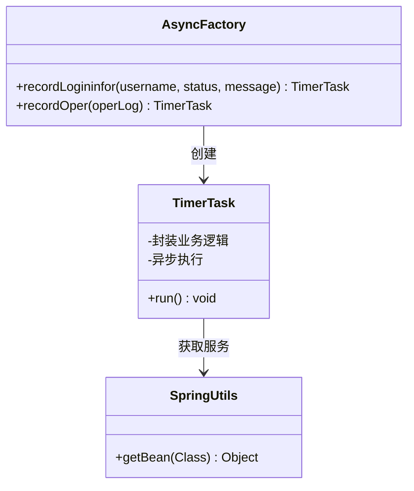
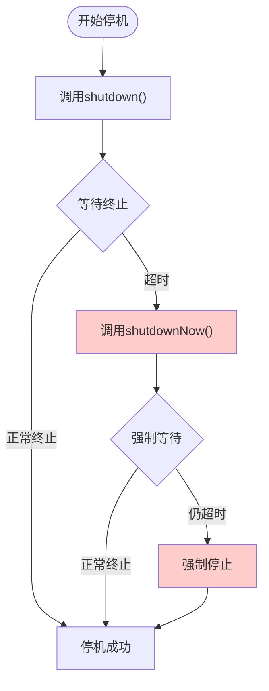
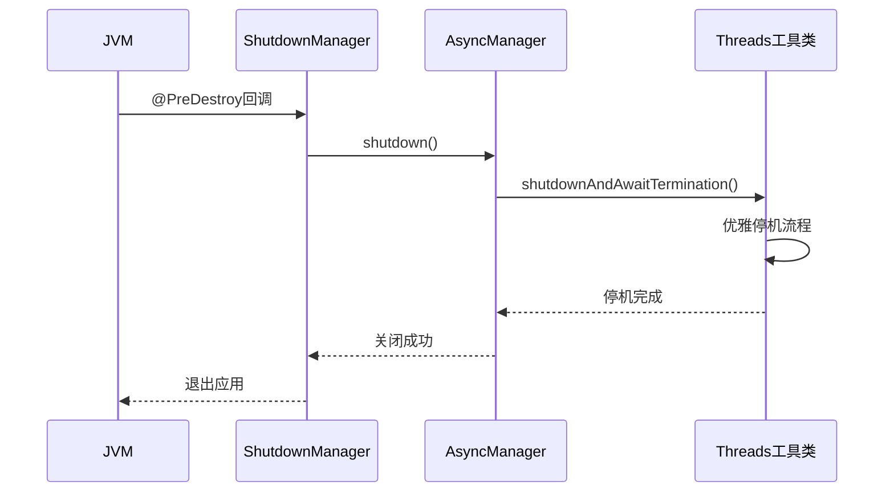
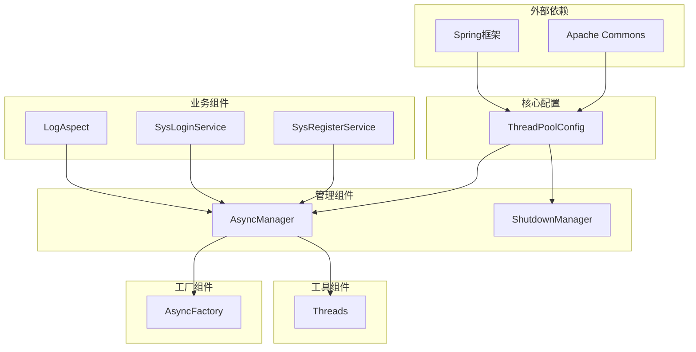
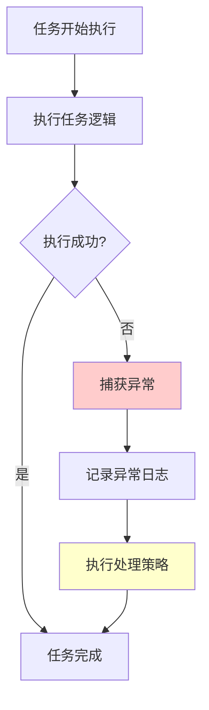

# 线程池配置

<cite>
**本文档引用的文件**
- [ThreadPoolConfig.java](file://XingChen-Vue/xingchen-framework/src/main/java/com/xingchen/framework/config/ThreadPoolConfig.java)
- [AsyncManager.java](file://XingChen-Vue/xingchen-framework/src/main/java/com/xingchen/framework/manager/AsyncManager.java)
- [AsyncFactory.java](file://XingChen-Vue/xingchen-framework/src/main/java/com/xingchen/framework/manager/factory/AsyncFactory.java)
- [Threads.java](file://XingChen-Vue/xingchen-common/src/main/java/com/xingchen/common/utils/Threads.java)
- [ShutdownManager.java](file://XingChen-Vue/xingchen-framework/src/main/java/com/xingchen/framework/manager/ShutdownManager.java)
- [LogAspect.java](file://XingChen-Vue/xingchen-framework/src/main/java/com/xingchen/framework/aspectj/LogAspect.java)
- [SysLoginService.java](file://XingChen-Vue/xingchen-framework/src/main/java/com/xingchen/framework/web/service/SysLoginService.java)
- [SysRegisterService.java](file://XingChen-Vue/xingchen-framework/src/main/java/com/xingchen/framework/web/service/SysRegisterService.java)
- [ScheduleConfig.java](file://XingChen-Vue/xingchen-quartz/src/main/java/com/xingchen/quartz/config/ScheduleConfig.java)
</cite>

## 目录
1. [简介](#简介)
2. [项目结构](#项目结构)
3. [核心组件](#核心组件)
4. [架构概览](#架构概览)
5. [详细组件分析](#详细组件分析)
6. [依赖关系分析](#依赖关系分析)
7. [性能考虑](#性能考虑)
8. [故障排除指南](#故障排除指南)
9. [结论](#结论)
10. [附录](#附录)

## 简介

本文件详细介绍了健康管理系统中的线程池配置方案，重点涵盖ThreadPoolTaskExecutor和ScheduledExecutorService的配置参数、拒绝策略、线程命名规范、守护线程配置以及异常处理机制。系统通过精心设计的线程池架构，实现了高并发环境下的异步任务处理、定时任务调度和优雅的资源管理。

该线程池配置方案具有以下特点：
- **高性能异步处理**：支持大量并发任务的异步执行
- **稳定的定时任务**：提供可靠的周期性任务调度能力
- **完善的异常处理**：确保任务执行过程中的异常得到妥善处理
- **优雅的资源管理**：支持应用关闭时的线程池优雅停机

## 项目结构

线程池配置在健康管理系统中采用分层架构设计，主要分布在以下模块：

**图表来源**
- [ThreadPoolConfig.java:18-63](file://XingChen-Vue/xingchen-framework/src/main/java/com/xingchen/framework/config/ThreadPoolConfig.java#L18-L63)
- [AsyncManager.java:14-55](file://XingChen-Vue/xingchen-framework/src/main/java/com/xingchen/framework/manager/AsyncManager.java#L14-L55)

**章节来源**
- [ThreadPoolConfig.java:1-64](file://XingChen-Vue/xingchen-framework/src/main/java/com/xingchen/framework/config/ThreadPoolConfig.java#L1-L64)
- [AsyncManager.java:1-56](file://XingChen-Vue/xingchen-framework/src/main/java/com/xingchen/framework/manager/AsyncManager.java#L1-L56)

## 核心组件

### ThreadPoolTaskExecutor配置

系统配置了一个高性能的ThreadPoolTaskExecutor，用于处理异步任务：

| 参数 | 默认值 | 说明 |
|------|--------|------|
| 核心线程数 | 50 | 基础线程池大小，保持活跃的线程数量 |
| 最大线程数 | 200 | 线程池允许的最大线程数量 |
| 队列容量 | 1000 | 任务队列的最大长度 |
| 存活时间 | 300秒 | 空闲线程的存活时间 |
| 拒绝策略 | CallerRunsPolicy | 当线程池饱和时，由调用线程直接执行 |

### ScheduledExecutorService配置

系统配置了专门的定时任务执行器：

| 参数 | 默认值 | 说明 |
|------|--------|------|
| 核心线程数 | 50 | 定时任务线程池的基础大小 |
| 线程命名 | schedule-pool-%d | 使用BasicThreadFactory进行命名 |
| 守护线程 | true | 线程以守护模式运行 |
| 拒绝策略 | CallerRunsPolicy | 饱和时由调用线程执行 |

**章节来源**
- [ThreadPoolConfig.java:20-30](file://XingChen-Vue/xingchen-framework/src/main/java/com/xingchen/framework/config/ThreadPoolConfig.java#L20-L30)
- [ThreadPoolConfig.java:32-62](file://XingChen-Vue/xingchen-framework/src/main/java/com/xingchen/framework/config/ThreadPoolConfig.java#L32-L62)

## 架构概览

系统采用双线程池架构，分别处理异步任务和定时任务：

**图表来源**
- [LogAspect.java:127](file://XingChen-Vue/xingchen-framework/src/main/java/com/xingchen/framework/aspectj/LogAspect.java#L127)
- [AsyncManager.java:43-46](file://XingChen-Vue/xingchen-framework/src/main/java/com/xingchen/framework/manager/AsyncManager.java#L43-L46)

## 详细组件分析

### ThreadPoolConfig配置类

ThreadPoolConfig是整个线程池系统的核心配置类，负责定义和初始化各种线程池组件。

#### 主要配置参数

系统采用了保守而高效的线程池配置策略：

**图表来源**
- [ThreadPoolConfig.java:18-63](file://XingChen-Vue/xingchen-framework/src/main/java/com/xingchen/framework/config/ThreadPoolConfig.java#L18-L63)

#### 拒绝策略分析

系统采用了CallerRunsPolicy作为拒绝策略，其工作原理如下：

**图表来源**
- [ThreadPoolConfig.java:41](file://XingChen-Vue/xingchen-framework/src/main/java/com/xingchen/framework/config/ThreadPoolConfig.java#L41)

**章节来源**
- [ThreadPoolConfig.java:32-62](file://XingChen-Vue/xingchen-framework/src/main/java/com/xingchen/framework/config/ThreadPoolConfig.java#L32-L62)

### AsyncManager异步任务管理器

AsyncManager是异步任务的核心管理器，提供了统一的任务调度接口：

#### 核心功能

| 功能 | 实现细节 | 作用 |
|------|----------|------|
| 任务调度 | schedule(task, 10ms, TimeUnit.MILLISECONDS) | 延迟10毫秒执行任务 |
| 单例模式 | 私有构造函数 + 静态实例 | 确保全局唯一性 |
| 优雅停机 | 调用Threads.shutdownAndAwaitTermination | 应用关闭时安全停机 |

#### 任务执行流程

**图表来源**
- [AsyncManager.java:43-46](file://XingChen-Vue/xingchen-framework/src/main/java/com/xingchen/framework/manager/AsyncManager.java#L43-L46)

**章节来源**
- [AsyncManager.java:14-55](file://XingChen-Vue/xingchen-framework/src/main/java/com/xingchen/framework/manager/AsyncManager.java#L14-L55)

### AsyncFactory异步任务工厂

AsyncFactory负责创建各种类型的异步任务，提供标准化的任务封装：

#### 支持的任务类型

| 任务类型 | 创建方法 | 用途 |
|----------|----------|------|
| 登录日志 | recordLogininfor() | 记录用户登录登出信息 |
| 操作日志 | recordOper() | 记录用户操作行为 |
| 注册日志 | 自动集成 | 记录用户注册信息 |

#### 任务执行机制

**图表来源**
- [AsyncFactory.java:24-103](file://XingChen-Vue/xingchen-framework/src/main/java/com/xingchen/framework/manager/factory/AsyncFactory.java#L24-L103)

**章节来源**
- [AsyncFactory.java:24-103](file://XingChen-Vue/xingchen-framework/src/main/java/com/xingchen/framework/manager/factory/AsyncFactory.java#L24-L103)

### Threads线程工具类

Threads工具类提供了线程相关的通用操作，特别是优雅停机功能：

#### 关键功能

| 功能 | 实现原理 | 适用场景 |
|------|----------|----------|
| 优雅停机 | shutdown() + awaitTermination() | 应用关闭时 |
| 异常打印 | printException() | 调试和监控 |
| 线程睡眠 | sleep() | 简单延时 |

#### 优雅停机流程

**图表来源**
- [Threads.java:42-64](file://XingChen-Vue/xingchen-common/src/main/java/com/xingchen/common/utils/Threads.java#L42-L64)

**章节来源**
- [Threads.java:16-99](file://XingChen-Vue/xingchen-common/src/main/java/com/xingchen/common/utils/Threads.java#L16-L99)

### ShutdownManager关闭管理器

ShutdownManager确保应用退出时能够正确关闭所有线程池：

#### 关闭流程

**图表来源**
- [ShutdownManager.java:18-38](file://XingChen-Vue/xingchen-framework/src/main/java/com/xingchen/framework/manager/ShutdownManager.java#L18-L38)

**章节来源**
- [ShutdownManager.java:14-39](file://XingChen-Vue/xingchen-framework/src/main/java/com/xingchen/framework/manager/ShutdownManager.java#L14-L39)

## 依赖关系分析

系统中的线程池组件形成了清晰的依赖层次结构：

**图表来源**
- [ThreadPoolConfig.java:3-10](file://XingChen-Vue/xingchen-framework/src/main/java/com/xingchen/framework/config/ThreadPoolConfig.java#L3-L10)
- [AsyncManager.java:6-7](file://XingChen-Vue/xingchen-framework/src/main/java/com/xingchen/framework/manager/AsyncManager.java#L6-L7)

**章节来源**
- [ThreadPoolConfig.java:1-11](file://XingChen-Vue/xingchen-framework/src/main/java/com/xingchen/framework/config/ThreadPoolConfig.java#L1-L11)

## 性能考虑

### 线程池参数优化建议

基于系统的实际配置，以下是针对不同场景的性能调优建议：

#### CPU密集型任务
- **核心线程数**：CPU核心数 × 2
- **最大线程数**：CPU核心数 × 4
- **队列容量**：100-500
- **存活时间**：60-120秒

#### IO密集型任务
- **核心线程数**：CPU核心数 × 2
- **最大线程数**：CPU核心数 × 10
- **队列容量**：500-2000
- **存活时间**：300秒

#### 混合型任务
- **核心线程数**：CPU核心数 × 1.5
- **最大线程数**：CPU核心数 × 8
- **队列容量**：1000-3000
- **存活时间**：300秒

### 监控指标

建议监控以下关键指标：

| 指标类型 | 监控项 | 目标值 | 告警阈值 |
|----------|--------|--------|----------|
| 性能指标 | 平均响应时间 | < 100ms | > 500ms |
| 性能指标 | 任务吞吐量 | > 1000 tasks/s | < 500 tasks/s |
| 资源指标 | 线程池利用率 | 60%-80% | > 90% |
| 资源指标 | 队列长度 | < 100 | > 500 |
| 错误指标 | 拒绝次数 | 0 | > 10/min |
| 错误指标 | 异常率 | < 0.1% | > 1% |

### 性能调优策略

1. **动态调整核心线程数**：根据CPU使用率动态增减
2. **自适应队列容量**：根据任务到达率调整队列大小
3. **优先级队列**：为重要任务设置更高优先级
4. **任务拆分**：将大任务拆分为小任务提高并发度

## 故障排除指南

### 常见问题及解决方案

#### 线程池饱和问题
**现象**：任务被拒绝执行，出现CallerRunsPolicy处理
**原因**：线程池负载过高，队列已满
**解决方案**：
- 增加最大线程数
- 优化任务执行时间
- 实现任务降级策略

#### 内存泄漏问题
**现象**：队列持续增长，内存使用不断上升
**原因**：任务执行过慢，导致积压
**解决方案**：
- 监控队列长度
- 实现任务超时机制
- 优化任务执行效率

#### 线程死锁问题
**现象**：部分任务长时间无法完成
**原因**：任务间相互等待资源
**解决方案**：
- 避免任务间的同步依赖
- 实现任务超时控制
- 使用无锁数据结构

### 异常处理机制

系统通过多层次的异常处理确保线程池的稳定性：

**图表来源**
- [ThreadPoolConfig.java:56-60](file://XingChen-Vue/xingchen-framework/src/main/java/com/xingchen/framework/config/ThreadPoolConfig.java#L56-L60)

**章节来源**
- [ThreadPoolConfig.java:56-60](file://XingChen-Vue/xingchen-framework/src/main/java/com/xingchen/framework/config/ThreadPoolConfig.java#L56-L60)

## 结论

健康管理系统中的线程池配置方案体现了现代Java应用的最佳实践：

### 设计优势

1. **高可用性**：通过CallerRunsPolicy确保系统在高负载下仍能正常运行
2. **可扩展性**：合理的线程池参数为系统提供了良好的扩展空间
3. **可观测性**：完善的异常处理和日志记录机制便于问题排查
4. **可维护性**：清晰的架构分层和标准化的接口设计便于维护

### 最佳实践总结

1. **合理配置参数**：根据业务特点选择合适的线程池参数
2. **实施监控告警**：建立完善的监控体系及时发现潜在问题
3. **制定应急预案**：为极端情况准备降级和熔断策略
4. **定期性能评估**：根据实际运行情况进行参数调优

该线程池配置方案为健康管理系统提供了稳定可靠的任务执行基础，能够有效支撑系统的高并发需求。

## 附录

### 不同业务场景的配置建议

#### 登录认证场景
- **核心线程数**：20
- **最大线程数**：50
- **队列容量**：200
- **适用性**：低延迟要求，高并发登录

#### 数据统计场景
- **核心线程数**：10
- **最大线程数**：30
- **队列容量**：500
- **适用性**：批量数据处理，非实时要求

#### 文件上传场景
- **核心线程数**：15
- **最大线程数**：40
- **队列容量**：300
- **适用性**：IO密集型，需要处理大文件

#### 实时消息场景
- **核心线程数**：25
- **最大线程数**：100
- **队列容量**：1000
- **适用性**：高并发实时通信

### 配置参数对照表

| 场景类型 | 核心线程数 | 最大线程数 | 队列容量 | 存活时间 |
|----------|------------|------------|----------|----------|
| 登录认证 | 20 | 50 | 200 | 300s |
| 数据统计 | 10 | 30 | 500 | 300s |
| 文件上传 | 15 | 40 | 300 | 300s |
| 实时消息 | 25 | 100 | 1000 | 300s |
| 系统默认 | 50 | 200 | 1000 | 300s |