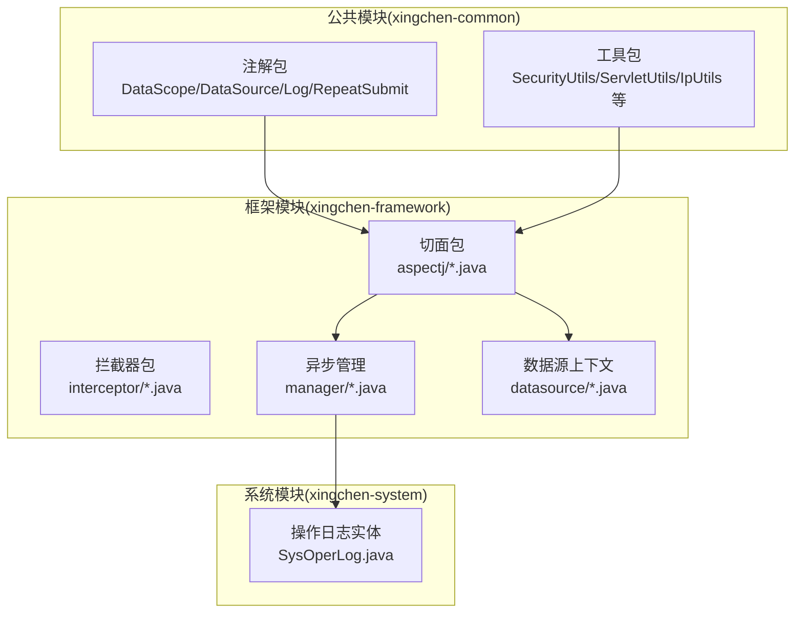
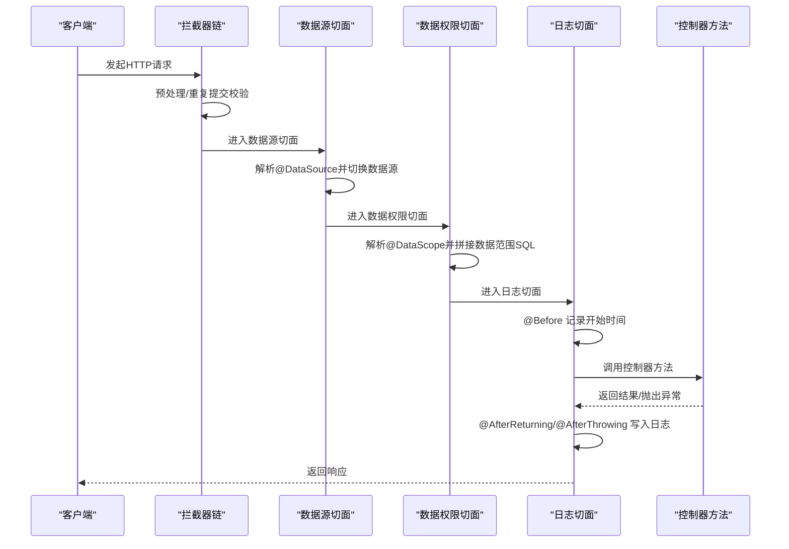
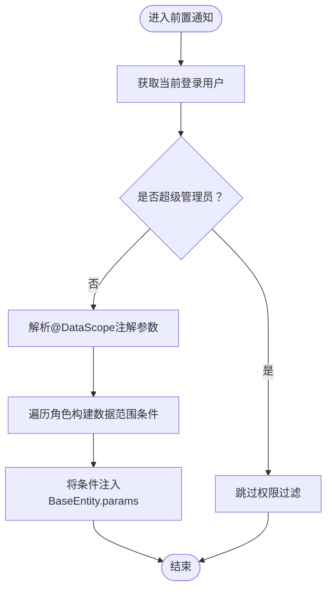
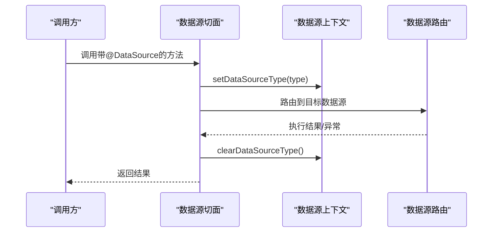
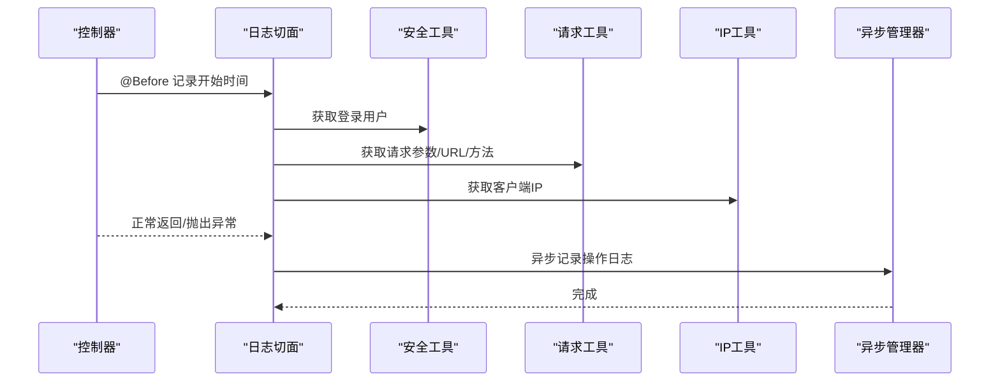
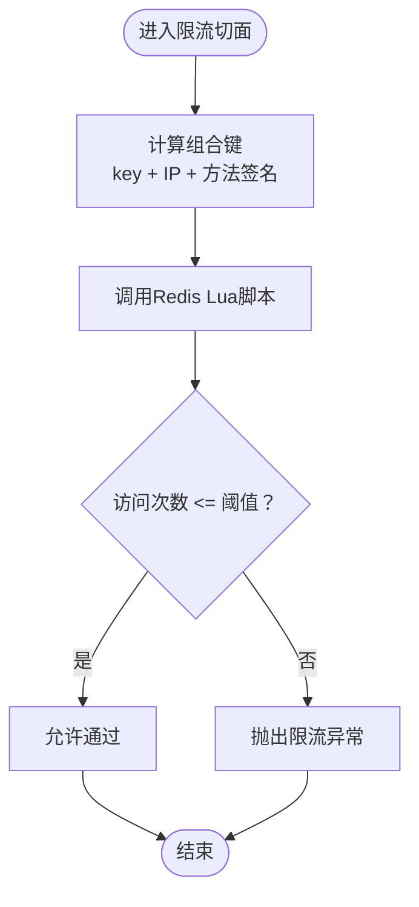
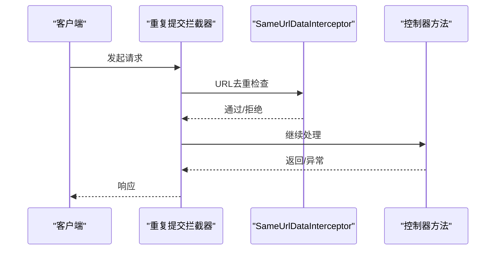
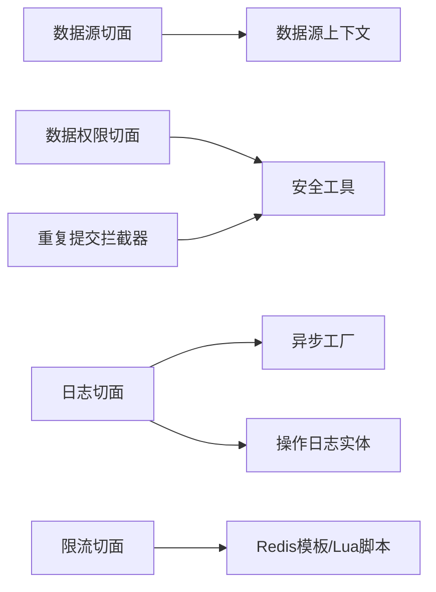

# 拦截器与切面编程

<cite>
**本文引用的文件**
- [DataScopeAspect.java](file://XingChen-Vue/xingchen-framework/src/main/java/com/xingchen/framework/aspectj/DataScopeAspect.java)
- [DataSourceAspect.java](file://XingChen-Vue/xingchen-framework/src/main/java/com/xingchen/framework/aspectj/DataSourceAspect.java)
- [LogAspect.java](file://XingChen-Vue/xingchen-framework/src/main/java/com/xingchen/framework/aspectj/LogAspect.java)
- [RateLimiterAspect.java](file://XingChen-Vue/xingchen-framework/src/main/java/com/xingchen/framework/aspectj/RateLimiterAspect.java)
- [DataScope.java](file://XingChen-Vue/xingchen-common/src/main/java/com/xingchen/common/annotation/DataScope.java)
- [DataSource.java](file://XingChen-Vue/xingchen-common/src/main/java/com/xingchen/common/annotation/DataSource.java)
- [Log.java](file://XingChen-Vue/xingchen-common/src/main/java/com/xingchen/common/annotation/Log.java)
- [RepeatSubmit.java](file://XingChen-Vue/xingchen-common/src/main/java/com/xingchen/common/annotation/RepeatSubmit.java)
- [DynamicDataSourceContextHolder.java](file://XingChen-Vue/xingchen-framework/src/main/java/com/xingchen/framework/datasource/DynamicDataSourceContextHolder.java)
- [AsyncManager.java](file://XingChen-Vue/xingchen-framework/src/main/java/com/xingchen/framework/manager/AsyncManager.java)
- [AsyncFactory.java](file://XingChen-Vue/xingchen-framework/src/main/java/com/xingchen/framework/manager/factory/AsyncFactory.java)
- [SysOperLog.java](file://XingChen-Vue/xingchen-system/src/main/java/com/xingchen/system/domain/SysOperLog.java)
- [SecurityUtils.java](file://XingChen-Vue/xingchen-common/src/main/java/com/xingchen/common/utils/SecurityUtils.java)
- [ServletUtils.java](file://XingChen-Vue/xingchen-common/src/main/java/com/xingchen/common/utils/ServletUtils.java)
- [IpUtils.java](file://XingChen-Vue/xingchen-common/src/main/java/com/xingchen/common/utils/ip/IpUtils.java)
- [PropertyPreExcludeFilter.java](file://XingChen-Vue/xingchen-common/src/main/java/com/xingchen/common/filter/PropertyPreExcludeFilter.java)
- [SameUrlDataInterceptor.java](file://XingChen-Vue/xingchen-framework/src/main/java/com/xingchen/framework/interceptor/impl/SameUrlDataInterceptor.java)
- [RepeatSubmitInterceptor.java](file://XingChen-Vue/xingchen-framework/src/main/java/com/xingchen/framework/interceptor/RepeatSubmitInterceptor.java)
- [GlobalExceptionHandler.java](file://XingChen-Vue/xingchen-framework/src/main/java/com/xingchen/framework/web/exception/GlobalExceptionHandler.java)
</cite>

## 目录
1. [引言](#引言)
2. [项目结构](#项目结构)
3. [核心组件](#核心组件)
4. [架构总览](#架构总览)
5. [详细组件分析](#详细组件分析)
6. [依赖分析](#依赖分析)
7. [性能考虑](#性能考虑)
8. [故障排查指南](#故障排查指南)
9. [结论](#结论)
10. [附录](#附录)

## 引言
本文件系统性阐述健康管理系统中的拦截器与切面编程实践，重点覆盖以下场景：
- 数据权限控制：通过注解驱动的切面在控制器方法执行前动态拼接数据范围SQL条件，实现基于角色与部门的细粒度数据隔离。
- 日志记录：围绕操作日志的切面在请求前后统一采集请求参数、响应结果、异常信息，并异步落库，保障业务与审计分离。
- 重复提交防护：结合拦截器与注解切面，从URL与表单维度双重校验，防止用户误触或恶意重复提交。
- 数据源切换：基于注解的环绕切面在方法调用前后切换动态数据源，确保读写分离与多数据源场景下的正确路由。
- 限流保护：基于Redis Lua脚本的限流切面，支持按IP/用户/接口等多粒度限流，提升系统稳定性。

同时，文档给出切面优先级配置、异常处理策略、性能影响评估以及最佳实践与调试技巧，帮助开发者在保证功能正确性的前提下获得稳定高效的运行表现。

## 项目结构
本项目采用“模块化+分层”的组织方式，拦截器与切面主要位于框架模块（xingchen-framework），注解定义位于公共模块（xingchen-common），日志实体与异步管理位于系统模块（xingchen-system）与框架模块内部。

图示来源
- [DataScopeAspect.java:1-161](file://XingChen-Vue/xingchen-framework/src/main/java/com/xingchen/framework/aspectj/DataScopeAspect.java#L1-L161)
- [DataSourceAspect.java:1-73](file://XingChen-Vue/xingchen-framework/src/main/java/com/xingchen/framework/aspectj/DataSourceAspect.java#L1-L73)
- [LogAspect.java:1-265](file://XingChen-Vue/xingchen-framework/src/main/java/com/xingchen/framework/aspectj/LogAspect.java#L1-L265)
- [RepeatSubmit.java:1-32](file://XingChen-Vue/xingchen-common/src/main/java/com/xingchen/common/annotation/RepeatSubmit.java#L1-L32)
- [SysOperLog.java](file://XingChen-Vue/xingchen-system/src/main/java/com/xingchen/system/domain/SysOperLog.java)

章节来源
- [DataScopeAspect.java:1-161](file://XingChen-Vue/xingchen-framework/src/main/java/com/xingchen/framework/aspectj/DataScopeAspect.java#L1-L161)
- [DataSourceAspect.java:1-73](file://XingChen-Vue/xingchen-framework/src/main/java/com/xingchen/framework/aspectj/DataSourceAspect.java#L1-L73)
- [LogAspect.java:1-265](file://XingChen-Vue/xingchen-framework/src/main/java/com/xingchen/framework/aspectj/LogAspect.java#L1-L265)
- [RepeatSubmit.java:1-32](file://XingChen-Vue/xingchen-common/src/main/java/com/xingchen/common/annotation/RepeatSubmit.java#L1-L32)

## 核心组件
- 注解层：定义在公共模块，包括数据权限注解、数据源切换注解、操作日志注解、重复提交注解等，用于声明式地启用横切行为。
- 切面层：在框架模块实现，分别负责数据权限过滤、数据源切换、操作日志记录与限流控制。
- 拦截器层：在框架模块实现，负责请求预处理与重复提交拦截。
- 异步管理：在框架模块实现，将日志写入等耗时操作异步化，降低主流程开销。
- 实体与工具：在系统模块与公共模块，提供日志实体、安全工具、请求工具、IP工具等支撑。

章节来源
- [DataScope.java:1-44](file://XingChen-Vue/xingchen-common/src/main/java/com/xingchen/common/annotation/DataScope.java#L1-L44)
- [DataSource.java:1-29](file://XingChen-Vue/xingchen-common/src/main/java/com/xingchen/common/annotation/DataSource.java#L1-L29)
- [Log.java:1-52](file://XingChen-Vue/xingchen-common/src/main/java/com/xingchen/common/annotation/Log.java#L1-L52)
- [RepeatSubmit.java:1-32](file://XingChen-Vue/xingchen-common/src/main/java/com/xingchen/common/annotation/RepeatSubmit.java#L1-L32)

## 架构总览
下图展示了请求在进入控制器之前的完整横切链路：拦截器链负责预处理与重复提交校验，随后由切面完成数据源切换、权限过滤与日志采集，最终到达控制器方法。

图示来源
- [DataSourceAspect.java:37-56](file://XingChen-Vue/xingchen-framework/src/main/java/com/xingchen/framework/aspectj/DataSourceAspect.java#L37-L56)
- [DataScopeAspect.java:35-40](file://XingChen-Vue/xingchen-framework/src/main/java/com/xingchen/framework/aspectj/DataScopeAspect.java#L35-L40)
- [LogAspect.java:59-86](file://XingChen-Vue/xingchen-framework/src/main/java/com/xingchen/framework/aspectj/LogAspect.java#L59-L86)
- [RepeatSubmitInterceptor.java](file://XingChen-Vue/xingchen-framework/src/main/java/com/xingchen/framework/interceptor/RepeatSubmitInterceptor.java)

## 详细组件分析

### 数据权限切面（DataScopeAspect）
- 设计目标：在控制器方法执行前，依据登录用户的角色数据权限与传入的权限字符，动态生成并注入数据范围SQL条件，从而在DAO层实现透明的数据隔离。
- 关键点：
  - 使用前置通知捕获带注解的方法，解析注解参数（用户/部门别名、字段名、权限字符）。
  - 通过安全工具获取当前登录用户，排除超级管理员，按角色数据范围策略拼接SQL条件。
  - 将拼接后的条件写入请求参数对象的扩展字段，供MyBatis参数映射使用。
  - 在拼接前清理旧条件，避免重复叠加导致逻辑错误。
- 复杂度与性能：条件拼接为线性复杂度，受角色数量与数据范围策略数量影响；建议在角色数量可控的前提下保持良好性能。

图示来源
- [DataScopeAspect.java:35-56](file://XingChen-Vue/xingchen-framework/src/main/java/com/xingchen/framework/aspectj/DataScopeAspect.java#L35-L56)
- [DataScopeAspect.java:67-146](file://XingChen-Vue/xingchen-framework/src/main/java/com/xingchen/framework/aspectj/DataScopeAspect.java#L67-L146)

章节来源
- [DataScopeAspect.java:1-161](file://XingChen-Vue/xingchen-framework/src/main/java/com/xingchen/framework/aspectj/DataScopeAspect.java#L1-L161)
- [DataScope.java:1-44](file://XingChen-Vue/xingchen-common/src/main/java/com/xingchen/common/annotation/DataScope.java#L1-L44)

### 数据源切换切面（DataSourceAspect）
- 设计目标：在方法执行前后自动切换动态数据源，支持按方法或类级别声明数据源类型，确保读写分离与多数据源场景的正确路由。
- 关键点：
  - 使用环绕通知，在方法执行前设置数据源类型，在finally中清理，避免污染后续请求。
  - 支持方法与类级别的注解继承，优先级为“方法 > 类”。
  - 通过数据源上下文持有者维护线程级数据源选择。
- 切面优先级：通过注解指定优先级，确保在其他切面前执行，保证数据源在业务逻辑之前生效。

图示来源
- [DataSourceAspect.java:37-56](file://XingChen-Vue/xingchen-framework/src/main/java/com/xingchen/framework/aspectj/DataSourceAspect.java#L37-L56)
- [DynamicDataSourceContextHolder.java](file://XingChen-Vue/xingchen-framework/src/main/java/com/xingchen/framework/datasource/DynamicDataSourceContextHolder.java)

章节来源
- [DataSourceAspect.java:1-73](file://XingChen-Vue/xingchen-framework/src/main/java/com/xingchen/framework/aspectj/DataSourceAspect.java#L1-L73)
- [DataSource.java:1-29](file://XingChen-Vue/xingchen-common/src/main/java/com/xingchen/common/annotation/DataSource.java#L1-L29)

### 操作日志切面（LogAspect）
- 设计目标：统一采集请求参数、响应结果、异常信息与耗时，异步写入操作日志表，实现业务与审计解耦。
- 关键点：
  - 使用前置通知记录开始时间，使用返回与异常通知完成日志落库。
  - 支持注解参数：标题、业务类型、操作类型、是否保存请求/响应数据、排除参数名等。
  - 对敏感字段进行过滤，避免日志泄露。
  - 异步执行：通过异步管理器与工厂方法提交日志任务，降低同步阻塞。
- 性能与可靠性：异步化显著降低主流程延迟；异常日志记录在catch块中，保证即使业务异常也能记录。

图示来源
- [LogAspect.java:59-140](file://XingChen-Vue/xingchen-framework/src/main/java/com/xingchen/framework/aspectj/LogAspect.java#L59-L140)
- [SysOperLog.java](file://XingChen-Vue/xingchen-system/src/main/java/com/xingchen/system/domain/SysOperLog.java)
- [AsyncManager.java](file://XingChen-Vue/xingchen-framework/src/main/java/com/xingchen/framework/manager/AsyncManager.java)
- [AsyncFactory.java](file://XingChen-Vue/xingchen-framework/src/main/java/com/xingchen/framework/manager/factory/AsyncFactory.java)

章节来源
- [LogAspect.java:1-265](file://XingChen-Vue/xingchen-framework/src/main/java/com/xingchen/framework/aspectj/LogAspect.java#L1-L265)
- [Log.java:1-52](file://XingChen-Vue/xingchen-common/src/main/java/com/xingchen/common/annotation/Log.java#L1-L52)

### 限流切面（RateLimiterAspect）
- 设计目标：基于Redis Lua脚本实现高并发下的原子性限流，支持按IP、用户、接口等多粒度组合键。
- 关键点：
  - 使用前置通知在方法执行前计算组合键并调用Lua脚本。
  - 当访问次数超过阈值时抛出自定义服务异常，提示用户稍后再试。
  - 对异常进行分类处理，保证限流失败不影响正常业务流程。
- 性能与可靠性：Lua脚本保证原子性与高性能；Redis作为存储介质具备良好的横向扩展能力。

图示来源
- [RateLimiterAspect.java:49-74](file://XingChen-Vue/xingchen-framework/src/main/java/com/xingchen/framework/aspectj/RateLimiterAspect.java#L49-L74)

章节来源
- [RateLimiterAspect.java:1-90](file://XingChen-Vue/xingchen-framework/src/main/java/com/xingchen/framework/aspectj/RateLimiterAspect.java#L1-L90)

### 重复提交防护（拦截器 + 注解）
- 设计目标：通过拦截器与注解双层防护，避免用户重复点击或恶意刷接口导致的数据不一致。
- 关键点：
  - 拦截器链在请求进入控制器前进行预处理，结合URL与表单维度进行去重判断。
  - 注解用于声明式开启重复提交校验，并可配置间隔时间与提示信息。
  - 与日志切面配合，异常情况下同样记录操作日志，便于追踪。

图示来源
- [RepeatSubmitInterceptor.java](file://XingChen-Vue/xingchen-framework/src/main/java/com/xingchen/framework/interceptor/RepeatSubmitInterceptor.java)
- [SameUrlDataInterceptor.java](file://XingChen-Vue/xingchen-framework/src/main/java/com/xingchen/framework/interceptor/impl/SameUrlDataInterceptor.java)
- [RepeatSubmit.java:1-32](file://XingChen-Vue/xingchen-common/src/main/java/com/xingchen/common/annotation/RepeatSubmit.java#L1-L32)

章节来源
- [RepeatSubmitInterceptor.java](file://XingChen-Vue/xingchen-framework/src/main/java/com/xingchen/framework/interceptor/RepeatSubmitInterceptor.java)
- [SameUrlDataInterceptor.java](file://XingChen-Vue/xingchen-framework/src/main/java/com/xingchen/framework/interceptor/impl/SameUrlDataInterceptor.java)
- [RepeatSubmit.java:1-32](file://XingChen-Vue/xingchen-common/src/main/java/com/xingchen/common/annotation/RepeatSubmit.java#L1-L32)

## 依赖分析
- 切面与注解：各切面均依赖对应注解与工具类（如安全工具、请求工具、IP工具、异步管理器等）。
- 切面间耦合：数据源切面优先级最高，确保在权限与日志之前生效；日志切面依赖异步管理器，避免阻塞主流程。
- 外部依赖：Redis用于限流与会话存储；数据库用于操作日志持久化；动态数据源路由依赖上下文持有者。

图示来源
- [DataSourceAspect.java:44-54](file://XingChen-Vue/xingchen-framework/src/main/java/com/xingchen/framework/aspectj/DataSourceAspect.java#L44-L54)
- [DataScopeAspect.java:45-50](file://XingChen-Vue/xingchen-framework/src/main/java/com/xingchen/framework/aspectj/DataScopeAspect.java#L45-L50)
- [LogAspect.java:128-128](file://XingChen-Vue/xingchen-framework/src/main/java/com/xingchen/framework/aspectj/LogAspect.java#L128-L128)
- [SysOperLog.java](file://XingChen-Vue/xingchen-system/src/main/java/com/xingchen/system/domain/SysOperLog.java)
- [RateLimiterAspect.java:59-63](file://XingChen-Vue/xingchen-framework/src/main/java/com/xingchen/framework/aspectj/RateLimiterAspect.java#L59-L63)

章节来源
- [DataSourceAspect.java:1-73](file://XingChen-Vue/xingchen-framework/src/main/java/com/xingchen/framework/aspectj/DataSourceAspect.java#L1-L73)
- [DataScopeAspect.java:1-161](file://XingChen-Vue/xingchen-framework/src/main/java/com/xingchen/framework/aspectj/DataScopeAspect.java#L1-L161)
- [LogAspect.java:1-265](file://XingChen-Vue/xingchen-framework/src/main/java/com/xingchen/framework/aspectj/LogAspect.java#L1-L265)
- [RateLimiterAspect.java:1-90](file://XingChen-Vue/xingchen-framework/src/main/java/com/xingchen/framework/aspectj/RateLimiterAspect.java#L1-L90)

## 性能考虑
- 异步化：日志切面通过异步管理器提交任务，避免IO阻塞主流程，建议合理配置线程池大小与队列容量。
- 缓存与限流：限流切面使用Redis与Lua脚本，具备高吞吐与低延迟特性；建议结合业务峰值合理设置阈值与窗口。
- SQL拼接：数据权限切面在内存中拼接SQL条件，复杂度与角色数线性相关；建议控制角色数量与权限字符集合规模。
- 数据源切换：环绕通知在方法前后切换数据源，finally中清理，避免泄漏；建议在高频调用场景下减少不必要的切换。
- 参数序列化：日志切面对请求/响应参数进行序列化并限制长度，避免过大日志影响性能；敏感字段过滤降低日志体积。

## 故障排查指南
- 日志未入库：
  - 检查异步管理器是否正常初始化与执行。
  - 核对日志实体字段与数据库表结构一致性。
  - 参考章节来源：[LogAspect.java:128-139](file://XingChen-Vue/xingchen-framework/src/main/java/com/xingchen/framework/aspectj/LogAspect.java#L128-L139)
- 重复提交未生效：
  - 确认拦截器链已启用且顺序正确。
  - 检查注解是否正确标注于控制器方法上。
  - 参考章节来源：[RepeatSubmitInterceptor.java](file://XingChen-Vue/xingchen-framework/src/main/java/com/xingchen/framework/interceptor/RepeatSubmitInterceptor.java)
- 数据权限过滤异常：
  - 检查注解参数（别名、字段、权限字符）是否与SQL映射一致。
  - 确认用户角色与数据范围策略配置正确。
  - 参考章节来源：[DataScopeAspect.java:67-146](file://XingChen-Vue/xingchen-framework/src/main/java/com/xingchen/framework/aspectj/DataScopeAspect.java#L67-L146)
- 数据源切换失效：
  - 检查注解是否正确标注于方法或类级别。
  - 确认数据源上下文持有者在finally中被清理。
  - 参考章节来源：[DataSourceAspect.java:44-54](file://XingChen-Vue/xingchen-framework/src/main/java/com/xingchen/framework/aspectj/DataSourceAspect.java#L44-L54)
- 限流误判：
  - 检查组合键生成规则与Redis键空间。
  - 核对Lua脚本与阈值配置。
  - 参考章节来源：[RateLimiterAspect.java:59-74](file://XingChen-Vue/xingchen-framework/src/main/java/com/xingchen/framework/aspectj/RateLimiterAspect.java#L59-L74)
- 全局异常处理：
  - 确认全局异常处理器对业务异常与限流异常进行统一处理与返回。
  - 参考章节来源：[GlobalExceptionHandler.java](file://XingChen-Vue/xingchen-framework/src/main/java/com/xingchen/framework/web/exception/GlobalExceptionHandler.java)

## 结论
本项目的拦截器与切面编程通过注解驱动的方式实现了数据权限、日志记录、重复提交防护与数据源切换等横切关注点，既保证了业务逻辑的清晰，又提升了系统的安全性与可观测性。通过合理的异步化、限流与参数过滤策略，系统在高并发场景下仍能保持稳定与高效。建议在生产环境中持续监控日志与限流指标，结合业务增长趋势动态调整阈值与配置。

## 附录
- 切面优先级配置：数据源切面通过注解指定优先级，确保在其他切面前执行。
- 最佳实践：
  - 注解与切面分离，职责单一，便于测试与维护。
  - 异步化非关键路径（日志、统计等），减少同步阻塞。
  - 限流策略与业务场景匹配，避免过度限流影响用户体验。
  - 参数序列化与敏感字段过滤，兼顾审计与隐私保护。
- 调试技巧：
  - 使用日志切面记录关键路径耗时，定位性能瓶颈。
  - 通过Redis命令查看限流键值变化，验证限流效果。
  - 在开发环境开启更详细的日志级别，快速定位问题。