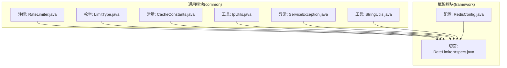
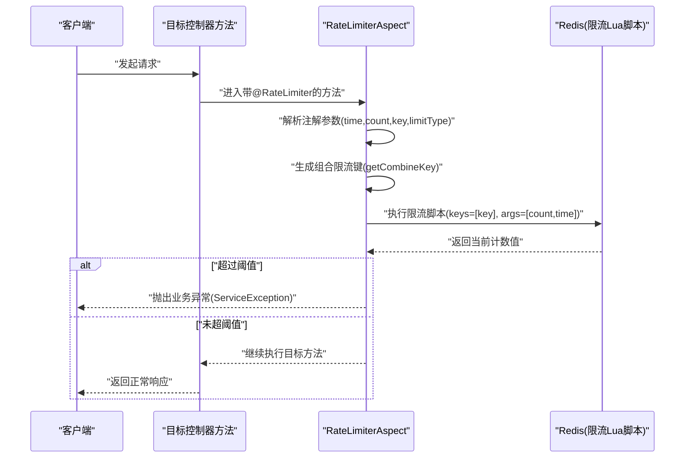
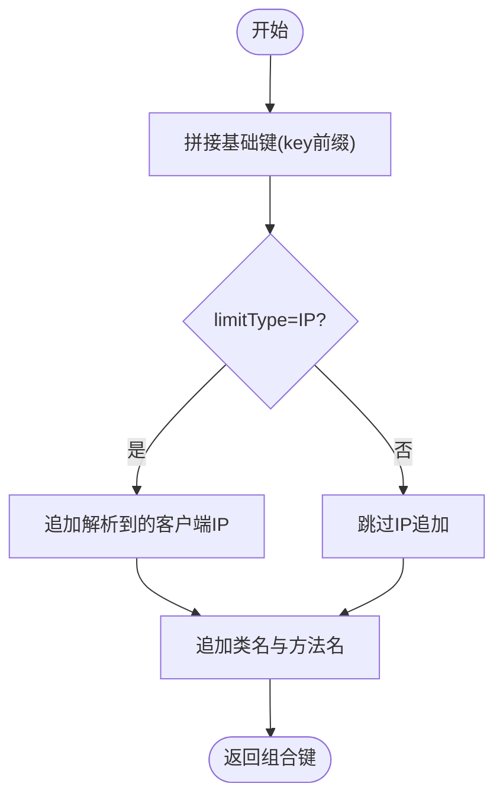
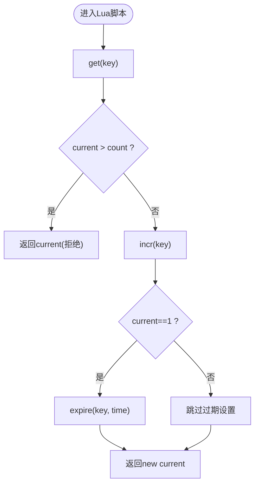
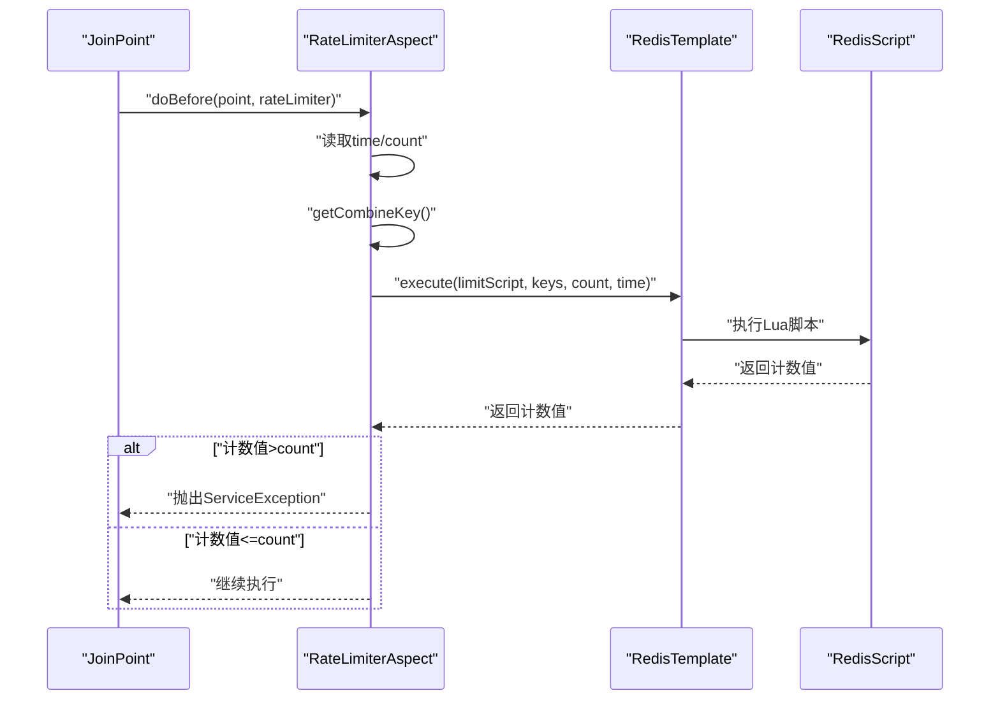
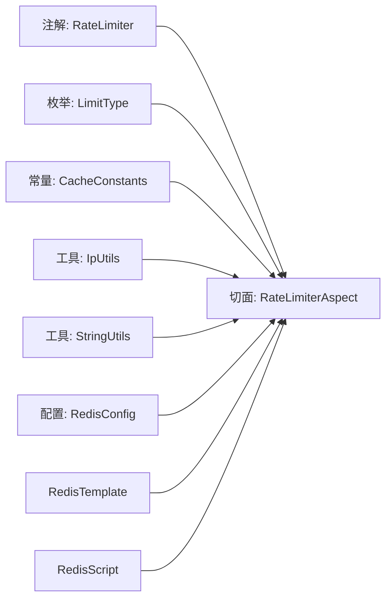

# 接口限流切面

<cite>
**本文引用的文件**
- [RateLimiterAspect.java](file://XingChen-Vue/xingchen-framework/src/main/java/com/xingchen/framework/aspectj/RateLimiterAspect.java)
- [RateLimiter.java](file://XingChen-Vue/xingchen-common/src/main/java/com/xingchen/common/annotation/RateLimiter.java)
- [LimitType.java](file://XingChen-Vue/xingchen-common/src/main/java/com/xingchen/common/enums/LimitType.java)
- [RedisConfig.java](file://XingChen-Vue/xingchen-framework/src/main/java/com/xingchen/framework/config/RedisConfig.java)
- [CacheConstants.java](file://XingChen-Vue/xingchen-common/src/main/java/com/xingchen/common/constant/CacheConstants.java)
- [IpUtils.java](file://XingChen-Vue/xingchen-common/src/main/java/com/xingchen/common/utils/ip/IpUtils.java)
- [ServiceException.java](file://XingChen-Vue/xingchen-common/src/main/java/com/xingchen/common/exception/ServiceException.java)
- [StringUtils.java](file://XingChen-Vue/xingchen-common/src/main/java/com/xingchen/common/utils/StringUtils.java)
</cite>

## 目录
1. [简介](#简介)
2. [项目结构](#项目结构)
3. [核心组件](#核心组件)
4. [架构总览](#架构总览)
5. [详细组件分析](#详细组件分析)
6. [依赖关系分析](#依赖关系分析)
7. [性能考量](#性能考量)
8. [故障排查指南](#故障排查指南)
9. [结论](#结论)
10. [附录](#附录)

## 简介
本文件系统性阐述健康管理系统中的接口限流切面实现，重点围绕基于注解的限流控制机制展开，覆盖以下关键点：
- 限流算法与实现：当前采用基于 Redis 的计数器模式，结合 Lua 脚本保证原子性，属于近似“固定窗口”计数器，非严格令牌桶或滑动窗口。
- 限流粒度配置：支持默认全局限流与按 IP 限流两种粒度，可通过注解参数灵活定制。
- 时间窗口与阈值：通过注解的 time（秒）与 count（次数）参数控制限流窗口与阈值。
- 策略定制：通过注解 key 与 LimitType 枚举扩展不同维度的限流键空间。
- Redis 集成：通过 RedisTemplate 执行 Lua 脚本，实现限流状态的分布式持久化。
- 突发流量处理：当前实现对突发流量的处理较为直接，建议在高并发场景下配合更精细的限流策略或增加预热与排队机制。

## 项目结构
限流相关代码分布于通用模块与框架模块：
- 注解与枚举：定义限流注解与限流类型枚举，位于通用模块。
- 切面实现：基于 AOP 的限流切面逻辑，位于框架模块。
- Redis 配置：提供 RedisTemplate 与限流 Lua 脚本 Bean，位于框架模块。
- 工具与常量：IP 解析工具与缓存键常量，位于通用模块。

**图表来源**
- [RateLimiter.java:1-41](file://XingChen-Vue/xingchen-common/src/main/java/com/xingchen/common/annotation/RateLimiter.java#L1-L41)
- [LimitType.java:1-21](file://XingChen-Vue/xingchen-common/src/main/java/com/xingchen/common/enums/LimitType.java#L1-L21)
- [CacheConstants.java:1-45](file://XingChen-Vue/xingchen-common/src/main/java/com/xingchen/common/constant/CacheConstants.java#L1-L45)
- [IpUtils.java:1-382](file://XingChen-Vue/xingchen-common/src/main/java/com/xingchen/common/utils/ip/IpUtils.java#L1-L382)
- [ServiceException.java:1-74](file://XingChen-Vue/xingchen-common/src/main/java/com/xingchen/common/exception/ServiceException.java#L1-L74)
- [StringUtils.java:1-800](file://XingChen-Vue/xingchen-common/src/main/java/com/xingchen/common/utils/StringUtils.java#L1-L800)
- [RateLimiterAspect.java:1-90](file://XingChen-Vue/xingchen-framework/src/main/java/com/xingchen/framework/aspectj/RateLimiterAspect.java#L1-L90)
- [RedisConfig.java:1-71](file://XingChen-Vue/xingchen-framework/src/main/java/com/xingchen/framework/config/RedisConfig.java#L1-L71)

**章节来源**
- [RateLimiter.java:1-41](file://XingChen-Vue/xingchen-common/src/main/java/com/xingchen/common/annotation/RateLimiter.java#L1-L41)
- [LimitType.java:1-21](file://XingChen-Vue/xingchen-common/src/main/java/com/xingchen/common/enums/LimitType.java#L1-L21)
- [CacheConstants.java:1-45](file://XingChen-Vue/xingchen-common/src/main/java/com/xingchen/common/constant/CacheConstants.java#L1-L45)
- [IpUtils.java:1-382](file://XingChen-Vue/xingchen-common/src/main/java/com/xingchen/common/utils/ip/IpUtils.java#L1-L382)
- [ServiceException.java:1-74](file://XingChen-Vue/xingchen-common/src/main/java/com/xingchen/common/exception/ServiceException.java#L1-L74)
- [StringUtils.java:1-800](file://XingChen-Vue/xingchen-common/src/main/java/com/xingchen/common/utils/StringUtils.java#L1-L800)
- [RateLimiterAspect.java:1-90](file://XingChen-Vue/xingchen-framework/src/main/java/com/xingchen/framework/aspectj/RateLimiterAspect.java#L1-L90)
- [RedisConfig.java:1-71](file://XingChen-Vue/xingchen-framework/src/main/java/com/xingchen/framework/config/RedisConfig.java#L1-L71)

## 核心组件
- 注解 RateLimiter：定义限流键、时间窗口、阈值与限流类型，默认使用通用缓存键前缀。
- 枚举 LimitType：提供 DEFAULT 与 IP 两种限流粒度。
- 切面 RateLimiterAspect：在方法执行前根据注解参数生成限流键，调用 Redis 脚本进行计数与过载判断。
- RedisConfig：提供 RedisTemplate 与限流 Lua 脚本 Bean，脚本实现计数器与过期控制。
- 工具与常量：IpUtils 提供 IP 解析，CacheConstants 提供限流键前缀。

**章节来源**
- [RateLimiter.java:1-41](file://XingChen-Vue/xingchen-common/src/main/java/com/xingchen/common/annotation/RateLimiter.java#L1-L41)
- [LimitType.java:1-21](file://XingChen-Vue/xingchen-common/src/main/java/com/xingchen/common/enums/LimitType.java#L1-L21)
- [RateLimiterAspect.java:1-90](file://XingChen-Vue/xingchen-framework/src/main/java/com/xingchen/framework/aspectj/RateLimiterAspect.java#L1-L90)
- [RedisConfig.java:1-71](file://XingChen-Vue/xingchen-framework/src/main/java/com/xingchen/framework/config/RedisConfig.java#L1-L71)
- [CacheConstants.java:1-45](file://XingChen-Vue/xingchen-common/src/main/java/com/xingchen/common/constant/CacheConstants.java#L1-L45)
- [IpUtils.java:1-382](file://XingChen-Vue/xingchen-common/src/main/java/com/xingchen/common/utils/ip/IpUtils.java#L1-L382)

## 架构总览
限流流程由注解驱动，AOP 切面拦截目标方法，在前置通知阶段计算限流键并调用 Redis 脚本进行原子计数与阈值判断，最终根据结果决定放行或抛出业务异常。

**图表来源**
- [RateLimiterAspect.java:49-74](file://XingChen-Vue/xingchen-framework/src/main/java/com/xingchen/framework/aspectj/RateLimiterAspect.java#L49-L74)
- [RedisConfig.java:43-69](file://XingChen-Vue/xingchen-framework/src/main/java/com/xingchen/framework/config/RedisConfig.java#L43-L69)
- [ServiceException.java:1-74](file://XingChen-Vue/xingchen-common/src/main/java/com/xingchen/common/exception/ServiceException.java#L1-L74)

## 详细组件分析

### 注解与限流策略
- 注解字段
  - key：限流键前缀，默认来自缓存常量。
  - time：时间窗口（秒）。
  - count：时间窗口内的最大请求数。
  - limitType：限流粒度（DEFAULT/IP）。
- 策略说明
  - DEFAULT：全局维度限流，适合对整个接口进行统一约束。
  - IP：在 DEFAULT 基础上附加客户端 IP，实现按请求者维度限流。

**章节来源**
- [RateLimiter.java:20-40](file://XingChen-Vue/xingchen-common/src/main/java/com/xingchen/common/annotation/RateLimiter.java#L20-L40)
- [LimitType.java:9-21](file://XingChen-Vue/xingchen-common/src/main/java/com/xingchen/common/enums/LimitType.java#L9-L21)
- [CacheConstants.java:35-38](file://XingChen-Vue/xingchen-common/src/main/java/com/xingchen/common/constant/CacheConstants.java#L35-L38)

### 限流键生成与粒度控制
- 组合键构成
  - 基础键：注解 key + 缓存常量前缀。
  - IP 粒度：若 limitType=IP，则追加解析到的客户端 IP。
  - 方法维度：追加目标类名与方法名，确保同一接口不同方法互不影响。
- 关键实现
  - 通过方法签名获取类名与方法名。
  - 通过 IP 工具解析真实客户端 IP。

**图表来源**
- [RateLimiterAspect.java:76-88](file://XingChen-Vue/xingchen-framework/src/main/java/com/xingchen/framework/aspectj/RateLimiterAspect.java#L76-L88)
- [IpUtils.java:28-69](file://XingChen-Vue/xingchen-common/src/main/java/com/xingchen/common/utils/ip/IpUtils.java#L28-L69)

**章节来源**
- [RateLimiterAspect.java:76-88](file://XingChen-Vue/xingchen-framework/src/main/java/com/xingchen/framework/aspectj/RateLimiterAspect.java#L76-L88)
- [IpUtils.java:28-69](file://XingChen-Vue/xingchen-common/src/main/java/com/xingchen/common/utils/ip/IpUtils.java#L28-L69)

### Redis 脚本与算法实现
- 脚本行为
  - 读取当前键值，若超过阈值则直接返回当前值。
  - 否则自增计数，首次自增设置过期时间。
  - 返回当前计数值。
- 算法特征
  - 固定窗口计数器：以 time 为窗口长度，count 为阈值。
  - Lua 原子性：保证读取-判断-自增-过期设置的原子性。
  - 非严格令牌桶/滑动窗口：当前实现未体现令牌补充与滑动窗口的精确边界。

**图表来源**
- [RedisConfig.java:55-69](file://XingChen-Vue/xingchen-framework/src/main/java/com/xingchen/framework/config/RedisConfig.java#L55-L69)

**章节来源**
- [RedisConfig.java:43-69](file://XingChen-Vue/xingchen-framework/src/main/java/com/xingchen/framework/config/RedisConfig.java#L43-L69)

### 切面执行流程与异常处理
- 执行时机：@Before 拦截目标方法。
- 参数读取：从注解读取 time/count，从连接点获取方法签名。
- 键生成：调用 getCombineKey 生成唯一限流键。
- 调用脚本：以 [count, time] 作为参数执行限流脚本。
- 结果判定：若返回值大于阈值，抛出业务异常；否则记录日志并放行。
- 异常处理：业务异常直接透传，其他异常包装为运行时异常。

**图表来源**
- [RateLimiterAspect.java:49-74](file://XingChen-Vue/xingchen-framework/src/main/java/com/xingchen/framework/aspectj/RateLimiterAspect.java#L49-L74)
- [ServiceException.java:1-74](file://XingChen-Vue/xingchen-common/src/main/java/com/xingchen/common/exception/ServiceException.java#L1-L74)

**章节来源**
- [RateLimiterAspect.java:49-74](file://XingChen-Vue/xingchen-framework/src/main/java/com/xingchen/framework/aspectj/RateLimiterAspect.java#L49-L74)
- [ServiceException.java:1-74](file://XingChen-Vue/xingchen-common/src/main/java/com/xingchen/common/exception/ServiceException.java#L1-L74)

### 与 Redis 的集成与持久化
- RedisTemplate 序列化：Key 使用 String 序列化，Value 使用 JSON 序列化，确保跨语言与可读性。
- 脚本注册：通过 @Bean 定义 DefaultRedisScript，设置结果类型为 Long。
- 状态持久化：计数与过期时间均存储在 Redis，具备分布式一致性与高可用特性。

**章节来源**
- [RedisConfig.java:22-41](file://XingChen-Vue/xingchen-framework/src/main/java/com/xingchen/framework/config/RedisConfig.java#L22-L41)
- [RedisConfig.java:43-69](file://XingChen-Vue/xingchen-framework/src/main/java/com/xingchen/framework/config/RedisConfig.java#L43-L69)

## 依赖关系分析
- 切面依赖
  - 注解与枚举：用于读取限流策略参数。
  - RedisTemplate 与 RedisScript：用于执行限流脚本。
  - IP 工具：用于生成按 IP 粒度的限流键。
  - 日志与工具：记录日志与判空辅助。
- 配置依赖
  - RedisConfig 提供 RedisTemplate 与限流脚本 Bean，确保切面可注入使用。

**图表来源**
- [RateLimiter.java:1-41](file://XingChen-Vue/xingchen-common/src/main/java/com/xingchen/common/annotation/RateLimiter.java#L1-L41)
- [LimitType.java:1-21](file://XingChen-Vue/xingchen-common/src/main/java/com/xingchen/common/enums/LimitType.java#L1-L21)
- [CacheConstants.java:1-45](file://XingChen-Vue/xingchen-common/src/main/java/com/xingchen/common/constant/CacheConstants.java#L1-L45)
- [IpUtils.java:1-382](file://XingChen-Vue/xingchen-common/src/main/java/com/xingchen/common/utils/ip/IpUtils.java#L1-L382)
- [StringUtils.java:1-800](file://XingChen-Vue/xingchen-common/src/main/java/com/xingchen/common/utils/StringUtils.java#L1-L800)
- [RateLimiterAspect.java:1-90](file://XingChen-Vue/xingchen-framework/src/main/java/com/xingchen/framework/aspectj/RateLimiterAspect.java#L1-L90)
- [RedisConfig.java:1-71](file://XingChen-Vue/xingchen-framework/src/main/java/com/xingchen/framework/config/RedisConfig.java#L1-L71)

**章节来源**
- [RateLimiterAspect.java:1-90](file://XingChen-Vue/xingchen-framework/src/main/java/com/xingchen/framework/aspectj/RateLimiterAspect.java#L1-L90)
- [RedisConfig.java:1-71](file://XingChen-Vue/xingchen-framework/src/main/java/com/xingchen/framework/config/RedisConfig.java#L1-L71)

## 性能考量
- 原子性与网络开销
  - Lua 脚本在 Redis 内部执行，避免多次往返，降低网络延迟影响。
- 计数器复杂度
  - 每次请求为 O(1) 复杂度，适合高 QPS 场景。
- 突发流量
  - 固定窗口在边界处可能出现瞬时峰值，建议结合业务场景评估是否需要更平滑的限流算法（如令牌桶或滑动窗口）。
- 缓存键设计
  - 组合键包含方法签名，避免不同接口共享同一计数，但也会增加键数量，需关注内存占用。

[本节为通用性能讨论，无需具体文件分析]

## 故障排查指南
- 常见问题定位
  - 限流误触发：检查注解 time/count/key 配置是否合理；确认是否启用 IP 粒度导致键空间扩大。
  - IP 解析异常：核对代理头配置与 IpUtils 的解析逻辑，确保获取到真实客户端 IP。
  - Redis 连接失败：检查 RedisConfig 中的连接工厂与序列化配置。
  - 异常信息
    - 业务异常：限流触发时抛出 ServiceException。
    - 运行时异常：脚本执行异常时包装为 RuntimeException。
- 排查步骤
  - 查看切面日志：确认组合键与当前计数值。
  - 校验 Redis 键：确认键存在且过期时间正确。
  - 验证脚本返回：确认脚本返回值与阈值比较逻辑。

**章节来源**
- [RateLimiterAspect.java:57-74](file://XingChen-Vue/xingchen-framework/src/main/java/com/xingchen/framework/aspectj/RateLimiterAspect.java#L57-L74)
- [ServiceException.java:1-74](file://XingChen-Vue/xingchen-common/src/main/java/com/xingchen/common/exception/ServiceException.java#L1-L74)
- [IpUtils.java:28-69](file://XingChen-Vue/xingchen-common/src/main/java/com/xingchen/common/utils/ip/IpUtils.java#L28-L69)

## 结论
- 本实现采用固定窗口计数器与 Redis Lua 脚本，具备良好的分布式一致性与较低的实现复杂度。
- 通过注解与枚举实现了灵活的限流策略配置，支持默认与按 IP 两种粒度。
- 在高并发与突发流量场景下，建议结合业务需求评估是否需要更精细的限流算法或引入排队与退避策略。

[本节为总结性内容，无需具体文件分析]

## 附录

### 限流配置示例（说明性）
- 全局限流
  - 注解参数：key 使用默认前缀，time=60，count=100。
  - 适用：对整个接口进行统一限流。
- 按 IP 限流
  - 注解参数：limitType=IP，其余参数同上。
  - 适用：对每个客户端 IP 进行独立限流。
- 自定义键空间
  - 注解参数：key 指定业务维度前缀，time/count 按需调整。
  - 适用：多租户或多资源隔离场景。

[本节为配置说明，无需具体文件分析]