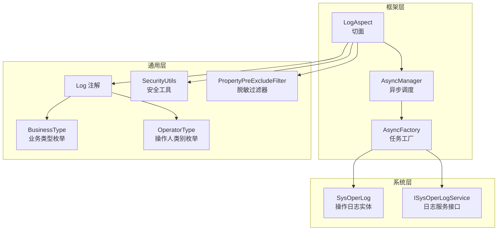
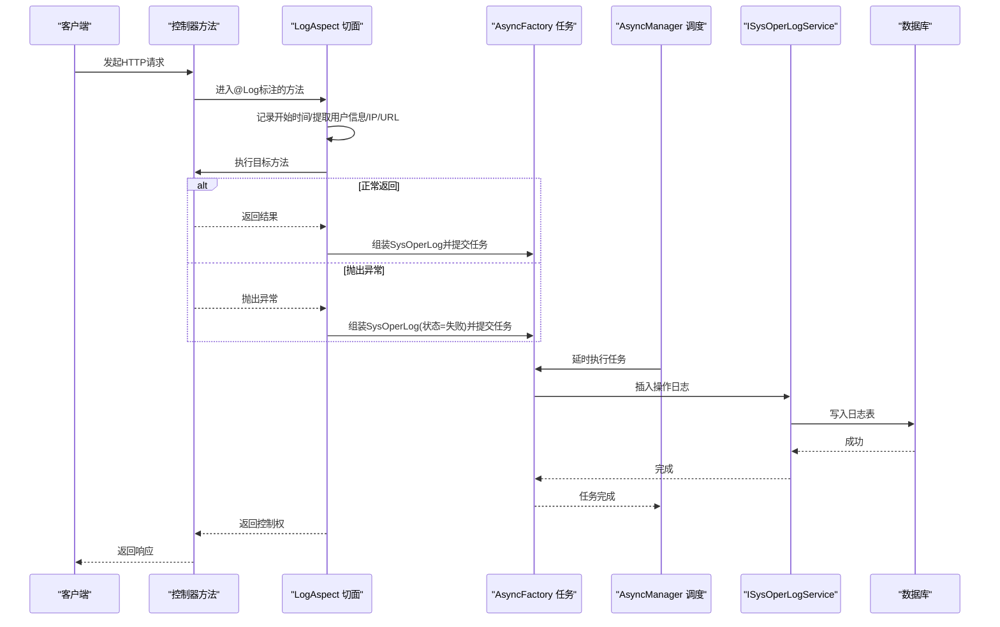
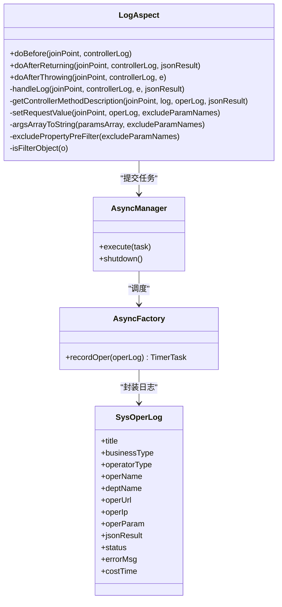
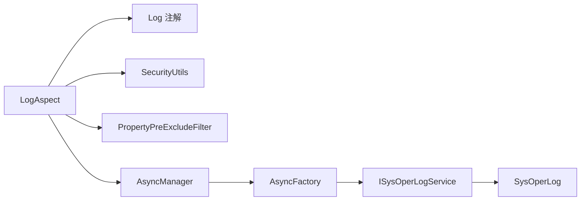

# 操作日志切面

<cite>
**本文引用的文件**
- [LogAspect.java](file://XingChen-Vue/xingchen-framework/src/main/java/com/xingchen/framework/aspectj/LogAspect.java)
- [Log.java](file://XingChen-Vue/xingchen-common/src/main/java/com/xingchen/common/annotation/Log.java)
- [SysOperLog.java](file://XingChen-Vue/xingchen-system/src/main/java/com/xingchen/system/domain/SysOperLog.java)
- [AsyncManager.java](file://XingChen-Vue/xingchen-framework/src/main/java/com/xingchen/framework/manager/AsyncManager.java)
- [AsyncFactory.java](file://XingChen-Vue/xingchen-framework/src/main/java/com/xingchen/framework/manager/factory/AsyncFactory.java)
- [BusinessType.java](file://XingChen-Vue/xingchen-common/src/main/java/com/xingchen/common/enums/BusinessType.java)
- [OperatorType.java](file://XingChen-Vue/xingchen-common/src/main/java/com/xingchen/common/enums/OperatorType.java)
- [SecurityUtils.java](file://XingChen-Vue/xingchen-common/src/main/java/com/xingchen/common/utils/SecurityUtils.java)
- [PropertyPreExcludeFilter.java](file://XingChen-Vue/xingchen-common/src/main/java/com/xingchen/common/filter/PropertyPreExcludeFilter.java)
- [ISysOperLogService.java](file://XingChen-Vue/xingchen-system/src/main/java/com/xingchen/system/service/ISysOperLogService.java)
</cite>

## 目录
1. [简介](#简介)
2. [项目结构](#项目结构)
3. [核心组件](#核心组件)
4. [架构总览](#架构总览)
5. [组件详解](#组件详解)
6. [依赖关系分析](#依赖关系分析)
7. [性能考量](#性能考量)
8. [故障排查指南](#故障排查指南)
9. [结论](#结论)
10. [附录](#附录)

## 简介
本文件系统性阐述“操作日志切面”的设计与实现，重点覆盖以下方面：
- 注解驱动的日志采集：Log 注解如何标注在控制器方法上，触发切面拦截。
- 请求参数提取与响应结果捕获：如何从请求上下文与返回值中抽取关键信息并安全脱敏。
- 日志级别与状态控制：成功/失败状态、错误消息与耗时统计。
- 敏感信息脱敏策略：内置敏感字段与可扩展排除列表。
- 异步日志记录机制：通过异步线程池降低请求链路阻塞。
- 操作类型分类与业务日志模板：业务类型、操作人类别、日志字段模板。
- 存储策略与查询接口：日志持久化与检索能力。
- 配置选项、性能优化与日志分析建议。

## 项目结构
围绕操作日志切面的关键文件分布如下：
- 切面与异步：LogAspect、AsyncManager、AsyncFactory
- 注解与模型：Log 注解、SysOperLog 实体、业务类型与操作人类别枚举
- 工具与服务：SecurityUtils、PropertyPreExcludeFilter、ISysOperLogService

图表来源
- [LogAspect.java:1-265](file://XingChen-Vue/xingchen-framework/src/main/java/com/xingchen/framework/aspectj/LogAspect.java#L1-L265)
- [Log.java:1-52](file://XingChen-Vue/xingchen-common/src/main/java/com/xingchen/common/annotation/Log.java#L1-L52)
- [SysOperLog.java:1-270](file://XingChen-Vue/xingchen-system/src/main/java/com/xingchen/system/domain/SysOperLog.java#L1-L270)
- [AsyncManager.java:1-56](file://XingChen-Vue/xingchen-framework/src/main/java/com/xingchen/framework/manager/AsyncManager.java#L1-L56)
- [AsyncFactory.java:1-103](file://XingChen-Vue/xingchen-framework/src/main/java/com/xingchen/framework/manager/factory/AsyncFactory.java#L1-L103)
- [BusinessType.java:1-60](file://XingChen-Vue/xingchen-common/src/main/java/com/xingchen/common/enums/BusinessType.java#L1-L60)
- [OperatorType.java:1-25](file://XingChen-Vue/xingchen-common/src/main/java/com/xingchen/common/enums/OperatorType.java#L1-L25)
- [SecurityUtils.java:1-189](file://XingChen-Vue/xingchen-common/src/main/java/com/xingchen/common/utils/SecurityUtils.java#L1-L189)
- [PropertyPreExcludeFilter.java:1-25](file://XingChen-Vue/xingchen-common/src/main/java/com/xingchen/common/filter/PropertyPreExcludeFilter.java#L1-L25)
- [ISysOperLogService.java:1-49](file://XingChen-Vue/xingchen-system/src/main/java/com/xingchen/system/service/ISysOperLogService.java#L1-L49)

章节来源
- [LogAspect.java:1-265](file://XingChen-Vue/xingchen-framework/src/main/java/com/xingchen/framework/aspectj/LogAspect.java#L1-L265)
- [Log.java:1-52](file://XingChen-Vue/xingchen-common/src/main/java/com/xingchen/common/annotation/Log.java#L1-L52)
- [SysOperLog.java:1-270](file://XingChen-Vue/xingchen-system/src/main/java/com/xingchen/system/domain/SysOperLog.java#L1-L270)
- [AsyncManager.java:1-56](file://XingChen-Vue/xingchen-framework/src/main/java/com/xingchen/framework/manager/AsyncManager.java#L1-L56)
- [AsyncFactory.java:1-103](file://XingChen-Vue/xingchen-framework/src/main/java/com/xingchen/framework/manager/factory/AsyncFactory.java#L1-L103)
- [BusinessType.java:1-60](file://XingChen-Vue/xingchen-common/src/main/java/com/xingchen/common/enums/BusinessType.java#L1-L60)
- [OperatorType.java:1-25](file://XingChen-Vue/xingchen-common/src/main/java/com/xingchen/common/enums/OperatorType.java#L1-L25)
- [SecurityUtils.java:1-189](file://XingChen-Vue/xingchen-common/src/main/java/com/xingchen/common/utils/SecurityUtils.java#L1-L189)
- [PropertyPreExcludeFilter.java:1-25](file://XingChen-Vue/xingchen-common/src/main/java/com/xingchen/common/filter/PropertyPreExcludeFilter.java#L1-L25)
- [ISysOperLogService.java:1-49](file://XingChen-Vue/xingchen-system/src/main/java/com/xingchen/system/service/ISysOperLogService.java#L1-L49)

## 核心组件
- LogAspect：基于注解的环绕式切面，负责在方法执行前后收集请求/响应、用户信息、IP 地址、耗时等，并异步落库。
- Log 注解：声明式标记，定义日志标题、业务类型、操作人类别、是否保存请求/响应数据及排除参数名。
- SysOperLog：操作日志实体，承载所有日志字段，支持 Excel 导出标注。
- AsyncManager/AsyncFactory：异步调度与任务封装，将日志写入数据库的任务放入线程池延时执行。
- BusinessType/OperatorType：业务类型与操作人类别的枚举，统一语义。
- SecurityUtils：获取当前登录用户信息，用于填充日志中的操作人与部门信息。
- PropertyPreExcludeFilter：JSON 序列化时的属性排除过滤器，配合内置敏感字段进行脱敏。
- ISysOperLogService：日志服务接口，提供插入、查询、批量删除、清空等能力。

章节来源
- [LogAspect.java:41-140](file://XingChen-Vue/xingchen-framework/src/main/java/com/xingchen/framework/aspectj/LogAspect.java#L41-L140)
- [Log.java:17-51](file://XingChen-Vue/xingchen-common/src/main/java/com/xingchen/common/annotation/Log.java#L17-L51)
- [SysOperLog.java:14-270](file://XingChen-Vue/xingchen-system/src/main/java/com/xingchen/system/domain/SysOperLog.java#L14-L270)
- [AsyncManager.java:14-56](file://XingChen-Vue/xingchen-framework/src/main/java/com/xingchen/framework/manager/AsyncManager.java#L14-L56)
- [AsyncFactory.java:24-103](file://XingChen-Vue/xingchen-framework/src/main/java/com/xingchen/framework/manager/factory/AsyncFactory.java#L24-L103)
- [BusinessType.java:8-60](file://XingChen-Vue/xingchen-common/src/main/java/com/xingchen/common/enums/BusinessType.java#L8-L60)
- [OperatorType.java:8-25](file://XingChen-Vue/xingchen-common/src/main/java/com/xingchen/common/enums/OperatorType.java#L8-L25)
- [SecurityUtils.java:72-82](file://XingChen-Vue/xingchen-common/src/main/java/com/xingchen/common/utils/SecurityUtils.java#L72-L82)
- [PropertyPreExcludeFilter.java:10-25](file://XingChen-Vue/xingchen-common/src/main/java/com/xingchen/common/filter/PropertyPreExcludeFilter.java#L10-L25)
- [ISysOperLogService.java:11-49](file://XingChen-Vue/xingchen-system/src/main/java/com/xingchen/system/service/ISysOperLogService.java#L11-L49)

## 架构总览
下图展示一次典型请求在切面中的处理流程：前置拦截、参数与响应采集、异常捕获、异步落库。

图表来源
- [LogAspect.java:59-140](file://XingChen-Vue/xingchen-framework/src/main/java/com/xingchen/framework/aspectj/LogAspect.java#L59-L140)
- [AsyncFactory.java:89-101](file://XingChen-Vue/xingchen-framework/src/main/java/com/xingchen/framework/manager/factory/AsyncFactory.java#L89-L101)
- [AsyncManager.java:43-46](file://XingChen-Vue/xingchen-framework/src/main/java/com/xingchen/framework/manager/AsyncManager.java#L43-L46)
- [ISysOperLogService.java:18](file://XingChen-Vue/xingchen-system/src/main/java/com/xingchen/system/service/ISysOperLogService.java#L18)

## 组件详解

### LogAspect：自动记录用户操作日志
- 切入点与生命周期
  - 使用前置通知记录开始时间，用于计算耗时。
  - 使用返回通知与异常通知分别处理正常返回与异常场景。
- 用户与环境信息
  - 通过安全工具获取当前登录用户，填充操作人与部门名称。
  - 通过 IP 工具获取客户端 IP 并解析地理位置。
- 请求/响应采集
  - 请求参数：优先从请求体读取，其次从方法参数序列化；支持排除敏感字段与自定义参数名。
  - 响应结果：仅在开启保存且返回值非空时记录 JSON 字符串，限制最大长度。
- 状态与错误
  - 默认状态为成功；发生异常时更新为失败并记录错误消息。
- 异步落库
  - 通过异步管理器提交延时任务，避免阻塞主线程。

章节来源
- [LogAspect.java:59-140](file://XingChen-Vue/xingchen-framework/src/main/java/com/xingchen/framework/aspectj/LogAspect.java#L59-L140)
- [LogAspect.java:149-168](file://XingChen-Vue/xingchen-framework/src/main/java/com/xingchen/framework/aspectj/LogAspect.java#L149-L168)
- [LogAspect.java:176-220](file://XingChen-Vue/xingchen-framework/src/main/java/com/xingchen/framework/aspectj/LogAspect.java#L176-L220)
- [LogAspect.java:225-228](file://XingChen-Vue/xingchen-framework/src/main/java/com/xingchen/framework/aspectj/LogAspect.java#L225-L228)
- [LogAspect.java:236-263](file://XingChen-Vue/xingchen-framework/src/main/java/com/xingchen/framework/aspectj/LogAspect.java#L236-L263)

#### 类关系图

图表来源
- [LogAspect.java:41-265](file://XingChen-Vue/xingchen-framework/src/main/java/com/xingchen/framework/aspectj/LogAspect.java#L41-L265)
- [AsyncManager.java:14-56](file://XingChen-Vue/xingchen-framework/src/main/java/com/xingchen/framework/manager/AsyncManager.java#L14-L56)
- [AsyncFactory.java:24-103](file://XingChen-Vue/xingchen-framework/src/main/java/com/xingchen/framework/manager/factory/AsyncFactory.java#L24-L103)
- [SysOperLog.java:14-270](file://XingChen-Vue/xingchen-system/src/main/java/com/xingchen/system/domain/SysOperLog.java#L14-L270)

### Log 注解：声明式日志开关与模板
- 关键属性
  - title：日志标题/模块名。
  - businessType：业务类型（新增/修改/删除/授权/导出/导入/强退/生成代码/清空数据/其他）。
  - operatorType：操作人类别（其它/后台用户/手机端用户）。
  - isSaveRequestData/isSaveResponseData：是否保存请求/响应数据。
  - excludeParamNames：额外排除的参数名列表。
- 使用位置
  - 可标注在方法或参数上，切面通过切入点匹配标注了该注解的方法。

章节来源
- [Log.java:17-51](file://XingChen-Vue/xingchen-common/src/main/java/com/xingchen/common/annotation/Log.java#L17-L51)
- [BusinessType.java:8-60](file://XingChen-Vue/xingchen-common/src/main/java/com/xingchen/common/enums/BusinessType.java#L8-L60)
- [OperatorType.java:8-25](file://XingChen-Vue/xingchen-common/src/main/java/com/xingchen/common/enums/OperatorType.java#L8-L25)

### SysOperLog：操作日志实体与模板字段
- 字段覆盖范围
  - 标题、业务类型、请求方法、请求方式、操作人类别、操作人、部门名称、请求 URL、IP、地理位置、请求参数、返回参数、状态、错误消息、操作时间、耗时等。
- 导出支持
  - 使用 Excel 注解便于导出与展示。

章节来源
- [SysOperLog.java:14-270](file://XingChen-Vue/xingchen-system/src/main/java/com/xingchen/system/domain/SysOperLog.java#L14-L270)

### 异步日志记录机制
- AsyncManager
  - 提供单例访问，通过 Spring 获取 ScheduledExecutorService。
  - 以固定延迟将任务提交至线程池，降低请求路径阻塞。
- AsyncFactory
  - recordOper：封装异步任务，远程解析地理位置后调用服务接口写入数据库。

章节来源
- [AsyncManager.java:14-56](file://XingChen-Vue/xingchen-framework/src/main/java/com/xingchen/framework/manager/AsyncManager.java#L14-L56)
- [AsyncFactory.java:89-101](file://XingChen-Vue/xingchen-framework/src/main/java/com/xingchen/framework/manager/factory/AsyncFactory.java#L89-L101)

### 敏感信息脱敏与参数过滤
- 内置敏感字段
  - password、oldPassword、newPassword、confirmPassword。
- 过滤策略
  - 在序列化请求参数时，使用 PropertyPreExcludeFilter 排除敏感字段与自定义排除项。
  - 对文件上传、请求/响应对象与校验结果对象进行过滤，避免无意义或大对象进入日志。

章节来源
- [LogAspect.java:47-48](file://XingChen-Vue/xingchen-framework/src/main/java/com/xingchen/framework/aspectj/LogAspect.java#L47-L48)
- [LogAspect.java:225-228](file://XingChen-Vue/xingchen-framework/src/main/java/com/xingchen/framework/aspectj/LogAspect.java#L225-L228)
- [PropertyPreExcludeFilter.java:10-25](file://XingChen-Vue/xingchen-common/src/main/java/com/xingchen/common/filter/PropertyPreExcludeFilter.java#L10-L25)
- [LogAspect.java:236-263](file://XingChen-Vue/xingchen-framework/src/main/java/com/xingchen/framework/aspectj/LogAspect.java#L236-L263)

### 日志级别与状态控制
- 状态映射
  - 成功：默认状态。
  - 失败：捕获异常时更新为失败并记录错误消息。
- 耗时统计
  - 使用 ThreadLocal 记录开始时间，结束时计算毫秒级耗时。

章节来源
- [LogAspect.java:96-116](file://XingChen-Vue/xingchen-framework/src/main/java/com/xingchen/framework/aspectj/LogAspect.java#L96-L116)
- [LogAspect.java:125-127](file://XingChen-Vue/xingchen-framework/src/main/java/com/xingchen/framework/aspectj/LogAspect.java#L125-L127)

### 操作类型分类与业务日志模板
- 业务类型（businessType）
  - 其它、新增、修改、删除、授权、导出、导入、强退、生成代码、清空数据。
- 操作人类别（operatorType）
  - 其它、后台用户、手机端用户。
- 日志模板字段
  - 标题、业务类型、请求方式、请求方法、操作人、部门、IP、地理位置、请求参数、返回参数、状态、错误消息、耗时、时间等。

章节来源
- [BusinessType.java:8-60](file://XingChen-Vue/xingchen-common/src/main/java/com/xingchen/common/enums/BusinessType.java#L8-L60)
- [OperatorType.java:8-25](file://XingChen-Vue/xingchen-common/src/main/java/com/xingchen/common/enums/OperatorType.java#L8-L25)
- [SysOperLog.java:22-88](file://XingChen-Vue/xingchen-system/src/main/java/com/xingchen/system/domain/SysOperLog.java#L22-L88)

### 日志存储策略与查询接口
- 存储策略
  - 异步写入数据库，减少请求延迟。
  - 地理位置采用远程解析，确保可读性。
- 查询与维护
  - 支持按条件查询、批量删除、按 ID 查询、清空日志等。

章节来源
- [AsyncFactory.java:96-98](file://XingChen-Vue/xingchen-framework/src/main/java/com/xingchen/framework/manager/factory/AsyncFactory.java#L96-L98)
- [ISysOperLogService.java:18-47](file://XingChen-Vue/xingchen-system/src/main/java/com/xingchen/system/service/ISysOperLogService.java#L18-L47)

### 请求参数提取与响应结果捕获
- 请求参数提取
  - 优先从请求参数映射读取；对于 PUT/POST/DELETE 方法，若无表单参数则从方法参数序列化。
  - 对象序列化时应用脱敏过滤器与长度限制。
- 响应结果捕获
  - 仅在开启保存且返回值非空时记录 JSON 字符串，限制最大长度。

章节来源
- [LogAspect.java:176-189](file://XingChen-Vue/xingchen-framework/src/main/java/com/xingchen/framework/aspectj/LogAspect.java#L176-L189)
- [LogAspect.java:164-167](file://XingChen-Vue/xingchen-framework/src/main/java/com/xingchen/framework/aspectj/LogAspect.java#L164-L167)
- [LogAspect.java:194-220](file://XingChen-Vue/xingchen-framework/src/main/java/com/xingchen/framework/aspectj/LogAspect.java#L194-L220)

## 依赖关系分析
- 切面依赖
  - LogAspect 依赖 Log 注解、SysOperLog、SecurityUtils、PropertyPreExcludeFilter、AsyncManager/AsyncFactory。
- 异步链路
  - AsyncManager 依赖 Spring 的 ScheduledExecutorService；AsyncFactory 依赖 ISysOperLogService 与 SysOperLog。
- 服务接口
  - ISysOperLogService 提供日志写入与查询能力，被 AsyncFactory 调用。

图表来源
- [LogAspect.java:19-34](file://XingChen-Vue/xingchen-framework/src/main/java/com/xingchen/framework/aspectj/LogAspect.java#L19-L34)
- [AsyncManager.java:24](file://XingChen-Vue/xingchen-framework/src/main/java/com/xingchen/framework/manager/AsyncManager.java#L24)
- [AsyncFactory.java:16-17](file://XingChen-Vue/xingchen-framework/src/main/java/com/xingchen/framework/manager/factory/AsyncFactory.java#L16-L17)
- [ISysOperLogService.java:4](file://XingChen-Vue/xingchen-system/src/main/java/com/xingchen/system/service/ISysOperLogService.java#L4)

章节来源
- [LogAspect.java:19-34](file://XingChen-Vue/xingchen-framework/src/main/java/com/xingchen/framework/aspectj/LogAspect.java#L19-L34)
- [AsyncManager.java:24](file://XingChen-Vue/xingchen-framework/src/main/java/com/xingchen/framework/manager/AsyncManager.java#L24)
- [AsyncFactory.java:16-17](file://XingChen-Vue/xingchen-framework/src/main/java/com/xingchen/framework/manager/factory/AsyncFactory.java#L16-L17)
- [ISysOperLogService.java:4](file://XingChen-Vue/xingchen-system/src/main/java/com/xingchen/system/service/ISysOperLogService.java#L4)

## 性能考量
- 异步落库
  - 通过延时任务与线程池调度，避免阻塞请求线程，提升吞吐。
- 参数长度限制
  - 请求参数与响应结果均设置最大长度，防止超长日志影响性能与存储成本。
- 过滤对象
  - 对文件上传、请求/响应对象与校验结果进行过滤，减少无关数据进入日志。
- 地理位置解析
  - 异步解析 IP 地址，避免同步网络调用导致延迟。

章节来源
- [LogAspect.java:54](file://XingChen-Vue/xingchen-framework/src/main/java/com/xingchen/framework/aspectj/LogAspect.java#L54)
- [LogAspect.java:166](file://XingChen-Vue/xingchen-framework/src/main/java/com/xingchen/framework/aspectj/LogAspect.java#L166)
- [LogAspect.java:187](file://XingChen-Vue/xingchen-framework/src/main/java/com/xingchen/framework/aspectj/LogAspect.java#L187)
- [LogAspect.java:207-210](file://XingChen-Vue/xingchen-framework/src/main/java/com/xingchen/framework/aspectj/LogAspect.java#L207-L210)
- [LogAspect.java:236-263](file://XingChen-Vue/xingchen-framework/src/main/java/com/xingchen/framework/aspectj/LogAspect.java#L236-L263)
- [AsyncFactory.java:96-98](file://XingChen-Vue/xingchen-framework/src/main/java/com/xingchen/framework/manager/factory/AsyncFactory.java#L96-L98)

## 故障排查指南
- 切面未生效
  - 检查目标方法是否标注 Log 注解；确认切面扫描路径与组件注册。
- 日志缺失
  - 确认 isSaveRequestData/isSaveResponseData 开关；检查参数是否被排除；确认返回值非空。
- 敏感信息泄露
  - 核对内置敏感字段与自定义排除列表；确保序列化时应用脱敏过滤器。
- 异步任务未执行
  - 检查线程池是否正确注入；确认延时任务是否被调度。
- 地理位置为空
  - 确认远程解析服务可用；检查 IP 地址有效性。

章节来源
- [Log.java:38-50](file://XingChen-Vue/xingchen-common/src/main/java/com/xingchen/common/annotation/Log.java#L38-L50)
- [LogAspect.java:225-228](file://XingChen-Vue/xingchen-framework/src/main/java/com/xingchen/framework/aspectj/LogAspect.java#L225-L228)
- [AsyncManager.java:24](file://XingChen-Vue/xingchen-framework/src/main/java/com/xingchen/framework/manager/AsyncManager.java#L24)
- [AsyncFactory.java:96-98](file://XingChen-Vue/xingchen-framework/src/main/java/com/xingchen/framework/manager/factory/AsyncFactory.java#L96-L98)

## 结论
LogAspect 通过注解驱动与切面编程实现了对控制器方法的自动化日志采集，结合异步落库与参数脱敏策略，在保证安全性与性能的同时，提供了完整的操作审计能力。配合清晰的业务类型与操作人类别枚举，以及完善的查询与维护接口，满足生产环境下的日志需求。

## 附录

### 配置选项与最佳实践
- 开启/关闭请求/响应数据保存
  - 在 Log 注解中设置 isSaveRequestData/isSaveResponseData。
- 自定义排除参数
  - 使用 excludeParamNames 指定额外排除项。
- 业务类型与操作人类别
  - 根据实际业务选择合适的枚举值，确保日志分类准确。
- 异步线程池
  - 确保 scheduledExecutorService 正常注入，避免异步任务丢失。

章节来源
- [Log.java:38-50](file://XingChen-Vue/xingchen-common/src/main/java/com/xingchen/common/annotation/Log.java#L38-L50)
- [BusinessType.java:8-60](file://XingChen-Vue/xingchen-common/src/main/java/com/xingchen/common/enums/BusinessType.java#L8-L60)
- [OperatorType.java:8-25](file://XingChen-Vue/xingchen-common/src/main/java/com/xingchen/common/enums/OperatorType.java#L8-L25)
- [AsyncManager.java:24](file://XingChen-Vue/xingchen-framework/src/main/java/com/xingchen/framework/manager/AsyncManager.java#L24)