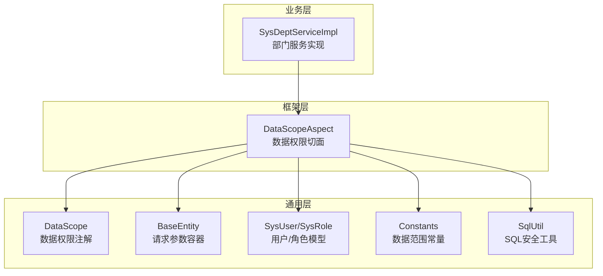
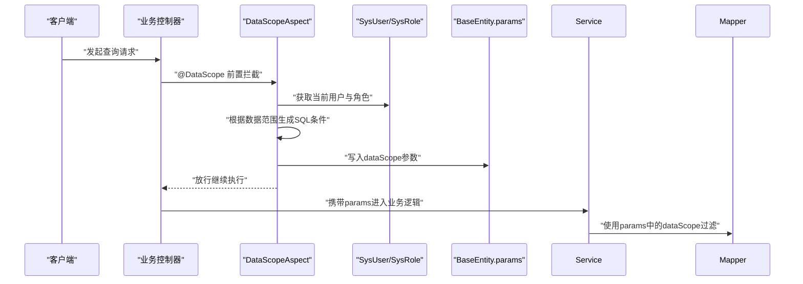
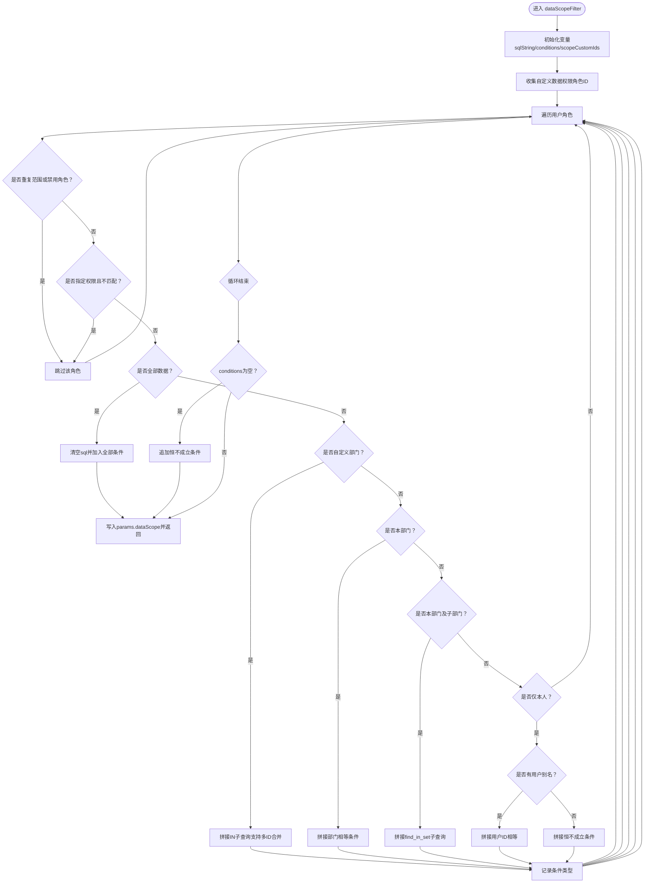
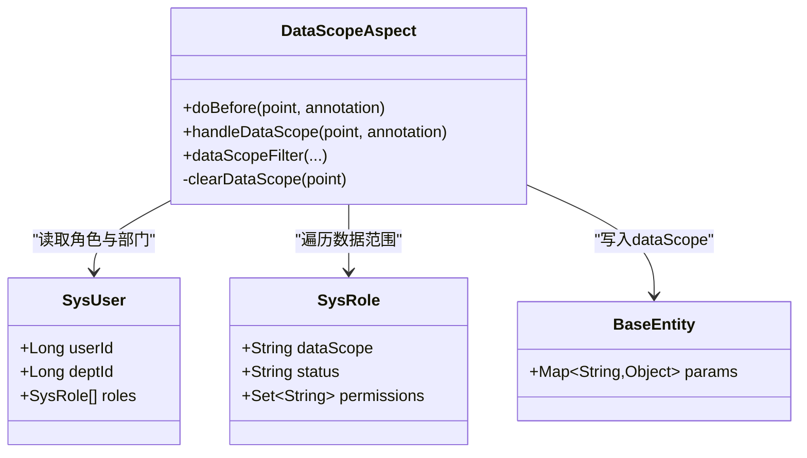
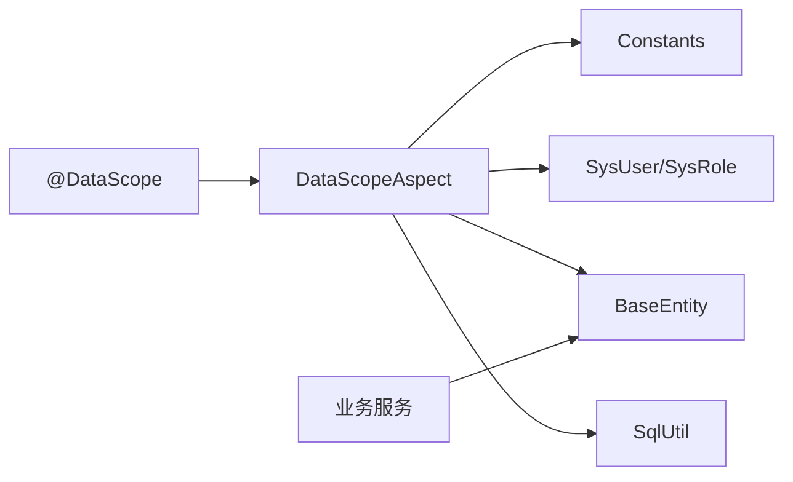

# 数据权限切面

<cite>
**本文引用的文件**
- [DataScopeAspect.java](file://XingChen-Vue/xingchen-framework/src/main/java/com/xingchen/framework/aspectj/DataScopeAspect.java)
- [DataScope.java](file://XingChen-Vue/xingchen-common/src/main/java/com/xingchen/common/annotation/DataScope.java)
- [BaseEntity.java](file://XingChen-Vue/xingchen-common/src/main/java/com/xingchen/common/core/domain/BaseEntity.java)
- [SysRole.java](file://XingChen-Vue/xingchen-common/src/main/java/com/xingchen/common/core/domain/entity/SysRole.java)
- [SysUser.java](file://XingChen-Vue/xingchen-common/src/main/java/com/xingchen/common/core/domain/entity/SysUser.java)
- [Constants.java](file://XingChen-Vue/xingchen-common/src/main/java/com/xingchen/common/constant/Constants.java)
- [SqlUtil.java](file://XingChen-Vue/xingchen-common/src/main/java/com/xingchen/common/utils/sql/SqlUtil.java)
- [SysDeptServiceImpl.java](file://XingChen-Vue/xingchen-system/src/main/java/com/xingchen/system/service/impl/SysDeptServiceImpl.java)
- [ry_20260321.sql](file://XingChen-Vue/sql/ry_20260321.sql)
</cite>

## 目录
1. [简介](#简介)
2. [项目结构](#项目结构)
3. [核心组件](#核心组件)
4. [架构总览](#架构总览)
5. [详细组件分析](#详细组件分析)
6. [依赖关系分析](#依赖关系分析)
7. [性能考量](#性能考量)
8. [故障排查指南](#故障排查指南)
9. [结论](#结论)
10. [附录](#附录)

## 简介
本文件系统性阐述健康管理系统中的数据权限切面实现，重点围绕 DataScopeAspect 如何基于角色数据范围控制对查询参数进行动态 SQL 条件拼接，以及如何在不引入 SQL 注入的前提下，实现“全部数据”、“自定义部门”、“本部门”、“本部门及子部门”、“仅本人”等多维度权限过滤。同时说明切面对 BaseEntity 参数的处理方式、权限字符匹配逻辑、SQL 注入防护机制与性能优化策略，并提供注解使用示例、配置参数说明与常见问题解决方案。

## 项目结构
数据权限切面位于框架模块，配合通用注解与实体模型共同完成权限控制闭环：
- 切面：负责拦截标注了数据权限注解的方法，在进入业务逻辑前动态拼接 SQL 条件并写入请求参数
- 注解：声明查询参数中使用的表别名、字段名与权限字符来源
- 实体：用户与角色模型承载权限与数据范围信息
- 常量：定义数据范围枚举值
- 工具：SQL 关键词过滤与校验工具

**图表来源**
- [DataScopeAspect.java:1-161](file://XingChen-Vue/xingchen-framework/src/main/java/com/xingchen/framework/aspectj/DataScopeAspect.java#L1-L161)
- [DataScope.java:1-44](file://XingChen-Vue/xingchen-common/src/main/java/com/xingchen/common/annotation/DataScope.java#L1-L44)
- [BaseEntity.java:1-119](file://XingChen-Vue/xingchen-common/src/main/java/com/xingchen/common/core/domain/BaseEntity.java#L1-L119)
- [SysRole.java:1-242](file://XingChen-Vue/xingchen-common/src/main/java/com/xingchen/common/core/domain/entity/SysRole.java#L1-L242)
- [SysUser.java:1-337](file://XingChen-Vue/xingchen-common/src/main/java/com/xingchen/common/core/domain/entity/SysUser.java#L1-L337)
- [Constants.java:175-203](file://XingChen-Vue/xingchen-common/src/main/java/com/xingchen/common/constant/Constants.java#L175-L203)
- [SqlUtil.java:1-71](file://XingChen-Vue/xingchen-common/src/main/java/com/xingchen/common/utils/sql/SqlUtil.java#L1-L71)
- [SysDeptServiceImpl.java:1-43](file://XingChen-Vue/xingchen-system/src/main/java/com/xingchen/system/service/impl/SysDeptServiceImpl.java#L1-L43)

**章节来源**
- [DataScopeAspect.java:1-161](file://XingChen-Vue/xingchen-framework/src/main/java/com/xingchen/framework/aspectj/DataScopeAspect.java#L1-L161)
- [DataScope.java:1-44](file://XingChen-Vue/xingchen-common/src/main/java/com/xingchen/common/annotation/DataScope.java#L1-L44)
- [BaseEntity.java:1-119](file://XingChen-Vue/xingchen-common/src/main/java/com/xingchen/common/core/domain/BaseEntity.java#L1-L119)
- [SysRole.java:1-242](file://XingChen-Vue/xingchen-common/src/main/java/com/xingchen/common/core/domain/entity/SysRole.java#L1-L242)
- [SysUser.java:1-337](file://XingChen-Vue/xingchen-common/src/main/java/com/xingchen/common/core/domain/entity/SysUser.java#L1-L337)
- [Constants.java:175-203](file://XingChen-Vue/xingchen-common/src/main/java/com/xingchen/common/constant/Constants.java#L175-L203)
- [SqlUtil.java:1-71](file://XingChen-Vue/xingchen-common/src/main/java/com/xingchen/common/utils/sql/SqlUtil.java#L1-L71)
- [SysDeptServiceImpl.java:1-43](file://XingChen-Vue/xingchen-system/src/main/java/com/xingchen/system/service/impl/SysDeptServiceImpl.java#L1-L43)

## 核心组件
- DataScopeAspect：基于注解的前置切面，负责清理与生成数据权限 SQL 条件，并写入 BaseEntity 的 params 中
- DataScope：声明查询参数中涉及的表别名、字段名与权限字符来源
- BaseEntity：承载请求参数的 Map 容器，切面通过该容器传递动态 SQL 片段
- SysUser/SysRole：用户与角色模型，包含数据范围与权限集合
- Constants：定义数据范围枚举值（全部、自定义、本部门、本部门及子部门、仅本人）
- SqlUtil：提供 SQL 关键词过滤与排序校验，辅助整体安全

**章节来源**
- [DataScopeAspect.java:35-56](file://XingChen-Vue/xingchen-framework/src/main/java/com/xingchen/framework/aspectj/DataScopeAspect.java#L35-L56)
- [DataScope.java:17-43](file://XingChen-Vue/xingchen-common/src/main/java/com/xingchen/common/annotation/DataScope.java#L17-L43)
- [BaseEntity.java:105-117](file://XingChen-Vue/xingchen-common/src/main/java/com/xingchen/common/core/domain/BaseEntity.java#L105-L117)
- [SysRole.java:132-140](file://XingChen-Vue/xingchen-common/src/main/java/com/xingchen/common/core/domain/entity/SysRole.java#L132-L140)
- [SysUser.java:271-279](file://XingChen-Vue/xingchen-common/src/main/java/com/xingchen/common/core/domain/entity/SysUser.java#L271-L279)
- [Constants.java:177-203](file://XingChen-Vue/xingchen-common/src/main/java/com/xingchen/common/constant/Constants.java#L177-L203)
- [SqlUtil.java:11-71](file://XingChen-Vue/xingchen-common/src/main/java/com/xingchen/common/utils/sql/SqlUtil.java#L11-L71)

## 架构总览
数据权限切面在控制器方法执行前生效，通过注解声明的别名与字段，结合用户的角色数据范围与权限字符，动态生成 SQL 条件并注入到查询参数中，最终由业务层的 Mapper/Service 使用该参数完成过滤。

**图表来源**
- [DataScopeAspect.java:35-56](file://XingChen-Vue/xingchen-framework/src/main/java/com/xingchen/framework/aspectj/DataScopeAspect.java#L35-L56)
- [DataScope.java:17-43](file://XingChen-Vue/xingchen-common/src/main/java/com/xingchen/common/annotation/DataScope.java#L17-L43)
- [BaseEntity.java:105-117](file://XingChen-Vue/xingchen-common/src/main/java/com/xingchen/common/core/domain/BaseEntity.java#L105-L117)
- [SysRole.java:132-140](file://XingChen-Vue/xingchen-common/src/main/java/com/xingchen/common/core/domain/entity/SysRole.java#L132-L140)
- [SysUser.java:271-279](file://XingChen-Vue/xingchen-common/src/main/java/com/xingchen/common/core/domain/entity/SysUser.java#L271-L279)

## 详细组件分析

### DataScopeAspect：数据权限切面
- 拦截点：使用注解驱动的前置通知，拦截带有 @DataScope 的方法
- 用户判定：若当前用户为超级管理员则跳过过滤
- 权限字符：优先使用注解指定的 permission，否则回退到上下文持有的权限字符串
- 条件生成：遍历用户角色，按数据范围类型拼接 SQL 条件，支持短路（全部数据）与去重（相同范围类型只处理一次）
- 参数注入：将最终 SQL 条件写入 BaseEntity 的 params，键名为 dataScope

关键流程要点：
- 清理旧值：每次拼接前先清空 params.dataScope，避免历史残留
- 条件短路：遇到“全部数据”直接清空条件并结束循环
- 多角色合并：相同范围类型去重，避免重复拼接
- 仅本人保护：当数据范围为“仅本人”但未提供用户别名时，构造无结果的条件以确保安全

**图表来源**
- [DataScopeAspect.java:67-146](file://XingChen-Vue/xingchen-framework/src/main/java/com/xingchen/framework/aspectj/DataScopeAspect.java#L67-L146)

**章节来源**
- [DataScopeAspect.java:35-56](file://XingChen-Vue/xingchen-framework/src/main/java/com/xingchen/framework/aspectj/DataScopeAspect.java#L35-L56)
- [DataScopeAspect.java:67-146](file://XingChen-Vue/xingchen-framework/src/main/java/com/xingchen/framework/aspectj/DataScopeAspect.java#L67-L146)
- [DataScopeAspect.java:151-159](file://XingChen-Vue/xingchen-framework/src/main/java/com/xingchen/framework/aspectj/DataScopeAspect.java#L151-L159)

### DataScope 注解：参数与行为声明
- userAlias/deptAlias：查询参数中用户表与部门表的别名
- userField/deptField：对应字段名（默认 user_id 与 dept_id）
- permission：权限字符，默认从上下文获取，支持多权限逗号分隔匹配

使用建议：
- 当查询涉及多表连接时，务必提供正确的表别名与字段名
- 若业务需要限定特定权限才应用数据范围，可通过 permission 指定

**章节来源**
- [DataScope.java:17-43](file://XingChen-Vue/xingchen-common/src/main/java/com/xingchen/common/annotation/DataScope.java#L17-L43)

### BaseEntity：参数容器与注入点
- params：Map 类型，承载动态 SQL 片段 dataScope
- 切面通过 params.put(DATA_SCOPE, "...") 将拼接好的条件写入，供后续查询使用

注意：
- params 在序列化时采用非空策略，避免污染响应
- 切面在每次拼接前会清空 dataScope，确保幂等

**章节来源**
- [BaseEntity.java:41-43](file://XingChen-Vue/xingchen-common/src/main/java/com/xingchen/common/core/domain/BaseEntity.java#L41-L43)
- [BaseEntity.java:105-117](file://XingChen-Vue/xingchen-common/src/main/java/com/xingchen/common/core/domain/BaseEntity.java#L105-L117)
- [DataScopeAspect.java:151-159](file://XingChen-Vue/xingchen-framework/src/main/java/com/xingchen/framework/aspectj/DataScopeAspect.java#L151-L159)

### 角色与用户模型：数据范围与权限来源
- SysRole：包含 dataScope（枚举值）、status（启用/禁用）、permissions（权限集合）
- SysUser：包含 deptId、roles 等，用于计算“本部门/仅本人”等条件

**章节来源**
- [SysRole.java:132-140](file://XingChen-Vue/xingchen-common/src/main/java/com/xingchen/common/core/domain/entity/SysRole.java#L132-L140)
- [SysRole.java:212-220](file://XingChen-Vue/xingchen-common/src/main/java/com/xingchen/common/core/domain/entity/SysRole.java#L212-L220)
- [SysUser.java:271-279](file://XingChen-Vue/xingchen-common/src/main/java/com/xingchen/common/core/domain/entity/SysUser.java#L271-L279)

### 数据范围类型与实现原理
- 全部数据（1）：遇到即短路，不再拼接其他条件
- 自定义部门（2）：聚合所有具备“自定义部门”范围的正常角色 ID，一次性生成 IN 子查询，避免多次拼接
- 本部门（3）：直接比较部门字段等于当前用户所在部门
- 本部门及子部门（4）：使用数据库函数查找祖先关系，包含本部门及其所有子节点
- 仅本人（5）：若提供用户别名则比较用户字段等于当前用户 ID；否则构造恒不成立条件，确保安全

**图表来源**
- [SysRole.java:132-140](file://XingChen-Vue/xingchen-common/src/main/java/com/xingchen/common/core/domain/entity/SysRole.java#L132-L140)
- [SysUser.java:271-279](file://XingChen-Vue/xingchen-common/src/main/java/com/xingchen/common/core/domain/entity/SysUser.java#L271-L279)
- [DataScopeAspect.java:42-56](file://XingChen-Vue/xingchen-framework/src/main/java/com/xingchen/framework/aspectj/DataScopeAspect.java#L42-L56)
- [BaseEntity.java:105-117](file://XingChen-Vue/xingchen-common/src/main/java/com/xingchen/common/core/domain/BaseEntity.java#L105-L117)

**章节来源**
- [Constants.java:177-203](file://XingChen-Vue/xingchen-common/src/main/java/com/xingchen/common/constant/Constants.java#L177-L203)
- [DataScopeAspect.java:79-129](file://XingChen-Vue/xingchen-framework/src/main/java/com/xingchen/framework/aspectj/DataScopeAspect.java#L79-L129)

### SQL 注入防护机制
- 参数注入前清空：每次拼接前将 params.dataScope 置空，避免历史残留导致的注入风险
- 字符串格式化：使用安全的格式化方法拼接 SQL 片段，避免直接拼接原始输入
- 权限字符校验：通过 ContainsAny 与权限集合匹配，确保仅在满足权限字符时才应用范围过滤
- SQL 关键词过滤：全局 SQL 安全工具可对排序与输入进行关键词过滤与长度限制

**章节来源**
- [DataScopeAspect.java:151-159](file://XingChen-Vue/xingchen-framework/src/main/java/com/xingchen/framework/aspectj/DataScopeAspect.java#L151-L159)
- [DataScopeAspect.java:86-89](file://XingChen-Vue/xingchen-framework/src/main/java/com/xingchen/framework/aspectj/DataScopeAspect.java#L86-L89)
- [SqlUtil.java:55-70](file://XingChen-Vue/xingchen-common/src/main/java/com/xingchen/common/utils/sql/SqlUtil.java#L55-L70)

### 性能优化策略
- 条件短路：遇到“全部数据”立即清空并结束，避免多余拼接
- 去重处理：相同范围类型的条件仅处理一次，减少重复逻辑
- 自定义部门合并：多角色自定义部门 ID 合并为 IN 子查询，降低子查询数量
- 参数幂等：每次调用前清空 dataScope，避免累积导致的性能与安全问题

**章节来源**
- [DataScopeAspect.java:90-94](file://XingChen-Vue/xingchen-framework/src/main/java/com/xingchen/framework/aspectj/DataScopeAspect.java#L90-L94)
- [DataScopeAspect.java:82-84](file://XingChen-Vue/xingchen-framework/src/main/java/com/xingchen/framework/aspectj/DataScopeAspect.java#L82-L84)
- [DataScopeAspect.java:98-106](file://XingChen-Vue/xingchen-framework/src/main/java/com/xingchen/framework/aspectj/DataScopeAspect.java#L98-L106)

### 注解使用示例与配置参数
- 示例场景：在部门查询接口上使用 @DataScope，指定部门表别名与字段，必要时指定权限字符
- 参数说明：
  - userAlias：用户表别名（仅在“仅本人”场景需要）
  - deptAlias：部门表别名（必填）
  - userField：用户字段名（默认 user_id）
  - deptField：部门字段名（默认 dept_id）
  - permission：权限字符（默认从上下文获取）

实际应用位置参考：
- 控制器方法上标注 @DataScope
- 业务服务接收 BaseEntity 参数，内部使用 params.dataScope 进行查询拼接

**章节来源**
- [DataScope.java:17-43](file://XingChen-Vue/xingchen-common/src/main/java/com/xingchen/common/annotation/DataScope.java#L17-L43)
- [SysDeptServiceImpl.java:10-43](file://XingChen-Vue/xingchen-system/src/main/java/com/xingchen/system/service/impl/SysDeptServiceImpl.java#L10-L43)

### 常见问题与解决方案
- 问题：仅本人数据范围但未提供用户别名，导致查询不到任何数据
  - 解决：提供 userAlias 或调整数据范围为“本部门/自定义部门”
- 问题：多角色同时具备“自定义部门”，查询性能下降
  - 解决：框架已自动合并为 IN 子查询，无需额外处理
- 问题：权限字符不匹配导致数据范围未生效
  - 解决：确认角色 permissions 是否包含指定权限字符
- 问题：SQL 注入风险
  - 解决：确保通过切面注入 dataScope，不要手动拼接原始输入

**章节来源**
- [DataScopeAspect.java:116-127](file://XingChen-Vue/xingchen-framework/src/main/java/com/xingchen/framework/aspectj/DataScopeAspect.java#L116-L127)
- [DataScopeAspect.java:86-89](file://XingChen-Vue/xingchen-framework/src/main/java/com/xingchen/framework/aspectj/DataScopeAspect.java#L86-L89)
- [DataScopeAspect.java:151-159](file://XingChen-Vue/xingchen-framework/src/main/java/com/xingchen/framework/aspectj/DataScopeAspect.java#L151-L159)

## 依赖关系分析
- 切面依赖注解、常量、用户/角色模型与安全工具
- 注解作为声明式配置，指导切面生成 SQL 条件
- BaseEntity 作为参数载体，贯穿整个调用链
- 业务服务通过接收 BaseEntity 并使用其中的 dataScope 完成过滤

**图表来源**
- [DataScope.java:17-43](file://XingChen-Vue/xingchen-common/src/main/java/com/xingchen/common/annotation/DataScope.java#L17-L43)
- [DataScopeAspect.java:1-161](file://XingChen-Vue/xingchen-framework/src/main/java/com/xingchen/framework/aspectj/DataScopeAspect.java#L1-L161)
- [Constants.java:175-203](file://XingChen-Vue/xingchen-common/src/main/java/com/xingchen/common/constant/Constants.java#L175-L203)
- [BaseEntity.java:105-117](file://XingChen-Vue/xingchen-common/src/main/java/com/xingchen/common/core/domain/BaseEntity.java#L105-L117)
- [SqlUtil.java:1-71](file://XingChen-Vue/xingchen-common/src/main/java/com/xingchen/common/utils/sql/SqlUtil.java#L1-L71)

**章节来源**
- [DataScopeAspect.java:1-161](file://XingChen-Vue/xingchen-framework/src/main/java/com/xingchen/framework/aspectj/DataScopeAspect.java#L1-L161)
- [DataScope.java:1-44](file://XingChen-Vue/xingchen-common/src/main/java/com/xingchen/common/annotation/DataScope.java#L1-L44)
- [BaseEntity.java:1-119](file://XingChen-Vue/xingchen-common/src/main/java/com/xingchen/common/core/domain/BaseEntity.java#L1-L119)

## 性能考量
- 条件短路与去重：避免重复拼接与无效计算
- 自定义部门合并：IN 子查询减少子查询次数
- 参数幂等：清空 dataScope 防止累积，保持每次调用一致的性能表现
- SQL 安全：通过格式化与关键词过滤，降低异常分支带来的性能损耗

[本节为通用性能讨论，不直接分析具体文件]

## 故障排查指南
- 确认当前用户不是超级管理员：超级管理员不会应用数据范围过滤
- 检查角色状态与权限字符：禁用角色与不匹配权限字符会被跳过
- 核对表别名与字段名：错误的别名会导致条件无法生效
- 查看 params.dataScope 内容：确认切面已正确注入 SQL 片段
- 排查 SQL 安全工具：若出现排序或输入异常，检查是否触发了 SQL 关键词过滤

**章节来源**
- [DataScopeAspect.java:48-55](file://XingChen-Vue/xingchen-framework/src/main/java/com/xingchen/framework/aspectj/DataScopeAspect.java#L48-L55)
- [DataScopeAspect.java:82-89](file://XingChen-Vue/xingchen-framework/src/main/java/com/xingchen/framework/aspectj/DataScopeAspect.java#L82-L89)
- [DataScopeAspect.java:137-145](file://XingChen-Vue/xingchen-framework/src/main/java/com/xingchen/framework/aspectj/DataScopeAspect.java#L137-L145)
- [SqlUtil.java:55-70](file://XingChen-Vue/xingchen-common/src/main/java/com/xingchen/common/utils/sql/SqlUtil.java#L55-L70)

## 结论
DataScopeAspect 通过注解声明与角色数据范围，实现了灵活而安全的数据权限过滤。其核心优势在于：
- 明确的权限字符匹配与角色状态过滤
- 面向多数据范围类型的统一条件生成
- 对 BaseEntity 参数的安全注入与幂等处理
- 面向 SQL 注入的多重防护与 SQL 安全工具协同

在实际使用中，合理配置注解参数与角色数据范围，即可在保证安全的前提下获得良好的性能与可维护性。

[本节为总结性内容，不直接分析具体文件]

## 附录
- 数据范围枚举值定义参考：sys_role 表的 data_scope 字段
- 角色表初始化数据可参考数据库脚本

**章节来源**
- [Constants.java:177-203](file://XingChen-Vue/xingchen-common/src/main/java/com/xingchen/common/constant/Constants.java#L177-L203)
- [ry_20260321.sql:109-121](file://XingChen-Vue/sql/ry_20260321.sql#L109-L121)