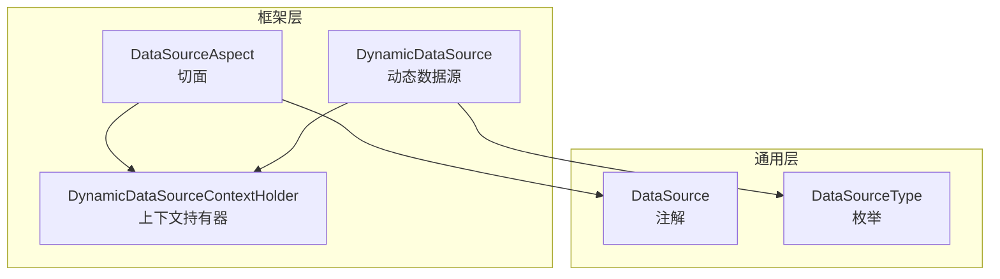
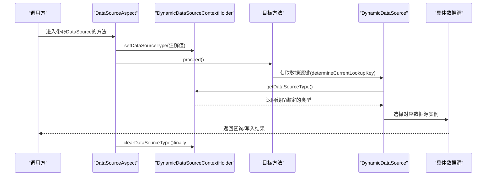
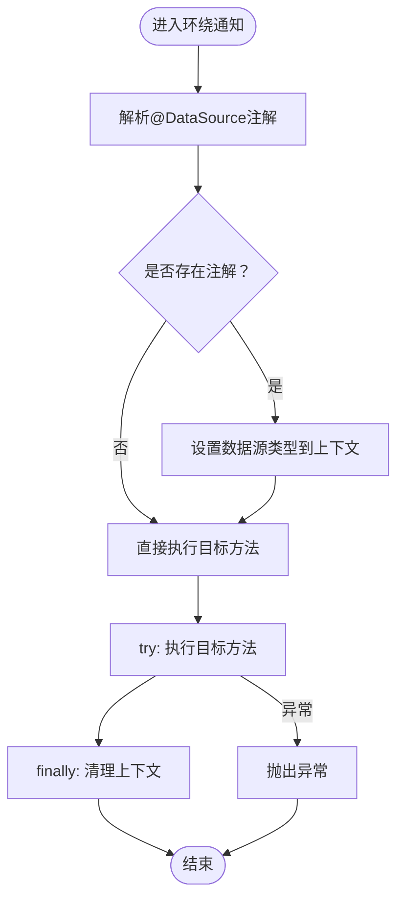
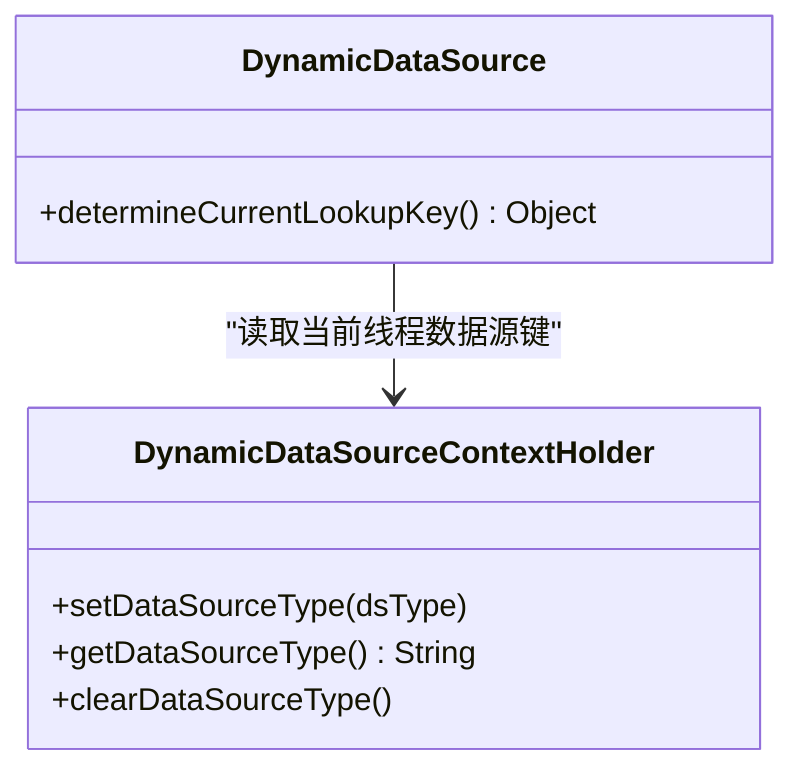
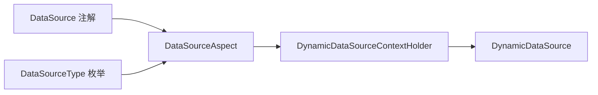

# 数据源切换切面

<cite>
**本文引用的文件**
- [DataSourceAspect.java](file://XingChen-Vue/xingchen-framework/src/main/java/com/xingchen/framework/aspectj/DataSourceAspect.java)
- [DynamicDataSource.java](file://XingChen-Vue/xingchen-framework/src/main/java/com/xingchen/framework/datasource/DynamicDataSource.java)
- [DynamicDataSourceContextHolder.java](file://XingChen-Vue/xingchen-framework/src/main/java/com/xingchen/framework/datasource/DynamicDataSourceContextHolder.java)
- [DataSource.java](file://XingChen-Vue/xingchen-common/src/main/java/com/xingchen/common/annotation/DataSource.java)
- [DataSourceType.java](file://XingChen-Vue/xingchen-common/src/main/java/com/xingchen/common/enums/DataSourceType.java)
</cite>

## 目录
1. [简介](#简介)
2. [项目结构](#项目结构)
3. [核心组件](#核心组件)
4. [架构总览](#架构总览)
5. [详细组件分析](#详细组件分析)
6. [依赖关系分析](#依赖关系分析)
7. [性能考量](#性能考量)
8. [故障排查指南](#故障排查指南)
9. [结论](#结论)
10. [附录](#附录)

## 简介
本文件围绕“数据源切换切面”展开，系统性阐述 DataSourceAspect 如何通过注解驱动实现多数据源的动态切换，涵盖注解解析策略、数据源上下文管理、事务处理注意事项、异常处理机制、与 DynamicDataSource 的集成方式、连接池管理与性能影响，并提供多数据源配置示例、典型使用场景与最佳实践建议。

## 项目结构
该功能涉及三个主要模块：
- 切面层：负责在目标方法执行前后进行数据源切换与清理
- 注解与枚举：定义可声明式切换数据源的注解及可用数据源类型
- 动态数据源路由：根据上下文选择具体数据源实例

图表来源
- [DataSourceAspect.java:1-73](file://XingChen-Vue/xingchen-framework/src/main/java/com/xingchen/framework/aspectj/DataSourceAspect.java#L1-L73)
- [DynamicDataSource.java:1-26](file://XingChen-Vue/xingchen-framework/src/main/java/com/xingchen/framework/datasource/DynamicDataSource.java#L1-L26)
- [DynamicDataSourceContextHolder.java:1-46](file://XingChen-Vue/xingchen-framework/src/main/java/com/xingchen/framework/datasource/DynamicDataSourceContextHolder.java#L1-L46)
- [DataSource.java:1-29](file://XingChen-Vue/xingchen-common/src/main/java/com/xingchen/common/annotation/DataSource.java#L1-L29)
- [DataSourceType.java:1-20](file://XingChen-Vue/xingchen-common/src/main/java/com/xingchen/common/enums/DataSourceType.java#L1-L20)

章节来源
- [DataSourceAspect.java:18-73](file://XingChen-Vue/xingchen-framework/src/main/java/com/xingchen/framework/aspectj/DataSourceAspect.java#L18-L73)
- [DynamicDataSource.java:7-26](file://XingChen-Vue/xingchen-framework/src/main/java/com/xingchen/framework/datasource/DynamicDataSource.java#L7-L26)
- [DynamicDataSourceContextHolder.java:6-46](file://XingChen-Vue/xingchen-framework/src/main/java/com/xingchen/framework/datasource/DynamicDataSourceContextHolder.java#L6-L46)
- [DataSource.java:11-29](file://XingChen-Vue/xingchen-common/src/main/java/com/xingchen/common/annotation/DataSource.java#L11-L29)
- [DataSourceType.java:3-20](file://XingChen-Vue/xingchen-common/src/main/java/com/xingchen/common/enums/DataSourceType.java#L3-L20)

## 核心组件
- DataSourceAspect：基于 AspectJ 的环绕通知，拦截带有 @DataSource 的方法或类，在进入目标方法前设置数据源类型，在方法执行完成后清理上下文，确保线程安全与资源回收。
- DataSource 注解：用于声明式切换数据源，支持方法级与类级生效，方法优先于类。
- DataSourceType 枚举：定义可用的数据源类型（主库、从库）。
- DynamicDataSource：继承 Spring 的 AbstractRoutingDataSource，运行时根据当前线程上下文返回对应数据源。
- DynamicDataSourceContextHolder：使用 ThreadLocal 维护每个线程的数据源类型，保证并发安全。

章节来源
- [DataSourceAspect.java:23-73](file://XingChen-Vue/xingchen-framework/src/main/java/com/xingchen/framework/aspectj/DataSourceAspect.java#L23-L73)
- [DataSource.java:18-29](file://XingChen-Vue/xingchen-common/src/main/java/com/xingchen/common/annotation/DataSource.java#L18-L29)
- [DataSourceType.java:8-20](file://XingChen-Vue/xingchen-common/src/main/java/com/xingchen/common/enums/DataSourceType.java#L8-L20)
- [DynamicDataSource.java:12-26](file://XingChen-Vue/xingchen-framework/src/main/java/com/xingchen/framework/datasource/DynamicDataSource.java#L12-L26)
- [DynamicDataSourceContextHolder.java:11-46](file://XingChen-Vue/xingchen-framework/src/main/java/com/xingchen/framework/datasource/DynamicDataSourceContextHolder.java#L11-L46)

## 架构总览
下图展示了从请求进入切面，到动态数据源路由，再到具体数据源实例的完整链路。

图表来源
- [DataSourceAspect.java:37-56](file://XingChen-Vue/xingchen-framework/src/main/java/com/xingchen/framework/aspectj/DataSourceAspect.java#L37-L56)
- [DynamicDataSource.java:21-25](file://XingChen-Vue/xingchen-framework/src/main/java/com/xingchen/framework/datasource/DynamicDataSource.java#L21-L25)
- [DynamicDataSourceContextHolder.java:24-44](file://XingChen-Vue/xingchen-framework/src/main/java/com/xingchen/framework/datasource/DynamicDataSourceContextHolder.java#L24-L44)

## 详细组件分析

### DataSourceAspect：注解解析与切换时机
- 切点定义：同时匹配方法级与类级的 @DataSource 注解。
- 注解解析顺序：优先取方法上的注解；若无，则回退到类上的注解。
- 切换时机：
  - 进入目标方法前：根据注解值设置数据源类型到上下文。
  - 方法执行完毕后：无论成功或异常，finally 中清理上下文，避免线程复用导致的数据源泄漏。
- 异常处理：捕获目标方法抛出的所有异常并向上抛出，确保 finally 清理逻辑仍被执行。

图表来源
- [DataSourceAspect.java:37-56](file://XingChen-Vue/xingchen-framework/src/main/java/com/xingchen/framework/aspectj/DataSourceAspect.java#L37-L56)
- [DataSourceAspect.java:58-71](file://XingChen-Vue/xingchen-framework/src/main/java/com/xingchen/framework/aspectj/DataSourceAspect.java#L58-L71)

章节来源
- [DataSourceAspect.java:30-35](file://XingChen-Vue/xingchen-framework/src/main/java/com/xingchen/framework/aspectj/DataSourceAspect.java#L30-L35)
- [DataSourceAspect.java:37-56](file://XingChen-Vue/xingchen-framework/src/main/java/com/xingchen/framework/aspectj/DataSourceAspect.java#L37-L56)
- [DataSourceAspect.java:58-71](file://XingChen-Vue/xingchen-framework/src/main/java/com/xingchen/framework/aspectj/DataSourceAspect.java#L58-L71)

### DataSource 注解与 DataSourceType 枚举
- 注解特性：
  - 作用范围：方法与类级别
  - 继承性：可被子类继承
  - 默认值：主库
  - 优先级：方法 > 类
- 枚举类型：
  - MASTER：主库（写操作）
  - SLAVE：从库（读操作）

章节来源
- [DataSource.java:18-29](file://XingChen-Vue/xingchen-common/src/main/java/com/xingchen/common/annotation/DataSource.java#L18-L29)
- [DataSourceType.java:8-20](file://XingChen-Vue/xingchen-common/src/main/java/com/xingchen/common/enums/DataSourceType.java#L8-L20)

### DynamicDataSource 与 DynamicDataSourceContextHolder：上下文路由
- DynamicDataSourceContextHolder：
  - 使用 ThreadLocal 保存每个线程的数据源类型键
  - 提供设置、获取、清理方法，确保线程隔离与内存释放
- DynamicDataSource：
  - 继承 AbstractRoutingDataSource
  - determineCurrentLookupKey 返回当前线程上下文中的键
  - Spring 在每次数据访问时调用该方法决定使用哪个目标数据源

图表来源
- [DynamicDataSourceContextHolder.java:24-44](file://XingChen-Vue/xingchen-framework/src/main/java/com/xingchen/framework/datasource/DynamicDataSourceContextHolder.java#L24-L44)
- [DynamicDataSource.java:21-25](file://XingChen-Vue/xingchen-framework/src/main/java/com/xingchen/framework/datasource/DynamicDataSource.java#L21-L25)

章节来源
- [DynamicDataSourceContextHolder.java:11-46](file://XingChen-Vue/xingchen-framework/src/main/java/com/xingchen/framework/datasource/DynamicDataSourceContextHolder.java#L11-L46)
- [DynamicDataSource.java:12-26](file://XingChen-Vue/xingchen-framework/src/main/java/com/xingchen/framework/datasource/DynamicDataSource.java#L12-L26)

### 与 Spring 事务的集成与注意事项
- 事务边界：Spring 事务通常在目标方法外部开启，因此在事务中使用数据源切换需特别注意：
  - 若在事务开启后才切换数据源，可能无法生效或导致跨数据源事务问题
  - 建议在事务开始前完成数据源切换决策
- 建议：
  - 将 @DataSource 放置在事务方法的入口处
  - 对只读查询使用从库，写操作使用主库
  - 避免在同一事务内频繁切换数据源

章节来源
- [DataSourceAspect.java:37-56](file://XingChen-Vue/xingchen-framework/src/main/java/com/xingchen/framework/aspectj/DataSourceAspect.java#L37-L56)
- [DataSource.java:14-14](file://XingChen-Vue/xingchen-common/src/main/java/com/xingchen/common/annotation/DataSource.java#L14-L14)

### 异常处理机制
- 切面层：
  - 目标方法执行失败时，异常会向上抛出
  - finally 块确保上下文清理，防止线程复用造成的数据源污染
- 日志记录：
  - 上下文持有器在设置数据源类型时会输出日志，便于追踪切换行为

章节来源
- [DataSourceAspect.java:47-55](file://XingChen-Vue/xingchen-framework/src/main/java/com/xingchen/framework/aspectj/DataSourceAspect.java#L47-L55)
- [DynamicDataSourceContextHolder.java:26-26](file://XingChen-Vue/xingchen-framework/src/main/java/com/xingchen/framework/datasource/DynamicDataSourceContextHolder.java#L26-L26)

## 依赖关系分析
- DataSourceAspect 依赖：
  - DataSource 注解：用于识别切换点
  - DynamicDataSourceContextHolder：用于设置/清理上下文
- DynamicDataSource 依赖：
  - DynamicDataSourceContextHolder：用于获取当前线程的键
  - DataSourceType：作为键的枚举值（通过注解传入）

图表来源
- [DataSourceAspect.java:14-16](file://XingChen-Vue/xingchen-framework/src/main/java/com/xingchen/framework/aspectj/DataSourceAspect.java#L14-L16)
- [DataSource.java:9-27](file://XingChen-Vue/xingchen-common/src/main/java/com/xingchen/common/annotation/DataSource.java#L9-L27)
- [DataSourceType.java:8-19](file://XingChen-Vue/xingchen-common/src/main/java/com/xingchen/common/enums/DataSourceType.java#L8-L19)
- [DynamicDataSourceContextHolder.java:24-35](file://XingChen-Vue/xingchen-framework/src/main/java/com/xingchen/framework/datasource/DynamicDataSourceContextHolder.java#L24-L35)
- [DynamicDataSource.java:24-24](file://XingChen-Vue/xingchen-framework/src/main/java/com/xingchen/framework/datasource/DynamicDataSource.java#L24-L24)

章节来源
- [DataSourceAspect.java:14-16](file://XingChen-Vue/xingchen-framework/src/main/java/com/xingchen/framework/aspectj/DataSourceAspect.java#L14-L16)
- [DynamicDataSource.java:21-25](file://XingChen-Vue/xingchen-framework/src/main/java/com/xingchen/framework/datasource/DynamicDataSource.java#L21-L25)

## 性能考量
- 线程局部存储：ThreadLocal 访问开销极低，适合高频切换场景
- 切面开销：仅在方法执行前后进行上下文设置/清理，对整体性能影响有限
- 连接池管理：
  - 不同数据源应配置独立连接池，避免共享连接池带来的锁竞争
  - 从库可配置多个实例，结合负载均衡提升读扩展性
- 缓存与热点：尽量减少频繁切换，合并读请求至同一从库，降低上下文切换次数

## 故障排查指南
- 现象：切换无效
  - 检查是否正确放置 @DataSource 注解（方法优先于类）
  - 确认注解值与已注册的目标数据源键一致
- 现象：线程复用导致数据源污染
  - 确保 finally 中清理逻辑未被吞掉异常
  - 避免在异步任务中复用主线程上下文
- 现象：事务内切换不生效
  - 将数据源切换置于事务开启之前
  - 避免在同一事务中频繁切换主从库
- 现象：日志未显示切换
  - 检查日志级别与上下文持有器的日志输出位置

章节来源
- [DataSourceAspect.java:47-55](file://XingChen-Vue/xingchen-framework/src/main/java/com/xingchen/framework/aspectj/DataSourceAspect.java#L47-L55)
- [DynamicDataSourceContextHolder.java:26-26](file://XingChen-Vue/xingchen-framework/src/main/java/com/xingchen/framework/datasource/DynamicDataSourceContextHolder.java#L26-L26)

## 结论
该数据源切换切面通过注解与 ThreadLocal 实现轻量、可控的多数据源动态切换，配合 DynamicDataSource 的路由机制，能够满足读写分离与高可用需求。遵循“方法优先、事务前置、连接池隔离”的原则，可在保证性能的同时提升系统的可维护性与扩展性。

## 附录

### 多数据源配置示例（步骤说明）
- 定义多个数据源 Bean（主库与从库），并注册为目标数据源映射项
- 构造 DynamicDataSource，注入默认数据源与目标数据源映射
- 在业务方法上使用 @DataSource 指定数据源类型（MASTER/SLAVE）
- 确保事务边界与数据源切换时机合理安排

章节来源
- [DynamicDataSource.java:14-19](file://XingChen-Vue/xingchen-framework/src/main/java/com/xingchen/framework/datasource/DynamicDataSource.java#L14-L19)
- [DataSource.java:27-27](file://XingChen-Vue/xingchen-common/src/main/java/com/xingchen/common/annotation/DataSource.java#L27-L27)

### 典型使用场景
- 读写分离：查询走从库，写入走主库
- 并发读扩展：多个从库分担读压力
- 灾难恢复：按需切换到备用数据源

### 最佳实践
- 明确标注方法的读写属性，避免误用
- 控制切换频率，批量读请求合并
- 为不同数据源配置独立连接池与监控指标
- 在分布式环境下，确保上下文传递（如使用透传头或框架支持）