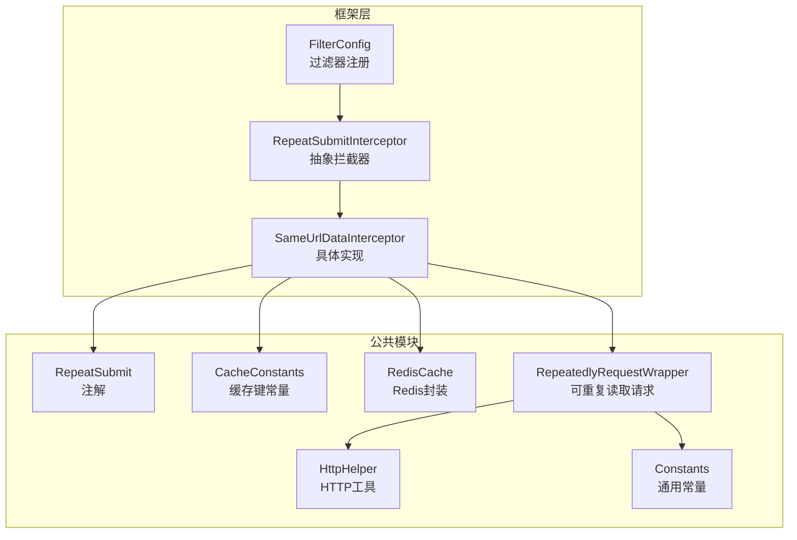
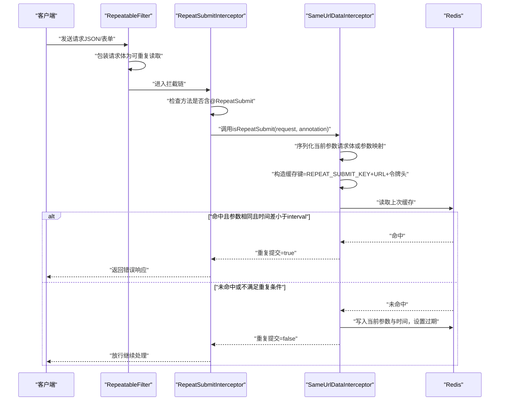
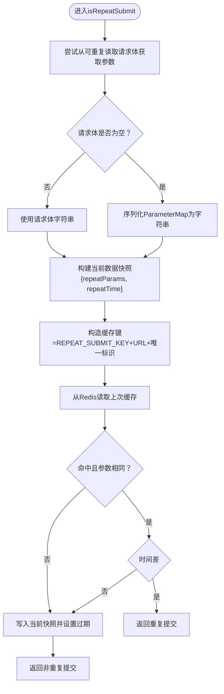
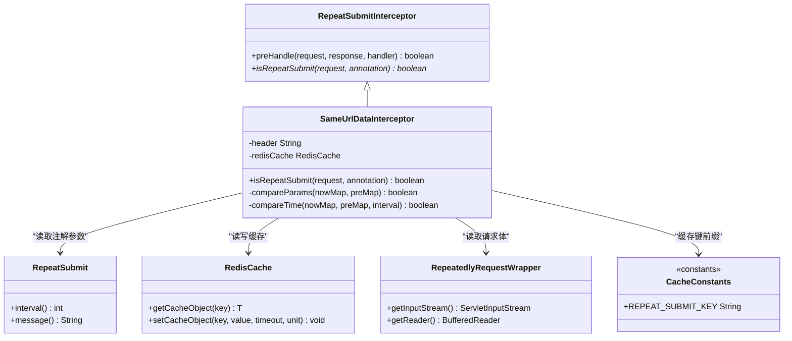

# 重复提交拦截器

<cite>
**本文引用的文件**
- [RepeatSubmitInterceptor.java](file://XingChen-Vue/xingchen-framework/src/main/java/com/xingchen/framework/interceptor/RepeatSubmitInterceptor.java)
- [SameUrlDataInterceptor.java](file://XingChen-Vue/xingchen-framework/src/main/java/com/xingchen/framework/interceptor/impl/SameUrlDataInterceptor.java)
- [RepeatSubmit.java](file://XingChen-Vue/xingchen-common/src/main/java/com/xingchen/common/annotation/RepeatSubmit.java)
- [CacheConstants.java](file://XingChen-Vue/xingchen-common/src/main/java/com/xingchen/common/constant/CacheConstants.java)
- [RedisCache.java](file://XingChen-Vue/xingchen-common/src/main/java/com/xingchen/common/core/redis/RedisCache.java)
- [RepeatedlyRequestWrapper.java](file://XingChen-Vue/xingchen-common/src/main/java/com/xingchen/common/filter/RepeatedlyRequestWrapper.java)
- [HttpHelper.java](file://XingChen-Vue/xingchen-common/src/main/java/com/xingchen/common/utils/http/HttpHelper.java)
- [Constants.java](file://XingChen-Vue/xingchen-common/src/main/java/com/xingchen/common/constant/Constants.java)
- [FilterConfig.java](file://XingChen-Vue/xingchen-framework/src/main/java/com/xingchen/framework/config/FilterConfig.java)
</cite>

## 目录
1. [简介](#简介)
2. [项目结构](#项目结构)
3. [核心组件](#核心组件)
4. [架构总览](#架构总览)
5. [详细组件分析](#详细组件分析)
6. [依赖关系分析](#依赖关系分析)
7. [性能考量](#性能考量)
8. [故障排查指南](#故障排查指南)
9. [结论](#结论)
10. [附录](#附录)

## 简介
本文件系统性阐述重复提交拦截器的设计与实现，重点覆盖以下内容：
- RepeatSubmitInterceptor 抽象拦截器如何统一接入控制器层的重复提交检测。
- SameUrlDataInterceptor 的 URL 去重、参数哈希（字符串化）与时间戳验证机制。
- URL 匹配算法、参数序列化策略与 Redis 缓存键设计。
- 重复提交检测原理、防抖动（时间窗口）机制与用户体验优化建议。
- 拦截器配置方式、自定义策略与调试方法。

## 项目结构
重复提交相关能力分布在框架与公共模块中，关键文件如下：
- 拦截器抽象与实现：framework/interceptor 与 framework/interceptor/impl
- 注解定义：common/annotation
- 缓存常量与 Redis 封装：common/constant 与 common/core/redis
- 可重复读取请求包装：common/filter
- HTTP 工具与通用常量：common/utils/http 与 common/constant
- 过滤器注册：framework/config

图表来源
- [RepeatSubmitInterceptor.java:1-57](file://XingChen-Vue/xingchen-framework/src/main/java/com/xingchen/framework/interceptor/RepeatSubmitInterceptor.java#L1-L57)
- [SameUrlDataInterceptor.java:1-111](file://XingChen-Vue/xingchen-framework/src/main/java/com/xingchen/framework/interceptor/impl/SameUrlDataInterceptor.java#L1-L111)
- [FilterConfig.java:68-78](file://XingChen-Vue/xingchen-framework/src/main/java/com/xingchen/framework/config/FilterConfig.java#L68-L78)
- [RepeatSubmit.java:1-32](file://XingChen-Vue/xingchen-common/src/main/java/com/xingchen/common/annotation/RepeatSubmit.java#L1-L32)
- [CacheConstants.java:30-34](file://XingChen-Vue/xingchen-common/src/main/java/com/xingchen/common/constant/CacheConstants.java#L30-L34)
- [RedisCache.java:105-109](file://XingChen-Vue/xingchen-common/src/main/java/com/xingchen/common/core/redis/RedisCache.java#L105-L109)
- [RepeatedlyRequestWrapper.java:20-31](file://XingChen-Vue/xingchen-common/src/main/java/com/xingchen/common/filter/RepeatedlyRequestWrapper.java#L20-L31)
- [HttpHelper.java:22-54](file://XingChen-Vue/xingchen-common/src/main/java/com/xingchen/common/utils/http/HttpHelper.java#L22-L54)
- [Constants.java:14-16](file://XingChen-Vue/xingchen-common/src/main/java/com/xingchen/common/constant/Constants.java#L14-L16)

章节来源
- [RepeatSubmitInterceptor.java:14-56](file://XingChen-Vue/xingchen-framework/src/main/java/com/xingchen/framework/interceptor/RepeatSubmitInterceptor.java#L14-L56)
- [SameUrlDataInterceptor.java:19-85](file://XingChen-Vue/xingchen-framework/src/main/java/com/xingchen/framework/interceptor/impl/SameUrlDataInterceptor.java#L19-L85)
- [FilterConfig.java:68-78](file://XingChen-Vue/xingchen-framework/src/main/java/com/xingchen/framework/config/FilterConfig.java#L68-L78)

## 核心组件
- RepeatSubmitInterceptor：基于 Spring MVC HandlerInterceptor 的抽象拦截器，负责扫描控制器方法上的 @RepeatSubmit 注解并调用子类的具体检测逻辑。
- SameUrlDataInterceptor：具体实现，按“URL + 唯一标识（令牌头）”生成缓存键，比较当前请求参数与上次缓存的参数字符串与时间差，判定是否重复提交。
- RepeatSubmit 注解：定义时间间隔与提示消息两个属性，用于控制检测窗口与错误提示。
- RedisCache：提供 Redis 基本操作，SameUrlDataInterceptor 使用其进行缓存读写与过期设置。
- RepeatedlyRequestWrapper：对 JSON 请求体进行可重复读取的包装，确保能多次读取请求体以提取参数。
- HttpHelper：从 ServletRequest 中读取请求体字符串。
- CacheConstants：统一的 Redis 缓存键前缀，便于命名空间隔离与清理。
- FilterConfig：注册 RepeatableFilter，使其在所有请求上生效，为 JSON 请求体提供可重复读取能力。

章节来源
- [RepeatSubmitInterceptor.java:14-56](file://XingChen-Vue/xingchen-framework/src/main/java/com/xingchen/framework/interceptor/RepeatSubmitInterceptor.java#L14-L56)
- [SameUrlDataInterceptor.java:19-111](file://XingChen-Vue/xingchen-framework/src/main/java/com/xingchen/framework/interceptor/impl/SameUrlDataInterceptor.java#L19-L111)
- [RepeatSubmit.java:20-32](file://XingChen-Vue/xingchen-common/src/main/java/com/xingchen/common/annotation/RepeatSubmit.java#L20-L32)
- [RedisCache.java:34-50](file://XingChen-Vue/xingchen-common/src/main/java/com/xingchen/common/core/redis/RedisCache.java#L34-L50)
- [RepeatedlyRequestWrapper.java:20-31](file://XingChen-Vue/xingchen-common/src/main/java/com/xingchen/common/filter/RepeatedlyRequestWrapper.java#L20-L31)
- [HttpHelper.java:22-54](file://XingChen-Vue/xingchen-common/src/main/java/com/xingchen/common/utils/http/HttpHelper.java#L22-L54)
- [CacheConstants.java:30-34](file://XingChen-Vue/xingchen-common/src/main/java/com/xingchen/common/constant/CacheConstants.java#L30-L34)
- [FilterConfig.java:68-78](file://XingChen-Vue/xingchen-framework/src/main/java/com/xingchen/framework/config/FilterConfig.java#L68-L78)

## 架构总览
重复提交拦截器的工作流程如下：
- 控制器方法通过 @RepeatSubmit 注解声明启用重复提交检测。
- 拦截器在 preHandle 阶段读取注解参数，委托子类 isRepeatSubmit 判定。
- SameUrlDataInterceptor 会：
  - 从可重复读取的请求体或参数映射中序列化当前请求数据。
  - 以 URL + 令牌头（唯一标识）拼接缓存键。
  - 从 Redis 读取上次缓存，比较参数字符串与时间差。
  - 若重复则返回错误响应，否则写入当前数据与过期时间。

图表来源
- [FilterConfig.java:68-78](file://XingChen-Vue/xingchen-framework/src/main/java/com/xingchen/framework/config/FilterConfig.java#L68-L78)
- [RepeatSubmitInterceptor.java:22-45](file://XingChen-Vue/xingchen-framework/src/main/java/com/xingchen/framework/interceptor/RepeatSubmitInterceptor.java#L22-L45)
- [SameUrlDataInterceptor.java:40-85](file://XingChen-Vue/xingchen-framework/src/main/java/com/xingchen/framework/interceptor/impl/SameUrlDataInterceptor.java#L40-L85)
- [RedisCache.java:105-109](file://XingChen-Vue/xingchen-common/src/main/java/com/xingchen/common/core/redis/RedisCache.java#L105-L109)

## 详细组件分析

### RepeatSubmitInterceptor 抽象拦截器
- 职责：统一拦截入口，扫描控制器方法上的 @RepeatSubmit 注解，调用子类 isRepeatSubmit 判定是否重复提交。
- 关键点：
  - 仅对 HandlerMethod 生效，非控制器处理器直接放行。
  - 当检测到重复提交时，构造错误响应并通过 Servlet 输出。
- 设计意义：将“注解声明 + 统一拦截 + 子类差异化策略”的模式解耦，便于扩展更多检测策略。

章节来源
- [RepeatSubmitInterceptor.java:22-45](file://XingChen-Vue/xingchen-framework/src/main/java/com/xingchen/framework/interceptor/RepeatSubmitInterceptor.java#L22-L45)
- [RepeatSubmitInterceptor.java:47-56](file://XingChen-Vue/xingchen-framework/src/main/java/com/xingchen/framework/interceptor/RepeatSubmitInterceptor.java#L47-L56)

### SameUrlDataInterceptor 具体实现
- URL 去重与唯一标识：
  - URL：使用 requestURI 作为 URL 去重维度。
  - 唯一标识：默认从请求头 ${token.header} 读取，若为空则回退到 URL。
  - 缓存键：CacheConstants.REPEAT_SUBMIT_KEY + URL + 唯一标识。
- 参数序列化：
  - 优先从可重复读取的请求体中读取字符串；若为空则序列化 request.getParameterMap()。
  - 将参数字符串与当前时间毫秒数组成 Map，作为本次数据快照。
- 时间戳验证：
  - 从 Redis 读取上次缓存，若存在且参数字符串相同且时间差小于注解 interval，则判定为重复提交。
- 缓存写入：
  - 将当前数据快照写入 Redis，并设置过期时间为注解 interval（毫秒）。

图表来源
- [SameUrlDataInterceptor.java:40-85](file://XingChen-Vue/xingchen-framework/src/main/java/com/xingchen/framework/interceptor/impl/SameUrlDataInterceptor.java#L40-L85)
- [CacheConstants.java:30-34](file://XingChen-Vue/xingchen-common/src/main/java/com/xingchen/common/constant/CacheConstants.java#L30-L34)
- [RedisCache.java:105-109](file://XingChen-Vue/xingchen-common/src/main/java/com/xingchen/common/core/redis/RedisCache.java#L105-L109)

章节来源
- [SameUrlDataInterceptor.java:19-111](file://XingChen-Vue/xingchen-framework/src/main/java/com/xingchen/framework/interceptor/impl/SameUrlDataInterceptor.java#L19-L111)

### RepeatSubmit 注解
- 属性：
  - interval：时间间隔（毫秒），小于此时间视为重复提交。
  - message：重复提交时的提示消息。
- 使用方式：在控制器方法上标注该注解以启用重复提交检测。

章节来源
- [RepeatSubmit.java:20-32](file://XingChen-Vue/xingchen-common/src/main/java/com/xingchen/common/annotation/RepeatSubmit.java#L20-L32)

### Redis 缓存与键设计
- 缓存键前缀：CacheConstants.REPEAT_SUBMIT_KEY，避免与其他缓存键冲突。
- 写入策略：使用 RedisCache.setCacheObject(key, value, timeout, TimeUnit.MILLISECONDS) 设置过期时间。
- 读取策略：使用 RedisCache.getCacheObject(key) 获取上次缓存。

章节来源
- [CacheConstants.java:30-34](file://XingChen-Vue/xingchen-common/src/main/java/com/xingchen/common/constant/CacheConstants.java#L30-L34)
- [RedisCache.java:34-50](file://XingChen-Vue/xingchen-common/src/main/java/com/xingchen/common/core/redis/RedisCache.java#L34-L50)
- [RedisCache.java:105-109](file://XingChen-Vue/xingchen-common/src/main/java/com/xingchen/common/core/redis/RedisCache.java#L105-L109)

### 请求体可重复读取与参数序列化
- RepeatedlyRequestWrapper：在构造时读取原始请求体字节，提供可重复读取的 InputStream 与 Reader。
- HttpHelper：从 ServletRequest 中读取请求体字符串，支持 UTF-8。
- 参数序列化：当请求体为空时，序列化 request.getParameterMap() 为字符串，保证参数比较的稳定性。

章节来源
- [RepeatedlyRequestWrapper.java:20-31](file://XingChen-Vue/xingchen-common/src/main/java/com/xingchen/common/filter/RepeatedlyRequestWrapper.java#L20-L31)
- [HttpHelper.java:22-54](file://XingChen-Vue/xingchen-common/src/main/java/com/xingchen/common/utils/http/HttpHelper.java#L22-L54)

### URL 匹配算法与缓存策略
- URL 匹配：以 requestURI 作为 URL 去重维度，确保同一接口的不同查询参数不影响重复判断。
- 唯一标识：默认从请求头 ${token.header} 读取，若为空则回退到 URL，避免多用户场景下的误判。
- 缓存结构：Redis 中存储 Map，键为 URL，值为本次数据快照（参数字符串 + 时间戳）。
- 过期策略：根据注解 interval 设置过期时间，避免缓存无限增长。

章节来源
- [SameUrlDataInterceptor.java:59-84](file://XingChen-Vue/xingchen-framework/src/main/java/com/xingchen/framework/interceptor/impl/SameUrlDataInterceptor.java#L59-L84)
- [CacheConstants.java:30-34](file://XingChen-Vue/xingchen-common/src/main/java/com/xingchen/common/constant/CacheConstants.java#L30-L34)

### 重复提交检测原理与防抖动机制
- 检测原理：比较“当前请求参数字符串”与“上次缓存参数字符串”，并校验“当前时间与上次时间差”是否小于 interval。
- 防抖动机制：通过 interval 时间窗口限制重复提交，既可避免用户手抖导致的重复点击，又不会过度阻断正常请求。
- 用户体验优化：在前端可禁用提交按钮、显示倒计时提示，结合后端的 interval 控制，显著降低误判率。

章节来源
- [SameUrlDataInterceptor.java:87-109](file://XingChen-Vue/xingchen-framework/src/main/java/com/xingchen/framework/interceptor/impl/SameUrlDataInterceptor.java#L87-L109)
- [RepeatSubmit.java:22-25](file://XingChen-Vue/xingchen-common/src/main/java/com/xingchen/common/annotation/RepeatSubmit.java#L22-L25)

### 拦截器配置与注册
- 过滤器注册：FilterConfig 中注册 RepeatableFilter，对所有请求启用可重复读取能力。
- 拦截器生效：RepeatSubmitInterceptor 作为 HandlerInterceptor，需在 Spring MVC 配置中注册（通常通过组件扫描自动装配）。
- 注意事项：确保 RepeatableFilter 在拦截器之前执行，以便拦截器能读取到已包装的请求体。

章节来源
- [FilterConfig.java:68-78](file://XingChen-Vue/xingchen-framework/src/main/java/com/xingchen/framework/config/FilterConfig.java#L68-L78)
- [RepeatSubmitInterceptor.java:22-45](file://XingChen-Vue/xingchen-framework/src/main/java/com/xingchen/framework/interceptor/RepeatSubmitInterceptor.java#L22-L45)

### 自定义策略与扩展
- 新增检测策略：继承 RepeatSubmitInterceptor 并实现 isRepeatSubmit，例如基于 IP + URL + 参数指纹的组合策略。
- 调整时间窗口：通过 @RepeatSubmit 的 interval 属性微调检测灵敏度。
- 自定义提示消息：通过 @RepeatSubmit 的 message 属性定制错误提示。
- 缓存键扩展：可在 CacheConstants 中新增前缀，区分不同业务域的重复提交缓存。

章节来源
- [RepeatSubmitInterceptor.java:47-56](file://XingChen-Vue/xingchen-framework/src/main/java/com/xingchen/framework/interceptor/RepeatSubmitInterceptor.java#L47-L56)
- [RepeatSubmit.java:22-31](file://XingChen-Vue/xingchen-common/src/main/java/com/xingchen/common/annotation/RepeatSubmit.java#L22-L31)
- [CacheConstants.java:30-34](file://XingChen-Vue/xingchen-common/src/main/java/com/xingchen/common/constant/CacheConstants.java#L30-L34)

### 调试方法
- 开启日志：关注 HttpHelper 与 RepeatedlyRequestWrapper 的异常日志，定位请求体读取问题。
- Redis 调试：使用 Redis 客户端查看 CacheConstants.REPEAT_SUBMIT_KEY 前缀下的键，确认缓存结构与过期时间。
- 参数核对：在 SameUrlDataInterceptor 中打印当前参数字符串与上次参数字符串，核对序列化差异。
- 时间窗口验证：调整 @RepeatSubmit 的 interval，观察重复提交判定的变化趋势。

章节来源
- [HttpHelper.java:35-38](file://XingChen-Vue/xingchen-common/src/main/java/com/xingchen/common/utils/http/HttpHelper.java#L35-L38)
- [RedisCache.java:105-109](file://XingChen-Vue/xingchen-common/src/main/java/com/xingchen/common/core/redis/RedisCache.java#L105-L109)
- [SameUrlDataInterceptor.java:87-109](file://XingChen-Vue/xingchen-framework/src/main/java/com/xingchen/framework/interceptor/impl/SameUrlDataInterceptor.java#L87-L109)

## 依赖关系分析
- RepeatSubmitInterceptor 依赖：
  - 注解 RepeatSubmit：提供检测参数。
  - AjaxResult 与 ServletUtils：用于输出错误响应。
- SameUrlDataInterceptor 依赖：
  - RepeatedlyRequestWrapper 与 HttpHelper：读取请求体。
  - RedisCache：读写缓存。
  - CacheConstants：缓存键前缀。
  - Constants：字符集常量。
- FilterConfig 依赖：
  - RepeatableFilter：注册可重复读取过滤器。

图表来源
- [RepeatSubmitInterceptor.java:20-56](file://XingChen-Vue/xingchen-framework/src/main/java/com/xingchen/framework/interceptor/RepeatSubmitInterceptor.java#L20-L56)
- [SameUrlDataInterceptor.java:26-111](file://XingChen-Vue/xingchen-framework/src/main/java/com/xingchen/framework/interceptor/impl/SameUrlDataInterceptor.java#L26-L111)
- [RepeatSubmit.java:20-32](file://XingChen-Vue/xingchen-common/src/main/java/com/xingchen/common/annotation/RepeatSubmit.java#L20-L32)
- [RedisCache.java:105-109](file://XingChen-Vue/xingchen-common/src/main/java/com/xingchen/common/core/redis/RedisCache.java#L105-L109)
- [RepeatedlyRequestWrapper.java:20-31](file://XingChen-Vue/xingchen-common/src/main/java/com/xingchen/common/filter/RepeatedlyRequestWrapper.java#L20-L31)
- [CacheConstants.java:30-34](file://XingChen-Vue/xingchen-common/src/main/java/com/xingchen/common/constant/CacheConstants.java#L30-L34)

章节来源
- [RepeatSubmitInterceptor.java:20-56](file://XingChen-Vue/xingchen-framework/src/main/java/com/xingchen/framework/interceptor/RepeatSubmitInterceptor.java#L20-L56)
- [SameUrlDataInterceptor.java:26-111](file://XingChen-Vue/xingchen-framework/src/main/java/com/xingchen/framework/interceptor/impl/SameUrlDataInterceptor.java#L26-L111)

## 性能考量
- Redis 访问：每次请求均有一次读写操作，建议合理设置 interval，避免频繁缓存更新。
- 参数序列化：参数字符串比较为 O(n) 复杂度，建议控制参数规模与长度，避免过长参数影响性能。
- 过期时间：interval 即为缓存过期时间，应根据业务并发与用户行为特征选择合适值。
- 缓存键数量：URL + 唯一标识组合可能产生大量键，建议定期清理或使用更细粒度的键前缀。

## 故障排查指南
- 请求体为空：确认 RepeatableFilter 是否正确注册并在 JSON 请求上生效。
- 参数比较失败：检查参数序列化策略与字符集（Constants.UTF8）是否一致。
- 缓存未命中：确认 CacheConstants.REPEAT_SUBMIT_KEY 前缀与 Redis 中键一致。
- 时间判定异常：核对系统时间同步与毫秒级时间戳一致性。

章节来源
- [FilterConfig.java:68-78](file://XingChen-Vue/xingchen-framework/src/main/java/com/xingchen/framework/config/FilterConfig.java#L68-L78)
- [Constants.java:14-16](file://XingChen-Vue/xingchen-common/src/main/java/com/xingchen/common/constant/Constants.java#L14-L16)
- [CacheConstants.java:30-34](file://XingChen-Vue/xingchen-common/src/main/java/com/xingchen/common/constant/CacheConstants.java#L30-L34)

## 结论
重复提交拦截器通过“注解声明 + 抽象拦截器 + 具体实现 + Redis 缓存”的组合，实现了对表单重复提交的可靠防护。SameUrlDataInterceptor 的 URL 去重、参数字符串化与时间戳验证三要素协同工作，既能有效拦截重复提交，又能兼顾用户体验。通过合理的 interval 设置、缓存键设计与前端交互优化，可进一步提升系统的稳定性与可用性。

## 附录
- 配置项参考：
  - ${token.header}：用于构造唯一标识的请求头名称。
  - @RepeatSubmit.interval：重复提交检测的时间窗口（毫秒）。
  - @RepeatSubmit.message：重复提交时的提示消息。
- 建议实践：
  - 在高频提交场景下适当增大 interval，减少误判。
  - 对于多用户共享设备场景，务必配置唯一的请求头标识。
  - 前端配合禁用提交按钮与倒计时提示，提升用户体验。